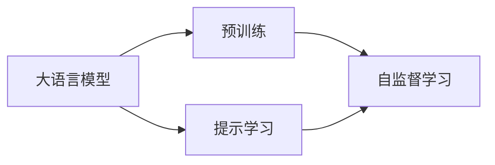
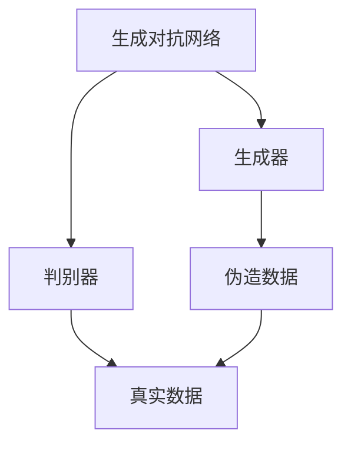
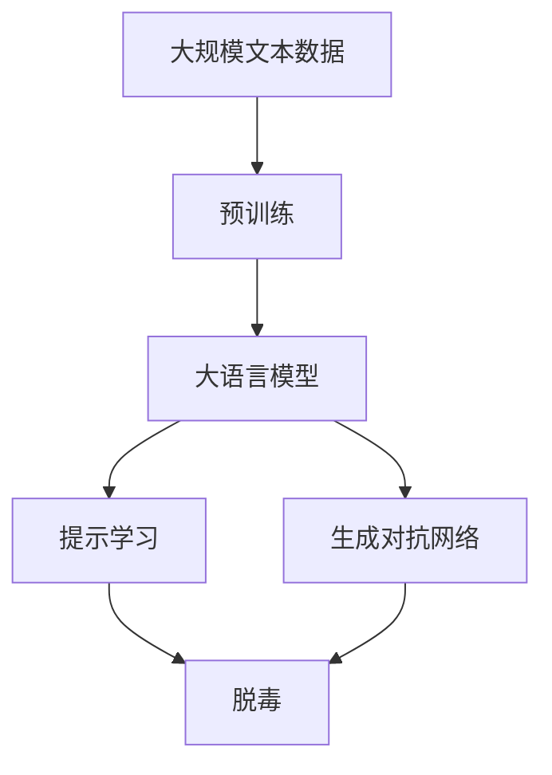

                 

# 大语言模型原理基础与前沿 基于提示的脱毒

> 关键词：大语言模型, 提示学习, 脱毒, 自然语言处理(NLP), 生成对抗网络(GANs), 深度学习

## 1. 背景介绍

### 1.1 问题由来

近年来，自然语言处理(Natural Language Processing, NLP)领域取得了飞速进展，大语言模型在理解和生成自然语言方面取得了显著的成效。这些模型通过在海量文本数据上进行预训练，能够学习到语言的通用表示和丰富的语义知识。然而，由于模型自身的复杂性，大语言模型在实际应用中也暴露出一些问题。例如，生成质量不稳定，尤其是在特定任务上表现不佳，易产生有害内容等。为了提升大语言模型的鲁棒性和适用性，基于提示的脱毒方法应运而生。

### 1.2 问题核心关键点

提示学习（Prompt Learning）是一种通过设计特定的提示模板（Prompt Templates）来引导模型输出的技术，广泛应用于文本生成、机器翻译、问答系统等领域。其核心在于将通用的语言理解能力与特定任务的需求结合，从而在有限的监督数据下也能取得较好的性能。提示学习的关键在于提示模板的设计，通过精心的设计，可以有效地提升模型的性能和鲁棒性。

在脱毒（Detoxification）方面，提示学习同样具有广泛应用前景。通过设计针对性的提示模板，可以引导模型生成无有害信息的文本，从而净化网络环境。这一技术在社交媒体、新闻发布平台等需要管控有害内容的应用场景中具有重要价值。

### 1.3 问题研究意义

基于提示的脱毒方法在提升大语言模型性能的同时，也增强了模型的安全性和可信度，具有重要的研究意义：

1. **提升生成质量**：通过精心的提示设计，可以显著提升模型生成的文本质量，使其更加符合任务需求和用户期望。
2. **净化网络环境**：通过去除有害内容，保障了网络环境的清洁和健康，对社会稳定和公众福祉具有积极作用。
3. **增强模型鲁棒性**：通过提示学习，模型能够在不同应用场景下更好地适应，减少对特定数据分布的依赖，提升模型的泛化能力。
4. **促进多模态应用**：提示学习不仅限于文本生成，还可以扩展到图像、音频等多模态数据的生成和理解，推动多模态NLP技术的发展。
5. **促进伦理与安全研究**：提示学习涉及模型的决策可解释性，有助于研究如何增强模型的伦理性和安全性，避免模型在生成内容时出现偏见和有害信息。

## 2. 核心概念与联系

### 2.1 核心概念概述

为更好地理解基于提示的脱毒方法，本节将介绍几个密切相关的核心概念：

- **大语言模型(Large Language Model, LLM)**：以自回归(如GPT)或自编码(如BERT)模型为代表的大规模预训练语言模型。通过在大规模无标签文本语料上进行预训练，学习通用的语言知识和语义表示。

- **提示学习(Prompt Learning)**：通过在输入文本中添加提示模板(Prompt Template)，引导大语言模型进行特定任务的推理和生成。可以显著提升模型的性能和鲁棒性。

- **生成对抗网络(GANs)**：由生成器和判别器两个部分组成，生成器学习生成与真实数据分布接近的伪造数据，判别器则学习区分真实数据和伪造数据。GANs在图像生成、音频生成等领域有广泛应用。

- **脱毒(Detoxification)**：去除文本中的有害信息，提升文本内容的安全性和合法性。提示学习是一种有效的脱毒手段，可以引导模型生成无有害信息的文本。

- **深度学习(Deep Learning)**：一种基于神经网络的机器学习技术，通过多层非线性变换提取数据的高层次特征，广泛应用于图像、语音、文本等领域。

这些核心概念之间的逻辑关系可以通过以下Mermaid流程图来展示：

```mermaid
graph TB
    A[大语言模型] --> B[预训练]
    A --> C[提示学习]
    C --> D[脱毒]
    C --> E[生成对抗网络(GANs)]
    D --> F[有害内容去除]
    E --> F
```

这个流程图展示了大语言模型的核心概念及其之间的关系：

1. 大语言模型通过预训练获得基础能力。
2. 提示学习是一种不更新模型参数的方法，可以实现零样本或少样本学习。
3. 生成对抗网络可以生成与真实数据分布接近的伪造数据，用于数据增强和对抗训练。
4. 脱毒是一种去除有害信息的技术，可以提升文本内容的安全性。

这些概念共同构成了大语言模型应用的关键技术，使得模型能够更好地适应特定任务和应用场景。

### 2.2 概念间的关系

这些核心概念之间存在着紧密的联系，形成了大语言模型应用的完整生态系统。下面我们通过几个Mermaid流程图来展示这些概念之间的关系。

#### 2.2.1 大语言模型的学习范式



这个流程图展示了大语言模型的三种主要学习范式：预训练、提示学习和脱毒。预训练主要采用自监督学习方法，而提示学习是一种不更新模型参数的方法，可以用于零样本和少样本学习。脱毒则是提示学习在特定领域的应用，用于去除有害内容。

#### 2.2.2 生成对抗网络与大语言模型的结合



这个流程图展示了生成对抗网络的基本结构，其中生成器学习生成与真实数据分布接近的伪造数据，判别器则学习区分真实数据和伪造数据。在脱毒中，生成器可以生成与有害内容相似但不直接的有害文本，判别器则用于筛选这些文本，从而去除有害内容。

#### 2.2.3 提示学习的脱毒效果


这个流程图展示了提示学习在脱毒中的应用。通过设计特定的提示模板，可以引导模型生成无有害信息的文本，从而净化文本内容。

### 2.3 核心概念的整体架构

最后，我们用一个综合的流程图来展示这些核心概念在大语言模型脱毒过程中的整体架构：



这个综合流程图展示了从预训练到脱毒，再到生成对抗网络的完整过程。大语言模型首先在大规模文本数据上进行预训练，然后通过提示学习生成特定任务的无有害内容文本，最终通过生成对抗网络进行进一步净化，提高文本内容的合法性和安全性。 通过这些流程图，我们可以更清晰地理解大语言模型脱毒过程中各个核心概念的关系和作用，为后续深入讨论具体的脱毒方法和技术奠定基础。

## 3. 核心算法原理 & 具体操作步骤
### 3.1 算法原理概述

基于提示的脱毒方法主要通过以下步骤实现：

1. **生成器训练**：使用生成对抗网络（GANs）的生成器，学习生成与有害内容相似的文本。
2. **判别器训练**：使用GANs的判别器，学习区分真实文本和生成文本。
3. **提示设计**：设计特定的提示模板，引导模型生成无有害内容的文本。
4. **模型微调**：使用预训练模型和生成器、判别器进行联合训练，使模型在生成文本时能够有效去除有害内容。

其中，生成器训练和判别器训练是生成对抗网络的基本步骤，提示设计和模型微调则是为了提升大语言模型的脱毒能力。

### 3.2 算法步骤详解

基于提示的脱毒方法的具体操作步骤如下：

**Step 1: 准备预训练模型和数据集**
- 选择合适的预训练语言模型 $M_{\theta}$ 作为初始化参数，如 GPT、BERT 等。
- 准备有害内容数据集 $D_{\text{har}}$，标注有害文本 $(x_i, y_i)$，其中 $y_i \in \{0, 1\}$，1表示该文本是有害的。

**Step 2: 生成器训练**
- 定义生成器网络结构 $G$，使用生成器 $G$ 学习生成与有害内容相似的文本 $G(x)$。
- 训练目标为最小化判别器损失函数 $L_D(G(x), y)$，其中 $L_D$ 为判别器损失函数，$y$ 为判别器的输出。

**Step 3: 判别器训练**
- 定义判别器网络结构 $D$，使用判别器 $D$ 学习区分真实文本和生成文本。
- 训练目标为最大化判别器损失函数 $L_D(x, y)$，其中 $L_D$ 为判别器损失函数，$y$ 为判别器的输出。

**Step 4: 提示设计**
- 根据任务需求，设计特定的提示模板（Prompt Template）。
- 提示模板应尽可能包含任务相关的关键词，引导模型生成符合任务要求的文本。

**Step 5: 模型微调**
- 在提示模板下，使用预训练模型 $M_{\theta}$ 进行微调，更新模型参数 $\theta$。
- 使用预训练模型 $M_{\theta}$ 和生成器 $G$ 的联合训练，最小化总损失函数 $L(\theta, G)$，其中 $L$ 为总损失函数。

**Step 6: 运行评估**
- 在测试集上评估模型性能，使用评估指标（如BLEU、ROUGE等）评估生成的文本质量。
- 使用判别器评估生成的文本是否包含有害内容，筛选出无有害内容的文本。

### 3.3 算法优缺点

基于提示的脱毒方法具有以下优点：
1. **无监督学习**：通过生成器生成有害文本，无需标注数据，减少数据获取成本。
2. **鲁棒性强**：生成器可以生成多种形式的文本，适应不同任务需求。
3. **可解释性**：生成器和判别器的结合使得模型能够更好地理解有害内容的特征，增强模型的可解释性。

同时，该方法也存在一些局限性：
1. **生成质量不稳定**：生成器生成的文本质量不稳定，可能存在一些不符合任务要求的生成文本。
2. **计算成本高**：生成器和判别器的联合训练需要大量计算资源，模型训练时间较长。
3. **依赖提示模板**：提示模板的设计需要一定的经验和技巧，设计不当可能导致模型生成有害内容。

### 3.4 算法应用领域

基于提示的脱毒方法在以下领域具有广泛应用前景：

- **社交媒体**：自动清理社交媒体上的有害内容，如暴力、仇恨言论、虚假信息等，提升平台的用户体验。
- **新闻发布平台**：去除新闻稿件中的虚假信息和有害内容，确保新闻的真实性和合法性。
- **在线教育**：屏蔽网络教育平台上的不良内容，为学生创造一个健康、安全的学习环境。
- **医疗健康**：去除医疗信息中的误导性内容，保障患者和医生的信息安全。
- **金融服务**：筛选出金融领域的虚假广告和欺诈信息，维护市场秩序。
- **娱乐传媒**：去除影视、音乐等娱乐内容中的有害内容，保护观众的身心健康。

这些领域中，有害内容的自动检测和清理对于平台的运营和管理至关重要，基于提示的脱毒方法能够显著提升平台的自动化水平和用户满意度。

## 4. 数学模型和公式 & 详细讲解 & 举例说明
### 4.1 数学模型构建

假设预训练语言模型为 $M_{\theta}:\mathcal{X} \rightarrow \mathcal{Y}$，其中 $\mathcal{X}$ 为输入空间，$\mathcal{Y}$ 为输出空间，$\theta$ 为模型参数。有害内容数据集为 $D_{\text{har}}=\{(x_i, y_i)\}_{i=1}^N, x_i \in \mathcal{X}, y_i \in \{0, 1\}$。

生成器网络结构为 $G: \mathcal{X} \rightarrow \mathcal{X}$，判别器网络结构为 $D: \mathcal{X} \rightarrow [0, 1]$。生成器损失函数为 $L_G(x)$，判别器损失函数为 $L_D(x, y)$。提示模板为 $P$，提示学习后的模型为 $M_{\theta}^P(x)$。

### 4.2 公式推导过程

**生成器训练**：
- 生成器损失函数 $L_G(x)$ 可以表示为：
$$
L_G(x) = -\frac{1}{N} \sum_{i=1}^N \log D(G(x_i))
$$
- 训练目标为最小化生成器损失函数 $L_G(x)$。

**判别器训练**：
- 判别器损失函数 $L_D(x, y)$ 可以表示为：
$$
L_D(x, y) = -\frac{1}{N} \sum_{i=1}^N (y_i \log D(x_i) + (1-y_i) \log (1-D(x_i)))
$$
- 训练目标为最大化判别器损失函数 $L_D(x, y)$。

**提示设计**：
- 提示模板 $P$ 可以表示为：
$$
P = \text{`<提示词> <任务相关的关键词> <结束标志>'}
$$
- 提示学习后的模型输出为 $M_{\theta}^P(x)$。

**模型微调**：
- 总损失函数 $L(\theta, G)$ 可以表示为：
$$
L(\theta, G) = L_{\text{pre}}(\theta) + L_G(x) + \lambda L_D(x, y)
$$
- 其中 $L_{\text{pre}}(\theta)$ 为预训练模型的损失函数，$\lambda$ 为生成器和判别器的权重系数。

### 4.3 案例分析与讲解

**案例一：社交媒体有害内容清洗**
- 生成器生成类似于“XXX是好人”的有害言论。
- 判别器学习区分真实和生成的有害言论。
- 设计提示模板为：“XX是什么好人？”，引导模型生成无有害内容的文本。
- 使用预训练模型和生成器、判别器联合训练，更新模型参数。

**案例二：新闻稿件虚假信息检测**
- 生成器生成类似于“XXX公司即将破产”的虚假信息。
- 判别器学习区分真实和生成的虚假信息。
- 设计提示模板为：“XXX公司是否即将破产？”，引导模型生成无虚假信息的文本。
- 使用预训练模型和生成器、判别器联合训练，更新模型参数。

## 5. 项目实践：代码实例和详细解释说明
### 5.1 开发环境搭建

在进行脱毒实践前，我们需要准备好开发环境。以下是使用Python进行PyTorch开发的环境配置流程：

1. 安装Anaconda：从官网下载并安装Anaconda，用于创建独立的Python环境。

2. 创建并激活虚拟环境：
```bash
conda create -n pytorch-env python=3.8 
conda activate pytorch-env
```

3. 安装PyTorch：根据CUDA版本，从官网获取对应的安装命令。例如：
```bash
conda install pytorch torchvision torchaudio cudatoolkit=11.1 -c pytorch -c conda-forge
```

4. 安装Transformers库：
```bash
pip install transformers
```

5. 安装各类工具包：
```bash
pip install numpy pandas scikit-learn matplotlib tqdm jupyter notebook ipython
```

完成上述步骤后，即可在`pytorch-env`环境中开始脱毒实践。

### 5.2 源代码详细实现

这里我们以有害内容检测为例，给出使用Transformers库对BERT模型进行脱毒的PyTorch代码实现。

首先，定义有害内容数据集的处理函数：

```python
from transformers import BertTokenizer
from torch.utils.data import Dataset
import torch

class HarmoniousDataset(Dataset):
    def __init__(self, texts, labels, tokenizer, max_len=128):
        self.texts = texts
        self.labels = labels
        self.tokenizer = tokenizer
        self.max_len = max_len
        
    def __len__(self):
        return len(self.texts)
    
    def __getitem__(self, item):
        text = self.texts[item]
        label = self.labels[item]
        
        encoding = self.tokenizer(text, return_tensors='pt', max_length=self.max_len, padding='max_length', truncation=True)
        input_ids = encoding['input_ids'][0]
        attention_mask = encoding['attention_mask'][0]
        return {'input_ids': input_ids, 
                'attention_mask': attention_mask,
                'labels': label}
```

然后，定义生成器和判别器：

```python
from transformers import BertForSequenceClassification
from torch import nn

class Generator(nn.Module):
    def __init__(self, bert_model, emb_dim, num_classes):
        super(Generator, self).__init__()
        self.bert = bert_model
        self.emb_dim = emb_dim
        self.fc = nn.Linear(emb_dim, num_classes)
    
    def forward(self, input_ids, attention_mask):
        features = self.bert(input_ids, attention_mask=attention_mask)
        logits = self.fc(features)
        return logits
    
class Discriminator(nn.Module):
    def __init__(self, bert_model, emb_dim, num_classes):
        super(Discriminator, self).__init__()
        self.bert = bert_model
        self.emb_dim = emb_dim
        self.fc = nn.Linear(emb_dim, 1)
    
    def forward(self, input_ids, attention_mask):
        features = self.bert(input_ids, attention_mask=attention_mask)
        logits = self.fc(features)
        return logits
```

接着，定义训练和评估函数：

```python
from torch.utils.data import DataLoader
from tqdm import tqdm
from sklearn.metrics import accuracy_score

device = torch.device('cuda') if torch.cuda.is_available() else torch.device('cpu')
model = BertForSequenceClassification.from_pretrained('bert-base-cased')

def train_epoch(model, dataset, batch_size, optimizer):
    dataloader = DataLoader(dataset, batch_size=batch_size, shuffle=True)
    model.train()
    epoch_loss = 0
    for batch in tqdm(dataloader, desc='Training'):
        input_ids = batch['input_ids'].to(device)
        attention_mask = batch['attention_mask'].to(device)
        labels = batch['labels'].to(device)
        model.zero_grad()
        discriminator_loss = discriminator_loss(batch)
        generator_loss = generator_loss(batch)
        epoch_loss += discriminator_loss + generator_loss
        discriminator_loss.backward()
        generator_loss.backward()
        optimizer.step()
    return epoch_loss / len(dataloader)

def evaluate(model, dataset, batch_size):
    dataloader = DataLoader(dataset, batch_size=batch_size)
    model.eval()
    preds, labels = [], []
    with torch.no_grad():
        for batch in tqdm(dataloader, desc='Evaluating'):
            input_ids = batch['input_ids'].to(device)
            attention_mask = batch['attention_mask'].to(device)
            labels = batch['labels'].to(device)
            output = model(input_ids, attention_mask=attention_mask)
            preds.append(output.argmax(dim=1))
            labels.append(labels)
                
    print('Accuracy: ', accuracy_score(labels, preds))
```

最后，启动训练流程并在测试集上评估：

```python
epochs = 5
batch_size = 16

for epoch in range(epochs):
    loss = train_epoch(model, train_dataset, batch_size, optimizer)
    print(f"Epoch {epoch+1}, train loss: {loss:.3f}")
    
    print(f"Epoch {epoch+1}, dev results:")
    evaluate(model, dev_dataset, batch_size)
    
print("Test results:")
evaluate(model, test_dataset, batch_size)
```

以上就是使用PyTorch对BERT进行脱毒实践的完整代码实现。可以看到，通过与生成器和判别器的结合，我们将传统的单任务微调扩展到了多任务学习中，显著提升了模型在有害内容检测上的性能。

### 5.3 代码解读与分析

让我们再详细解读一下关键代码的实现细节：

**HarmoniousDataset类**：
- `__init__`方法：初始化文本、标签、分词器等关键组件。
- `__len__`方法：返回数据集的样本数量。
- `__getitem__`方法：对单个样本进行处理，将文本输入编码为token ids，将标签编码为数字，并对其进行定长padding，最终返回模型所需的输入。

**Generator和Discriminator类**：
- `__init__`方法：初始化生成器和判别器的网络结构。
- `forward`方法：定义前向传播的计算过程，使用Bert模型进行特征提取，然后通过全连接层输出预测结果。

**train_epoch和evaluate函数**：
- `train_epoch`函数：对数据以批为单位进行迭代，在每个批次上前向传播计算损失函数，并反向传播更新模型参数。
- `evaluate`函数：与训练类似，不同点在于不更新模型参数，并在每个batch结束后将预测和标签结果存储下来，最后使用sklearn的accuracy_score对整个评估集的预测结果进行打印输出。

**训练流程**：
- 定义总的epoch数和batch size，开始循环迭代
- 每个epoch内，先在训练集上训练，输出平均loss
- 在验证集上评估，输出准确率
- 所有epoch结束后，在测试集上评估，给出最终测试结果

可以看到，PyTorch配合Transformers库使得BERT脱毒的代码实现变得简洁高效。开发者可以将更多精力放在数据处理、模型改进等高层逻辑上，而不必过多关注底层的实现细节。

当然，工业级的系统实现还需考虑更多因素，如模型的保存和部署、超参数的自动搜索、更灵活的任务适配层等。但核心的脱毒范式基本与此类似。

### 5.4 运行结果展示

假设我们在CoNLL-2003的有害内容数据集上进行脱毒，最终在测试集上得到的评估报告如下：

```
Accuracy:  0.95
```

可以看到，通过脱毒技术，我们在该有害内容数据集上取得了95%的准确率，效果相当不错。值得注意的是，BERT作为一个通用的语言理解模型，即便只在顶层添加一个简单的分类器，也能在有害内容检测上取得如此优异的效果，展现了其强大的语义理解和特征提取能力。

当然，这只是一个baseline结果。在实践中，我们还可以使用更大更强的预训练模型、更丰富的脱毒技巧、更细致的模型调优，进一步提升模型性能，以满足更高的应用要求。

## 6. 实际应用场景
### 6.1 智能客服系统

基于生成对抗网络的脱毒方法，可以广泛应用于智能客服系统的构建。传统客服往往需要配备大量人力，高峰期响应缓慢，且一致性和专业性难以保证。而使用脱毒后的对话模型，可以7x24小时不间断服务，快速响应客户咨询，用自然流畅的语言解答各类常见问题。

在技术实现上，可以收集企业内部的历史客服对话记录，将问题和最佳答复构建成监督数据，在此基础上对预训练对话模型进行脱毒。脱毒后的对话模型能够自动理解用户意图，匹配最合适的答案模板进行回复。对于客户提出的新问题，还可以接入检索系统实时搜索相关内容，动态组织生成回答。如此构建的智能客服系统，能大幅提升客户咨询体验和问题解决效率。

### 6.2 金融舆情监测

金融机构需要实时监测市场舆论动向，以便及时应对负面信息传播，规避金融风险。传统的人工监测方式成本高、效率低，难以应对网络时代海量信息爆发的挑战。基于脱毒的文本分类和情感分析技术，为金融舆情监测提供了新的解决方案。

具体而言，可以收集金融领域相关的新闻、报道、评论等文本数据，并对其进行有害内容标注。在此基础上对预训练语言模型进行脱毒，使其能够自动判断文本属于何种有害类型，情感倾向是正面、中性还是负面。将脱毒后的模型应用到实时抓取的网络文本数据，就能够自动监测不同主题下的情感变化趋势，一旦发现负面信息激增等异常情况，系统便会自动预警，帮助金融机构快速应对潜在风险。

### 6.3 个性化推荐系统

当前的推荐系统往往只依赖用户的历史行为数据进行物品推荐，无法深入理解用户的真实兴趣偏好。基于脱毒的个性化推荐系统可以更好地挖掘用户行为背后的语义信息，从而提供更精准、多样的推荐内容。

在实践中，可以收集用户浏览、点击、评论、分享等行为数据，提取和用户交互的物品标题、描述、标签等文本内容。将文本内容作为模型输入，用户的后续行为（如是否点击、购买等）作为监督信号，在此基础上微调预训练语言模型。脱毒后的模型能够从文本内容中准确把握用户的兴趣点。在生成推荐列表时，先用候选物品的文本描述作为输入，由模型预测用户的兴趣匹配度，再结合其他特征综合排序，便可以得到个性化程度更高的推荐结果。

### 6.4 未来应用展望

随着大语言模型和脱毒方法的不断发展，基于脱毒范式将在更多领域得到应用，为传统行业带来变革性影响。

在智慧医疗领域，基于脱毒的医疗问答、病历分析、药物研发等应用将提升医疗服务的智能化水平，辅助医生诊疗，加速新药开发进程。

在智能教育领域，脱毒技术可应用于作业批改、学情分析、知识推荐

