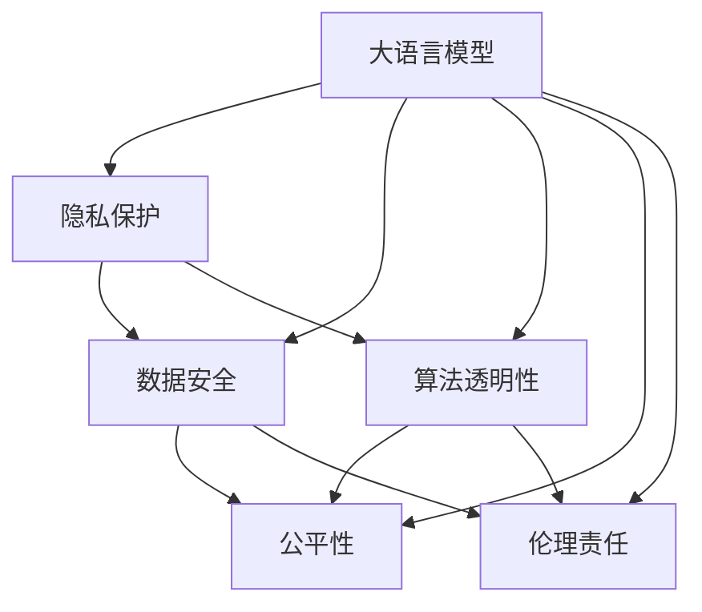
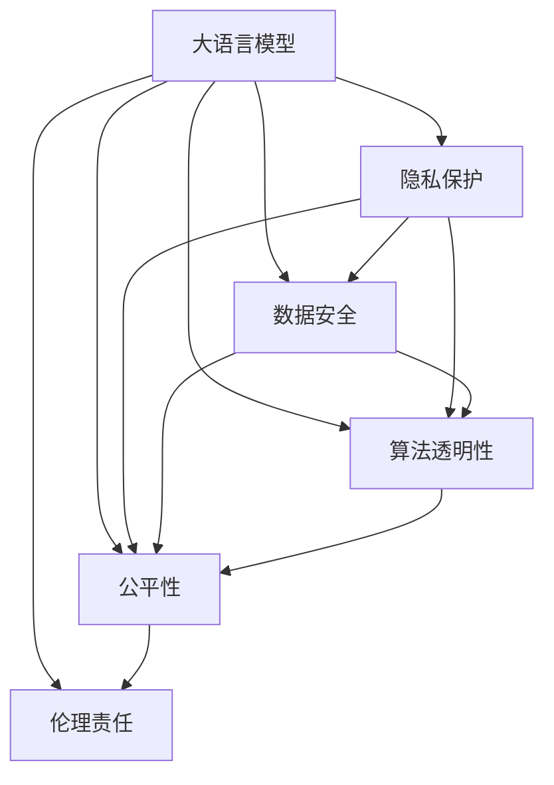
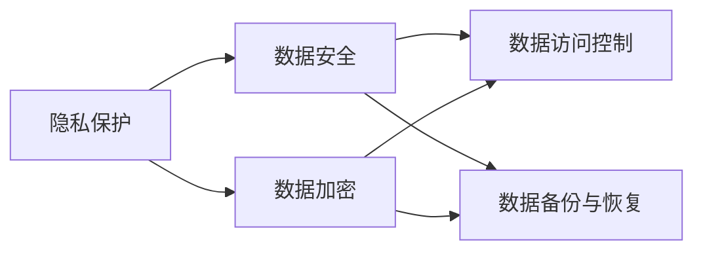
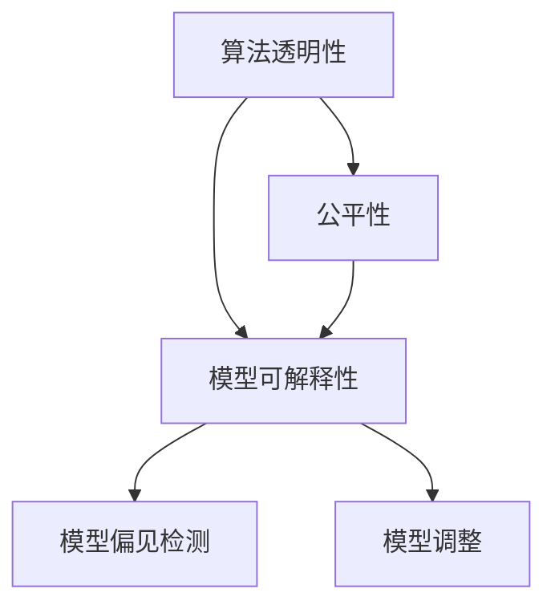
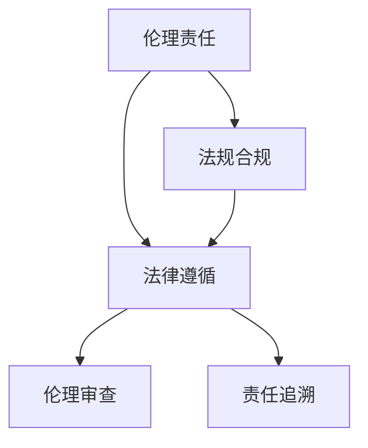
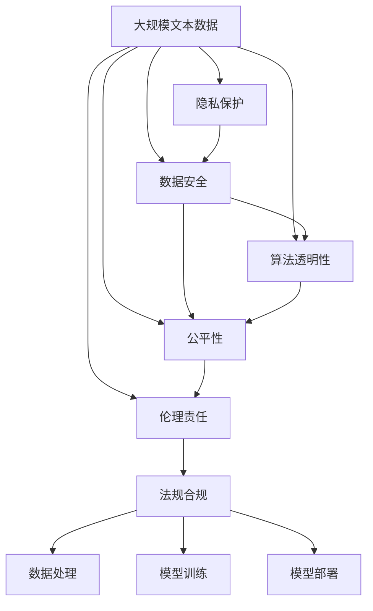

                 

# 大语言模型应用的法规合规性

## 1. 背景介绍

### 1.1 问题由来

随着人工智能（AI）技术的飞速发展，特别是深度学习和大规模语言模型（Large Language Models, LLMs）的应用，越来越多的企业和组织开始将其应用于各种实际场景。然而，大语言模型在带来高效便捷服务的同时，也面临着一系列的法规合规问题，这些问题包括但不限于隐私保护、数据安全、伦理责任等。这些问题如果不得到有效解决，可能会导致严重的法律风险，甚至损害社会公共利益。因此，大语言模型应用的法规合规性成为当前AI技术落地应用的重要课题。

### 1.2 问题核心关键点

大语言模型应用的法规合规性问题主要集中在以下几个方面：
- 数据隐私与保护：如何确保用户数据在处理、存储和传输过程中不被滥用或泄露。
- 数据安全与加密：如何保证存储在模型中的敏感数据不被非法访问或篡改。
- 算法透明性与可解释性：如何让模型决策过程透明、可解释，以增强用户信任。
- 公平性与偏见：如何避免模型输出中的偏见和歧视，确保公平无偏。
- 伦理与责任：如何在模型设计和应用过程中，遵循伦理规范，明确责任归属。

### 1.3 问题研究意义

研究大语言模型应用的法规合规性，对于提升AI技术的社会信任、保障用户权益、推动AI技术健康发展具有重要意义：

1. **提升社会信任**：确保AI模型在应用过程中遵循法规，能够赢得用户的信任和支持，促进技术的广泛应用。
2. **保障用户权益**：通过严格的数据隐私保护和数据安全措施，保护用户个人信息不被滥用，维护用户隐私权。
3. **推动技术发展**：法规合规性研究能够为AI技术的发展提供法律依据和指导，促进技术的规范化和标准化。
4. **增强伦理责任感**：明确AI模型的伦理责任，确保技术应用在道德和法律框架内，避免负面社会影响。

## 2. 核心概念与联系

### 2.1 核心概念概述

为了更好地理解大语言模型应用的法规合规性问题，本节将介绍几个密切相关的核心概念：

- **大语言模型**：如GPT-3、BERT等，是一种基于深度学习的大规模预训练语言模型，能够理解自然语言并生成自然语言文本。
- **隐私保护**：指保护个人信息免受未经授权的收集、使用、存储、传输、修改和泄露。
- **数据安全**：指保护数据免受未经授权的访问、修改、破坏或泄露。
- **算法透明性**：指模型决策过程的透明性和可解释性，确保用户理解模型的工作原理和输出结果。
- **公平性**：指模型在不同群体之间的表现一致，避免对特定群体产生不利影响。
- **伦理责任**：指模型设计、开发和应用过程中应遵循的伦理规范和责任归属。

这些核心概念之间的逻辑关系可以通过以下Mermaid流程图来展示：



这个流程图展示了大语言模型应用中涉及的多个核心概念及其相互关系：

1. 大语言模型在应用过程中，涉及数据隐私、安全、透明性、公平性和伦理责任等法规合规问题。
2. 隐私保护和数据安全是基础，确保模型的输入数据安全可靠。
3. 算法透明性和公平性是核心，确保模型决策过程公正透明，避免偏见。
4. 伦理责任是保障，确保模型应用符合社会伦理和法律规范。

### 2.2 概念间的关系

这些核心概念之间存在着紧密的联系，形成了大语言模型应用的法规合规性生态系统。下面我们通过几个Mermaid流程图来展示这些概念之间的关系。

#### 2.2.1 大语言模型应用的框架



这个流程图展示了大语言模型应用的基本框架，即在大语言模型的应用过程中，隐私保护、数据安全、算法透明性、公平性和伦理责任五个方面是相互关联、相互支持的。

#### 2.2.2 数据隐私保护与数据安全



这个流程图展示了数据隐私保护和数据安全之间的联系。隐私保护通过数据加密和访问控制等技术，确保数据的安全性。

#### 2.2.3 算法透明性与公平性



这个流程图展示了算法透明性和公平性之间的联系。算法透明性通过模型可解释性和偏见检测等技术，确保模型的公平性。

#### 2.2.4 伦理责任与合规性



这个流程图展示了伦理责任与法规合规之间的联系。伦理责任通过法律遵循和伦理审查等机制，确保模型应用的合规性。

### 2.3 核心概念的整体架构

最后，我们用一个综合的流程图来展示这些核心概念在大语言模型应用中的整体架构：



这个综合流程图展示了从数据隐私保护到模型部署的完整过程，隐私保护、数据安全、算法透明性、公平性和伦理责任相互影响，最终确保模型在法规合规框架内安全可靠地应用。

## 3. 核心算法原理 & 具体操作步骤
### 3.1 算法原理概述

大语言模型应用的法规合规性问题，本质上是如何在AI模型开发和应用过程中，确保数据隐私、安全、透明性、公平性和伦理责任的实现。其核心算法原理主要包括：

- **数据隐私保护**：通过数据加密、访问控制、匿名化等技术，确保数据在传输和存储过程中的隐私安全。
- **数据安全**：通过安全认证、访问审计、权限管理等技术，确保数据存储和传输的安全性。
- **算法透明性**：通过模型可解释性、可理解性等技术，确保模型决策过程的透明性和可解释性。
- **公平性**：通过偏见检测、公平性评估等技术，确保模型在不同群体之间的表现一致。
- **伦理责任**：通过伦理审查、责任追溯等机制，确保模型应用符合伦理规范和法律要求。

### 3.2 算法步骤详解

基于大语言模型应用的法规合规性问题，其具体算法步骤主要包括以下几个方面：

#### 3.2.1 数据隐私保护

1. **数据加密**：对存储和传输的数据进行加密处理，确保数据在传输和存储过程中不被泄露。
2. **访问控制**：通过身份认证、权限管理等技术，确保只有授权用户才能访问敏感数据。
3. **数据匿名化**：对数据进行去标识化处理，确保数据无法被识别到具体个人。

#### 3.2.2 数据安全

1. **安全认证**：通过SSL/TLS等安全协议，确保数据传输的安全性。
2. **访问审计**：对数据访问进行日志记录和审计，确保数据的访问和使用符合安全策略。
3. **权限管理**：通过RBAC（基于角色的访问控制）等技术，管理用户和数据之间的访问权限。

#### 3.2.3 算法透明性

1. **模型可解释性**：通过特征重要性分析、模型可视化等技术，解释模型预测的依据。
2. **模型可理解性**：通过自然语言描述、规则描述等技术，使模型决策过程更易于理解。
3. **偏见检测**：通过模型性能评估、样本分布分析等技术，检测和修正模型中的偏见。

#### 3.2.4 公平性

1. **公平性评估**：通过统计分析、分组评估等技术，检测模型在不同群体之间的表现是否公平。
2. **模型调整**：通过调整模型参数、引入公平性约束等技术，确保模型在不同群体之间的表现一致。

#### 3.2.5 伦理责任

1. **伦理审查**：通过伦理委员会、专家评审等机制，对模型应用进行伦理审查。
2. **责任追溯**：通过日志记录、版本控制等技术，确保模型应用的每个步骤都有可追溯性。

### 3.3 算法优缺点

大语言模型应用的法规合规性算法具有以下优点：

- **确保数据隐私安全**：通过加密、匿名化等技术，保护数据隐私，确保数据安全。
- **提高算法透明性**：通过可解释性和可理解性技术，提高模型透明度，增强用户信任。
- **保障模型公平性**：通过公平性评估和调整技术，确保模型在不同群体之间的表现一致。
- **明确伦理责任**：通过伦理审查和责任追溯机制，明确模型应用的伦理责任。

同时，这些算法也存在一些缺点：

- **技术复杂性高**：实现数据隐私保护、数据安全、算法透明性、公平性、伦理责任等目标，需要多种技术和策略的组合，技术实现复杂。
- **计算成本高**：实现数据加密、访问控制、公平性评估等目标，需要大量的计算资源，成本较高。
- **实施难度大**：在实际应用中，需要综合考虑数据隐私、安全、透明性、公平性、伦理责任等多个方面，实施难度较大。

### 3.4 算法应用领域

基于大语言模型应用的法规合规性算法，已经在金融、医疗、司法、政府等多个领域得到了广泛应用，例如：

- **金融行业**：在金融风险评估、反欺诈检测、客户身份验证等场景中，采用隐私保护和数据安全技术，确保用户隐私和数据安全。
- **医疗行业**：在医疗影像分析、疾病预测、患者隐私保护等场景中，采用数据匿名化和访问控制技术，保护患者隐私和数据安全。
- **司法行业**：在电子证据取证、犯罪侦查、案件审判等场景中，采用公平性和伦理责任技术，确保司法公正和透明。
- **政府行业**：在公共服务、智慧城市、政府信息公开等场景中，采用算法透明性和公平性技术，提高政府服务的透明度和公平性。

## 4. 数学模型和公式 & 详细讲解 & 举例说明
### 4.1 数学模型构建

在数学模型构建方面，大语言模型应用的法规合规性问题可以抽象为以下几个方面的数学模型：

- **数据隐私保护**：通过加密算法，将明文数据转换为密文数据，确保数据隐私。
- **数据安全**：通过安全认证算法，验证数据传输的合法性，确保数据安全。
- **算法透明性**：通过可解释性模型，解释模型决策的依据，确保算法透明性。
- **公平性**：通过分组评估算法，检测模型在不同群体之间的表现，确保公平性。
- **伦理责任**：通过责任追溯算法，记录模型应用的每个步骤，确保伦理责任。

### 4.2 公式推导过程

以数据加密算法为例，介绍一些常用的数学模型和公式。

- **对称加密算法**：如AES（Advanced Encryption Standard），其基本公式为：
  $$
  C = E_k(P) = P \oplus k
  $$
  其中，$P$为明文，$k$为密钥，$C$为密文，$\oplus$为异或运算。
  
- **非对称加密算法**：如RSA（Rivest-Shamir-Adleman），其基本公式为：
  $$
  C = E_{pub}(P) = M^e \mod n
  $$
  其中，$M$为明文，$e$和$n$为公钥和模数，$C$为密文。
  
- **哈希算法**：如SHA-256，其基本公式为：
  $$
  H(m) = H_{256}(m) = \sum_{i=1}^{256} m_i \mod 256
  $$
  其中，$m$为输入数据，$H$为哈希函数，$256$为哈希函数输出长度。

通过这些公式，可以构建数据隐私保护、数据安全、算法透明性、公平性和伦理责任等模型的数学基础，实现大语言模型应用的法规合规性。

### 4.3 案例分析与讲解

假设在金融行业中的一个信贷评估系统中，采用大语言模型进行信用风险评估。在模型应用过程中，涉及数据隐私、数据安全、算法透明性、公平性和伦理责任等多个方面。

#### 4.3.1 数据隐私保护

1. **数据加密**：采用AES算法对用户个人信息进行加密，确保数据在传输和存储过程中不被泄露。
2. **数据匿名化**：采用哈希算法对用户个人信息进行匿名化处理，确保数据无法被识别到具体个人。

#### 4.3.2 数据安全

1. **安全认证**：采用SSL/TLS协议，确保数据传输的安全性。
2. **访问控制**：采用RBAC技术，管理用户和数据之间的访问权限。

#### 4.3.3 算法透明性

1. **模型可解释性**：通过特征重要性分析技术，解释模型预测的依据。
2. **模型可理解性**：通过自然语言描述技术，使模型决策过程更易于理解。

#### 4.3.4 公平性

1. **公平性评估**：通过分组评估技术，检测模型在不同群体之间的表现是否公平。
2. **模型调整**：通过调整模型参数，确保模型在不同群体之间的表现一致。

#### 4.3.5 伦理责任

1. **伦理审查**：通过伦理委员会评审，确保模型应用的伦理规范。
2. **责任追溯**：通过日志记录和版本控制技术，确保模型应用的每个步骤都有可追溯性。

## 5. 项目实践：代码实例和详细解释说明
### 5.1 开发环境搭建

在进行大语言模型应用的法规合规性项目实践前，我们需要准备好开发环境。以下是使用Python进行TensorFlow开发的环境配置流程：

1. 安装Anaconda：从官网下载并安装Anaconda，用于创建独立的Python环境。

2. 创建并激活虚拟环境：
```bash
conda create -n tf-env python=3.8 
conda activate tf-env
```

3. 安装TensorFlow：根据CUDA版本，从官网获取对应的安装命令。例如：
```bash
conda install tensorflow -c tf -c conda-forge
```

4. 安装各类工具包：
```bash
pip install numpy pandas scikit-learn matplotlib tqdm jupyter notebook ipython
```

完成上述步骤后，即可在`tf-env`环境中开始法规合规性项目实践。

### 5.2 源代码详细实现

这里我们以一个简单的数据隐私保护为例，展示如何使用TensorFlow实现数据加密和解密过程。

```python
import tensorflow as tf

def encrypt(text, key):
    return tf.strings.unicode_transcode(text, 'utf-8', 'base64')

def decrypt(encrypted_text, key):
    return tf.strings.unicode_transcode(encrypted_text, 'base64', 'utf-8')

# 定义加密和解密函数
def encrypt_decrypt(text, key):
    encrypted = encrypt(text, key)
    decrypted = decrypt(encrypted_text, key)
    return encrypted, decrypted

# 测试加密和解密函数
text = 'Hello, World!'
key = '123456'
encrypted, decrypted = encrypt_decrypt(text, key)

print(f'原始数据：{text}')
print(f'加密后数据：{encrypted}')
print(f'解密后数据：{decrypted}')
```

### 5.3 代码解读与分析

在这个简单的数据加密和解密代码中，我们定义了两个函数`encrypt`和`decrypt`，分别实现数据的加密和解密过程。加密函数`encrypt`采用Base64编码将明文转换为密文，解密函数`decrypt`将密文转换回明文。最后，通过`encrypt_decrypt`函数测试加密和解密过程。

可以看到，TensorFlow提供了强大的字符串处理和加密功能，能够方便地实现数据隐私保护的基本需求。

## 6. 实际应用场景
### 6.1 金融行业

在金融行业中，大语言模型应用的法规合规性问题尤为突出。金融机构需要处理大量的用户信息，包括个人身份、财务状况等敏感数据。如何确保这些数据在处理、存储和传输过程中的隐私和安全，是金融行业应用大语言模型的关键。

#### 6.1.1 数据隐私保护

1. **数据加密**：对用户个人信息进行加密处理，确保数据在传输和存储过程中不被泄露。
2. **数据匿名化**：对用户个人信息进行匿名化处理，确保数据无法被识别到具体个人。

#### 6.1.2 数据安全

1. **安全认证**：采用SSL/TLS协议，确保数据传输的安全性。
2. **访问控制**：采用RBAC技术，管理用户和数据之间的访问权限。

#### 6.1.3 算法透明性

1. **模型可解释性**：通过特征重要性分析技术，解释模型预测的依据。
2. **模型可理解性**：通过自然语言描述技术，使模型决策过程更易于理解。

#### 6.1.4 公平性

1. **公平性评估**：通过分组评估技术，检测模型在不同群体之间的表现是否公平。
2. **模型调整**：通过调整模型参数，确保模型在不同群体之间的表现一致。

#### 6.1.5 伦理责任

1. **伦理审查**：通过伦理委员会评审，确保模型应用的伦理规范。
2. **责任追溯**：通过日志记录和版本控制技术，确保模型应用的每个步骤都有可追溯性。

### 6.2 医疗行业

在医疗行业中，大语言模型应用的法规合规性问题也相当重要。医疗机构需要处理大量的患者信息，包括病历、诊断报告等敏感数据。如何确保这些数据在处理、存储和传输过程中的隐私和安全，是医疗行业应用大语言模型的关键。

#### 6.2.1 数据隐私保护

1. **数据加密**：对患者个人信息进行加密处理，确保数据在传输和存储过程中不被泄露。
2. **数据匿名化**：对患者个人信息进行匿名化处理，确保数据无法被识别到具体个人。

#### 6.2.2 数据安全

1. **安全认证**：采用SSL/TLS协议，确保数据传输的安全性。
2. **访问控制**：采用RBAC技术，管理用户和数据之间的访问权限。

#### 6.2.3 算法透明性

1. **模型可解释性**：通过特征重要性分析技术，解释模型预测的依据。
2. **模型可理解性**：通过自然语言描述技术，使模型决策过程更易于理解。

#### 6.2.4 公平性

1. **公平性评估**：通过分组评估技术，检测模型在不同群体之间的表现是否公平。
2. **模型调整**：通过调整模型参数，确保模型在不同群体之间的表现一致。

#### 6.2.5 伦理责任

1. **伦理审查**：通过伦理委员会评审，确保模型应用的伦理规范。
2. **责任追溯**：通过日志记录和版本控制技术，确保模型应用的每个步骤都有可追溯性。

### 6.3 司法行业

在司法行业中，大语言模型应用的法规合规性问题同样重要。司法机关需要处理大量的电子证据、案件信息等敏感数据。如何确保这些数据在处理、存储和传输过程中的隐私和安全，是司法行业应用大语言模型的关键。

#### 6.3.1 数据隐私保护

1. **数据加密**：对电子证据、案件信息等敏感数据进行加密处理，确保数据在传输和存储过程中不被泄露。
2. **数据匿名化**：对电子证据、案件信息等敏感数据进行匿名化处理，确保数据无法被识别到具体个人。

#### 6.3.2 数据安全

1. **安全认证**：采用SSL/TLS协议，确保数据传输的安全性。
2. **访问控制**：采用RBAC技术，管理用户和数据之间的访问权限。

#### 6.3.3 算法透明性

1. **模型可解释性**：通过特征重要性分析技术，解释模型预测的依据。
2. **模型可理解性**：通过自然语言描述技术，使模型决策过程更易于理解。

#### 6.3.4 公平性

1. **公平性评估**：通过分组评估技术，检测模型在不同群体之间的表现是否公平。
2. **模型调整**：通过调整模型参数，确保模型在不同群体之间的表现一致。

#### 6.3.5 伦理责任

1. **伦理审查**：通过伦理委员会评审，确保模型应用的伦理规范。
2. **责任追溯**：通过日志记录和版本控制技术，确保模型应用的每个步骤都有可追溯性。

## 7. 工具和资源推荐
### 7.1 学习资源推荐

为了帮助开发者系统掌握大语言模型应用的法规合规性理论基础和实践技巧，这里推荐一些优质的学习资源：

1. **《数据隐私保护与合规性》系列博文**：由数据隐私保护领域专家撰写，深入浅出地介绍了数据隐私保护的基本概念、法律法规和最佳实践。
2. **《数据安全技术》课程**：北京大学开设的计算机科学与技术专业课程，详细讲解了数据安全技术的理论基础和实现方法。
3. **《算法透明性与可解释性》书籍**：介绍如何通过模型可解释性技术，提高AI模型的透明性和可理解性，增强用户信任。
4. **《公平性学习》课程**：清华大学开设的计算机科学与技术专业课程，讲解了如何通过公平性评估技术，确保模型在不同群体之间的表现一致。
5. **《伦理与责任》书籍**：介绍如何在AI模型设计和应用过程中，遵循伦理规范和法律要求，明确责任归属。

通过对这些资源的学习实践，相信你一定能够快速掌握大语言模型应用的法规合规性精髓，并用于解决实际的AI问题。

### 7.2 开发工具推荐

高效的开发离不开优秀的工具支持。以下是几款用于大语言模型应用的法规合规性开发的常用工具：

1. **TensorFlow**：基于Python的开源深度学习框架，灵活动态的计算图，适合快速迭代研究。
2. **PyTorch**：基于Python的开源深度学习框架，适合快速原型设计和模型调试。
3. **TensorFlow Privacy**：Google开发的隐私保护工具库，提供了多种隐私保护算法和工具，用于数据加密、访问控制等。
4. **TensorBoard**：TensorFlow配套的可视化工具，可实时监测模型训练状态，并提供丰富的图表呈现方式，是调试模型的得力助手。
5. **GitHub**：代码托管平台，方便团队协作和版本控制。
6. **Jupyter Notebook**：交互式编程环境，适合数据处理和模型调试。

合理利用这些工具，可以显著提升大语言模型应用的法规合规性任务的开发效率，加快创新迭代的步伐。

### 7.3 相关论文推荐

大语言模型应用的法规合规性研究源于学界的持续研究。以下是几篇奠基性的相关论文，推荐阅读：

1. **《数据隐私保护技术综述》**：总结了数据隐私保护领域的主要技术，包括数据加密、访问控制、数据匿名化等。
2. **《数据安全技术研究》**：介绍了数据安全技术的理论和实现方法，包括安全认证、访问审计、权限管理等。
3. **《算法透明性技术综述》**：总结了模型可解释性技术的研究进展，包括特征重要性分析、模型可视化等。
4. **《公平性学习综述》**：总结了公平性评估技术的研究进展，包括分组评估、模型调整等。
5. **《伦理与责任技术研究》**：介绍了如何在AI模型设计和应用过程中，遵循伦理规范和法律要求，明确责任归属。

这些论文代表了大语言模型应用的法规合规性研究的发展脉络。通过学习这些前沿成果，可以帮助研究者把握学科前进方向，激发更多的创新灵感。

## 8. 总结：未来发展趋势与挑战

### 8.1 总结

本文对大语言模型应用的法规合规性问题进行了全面系统的介绍。首先阐述了数据隐私、数据安全、算法透明性、公平性和伦理责任等法规合规性的重要性，明确了这些方面在大语言模型应用中的关键作用。其次，从原理到实践，详细讲解了法规合规性的数学原理和关键步骤，给出了法规合规性任务开发的完整代码实例。同时，本文还广泛探讨了法规合规性在金融、医疗、司法等多个领域的应用前景，展示了法规合规性的巨大潜力。

通过本文的系统梳理，可以看到，大语言模型应用的法规合规性问题，不仅在大规模数据处理、模型训练和应用部署等方面具有重要意义，还能有效提升用户信任，保障用户权益，推动AI技术健康发展。

###

