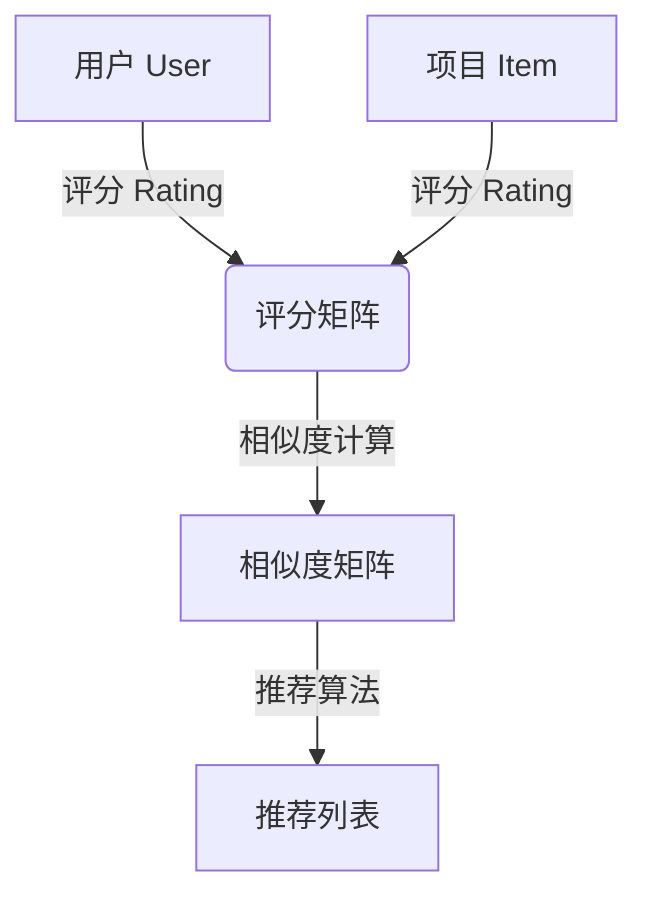
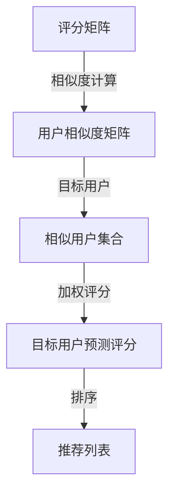

# Python机器学习实战：推荐系统的原理与实现方法

## 1. 背景介绍

### 1.1 问题的由来

在当今信息过载的时代，人们面临着海量的数据和选择。无论是在线上购物、观看视频还是选择新闻资讯,过多的选择往往会让人感到困惑和不知所措。推荐系统(Recommender System)应运而生,旨在帮助用户发现感兴趣的内容,从而提高用户体验和系统效率。

推荐系统的核心思想是基于用户的过去行为和偏好,预测他们未来可能感兴趣的项目。这种个性化的推荐不仅能够满足用户的需求,还可以促进商业增长,提高用户粘性和转化率。

### 1.2 研究现状

推荐系统已经广泛应用于各个领域,如电子商务(亚马逊、淘宝)、视频点播(Netflix、优酷)、音乐服务(Spotify、QQ音乐)、社交网络(Facebook、微博)等。随着机器学习和大数据技术的发展,推荐系统也在不断演进和优化。

目前,常见的推荐算法包括协同过滤(Collaborative Filtering)、基于内容(Content-based)、基于知识(Knowledge-based)、混合推荐(Hybrid)等。其中,协同过滤是最广泛使用的技术,它利用用户之间的相似性来预测用户的偏好。

### 1.3 研究意义

推荐系统不仅能够提高用户体验,还可以带来巨大的商业价值。准确的推荐可以增加用户粘性和转化率,从而提高企业的收入和利润。同时,推荐系统也能够帮助用户发现感兴趣的内容,节省时间和精力。

此外,推荐系统在信息过载的环境下扮演着越来越重要的角色。它可以帮助用户从海量信息中筛选出相关内容,提高信息获取的效率。

### 1.4 本文结构

本文将全面介绍推荐系统的原理和实现方法,内容包括:

1. 核心概念与联系
2. 核心算法原理和具体操作步骤
3. 数学模型和公式详细讲解及案例分析
4. 项目实践:代码实例和详细解释
5. 实际应用场景
6. 工具和资源推荐
7. 总结:未来发展趋势与挑战
8. 附录:常见问题与解答

## 2. 核心概念与联系

推荐系统涉及多个核心概念,包括用户(User)、项目(Item)、评分(Rating)、相似度(Similarity)等。这些概念之间存在着密切的联系,共同构建了推荐系统的基础框架。



1. **用户(User)**: 推荐系统的服务对象,可以是个人或群体。
2. **项目(Item)**: 推荐系统推荐的对象,如商品、电影、音乐等。
3. **评分(Rating)**: 用户对项目的评价,通常使用数值或星级表示。
4. **评分矩阵(Rating Matrix)**: 记录所有用户对所有项目的评分,是推荐系统的基础数据。
5. **相似度(Similarity)**: 度量两个用户或项目之间的相似程度,是推荐算法的核心。
6. **相似度矩阵(Similarity Matrix)**: 记录所有用户或项目之间的相似度。
7. **推荐算法(Recommendation Algorithm)**: 基于评分矩阵和相似度矩阵,生成个性化的推荐列表。

## 3. 核心算法原理与具体操作步骤

推荐系统的核心算法主要包括协同过滤(Collaborative Filtering)、基于内容(Content-based)和基于知识(Knowledge-based)等。本节将重点介绍协同过滤算法的原理和实现步骤。

### 3.1 算法原理概述

协同过滤(Collaborative Filtering)是推荐系统中最常用的算法,它基于这样一个假设:如果两个用户在过去有相似的行为和偏好,那么他们在未来也可能有相似的偏好。

协同过滤算法主要分为两种类型:

1. **基于用户(User-based)**: 根据目标用户与其他用户的相似度,推荐相似用户喜欢的项目。
2. **基于项目(Item-based)**: 根据目标项目与其他项目的相似度,推荐与目标项目相似的其他项目。

无论是基于用户还是基于项目,算法的核心步骤都包括:

1. 计算相似度矩阵
2. 基于相似度矩阵预测目标用户或项目的评分
3. 根据预测评分生成推荐列表

### 3.2 算法步骤详解

以基于用户的协同过滤算法为例,具体步骤如下:



1. **计算用户相似度矩阵**

   常用的相似度计算方法包括欧几里得距离、皮尔逊相关系数和余弦相似度等。以余弦相似度为例,两个用户 $u$ 和 $v$ 的相似度计算公式为:

   $$\text{sim}(u, v) = \cos(\vec{r_u}, \vec{r_v}) = \frac{\vec{r_u} \cdot \vec{r_v}}{|\vec{r_u}||\vec{r_v}|}$$

   其中 $\vec{r_u}$ 和 $\vec{r_v}$ 分别表示用户 $u$ 和 $v$ 的评分向量。

2. **找到目标用户的相似用户集合**

   对于目标用户 $u$,从用户相似度矩阵中找到与其最相似的 $k$ 个用户,作为相似用户集合 $S_u$。

3. **预测目标用户对未评分项目的评分**

   对于目标用户 $u$ 未评分的项目 $i$,预测评分 $\hat{r}_{ui}$ 的计算公式为:

   $$\hat{r}_{ui} = \overline{r_u} + \frac{\sum\limits_{v \in S_u}{\text{sim}(u, v)(\overline{r_v} - r_{vi})}}{\sum\limits_{v \in S_u}{|\text{sim}(u, v)|}}$$

   其中 $\overline{r_u}$ 和 $\overline{r_v}$ 分别表示用户 $u$ 和 $v$ 的平均评分。

4. **生成推荐列表**

   对于目标用户 $u$,根据预测评分 $\hat{r}_{ui}$ 从高到低排序,取前 $N$ 个作为推荐列表。

### 3.3 算法优缺点

协同过滤算法的优点包括:

- 无需深入了解项目内容,只需要评分数据
- 能够发现隐性的相似偏好
- 可以生成个性化的推荐列表

缺点包括:

- 存在冷启动问题(新用户或新项目无法获得有效推荐)
- 无法推荐与现有项目完全不同的新项目
- 计算复杂度较高,需要大量计算资源

### 3.4 算法应用领域

协同过滤算法广泛应用于以下领域:

- 电子商务网站(如亚马逊、淘宝)
- 视频点播服务(如Netflix、优酷)
- 音乐服务(如Spotify、QQ音乐)
- 社交网络(如Facebook、微博)
- 新闻推荐
- 广告推荐

## 4. 数学模型和公式详细讲解与举例说明

在推荐系统中,常用的数学模型包括矩阵分解(Matrix Factorization)、贝叶斯模型(Bayesian Model)和深度学习模型等。本节将重点介绍矩阵分解模型的原理和公式推导。

### 4.1 数学模型构建

矩阵分解是一种将高维稀疏矩阵分解为低维紧凑矩阵的技术,常用于协同过滤推荐系统。具体来说,我们将评分矩阵 $R$ 分解为两个低维矩阵 $P$ 和 $Q$ 的乘积:

$$R \approx P^TQ$$

其中 $P$ 表示用户矩阵,每一行对应一个用户的隐式特征向量;$Q$ 表示项目矩阵,每一行对应一个项目的隐式特征向量。

### 4.2 公式推导过程

我们的目标是找到最优的 $P$ 和 $Q$,使得预测评分矩阵 $\hat{R} = P^TQ$ 与实际评分矩阵 $R$ 的差异最小。常用的损失函数是平方损失:

$$\min\limits_{P, Q} \sum\limits_{(u, i) \in \mathcal{K}}{(r_{ui} - \hat{r}_{ui})^2 + \lambda(\|p_u\|^2 + \|q_i\|^2)}$$

其中 $\mathcal{K}$ 表示已知评分的集合,第二项是正则化项,用于防止过拟合。

通过梯度下降法求解上述优化问题,可以得到 $P$ 和 $Q$ 的更新规则:

$$p_u^{(t+1)} = p_u^{(t)} + \alpha\left(\sum\limits_{i \in \mathcal{N}(u)}{(r_{ui} - \hat{r}_{ui})q_i^{(t)}} - \lambda p_u^{(t)}\right)$$

$$q_i^{(t+1)} = q_i^{(t)} + \alpha\left(\sum\limits_{u \in \mathcal{N}(i)}{(r_{ui} - \hat{r}_{ui})p_u^{(t)}} - \lambda q_i^{(t)}\right)$$

其中 $\alpha$ 为学习率,上标 $(t)$ 表示第 $t$ 次迭代,函数 $\mathcal{N}(u)$ 和 $\mathcal{N}(i)$ 分别表示用户 $u$ 和项目 $i$ 的已知评分集合。

### 4.3 案例分析与讲解

假设我们有一个电影评分数据集,包含 5 个用户对 4 部电影的评分:

```
       电影1  电影2  电影3  电影4
用户1    4      ?      3      ?
用户2    ?      5      ?      2
用户3    5      ?      4      ?
用户4    ?      3      ?      4
用户5    3      ?      5      ?
```

我们将评分矩阵 $R$ 分解为两个 2 维矩阵 $P$ 和 $Q$,分别表示用户和电影的隐式特征。假设经过 100 次迭代后,我们得到:

$$P = \begin{bmatrix}
0.8 & 0.2\
0.1 & 0.9\
0.7 & 0.5\
0.3 & 0.6\
0.5 & 0.7
\end{bmatrix}, \quad Q = \begin{bmatrix}
0.6 & 0.4\
0.8 & 0.1\
0.2 & 0.7\
0.5 & 0.6
\end{bmatrix}$$

那么,我们可以预测用户 1 对电影 2 的评分为:

$$\hat{r}_{12} = p_1^Tq_2 = 0.8 \times 0.8 + 0.2 \times 0.1 = 0.64 \approx 4$$

同理,我们可以预测其他缺失的评分,并根据预测评分生成个性化的推荐列表。

### 4.4 常见问题解答

1. **为什么要使用矩阵分解而不直接使用评分矩阵?**

   评分矩阵通常是高维稀疏矩阵,存在大量缺失值,直接使用会导致计算复杂度过高。矩阵分解可以将高维稀疏矩阵转化为低维紧凑矩阵,降低计算复杂度,同时也能捕捉用户和项目的隐式特征。

2. **如何选择隐式特征的维数?**

   隐式特征的维数是一个超参数,需要通过交叉验证等方法进行调优。维数越高,模型的表达能力越强,但也更容易过拟合。一般来说,维数在 10~200 之间比较合适。

3. **除了平方