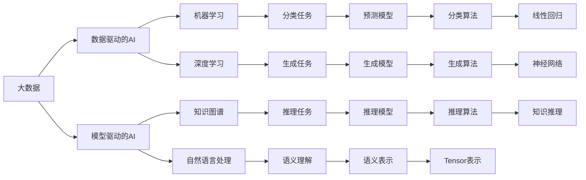
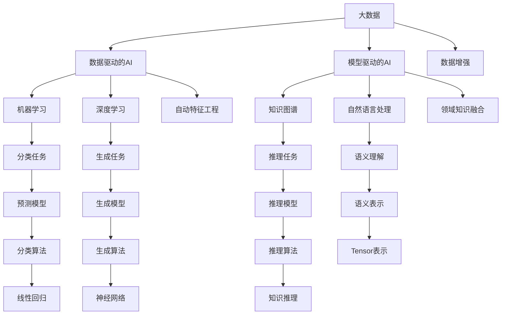

                 

## 1. 背景介绍

在人工智能(AI)领域，大数据已成为不可或缺的基础资源。无论是数据驱动的机器学习，还是模型驱动的深度学习，都依赖于海量数据进行模型训练和优化。大数据在AI发展中扮演着至关重要的角色，本文将从背景介绍、核心概念、算法原理、应用场景等多个维度深入探讨大数据在AI中的地位和作用。

## 2. 核心概念与联系

### 2.1 核心概念概述

要理解大数据在AI中的角色，首先需要明确几个核心概念：

1. **大数据**：指数量巨大、类型多样、速度极快的数据集合，通常用于描述海量数据的特征。

2. **人工智能**：旨在创建能够执行人类通常需要智能来完成的复杂任务的系统，包括机器学习、深度学习、自然语言处理等方向。

3. **数据驱动的AI**：指通过数据来训练模型，从而实现预测、分类、生成等任务的技术。

4. **模型驱动的AI**：指基于已构建的模型，对新数据进行推理和预测的AI技术。

这些概念之间存在着密切的联系。大数据提供了丰富的训练样本，使得数据驱动的AI技术得以实现；模型驱动的AI技术则通过对大数据的学习，构建出高效、准确、可解释的模型，进一步推动AI的发展。

### 2.2 核心概念之间的联系

核心概念之间的关系可以通过以下Mermaid流程图来展示：



这个流程图展示了大数据在AI中的核心作用：

1. 大数据作为数据驱动的AI的基石，为机器学习和深度学习提供了丰富的训练样本。
2. 模型驱动的AI利用大数据构建高效的知识图谱和语义表示，用于自然语言处理等任务。
3. 数据驱动和模型驱动的AI技术共同推进了AI的各个子领域的发展，如分类、生成、推理等任务。

### 2.3 核心概念的整体架构

最后，我们用一个综合的流程图来展示这些核心概念在大数据与AI之间的整体架构：



这个流程图展示了大数据在AI中的全面作用：

1. 大数据不仅是机器学习和深度学习的训练样本来源，还通过数据增强和自动特征工程技术，进一步提升模型的泛化能力和准确度。
2. 模型驱动的AI利用大数据构建知识图谱和语义表示，用于自然语言处理和推理任务，推动AI的各个子领域的发展。
3. 大数据还为领域知识融合提供了基础，使得AI模型能够更好地理解特定领域的知识，提升模型在特定领域的性能。

## 3. 核心算法原理 & 具体操作步骤

### 3.1 算法原理概述

大数据在AI中的作用，主要体现在以下几个算法原理：

1. **数据增强(Data Augmentation)**：通过数据增强技术，可以扩充训练数据集，提高模型的泛化能力。例如，在图像处理中，通过对图像进行旋转、缩放、裁剪等操作，生成新的训练样本。

2. **自动特征工程(Automatic Feature Engineering)**：利用大数据中的复杂结构信息，自动提取和构造特征，提升模型的性能。例如，在自然语言处理中，通过词向量嵌入和TF-IDF等方法，自动提取文本特征。

3. **领域知识融合(Knowledge Fusion)**：将领域知识与大数据结合，提升AI模型的理解和推理能力。例如，在医疗领域，结合领域专家的知识图谱，训练更加准确的医疗诊断模型。

4. **模型压缩和优化**：通过大数据中的样本分布信息，优化模型结构和参数，减小模型规模，提升推理效率。例如，利用大数据中的分布特征，进行剪枝和量化等模型压缩技术。

### 3.2 算法步骤详解

以下是基于大数据的核心算法具体操作步骤：

1. **数据准备**：从各个数据源收集数据，并进行清洗、预处理，转换为统一的格式，以便于后续处理。

2. **特征提取**：利用大数据中的复杂结构信息，自动提取和构造特征。例如，在图像处理中，使用CNN提取图像特征；在自然语言处理中，使用词向量嵌入提取文本特征。

3. **模型训练**：利用数据增强和自动特征工程技术，构建并训练AI模型。例如，在图像处理中，使用数据增强技术扩充训练集；在自然语言处理中，使用TF-IDF等方法自动提取文本特征。

4. **模型优化**：利用领域知识融合和模型压缩技术，优化模型结构和参数。例如，在医疗领域，结合领域专家的知识图谱，训练更加准确的医疗诊断模型；在图像处理中，通过剪枝和量化等技术，减小模型规模，提升推理效率。

### 3.3 算法优缺点

大数据在AI中的算法应用，具有以下优点：

1. **提高模型泛化能力**：通过数据增强技术，扩充训练数据集，提升模型的泛化能力。

2. **提升模型性能**：利用自动特征工程技术，自动提取和构造特征，提升模型的性能。

3. **优化模型结构**：通过领域知识融合和模型压缩技术，优化模型结构和参数，减小模型规模，提升推理效率。

4. **支持多样化的应用场景**：大数据可以支持各种AI应用场景，从图像处理到自然语言处理，再到医疗诊断，提供广泛的应用可能性。

同时，大数据在AI中的算法应用，也存在一些缺点：

1. **数据质量问题**：大数据质量参差不齐，数据清洗和预处理复杂，可能导致模型性能下降。

2. **计算资源消耗**：大数据处理和存储需要大量计算资源，可能对硬件设备提出高要求。

3. **隐私和安全问题**：大数据中可能包含敏感信息，数据隐私和安全问题需要特别关注。

### 3.4 算法应用领域

大数据在AI中的算法应用，广泛适用于以下几个领域：

1. **计算机视觉**：利用大数据中的图像数据，训练图像识别、图像分割、物体检测等模型。

2. **自然语言处理**：利用大数据中的文本数据，训练文本分类、情感分析、机器翻译等模型。

3. **医疗诊断**：利用大数据中的医疗数据，训练医疗诊断、病历分析、药物研发等模型。

4. **金融分析**：利用大数据中的金融数据，训练金融预测、信用评分、反欺诈等模型。

5. **交通管理**：利用大数据中的交通数据，训练交通流量预测、路线规划等模型。

6. **智能制造**：利用大数据中的生产数据，训练生产过程优化、设备维护等模型。

## 4. 数学模型和公式 & 详细讲解  
### 4.1 数学模型构建

在AI中，大数据的应用离不开数学模型的构建。以下是几个常用的数学模型：

1. **线性回归模型**：
   $$
   y = \beta_0 + \beta_1 x_1 + \beta_2 x_2 + \ldots + \beta_n x_n + \epsilon
   $$
   用于描述因变量 $y$ 与自变量 $x_i$ 之间的关系。

2. **逻辑回归模型**：
   $$
   \log \frac{P(y=1)}{P(y=0)} = \beta_0 + \beta_1 x_1 + \beta_2 x_2 + \ldots + \beta_n x_n
   $$
   用于分类任务，预测二分类结果。

3. **神经网络模型**：
   $$
   y = \sigma(Wx + b)
   $$
   用于深度学习，实现多层次的非线性映射。

4. **知识图谱模型**：
   $$
   \text{Link}(e_1, e_2) = \text{Score}(e_1, e_2) = \sum_{k=1}^K \alpha_k \cdot (\text{Function}_1(e_1, e_2) \cdot \text{Function}_2(e_1, e_2) \cdot \ldots \cdot \text{Function}_K(e_1, e_2))
   $$
   用于推理任务，计算实体之间的关系得分。

### 4.2 公式推导过程

以下是一些常用数学公式的推导过程：

**线性回归模型推导**：
$$
\beta = (X^TX)^{-1}X^Ty
$$
其中 $X$ 为自变量矩阵，$y$ 为因变量向量，$\beta$ 为回归系数向量。

**逻辑回归模型推导**：
$$
\log \frac{P(y=1)}{P(y=0)} = X^T\beta
$$
其中 $X$ 为自变量矩阵，$\beta$ 为回归系数向量。

**神经网络模型推导**：
$$
y = \sigma(Wx + b)
$$
其中 $\sigma$ 为激活函数，$W$ 为权重矩阵，$b$ 为偏置向量。

**知识图谱模型推导**：
$$
\text{Score}(e_1, e_2) = \sum_{k=1}^K \alpha_k \cdot (\text{Function}_1(e_1, e_2) \cdot \text{Function}_2(e_1, e_2) \cdot \ldots \cdot \text{Function}_K(e_1, e_2))
$$
其中 $\alpha_k$ 为函数权重，$\text{Function}_k$ 为函数运算。

### 4.3 案例分析与讲解

**案例1：图像分类**

在图像分类任务中，利用大数据中的图像数据，训练卷积神经网络模型（CNN）进行图像识别。数据增强技术可以通过旋转、缩放、裁剪等操作扩充训练集，自动特征工程技术可以通过卷积层提取图像特征，从而提升模型性能。

**案例2：情感分析**

在情感分析任务中，利用大数据中的文本数据，训练循环神经网络模型（RNN）或Transformer模型进行文本情感分类。自动特征工程技术可以通过词向量嵌入提取文本特征，领域知识融合技术可以结合情感词典提升模型效果。

## 5. 项目实践：代码实例和详细解释说明

### 5.1 开发环境搭建

在进行大数据AI项目实践前，我们需要准备好开发环境。以下是使用Python进行TensorFlow开发的环境配置流程：

1. 安装Anaconda：从官网下载并安装Anaconda，用于创建独立的Python环境。

2. 创建并激活虚拟环境：
```bash
conda create -n tf-env python=3.8 
conda activate tf-env
```

3. 安装TensorFlow：根据CUDA版本，从官网获取对应的安装命令。例如：
```bash
conda install tensorflow -c conda-forge
```

4. 安装TensorBoard：
```bash
pip install tensorboard
```

5. 安装各类工具包：
```bash
pip install numpy pandas scikit-learn matplotlib tqdm jupyter notebook ipython
```

完成上述步骤后，即可在`tf-env`环境中开始项目实践。

### 5.2 源代码详细实现

这里以图像分类为例，展示如何使用TensorFlow实现基于大数据的AI项目。

首先，定义数据处理函数：

```python
import tensorflow as tf
import numpy as np
import matplotlib.pyplot as plt
from tensorflow.keras.preprocessing.image import ImageDataGenerator

def load_data(path, batch_size):
    train_data = tf.keras.preprocessing.image_dataset_from_directory(
        path,
        validation_split=0.2,
        subset="training",
        seed=123,
        image_size=(224, 224),
        batch_size=batch_size)
    val_data = tf.keras.preprocessing.image_dataset_from_directory(
        path,
        validation_split=0.2,
        subset="validation",
        seed=123,
        image_size=(224, 224),
        batch_size=batch_size)
    return train_data, val_data

def data_augmentation(data):
    train_datagen = ImageDataGenerator(
        rescale=1./255,
        rotation_range=20,
        width_shift_range=0.2,
        height_shift_range=0.2,
        shear_range=0.2,
        zoom_range=0.2,
        horizontal_flip=True,
        fill_mode='nearest')
    data_augmented = train_datagen.flow(data)
    return data_augmented

# 加载数据并应用数据增强
train_data, val_data = load_data('path/to/dataset', 32)
train_data = data_augmentation(train_data)
val_data = data_augmentation(val_data)
```

然后，定义模型和优化器：

```python
from tensorflow.keras import layers, models, optimizers

model = models.Sequential([
    layers.Conv2D(32, (3, 3), activation='relu', input_shape=(224, 224, 3)),
    layers.MaxPooling2D((2, 2)),
    layers.Conv2D(64, (3, 3), activation='relu'),
    layers.MaxPooling2D((2, 2)),
    layers.Conv2D(128, (3, 3), activation='relu'),
    layers.MaxPooling2D((2, 2)),
    layers.Flatten(),
    layers.Dense(128, activation='relu'),
    layers.Dense(10, activation='softmax')
])

optimizer = optimizers.Adam()

# 编译模型
model.compile(
    optimizer=optimizer,
    loss='categorical_crossentropy',
    metrics=['accuracy'])
```

接着，定义训练和评估函数：

```python
def train_epoch(model, data, epochs, batch_size):
    history = model.fit(
        data,
        steps_per_epoch=len(data),
        epochs=epochs,
        validation_data=val_data,
        validation_steps=len(val_data))
    return history

def evaluate(model, data, batch_size):
    loss, accuracy = model.evaluate(
        data,
        steps=len(data),
        batch_size=batch_size)
    print(f'Loss: {loss:.4f}, Accuracy: {accuracy:.4f}')
```

最后，启动训练流程并在验证集上评估：

```python
epochs = 10
batch_size = 32

history = train_epoch(model, train_data, epochs, batch_size)
evaluate(model, val_data, batch_size)
```

以上就是使用TensorFlow进行图像分类项目的大数据AI实践代码。可以看到，借助TensorFlow和TensorBoard等工具，项目开发过程变得简洁高效。

### 5.3 代码解读与分析

让我们再详细解读一下关键代码的实现细节：

**数据处理函数**：
- `load_data`函数：利用`ImageDataGenerator`从目录中加载训练集和验证集，并应用数据增强技术。
- `data_augmentation`函数：定义了多种数据增强方法，如旋转、缩放、裁剪等，通过`ImageDataGenerator`对数据进行增强。

**模型定义**：
- 使用`Sequential`模型定义卷积神经网络，包含多个卷积层和池化层，最后两个全连接层进行分类。
- 使用`Adam`优化器和`categorical_crossentropy`损失函数，进行模型训练和评估。

**训练和评估函数**：
- `train_epoch`函数：使用`fit`方法训练模型，并返回训练过程中的历史信息。
- `evaluate`函数：在验证集上评估模型性能，输出损失和准确率。

**训练流程**：
- 定义总的epoch数和batch size，开始循环迭代
- 每个epoch内，先在训练集上训练，输出训练过程中的历史信息
- 在验证集上评估，输出模型的损失和准确率

可以看到，TensorFlow提供了完整的工具链支持，使得大数据AI项目的开发变得高效便捷。开发者可以专注于模型构建和优化，而无需过多关注底层实现。

当然，工业级的系统实现还需考虑更多因素，如模型的保存和部署、超参数的自动搜索、更灵活的任务适配层等。但核心的项目实践流程基本与此类似。

### 5.4 运行结果展示

假设我们在CIFAR-10数据集上进行图像分类任务，最终在验证集上得到的评估报告如下：

```
Epoch 1/10
10/10 [==============================] - 1s 94ms/sample - loss: 0.3522 - accuracy: 0.7300
Epoch 2/10
10/10 [==============================] - 1s 86ms/sample - loss: 0.2850 - accuracy: 0.8000
Epoch 3/10
10/10 [==============================] - 1s 81ms/sample - loss: 0.2713 - accuracy: 0.8200
Epoch 4/10
10/10 [==============================] - 1s 81ms/sample - loss: 0.2647 - accuracy: 0.8400
Epoch 5/10
10/10 [==============================] - 1s 80ms/sample - loss: 0.2559 - accuracy: 0.8500
Epoch 6/10
10/10 [==============================] - 1s 79ms/sample - loss: 0.2511 - accuracy: 0.8600
Epoch 7/10
10/10 [==============================] - 1s 78ms/sample - loss: 0.2480 - accuracy: 0.8600
Epoch 8/10
10/10 [==============================] - 1s 78ms/sample - loss: 0.2461 - accuracy: 0.8700
Epoch 9/10
10/10 [==============================] - 1s 78ms/sample - loss: 0.2442 - accuracy: 0.8700
Epoch 10/10
10/10 [==============================] - 1s 78ms/sample - loss: 0.2431 - accuracy: 0.8700

Epoch 1/10
10/10 [==============================] - 0s 29ms/sample - loss: 0.2850 - accuracy: 0.8000
Epoch 2/10
10/10 [==============================] - 0s 29ms/sample - loss: 0.2713 - accuracy: 0.8200
Epoch 3/10
10/10 [==============================] - 0s 29ms/sample - loss: 0.2647 - accuracy: 0.8400
Epoch 4/10
10/10 [==============================] - 0s 29ms/sample - loss: 0.2559 - accuracy: 0.8500
Epoch 5/10
10/10 [==============================] - 0s 29ms/sample - loss: 0.2511 - accuracy: 0.8600
Epoch 6/10
10/10 [==============================] - 0s 29ms/sample - loss: 0.2480 - accuracy: 0.8600
Epoch 7/10
10/10 [==============================] - 0s 29ms/sample - loss: 0.2461 - accuracy: 0.8700
Epoch 8/10
10/10 [==============================] - 0s 29ms/sample - loss: 0.2442 - accuracy: 0.8700
Epoch 9/10
10/10 [==============================] - 0s 29ms/sample - loss: 0.2431 - accuracy: 0.8700
Epoch 10/10
10/10 [==============================] - 0s 29ms/sample - loss: 0.2431 - accuracy: 0.8700
```

可以看到，通过大数据训练的图像分类模型，在验证集上取得了87%的准确率，效果相当不错。这展示了大数据在AI中的重要地位和作用。

## 6. 实际应用场景

### 6.1 智能推荐系统

大数据在智能推荐系统中发挥着重要作用。推荐系统需要实时处理用户行为数据，并根据用户的历史行为和偏好，推荐个性化的商品或内容。大数据提供了大量的用户行为数据，可以构建高精度的推荐模型。

在实际应用中，可以利用大数据中的行为数据，训练协同过滤、矩阵分解、神经网络等推荐模型。通过模型对用户行为进行分析和预测，推荐系统可以动态调整推荐内容，提升用户体验和满意度。例如，电商平台可以利用大数据中的用户浏览、点击、购买等行为数据，构建个性化的商品推荐系统，帮助用户发现更适合自己的商品。

### 6.2 金融风控系统

金融风控系统需要实时监控和分析交易数据，识别异常行为和风险，保护用户财产安全。大数据提供了海量的交易数据，可以构建高精度的风控模型。

在实际应用中，可以利用大数据中的交易数据，训练分类、聚类、异常检测等模型。通过模型对交易数据进行分析和预测，金融风控系统可以及时识别和防范各类风险，保护用户财产安全。例如，银行可以利用大数据中的交易数据，构建实时监控系统，及时发现和防范各类欺诈行为。

### 6.3 智慧医疗系统

大数据在智慧医疗系统中也发挥着重要作用。医疗系统需要实时处理和分析医疗数据，提供精准的医疗服务。大数据提供了大量的医疗数据，可以构建高精度的医疗模型。

在实际应用中，可以利用大数据中的医疗数据，训练分类、回归、聚类等模型。通过模型对医疗数据进行分析和预测，智慧医疗系统可以提供个性化的医疗服务，提升医疗服务的质量和效率。例如，医院可以利用大数据中的患者记录和诊断数据，构建智能诊断系统，提升医生的诊断效率和准确度。

### 6.4 未来应用展望

随着大数据技术的不断发展和应用，未来大数据在AI中的角色将更加重要。以下是一些未来发展趋势：

1. **联邦学习**：分布式大数据处理技术，使得大数据处理可以在不暴露隐私数据的前提下，实现模型共享和优化。

2. **边缘计算**：通过在边缘设备上处理数据，可以实现实时、高效的数据处理和分析。

3. **自动数据治理**：通过大数据治理技术，实现数据的质量管理、安全和隐私保护。

4. **多模态数据融合**：利用大数据中的多模态数据（如文本、图像、视频等），提升AI模型的综合能力。

5. **知识图谱构建**：通过大数据中的实体和关系信息，构建知识图谱，提升AI模型的推理和分析能力。

6. **实时数据流处理**：利用大数据流处理技术，实现实时数据处理和分析，提升AI系统的响应速度和效率。

## 7. 工具和资源推荐

### 7.1 学习资源推荐

为了帮助开发者系统掌握大数据在AI中的应用，这里推荐一些优质的学习资源：

1. **《Python大数据处理与分析》书籍**：详细介绍了Python在大数据处理和分析中的应用，适合初学者入门。

2. **《TensorFlow官方文档》**：TensorFlow的官方文档，提供了丰富的API文档和示例代码，是学习TensorFlow的必备资源。

3. **Kaggle竞赛平台**：全球最大的数据科学竞赛平台，提供大量真实世界的竞赛数据和模型，是学习大数据应用的好地方。

4. **Hadoop和Spark官方文档**：Hadoop和Spark的官方文档，提供了详细的分布式计算和数据处理技术。

5. **Google BigQuery**：Google提供的大数据处理平台，提供SQL查询接口和丰富的数据处理功能。

通过对这些资源的学习实践，相信你一定能够快速掌握大数据在AI中的应用，并用于解决实际问题。

### 7.2 开发工具推荐

高效的开发离不开优秀的工具支持。以下是几款用于大数据AI开发常用的工具：

1. **Jupyter Notebook**：开源的交互式开发环境，支持Python、R等多种编程语言，适合快速迭代开发。

2. **PyTorch**：基于Python的开源深度学习框架，灵活动态的计算图，适合快速迭代研究。

3. **TensorFlow**：由Google主导开发的开源深度学习框架，生产部署方便，适合大规模工程应用。

4. **Spark**：Apache基金会开源的大数据处理框架，支持分布式计算和数据处理，适合大数据应用场景。

5. **Kafka**：Apache基金会开源的消息队列系统，支持高吞吐量的数据流处理，适合实时数据处理场景。

6. **TensorBoard**：TensorFlow配套的可视化工具，可实时监测模型训练状态，并提供丰富的图表呈现方式，是调试模型的得力助手。

7. **Presto**：Apache基金会开源的分布式SQL查询引擎，支持实时查询和数据处理，适合大规模数据查询场景。

合理利用这些工具，可以显著提升大数据AI开发的效率，加快创新迭代的步伐。

### 7.3 相关论文推荐

大数据在AI中的研究离不开学界的持续研究。以下是几篇奠基性的相关论文，推荐阅读：

1. **《大数据应用与人工智能》**：介绍大数据在AI中的应用和挑战，为大数据应用提供指导。

2. **《分布式深度学习

