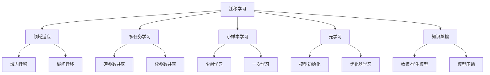
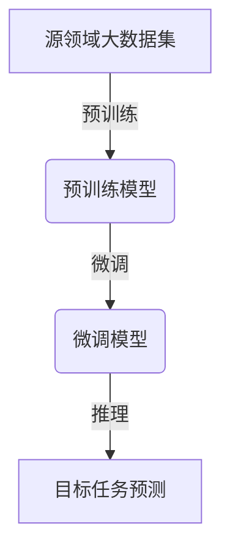

# 迁移学习 (Transfer Learning) 原理与代码实例讲解

## 1. 背景介绍

### 1.1 问题的由来

在机器学习和深度学习领域中,获取大量高质量的标注数据一直是一个巨大的挑战。训练一个复杂的深度神经网络模型通常需要大量的标注数据,而手工标注数据是一项昂贵且耗时的工作。因此,如何在有限的标注数据条件下,快速有效地训练出高质量的模型,成为了研究的热点问题。

传统的机器学习方法是从头开始训练一个全新的模型,需要大量的标注数据作为训练集。但在现实场景中,我们常常只能获取到较少的标注数据,如果直接用这些有限的数据训练模型,通常很难获得理想的性能。

### 1.2 研究现状

为了解决上述数据不足的问题,研究人员提出了迁移学习(Transfer Learning)的概念和方法。迁移学习的核心思想是利用在源领域学习到的知识,并将其应用到目标领域的任务中,从而减少在目标领域中所需的标注数据量。

目前,迁移学习已经在计算机视觉、自然语言处理等多个领域取得了巨大的成功。例如在计算机视觉领域,我们可以利用在ImageNet等大型数据集上预训练的模型,将其迁移到其他视觉任务中,极大地提高了模型的性能和训练效率。

### 1.3 研究意义

迁移学习的研究对于推动人工智能技术的发展具有重要意义:

1. **降低数据标注成本**:通过迁移学习,我们可以利用已有的标注数据,减少在新任务上的数据标注工作量,从而降低了人工标注的成本。

2. **提高模型性能**:迁移学习可以利用源领域学习到的知识,作为目标任务模型的有效初始化,提高了模型的泛化能力和性能。

3. **加速模型训练**:由于可以利用源领域的预训练模型,迁移学习可以显著加快目标任务模型的训练过程,提高了训练效率。

4. **推动人工智能技术应用**:迁移学习为人工智能技术在更多领域的应用铺平了道路,使得在数据较少的情况下也能训练出高质量的模型,推动了人工智能技术的落地应用。

### 1.4 本文结构

本文将全面介绍迁移学习的基本原理、核心算法、数学模型以及实际应用。文章主要包括以下几个部分:

1. 核心概念与联系
2. 核心算法原理与具体操作步骤
3. 数学模型和公式详细讲解与案例分析
4. 项目实践:代码实例和详细解释
5. 实际应用场景
6. 工具和资源推荐
7. 总结:未来发展趋势与挑战
8. 附录:常见问题与解答

## 2. 核心概念与联系

迁移学习(Transfer Learning)是机器学习中的一个重要概念,它涉及到多个相关的核心概念,如下所示:

1. **领域适应(Domain Adaptation)**:指将源领域的知识迁移到目标领域的过程,包括域内迁移和域间迁移两种情况。

2. **多任务学习(Multi-Task Learning)**:同时学习多个相关任务,通过硬参数共享或软参数共享的方式,提高各个任务的性能。

3. **小样本学习(Few-Shot Learning)**:在有限的标注样本条件下,快速学习新任务的能力,包括少射学习和一次学习。

4. **元学习(Meta Learning)**:通过学习任务之间的共性,获得快速学习新任务的能力,常用于模型初始化和优化器学习。

5. **知识蒸馏(Knowledge Distillation)**:将大型教师模型的知识迁移到小型学生模型中,用于模型压缩和部署。

这些概念相互关联,共同构成了迁移学习的理论基础和方法体系。理解它们之间的联系,对于掌握迁移学习的本质至关重要。

## 3. 核心算法原理与具体操作步骤

### 3.1 算法原理概述

迁移学习的核心算法原理可以概括为以下三个步骤:

1. **预训练(Pre-training)**:在源领域的大型数据集上训练一个基础模型,学习通用的特征表示。

2. **微调(Fine-tuning)**:将预训练模型作为初始化,在目标任务的小型数据集上进行进一步的微调,使模型适应目标任务。

3. **推理(Inference)**:使用微调后的模型在目标任务上进行推理和预测。

这种"预训练 + 微调"的范式已经成为迁移学习中最常用和最有效的方法。通过首先在源领域学习通用的特征表示,然后将这些知识迁移并微调到目标任务上,可以极大地提高模型的性能和训练效率。

### 3.2 算法步骤详解

1. **预训练阶段**

   - 选择合适的源领域数据集,通常需要足够大且与目标任务相关。
   - 设计和训练基础模型,学习通用的特征表示,常用的模型包括CNN、RNN、Transformer等。
   - 对预训练模型进行保存,以备后续微调使用。

2. **微调阶段**

   - 准备目标任务的小型数据集,通常数据量较少。
   - 加载预训练模型的权重作为初始化。
   - 对预训练模型进行微调,包括:
     - 冻结部分层,只微调最后几层。
     - 对所有层进行微调,使用较小的学习率。
     - 根据需要增加或修改部分网络层。
   - 在目标任务的验证集上评估模型性能,选择最优的微调策略。

3. **推理阶段**

   - 使用微调后的模型在目标任务的测试集上进行推理和预测。
   - 根据需要,可以对模型进行部署和优化。

通过上述步骤,我们可以充分利用源领域的知识,快速适应目标任务,从而在有限的数据条件下获得良好的模型性能。

### 3.3 算法优缺点

**优点**:

1. **提高模型性能**:通过迁移学习,我们可以利用源领域的知识,提高目标任务模型的性能和泛化能力。
2. **减少数据需求**:迁移学习可以在有限的目标任务数据条件下,训练出高质量的模型,降低了数据标注的成本。
3. **加速训练过程**:由于可以利用预训练模型作为初始化,迁移学习可以显著加快目标任务模型的训练过程。
4. **灵活性强**:迁移学习可以应用于不同的领域和任务,具有很强的灵活性和通用性。

**缺点**:

1. **领域差异**:如果源领域与目标任务之间存在较大的差异,直接迁移可能会导致性能下降,需要进行领域适应。
2. **计算资源需求**:预训练过程通常需要大量的计算资源,对硬件设备有较高的要求。
3. **微调策略选择**:合适的微调策略(如层选择、学习率等)需要根据具体任务进行调整和选择。
4. **可解释性较差**:迁移学习模型的内部机理通常较为复杂,可解释性较差。

### 3.4 算法应用领域

迁移学习已经被广泛应用于多个领域,包括但不限于:

1. **计算机视觉**:图像分类、目标检测、语义分割等。
2. **自然语言处理**:文本分类、机器翻译、问答系统等。
3. **语音识别**:语音识别、说话人识别等。
4. **医疗健康**:医学图像分析、疾病诊断等。
5. **金融**:欺诈检测、风险评估等。
6. **推荐系统**:个性化推荐等。

随着迁移学习技术的不断发展和完善,它将在更多领域发挥重要作用,推动人工智能技术的落地应用。

## 4. 数学模型和公式详细讲解与举例说明

### 4.1 数学模型构建

迁移学习的数学模型通常建立在机器学习和深度学习的基础之上,主要包括以下几个部分:

1. **特征提取**:通过卷积神经网络(CNN)、循环神经网络(RNN)、Transformer等模型,从原始数据(如图像、文本等)中提取有效的特征表示。

2. **损失函数**:根据具体的任务,设计合适的损失函数,如交叉熵损失(分类任务)、均方误差损失(回归任务)等。

3. **正则化**:为了防止过拟合,常采用L1/L2正则化、Dropout等正则化技术。

4. **优化算法**:通常使用梯度下降及其变体(如SGD、Adam等)来优化模型参数。

5. **迁移策略**:根据具体情况,选择合适的迁移策略,如特征提取、微调等。

我们可以将上述各个部分组合,构建出完整的迁移学习模型。以图像分类任务为例,其数学模型可以表示为:

$$
\begin{aligned}
\boldsymbol{x} &\in \mathbb{R}^{H \times W \times C} &&\text{输入图像} \
\boldsymbol{z} &= f_\text{enc}(\boldsymbol{x}; \boldsymbol{\theta}_\text{enc}) &&\text{特征提取} \
\boldsymbol{y} &= f_\text{cls}(\boldsymbol{z}; \boldsymbol{\theta}_\text{cls}) &&\text{分类预测} \
\mathcal{L}(\boldsymbol{y}, \boldsymbol{y}_\text{true}) &= \sum_{i=1}^{N} -\boldsymbol{y}_\text{true}^{(i)} \log \boldsymbol{y}^{(i)} &&\text{交叉熵损失} \
\boldsymbol{\theta}^* &= \operatorname*{argmin}_{\boldsymbol{\theta}} \mathcal{L}(\boldsymbol{y}, \boldsymbol{y}_\text{true}) + \lambda \Omega(\boldsymbol{\theta}) &&\text{优化目标}
\end{aligned}
$$

其中:

- $\boldsymbol{x}$ 是输入图像,维度为 $H \times W \times C$ (高度、宽度、通道数)
- $f_\text{enc}$ 是特征提取模块(如CNN),参数为 $\boldsymbol{\theta}_\text{enc}$
- $f_\text{cls}$ 是分类预测模块(如全连接层),参数为 $\boldsymbol{\theta}_\text{cls}$
- $\mathcal{L}$ 是交叉熵损失函数
- $\Omega(\boldsymbol{\theta})$ 是正则化项(如L2正则化)
- $\boldsymbol{\theta}^*$ 是优化目标,即最小化损失函数和正则化项

在迁移学习中,我们可以利用在源领域预训练得到的 $\boldsymbol{\theta}_\text{enc}$ 参数,作为目标任务的初始化,然后在目标任务数据上微调整个模型,获得最优的 $\boldsymbol{\theta}^*$。

### 4.2 公式推导过程

在迁移学习中,一个重要的问题是如何量化源领域和目标领域之间的分布差异,并据此设计有效的迁移策略。常用的方法是最小化两个域之间的某种距离或散度(Divergence)。

我们以最大均值差异(Maximum Mean Discrepancy, MMD)为例,推导其在迁移学习中的应用。MMD 是一种用于衡量两个分布