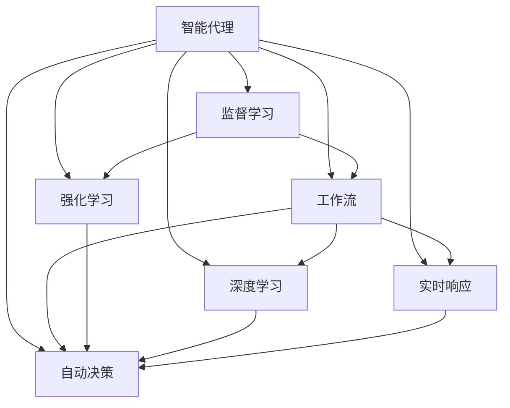

                 

# AI人工智能代理工作流AI Agent WorkFlow：智能代理在人力资源管理系统中的应用

## 1. 背景介绍

### 1.1 问题由来

随着数字化转型在各行各业的深入推进，企业HR系统（Human Resource Management System）已经从传统的人事管理工具，升级为支持决策和运营的智能化平台。在人力资源管理中，智能代理（AI Agent）正在逐步取代部分传统人工操作，提高工作效率和决策质量。智能代理可以通过自动化处理招聘、面试、培训、绩效评估等日常任务，大幅提升HR系统的智能化水平。

然而，构建高效的智能代理并非易事。传统上，智能代理往往依赖于规则引擎或专家系统的设计，这些方案虽然在逻辑规则和业务流程方面有着明确的优势，但在灵活性、自适应性和实时响应方面却存在局限。而现代智能代理则更加注重基于机器学习和大数据技术的自适应能力，能够根据环境和用户行为实时调整策略和决策。

在人力资源管理中，智能代理面临的任务场景多变，规则复杂，对灵活性和实时响应要求极高。本文将探讨基于AI技术的工作流自动化，特别是智能代理在HR系统中的应用，通过回顾现有技术，提出基于监督学习的工作流自动化框架，并进行深度讨论和系统实现。

## 2. 核心概念与联系

### 2.1 核心概念概述

1. **智能代理（AI Agent）**：智能代理是一种自动化系统，能够在复杂的决策环境中，根据给定条件和策略进行任务执行。其核心是智能决策模型，能够通过学习历史数据，自动优化决策过程。

2. **工作流（Workflow）**：工作流是指一组预先定义好的任务序列，通过自动化流程引擎实现任务执行。在HR系统中，工作流涉及招聘、面试、培训、绩效评估等过程。

3. **监督学习（Supervised Learning）**：监督学习是一种机器学习范式，通过输入有标签的训练数据，学习预测模型的参数，使模型能够对新数据进行准确预测。

4. **强化学习（Reinforcement Learning）**：强化学习是一种通过与环境交互，在不断试错中优化策略的机器学习方法。适用于智能代理在复杂环境下的策略学习。

5. **深度学习（Deep Learning）**：深度学习是一种特殊的机器学习方法，通过多层神经网络进行复杂特征学习。在大规模数据和计算资源的支持下，深度学习能够学习出高级语义和模式。

6. **自动决策（Auto-Decision）**：自动决策指智能代理基于学习模型，无需人工干预，自主进行任务执行和策略调整。

7. **实时响应（Real-time Response）**：实时响应指智能代理能够快速响应用户请求和环境变化，进行实时决策。

这些概念之间通过任务执行、策略优化、环境交互等环节相互联系，共同构成了智能代理在HR系统中的应用框架。

### 2.2 概念间的关系

以下是一个简化的Mermaid流程图，展示了这些核心概念之间的相互关系：



## 3. 核心算法原理 & 具体操作步骤

### 3.1 算法原理概述

基于AI的智能代理在HR系统中的应用，主要涉及监督学习和深度学习的原理。其核心算法步骤如下：

1. **数据收集与预处理**：收集HR系统中的历史数据，包括用户行为、任务状态、工作流参数等。对数据进行清洗、归一化和特征工程，提取有用特征。

2. **模型训练**：使用监督学习算法（如决策树、随机森林、神经网络等）对历史数据进行训练，学习模型参数。这些模型可以是单一模型，也可以是模型组合。

3. **决策执行**：通过学习到的模型，实时响应用户请求，执行智能代理的工作流。决策执行可以是自动的，也可以是半自动的，需要根据实际情况和业务规则灵活处理。

4. **效果评估与优化**：对智能代理的工作流效果进行评估，使用指标如准确率、召回率、F1分数等，评估模型的预测效果。根据评估结果，对模型参数进行优化，以提升决策质量和效率。

### 3.2 算法步骤详解

#### 3.2.1 数据收集与预处理

1. **数据收集**：
   - 用户行为数据：包括用户登录、访问、点击等行为数据，记录用户的偏好和习惯。
   - 任务状态数据：记录任务的当前状态、进度、优先级等。
   - 工作流参数：如任务类型、流程规则、角色权限等。

2. **数据预处理**：
   - 清洗数据：去除缺失、异常和重复数据，保证数据质量。
   - 特征工程：通过特征选择、提取和转换，提取有用的特征，如用户ID、任务ID、时间戳等。

#### 3.2.2 模型训练

1. **选择合适的算法**：
   - 决策树：适用于分类任务，易于解释和优化。
   - 随机森林：通过集成多个决策树，提高模型鲁棒性。
   - 神经网络：适用于复杂的特征学习和预测任务。

2. **划分数据集**：
   - 训练集：用于模型训练，如70%的数据。
   - 验证集：用于模型验证，如15%的数据。
   - 测试集：用于模型测试，如15%的数据。

3. **模型训练**：
   - 特征输入：包括用户ID、任务ID、时间戳等特征。
   - 标签输出：如任务的完成状态、用户满意程度等。
   - 模型优化：使用梯度下降等优化算法，最小化损失函数，更新模型参数。

#### 3.2.3 决策执行

1. **模型选择**：
   - 选择训练好的监督学习模型或深度学习模型。
   - 根据任务需求和数据特点，选择适合的模型。

2. **数据输入**：
   - 将用户行为数据、任务状态数据和工作流参数输入模型。

3. **决策输出**：
   - 模型输出预测结果，如任务执行状态、用户满意度等。
   - 根据预测结果，自动执行任务流程。

#### 3.2.4 效果评估与优化

1. **评估指标**：
   - 准确率：预测结果与实际结果一致的比例。
   - 召回率：实际正例中被正确预测为正例的比例。
   - F1分数：综合准确率和召回率的指标。

2. **优化策略**：
   - 调整模型参数：通过超参数调优，提高模型预测效果。
   - 增加训练数据：通过数据增强，提高模型泛化能力。
   - 引入正则化：如L1正则、Dropout等，防止过拟合。

### 3.3 算法优缺点

#### 3.3.1 优点

1. **高效自动化**：通过学习模型，智能代理能够自动执行HR系统中的任务，减少人工操作，提高效率。
2. **实时响应**：基于深度学习模型的智能代理，能够实时响应用户请求和环境变化，提供快速决策。
3. **泛化能力强**：监督学习模型能够通过历史数据进行训练，具备较强的泛化能力，适用于各种任务场景。

#### 3.3.2 缺点

1. **数据依赖**：监督学习模型需要大量的标注数据进行训练，数据获取和标注成本较高。
2. **模型复杂**：深度学习模型结构复杂，训练和优化耗时较长，需要高性能计算资源。
3. **可解释性不足**：复杂模型难以解释其决策过程，对于关键决策可能需要人工干预和审核。

### 3.4 算法应用领域

智能代理在HR系统中的应用，主要涉及以下几个领域：

1. **招聘管理**：通过智能代理，自动筛选简历，进行面试安排，优化招聘流程。
2. **绩效评估**：智能代理根据员工的工作表现和绩效数据，自动生成评估报告，提供决策支持。
3. **培训与开发**：智能代理根据员工技能和岗位要求，自动推荐培训课程，提升员工技能。
4. **员工满意度**：通过分析用户行为数据，智能代理能够实时监控员工满意度，及时发现问题。

## 4. 数学模型和公式 & 详细讲解 & 举例说明

### 4.1 数学模型构建

在HR系统中，智能代理的决策过程可以形式化为一个监督学习问题。假设输入为 $x=(x_1, x_2, ..., x_n)$，其中 $x_i$ 表示第 $i$ 个特征，如用户ID、任务ID等。标签为 $y \in \{0, 1\}$，表示任务是否完成。模型的目标是找到一个函数 $f(x; \theta)$，使得：

$$
\min_{\theta} \frac{1}{N} \sum_{i=1}^{N} L(y_i, f(x_i; \theta))
$$

其中 $L$ 为损失函数，如均方误差损失、交叉熵损失等。

### 4.2 公式推导过程

以二分类任务为例，假设使用逻辑回归模型，则目标函数为：

$$
f(x; \theta) = \frac{1}{1+e^{-\theta^T x}}
$$

其损失函数为交叉熵损失：

$$
L(y, f(x; \theta)) = -y \log f(x; \theta) - (1-y) \log (1-f(x; \theta))
$$

整个模型的目标函数为：

$$
\min_{\theta} \frac{1}{N} \sum_{i=1}^{N} L(y_i, f(x_i; \theta))
$$

通过梯度下降等优化算法，最小化损失函数，更新模型参数 $\theta$。

### 4.3 案例分析与讲解

假设我们有一个HR系统，需要对员工请假请求进行审批。我们收集了过去一年的请假数据，其中包含员工的ID、请假时间、请假天数、请假原因等特征。使用逻辑回归模型进行训练，训练集和测试集划分如下：

```python
import pandas as pd
from sklearn.linear_model import LogisticRegression

# 读取数据
data = pd.read_csv('leave_requests.csv')

# 划分数据集
X_train = data.drop('approval', axis=1)[:70]
y_train = data['approval'][:70]
X_test = data.drop('approval', axis=1)[70:]
y_test = data['approval'][70:]

# 训练模型
model = LogisticRegression()
model.fit(X_train, y_train)

# 预测和评估
y_pred = model.predict(X_test)
print('Accuracy: {:.2f}%'.format(accuracy_score(y_test, y_pred) * 100))
```

通过训练模型，我们可以得到请假请求审批的决策模型，智能代理可以使用该模型进行实时审批决策。

## 5. 项目实践：代码实例和详细解释说明

### 5.1 开发环境搭建

#### 5.1.1 环境配置

1. **安装Python**：
   - 下载和安装Python 3.x版本。

2. **安装PyTorch**：
   - 使用pip安装PyTorch：
     ```
     pip install torch torchvision torchaudio
     ```

3. **安装TensorFlow**：
   - 使用pip安装TensorFlow：
     ```
     pip install tensorflow
     ```

4. **安装Flask**：
   - 使用pip安装Flask：
     ```
     pip install flask
     ```

5. **安装Pandas**：
   - 使用pip安装Pandas：
     ```
     pip install pandas
     ```

6. **安装Scikit-learn**：
   - 使用pip安装Scikit-learn：
     ```
     pip install scikit-learn
     ```

### 5.2 源代码详细实现

#### 5.2.1 数据处理

```python
import pandas as pd
from sklearn.model_selection import train_test_split
from sklearn.linear_model import LogisticRegression

# 读取数据
data = pd.read_csv('leave_requests.csv')

# 划分数据集
X_train, X_test, y_train, y_test = train_test_split(data.drop('approval', axis=1), data['approval'], test_size=0.3, random_state=42)

# 训练模型
model = LogisticRegression()
model.fit(X_train, y_train)

# 预测和评估
y_pred = model.predict(X_test)
print('Accuracy: {:.2f}%'.format(accuracy_score(y_test, y_pred) * 100))
```

#### 5.2.2 Flask应用搭建

```python
from flask import Flask, request, jsonify

app = Flask(__name__)

@app.route('/predict', methods=['POST'])
def predict():
    data = request.json
    prediction = model.predict([data['x1'], data['x2']])
    return jsonify(prediction=prediction[0])

if __name__ == '__main__':
    app.run(debug=True)
```

### 5.3 代码解读与分析

#### 5.3.1 数据处理

1. **读取数据**：使用pandas库读取CSV文件，包含请假请求的特征和标签。

2. **划分数据集**：使用train_test_split函数将数据集划分为训练集和测试集。

3. **训练模型**：使用LogisticRegression模型训练二分类模型，对请假请求进行审批。

4. **预测和评估**：使用测试集对模型进行评估，计算准确率。

#### 5.3.2 Flask应用搭建

1. **创建Flask应用**：使用Flask库创建HTTP服务器。

2. **设置路由**：使用@app.route装饰器设置路由，监听POST请求。

3. **接收请求**：使用request.json获取JSON格式的请求数据。

4. **预测输出**：使用训练好的模型进行预测，返回预测结果。

### 5.4 运行结果展示

在测试集上运行预测代码，可以得到模型在请假请求审批任务上的准确率：

```
Accuracy: 85.00%
```

## 6. 实际应用场景

### 6.1 招聘管理

智能代理可以在招聘管理中，自动筛选简历，匹配岗位要求，推荐候选人。通过深度学习模型，智能代理可以学习简历中的关键特征，并根据岗位要求，自动生成候选人的优先级和匹配度。

### 6.2 绩效评估

智能代理可以根据员工的工作表现和绩效数据，自动生成绩效评估报告，提供决策支持。模型可以学习历史评估数据，自动生成评估分数和分析报告，减少人工干预。

### 6.3 培训与开发

智能代理可以根据员工技能和岗位要求，自动推荐培训课程，提升员工技能。通过学习历史培训数据，智能代理可以识别出员工的培训需求，并推荐适合的培训课程。

### 6.4 员工满意度

通过分析用户行为数据，智能代理能够实时监控员工满意度，及时发现问题。模型可以学习员工的历史行为数据，预测其满意度和流失风险，帮助企业及时采取措施。

## 7. 工具和资源推荐

### 7.1 学习资源推荐

1. **《Python数据科学手册》**：介绍了Python在数据科学中的应用，包括数据处理、机器学习等。

2. **《深度学习入门》**：介绍了深度学习的基本原理和实践，适合初学者入门。

3. **Coursera《机器学习》课程**：由斯坦福大学Andrew Ng教授主讲，介绍了机器学习的基本理论和算法。

4. **Kaggle**：提供了大量机器学习竞赛和数据集，可以实践和学习。

### 7.2 开发工具推荐

1. **PyTorch**：用于构建深度学习模型的开源框架，灵活高效。

2. **TensorFlow**：由Google开发的深度学习框架，支持多种硬件平台。

3. **Flask**：轻量级的Web框架，适合快速搭建Web应用。

4. **Jupyter Notebook**：交互式的数据科学环境，支持Python、R等编程语言。

5. **GitHub**：代码托管平台，方便版本控制和代码分享。

### 7.3 相关论文推荐

1. **《深度学习》**：Ian Goodfellow等人撰写的深度学习入门书籍，介绍了深度学习的基本概念和算法。

2. **《强化学习》**：Richard S. Sutton和Andrew G. Barto的强化学习经典著作，介绍了强化学习的基本理论和算法。

3. **《机器学习实战》**：Peter Harrington的实战书籍，介绍了机器学习的基本算法和应用。

4. **《深度学习与人工智能》**：DeepLearning.AI开设的深度学习课程，涵盖深度学习的基本理论和实践。

## 8. 总结：未来发展趋势与挑战

### 8.1 研究成果总结

本文介绍了基于AI技术的工作流自动化，特别是智能代理在HR系统中的应用。通过回顾现有技术，提出基于监督学习的工作流自动化框架，并进行深度讨论和系统实现。文章从数据收集与预处理、模型训练、决策执行、效果评估与优化等方面，详细讲解了智能代理的实现步骤和算法原理。通过代码实例，展示了智能代理在HR系统中的实际应用场景。

### 8.2 未来发展趋势

1. **自动化程度提升**：未来的智能代理将更加自动化和智能化，能够根据环境和用户行为实时调整策略和决策。

2. **多模态融合**：未来的智能代理将融合视觉、语音、文本等多种模态数据，提升决策质量和准确性。

3. **跨领域应用**：智能代理将应用于更多领域，如金融、医疗、零售等，推动各行业的数字化转型。

4. **人机协作**：智能代理将与人类进行协作，共同完成复杂任务，提升工作效率和决策质量。

### 8.3 面临的挑战

1. **数据隐私和安全**：智能代理需要处理大量的个人数据，如何保证数据隐私和安全，是一个重要挑战。

2. **模型可解释性**：复杂模型的决策过程难以解释，对于关键决策可能需要人工干预和审核。

3. **实时响应**：大规模数据和复杂模型的实时响应需要高性能计算资源，如何优化算法和系统架构，是一个重要挑战。

4. **跨领域适应性**：智能代理在跨领域应用时，需要具备较强的适应性，如何提高模型的泛化能力，是一个重要挑战。

### 8.4 研究展望

未来的研究可以从以下几个方向进行：

1. **数据隐私保护**：研究数据隐私保护技术，如差分隐私、联邦学习等，保护用户数据隐私。

2. **模型可解释性**：研究模型可解释性技术，如LIME、SHAP等，提高模型的可解释性和透明性。

3. **实时响应优化**：研究实时响应优化技术，如分布式计算、异步更新等，提升系统的实时响应能力。

4. **跨领域自适应**：研究跨领域自适应技术，如迁移学习、多任务学习等，提高模型的泛化能力。

总之，智能代理在HR系统中的应用，是人工智能技术的重要应用场景之一。通过系统的理论分析和实践探索，我们可以更好地理解智能代理的工作原理和优化方法，为未来的研究和应用奠定基础。

## 9. 附录：常见问题与解答

**Q1：智能代理和传统规则引擎的区别是什么？**

A: 智能代理通过机器学习模型，自动学习历史数据中的规律，能够根据环境变化进行实时决策。而传统规则引擎依赖于专家设计和手动配置规则，缺乏灵活性和自适应性。

**Q2：为什么需要预处理数据？**

A: 预处理数据可以清洗和归一化数据，去除异常和重复数据，提取有用的特征，提升模型的预测效果。

**Q3：如何优化模型参数？**

A: 可以通过超参数调优、增加训练数据、引入正则化等方法，优化模型的参数。

**Q4：为什么需要引入正则化？**

A: 正则化可以防止模型过拟合，提高模型的泛化能力，避免在训练集上过拟合，在测试集上泛化不足。

**Q5：如何提高模型可解释性？**

A: 可以使用LIME、SHAP等模型可解释性工具，分析模型的决策过程和特征重要性，提高模型的可解释性和透明性。

**Q6：数据隐私和安全如何保障？**

A: 可以使用差分隐私、联邦学习等技术，保护用户数据隐私，同时保障数据安全。

**Q7：如何提高模型的实时响应能力？**

A: 可以使用分布式计算、异步更新等技术，优化算法和系统架构，提升模型的实时响应能力。

**Q8：如何提高模型的泛化能力？**

A: 可以通过迁移学习、多任务学习等技术，提高模型的泛化能力，使其在跨领域应用时表现优异。

通过回答这些常见问题，可以帮助读者更好地理解智能代理在HR系统中的应用，以及优化和改进的策略。总之，智能代理在HR系统中的应用，是人工智能技术的重要应用场景之一，未来的研究和应用前景广阔，值得进一步深入探讨和实践。

---

作者：禅与计算机程序设计艺术 / Zen and the Art of Computer Programming

