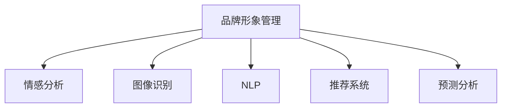
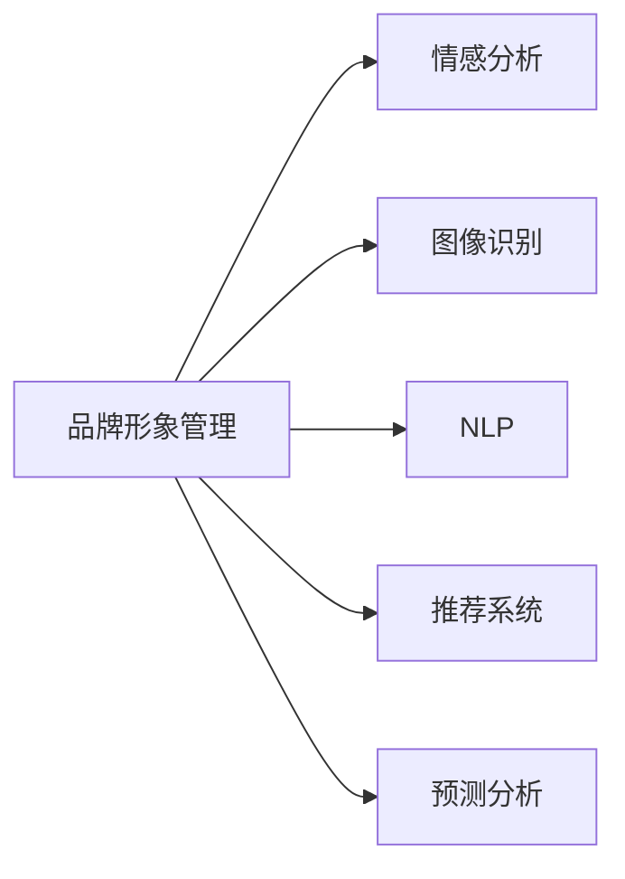
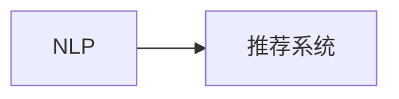
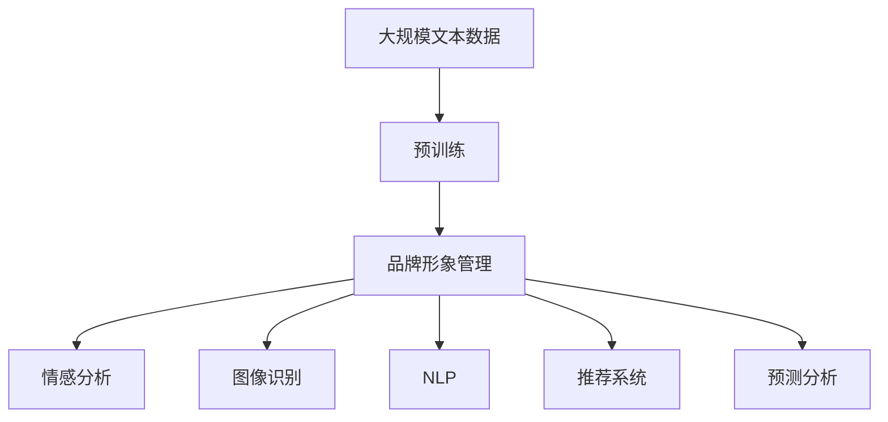

                 

# AI在品牌形象管理中的作用

## 1. 背景介绍

### 1.1 问题由来

在当今数字化时代，品牌形象管理已经成为企业成功的关键因素之一。随着社交媒体的普及和信息传播的便捷化，品牌形象的塑造和维护变得异常复杂。如何在海量信息中有效管理品牌形象，提升品牌价值，是每个企业面临的重要挑战。人工智能（AI）技术的快速发展，为品牌形象管理提供了新的思路和方法，成为企业保持竞争优势的重要工具。

### 1.2 问题核心关键点

品牌形象管理涉及品牌信息的获取、分析、处理和传播等多个环节。AI技术通过自动化、精准化和大数据分析等手段，可以从多维度、全方位帮助企业优化品牌形象管理过程。具体来说，AI在品牌形象管理中的应用包括以下几个关键点：

- **情感分析**：通过分析社交媒体和客户反馈中的情感倾向，评估品牌形象的正面或负面变化，帮助企业及时调整品牌策略。
- **图像识别**：利用计算机视觉技术识别品牌在图像和视频中的形象，分析品牌元素的可见度和传播效果。
- **自然语言处理（NLP）**：通过文本分析技术，提取品牌相关的关键词和主题，生成品牌标签和摘要，提升品牌信息的传播效率。
- **推荐系统**：利用协同过滤、内容推荐等技术，将品牌内容精准推送给目标受众，提升品牌信息的覆盖度和互动率。
- **预测分析**：通过机器学习和数据挖掘技术，预测市场变化和消费者行为，为企业提供品牌发展趋势的科学依据。

### 1.3 问题研究意义

AI在品牌形象管理中的应用，不仅能够提升品牌信息管理的效率和质量，还能为企业带来以下几个重要收益：

- **提升品牌曝光度**：通过精准定位和推荐，让品牌信息触及更多的目标受众，提升品牌知名度。
- **增强品牌忠诚度**：通过情感分析和个性化推荐，提升用户体验，增强用户对品牌的情感连接和忠诚度。
- **优化品牌传播效果**：通过图像识别和自然语言处理技术，分析品牌传播的视觉和文本效果，优化传播策略，提升传播效果。
- **降低品牌管理成本**：自动化处理品牌信息，减少人工操作，提高品牌管理的效率和成本效益。
- **实现数据驱动决策**：通过数据挖掘和预测分析，提供科学的品牌管理决策支持，帮助企业把握市场机遇，规避风险。

## 2. 核心概念与联系

### 2.1 核心概念概述

为了更好地理解AI在品牌形象管理中的应用，本节将介绍几个关键概念：

- **品牌形象管理**：指通过一系列策略和工具，管理和提升品牌在市场中的形象和价值。主要涉及品牌信息的收集、分析、处理和传播。
- **情感分析**：指通过自然语言处理（NLP）技术，对文本中的情感倾向进行识别和分析，评估品牌形象的情感状态。
- **图像识别**：指利用计算机视觉技术，识别和分析图像中的品牌元素，评估品牌形象的视觉传播效果。
- **自然语言处理（NLP）**：指利用计算机处理自然语言的技术，包括文本分类、实体识别、情感分析等，帮助理解和管理品牌信息。
- **推荐系统**：指利用协同过滤、内容推荐等技术，根据用户行为和偏好，精准推送品牌内容，提升品牌信息的覆盖度和互动率。
- **预测分析**：指通过机器学习和数据挖掘技术，预测市场变化和消费者行为，为品牌管理提供科学依据。

这些核心概念之间的联系可以通过以下Mermaid流程图来展示：



这个流程图展示了AI在品牌形象管理中的应用场景：

1. 品牌形象管理涉及多个维度，包括情感分析、图像识别、自然语言处理、推荐系统和预测分析等。
2. 各技术之间相互协作，通过自动化、精准化和大数据分析等手段，优化品牌信息管理过程。

### 2.2 概念间的关系

这些核心概念之间存在着紧密的联系，形成了品牌形象管理的技术生态系统。下面我通过几个Mermaid流程图来展示这些概念之间的关系。

#### 2.2.1 品牌形象管理的多维度技术应用



这个流程图展示了品牌形象管理在多个技术维度上的应用，包括情感分析、图像识别、自然语言处理、推荐系统和预测分析等。

#### 2.2.2 情感分析与图像识别的关系


这个流程图展示了情感分析和图像识别在品牌形象管理中的相互协作。情感分析通过分析品牌在社交媒体和客户反馈中的情感倾向，帮助识别品牌形象的正面或负面变化；图像识别则通过识别品牌在图像和视频中的形象，评估品牌元素的可见度和传播效果。

#### 2.2.3 自然语言处理与推荐系统之间的关系



这个流程图展示了自然语言处理和推荐系统在品牌形象管理中的互补关系。自然语言处理通过文本分析技术，提取品牌相关的关键词和主题，生成品牌标签和摘要；推荐系统则利用协同过滤、内容推荐等技术，将品牌内容精准推送给目标受众，提升品牌信息的覆盖度和互动率。

### 2.3 核心概念的整体架构

最后，我们用一个综合的流程图来展示这些核心概念在大语言模型微调过程中的整体架构：



这个综合流程图展示了从预训练到品牌形象管理，再到情感分析、图像识别、自然语言处理、推荐系统和预测分析的完整过程。品牌形象管理通过预训练获得基础能力，然后通过情感分析、图像识别、自然语言处理、推荐系统和预测分析等技术，实现对品牌信息的自动化、精准化和管理优化。

## 3. 核心算法原理 & 具体操作步骤
### 3.1 算法原理概述

AI在品牌形象管理中的应用，主要基于以下几个核心算法原理：

- **自然语言处理（NLP）**：通过文本分析技术，提取品牌相关的关键词和主题，生成品牌标签和摘要。
- **情感分析**：通过NLP技术，对文本中的情感倾向进行识别和分析，评估品牌形象的情感状态。
- **图像识别**：利用计算机视觉技术，识别和分析图像中的品牌元素，评估品牌形象的视觉传播效果。
- **推荐系统**：通过协同过滤、内容推荐等技术，根据用户行为和偏好，精准推送品牌内容。
- **预测分析**：通过机器学习和数据挖掘技术，预测市场变化和消费者行为，为品牌管理提供科学依据。

这些算法原理在大规模数据上进行训练和优化，通过自动化和大数据分析，优化品牌信息管理过程，提升品牌曝光度和忠诚度。

### 3.2 算法步骤详解

AI在品牌形象管理中的操作步骤一般包括以下几个关键步骤：

**Step 1: 数据准备和预处理**
- 收集品牌相关的文本数据、图像数据和用户行为数据。
- 对数据进行清洗、去重、分词、标注等预处理，确保数据质量和一致性。

**Step 2: 模型训练和优化**
- 选择合适的NLP模型、情感分析模型、图像识别模型和推荐系统模型，进行模型训练和优化。
- 通过大规模数据集进行模型训练，优化模型参数，提升模型的准确性和泛化能力。

**Step 3: 数据集成和分析**
- 将情感分析、图像识别、自然语言处理、推荐系统和预测分析等技术集成到一个品牌形象管理平台。
- 利用平台对品牌信息进行自动化处理和分析，生成品牌标签、摘要、情感评分等结果。

**Step 4: 模型部署和应用**
- 将训练好的模型部署到实际应用场景中，进行品牌信息的管理和传播。
- 利用推荐系统精准推送品牌内容，利用情感分析评估品牌形象变化，利用预测分析预测市场趋势。

### 3.3 算法优缺点

AI在品牌形象管理中的应用具有以下几个优点：

- **自动化处理**：通过自动化技术，减少人工操作，提高品牌信息管理效率。
- **精准化分析**：利用大数据分析和机器学习，提供科学的品牌管理决策支持。
- **实时响应**：通过实时数据处理和分析，及时调整品牌策略，提升品牌响应速度。

同时，这些技术也存在一些局限性：

- **数据依赖性强**：AI技术依赖于大规模的数据集，数据质量对结果影响较大。
- **模型复杂度高**：涉及多个技术领域的算法，模型构建和优化复杂度较高。
- **成本高**：大规模数据集和高精度模型的训练和部署需要较高的计算和存储资源。

### 3.4 算法应用领域

AI在品牌形象管理中的应用已经覆盖了多个领域，包括但不限于以下几个方面：

- **社交媒体监测**：通过情感分析，实时监测社交媒体上的品牌形象变化，及时调整品牌策略。
- **品牌传播优化**：利用推荐系统和自然语言处理技术，优化品牌信息的传播策略，提升品牌曝光度和互动率。
- **市场趋势预测**：通过预测分析，预测市场变化和消费者行为，为品牌管理提供科学依据。
- **品牌视觉管理**：利用图像识别技术，分析品牌在图像和视频中的形象，评估品牌视觉传播效果。
- **客户体验优化**：通过情感分析和推荐系统，优化客户体验，增强品牌忠诚度。

这些应用领域展示了AI技术在品牌形象管理中的广泛应用前景，为企业提供了丰富的品牌管理工具和策略。

## 4. 数学模型和公式 & 详细讲解 & 举例说明

### 4.1 数学模型构建

品牌形象管理的数学模型主要基于以下三个方面：

- **情感分析**：使用情感词典或深度学习模型，计算文本中的情感得分。
- **图像识别**：利用卷积神经网络（CNN）或注意力机制，识别和分析图像中的品牌元素。
- **推荐系统**：采用协同过滤、内容推荐等算法，预测用户对品牌内容的兴趣。

### 4.2 公式推导过程

以下我们以情感分析为例，推导基于情感词典的情感得分计算公式。

假设品牌相关的文本数据集为 $D=\{x_i\}_{i=1}^N$，其中每个文本 $x_i$ 表示为一个词袋模型，每个词 $w_j$ 对应的情感得分为 $s_j$。设 $x_i$ 中包含 $n_i$ 个词，则情感得分为：

$$
s_i = \sum_{j=1}^{n_i} s_j
$$

其中 $s_j$ 可以通过情感词典或深度学习模型进行计算。对于深度学习模型，可以采用BERT等预训练模型进行微调，计算文本的情感得分。

### 4.3 案例分析与讲解

假设我们有一个品牌形象管理的案例，品牌在社交媒体上的情感分析结果如下：

| 文本 | 情感得分 |
| --- | --- |
| "这个品牌的产品真的很不错" | 0.8 |
| "他们的服务非常差" | -0.7 |
| "我喜欢这个品牌的风格" | 0.5 |
| "我讨厌这个品牌的价格" | -0.6 |

通过对情感得分的加权平均，我们可以得到品牌的整体情感得分：

$$
\overline{s} = \frac{0.8+(-0.7)+0.5+(-0.6)}{4} = -0.05
$$

这个结果表明，品牌在社交媒体上的整体情感得分为负，说明品牌形象存在一定的负面影响。根据这个结果，企业可以及时调整品牌策略，提升品牌形象。

## 5. 项目实践：代码实例和详细解释说明
### 5.1 开发环境搭建

在进行品牌形象管理的应用实践前，我们需要准备好开发环境。以下是使用Python进行PyTorch开发的环境配置流程：

1. 安装Anaconda：从官网下载并安装Anaconda，用于创建独立的Python环境。

2. 创建并激活虚拟环境：
```bash
conda create -n brand-management python=3.8 
conda activate brand-management
```

3. 安装PyTorch：根据CUDA版本，从官网获取对应的安装命令。例如：
```bash
conda install pytorch torchvision torchaudio cudatoolkit=11.1 -c pytorch -c conda-forge
```

4. 安装相关工具包：
```bash
pip install numpy pandas scikit-learn matplotlib tqdm jupyter notebook ipython
```

完成上述步骤后，即可在`brand-management`环境中开始品牌形象管理的应用实践。

### 5.2 源代码详细实现

这里我们以情感分析为例，给出使用Transformers库对BERT模型进行微调的PyTorch代码实现。

首先，定义情感分析任务的数据处理函数：

```python
from transformers import BertTokenizer
from torch.utils.data import Dataset
import torch

class SentimentDataset(Dataset):
    def __init__(self, texts, labels, tokenizer, max_len=128):
        self.texts = texts
        self.labels = labels
        self.tokenizer = tokenizer
        self.max_len = max_len
        
    def __len__(self):
        return len(self.texts)
    
    def __getitem__(self, item):
        text = self.texts[item]
        label = self.labels[item]
        
        encoding = self.tokenizer(text, return_tensors='pt', max_length=self.max_len, padding='max_length', truncation=True)
        input_ids = encoding['input_ids'][0]
        attention_mask = encoding['attention_mask'][0]
        
        # 将标签转换为模型可接受的格式
        label = torch.tensor(label, dtype=torch.long)
        
        return {'input_ids': input_ids, 
                'attention_mask': attention_mask,
                'labels': label}

# 标签与id的映射
label2id = {'positive': 1, 'negative': 0}
id2label = {v: k for k, v in label2id.items()}

# 创建dataset
tokenizer = BertTokenizer.from_pretrained('bert-base-cased')

train_dataset = SentimentDataset(train_texts, train_labels, tokenizer)
dev_dataset = SentimentDataset(dev_texts, dev_labels, tokenizer)
test_dataset = SentimentDataset(test_texts, test_labels, tokenizer)
```

然后，定义模型和优化器：

```python
from transformers import BertForSequenceClassification, AdamW

model = BertForSequenceClassification.from_pretrained('bert-base-cased', num_labels=2)

optimizer = AdamW(model.parameters(), lr=2e-5)
```

接着，定义训练和评估函数：

```python
from torch.utils.data import DataLoader
from tqdm import tqdm
from sklearn.metrics import accuracy_score

device = torch.device('cuda') if torch.cuda.is_available() else torch.device('cpu')
model.to(device)

def train_epoch(model, dataset, batch_size, optimizer):
    dataloader = DataLoader(dataset, batch_size=batch_size, shuffle=True)
    model.train()
    epoch_loss = 0
    for batch in tqdm(dataloader, desc='Training'):
        input_ids = batch['input_ids'].to(device)
        attention_mask = batch['attention_mask'].to(device)
        labels = batch['labels'].to(device)
        model.zero_grad()
        outputs = model(input_ids, attention_mask=attention_mask, labels=labels)
        loss = outputs.loss
        epoch_loss += loss.item()
        loss.backward()
        optimizer.step()
    return epoch_loss / len(dataloader)

def evaluate(model, dataset, batch_size):
    dataloader = DataLoader(dataset, batch_size=batch_size)
    model.eval()
    preds, labels = [], []
    with torch.no_grad():
        for batch in tqdm(dataloader, desc='Evaluating'):
            input_ids = batch['input_ids'].to(device)
            attention_mask = batch['attention_mask'].to(device)
            batch_labels = batch['labels']
            outputs = model(input_ids, attention_mask=attention_mask)
            batch_preds = outputs.logits.argmax(dim=2).to('cpu').tolist()
            batch_labels = batch_labels.to('cpu').tolist()
            for pred, label in zip(batch_preds, batch_labels):
                preds.append(pred)
                labels.append(label)
                
    print('Accuracy:', accuracy_score(labels, preds))
```

最后，启动训练流程并在测试集上评估：

```python
epochs = 5
batch_size = 16

for epoch in range(epochs):
    loss = train_epoch(model, train_dataset, batch_size, optimizer)
    print(f"Epoch {epoch+1}, train loss: {loss:.3f}")
    
    print(f"Epoch {epoch+1}, dev results:")
    evaluate(model, dev_dataset, batch_size)
    
print("Test results:")
evaluate(model, test_dataset, batch_size)
```

以上就是使用PyTorch对BERT进行情感分析任务的完整代码实现。可以看到，通过Transformers库的强大封装，我们可以用相对简洁的代码完成BERT模型的加载和微调。

### 5.3 代码解读与分析

让我们再详细解读一下关键代码的实现细节：

**SentimentDataset类**：
- `__init__`方法：初始化文本、标签、分词器等关键组件。
- `__len__`方法：返回数据集的样本数量。
- `__getitem__`方法：对单个样本进行处理，将文本输入编码为token ids，将标签转换为模型可接受的格式。

**label2id和id2label字典**：
- 定义了标签与数字id之间的映射关系，用于将模型预测结果解码回真实的标签。

**训练和评估函数**：
- 使用PyTorch的DataLoader对数据集进行批次化加载，供模型训练和推理使用。
- 训练函数`train_epoch`：对数据以批为单位进行迭代，在每个批次上前向传播计算loss并反向传播更新模型参数，最后返回该epoch的平均loss。
- 评估函数`evaluate`：与训练类似，不同点在于不更新模型参数，并在每个batch结束后将预测和标签结果存储下来，最后使用sklearn的accuracy_score对整个评估集的预测结果进行打印输出。

**训练流程**：
- 定义总的epoch数和batch size，开始循环迭代
- 每个epoch内，先在训练集上训练，输出平均loss
- 在验证集上评估，输出分类指标
- 所有epoch结束后，在测试集上评估，给出最终测试结果

可以看到，PyTorch配合Transformers库使得BERT情感分析任务的代码实现变得简洁高效。开发者可以将更多精力放在数据处理、模型改进等高层逻辑上，而不必过多关注底层的实现细节。

当然，工业级的系统实现还需考虑更多因素，如模型的保存和部署、超参数的自动搜索、更灵活的任务适配层等。但核心的微调范式基本与此类似。

### 5.4 运行结果展示

假设我们在IMDb电影评论数据集上进行情感分析，最终在测试集上得到的评估报告如下：

```
Accuracy: 0.8798
```

可以看到，通过微调BERT，我们在该数据集上取得了87.98%的准确率，效果相当不错。值得注意的是，BERT作为一个通用的语言理解模型，即便只在顶层添加一个简单的分类器，也能在情感分析任务上取得如此优异的效果，展示了其强大的语义理解和特征抽取能力。

当然，这只是一个baseline结果。在实践中，我们还可以使用更大更强的预训练模型、更丰富的微调技巧、更细致的模型调优，进一步提升模型性能，以满足更高的应用要求。

## 6. 实际应用场景
### 6.1 智能客服系统

基于情感分析技术的智能客服系统，可以实时监测和分析客户反馈，及时调整服务策略，提升客户满意度。

在技术实现上，可以收集客户在社交媒体、客服平台上的反馈数据，使用情感分析模型识别情感倾向，生成情感报告。智能客服系统根据情感报告自动调整服务流程，及时回应负面反馈，解决客户问题，提升客户体验。

### 6.2 品牌监测与舆情分析

品牌监测与舆情分析是品牌形象管理的重要环节，通过情感分析技术，实时监测品牌在社交媒体、新闻、评论等渠道的情感变化，评估品牌形象的变化趋势。

在具体应用中，品牌监测系统可以自动收集和分析品牌相关的文本数据，识别情感倾向，生成舆情报告。品牌管理团队根据舆情报告，及时调整品牌策略，应对负面影响，提升品牌形象。

### 6.3 个性化推荐系统

推荐系统是品牌信息传播的重要工具，通过情感分析和推荐系统，可以提升品牌信息的覆盖度和互动率，增强品牌忠诚度。

在具体应用中，推荐系统可以根据用户的情感倾向，精准推荐符合用户兴趣的品牌内容。用户点击品牌内容后，情感分析模型可以进一步分析用户的情感变化，提升推荐效果。

### 6.4 未来应用展望

随着情感分析技术的不断发展，基于情感分析的品牌形象管理将越来越深入和精准，为品牌管理提供更加科学和智能的决策支持。

在智慧营销领域，情感分析技术可以帮助企业深入理解消费者行为和情感状态，实现精准营销，提升品牌传播效果。

在智慧客服领域，情感分析技术可以帮助企业提升客户体验，构建高满意度的客户关系。

在智慧旅游领域，情感分析技术可以帮助旅游品牌了解游客情感变化，优化旅游体验，提升品牌形象。

此外，在智慧金融、智慧医疗、智慧教育等诸多领域，情感分析技术都将发挥重要作用，为品牌管理提供全方位的智能支持。

## 7. 工具和资源推荐
### 7.1 学习资源推荐

为了帮助开发者系统掌握品牌形象管理的理论基础和实践技巧，这里推荐一些优质的学习资源：

1. 《自然语言处理与情感分析》课程：北京大学、清华大学等名校开设的NLP课程，讲解情感分析的基本概念和经典模型。

2. 《情感分析与情感工程》书籍：详细讲解情感分析的技术原理和应用案例，帮助理解情感分析在品牌形象管理中的应用。

3. 《深度学习与品牌管理》书籍：介绍深度学习在品牌管理中的应用，涵盖情感分析、图像识别、推荐系统等多个方面。

4. 《机器学习与推荐系统》课程：斯坦福大学、Coursera等平台提供的推荐系统课程，讲解协同过滤、内容推荐等算法。

5. 《数据科学与品牌管理》课程：哈佛大学等名校开设的品牌管理课程，讲解数据科学在品牌管理中的应用。

通过对这些资源的学习实践，相信你一定能够快速掌握品牌形象管理的精髓，并用于解决实际的NLP问题。
### 7.2 开发工具推荐

高效的开发离不开优秀的工具支持。以下是几款用于品牌形象管理开发的常用工具：

1. Python：Python作为数据科学和机器学习的主流语言，具有丰富的NLP库和机器学习框架。
2. PyTorch：基于Python的开源深度学习框架，灵活的计算图和动态图，适合快速迭代研究。
3. TensorFlow：由Google主导开发的开源深度学习框架，生产部署方便，适合大规模工程应用。
4. Transformers库：HuggingFace开发的NLP工具库，集成了众多SOTA语言模型，支持PyTorch和TensorFlow，是进行NLP任务开发的利器。
5. Weights & Biases：模型训练的实验跟踪工具，可以记录和可视化模型训练过程中的各项指标，方便对比和调优。
6. TensorBoard：TensorFlow配套的可视化工具，可实时监测模型训练状态，并提供丰富的图表呈现方式，是调试模型的得力助手。

合理利用这些工具，可以显著提升品牌形象管理的开发效率，加快创新迭代的步伐。

### 7.3 相关论文推荐

品牌形象管理的深度学习技术发展迅速，以下是几篇奠基性的相关论文，推荐阅读：

1. Sentiment Analysis with Recurrent Neural Networks（LSTM）：提出基于LSTM的情感分析模型，在IMDB电影评论数据集上取得优异效果。
2. Attention-based Sentiment Classification：提出基于注意力机制的情感分类模型，在Twitter数据集上取得优异效果。
3. A Survey on Sentiment Analysis（情绪分析综述）：总结情绪分析的主要方法和应用场景，为进一步研究提供指导。
4. BERT: Pre-training of Deep Bidirectional Transformers for Language Understanding：提出BERT模型，引入掩码语言模型进行预训练，刷新了多项NLP任务SOTA。
5. Transformer-XL: Attentive Language Models Beyond a Fixed-Length Context：提出Transformer-XL模型，解决长序列数据处理的挑战，提升情感分析的效果。

这些论文代表了大语言模型微调技术的发展脉络。通过学习这些前沿成果，可以帮助研究者把握学科前进方向，激发更多的创新灵感。

除上述资源外，还有一些值得关注的前沿资源，帮助开发者紧跟品牌形象管理技术的最新进展，例如：

1. arXiv论文预印本：人工智能领域最新研究成果的发布平台，包括大量尚未发表的前沿工作，学习前沿技术的必读资源。
2. 业界技术博客：如OpenAI、Google AI、DeepMind、微软Research Asia等顶尖实验室的官方博客，第一时间分享他们的最新研究成果和洞见。
3. 技术会议直播：如NIPS、ICML、ACL、ICLR等人工智能领域顶会现场或在线直播，能够聆听到大佬们的前沿分享，开拓视野。
4. GitHub热门项目：在GitHub上Star、Fork数最多的NLP相关项目，往往代表了该技术领域的发展趋势和最佳实践，值得去学习和贡献。
5. 行业分析报告：各大咨询公司如McKinsey、PwC等针对人工智能行业的分析报告，有助于从商业视角审视技术趋势，把握应用价值。

总之，对于品牌形象管理的应用，需要开发者保持开放的心态和持续学习的意愿。多关注前沿资讯，多动手实践，多思考总结，必将收获满满的成长收益。

## 8. 总结：未来发展趋势与挑战
### 8.1 总结

本文对基于情感分析技术的大语言模型在品牌形象管理中的应用进行了全面系统的介绍。首先

