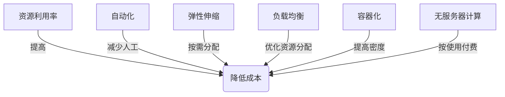

# 如何减少计算基础设施的成本

## 1. 背景介绍

### 1.1 问题的由来

在当今数字化时代，计算基础设施已经成为企业和组织的核心资产。无论是传统的数据中心、云计算平台还是边缘计算设施,它们都需要大量的资金投入和维护成本。随着业务规模的不断扩大和数据量的激增,计算资源的需求也在持续增长。因此,如何在确保系统性能和可用性的同时,降低计算基础设施的总体成本,已经成为许多企业和组织面临的一个重大挑战。

### 1.2 研究现状

降低计算基础设施成本一直是业界持续关注的热点话题。目前,已有多种技术和策略被广泛应用,例如虚拟化、云计算、自动化、负载均衡等。然而,随着新兴技术的不断涌现,如容器、无服务器计算、边缘计算等,降低成本的方法也在不断演进和创新。

### 1.3 研究意义

降低计算基础设施成本不仅可以为企业和组织节省大量资金支出,还可以提高资源利用效率,缩短上线时间,增强业务灵活性。通过优化基础设施,企业可以将更多资源投入到核心业务和创新领域,从而提高竞争力。因此,探索有效的成本优化策略对于企业的可持续发展至关重要。

### 1.4 本文结构

本文将全面探讨如何降低计算基础设施的成本。首先介绍相关的核心概念和技术,然后深入剖析核心算法原理和数学模型,并通过实际案例进行详细说明。接下来,将分享项目实践经验,包括代码实现和运行结果。最后,探讨实际应用场景、未来发展趋势和面临的挑战,并提供有价值的工具和资源推荐。

## 2. 核心概念与联系

降低计算基础设施成本涉及多个核心概念,包括资源利用率、自动化、弹性伸缩、负载均衡、容器化、无服务器计算等。这些概念相互关联,共同构建了一个高效、可扩展、经济的计算基础设施。

资源利用率是衡量基础设施效率的关键指标。通过提高CPU、内存、存储和网络等资源的利用率,可以减少闲置资源的浪费,从而降低成本。自动化则可以减少人工干预,提高效率,降低运维成本。弹性伸缩允许根据实际需求动态分配资源,避免过度配置或资源浪费。负载均衡可以优化资源分配,提高整体利用率。容器化技术可以实现更高的资源密度,降低硬件成本。无服务器计算则完全按使用量付费,极大降低了闲置资源的浪费。

通过有机结合这些核心概念,我们可以构建一个高效、经济的计算基础设施,从而实现降本增效的目标。

## 3. 核心算法原理 & 具体操作步骤

### 3.1 算法原理概述

为了有效降低计算基础设施的成本,我们需要采用一种综合性的算法,将上述核心概念有机结合,从而实现资源的优化利用。该算法的核心思想是通过建模和优化,动态调整资源分配,最大化资源利用率,同时满足业务需求和服务水平目标。

算法的主要步骤包括:

1. 构建资源需求模型
2. 实时监控资源利用情况
3. 基于优化目标,动态调整资源分配
4. 持续优化,形成闭环控制

该算法采用了机器学习和操作研究等技术,可以自动化地进行资源调度和优化,从而降低人工干预的需求,提高效率。

### 3.2 算法步骤详解

1. **构建资源需求模型**

   首先,我们需要建立一个准确的资源需求模型,描述业务对CPU、内存、存储、网络等资源的需求。这个模型需要考虑业务的实时流量、并发请求、数据处理量等因素,并且能够动态调整以适应业务变化。

   资源需求模型可以采用时间序列分析、回归模型等机器学习技术构建。我们还可以引入工作负载特征,如CPU密集型、内存密集型等,以更精确地描述资源需求。

2. **实时监控资源利用情况**

   接下来,我们需要实时监控基础设施中各个资源的利用情况,包括CPU利用率、内存使用量、磁盘I/O、网络流量等指标。这些数据将作为算法的输入,用于判断是否需要进行资源调整。

   我们可以利用各种监控工具和技术,如Prometheus、Grafana等,收集和可视化这些指标数据。

3. **基于优化目标,动态调整资源分配**

   根据资源需求模型和实时监控数据,算法将判断是否需要调整资源分配。优化目标可以是最大化资源利用率、最小化成本或两者的平衡等。

   算法将采用操作研究、约束优化等技术,在满足业务需求和服务水平目标的前提下,动态调整资源分配。例如,可以通过垂直扩展(增加或减少单个实例的资源)或水平扩展(增加或减少实例数量)来实现资源调整。

   在调整资源时,算法还需要考虑负载均衡、容器编排等因素,以确保服务的高可用性和稳定性。

4. **持续优化,形成闭环控制**

   算法将持续监控资源利用情况,并根据优化目标不断调整资源分配,形成一个闭环控制系统。这种动态优化过程可以确保资源始终处于最佳利用状态,从而降低成本。

   同时,算法还需要具备自我学习能力,根据历史数据和实际效果不断优化资源需求模型和调度策略,以适应业务变化和新的技术发展。

### 3.3 算法优缺点

该算法的主要优点包括:

- 自动化程度高,减少人工干预
- 动态优化,可适应业务变化
- 综合考虑多种因素,实现整体优化
- 提高资源利用率,降低成本

但同时也存在一些缺点和挑战:

- 需要大量的监控数据作为输入
- 算法复杂度较高,需要强大的计算能力
- 存在局部最优和全局最优之间的权衡
- 需要持续优化和人工调整

### 3.4 算法应用领域

该算法可以广泛应用于各种计算基础设施场景,包括:

- 传统数据中心
- 公有云和私有云环境
- 混合云和多云架构
- 边缘计算和物联网设施
- 大数据和人工智能基础设施

无论是面向企业还是面向个人用户,该算法都可以有效降低基础设施成本,提高资源利用效率。

## 4. 数学模型和公式 & 详细讲解 & 举例说明

### 4.1 数学模型构建

为了量化描述资源需求和成本,我们需要构建一个数学模型。假设我们有 $n$ 种不同的资源,如CPU、内存、存储等,用 $R = \{r_1, r_2, \ldots, r_n\}$ 表示。每种资源都有一定的成本,用 $C = \{c_1, c_2, \ldots, c_n\}$ 表示,其中 $c_i$ 是资源 $r_i$ 的单位成本。

我们的目标是在满足业务需求的前提下,最小化总成本。因此,我们需要引入业务需求约束。假设有 $m$ 个业务,每个业务对不同资源都有一定的需求,用 $D = \{d_{ij}\}$ 表示,其中 $d_{ij}$ 是第 $i$ 个业务对第 $j$ 种资源的需求量。

此外,我们还需要考虑服务水平目标,如响应时间、吞吐量等,用 $S = \{s_1, s_2, \ldots, s_k\}$ 表示,其中 $s_i$ 是第 $i$ 个服务水平指标。

综合以上因素,我们可以构建如下数学模型:

$$
\begin{aligned}
\min \quad & \sum_{j=1}^{n} c_j x_j \
\text{s.t.} \quad & \sum_{j=1}^{n} d_{ij} x_j \geq D_i, \quad i = 1, 2, \ldots, m \
& f(x_1, x_2, \ldots, x_n) \geq S \
& x_j \geq 0, \quad j = 1, 2, \ldots, n
\end{aligned}
$$

其中, $x_j$ 表示分配给第 $j$ 种资源的数量, $D_i$ 表示第 $i$ 个业务的总需求, $f$ 是一个描述服务水平目标的函数。

该模型的目标是最小化总成本,同时满足每个业务的资源需求约束和服务水平约束。通过求解这个优化问题,我们可以得到最优的资源分配方案。

### 4.2 公式推导过程

为了更好地理解上述数学模型,我们将通过一个具体示例来推导公式。

假设我们有两种资源:CPU和内存,分别用 $r_1$ 和 $r_2$ 表示。成本分别为 $c_1$ 和 $c_2$。我们有两个业务 $A$ 和 $B$,对CPU和内存的需求分别为 $(d_{A1}, d_{A2})$ 和 $(d_{B1}, d_{B2})$。服务水平目标是响应时间不超过 $T$。

我们的目标是最小化总成本,同时满足业务需求和服务水平目标。数学模型可以表示为:

$$
\begin{aligned}
\min \quad & c_1 x_1 + c_2 x_2 \
\text{s.t.} \quad & d_{A1} x_1 + d_{A2} x_2 \geq D_A \
& d_{B1} x_1 + d_{B2} x_2 \geq D_B \
& \frac{1}{x_1} + \frac{1}{x_2} \leq \frac{1}{T} \
& x_1 \geq 0, x_2 \geq 0
\end{aligned}
$$

其中, $x_1$ 和 $x_2$ 分别表示分配给CPU和内存的数量, $D_A$ 和 $D_B$ 分别表示业务 $A$ 和 $B$ 的总需求。第三个约束条件描述了响应时间不超过 $T$ 的要求,它是基于队列理论中的 $M/M/1$ 模型推导得出的。

通过求解这个优化问题,我们可以得到最优的 $x_1$ 和 $x_2$ 值,从而实现最小化总成本的目标。

### 4.3 案例分析与讲解

为了更好地理解上述数学模型和公式,我们将通过一个具体案例进行分析和讲解。

假设一家电子商务公司有两个核心业务:在线购物和订单处理。在线购物业务对CPU和内存的需求分别为 $2$ 和 $4$,订单处理业务对CPU和内存的需求分别为 $3$ 和 $2$。CPU的单位成本为 $10$ 元/小时,内存的单位成本为 $5$ 元/小时。服务水平目标是响应时间不超过 $0.5$ 秒。

根据上述数学模型,我们可以构建如下优化问题:

$$
\begin{aligned}
\min \quad & 10 x_1 + 5 x_2 \
\text{s.t.} \quad & 2 x_1 + 4 x_2 \geq 6 \
& 3 x_1 + 2 x_2 \geq 5 \
& \frac{1}{x_1} + \frac{1}{x_2} \leq 2 \
& x_1 \geq 0, x_2 \geq 0
\end{aligned}
$$

通过求解这个优化问题,我们可以得到最优解 $x_1 = 3, x_2 = 4$,即分配 $3$