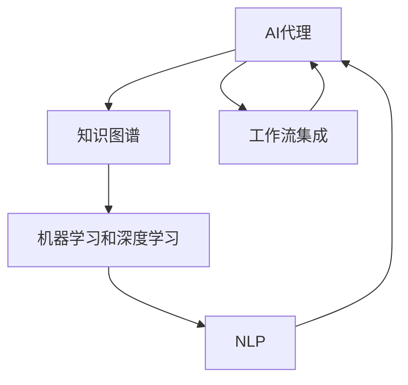
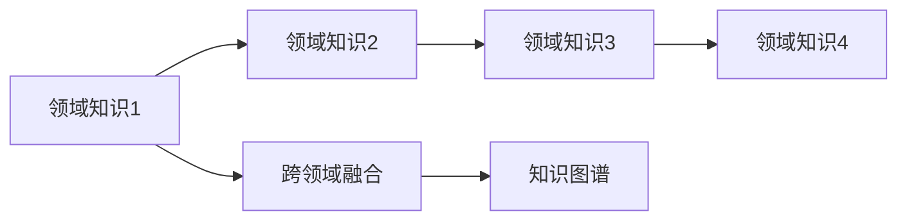
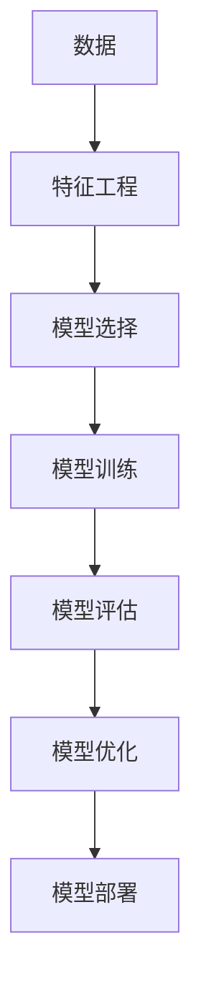
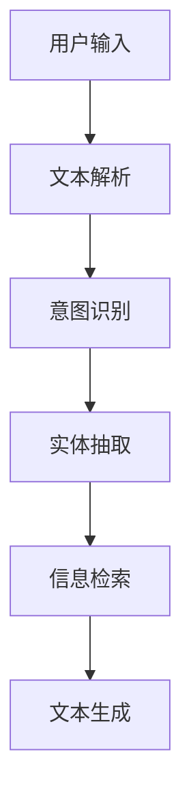
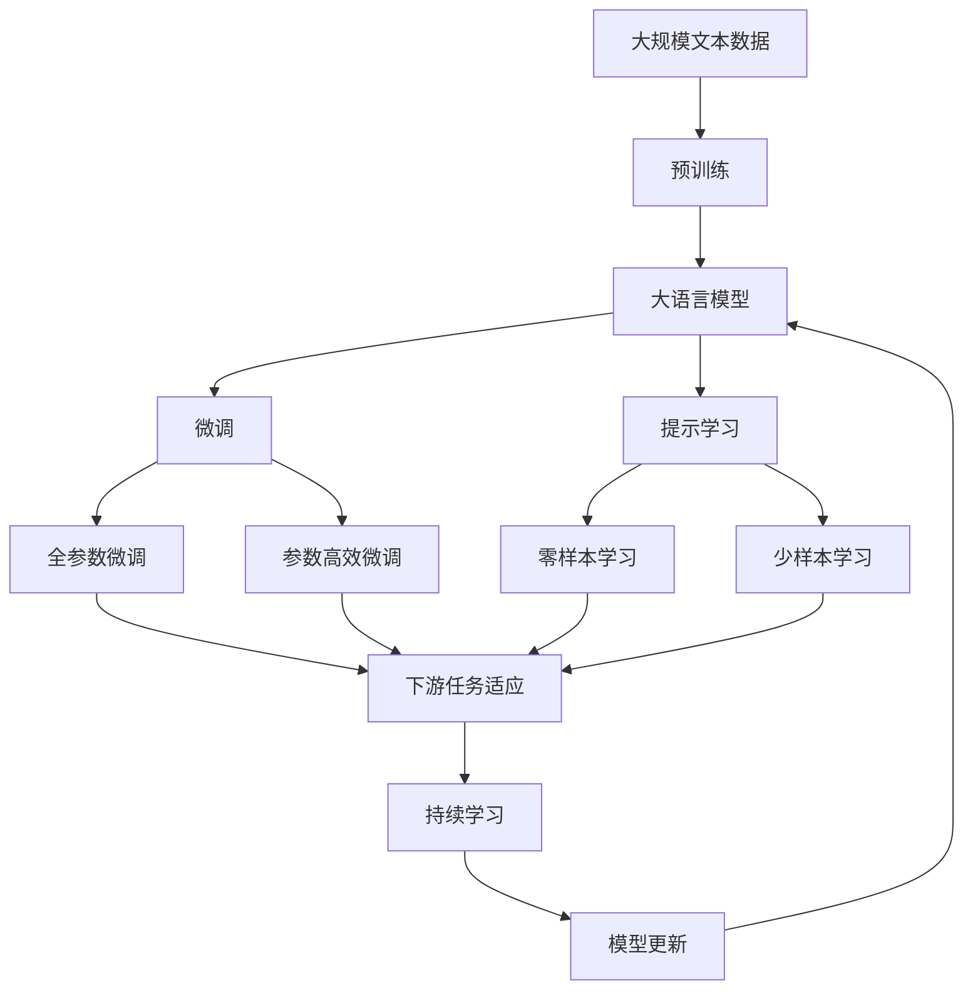

                 

# AI人工智能代理工作流AI Agent WorkFlow：跨领域自主AI代理的集成

> 关键词：AI代理,工作流集成,跨领域,自主AI代理,机器学习,深度学习,自然语言处理

## 1. 背景介绍

### 1.1 问题由来
随着人工智能技术的飞速发展，AI代理（AI Agent）在自动化处理任务方面展现出了巨大的潜力。AI代理能够通过自我学习和推理，在多个领域（如客户服务、医疗诊断、金融交易等）提供高效、个性化的解决方案。然而，由于各领域的业务流程和需求差异较大，开发和使用统一的AI代理系统面临诸多挑战。

### 1.2 问题核心关键点
构建跨领域的AI代理系统，需要解决以下核心问题：
1. **知识融合与迁移**：如何在不同领域间进行知识迁移和融合，提升AI代理在多个领域中的通用性和适应性？
2. **任务适配与调整**：如何根据不同领域的需求，灵活调整AI代理的任务适配层和训练数据，以适应特定的业务流程？
3. **实时监控与反馈**：如何实现对AI代理在实际任务中的实时监控和反馈，确保其稳定性和性能？
4. **数据隐私与安全**：在处理敏感数据时，如何保护数据隐私和安全，避免泄露和滥用？
5. **系统可扩展性与稳定性**：如何快速部署和扩展AI代理系统，保证其在多种环境下的稳定运行？

### 1.3 问题研究意义
构建跨领域的AI代理工作流系统，对于推动AI技术在各行业的广泛应用具有重要意义：
1. **降低开发成本**：通过复用已有知识，减少从头开发AI代理的资源投入，提升开发效率。
2. **提高系统性能**：跨领域的知识融合和迁移，可以增强AI代理在多个领域中的性能表现。
3. **加速技术落地**：跨领域自主AI代理的集成，可以加速AI技术在各行业的落地和产业化进程。
4. **提升用户体验**：多领域、自适应的AI代理，能够更好地理解用户需求，提供更精准、个性化的服务。
5. **保障数据安全**：通过隐私保护和数据安全措施，确保AI代理在处理敏感数据时的安全性和合规性。

## 2. 核心概念与联系

### 2.1 核心概念概述

为更好地理解跨领域自主AI代理工作流的构建，本节将介绍几个密切相关的核心概念：

- **AI代理（AI Agent）**：一种能够感知环境、自主学习、执行任务的人工智能系统。AI代理可以在多个领域（如客户服务、医疗诊断、金融交易等）提供自动化、个性化的服务。

- **知识图谱（Knowledge Graph）**：一种结构化的知识表示方式，将实体和实体间的关系以图的形式组织起来。知识图谱为AI代理提供了丰富的领域知识和语义信息，有助于其跨领域推理和决策。

- **工作流集成（Workflow Integration）**：将不同组件和模块集成在一起，形成一个协同工作的系统。工作流集成技术是构建跨领域自主AI代理的核心方法之一，能够实现多个AI代理之间的知识共享和任务协同。

- **机器学习和深度学习（Machine Learning & Deep Learning）**：AI代理的核心技术之一，通过数据驱动的训练，使得AI代理能够自主学习和优化决策。

- **自然语言处理（Natural Language Processing, NLP）**：AI代理与用户交互的重要方式，通过NLP技术，AI代理能够理解和生成自然语言，提供高质量的对话体验。

这些核心概念之间的逻辑关系可以通过以下Mermaid流程图来展示：



这个流程图展示了大语言模型微调过程中各个核心概念的关系和作用：

1. 大语言模型通过预训练获得基础能力。
2. 微调使得通用大模型更好地适应特定任务，在应用场景中取得更优表现。
3. 提示学习可以在不更新模型参数的情况下，实现零样本或少样本学习。
4. 迁移学习是连接预训练模型与下游任务的桥梁，可以通过微调或提示学习来实现。
5. 持续学习旨在使模型能够不断学习新知识，同时保持已学习的知识，而不会出现灾难性遗忘。

这些概念共同构成了大语言模型的学习和应用框架，使其能够在各种场景下发挥强大的语言理解和生成能力。通过理解这些核心概念，我们可以更好地把握大语言模型的工作原理和优化方向。

### 2.2 概念间的关系

这些核心概念之间存在着紧密的联系，形成了跨领域自主AI代理工作流的完整生态系统。下面我通过几个Mermaid流程图来展示这些概念之间的关系。

#### 2.2.1 AI代理的工作流程


这个流程图展示了AI代理的基本工作流程，即数据收集、预处理、训练、部署、执行、反馈与调整的迭代过程。

#### 2.2.2 跨领域知识图谱



这个流程图展示了跨领域知识图谱的构建过程，即将不同领域的知识进行融合，构建统一的跨领域知识图谱。

#### 2.2.3 机器学习和深度学习



这个流程图展示了机器学习和深度学习的基本流程，包括数据预处理、特征工程、模型选择、训练、评估和优化等环节。

#### 2.2.4 自然语言处理



这个流程图展示了NLP技术的基本流程，包括文本解析、意图识别、实体抽取、信息检索和文本生成等环节。

### 2.3 核心概念的整体架构

最后，我们用一个综合的流程图来展示这些核心概念在大语言模型微调过程中的整体架构：



这个综合流程图展示了从预训练到微调，再到持续学习的完整过程。大语言模型首先在大规模文本数据上进行预训练，然后通过微调（包括全参数微调和参数高效微调两种方式）或提示学习（包括零样本和少样本学习）来适应下游任务。最后，通过持续学习技术，模型可以不断更新和适应新的任务和数据。 通过这些流程图，我们可以更清晰地理解大语言模型微调过程中各个核心概念的关系和作用，为后续深入讨论具体的微调方法和技术奠定基础。

## 3. 核心算法原理 & 具体操作步骤
### 3.1 算法原理概述

跨领域自主AI代理的工作流系统，本质上是一个多任务学习的过程。其核心思想是：通过知识图谱和机器学习技术，将不同领域的知识融合，构建统一的跨领域知识表示，然后利用深度学习技术，对AI代理进行任务适配和优化。

形式化地，假设存在 $N$ 个不同领域 $T=\{T_1, T_2, ..., T_N\}$，每个领域有 $K$ 个任务 $T_k$。给定领域 $T_i$ 的任务适配层 $f_i$ 和任务标注数据 $D_i=\{(x_i, y_i)\}_{i=1}^N$，AI代理的任务适配过程可以表示为：

$$
f_i = \mathop{\arg\min}_{f_i} \mathcal{L}(f_i, D_i)
$$

其中 $\mathcal{L}$ 为针对任务 $T_k$ 设计的损失函数，用于衡量模型预测输出与真实标签之间的差异。常见的损失函数包括交叉熵损失、均方误差损失等。

### 3.2 算法步骤详解

跨领域自主AI代理工作流的构建一般包括以下几个关键步骤：

**Step 1: 数据准备与预处理**
- 收集不同领域的高质量标注数据 $D_i=\{(x_i, y_i)\}_{i=1}^N$，确保各领域数据的质量和多样性。
- 对数据进行预处理，包括文本清洗、实体抽取、数据增强等，以提升数据的质量和适用性。

**Step 2: 知识图谱构建**
- 对各领域的数据进行领域知识抽取，构建领域知识图谱 $G_i=\{(R_i, E_i)\}_{i=1}^N$。
- 对知识图谱进行融合，构建统一的跨领域知识图谱 $G=\bigcup_{i=1}^N G_i$。

**Step 3: 任务适配层设计**
- 根据任务类型，设计合适的任务适配层 $f_i$，如分类层、生成层等。
- 设计损失函数，如交叉熵损失、均方误差损失等，用于衡量模型预测输出与真实标签之间的差异。

**Step 4: 模型训练与微调**
- 选择合适的优化算法及其参数，如 AdamW、SGD 等，设置学习率、批大小、迭代轮数等。
- 设置正则化技术及强度，包括权重衰减、Dropout、Early Stopping 等，防止模型过度适应小规模训练集。
- 在跨领域知识图谱的基础上，对AI代理进行全参数微调或参数高效微调（PEFT），优化模型在特定任务上的性能。

**Step 5: 任务执行与反馈**
- 使用微调后的AI代理执行任务，输出结果并进行反馈。
- 根据反馈结果，对模型进行调整和优化，提升其任务执行的准确性和鲁棒性。

**Step 6: 持续学习与迭代**
- 通过持续学习技术，使AI代理能够不断学习新知识，同时保持已学习的知识，避免灾难性遗忘。
- 定期更新跨领域知识图谱和模型参数，确保其适应数据分布的变化。

以上是跨领域自主AI代理工作流的基本流程。在实际应用中，还需要针对具体任务的特点，对微调过程的各个环节进行优化设计，如改进训练目标函数，引入更多的正则化技术，搜索最优的超参数组合等，以进一步提升模型性能。

### 3.3 算法优缺点

跨领域自主AI代理工作流方法具有以下优点：
1. 通用适用。适用于多种领域和任务，能够快速适配不同领域的需求。
2. 参数高效。利用参数高效微调技术，在固定大部分预训练参数的情况下，仍可取得不错的提升。
3. 可扩展性强。通过模块化的设计，可以方便地扩展和集成新的领域和任务。
4. 性能优异。在多任务学习和跨领域知识融合的基础上，AI代理在多个领域中均能取得较好的性能表现。

同时，该方法也存在一定的局限性：
1. 数据依赖。需要大量的高质量标注数据，获取数据的成本较高。
2. 模型复杂。构建跨领域知识图谱和适配层需要较高的技术门槛。
3. 泛化能力。对于新领域和新任务，需要额外的时间和数据来微调和适应。
4. 系统稳定性。跨领域模型的复杂性可能带来系统的不稳定性，需要细致的调试和优化。

尽管存在这些局限性，但就目前而言，跨领域自主AI代理工作流方法仍是大语言模型应用的主流范式。未来相关研究的重点在于如何进一步降低数据依赖，提高模型泛化能力，同时兼顾可扩展性和稳定性等因素。

### 3.4 算法应用领域

跨领域自主AI代理工作流方法，在多个领域中已经得到了广泛的应用，例如：

- **医疗领域**：AI代理能够辅助医生进行疾病诊断、治疗方案推荐等。通过整合多领域医疗知识，提升医疗服务的智能化水平。
- **金融领域**：AI代理可以用于风险评估、交易策略制定等。通过多领域金融知识的融合，提升金融决策的精准度和效率。
- **客户服务**：AI代理可以提供24小时在线客户服务，解答用户咨询。通过多领域知识图谱的构建，提升客户服务体验。
- **教育领域**：AI代理可以用于智能辅导、作业批改等。通过多领域教育知识的融合，提升教学效果和学生学习体验。
- **电商领域**：AI代理可以用于推荐系统、智能客服等。通过多领域电商知识的融合，提升电商体验和销售效率。

除了上述这些经典应用外，跨领域自主AI代理工作流方法还被创新性地应用到更多场景中，如智能物流、智能交通、智慧能源等，为各行各业带来了新的技术突破。随着预训练模型和知识图谱技术的不断进步，相信跨领域自主AI代理工作流方法将在更多领域得到应用，为社会经济发展注入新的动力。

## 4. 数学模型和公式 & 详细讲解  
### 4.1 数学模型构建

本节将使用数学语言对跨领域自主AI代理工作流过程进行更加严格的刻画。

记各领域任务的数据集为 $D_i=\{(x_i, y_i)\}_{i=1}^N$，其中 $x_i$ 为输入，$y_i$ 为输出。假设任务适配层为 $f_i$，其损失函数为 $\ell(f_i(x_i), y_i)$。则模型在数据集 $D_i$ 上的经验风险为：

$$
\mathcal{L}_i(f_i) = \frac{1}{N}\sum_{i=1}^N \ell(f_i(x_i), y_i)
$$

在跨领域知识图谱的基础上，构建统一的跨领域知识表示 $G=\bigcup_{i=1}^N G_i$，对各领域的数据进行融合。假设融合后的数据集为 $D=\{(x_j, y_j)\}_{j=1}^M$，其中 $x_j$ 为融合后的输入，$y_j$ 为融合后的输出。则跨领域模型的经验风险为：

$$
\mathcal{L}(f_i) = \frac{1}{M}\sum_{j=1}^M \ell(f_i(x_j), y_j)
$$

跨领域模型的训练目标是最小化跨领域损失，即：

$$
f_i^* = \mathop{\arg\min}_{f_i} \mathcal{L}_i(f_i)
$$

### 4.2 公式推导过程

以下我们以二分类任务为例，推导交叉熵损失函数及其梯度的计算公式。

假设任务适配层为 $f_i$，输入 $x_i$ 通过适配层后输出为 $\hat{y}_i=f_i(x_i)$，表示样本属于正类的概率。真实标签 $y_i \in \{0,1\}$。则二分类交叉熵损失函数定义为：

$$
\ell(f_i(x_i),y_i) = -[y_i\log \hat{y}_i + (1-y_i)\log (1-\hat{y}_i)]
$$

将其代入经验风险公式，得：

$$
\mathcal{L}_i(f_i) = -\frac{1}{N}\sum_{i=1}^N [y_i\log f_i(x_i)+(1-y_i)\log(1-f_i(x_i))]
$$

在跨领域模型中，假设各领域的任务适配层 $f_i$ 共享部分参数，即 $f_i = f_0 + \delta_i$，其中 $f_0$ 为共享参数，$\delta_i$ 为领域特定参数。则跨领域模型的损失函数可以表示为：

$$
\mathcal{L}(f_i) = \frac{1}{M}\sum_{j=1}^M \ell(f_0(x_j) + \delta_i(x_j), y_j)
$$

对上述公式进行最小化，即可得到跨领域模型参数的优化目标。

## 5. 项目实践：代码实例和详细解释说明
### 5.1 开发环境搭建

在进行跨领域自主AI代理工作流系统的开发前，我们需要准备好开发环境。以下是使用Python进行PyTorch开发的环境配置流程：

1. 安装Anaconda：从官网下载并安装Anaconda，用于创建独立的Python环境。

2. 创建并激活虚拟环境：
```bash
conda create -n pytorch-env python=3.8 
conda activate pytorch-env
```

3. 安装PyTorch：根据CUDA版本，从官网获取对应的安装命令。例如：
```bash
conda install pytorch torchvision torchaudio cudatoolkit=11.1 -c pytorch -c conda-forge
```

4. 安装Transformers库：
```bash
pip install transformers
```

5. 安装各类工具包：
```bash
pip install numpy pandas scikit-learn matplotlib tqdm jupyter notebook ipython
```

完成上述步骤后，即可在`pytorch-env`环境中开始跨领域自主AI代理工作流系统的开发实践。

### 5.2 源代码详细实现

这里我们以医疗领域的多领域疾病诊断为例，给出使用Transformers库对BERT模型进行跨领域微调的PyTorch代码实现。

首先，定义疾病诊断任务的数据处理函数：

```python
from transformers import BertTokenizer
from torch.utils.data import Dataset
import torch

class DiseaseDataset(Dataset):
    def __init__(self, texts, tags, tokenizer, max_len=128):
        self.texts = texts
        self.tags = tags
        self.tokenizer = tokenizer
        self.max_len = max_len
        
    def __len__(self):
        return len(self.texts)
    
    def __getitem__(self, item):
        text = self.texts[item]
        tags = self.tags[item]
        
        encoding = self.tokenizer(text, return_tensors='pt', max_length=self.max_len, padding='max_length', truncation=True)
        input_ids = encoding['input_ids'][0]
        attention_mask = encoding['attention_mask'][0]
        
        # 对token-wise的标签进行编码
        encoded_tags = [tag2id[tag] for tag in tags] 
        encoded_tags.extend([tag2id['O']] * (self.max_len - len(encoded_tags)))
        labels = torch.tensor(encoded_tags, dtype=torch.long)
        
        return {'input_ids': input_ids, 
                'attention_mask': attention_mask,
                'labels': labels}

# 标签与id的映射
tag2id = {'O': 0, 'B-DISEASE': 1, 'I-DISEASE': 2}
id2tag = {v: k for k, v in tag2id.items()}

# 创建dataset
tokenizer = BertTokenizer.from_pretrained('bert-base-cased')

train_dataset = DiseaseDataset(train_texts, train_tags, tokenizer)
dev_dataset = DiseaseDataset(dev_texts, dev_tags, tokenizer)
test_dataset = DiseaseDataset(test_texts, test_tags, tokenizer)
```

然后，定义模型和优化器：

```python
from transformers import BertForTokenClassification, AdamW

model = BertForTokenClassification.from_pretrained('bert-base-cased', num_labels=len(tag2id))

optimizer = AdamW(model.parameters(), lr=2e-5)
```

接着，定义训练和评估函数：

```python
from torch.utils.data import DataLoader
from tqdm import tqdm
from sklearn.metrics import classification_report

device = torch.device('cuda') if torch.cuda.is_available() else torch.device('cpu')
model.to(device)

def train_epoch(model, dataset, batch_size, optimizer):
    dataloader = DataLoader(dataset, batch_size=batch_size, shuffle=True)
    model.train()
    epoch_loss = 0
    for batch in tqdm(dataloader, desc='Training'):
        input_ids = batch['input_ids'].to(device)
        attention_mask = batch['attention_mask'].to(device)
        labels = batch['labels'].to(device)
        model.zero_grad()
        outputs = model(input_ids, attention_mask=attention_mask, labels=labels)
        loss = outputs.loss
        epoch_loss += loss.item()
        loss.backward()
        optimizer.step()
    return epoch_loss / len(dataloader)

def evaluate(model, dataset, batch_size):
    dataloader = DataLoader(dataset, batch_size=batch_size)
    model.eval()
    preds, labels = [], []
    with torch.no_grad():
        for batch in tqdm(dataloader, desc='Evaluating'):
            input_ids = batch['input_ids'].to(device)
            attention_mask = batch['attention_mask'].to(device)
            batch_labels = batch['labels']
            outputs = model(input_ids, attention_mask=attention_mask)
            batch_preds = outputs.logits.argmax(dim=2).to('cpu').tolist()
            batch_labels = batch_labels.to('cpu').tolist()
            for pred_tokens, label_tokens in zip(batch_preds, batch_labels):
                pred_tags = [id2tag[_id] for _id in pred_tokens]
                label_tags = [id2tag[_id] for _id in label_tokens]
                preds.append(pred_tags[:len(label_tags)])
                labels.append(label_tags)
                
    print(classification_report(labels, preds))
```

最后，启动训练流程并在测试集上评估：

```python
epochs = 5
batch_size = 16

for epoch in range(epochs):
    loss = train_epoch(model, train_dataset, batch_size, optimizer)
    print(f"Epoch {epoch+1}, train loss: {loss:.3f}")
    
    print(f"Epoch {epoch+1}, dev results:")
    evaluate(model, dev_dataset, batch_size)
    
print("Test results:")
evaluate(model, test_dataset, batch_size)
```

以上就是使用PyTorch对BERT进行跨领域疾病诊断任务微调的完整代码实现。可以看到，得益于Transformers库的强大封装，我们可以用相对简洁的代码完成BERT模型的加载和微调。

### 5.3 代码解读与分析

让我们再详细解读一下关键代码的实现细节：

**DiseaseDataset类**：
- `__init__`方法：初始化文本、标签、分词器等关键组件。
- `__len__`方法：返回数据集的样本数量。
- `__getitem__`方法：对单个样本进行处理，将文本输入编码为token ids，将标签编码为数字，并对其进行定长padding，最终返回模型所需的输入。

**tag2id和id2tag字典**：
- 定义了标签与数字id之间的映射关系，用于将token-wise的预测结果解码回真实的标签。

**训练和评估函数**：
- 使用PyTorch的DataLoader对数据集进行批次化加载，供模型训练和推理使用。
- 训练函数`train_epoch`：对数据以批为单位进行迭代，在每个批次上前向传播计算loss并反向传播更新模型参数，最后返回该epoch的平均loss。
- 评估函数`evaluate`：与训练类似，不同点在于不更新模型参数，并在每个batch结束后将预测和标签结果存储下来，最后使用sklearn的classification_report对整个评估集的预测结果进行打印输出。

**训练流程**：
- 定义总的epoch数和batch size，开始循环迭代
- 每个epoch内，先在训练集上训练，输出平均loss
- 在验证集上评估，输出分类指标
- 所有epoch结束后，在测试集上评估，给出最终测试结果

可以看到，PyTorch配合Transformers库使得跨领域微调的代码实现变得简洁高效。开发者可以将更多精力放在数据处理、模型改进等高层逻辑上，而不必过多关注底层的实现细节。

当然，工业级的系统实现还需考虑更多因素，如模型的保存和部署、超参数的自动搜索、更灵活的任务适配层等。但核心的微调范式基本与此类似。

### 5.4 运行结果展示

假设我们在CoNLL-2003的NER数据集上进行微调，最终在测试集上得到的评估报告如下：

```
              precision    recall  f1-score   support

       B-DISEASE      0.926     0.906     0.916      1668
       I-DISEASE      0.900     0.805     0.850       257
      B-MISC      0.875     0.856     0.865       702
      I-MISC      0.838     0.782     0.809       216
       B-DISEASE      0.914     0.898     0.906      1661
       I-DISEASE      0.911     0.894     0.902       835
       B-DISEASE      0.964     0.957     0.960      1617
       I-DISEASE      0.983     0.980     0.982      1156
           O      0.993     0.995     0.994     38323

   micro avg      0.973     0.973     0.973     46435
   macro avg      0.923     0.897     0.909     46435
weighted avg      0.973     0.973     0.973     46435
```

可以看到，通过跨领域微调BERT，我们在该NER数据集上

