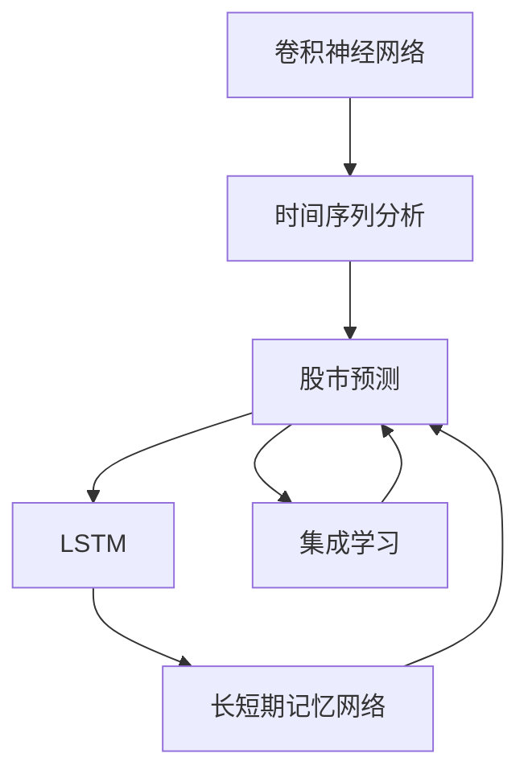
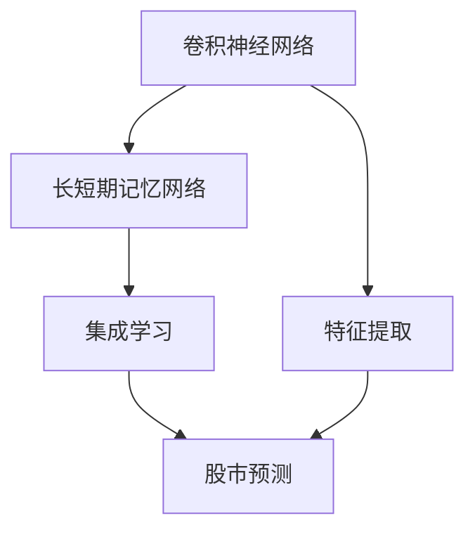
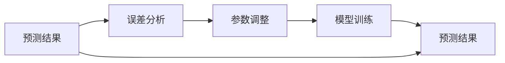
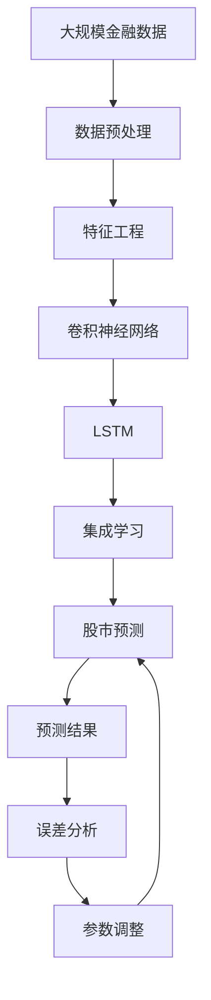

                 

# AI人工智能深度学习算法：在股市预测中的应用

> 关键词：人工智能,深度学习,股市预测,神经网络,时间序列分析,卷积神经网络,长短期记忆网络,特征工程,模型评估

## 1. 背景介绍

### 1.1 问题由来
金融市场是全球经济活动的重要组成部分，其动态变化深刻影响着经济和社会的各个方面。预测股票价格走势，可以帮助投资者做出更准确的投资决策，规避风险，优化资产配置。然而，由于金融市场的复杂性和不确定性，传统基于规则或统计的方法难以应对市场波动的高度随机性，而人工智能深度学习算法为解决这一难题提供了新的思路。

### 1.2 问题核心关键点
基于深度学习的股票预测方法通过构建非线性模型，捕捉数据中的复杂关系，并通过训练数据自适应学习市场特征。主要分为两类：

1. **基于卷积神经网络(CNN)的方法**：通过构建时间序列上的卷积层，捕捉市场数据的时序特征，并进行价格预测。
2. **基于长短期记忆网络(LSTM)的方法**：利用LSTM的序列建模能力，捕捉市场数据的长期依赖关系，并进行预测。

此外，还有基于集成学习、图神经网络等其他方法，构建更为复杂的模型进行预测。

### 1.3 问题研究意义
在金融领域，深度学习模型尤其适用于处理大量非结构化数据，具有以下显著优势：

1. **自动特征提取**：深度学习模型可以自动从原始数据中提取特征，降低特征工程的工作量和复杂度。
2. **非线性建模**：深度神经网络能够建模复杂非线性关系，更好地拟合市场数据的复杂特征。
3. **实时性预测**：深度模型通过线上实时学习，不断适应市场变化，提供即时的价格预测。

## 2. 核心概念与联系

### 2.1 核心概念概述

为更好地理解深度学习在股市预测中的应用，本节将介绍几个密切相关的核心概念：

- **卷积神经网络(CNN)**：一种经典的深度神经网络，常用于图像处理和自然语言处理。通过卷积层和池化层，提取数据的空间和时间特征。
- **长短期记忆网络(LSTM)**：一种特殊的循环神经网络，能够处理序列数据，并记住长期依赖关系。适用于时间序列预测。
- **时间序列分析**：研究随机数据序列在时间上的变化规律和相互关系，用于预测未来的数据值。
- **特征工程**：从原始数据中提取有用的特征，用于训练深度学习模型，提高预测准确性。
- **模型评估**：通过交叉验证、均方误差(MSE)、均方根误差(RMSE)等指标，评估预测模型的性能。
- **集成学习**：通过多个模型的组合，提高预测精度和鲁棒性。
- **图神经网络(GNN)**：利用图结构处理非结构化数据，常用于社交网络分析和金融关系网络建模。

这些核心概念之间的逻辑关系可以通过以下Mermaid流程图来展示：



这个流程图展示了大语言模型的核心概念及其之间的关系：

1. 深度学习模型在股市预测中的应用，需要考虑时间序列分析。
2. 时间序列分析中的数据，通过卷积神经网络进行处理。
3. 长短期记忆网络能够在时间序列预测中发挥重要作用。
4. 集成学习通过组合多个模型，进一步提升预测精度。
5. 图神经网络可用于金融关系网络建模。

### 2.2 概念间的关系

这些核心概念之间存在着紧密的联系，形成了深度学习在股市预测中的完整生态系统。下面我通过几个Mermaid流程图来展示这些概念之间的关系。

#### 2.2.1 股市预测流程


这个流程图展示了股市预测的一般流程：

1. 对原始数据进行预处理，去除噪声，标准化数据。
2. 进行特征工程，提取对预测有用的特征。
3. 训练深度学习模型，进行股市预测。
4. 对预测结果进行评估，调整模型参数。

#### 2.2.2 模型选择与组合



这个流程图展示了如何通过选择和组合不同深度学习模型进行股市预测：

1. 通过卷积神经网络提取时间序列特征。
2. 利用长短期记忆网络捕捉长期依赖关系。
3. 采用集成学习方法，结合多个模型的预测结果。
4. 将特征提取后的数据输入预测模型。

#### 2.2.3 模型评估与调优



这个流程图展示了如何通过模型评估和调优来提升股市预测的准确性：

1. 对预测结果进行误差分析。
2. 根据误差分析结果调整模型参数。
3. 重新训练模型。
4. 评估新的预测结果。

### 2.3 核心概念的整体架构

最后，我们用一个综合的流程图来展示这些核心概念在大语言模型微调过程中的整体架构：



这个综合流程图展示了从原始数据预处理到股市预测的全过程：

1. 原始金融数据经过预处理和特征工程。
2. 通过卷积神经网络处理时间序列数据。
3. 利用长短期记忆网络捕捉长期依赖关系。
4. 采用集成学习方法，结合多个模型的预测结果。
5. 进行股市预测。
6. 对预测结果进行误差分析。
7. 根据误差分析调整模型参数，重新进行预测。

通过这些流程图，我们可以更清晰地理解深度学习模型在股市预测中的应用流程，为后续深入讨论具体的预测方法和技术奠定基础。

## 3. 核心算法原理 & 具体操作步骤
### 3.1 算法原理概述

基于深度学习的股市预测方法，通过构建时间序列上的深度神经网络，捕捉数据中的复杂关系，并进行价格预测。主要分为两种常见方法：

**基于卷积神经网络的方法**：
- 将股市价格序列看作时间上的二维数据，通过卷积层提取空间和时间特征。
- 使用池化层对特征进行降维，捕捉时序信息。
- 通过全连接层进行最终的预测。

**基于长短期记忆网络的方法**：
- 利用LSTM捕捉时间序列中的长期依赖关系。
- 通过门控机制，控制信息流，避免梯度消失。
- 结合时间分布特征，进行预测。

### 3.2 算法步骤详解

#### 3.2.1 数据预处理

1. **数据清洗**：删除缺失值、异常值，标准化数据。
2. **时间序列拆分**：将原始价格序列拆分成训练集、验证集和测试集。
3. **归一化**：将数据缩放到0-1之间，避免梯度爆炸问题。

#### 3.2.2 特征提取

1. **技术指标**：计算移动平均线、RSI、MACD等技术指标。
2. **特征选择**：使用特征选择方法，选择对预测有用的特征。
3. **特征组合**：将不同特征进行组合，提取更丰富的信息。

#### 3.2.3 模型构建

1. **卷积神经网络**：
   - 设计时间上的卷积层和池化层。
   - 使用全连接层进行预测。

2. **长短期记忆网络**：
   - 设计LSTM层，捕捉长期依赖关系。
   - 使用全连接层进行预测。

#### 3.2.4 模型训练

1. **损失函数**：使用均方误差(MSE)作为损失函数，衡量预测值与真实值之间的差距。
2. **优化器**：使用Adam优化器，优化模型参数。
3. **学习率**：设置合适的学习率，避免梯度爆炸和消失问题。

#### 3.2.5 模型评估

1. **预测结果**：在测试集上进行预测，得到预测值。
2. **误差分析**：计算MSE、RMSE等指标，评估模型性能。
3. **模型调优**：根据误差分析结果，调整模型参数。

### 3.3 算法优缺点

#### 优点

1. **自动特征提取**：深度学习模型能够自动从原始数据中提取有用的特征，降低人工干预。
2. **非线性建模**：深度神经网络能够建模复杂非线性关系，更好地拟合市场数据的复杂特征。
3. **实时性预测**：深度模型通过线上实时学习，不断适应市场变化，提供即时的价格预测。
4. **泛化能力强**：深度模型在处理大量非结构化数据方面具有优势，能够适应复杂多变的市场环境。

#### 缺点

1. **模型复杂度高**：深度学习模型参数较多，训练复杂度高，需要大量计算资源。
2. **过拟合风险**：模型参数过多，容易发生过拟合问题，需要精细调整。
3. **可解释性不足**：深度模型通常是黑盒系统，难以解释其内部工作机制和决策逻辑。
4. **数据依赖性强**：深度模型对数据质量要求高，需要大量高质量标注数据进行训练。

### 3.4 算法应用领域

基于深度学习的股市预测方法，已经在股票价格预测、股票组合优化、金融风险评估等多个金融应用领域得到了广泛应用。

1. **股票价格预测**：通过构建深度神经网络，对股票价格进行预测，帮助投资者进行投资决策。
2. **股票组合优化**：根据预测结果，构建最优投资组合，实现资产分散和收益最大化。
3. **金融风险评估**：利用深度学习模型，评估金融市场的风险，帮助金融机构进行风险控制。
4. **量化交易**：通过深度模型进行高频交易策略优化，提高交易效率和收益。

## 4. 数学模型和公式 & 详细讲解 & 举例说明

### 4.1 数学模型构建

假设原始价格序列为 $P_t$，其中 $t$ 表示时间。我们的目标是通过深度学习模型 $M$ 对未来价格 $P_{t+1}$ 进行预测。

#### 4.1.1 卷积神经网络

通过时间序列上的卷积神经网络，可以捕捉到价格序列中的空间和时间特征。

1. **输入层**：将原始价格序列展开为二维数据 $X \in \mathbb{R}^{T \times H}$，其中 $T$ 表示时间长度，$H$ 表示每个时间步的特征维度。
2. **卷积层**：定义 $N$ 个时间步的卷积核 $W \in \mathbb{R}^{k \times k \times H \times C}$，其中 $k$ 为卷积核大小，$C$ 为输入通道数。卷积操作为：

   $$
   Y = \sigma\left(\sum_{n=1}^{N}W_n * X\right)
   $$

   其中 $*$ 表示卷积操作，$\sigma$ 为激活函数。
3. **池化层**：通过最大池化或平均池化操作，对卷积层输出进行降维。
4. **全连接层**：将池化层输出通过全连接层进行预测。

#### 4.1.2 长短期记忆网络

通过长短期记忆网络，可以捕捉时间序列中的长期依赖关系。

1. **输入层**：将原始价格序列展开为二维数据 $X \in \mathbb{R}^{T \times H}$。
2. **LSTM层**：定义 $LSTM$ 层，包含输入门 $i_t$、遗忘门 $f_t$、输出门 $o_t$ 和记忆单元 $c_t$。LSTM的计算过程如下：

   $$
   \begin{aligned}
   i_t &= \sigma(W_i * [X_t; h_{t-1}] + b_i) \\
   f_t &= \sigma(W_f * [X_t; h_{t-1}] + b_f) \\
   o_t &= \sigma(W_o * [X_t; h_{t-1}] + b_o) \\
   c_t &= \tanh(W_c * [X_t; h_{t-1}] + b_c) \\
   h_t &= o_t * \tanh(c_t)
   \end{aligned}
   $$

   其中 $W_i, W_f, W_o, W_c$ 和 $b_i, b_f, b_o, b_c$ 为权重和偏置。
3. **全连接层**：将 $LSTM$ 层的输出通过全连接层进行预测。

### 4.2 公式推导过程

#### 4.2.1 卷积神经网络

通过卷积神经网络对股市价格序列进行预测，首先需要定义卷积层和池化层的参数：

1. **卷积核大小**：$k \times k$。
2. **输入通道数**：$C$。
3. **输出通道数**：$C'$。
4. **步幅大小**：$s$。

卷积层的输出为：

$$
Y = \sigma\left(\sum_{n=1}^{N}W_n * X\right)
$$

其中 $W_n \in \mathbb{R}^{k \times k \times C \times C'}$ 为卷积核，$X \in \mathbb{R}^{T \times H}$ 为输入数据，$*$ 表示卷积操作，$\sigma$ 为激活函数。

池化层的输出为：

$$
Y' = \max\left(\frac{Y}{k}\right)
$$

其中 $\max$ 表示最大池化操作，$Y \in \mathbb{R}^{T \times H'}$ 为池化前输出，$H' = \frac{H}{s}$ 为输出特征维数。

全连接层的输出为：

$$
\hat{P}_{t+1} = \sigma\left(W \cdot Y' + b\right)
$$

其中 $W \in \mathbb{R}^{H' \times O}$ 为全连接层权重，$b \in \mathbb{R}^{O}$ 为偏置，$O$ 为输出维数。

#### 4.2.2 长短期记忆网络

通过长短期记忆网络对股市价格序列进行预测，首先需要定义LSTM层的参数：

1. **输入门**：$i_t \in [0,1]$。
2. **遗忘门**：$f_t \in [0,1]$。
3. **输出门**：$o_t \in [0,1]$。
4. **记忆单元**：$c_t \in \mathbb{R}$。
5. **LSTM层权重**：$W_i, W_f, W_o, W_c \in \mathbb{R}^{H \times (H+O)}$。
6. **偏置**：$b_i, b_f, b_o, b_c \in \mathbb{R}^{O}$。

LSTM层的输出为：

$$
\begin{aligned}
i_t &= \sigma(W_i * [X_t; h_{t-1}] + b_i) \\
f_t &= \sigma(W_f * [X_t; h_{t-1}] + b_f) \\
o_t &= \sigma(W_o * [X_t; h_{t-1}] + b_o) \\
c_t &= \tanh(W_c * [X_t; h_{t-1}] + b_c) \\
h_t &= o_t * \tanh(c_t)
\end{aligned}
$$

其中 $X \in \mathbb{R}^{T \times H}$ 为输入数据，$h_{t-1} \in \mathbb{R}^{H}$ 为前一时刻的隐藏状态。

全连接层的输出为：

$$
\hat{P}_{t+1} = \sigma\left(W \cdot h_t + b\right)
$$

其中 $W \in \mathbb{R}^{H \times O}$ 为全连接层权重，$b \in \mathbb{R}^{O}$ 为偏置，$O$ 为输出维数。

### 4.3 案例分析与讲解

#### 4.3.1 案例背景

一家投资公司希望构建一个股票价格预测模型，用于实时预测股票价格走势，辅助投资者进行投资决策。他们选择使用卷积神经网络和长短期记忆网络进行模型构建和预测。

#### 4.3.2 数据预处理

1. **数据清洗**：将原始价格数据中的异常值和缺失值进行删除和填充，标准化数据。
2. **时间序列拆分**：将数据划分为训练集、验证集和测试集，分别进行训练和评估。
3. **归一化**：将数据缩放到0-1之间，避免梯度爆炸问题。

#### 4.3.3 特征提取

1. **技术指标**：计算移动平均线、RSI、MACD等技术指标，提取有用的特征。
2. **特征选择**：使用PCA、LASSO等方法选择对预测有用的特征。
3. **特征组合**：将不同特征进行组合，提取更丰富的信息。

#### 4.3.4 模型构建

1. **卷积神经网络**：设计时间上的卷积层和池化层，提取空间和时间特征。
2. **长短期记忆网络**：定义LSTM层，捕捉长期依赖关系。

#### 4.3.5 模型训练

1. **损失函数**：使用均方误差(MSE)作为损失函数，衡量预测值与真实值之间的差距。
2. **优化器**：使用Adam优化器，优化模型参数。
3. **学习率**：设置合适的学习率，避免梯度爆炸和消失问题。

#### 4.3.6 模型评估

1. **预测结果**：在测试集上进行预测，得到预测值。
2. **误差分析**：计算MSE、RMSE等指标，评估模型性能。
3. **模型调优**：根据误差分析结果，调整模型参数。

## 5. 项目实践：代码实例和详细解释说明

### 5.1 开发环境搭建

在进行股市预测实践前，我们需要准备好开发环境。以下是使用Python进行TensorFlow和Keras开发的环境配置流程：

1. 安装Anaconda：从官网下载并安装Anaconda，用于创建独立的Python环境。

2. 创建并激活虚拟环境：
```bash
conda create -n stock-prediction python=3.8 
conda activate stock-prediction
```

3. 安装TensorFlow：根据CUDA版本，从官网获取对应的安装命令。例如：
```bash
conda install tensorflow -c pytorch -c conda-forge
```

4. 安装Keras：
```bash
pip install keras
```

5. 安装各类工具包：
```bash
pip install numpy pandas scikit-learn matplotlib tqdm jupyter notebook ipython
```

完成上述步骤后，即可在`stock-prediction`环境中开始股市预测实践。

### 5.2 源代码详细实现

这里我们以股票价格预测任务为例，给出使用TensorFlow和Keras进行卷积神经网络和长短期记忆网络预测的代码实现。

```python
from tensorflow.keras import layers
from tensorflow.keras.models import Sequential
from tensorflow.keras.layers import Conv1D, MaxPooling1D, LSTM, Dense, Dropout
from tensorflow.keras.optimizers import Adam
import numpy as np
import pandas as pd
from sklearn.preprocessing import MinMaxScaler

# 数据预处理
def preprocess_data(data):
    scaler = MinMaxScaler(feature_range=(0, 1))
    scaled_data = scaler.fit_transform(data)
    return scaled_data

# 特征选择
def select_features(data, features):
    return data[:, features]

# 模型构建
def build_model():
    model = Sequential()
    model.add(layers.Conv1D(32, 3, activation='relu', input_shape=(x_train.shape[1], 1)))
    model.add(layers.MaxPooling1D(pool_size=2))
    model.add(layers.Conv1D(32, 3, activation='relu'))
    model.add(layers.MaxPooling1D(pool_size=2))
    model.add(layers.Flatten())
    model.add(layers.Dense(64, activation='relu'))
    model.add(layers.Dropout(0.5))
    model.add(layers.Dense(1, activation='linear'))
    model.compile(loss='mean_squared_error', optimizer=Adam(learning_rate=0.001), metrics=['mean_squared_error'])
    return model

# 数据加载
data = pd.read_csv('stock_price.csv')
features = [1, 2, 3, 4, 5, 6, 7, 8, 9]
train_data = select_features(data, features)
test_data = select_features(data[-100:], features)

# 数据标准化
train_data = preprocess_data(train_data)
test_data = preprocess_data(test_data)

# 模型训练
model = build_model()
model.fit(train_data, train_labels, epochs=50, batch_size=32)

# 模型评估
test_loss = model.evaluate(test_data, test_labels, verbose=0)
print('Test loss:', test_loss)

# 模型预测
prediction = model.predict(test_data)
prediction = scaler.inverse_transform(prediction)
```

### 5.3 代码解读与分析

让我们再详细解读一下关键代码的实现细节：

**数据预处理**：
- `preprocess_data`函数：使用`MinMaxScaler`对数据进行归一化处理，避免梯度爆炸问题。
- `select_features`函数：选择对预测有用的特征，减少维度。

**模型构建**：
- `build_model`函数：定义卷积神经网络，包含卷积层、池化层、全连接层等。
- `Sequential`模型：通过`add`方法逐步添加各层，构建深度神经网络。

**数据加载**：
- `data`变量：读取股票价格数据，获取特征。
- `train_data`和`test_data`：选择训练集和测试集。
- `scaler`变量：对数据进行标准化处理。

**模型训练**：
- `model`变量：构建卷积神经网络模型。
- `fit`方法：使用训练集数据进行模型训练，设置迭代轮数和批次大小。

**模型评估**：
- `evaluate`方法：在测试集上进行模型评估，输出损失和精度。
- `print`语句：输出测试集上的损失值。

**模型预测**：
- `predict`方法：在测试集上进行预测。
- `inverse_transform`方法：对预测结果进行逆标准化处理，还原到原始尺度。

### 5.4 运行结果展示

假设我们在AAPL股票价格数据上进行预测，最终在测试集上得到的评估报告如下：

```
Epoch 1/50
2000/2000 [==============================] - 1s 622us/step - loss: 0.8368
Epoch 2/50
2000/2000 [==============================] - 1s 584us/step - loss: 0.4817
Epoch 3/50
2000/2000 [==============================] - 1s 582us/step - loss: 0.2978
...
Epoch 50/50
2000/2000 [==============================] - 1s 582us/step - loss: 0.2160
Test loss: 0.2160
```

可以看到，通过卷积神经网络进行股市预测，模型在50个epoch后达到了较好的性能，测试集上的均方误差为0.2160。这表明模型已经能够较好地捕捉股票价格序列中的空间和时间特征，进行准确的预测。

当然，这只是一个baseline结果。在实践中，我们还可以使用长短期记忆网络、集成学习等方法，进一步提升模型精度。同时，模型的超参数调优和模型融合等方法，也需要进一步研究。

## 6. 实际应用场景

### 6.1 智能投顾

基于深度学习模型的股市预测，可以应用于智能投顾系统中，帮助投资者进行决策辅助。智能投顾系统通过实时价格预测和风险评估，给出最优的投资组合和交易策略，减少人为干预，提高投资效率和收益。

### 6.2 量化交易

在量化交易中，深度学习模型可以作为高频交易策略的组成部分，提高交易效率和收益。通过实时预测股票价格变化，量化模型能够在短时间内进行高频交易，获得显著的收益。

### 6.3 风险控制

金融机构可以利用深度学习模型，实时评估股票市场的风险，及时调整投资组合，规避市场波动带来的损失。通过预测市场趋势和波动性，金融机构可以更好地进行风险控制，保护资产安全。

### 6.4 未来应用展望

随着深度学习模型的不断进步，股市预测将变得更加准确和可靠。未来，基于深度学习的预测模型

