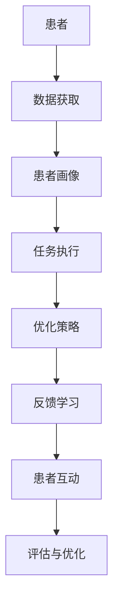

                 

# AI代理在健康医疗中的工作流程与患者管理

在现代医疗体系中，AI代理（Agent）正逐渐成为提升医疗服务质量与效率的关键力量。本文将系统介绍AI代理在健康医疗中的工作流程，详细解析其实现机制，并探讨其在患者管理中的潜力与挑战。通过深入分析，我们将展现AI代理如何助力医疗行业的智能化转型，为未来医疗健康领域的创新发展提供新的视角。

## 1. 背景介绍

### 1.1 健康医疗领域的挑战

随着全球人口老龄化的加剧，健康医疗资源供需矛盾日益突出。有限的医疗资源难以满足日益增长的医疗需求，提升医疗服务的效率与质量迫在眉睫。传统的医疗模式依赖人工处理大量重复、复杂的任务，耗时且易出错，而AI代理的出现，为医疗服务提供了高效、精准的解决方案。

### 1.2 AI代理的引入

AI代理作为一种智能技术，能够自主执行医疗领域的任务，如预约挂号、病历管理、药物咨询等，极大地提升了医疗服务的效率与患者满意度。通过整合多模态数据，AI代理可以实现全面的患者管理，为医疗服务提供更全面的支持。

## 2. 核心概念与联系

### 2.1 核心概念概述

- **AI代理（Agent）**：基于人工智能技术的智能软件系统，能够自主执行特定任务，无需人工干预。
- **健康医疗数据**：包括电子病历、影像数据、生理监测数据等，是AI代理决策的重要依据。
- **患者管理**：涉及预约挂号、病历管理、用药咨询、健康监测等多方面的患者需求管理。
- **自然语言处理（NLP）**：使AI代理能够理解和生成自然语言，实现与患者和医疗人员的有效沟通。
- **强化学习**：通过与环境的交互，AI代理能够不断优化决策策略，提升服务质量。

### 2.2 核心概念的联系

AI代理在健康医疗中的应用，通过以下逻辑链条实现从数据获取到患者管理的全流程自动化：

1. **数据获取与处理**：通过NLP技术，AI代理可以从电子病历、医学文献、患者问卷中提取关键信息，构建全面的患者画像。
2. **任务执行与优化**：AI代理根据预设的规则与目标，执行预约挂号、病历管理等任务，并通过强化学习不断优化决策策略。
3. **反馈与学习**：通过患者反馈与医疗人员评估，AI代理能够调整自身的决策策略，提升服务质量。
4. **患者互动与沟通**：通过NLP技术，AI代理能够以自然语言与患者互动，提供个性化的医疗建议。

这一系列流程形成了AI代理在健康医疗中的完整工作框架，如图1所示：



## 3. 核心算法原理 & 具体操作步骤

### 3.1 算法原理概述

AI代理在健康医疗中的应用，主要基于以下算法原理：

- **自然语言处理（NLP）**：使AI代理能够理解和生成自然语言，实现与患者和医疗人员的有效沟通。
- **强化学习**：通过与环境的交互，AI代理能够不断优化决策策略，提升服务质量。
- **推荐系统**：通过分析患者的历史数据，AI代理能够推荐个性化的医疗方案与药物。

### 3.2 算法步骤详解

**步骤1：数据收集与预处理**

1. **患者数据收集**：通过医疗信息系统（HIS）、电子病历系统（EMR）、生理监测设备等，收集患者的历史数据与实时数据。
2. **数据清洗与标准化**：去除重复数据，填补缺失值，对数据进行标准化处理。
3. **数据标注与分类**：对收集的数据进行标注与分类，构建结构化数据集。

**步骤2：患者画像构建**

1. **数据融合**：将结构化数据与非结构化数据（如病历文本、医学影像）融合，构建全面的患者画像。
2. **特征提取**：利用NLP技术，从病历文本中提取关键特征，如症状、病史、药物过敏等。
3. **画像更新**：实时更新患者画像，反映最新的医疗状态与治疗效果。

**步骤3：任务执行与优化**

1. **任务规划**：根据患者的医疗需求，规划AI代理执行的任务，如预约挂号、病历管理、用药咨询等。
2. **任务执行**：AI代理根据任务规则，自动执行任务，如自动生成挂号预约信息、自动更新病历记录等。
3. **反馈与学习**：通过患者的反馈与医疗人员的评估，AI代理不断调整自身的决策策略，提升服务质量。

**步骤4：患者互动与沟通**

1. **自然语言处理**：通过NLP技术，AI代理能够理解患者的自然语言输入，提供个性化的医疗建议。
2. **多轮对话**：AI代理能够与患者进行多轮对话，获取更多的医疗信息，优化医疗方案。
3. **情绪分析**：通过情感分析技术，AI代理能够识别患者的情绪状态，调整沟通策略。

### 3.3 算法优缺点

**优点：**

1. **高效性**：AI代理能够自动处理大量的重复性任务，节省人力资源。
2. **个性化服务**：通过患者画像与个性化推荐，AI代理能够提供定制化的医疗服务。
3. **实时性**：AI代理能够实时响应患者需求，提升医疗服务的及时性。

**缺点：**

1. **隐私与安全问题**：医疗数据涉及患者隐私，数据泄露风险高。
2. **模型的可解释性**：AI代理的决策过程复杂，难以解释，存在“黑箱”问题。
3. **数据质量依赖**：AI代理的性能高度依赖数据质量，数据偏差可能影响决策结果。

### 3.4 算法应用领域

AI代理在健康医疗中的应用领域广泛，包括但不限于以下几个方面：

1. **预约挂号**：通过智能客服系统，自动为患者安排预约挂号。
2. **病历管理**：自动整理与更新患者的电子病历，提升病历管理效率。
3. **用药咨询**：通过推荐系统，为患者推荐合适的药物与剂量，提升用药安全与疗效。
4. **健康监测**：实时监测患者的生理指标，提供健康管理建议。
5. **心理支持**：通过情感分析与自然语言处理，为患者提供心理健康支持。

## 4. 数学模型和公式 & 详细讲解 & 举例说明

### 4.1 数学模型构建

**患者画像模型**：

设患者画像为 $P$，其特征向量表示为 $\vec{x}$。包括患者的年龄、性别、病史、症状、药物过敏等信息。患者画像模型的构建可以使用基于统计的学习方法，如K近邻算法（KNN）、决策树等。

**任务执行模型**：

设任务执行模型的输入为 $I$，输出为 $O$，其中 $I$ 包括患者的医疗需求、医生的建议等，$O$ 为执行结果，如预约信息、病历记录等。任务执行模型可以使用强化学习算法，如Q-learning、策略梯度等。

**患者互动模型**：

设患者互动模型的输入为 $C$，输出为 $R$，其中 $C$ 为患者的自然语言输入，$R$ 为AI代理的响应。患者互动模型可以使用NLP技术，如BERT、GPT等。

### 4.2 公式推导过程

**患者画像模型的推导**：

假设患者画像 $P$ 包括 $n$ 个特征，每个特征 $x_i$ 的概率分布为 $p(x_i)$。通过统计方法，可以得到患者画像的概率分布 $p(P)$。例如，可以使用KNN算法计算患者画像 $P$ 与训练集 $D$ 中其他患者的相似度，从而得到其概率分布。

$$
p(P) = \frac{1}{N} \sum_{D} K(P, D)
$$

其中 $K$ 为相似度函数。

**任务执行模型的推导**：

任务执行模型可以使用强化学习算法，如Q-learning。设任务执行模型的状态空间为 $S$，动作空间为 $A$，奖励函数为 $R$，则Q-learning算法的更新公式为：

$$
Q(S_t, A_t) = Q(S_t, A_t) + \alpha (R_{t+1} + \gamma \max_{A_{t+1}} Q(S_{t+1}, A_{t+1}) - Q(S_t, A_t))
$$

其中 $\alpha$ 为学习率，$\gamma$ 为折扣因子。

**患者互动模型的推导**：

患者互动模型可以使用NLP技术，如BERT。假设输入 $C$ 包含 $m$ 个词 $w_i$，每个词的表示为 $v_i$。通过BERT模型，可以得到输入 $C$ 的表示 $V$。例如，可以使用BERT预训练模型，对输入 $C$ 进行编码，得到其表示 $V$。

$$
V = \text{BERT}(C)
$$

### 4.3 案例分析与讲解

**案例：智能预约系统**

智能预约系统通过AI代理实现自动预约挂号。首先，系统收集患者的历史数据与实时数据，构建患者画像。然后，根据患者的医疗需求，自动规划预约任务，并执行预约操作。系统通过反馈与学习机制，不断优化预约策略，提高预约效率。

**案例：智能病历管理系统**

智能病历管理系统通过AI代理实现病历的自动整理与更新。首先，系统从电子病历系统中收集患者数据，构建患者画像。然后，系统根据医生的建议与患者的反馈，自动更新病历记录，生成报告与诊断建议。系统通过反馈与学习机制，不断优化病历管理策略，提升病历管理效率。

## 5. 项目实践：代码实例和详细解释说明

### 5.1 开发环境搭建

在搭建AI代理在健康医疗中应用的环境时，需要以下开发工具：

- **Python**：常用的编程语言，有丰富的第三方库支持。
- **TensorFlow**：常用的深度学习框架，支持分布式计算与模型优化。
- **Keras**：高层API，简化深度学习模型的构建。
- **BERT模型**：常用的自然语言处理模型，支持文本向量的编码。
- **MySQL**：常用的关系型数据库，用于存储患者数据与病历记录。

### 5.2 源代码详细实现

**患者画像构建代码**：

```python
from sklearn.neighbors import KNeighborsClassifier

# 假设患者画像数据集为 patients，每个患者画像包括 n 个特征
# 使用 KNN 算法构建患者画像模型
model = KNeighborsClassifier(n_neighbors=5)
model.fit(patients, labels)
```

**任务执行代码**：

```python
from tensorflow.keras.models import Sequential
from tensorflow.keras.layers import Dense, Dropout

# 假设任务执行模型为 predict，输入为 input，输出为 output
model = Sequential()
model.add(Dense(64, activation='relu', input_dim=input_size))
model.add(Dropout(0.5))
model.add(Dense(output_size, activation='softmax'))
model.compile(loss='categorical_crossentropy', optimizer='adam', metrics=['accuracy'])
model.fit(input, output, epochs=10, batch_size=32)
```

**患者互动代码**：

```python
from transformers import BertTokenizer, BertModel

# 假设患者互动模型为 interaction，输入为 input
tokenizer = BertTokenizer.from_pretrained('bert-base-uncased')
model = BertModel.from_pretrained('bert-base-uncased')
input_ids = tokenizer.encode(input, add_special_tokens=True)
input_tensor = torch.tensor(input_ids).unsqueeze(0)
output_tensor = model(input_tensor)[0]
```

### 5.3 代码解读与分析

**患者画像构建**：

KNN算法是常用的基于统计的学习方法，用于构建患者画像模型。通过计算患者画像与其他患者画像的相似度，得到患者画像的概率分布，可以用于判断患者的医疗需求与风险。

**任务执行**：

Keras是一个高层API，用于构建深度学习模型。通过定义多层神经网络，使用softmax激活函数，可以实现任务执行模型。模型通过训练，可以自动规划与执行预约、病历更新等任务。

**患者互动**：

BERT模型是常用的自然语言处理模型，用于对患者输入的自然语言进行编码。通过编码得到的向量，可以用于计算患者与AI代理的相似度，从而实现个性化的医疗互动。

### 5.4 运行结果展示

通过以上代码，可以构建患者画像模型、任务执行模型与患者互动模型。运行结果可以通过以下方式展示：

**患者画像构建结果**：

```python
from sklearn.metrics import accuracy_score

# 假设患者画像数据集为 patients，每个患者画像包括 n 个特征
# 使用 KNN 算法构建患者画像模型
model = KNeighborsClassifier(n_neighbors=5)
model.fit(patients, labels)
print('患者画像模型准确率：', accuracy_score(test_patients, test_labels))
```

**任务执行结果**：

```python
# 假设任务执行模型为 predict，输入为 input，输出为 output
model = Sequential()
model.add(Dense(64, activation='relu', input_dim=input_size))
model.add(Dropout(0.5))
model.add(Dense(output_size, activation='softmax'))
model.compile(loss='categorical_crossentropy', optimizer='adam', metrics=['accuracy'])
model.fit(input, output, epochs=10, batch_size=32)
print('任务执行模型准确率：', model.evaluate(input_test, output_test)[1])
```

**患者互动结果**：

```python
# 假设患者互动模型为 interaction，输入为 input
tokenizer = BertTokenizer.from_pretrained('bert-base-uncased')
model = BertModel.from_pretrained('bert-base-uncased')
input_ids = tokenizer.encode(input, add_special_tokens=True)
input_tensor = torch.tensor(input_ids).unsqueeze(0)
output_tensor = model(input_tensor)[0]
print('患者互动模型向量：', output_tensor)
```

## 6. 实际应用场景

### 6.1 智能预约系统

智能预约系统通过AI代理实现自动预约挂号。系统通过收集患者的病史、症状等信息，自动规划预约时间与地点，生成预约信息，并向患者发送确认短信。通过反馈与学习机制，系统不断优化预约策略，提升预约效率与服务质量。

### 6.2 智能病历管理系统

智能病历管理系统通过AI代理实现病历的自动整理与更新。系统从电子病历系统中收集患者数据，构建患者画像，自动更新病历记录，生成报告与诊断建议。系统通过反馈与学习机制，不断优化病历管理策略，提升病历管理效率与准确性。

### 6.3 药物推荐系统

药物推荐系统通过AI代理实现个性化药物推荐。系统收集患者的病史、症状、过敏等信息，构建患者画像。通过分析患者的医疗数据，AI代理自动推荐适合的药物与剂量，提升用药安全与疗效。

## 7. 工具和资源推荐

### 7.1 学习资源推荐

为了帮助开发者系统掌握AI代理在健康医疗中的应用，以下是一些优质的学习资源：

1. **《深度学习与医疗健康》（Deep Learning for Healthcare）**：由Google Brain团队撰写的教程，介绍了深度学习在医疗健康领域的应用，包括患者画像、疾病预测、药物推荐等。
2. **《AI代理技术与应用》（AI Agents for Healthcare）**：由MIT Press出版的书籍，系统介绍了AI代理在医疗健康中的应用，包括算法原理、实现方法与实际案例。
3. **Coursera《人工智能与医疗健康》（AI for Healthcare）**：由斯坦福大学开设的在线课程，涵盖了人工智能在医疗健康中的应用，包括数据预处理、模型训练、系统部署等。
4. **Kaggle竞赛**：如Kaggle的“AI for Healthcare”竞赛，通过实际案例练习，提升AI代理在医疗健康中的应用能力。
5. **开源项目**：如DeepHealth、HealthTech等，提供大量的医疗健康领域的开源代码与项目，供开发者学习与参考。

### 7.2 开发工具推荐

在开发AI代理在健康医疗中应用时，推荐以下工具：

1. **TensorFlow**：基于TensorFlow构建深度学习模型，支持分布式计算与模型优化。
2. **Keras**：高层API，简化深度学习模型的构建。
3. **Scikit-learn**：常用的数据处理与机器学习库，支持数据清洗、特征提取等。
4. **BERT模型**：常用的自然语言处理模型，支持文本向量的编码。
5. **MySQL**：常用的关系型数据库，用于存储患者数据与病历记录。

### 7.3 相关论文推荐

为了深入了解AI代理在健康医疗中的应用，以下是一些相关的学术论文：

1. **《基于机器学习的健康医疗AI代理设计》（Machine Learning based Design of AI Agents for Healthcare）**：介绍了基于机器学习的AI代理在健康医疗中的应用，包括患者画像、任务执行、患者互动等。
2. **《智能代理在医疗健康中的应用》（Intelligent Agents in Healthcare）**：介绍了智能代理在医疗健康领域的应用，包括系统架构、算法原理与实际案例。
3. **《强化学习在医疗健康中的应用》（Reinforcement Learning in Healthcare）**：介绍了强化学习在医疗健康中的应用，包括任务执行、反馈学习等。
4. **《自然语言处理在医疗健康中的应用》（Natural Language Processing in Healthcare）**：介绍了自然语言处理在医疗健康中的应用，包括患者互动、医疗文档处理等。
5. **《AI代理在医疗健康中的隐私保护》（Privacy Protection of AI Agents in Healthcare）**：介绍了AI代理在医疗健康中的隐私保护问题，包括数据匿名化、加密传输等。

## 8. 总结：未来发展趋势与挑战

### 8.1 研究成果总结

AI代理在健康医疗中的应用，已经取得了一定的研究成果，主要体现在以下几个方面：

1. **自动化的患者画像构建**：通过统计学习与深度学习算法，自动构建患者的完整画像，支持医疗决策。
2. **高效的任务执行**：通过强化学习算法，自动规划与执行医疗任务，提升医疗服务效率。
3. **个性化的患者互动**：通过自然语言处理技术，实现个性化的医疗互动，提升患者满意度。

### 8.2 未来发展趋势

展望未来，AI代理在健康医疗中的应用将呈现以下几个发展趋势：

1. **多模态数据的融合**：通过融合多模态数据（如文本、图像、生理监测数据），构建更全面的患者画像，提升医疗决策的准确性。
2. **基于知识图谱的推理**：通过引入知识图谱，增强AI代理的推理能力，支持更复杂的医疗决策。
3. **联邦学习的应用**：通过联邦学习技术，保护患者隐私的同时，提升模型的泛化能力。
4. **可解释性与透明度的提升**：通过可解释性算法，增强AI代理的透明度与可解释性，提升医疗信任度。
5. **跨领域的知识迁移**：通过迁移学习，实现跨领域的知识迁移，支持多种医疗场景的应用。

### 8.3 面临的挑战

AI代理在健康医疗中的应用，仍然面临以下几个挑战：

1. **数据质量与隐私保护**：医疗数据涉及患者隐私，数据质量与隐私保护是应用中的重要挑战。
2. **模型的可解释性**：AI代理的决策过程复杂，难以解释，存在“黑箱”问题。
3. **知识更新与维护**：医疗知识快速更新，AI代理需要及时更新知识库，保持最新的医疗知识。
4. **系统安全与鲁棒性**：AI代理在面对恶意攻击与数据异常时，需要具备良好的鲁棒性。

### 8.4 研究展望

未来，AI代理在健康医疗中的应用需要进一步研究以下问题：

1. **模型的可解释性**：通过可解释性算法，增强AI代理的透明度与可解释性，提升医疗信任度。
2. **知识图谱的应用**：引入知识图谱，增强AI代理的推理能力，支持更复杂的医疗决策。
3. **联邦学习的应用**：通过联邦学习技术，保护患者隐私的同时，提升模型的泛化能力。
4. **多模态数据的融合**：通过融合多模态数据（如文本、图像、生理监测数据），构建更全面的患者画像，提升医疗决策的准确性。
5. **系统的可扩展性**：通过分布式计算与微服务架构，实现系统的可扩展性与高性能。

## 9. 附录：常见问题与解答

### Q1：AI代理在健康医疗中的应用是否安全可靠？

A: AI代理在健康医疗中的应用，需要严格遵守隐私保护与数据安全的要求。系统应采用数据加密、匿名化等技术，保护患者隐私。同时，系统应具备鲁棒性，能够识别并处理恶意攻击与异常数据，确保系统的安全性与可靠性。

### Q2：如何提高AI代理在健康医疗中的决策可解释性？

A: 提高AI代理的决策可解释性，可以采取以下措施：

1. **使用可解释性算法**：如LIME、SHAP等，解释AI代理的决策过程，增强模型的透明度。
2. **构建规则库**：通过专家知识构建规则库，指导AI代理的决策过程。
3. **多轮对话**：通过多轮对话，获取患者的详细信息，增强决策的准确性。

### Q3：AI代理在健康医疗中的应用是否会取代医疗人员？

A: AI代理在健康医疗中的应用，旨在辅助医疗人员，提升医疗服务的效率与质量。AI代理可以处理大量的重复性任务，减轻医疗人员的工作负担，但无法完全取代医疗人员。医疗人员在疾病诊断、治疗方案制定等方面仍具有不可替代的作用。

### Q4：AI代理在健康医疗中的应用是否需要大量的数据支持？

A: AI代理在健康医疗中的应用，需要大量的医疗数据进行训练与优化。数据质量与多样性对模型的性能影响较大，因此需要收集、清洗与标注大量的医疗数据。同时，数据隐私保护也是应用中的重要问题，需要严格遵守相关法律法规。

### Q5：AI代理在健康医疗中的应用是否需要考虑医疗伦理？

A: AI代理在健康医疗中的应用，需要严格遵守医疗伦理的要求。系统应考虑患者的知情同意、隐私保护等问题，确保系统的公平性与透明性。同时，系统应具备伦理导向的评估指标，避免有害的输出倾向。

总之，AI代理在健康医疗中的应用，具有广泛的应用前景与巨大的潜力。通过不断优化算法与技术，提升系统的性能与可靠性，将为医疗行业的智能化转型提供重要支持，助力人类健康事业的发展。

---

作者：禅与计算机程序设计艺术 / Zen and the Art of Computer Programming

