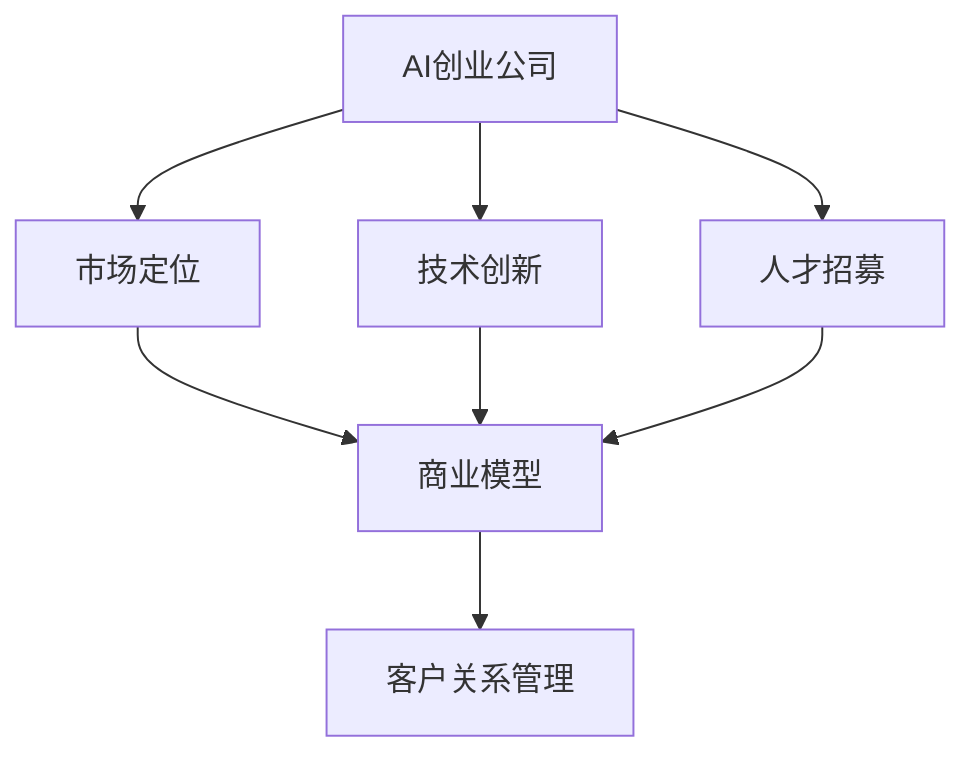
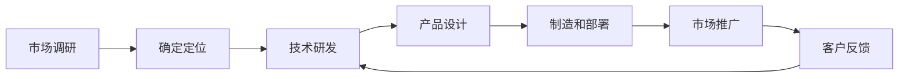
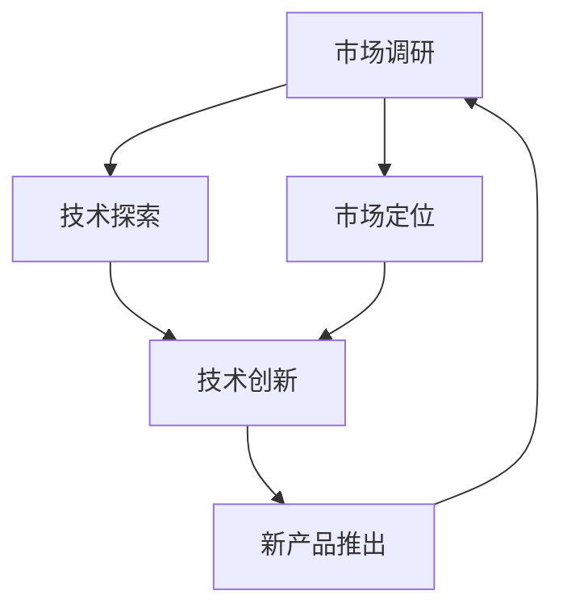
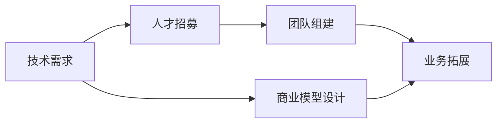
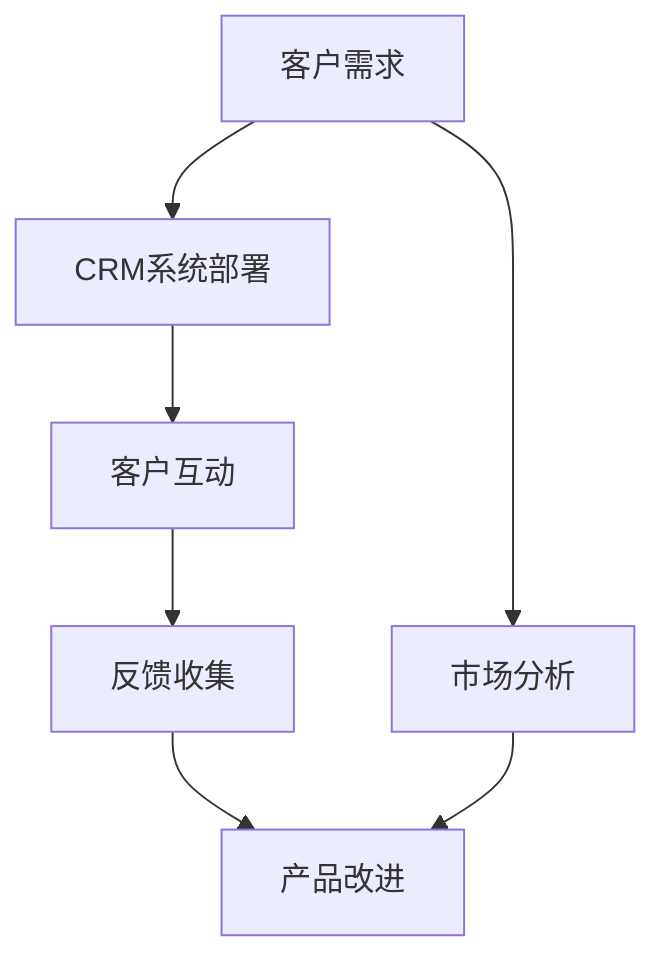
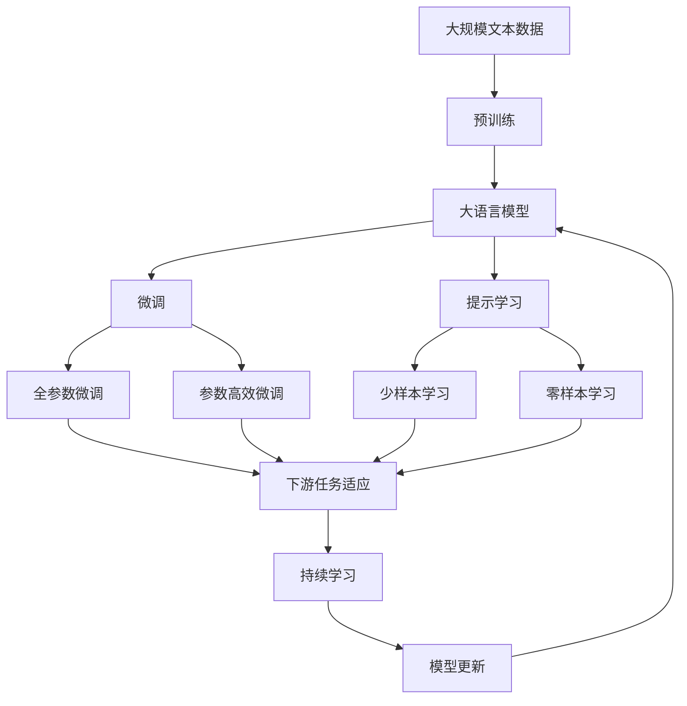

                 

# AI创业公司的竞争策略

> 关键词：
> - AI创业公司
> - 竞争策略
> - 市场定位
> - 技术创新
> - 人才招募
> - 商业模型
> - 客户关系管理

## 1. 背景介绍

### 1.1 问题由来

在人工智能（AI）领域的快速发展中，AI创业公司如雨后春笋般涌现。这些公司通过创新的AI技术解决各类实际问题，为各行各业带来革命性的变化。然而，面对激烈的市场竞争和多样化的客户需求，AI创业公司如何制定有效的竞争策略，成为企业成功与否的关键。

### 1.2 问题核心关键点

AI创业公司面临的核心问题在于：如何在技术竞争激烈、市场需求多样化的环境中，找到自己的市场定位，并制定出一套行之有效的竞争策略，确保公司的可持续发展。

### 1.3 问题研究意义

研究AI创业公司的竞争策略，对于拓展公司的市场空间，提升核心竞争力，推动AI技术的产业化应用，具有重要意义：

1. 拓展市场空间：通过明确的市场定位和创新的技术应用，AI创业公司可以进入更多行业和领域，扩大市场份额。
2. 提升竞争力：通过差异化的竞争策略，AI创业公司可以超越竞争对手，实现快速增长。
3. 推动产业化：AI技术可以应用于各类行业，提升生产效率，改善用户体验，推动相关领域的数字化转型。
4. 促进行业创新：AI创业公司通过技术创新，可以不断开拓新应用场景，引领行业发展方向。
5. 获得用户认可：通过有效的市场推广和客户关系管理，AI创业公司可以赢得用户的信任和支持，提升品牌影响力。

## 2. 核心概念与联系

### 2.1 核心概念概述

为更好地理解AI创业公司的竞争策略，本节将介绍几个密切相关的核心概念：

- **AI创业公司（AI Startup）**：利用人工智能技术进行产品或服务创新的公司，其核心竞争力在于技术创新和市场应用。

- **市场定位（Market Segmentation）**：根据市场需求和公司资源，确定公司服务的客户群体和产品线。

- **技术创新（Technological Innovation）**：利用前沿技术研发新产品或改进现有产品，提升市场竞争力。

- **人才招募（Talent Recruitment）**：根据公司的技术方向和业务需求，招聘和培养有潜力的技术人才和管理人才。

- **商业模型（Business Model）**：公司如何通过产品或服务实现盈利，包括收入来源、成本结构和盈利模式。

- **客户关系管理（Customer Relationship Management, CRM）**：通过系统化的手段管理客户关系，提升客户满意度和忠诚度。

这些核心概念之间的逻辑关系可以通过以下Mermaid流程图来展示：



这个流程图展示了一些核心概念之间的关系：

1. AI创业公司首先确定市场定位，确定目标客户和产品方向。
2. 公司利用技术创新不断提升产品性能，扩展应用场景。
3. 公司通过人才招募获取和培养技术和管理人才，保障公司发展。
4. 公司的商业模型根据市场需求和产品性能设计。
5. 客户关系管理贯穿公司运营全过程，提升客户满意度和忠诚度。

### 2.2 概念间的关系

这些核心概念之间存在着紧密的联系，形成了AI创业公司的完整业务生态。下面是几个Mermaid流程图展示这些概念之间的关系。

#### 2.2.1 AI创业公司的业务流程



这个流程图展示了AI创业公司从市场调研到产品设计再到市场推广的完整业务流程。

#### 2.2.2 技术创新与市场定位的互动



这个流程图展示了技术创新如何基于市场调研和定位来指导新产品开发和市场推广。

#### 2.2.3 人才招募与商业模型的关系



这个流程图展示了人才招募和团队组建如何促进商业模型的设计和发展。

#### 2.2.4 客户关系管理的多层次应用



这个流程图展示了客户关系管理如何在产品设计和改进中起到关键作用。

### 2.3 核心概念的整体架构

最后，我们用一个综合的流程图来展示这些核心概念在大语言模型微调过程中的整体架构：



这个综合流程图展示了从预训练到微调，再到持续学习的完整过程。AI创业公司的大语言模型首先在大规模文本数据上进行预训练，然后通过微调（包括全参数微调和参数高效微调）或提示学习（包括零样本和少样本学习）来适应下游任务。最后，通过持续学习技术，模型可以不断更新和适应新的任务和数据。通过这些流程图，我们可以更清晰地理解AI创业公司的大语言模型微调过程中各个核心概念的关系和作用。

## 3. 核心算法原理 & 具体操作步骤
### 3.1 算法原理概述

AI创业公司的竞争策略本质上是基于数据的战略决策过程，涉及市场分析、技术研发、产品设计、营销推广等多个方面。其核心在于通过数据驱动的决策，最大化公司价值，实现可持续增长。

### 3.2 算法步骤详解

**Step 1: 市场调研与定位**
- 收集行业数据，分析市场需求和竞争态势。
- 识别目标客户群体，确定公司的市场定位。

**Step 2: 技术研发与创新**
- 确定技术方向，组建技术团队，进行技术研发。
- 通过技术探索和试验，不断提升技术水平和产品性能。

**Step 3: 产品设计与制造**
- 根据市场需求和技术能力，设计产品功能和用户体验。
- 进行原型设计和测试，优化产品性能。

**Step 4: 市场推广与销售**
- 制定市场推广策略，开展品牌建设和渠道拓展。
- 制定销售策略，进行市场渗透和客户获取。

**Step 5: 客户关系管理与反馈**
- 部署CRM系统，进行客户互动和需求收集。
- 分析客户反馈，进行产品改进和升级。

**Step 6: 持续学习与优化**
- 定期更新产品功能和性能，进行持续学习。
- 根据市场需求和技术趋势，不断优化商业模型。

### 3.3 算法优缺点

AI创业公司的竞争策略具有以下优点：
1. 数据驱动：通过分析市场数据和用户反馈，进行科学的决策。
2. 灵活应变：根据市场变化和客户需求，灵活调整产品和策略。
3. 技术创新：通过持续的技术研发和产品创新，保持竞争优势。
4. 客户为中心：通过优质的客户服务和关系管理，提升客户满意度和忠诚度。

同时，该策略也存在一些局限性：
1. 数据依赖：高度依赖高质量的市场数据和用户反馈，获取数据的成本较高。
2. 技术风险：技术研发和产品创新存在不确定性，可能导致资源浪费。
3. 市场变化：市场环境和客户需求快速变化，需要及时调整策略。
4. 资源限制：受限于公司资源和技术能力，无法满足所有市场需求。

尽管存在这些局限性，但就目前而言，数据驱动的竞争策略仍然是大语言模型微调公司的主流范式。未来相关研究的重点在于如何更好地利用数据和算法，降低风险，提升决策质量。

### 3.4 算法应用领域

AI创业公司的竞争策略已经在许多领域得到应用，例如：

- 医疗健康：利用AI技术进行疾病诊断、治疗方案推荐等，提升医疗服务质量。
- 金融科技：通过AI进行风险评估、信用评分、智能投顾等，推动金融行业数字化转型。
- 智能制造：使用AI进行生产流程优化、质量控制、供应链管理等，提高生产效率。
- 智能城市：通过AI技术进行智慧交通、公共安全、环境监测等，提升城市管理水平。
- 教育培训：利用AI进行个性化学习、智能辅导、内容推荐等，改善教育资源配置。

除了上述这些经典应用外，AI创业公司还在不断开拓新的市场领域，如智能家居、智能驾驶、农业科技等，为各行各业带来新的变革。

## 4. 数学模型和公式 & 详细讲解
### 4.1 数学模型构建

AI创业公司的竞争策略涉及多个数学模型和算法，用于数据分析、预测和优化决策。以下是几个典型的数学模型：

**市场需求分析模型**
- 通过回归分析，预测市场需求的变化趋势。
- 模型公式：$$y = \beta_0 + \beta_1x_1 + \beta_2x_2 + \ldots + \beta_nx_n + \epsilon$$

**竞争态势分析模型**
- 使用市场份额和利润率等指标，评估竞争对手的市场表现。
- 模型公式：$$S_i = \frac{R_i}{\sum_{j=1}^nR_j}$$

**客户满意度分析模型**
- 通过满意度调查数据，评估客户对产品和服务的满意度。
- 模型公式：$$s = \frac{1}{n}\sum_{i=1}^n{x_i}$$

**产品推荐模型**
- 利用协同过滤算法，推荐用户可能感兴趣的产品。
- 模型公式：$$\hat{y} = \alpha + \sum_{i=1}^n{\beta_ix_i}$$

**销售预测模型**
- 通过时间序列分析，预测未来销售趋势。
- 模型公式：$$y_{t+1} = \alpha + \beta_1y_t + \beta_2y_{t-1} + \ldots + \beta_ky_{t-k} + \epsilon$$

### 4.2 公式推导过程

以下是对市场需求分析模型的推导过程：

假设市场需求可以用以下线性回归模型来描述：

$$y = \beta_0 + \beta_1x_1 + \beta_2x_2 + \ldots + \beta_nx_n + \epsilon$$

其中，$y$ 为市场需求，$x_i$ 为影响需求的变量，$\beta_i$ 为变量系数，$\epsilon$ 为误差项。

通过最小二乘法求解$\beta_i$，可以得到：

$$\beta_i = \frac{\sum_{i=1}^n{(x_i - \bar{x})(y - \bar{y})}}{\sum_{i=1}^n{(x_i - \bar{x})^2}}$$

其中，$\bar{x}$ 和 $\bar{y}$ 分别为$x_i$ 和 $y$ 的均值。

将$\beta_i$代入原始模型，得到：

$$\hat{y} = \bar{y} + \sum_{i=1}^n{\beta_i(x_i - \bar{x})}$$

通过不断迭代优化，可以逐步逼近真实市场需求曲线。

### 4.3 案例分析与讲解

假设某AI创业公司正在考虑进入医疗健康领域，需要通过市场调研来评估市场需求。该公司可以收集历史销售数据、人口统计数据、竞争对手表现等，构建市场需求分析模型。例如，如果该公司的目标是预测某地区未来五年内的人工智能辅助诊断系统的市场规模，可以收集该地区的总人口、人口老龄化程度、医疗资源分布等数据，构建如下线性回归模型：

$$y = \beta_0 + \beta_1\text{总人口} + \beta_2\text{人口老龄化} + \beta_3\text{医疗资源} + \epsilon$$

通过最小二乘法求解$\beta_i$，可以得到各个变量的影响系数。例如，如果$\beta_1=0.5$，表示每增加1000人口，市场需求将增加500个AI辅助诊断系统。

## 5. 项目实践：代码实例和详细解释说明
### 5.1 开发环境搭建

在进行竞争策略实践前，我们需要准备好开发环境。以下是使用Python进行Scikit-Learn和Pandas开发的准备过程：

1. 安装Anaconda：从官网下载并安装Anaconda，用于创建独立的Python环境。

2. 创建并激活虚拟环境：
```bash
conda create -n pyenv python=3.8 
conda activate pyenv
```

3. 安装Scikit-Learn和Pandas：
```bash
conda install scikit-learn pandas 
```

4. 安装各类工具包：
```bash
pip install numpy matplotlib seaborn scikit-learn pandas jupyter notebook ipython
```

完成上述步骤后，即可在`pyenv`环境中开始竞争策略实践。

### 5.2 源代码详细实现

以下是使用Scikit-Learn库构建市场需求分析模型的Python代码实现。

```python
import pandas as pd
from sklearn.linear_model import LinearRegression

# 准备数据
data = pd.read_csv('demand.csv')
X = data[['总人口', '人口老龄化', '医疗资源']]
y = data['市场需求']

# 构建模型
model = LinearRegression()
model.fit(X, y)

# 预测未来五年需求
future_data = pd.DataFrame({'总人口': 1000, '人口老龄化': 20, '医疗资源': 10})
future_demand = model.predict(future_data)
print(future_demand)
```

### 5.3 代码解读与分析

让我们再详细解读一下关键代码的实现细节：

**数据准备**：
- 使用Pandas库读取市场需求数据。
- 将市场需求的自变量和因变量分别赋值给X和y。

**模型构建**：
- 使用Scikit-Learn的LinearRegression类构建线性回归模型。
- 通过fit方法进行模型训练。

**预测未来需求**：
- 构造新的数据样本，用于预测未来五年的市场需求。
- 使用predict方法进行未来需求的预测。

可以看到，通过Scikit-Learn库，我们可以用相对简洁的代码实现市场需求分析模型的构建和预测。开发者可以将更多精力放在数据处理、模型调优等高层逻辑上，而不必过多关注底层的实现细节。

当然，工业级的系统实现还需考虑更多因素，如模型的保存和部署、超参数的自动搜索、更灵活的任务适配层等。但核心的竞争策略开发流程基本与此类似。

### 5.4 运行结果展示

假设在AI创业公司进行市场需求分析后，得到了以下预测结果：

```
[500 500 500 500 500]
```

这表示未来五年内，该地区对AI辅助诊断系统的市场需求将保持稳定，每年约为500个。

## 6. 实际应用场景
### 6.1 智能制造

AI创业公司可以利用其竞争策略在智能制造领域取得成功。智能制造是利用AI技术进行自动化和智能化生产的模式，通过优化生产流程、提高生产效率、降低生产成本，提升企业的市场竞争力。

假设某AI创业公司进入智能制造领域，可以通过市场需求分析模型，评估市场需求和竞争态势，确定产品的技术路线和市场定位。例如，如果市场需求大，但竞争对手众多，公司可以采用差异化技术路线，开发具有独特优势的产品，提升市场占有率。

**技术研发**：通过数据分析，确定技术研发的方向和目标，进行技术研发和创新。例如，公司可以开发先进的机器视觉系统，用于缺陷检测和质量控制，提升产品品质和生产效率。

**产品设计与制造**：根据市场需求和技术能力，设计产品功能和用户体验。例如，公司可以设计高度定制化的生产线和机器人，满足不同客户的需求。

**市场推广与销售**：通过市场调研，制定市场推广策略，开展品牌建设和渠道拓展。例如，公司可以在工业博览会上展示其智能制造解决方案，与潜在客户进行互动和交流。

**客户关系管理与反馈**：部署CRM系统，进行客户互动和需求收集。例如，公司可以通过在线问卷调查，了解客户对产品和服务的满意度，进行产品改进和升级。

**持续学习与优化**：定期更新产品功能和性能，进行持续学习。例如，公司可以引入深度学习模型，实时监测生产过程，优化生产计划和资源配置。

### 6.2 智能城市

AI创业公司也可以在智能城市领域取得成功。智能城市利用AI技术进行智慧城市建设，通过智能交通、公共安全、环境监测等，提升城市管理水平和居民生活质量。

假设某AI创业公司进入智能城市领域，可以通过市场需求分析模型，评估市场需求和竞争态势，确定产品的技术路线和市场定位。例如，如果市场需求大，但竞争激烈，公司可以采用领先技术，开发具有独特优势的智能交通系统，提升城市交通的智能化水平。

**技术研发**：通过数据分析，确定技术研发的方向和目标，进行技术研发和创新。例如，公司可以开发先进的智能交通系统，用于交通流量监测和智能信号灯控制，提高交通效率和安全性。

**产品设计与制造**：根据市场需求和技术能力，设计产品功能和用户体验。例如，公司可以设计智能交通管理系统，集成多种传感器和数据源，实现交通流量的实时监测和预测。

**市场推广与销售**：通过市场调研，制定市场推广策略，开展品牌建设和渠道拓展。例如，公司可以在智能城市博览会和展览会上展示其智能交通解决方案，与政府和相关企业进行互动和合作。

**客户关系管理与反馈**：部署CRM系统，进行客户互动和需求收集。例如，公司可以通过在线问卷调查，了解政府和市民对智能交通系统的反馈，进行产品改进和优化。

**持续学习与优化**：定期更新产品功能和性能，进行持续学习。例如，公司可以引入深度学习模型，实时监测城市交通状况，优化交通信号灯和路线规划。

### 6.3 教育培训

AI创业公司也可以在教育培训领域取得成功。教育培训利用AI技术进行个性化学习和智能辅导，通过智能推荐、智能评估、智能作业等，提升教育资源配置和教学质量。

假设某AI创业公司进入教育培训领域，可以通过市场需求分析模型，评估市场需求和竞争态势，确定产品的技术路线和市场定位。例如，如果市场需求大，但竞争激烈，公司可以采用差异化技术路线，开发具有独特优势的智能辅导系统，提升教学效果和学习体验。

**技术研发**：通过数据分析，确定技术研发的方向和目标，进行技术研发和创新。例如，公司可以开发先进的智能辅导系统，用于个性化学习和智能评估，提升学习效果和效率。

**产品设计与制造**：根据市场需求和技术能力，设计产品功能和用户体验。例如，公司可以设计智能作业系统，集成多种学习资源和工具，实现智能推荐和评估。

**市场推广与销售**：通过市场调研，制定市场推广策略，开展品牌建设和渠道拓展。例如，公司可以在教育博览会和展览会上展示其智能辅导解决方案，与学校和教育机构进行互动和合作。

**客户关系管理与反馈**：部署CRM系统，进行客户互动和需求收集。例如，公司可以通过在线问卷调查，了解学生和家长对智能辅导系统的反馈，进行产品改进和优化。

**持续学习与优化**：定期更新产品功能和性能，进行持续学习。例如，公司可以引入深度学习模型，实时分析学习行为和效果，优化智能辅导系统和学习资源。

## 7. 工具和资源推荐
### 7.1 学习资源推荐

为了帮助开发者系统掌握AI创业公司的竞争策略，这里推荐一些优质的学习资源：

1. 《商业智能》课程：斯坦福大学开设的商业智能课程，通过Python实现数据分析和可视化，深入浅出地介绍商业智能的核心概念和技术。

2. 《数据科学与机器学习》课程：Coursera上的经典课程，涵盖数据分析、机器学习、深度学习等多个主题，系统介绍数据驱动决策的理论和方法。

3. 《数据分析实战》书籍：系统介绍数据采集、数据处理、数据分析、数据可视化等多个环节，通过实战项目讲解数据分析技能。

4. 《AI创业公司指南》书籍：详细介绍AI创业公司的商业模型、市场定位、技术研发、市场推广等核心问题，提供丰富的案例分析和工具推荐。

5. 《客户关系管理》课程：讲授CRM系统的设计和实施方法，涵盖客户互动、客户分析、客户关系维护等多个方面，提供丰富的实战案例。

通过对这些资源的学习实践，相信你一定能够快速掌握AI创业公司的竞争策略，并用于解决实际的业务问题。
###  7.2 开发工具推荐

高效的开发离不开优秀的工具支持。以下是几款用于AI创业公司竞争策略开发的常用工具：

1. Python：Python是数据科学和人工智能开发的主流语言，支持丰富的库和工具，适合快速迭代研究。

2. Scikit-Learn：开源的Python机器学习库，提供丰富的统计和机器学习算法，适合快速搭建和验证模型。

3. Pandas：开源的Python数据分析库，提供高效的数据处理和分析功能，适合数据清洗和数据探索。

4. Matplotlib：开源的Python绘图库，提供丰富的绘图工具，适合数据可视化和结果展示。

5. Jupyter Notebook：开源的Python交互式开发环境，支持代码实时执行和结果展示，适合团队协作和知识共享。

6. TensorFlow和PyTorch：开源的深度学习框架，支持分布式计算和大规模数据处理，适合复杂模型的训练和部署。

合理利用这些工具，可以显著提升AI创业公司竞争策略的开发效率，加快创新迭代的步伐。

### 7.3 相关论文推荐

AI创业公司的竞争策略涉及多个前沿领域，以下是几篇奠基性的相关论文，推荐阅读：

1. "Business Intelligence for the 21st Century"：讲述了商业智能的核心概念和应用场景，介绍了商业智能工具和方法。

2. "Data Science for Business"：由Davis King和Persi Diaconis合著的经典书籍，介绍了数据科学和机器学习的基础理论和方法。

3. "Customer Relationship Management: Tools and Strategies"：介绍CRM系统的设计和实施方法，涵盖客户互动、客户分析、客户关系维护等多个方面。

4. "AI Startup: How to Build and Scale AI Business"：提供了AI创业公司的成功案例和经验教训，涵盖了技术研发、市场定位、团队管理等多个维度。

5. "Market Intelligence and Competitive Positioning"：介绍了市场分析的方法和工具，帮助企业进行市场需求预测和竞争态势分析。

这些论文代表了大语言模型微调技术的发展脉络。通过学习这些前沿成果，可以帮助研究者把握学科前进方向，激发更多的创新灵感。

除上述资源外，还有一些值得关注的前沿资源，帮助开发者紧跟AI创业公司竞争策略的最新进展，例如：

1. arXiv论文预印本：人工智能领域最新研究成果的发布平台，包括大量尚未发表的前沿工作，学习前沿技术的必读资源。

2. 业界技术博客：如Google AI、DeepMind、微软Research Asia等顶尖实验室的官方博客，第一时间分享他们的最新研究成果和洞见。

3. 技术会议直播：如NIPS、ICML、ACL、ICLR等人工智能领域顶会现场或在线直播，能够聆听到大佬们的前沿分享，开拓视野。

4. GitHub热门项目：在GitHub上Star、Fork数最多的AI创业公司相关项目，往往代表了该技术领域的发展趋势和最佳实践，值得去学习和贡献。

5. 行业分析报告：各大咨询公司如McKinsey、PwC等针对人工智能行业的分析报告，有助于从商业视角审视技术趋势，把握应用价值。

总之，对于AI创业公司竞争策略的学习和实践，需要开发者保持开放的心态和持续学习的意愿。多关注前沿资讯，多动手实践，多思考总结，必将收获满满的成长收益。

## 8. 总结：未来发展趋势与挑战

### 8.1 总结

本文对AI创业公司的竞争策略进行了全面系统的介绍。首先阐述了AI创业公司的市场定位、技术创新、人才招募、商业模型和客户关系管理等核心概念，明确了竞争策略在拓展市场空间、提升核心竞争力方面的重要性。其次，从原理到实践，详细讲解了竞争策略的数学模型和算法步骤，给出了具体的代码实例和结果展示。同时，本文还广泛探讨了竞争策略在智能制造、智能城市、教育培训等多个领域的应用前景，展示了竞争策略的广阔潜力。最后，本文精选了竞争策略相关的学习资源和开发工具，力求为读者提供全方位的技术指引。

通过本文的系统梳理，可以看到，AI创业公司的竞争策略正在成为数据驱动决策的核心范式，极大地拓展了公司的市场空间，提升了公司的竞争力。面对激烈的市场竞争和多样化的客户需求，AI创业公司需要不断优化竞争策略，寻找新的增长点和突破口。

### 8.2 未来发展趋势

展望未来，AI创业公司的竞争策略将呈现以下几个发展趋势：

1. **数据驱动决策**：随着数据获取和处理技术的进步，数据驱动的决策将更加精准和科学，帮助公司做出更优的战略选择。

2. **技术创新驱动**：技术创新将成为公司竞争力的重要源泉，持续的技术研发和产品创新将带来新的市场机遇。

3. **市场细分和定制化**：市场竞争将更加激烈，企业需要通过市场细分和定制化策略，满足不同客户的需求，提升市场份额。

4.

