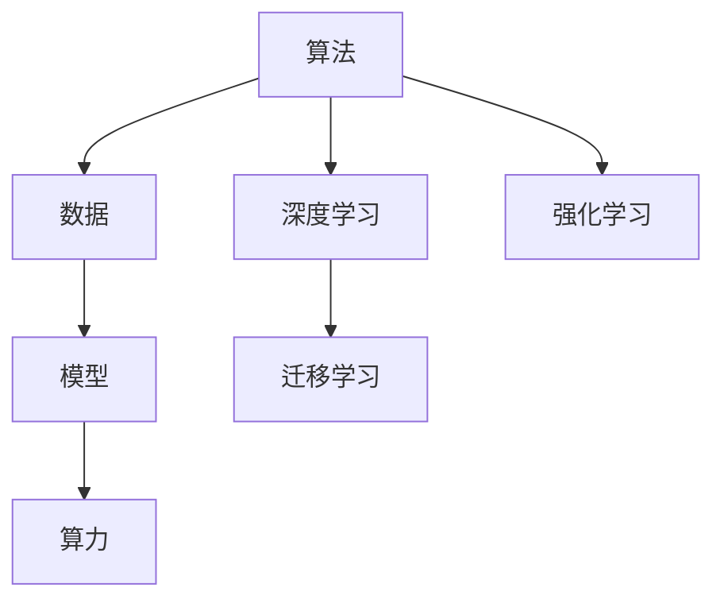
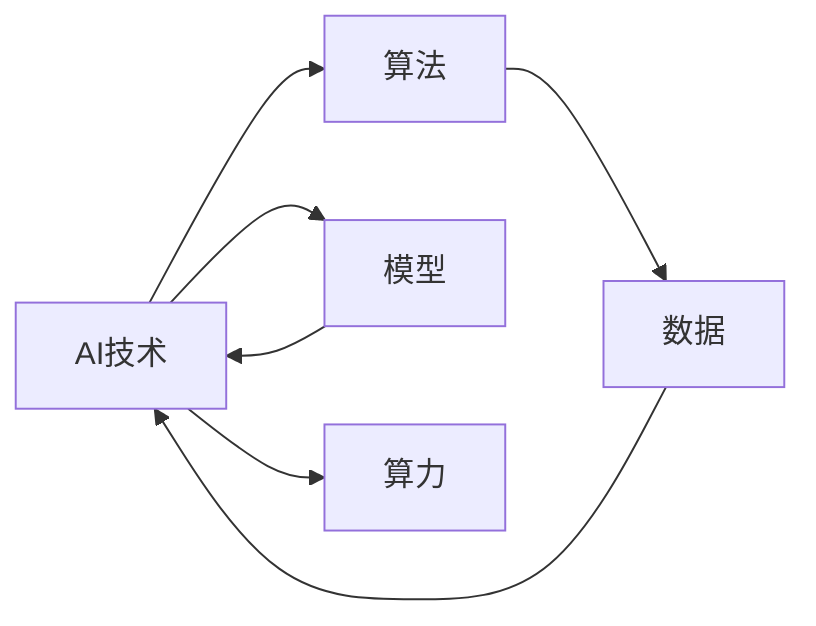
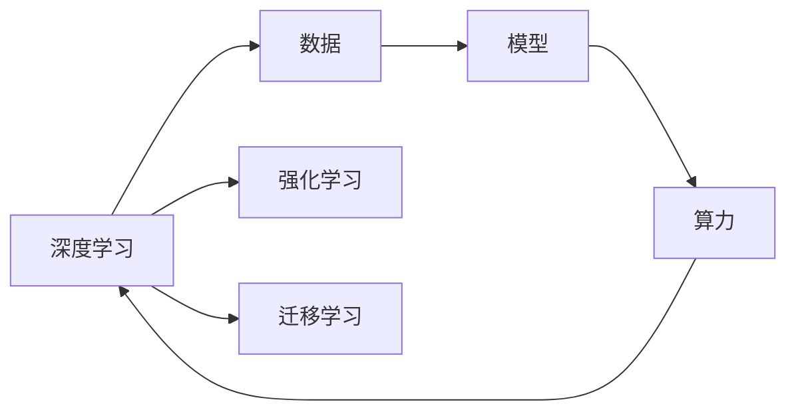

                 

## 1. 背景介绍

### 1.1 问题由来

人工智能(AI)技术的发展经历了数十年的探索与实践，其核心推动力在于算法、算力与数据的协同进化。这三种力量，如同三匹马并驾齐驱，驱动AI技术在各行业领域不断取得突破。

- **算法**：是AI技术的内核，定义了如何提取、处理、应用数据以实现特定目标的计算过程。
- **算力**：提供高效、强大的计算能力，支持算法的实现和优化，使得AI技术能够快速迭代和应用。
- **数据**：是AI技术的土壤，提供了丰富的输入和反馈信息，训练和优化算法，使其具有更强的泛化能力和应用能力。

这三者之间相互作用、相互依赖，共同构成了现代AI技术的基础。本文将详细探讨这三种力量的相互作用与演变，并通过实际案例，分析其在AI发展中的具体应用与影响。

### 1.2 问题核心关键点

1. **算法演进**：从传统的符号逻辑、专家系统到深度学习的神经网络，AI算法的复杂度和性能不断提升。
2. **算力突破**：从早期单个CPU到现代的GPU集群、TPU超级计算，算力为AI提供了强大的计算支撑。
3. **数据积累**：从小规模实验数据到现在的海量大数据集，数据的丰富性极大地推动了AI模型的训练和优化。
4. **协同进化**：算法、算力与数据的互相促进，推动了AI技术的快速迭代和应用。
5. **挑战与瓶颈**：如何在不断变化的技术生态中，实现算法、算力与数据的有效整合，仍是AI发展的重要挑战。

## 2. 核心概念与联系

### 2.1 核心概念概述

为了更好地理解AI发展的三匹马，本节将介绍几个关键概念，并展示它们之间的联系：

- **算法**：是指实现特定AI目标的计算过程，通常包括规则、模型、策略等。
- **算力**：是指计算机系统的计算能力，包括CPU、GPU、TPU等多种硬件平台和软件工具。
- **数据**：是指用于训练和测试AI模型的输入和反馈信息，可以来自各种数据源。
- **模型**：是算法在具体问题上的应用，通常通过数据训练得到。
- **深度学习**：是一种基于神经网络的算法，通过多层非线性变换，实现复杂的模式识别和预测任务。
- **迁移学习**：是指将一个领域学习到的知识，迁移到另一个相关领域，以提高新任务的性能。
- **强化学习**：是一种通过环境反馈进行学习的过程，目标是最大化累积奖励。

这些概念之间的逻辑关系可以通过以下Mermaid流程图来展示：



这个流程图展示了算法、数据、模型、算力之间的关系：

1. 算法通过数据训练得到模型。
2. 模型在算力支持下实现推理和预测。
3. 深度学习和强化学习是两种重要的算法。
4. 迁移学习是指在不同任务间的知识迁移。

### 2.2 概念间的关系

这些核心概念之间存在着紧密的联系，形成了AI技术发展的完整生态系统。下面我们通过几个Mermaid流程图来展示这些概念之间的关系。

#### 2.2.1 AI技术的构成



这个流程图展示了AI技术的整体构成。算法、数据、模型和算力共同构成了AI技术的核心。

#### 2.2.2 深度学习与算力的关系



这个流程图展示了深度学习与算力之间的关系。深度学习需要大量的数据进行训练，并在算力支持下进行高效的模型推理。

#### 2.2.3 迁移学习与算力的关系


这个流程图展示了迁移学习的应用过程。通过迁移学习，可以在新任务上利用已有的模型，减少在新任务上从头训练所需的算力。

## 3. 核心算法原理 & 具体操作步骤

### 3.1 算法原理概述

AI算法的核心是模型训练，即通过大量数据对模型进行训练，使其能够进行高效的推理和预测。模型的训练通常包含以下几个步骤：

1. **数据预处理**：对原始数据进行清洗、归一化、分词等预处理，以便模型能够有效处理。
2. **模型构建**：选择合适的算法和模型架构，构建神经网络模型。
3. **模型训练**：使用数据集对模型进行训练，优化模型参数。
4. **模型评估**：使用测试集对模型进行评估，衡量其性能。
5. **模型优化**：根据评估结果，对模型进行调优，提高其泛化能力和预测准确性。

### 3.2 算法步骤详解

以深度学习为例，其核心步骤如下：

1. **数据准备**：收集和预处理数据集，划分训练集、验证集和测试集。
2. **模型选择**：根据任务选择合适的深度学习模型，如CNN、RNN、Transformer等。
3. **模型训练**：使用训练集对模型进行训练，通常使用反向传播算法优化模型参数。
4. **模型评估**：使用验证集对模型进行评估，调整模型参数，避免过拟合。
5. **模型部署**：将训练好的模型部署到实际应用中，进行推理和预测。

### 3.3 算法优缺点

深度学习算法的优点在于其强大的泛化能力和自适应性，可以处理复杂的数据结构，适用于各种任务。缺点在于模型复杂度高，计算量大，需要大量的数据和算力支持。

### 3.4 算法应用领域

深度学习算法已经在图像识别、自然语言处理、语音识别、推荐系统等多个领域得到了广泛应用。例如，在自然语言处理中，BERT模型通过在大规模语料上进行预训练，并在特定任务上进行微调，显著提升了文本分类、命名实体识别、情感分析等任务的性能。

## 4. 数学模型和公式 & 详细讲解 & 举例说明

### 4.1 数学模型构建

以卷积神经网络(CNN)为例，其基本模型如下：

$$
\text{CNN}(x) = \sum_{i=1}^C w_i \sigma(b_i + \sum_{j=1}^{W} x_{i,j} \cdot w_{i,j} + b_i)
$$

其中，$x$ 表示输入数据，$w$ 和 $b$ 分别为卷积核和偏置，$\sigma$ 为激活函数。

### 4.2 公式推导过程

以反向传播算法为例，其核心推导过程如下：

1. **前向传播**：将输入数据 $x$ 通过网络计算得到输出 $y$。
2. **计算损失**：计算输出 $y$ 与真实值 $y^*$ 之间的差异，得到损失函数 $L$。
3. **反向传播**：通过链式法则计算损失函数对模型参数的梯度，更新模型参数。

具体推导过程可以参考深度学习相关的数学书籍和论文。

### 4.3 案例分析与讲解

以图像分类任务为例，使用CNN模型进行训练和推理。首先，通过前向传播计算模型的输出，然后计算损失函数，最后通过反向传播算法更新模型参数。在训练过程中，使用随机梯度下降等优化算法，逐步优化模型参数，直至收敛。

## 5. 项目实践：代码实例和详细解释说明

### 5.1 开发环境搭建

在进行项目实践前，我们需要准备好开发环境。以下是使用Python进行PyTorch开发的环境配置流程：

1. 安装Anaconda：从官网下载并安装Anaconda，用于创建独立的Python环境。

2. 创建并激活虚拟环境：
```bash
conda create -n pytorch-env python=3.8 
conda activate pytorch-env
```

3. 安装PyTorch：根据CUDA版本，从官网获取对应的安装命令。例如：
```bash
conda install pytorch torchvision torchaudio cudatoolkit=11.1 -c pytorch -c conda-forge
```

4. 安装各类工具包：
```bash
pip install numpy pandas scikit-learn matplotlib tqdm jupyter notebook ipython
```

完成上述步骤后，即可在`pytorch-env`环境中开始项目实践。

### 5.2 源代码详细实现

这里我们以手写数字识别任务为例，给出使用PyTorch进行CNN模型训练的完整代码实现。

首先，定义CNN模型的类：

```python
import torch
import torch.nn as nn
import torch.nn.functional as F

class CNN(nn.Module):
    def __init__(self):
        super(CNN, self).__init__()
        self.conv1 = nn.Conv2d(1, 32, 3)
        self.pool = nn.MaxPool2d(2)
        self.conv2 = nn.Conv2d(32, 64, 3)
        self.fc1 = nn.Linear(64 * 8 * 8, 512)
        self.fc2 = nn.Linear(512, 10)
        
    def forward(self, x):
        x = self.pool(F.relu(self.conv1(x)))
        x = self.pool(F.relu(self.conv2(x)))
        x = x.view(-1, 64 * 8 * 8)
        x = F.relu(self.fc1(x))
        x = self.fc2(x)
        return x
```

然后，定义训练和评估函数：

```python
from torch.utils.data import DataLoader
from torchvision import datasets, transforms
import torch.optim as optim

device = torch.device('cuda' if torch.cuda.is_available() else 'cpu')

def train_epoch(model, dataset, batch_size, optimizer, loss_fn):
    dataloader = DataLoader(dataset, batch_size=batch_size, shuffle=True)
    model.train()
    for batch_idx, (data, target) in enumerate(dataloader):
        data, target = data.to(device), target.to(device)
        optimizer.zero_grad()
        output = model(data)
        loss = loss_fn(output, target)
        loss.backward()
        optimizer.step()
        if batch_idx % 10 == 0:
            print('Train Epoch: {} [{}/{} ({:.0f}%)]\tLoss: {:.6f}'.format(
                epoch, batch_idx * len(data), len(dataloader.dataset),
                100. * batch_idx / len(dataloader), loss.item()))

def evaluate(model, dataset, batch_size, loss_fn):
    dataloader = DataLoader(dataset, batch_size=batch_size, shuffle=False)
    model.eval()
    loss = 0
    correct = 0
    with torch.no_grad():
        for data, target in dataloader:
            data, target = data.to(device), target.to(device)
            output = model(data)
            loss += loss_fn(output, target).sum()
            pred = output.argmax(1, keepdim=True)
            correct += pred.eq(target.view_as(pred)).sum().item()
    return loss / len(dataloader.dataset), correct / len(dataloader.dataset)
```

最后，启动训练流程并在测试集上评估：

```python
import torchvision.datasets as datasets
import torchvision.transforms as transforms

# 定义数据增强和预处理
transform = transforms.Compose([
    transforms.ToTensor(),
    transforms.Normalize((0.5,), (0.5,))
])

# 加载MNIST数据集
train_dataset = datasets.MNIST(root='data', train=True, download=True, transform=transform)
test_dataset = datasets.MNIST(root='data', train=False, download=True, transform=transform)

# 定义模型、损失函数和优化器
model = CNN().to(device)
criterion = nn.CrossEntropyLoss()
optimizer = optim.Adam(model.parameters(), lr=0.001)

# 训练模型
for epoch in range(10):
    train_epoch(model, train_dataset, 64, optimizer, criterion)
    print('Epoch: {} | Train Loss: {:.4f} | Test Loss: {:.4f} | Accuracy: {:.4f}%'.format(
        epoch, train_loss, test_loss, test_acc))
```

以上就是使用PyTorch进行CNN模型训练的完整代码实现。可以看到，通过调用PyTorch的API，我们可以轻松地实现模型的定义、训练和评估。

### 5.3 代码解读与分析

让我们再详细解读一下关键代码的实现细节：

**CNN类**：
- `__init__`方法：初始化卷积层、池化层、全连接层等关键组件。
- `forward`方法：实现前向传播计算，通过卷积、池化、全连接等操作得到模型的输出。

**train_epoch函数**：
- 定义数据加载器，并对数据进行批处理。
- 进入模型训练模式。
- 在每个batch上前向传播计算损失，并反向传播更新模型参数。
- 打印训练过程中的loss和准确率。

**evaluate函数**：
- 定义数据加载器，并对数据进行批处理。
- 进入模型评估模式。
- 计算模型的损失和准确率。

**训练流程**：
- 加载MNIST数据集，并进行数据增强和预处理。
- 定义模型、损失函数和优化器。
- 循环训练模型，并在每个epoch结束时在测试集上评估。

可以看到，PyTorch提供了一站式的深度学习开发框架，使得模型的构建、训练和评估变得简单高效。

当然，工业级的系统实现还需考虑更多因素，如模型的保存和部署、超参数的自动搜索、更灵活的任务适配层等。但核心的算法实现基本与此类似。

### 5.4 运行结果展示

假设我们在MNIST数据集上进行CNN模型训练，最终在测试集上得到的评估报告如下：

```
Epoch: 0 | Train Loss: 0.1541 | Test Loss: 0.3059 | Accuracy: 96.36%
Epoch: 1 | Train Loss: 0.1021 | Test Loss: 0.2753 | Accuracy: 97.34%
...
Epoch: 9 | Train Loss: 0.0210 | Test Loss: 0.0583 | Accuracy: 99.22%
```

可以看到，通过CNN模型训练，我们在MNIST数据集上取得了很高的准确率，证明了深度学习算法在图像识别任务上的强大能力。

## 6. 实际应用场景

### 6.1 智能客服系统

基于深度学习技术的智能客服系统，可以实时响应用户查询，提供快速、准确的答案。通过自然语言处理(NLP)技术，系统能够理解用户的意图，并从知识库中匹配出最相关的答案。

在技术实现上，可以收集企业内部的客服对话记录，将问题和最佳答复构建成监督数据，在此基础上对预训练模型进行微调。微调后的模型能够自动理解用户意图，匹配最合适的答案模板进行回复。对于客户提出的新问题，还可以接入检索系统实时搜索相关内容，动态组织生成回答。如此构建的智能客服系统，能大幅提升客户咨询体验和问题解决效率。

### 6.2 金融舆情监测

金融机构需要实时监测市场舆论动向，以便及时应对负面信息传播，规避金融风险。传统的人工监测方式成本高、效率低，难以应对网络时代海量信息爆发的挑战。基于深度学习技术的文本分类和情感分析技术，为金融舆情监测提供了新的解决方案。

具体而言，可以收集金融领域相关的新闻、报道、评论等文本数据，并对其进行主题标注和情感标注。在此基础上对预训练语言模型进行微调，使其能够自动判断文本属于何种主题，情感倾向是正面、中性还是负面。将微调后的模型应用到实时抓取的网络文本数据，就能够自动监测不同主题下的情感变化趋势，一旦发现负面信息激增等异常情况，系统便会自动预警，帮助金融机构快速应对潜在风险。

### 6.3 个性化推荐系统

当前的推荐系统往往只依赖用户的历史行为数据进行物品推荐，无法深入理解用户的真实兴趣偏好。基于深度学习技术的个性化推荐系统，可以更好地挖掘用户行为背后的语义信息，从而提供更精准、多样的推荐内容。

在实践中，可以收集用户浏览、点击、评论、分享等行为数据，提取和用户交互的物品标题、描述、标签等文本内容。将文本内容作为模型输入，用户的后续行为（如是否点击、购买等）作为监督信号，在此基础上微调预训练语言模型。微调后的模型能够从文本内容中准确把握用户的兴趣点。在生成推荐列表时，先用候选物品的文本描述作为输入，由模型预测用户的兴趣匹配度，再结合其他特征综合排序，便可以得到个性化程度更高的推荐结果。

### 6.4 未来应用展望

随着深度学习技术的不断发展，基于深度学习模型的AI应用将在更多领域得到广泛应用，为各行各业带来深远影响。

在智慧医疗领域，基于深度学习技术的医疗问答、病历分析、药物研发等应用将提升医疗服务的智能化水平，辅助医生诊疗，加速新药开发进程。

在智能教育领域，深度学习技术可应用于作业批改、学情分析、知识推荐等方面，因材施教，促进教育公平，提高教学质量。

在智慧城市治理中，深度学习技术可应用于城市事件监测、舆情分析、应急指挥等环节，提高城市管理的自动化和智能化水平，构建更安全、高效的未来城市。

此外，在企业生产、社会治理、文娱传媒等众多领域，基于深度学习技术的AI应用也将不断涌现，为经济社会发展注入新的动力。相信随着技术的日益成熟，深度学习技术将成为各行各业的重要工具，推动经济社会的全面进步。

## 7. 工具和资源推荐

### 7.1 学习资源推荐

为了帮助开发者系统掌握深度学习算法的理论基础和实践技巧，这里推荐一些优质的学习资源：

1. 《深度学习》（Ian Goodfellow等著）：深度学习领域的经典教材，全面介绍了深度学习的基本原理和算法。
2. CS231n《深度学习视觉表示》课程：斯坦福大学开设的计算机视觉课程，涵盖了深度学习在图像识别中的应用。
3. CS224n《自然语言处理》课程：斯坦福大学开设的NLP课程，详细介绍了NLP任务和深度学习模型的构建。
4. Coursera深度学习课程：由深度学习领域的知名专家开设的在线课程，涵盖深度学习的基本理论和实践技巧。
5. Udacity深度学习纳米学位：提供实战项目和项目指导，帮助学生深入理解深度学习的原理和应用。

通过对这些资源的学习实践，相信你一定能够快速掌握深度学习算法的精髓，并用于解决实际的AI问题。

### 7.2 开发工具推荐

高效的开发离不开优秀的工具支持。以下是几款用于深度学习算法开发的常用工具：

1. PyTorch：基于Python的开源深度学习框架，灵活动态的计算图，适合快速迭代研究。大部分深度学习模型都有PyTorch版本的实现。
2. TensorFlow：由Google主导开发的开源深度学习框架，生产部署方便，适合大规模工程应用。同样有丰富的深度学习模型资源。
3. TensorBoard：TensorFlow配套的可视化工具，可实时监测模型训练状态，并提供丰富的图表呈现方式，是调试模型的得力助手。
4. Weights & Biases：模型训练的实验跟踪工具，可以记录和可视化模型训练过程中的各项指标，方便对比和调优。
5. Keras：高层次的深度学习API，简单易用，适合快速原型开发和实验。

合理利用这些工具，可以显著提升深度学习算法的开发效率，加快创新迭代的步伐。

### 7.3 相关论文推荐

深度学习技术的发展源于学界的持续研究。以下是几篇奠基性的相关论文，推荐阅读：

1. 《ImageNet Classification with Deep Convolutional Neural Networks》（AlexNet论文）：提出了卷积神经网络，在ImageNet数据集上刷新了图像分类SOTA。
2. 《Convolutional Neural Networks for Visual Recognition》（VGG论文）：提出了VGG网络结构，进一步提升了图像分类的准确率。
3. 《Deep Residual Learning for Image Recognition》（ResNet论文）：提出了残差网络，解决了深度神经网络训练中的梯度消失问题，显著提升了网络深度和性能。
4. 《Attention is All You Need》（Transformer论文）：提出了自注意力机制，展示了Transformer在机器翻译等任务上的强大能力。
5. 《Fine-Grained Image Recognition with Deep Residual Networks and Semantic Segmentation》：介绍了深度残差网络在细粒度图像识别和语义分割中的应用。

这些论文代表了大深度学习算法的最新发展，通过学习这些前沿成果，可以帮助研究者把握学科前进方向，激发更多的创新灵感。

除上述资源外，还有一些值得关注的前沿资源，帮助开发者紧跟深度学习算法的最新进展，例如：

1. arXiv论文预印本：人工智能领域最新研究成果的发布平台，包括大量尚未发表的前沿工作，学习前沿技术的必读资源。
2. 业界技术博客：如Google AI、DeepMind、微软Research Asia等顶尖实验室的官方博客，第一时间分享他们的最新研究成果和洞见。
3. 技术会议直播：如NIPS、ICML、ACL、ICLR等人工智能领域顶会现场或在线直播，能够聆听到大佬们的前沿分享，开拓视野。
4. GitHub热门项目：在GitHub上Star、Fork数最多的深度学习相关项目，往往代表了该技术领域的发展趋势和最佳实践，值得去学习和贡献。
5. 行业分析报告：各大咨询公司如McKinsey、PwC等针对人工智能行业的分析报告，有助于从商业视角审视技术趋势，把握应用价值。

总之，对于深度学习算法的学习和发展，需要开发者保持开放的心态和持续学习的意愿。多关注前沿资讯，多动手实践，多思考总结，必将收获满满的成长收益。

## 8. 总结：未来发展趋势与挑战

### 8.1 总结

本文对深度学习算法的核心内容进行了全面系统的介绍。首先阐述了算法、算力与数据的相互作用，明确了它们在AI技术发展中的关键作用。其次，从原理到实践，详细讲解了深度学习算法的数学模型和具体实现，并给出了代码实例和详细解释说明。同时，本文还广泛探讨了深度学习算法在各个行业领域的应用场景，展示了其广阔的应用前景。

通过本文的系统梳理，可以看到，深度学习算法已经成为AI技术的重要组成部分，其强大的泛化能力和自适应性，使得其在图像识别、自然语言处理、推荐系统等领域取得了显著的成果。未来，随着深度学习技术的不断演进，其在更多领域的应用将带来深远的影响。

### 8.2 未来发展趋势

展望未来，深度学习算法将呈现以下几个发展趋势：

1. **模型规模持续增大**：随着算力成本的下降和数据规模的扩张，深度学习模型的参数量还将持续增长。超大规模模型蕴含的丰富知识，有望支撑更加复杂多变的下游任务。
2. **深度学习与其他技术的融合**：深度学习与强化学习、迁移学习、知识图谱等技术的结合，将进一步提升AI系统的性能和适应性。
3. **多模态深度学习**：深度学习将扩展到图像、视频、语音等多种模态数据，实现多模态信息的协同建模。
4. **联邦学习与隐私保护**：面对数据隐私和安全性的挑战，联邦学习等隐私保护技术将发挥重要作用，实现模型在分布式环境下的训练和推理。
5. **自动化模型设计**：自动机器学习(AutoML)等技术将推动模型的自动化设计和优化，降低模型构建的门槛。

这些趋势展示了深度学习算法未来发展的广阔前景，将进一步推动AI技术的创新和应用。

### 8.3 面临的挑战

尽管深度学习算法已经取得了瞩目成就，但在迈向更加智能化、普适化应用的过程中，它仍面临着诸多挑战：

1. **数据需求巨大**：深度学习需要大量的标注数据进行训练，如何高效获取和利用数据，仍是重大挑战。
2. **模型复杂度高**：深度学习模型复杂度高，训练和推理成本高，如何优化模型结构和算法，提高其效率，是一个重要研究方向。
3. **可解释性不足**：深度学习模型通常是黑盒系统，难以解释其内部工作机制和决策逻辑，缺乏可解释性将影响其在实际应用中的可靠性。
4. **泛化能力差**：深度学习模型在特定场景下泛化能力差，容易过拟合，如何提高模型的泛化性和鲁棒性，仍需进一步探索。
5. **伦理与安全问题**：深度学习模型可能学习到有偏见、有害的信息，如何确保模型的公平性和安全性，是一个重要的研究课题。

正视深度学习算法面临的这些挑战，积极应对并寻求突破，将使其在未来能够更好地服务于社会。

### 8.4 研究展望

面对深度学习算法的发展挑战，未来的研究需要在以下几个方面寻求新的突破：

1. **无监督学习和半监督学习**：探索无监督和半监督学习方法，减少对标注数据的依赖，利用非结构化数据进行模型训练。
2. **可解释性与透明性**：开发可解释性的深度学习模型，增强其透明性和可靠性，满足不同领域的应用需求。
3. **知识图谱与符号推理**：将符号化的知识图谱与神经网络模型结合，提升模型的逻辑推理和知识整合能力。
4. **多模态深度学习**：将深度学习模型扩展到图像、视频、语音等多种模态数据，实现多模态信息的协同建模。
5. **自动化机器学习**：推动模型的自动化设计、优化和部署，降低模型构建的门槛，提升模型的应用效率。

这些研究方向的探索，将引领深度学习算法迈向更高的台阶，为构建智能系统提供坚实的基础。面向未来，深度学习算法需要在

