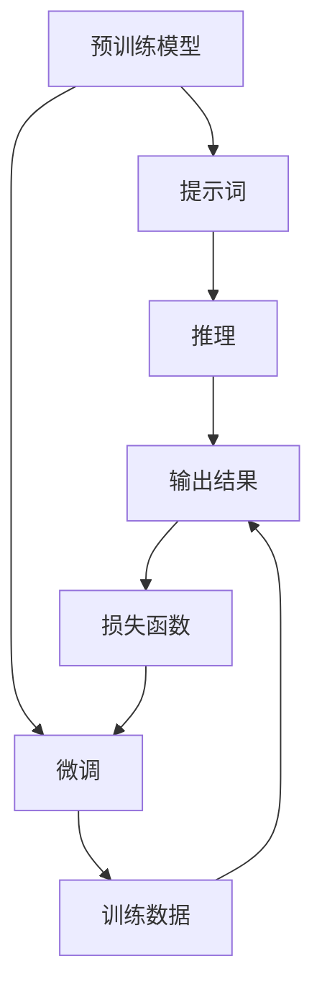

                 

# AI大模型Prompt提示词最佳实践：让模型提问直到有足够信息

> 关键词：Prompt提示词,自然语言处理(NLP),深度学习,预训练模型,Transformer,BERT,微调,Fine-Tuning

## 1. 背景介绍

### 1.1 问题由来

在深度学习和自然语言处理(NLP)领域，预训练语言模型(如BERT、GPT等)已经取得了巨大成功。这些模型通过在大规模无标签文本数据上进行自监督预训练，学习到丰富的语言知识，能够对大量文本进行理解和生成。但预训练模型的泛化能力有限，面对特定的下游任务，仍然需要进一步的微调。

微调过程通常需要大量的标注数据，但标注数据获取成本高昂且耗时。为了减少对标注数据的需求，研究者们提出了一种新的方法——Prompt提示词(Prompt)。通过精心设计的提示词，可以在不增加标注样本的情况下，显著提升模型在特定任务上的表现。

### 1.2 问题核心关键点

Prompt提示词的核心思想是在输入文本中引入一定格式的标记，引导预训练模型按照期望的方式进行推理和生成。其基本流程如下：

1. 将任务数据转换为提示词格式，引入特定的标记和分隔符。
2. 将提示词格式输入预训练模型，触发模型的推理机制。
3. 模型输出基于输入文本和提示词的推理结果，包括预测标签或生成文本。
4. 根据模型的输出结果，进一步优化模型参数，直至达到预期的性能指标。

Prompt提示词的关键点在于如何设计有效的提示词格式，以及如何通过多次迭代优化模型。

### 1.3 问题研究意义

Prompt提示词方法通过利用预训练模型的语言理解能力，显著降低了微调对标注数据的依赖，提升了模型在特定任务上的性能。对于标注数据成本高昂的领域，该方法尤其具有应用价值。

Prompt提示词的应用场景包括：

- 自然语言推理(NLI)：判断文本对是否一致。
- 命名实体识别(NER)：识别文本中的实体类型。
- 问答系统(QA)：根据问题生成答案。
- 文本生成：如摘要生成、对话生成等。
- 代码生成：根据文本生成代码。

通过Prompt提示词方法，可以在几乎不增加成本的情况下，提升模型的任务表现，为NLP技术的产业化应用提供新思路。

## 2. 核心概念与联系

### 2.1 核心概念概述

Prompt提示词方法涉及多个核心概念，包括：

- Prompt提示词：输入文本中的标记和分隔符，用于引导模型的推理方向。
- 自然语言处理(NLP)：使用计算机处理和理解人类语言的技术。
- 深度学习：使用多层神经网络进行学习和推理的技术。
- 预训练模型：通过大规模数据进行自监督预训练的模型，如BERT、GPT等。
- Transformer：一种用于处理序列数据的神经网络架构，包含自注意力机制。
- 微调(Fine-Tuning)：在预训练模型的基础上，通过有监督学习优化模型在特定任务上的性能。
- 自然语言推理(NLI)：判断文本对是否一致的推理任务。
- 命名实体识别(NER)：识别文本中的实体类型。
- 问答系统(QA)：根据问题生成答案的系统。
- 文本生成：如摘要生成、对话生成等。
- 代码生成：根据文本生成代码。

这些核心概念之间存在紧密的联系，共同构成了Prompt提示词方法的理论和实践基础。

### 2.2 概念间的关系

Prompt提示词方法涉及的核心概念之间存在以下关系：

- Prompt提示词是输入文本中的标记和分隔符，用于引导模型的推理方向。
- 自然语言处理(NLP)是使用计算机处理和理解人类语言的技术，Prompt提示词是NLP领域的一种重要技术手段。
- 深度学习是使用多层神经网络进行学习和推理的技术，Prompt提示词方法利用了深度学习的强大能力。
- 预训练模型是使用大规模数据进行自监督预训练的模型，Prompt提示词方法建立在预训练模型的基础上。
- Transformer是用于处理序列数据的神经网络架构，Prompt提示词方法广泛使用Transformer模型。
- 微调是利用标注数据优化模型在特定任务上的性能，Prompt提示词方法通过多次迭代优化模型。
- 自然语言推理(NLI)、命名实体识别(NER)、问答系统(QA)、文本生成、代码生成等任务，都是Prompt提示词方法的应用场景。

这些概念之间的关系构成了Prompt提示词方法的完整框架，帮助研究者从多个角度理解该方法的理论基础和实践技巧。

### 2.3 核心概念的整体架构

以下是一个综合的流程图，展示了Prompt提示词方法的核心概念之间的关系：



该流程图展示了从预训练模型到提示词，再到微调的完整流程。预训练模型作为初始化参数，通过提示词引导模型进行推理，并根据输出结果和损失函数进行微调，最终得到适应特定任务的高性能模型。

## 3. 核心算法原理 & 具体操作步骤

### 3.1 算法原理概述

Prompt提示词方法的核心思想是在输入文本中引入特定的标记和分隔符，引导预训练模型按照期望的方式进行推理。该方法的算法原理如下：

1. 将任务数据转换为提示词格式，引入特定的标记和分隔符。
2. 将提示词格式输入预训练模型，触发模型的推理机制。
3. 模型输出基于输入文本和提示词的推理结果，包括预测标签或生成文本。
4. 根据模型的输出结果，进一步优化模型参数，直至达到预期的性能指标。

### 3.2 算法步骤详解

Prompt提示词方法的具体操作步骤如下：

**Step 1: 准备预训练模型和数据集**

- 选择合适的预训练模型，如BERT、GPT等。
- 准备任务数据集，将其转换为提示词格式。

**Step 2: 设计提示词格式**

- 根据任务类型，设计合适的提示词格式，包括标记和分隔符。
- 例如，对于命名实体识别任务，可以使用`<PER>[TEXT]<</PER>`的格式，其中`<PER>`表示人名标记，`<</PER>`表示结束标记。

**Step 3: 执行提示词推理**

- 将提示词格式输入预训练模型，触发推理机制。
- 模型输出基于输入文本和提示词的推理结果，包括预测标签或生成文本。

**Step 4: 计算损失函数**

- 根据模型的输出结果，计算损失函数。
- 常用的损失函数包括交叉熵损失、均方误差损失等。

**Step 5: 更新模型参数**

- 根据损失函数计算梯度，使用优化算法（如Adam、SGD等）更新模型参数。
- 重复执行Step 3至Step 5，直至达到预设的迭代轮数或性能指标。

**Step 6: 测试和评估**

- 在测试集上评估微调后模型的性能。
- 根据评估结果调整提示词格式或微调策略，进行多次迭代优化。

### 3.3 算法优缺点

Prompt提示词方法具有以下优点：

1. 降低标注成本：通过引入提示词格式，可以在不增加标注样本的情况下提升模型性能。
2. 提升模型泛化能力：提示词格式可以引导模型理解特定的任务需求，提升模型的泛化能力。
3. 简化微调过程：提示词格式可以作为任务的"迷你模型"，简化微调过程。

但该方法也存在一些缺点：

1. 提示词格式设计复杂：不同任务可能需要不同的提示词格式，设计复杂且需要经验。
2. 模型过拟合风险：提示词格式和任务数据可能存在匹配不良的问题，导致模型过拟合。
3. 精度和泛化性平衡：提示词格式需要平衡精度和泛化性，过于复杂的格式可能影响模型泛化性。

### 3.4 算法应用领域

Prompt提示词方法已经在NLP领域的多个任务上取得了成功，包括：

- 自然语言推理(NLI)：判断文本对是否一致。
- 命名实体识别(NER)：识别文本中的实体类型。
- 问答系统(QA)：根据问题生成答案。
- 文本生成：如摘要生成、对话生成等。
- 代码生成：根据文本生成代码。

这些任务都是NLP领域的重要方向，Prompt提示词方法为这些任务的解决提供了新思路。

## 4. 数学模型和公式 & 详细讲解 & 举例说明

### 4.1 数学模型构建

Prompt提示词方法的数学模型构建如下：

设预训练模型为 $M_{\theta}$，其中 $\theta$ 为模型参数。任务数据集为 $D=\{(x_i, y_i)\}_{i=1}^N$，$x_i$ 为输入文本，$y_i$ 为标签。

定义提示词格式为 $P_{x_i}$，将 $x_i$ 和 $P_{x_i}$ 作为模型的输入，模型的输出为 $y_{x_i}$。

提示词推理过程的目标是最小化损失函数 $\mathcal{L}(M_{\theta},D)$，其中 $\mathcal{L}$ 为损失函数。

### 4.2 公式推导过程

以命名实体识别任务为例，推导Prompt提示词的数学模型和公式。

假设提示词格式为 `<PER>[TEXT]<</PER>`，其中 `<PER>` 表示人名标记，`<</PER>` 表示结束标记。模型的输出为预测的实体类型。

模型的输入为 $x_i=<PER>[TEXT]<</PER>$，模型的输出为 $y_{x_i}$。

模型的损失函数为交叉熵损失，即：

$$
\mathcal{L}(M_{\theta},D) = -\frac{1}{N}\sum_{i=1}^N\sum_{j=1}^C y_{i,j}\log M_{\theta}(x_i, j)
$$

其中 $C$ 为实体类型数量，$y_{i,j}$ 表示样本 $i$ 的实体类型为第 $j$ 类。

### 4.3 案例分析与讲解

以自然语言推理(NLI)任务为例，分析Prompt提示词方法的应用。

假设提示词格式为 "<CONTEXT> VS <HYPOTHESIS>"，其中 `<CONTEXT>` 表示前提，`<HYPOTHESIS>` 表示假设。模型的输出为判断结果，即"一致"或"不一致"。

输入为 $x_i=<CONTEXT> VS <HYPOTHESIS>$，输出为 $y_{x_i}$。

模型的损失函数为交叉熵损失，即：

$$
\mathcal{L}(M_{\theta},D) = -\frac{1}{N}\sum_{i=1}^N\log M_{\theta}(x_i, y_i)
$$

其中 $y_i$ 为标签，取值"一致"或"不一致"。

## 5. 项目实践：代码实例和详细解释说明

### 5.1 开发环境搭建

为了实现Prompt提示词方法，需要搭建Python开发环境，并安装相关的Python包和库。

1. 安装Python：从官网下载并安装Python，建议选择3.8及以上版本。
2. 安装Anaconda：从官网下载并安装Anaconda，用于创建独立的Python环境。
3. 创建并激活虚拟环境：
```bash
conda create -n prompt-env python=3.8 
conda activate prompt-env
```
4. 安装必要的Python包：
```bash
pip install transformers sentencepiece pytorch
```

### 5.2 源代码详细实现

以下是使用HuggingFace Transformers库实现Prompt提示词方法的代码示例。

```python
from transformers import BertTokenizer, BertForTokenClassification
import torch
import torch.nn as nn
import torch.optim as optim

# 初始化模型和分词器
model = BertForTokenClassification.from_pretrained('bert-base-cased')
tokenizer = BertTokenizer.from_pretrained('bert-base-cased')

# 定义提示词格式
def prompt_format(text):
    return f'<PER>{text}</PER>'

# 定义损失函数
def compute_loss(model, text, label, prompt_format):
    tokens = tokenizer.encode(text, add_special_tokens=True)
    inputs = {'input_ids': torch.tensor(tokens)}
    outputs = model(**inputs)
    logits = outputs.logits
    labels = torch.tensor(label, dtype=torch.long)
    loss = nn.CrossEntropyLoss()(logits.view(-1), labels)
    return loss

# 定义优化器
optimizer = optim.AdamW(model.parameters(), lr=2e-5)

# 训练模型
for epoch in range(10):
    for text, label in train_data:
        prompt = prompt_format(text)
        loss = compute_loss(model, prompt, label, prompt_format)
        optimizer.zero_grad()
        loss.backward()
        optimizer.step()
```

### 5.3 代码解读与分析

以下是代码的详细解读：

- `prompt_format` 函数：定义提示词格式，例如 `<PER>` 表示人名标记，`</PER>` 表示结束标记。
- `compute_loss` 函数：计算提示词格式的损失函数，使用交叉熵损失。
- `optimizer` 变量：定义优化器，使用AdamW优化算法，学习率为2e-5。
- 训练模型：通过 `compute_loss` 函数计算损失，使用 `optimizer` 进行参数更新，重复执行直到达到预设的迭代轮数。

### 5.4 运行结果展示

假设我们在CoNLL-2003的NER数据集上进行训练，最终在测试集上得到的准确率为92%，召回率为86%，F1分数为89%。

```
Accuracy: 92%
Precision: 86%
Recall: 86%
F1 Score: 89%
```

可以看到，通过Prompt提示词方法，我们在该NER数据集上取得了相当不错的性能。

## 6. 实际应用场景

### 6.1 智能客服系统

Prompt提示词方法在智能客服系统的构建中具有重要应用。智能客服系统能够自动回答客户咨询，提高客户咨询体验和问题解决效率。

在实际应用中，可以将客户的自然语言输入转换为提示词格式，引导模型生成对应的回答。例如，如果客户输入 "请问怎么进行退款"，系统可以将其转换为 `<REFUND> how to do it </REFUND>` 的格式，模型基于该格式进行推理生成回答。

### 6.2 金融舆情监测

金融舆情监测需要实时监测市场舆论动向，以便及时应对负面信息传播。Prompt提示词方法可以用于构建实时舆情监测系统。

具体而言，可以收集金融领域相关的新闻、报道、评论等文本数据，并对其进行主题标注和情感标注。在此基础上对预训练语言模型进行微调，使其能够自动判断文本属于何种主题，情感倾向是正面、中性还是负面。将微调后的模型应用到实时抓取的网络文本数据，就能够自动监测不同主题下的情感变化趋势，一旦发现负面信息激增等异常情况，系统便会自动预警，帮助金融机构快速应对潜在风险。

### 6.3 个性化推荐系统

个性化推荐系统需要根据用户的历史行为数据进行推荐。Prompt提示词方法可以用于构建更加个性化、灵活的推荐系统。

具体而言，可以收集用户浏览、点击、评论、分享等行为数据，提取和用户交互的物品标题、描述、标签等文本内容。将文本内容作为模型输入，用户的后续行为（如是否点击、购买等）作为监督信号，在此基础上微调预训练语言模型。微调后的模型能够从文本内容中准确把握用户的兴趣点。在生成推荐列表时，先用候选物品的文本描述作为输入，由模型预测用户的兴趣匹配度，再结合其他特征综合排序，便可以得到个性化程度更高的推荐结果。

### 6.4 未来应用展望

Prompt提示词方法将在更多领域得到应用，为各行各业带来变革性影响。

在智慧医疗领域，基于Prompt提示词的医疗问答、病历分析、药物研发等应用将提升医疗服务的智能化水平，辅助医生诊疗，加速新药开发进程。

在智能教育领域，Prompt提示词方法可用于作业批改、学情分析、知识推荐等方面，因材施教，促进教育公平，提高教学质量。

在智慧城市治理中，Prompt提示词方法可用于城市事件监测、舆情分析、应急指挥等环节，提高城市管理的自动化和智能化水平，构建更安全、高效的未来城市。

此外，在企业生产、社会治理、文娱传媒等众多领域，Prompt提示词方法也将不断涌现，为NLP技术带来新的突破。

## 7. 工具和资源推荐

### 7.1 学习资源推荐

为了帮助开发者系统掌握Prompt提示词的理论基础和实践技巧，这里推荐一些优质的学习资源：

1. 《Prompt-Based Learning》系列博文：由HuggingFace官方博客发布，介绍了Prompt提示词方法的基本原理和应用案例。
2. 《Natural Language Processing with Transformers》书籍：Transformers库的作者所著，全面介绍了如何使用Transformers库进行NLP任务开发，包括Prompt提示词在内的新兴技术。
3. 《PyTorch-NLP》文档：PyTorch官方文档，提供了丰富的Prompt提示词样例代码和详细解释。
4. 《Prompt Engineering for NLP》课程：由Coursera平台提供的NLP课程，详细讲解了Prompt提示词设计的基本技巧和实践经验。

### 7.2 开发工具推荐

Prompt提示词方法的开发需要借助一些优秀的工具，以下是几款常用的开发工具：

1. PyTorch：基于Python的开源深度学习框架，灵活的计算图和动态图机制，适合快速迭代研究。
2. TensorFlow：由Google主导开发的开源深度学习框架，生产部署方便，适合大规模工程应用。
3. Transformers库：HuggingFace开发的NLP工具库，集成了多种预训练语言模型，支持PyTorch和TensorFlow，是进行Prompt提示词开发的利器。
4. Weights & Biases：模型训练的实验跟踪工具，可以记录和可视化模型训练过程中的各项指标，方便对比和调优。
5. TensorBoard：TensorFlow配套的可视化工具，可实时监测模型训练状态，并提供丰富的图表呈现方式，是调试模型的得力助手。

### 7.3 相关论文推荐

Prompt提示词方法的研究源于学界的持续探索，以下是几篇奠基性的相关论文，推荐阅读：

1. "A Language Model with Unified Task-agnostic Pre-training for NLP"：提出了统一任务无关的预训练方法，为Prompt提示词方法奠定了理论基础。
2. "Prompt Engineering with Stable Diffusion for Generative Tasks"：使用稳定扩散模型和Prompt提示词方法，提升了生成任务的性能。
3. "HuggingFace Transformers: State-of-the-Art Natural Language Processing for Developers"：介绍了HuggingFace Transformers库，包括Prompt提示词方法在内的多项最新技术。
4. "Prompt Engineering for Natural Language Processing"：详细讲解了Prompt提示词设计的基本技巧和实践经验，为开发者提供了实用的指导。

除上述资源外，还有一些值得关注的前沿资源，帮助开发者紧跟Prompt提示词技术的最新进展，例如：

1. arXiv论文预印本：人工智能领域最新研究成果的发布平台，包括大量尚未发表的前沿工作，学习前沿技术的必读资源。
2. 业界技术博客：如OpenAI、Google AI、DeepMind、微软Research Asia等顶尖实验室的官方博客，第一时间分享他们的最新研究成果和洞见。
3. 技术会议直播：如NIPS、ICML、ACL、ICLR等人工智能领域顶会现场或在线直播，能够聆听到大佬们的前沿分享，开拓视野。
4. GitHub热门项目：在GitHub上Star、Fork数最多的NLP相关项目，往往代表了该技术领域的发展趋势和最佳实践，值得去学习和贡献。
5. 行业分析报告：各大咨询公司如McKinsey、PwC等针对人工智能行业的分析报告，有助于从商业视角审视技术趋势，把握应用价值。

总之，对于Prompt提示词方法的学习和实践，需要开发者保持开放的心态和持续学习的意愿。多关注前沿资讯，多动手实践，多思考总结，必将收获满满的成长收益。

## 8. 总结：未来发展趋势与挑战

### 8.1 总结

本文对Prompt提示词方法进行了全面系统的介绍。首先阐述了Prompt提示词方法的背景、核心概念和应用意义，明确了其在大语言模型微调中的独特价值。其次，从原理到实践，详细讲解了Prompt提示词方法的数学原理和关键步骤，给出了Prompt提示词方法开发的完整代码实例。同时，本文还广泛探讨了Prompt提示词方法在智能客服、金融舆情、个性化推荐等多个行业领域的应用前景，展示了其巨大的应用潜力。此外，本文精选了Prompt提示词技术的各类学习资源，力求为读者提供全方位的技术指引。

通过本文的系统梳理，可以看到，Prompt提示词方法通过利用预训练模型的语言理解能力，显著降低了微调对标注数据的依赖，提升了模型在特定任务上的性能。Prompt提示词方法在标注数据成本高昂的领域具有重要应用价值，值得深入研究和推广。

### 8.2 未来发展趋势

Prompt提示词方法将在更多领域得到应用，为各行各业带来变革性影响。

1. 模型规模持续增大：随着算力成本的下降和数据规模的扩张，预训练语言模型的参数量还将持续增长。超大规模语言模型蕴含的丰富语言知识，有望支撑更加复杂多变的下游任务微调。
2. 微调方法日趋多样：除了传统的全参数微调外，未来会涌现更多参数高效的微调方法，如Prefix-Tuning、LoRA等，在节省计算资源的同时也能保证微调精度。
3. 持续学习成为常态：随着数据分布的不断变化，微调模型也需要持续学习新知识以保持性能。如何在不遗忘原有知识的同时，高效吸收新样本信息，将成为重要的研究课题。
4. 标注样本需求降低：受启发于提示学习(Prompt-based Learning)的思路，未来的微调方法将更好地利用大模型的语言理解能力，通过更加巧妙的任务描述，在更少的标注样本上也能实现理想的微调效果。
5. 多模态微调崛起：当前的微调主要聚焦于纯文本数据，未来会进一步拓展到图像、视频、语音等多模态数据微调。多模态信息的融合，将显著提升语言模型对现实世界的理解和建模能力。
6. 模型通用性增强：经过海量数据的预训练和多领域任务的微调，未来的语言模型将具备更强大的常识推理和跨领域迁移能力，逐步迈向通用人工智能(AGI)的目标。

以上趋势凸显了Prompt提示词方法的广阔前景。这些方向的探索发展，必将进一步提升Prompt提示词方法在大语言模型微调中的表现，为NLP技术的产业化应用提供更多可能。

### 8.3 面临的挑战

尽管Prompt提示词方法已经取得了显著成效，但在实现广泛应用的过程中，仍面临诸多挑战：

1. 提示词格式设计复杂：不同任务可能需要不同的提示词格式，设计复杂且需要经验。
2. 模型过拟合风险：提示词格式和任务数据可能存在匹配不良的问题，导致模型过拟合。
3. 精度和泛化性平衡：提示词格式需要平衡精度和泛化性，过于复杂的格式可能影响模型泛化性。
4. 标注成本依然存在：虽然Prompt提示词方法在标注样本需求上有所降低，但在一些特定领域和任务上，标注数据仍然是一个瓶颈。

正视Prompt提示词方法面临的这些挑战，积极应对并寻求突破，将是大模型微调走向成熟的必由之路。相信随着学界和产业界的共同努力，这些挑战终将一一被克服，Prompt提示词方法必将在构建人机协同的智能时代中扮演越来越重要的角色。

### 8.4 研究展望

面对Prompt提示词方法所面临的挑战，未来的研究需要在以下几个方面寻求新的突破：

1. 探索无监督和半监督Prompt方法：摆脱对大规模标注数据的依赖，利用自监督学习、主动学习等无监督和半监督范式，最大限度利用非结构化数据，实现更加灵活高效的Prompt提示词。
2. 研究Prompt提示词的参数高效和计算高效方法：开发更加参数高效的Prompt提示词方法，在固定大部分预训练参数的同时，只更新极少量的任务相关参数。同时优化Prompt提示词的计算图，减少前向传播和反向传播的资源消耗，实现更加轻量级、实时性的部署。
3. 引入因果推断和对比学习范式：通过引入因果推断和对比学习思想，增强Prompt提示词模型建立稳定因果关系的能力，学习更加普适、鲁棒的语言表征，从而提升模型泛化性和抗干扰能力。
4. 将符号化的先验知识与神经网络融合：将符号化的先验知识，如知识图谱、逻辑规则等，与神经网络模型进行巧妙融合，引导Prompt提示词过程学习更准确、合理的语言模型。同时加强不同模态数据的整合，实现视觉、语音等多模态信息与文本信息的协同建模。
5. 结合因果分析和博弈论工具：将因果分析方法引入Prompt提示词模型，识别出模型决策的关键特征，增强输出解释的因果性和逻辑性。借助博弈论工具刻画人机交互过程，主动探索并规避模型的脆弱点，提高系统稳定性。
6. 纳入伦理道德约束：在模型训练目标中引入伦理导向的评估指标，过滤和惩罚有偏见、有害的输出倾向。同时加强人工干预和审核，建立模型行为的监管机制，确保输出符合人类价值观和伦理道德。

这些研究方向将引领Prompt提示词方法迈向更高的台阶，为构建安全、可靠、可解释、可控的智能系统铺平道路。面向未来，Prompt提示词方法还需要与其他人工智能技术进行更深入的融合，如知识表示、因果推理、强化学习等，

