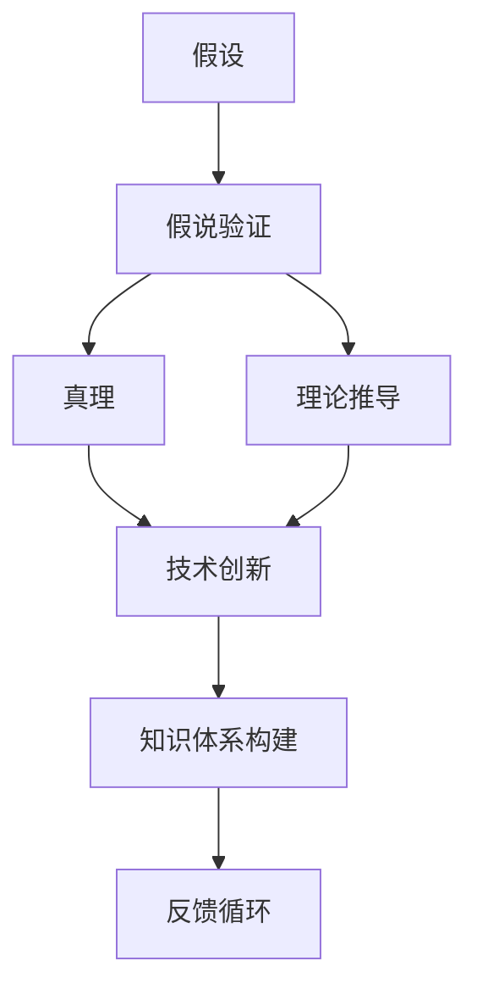
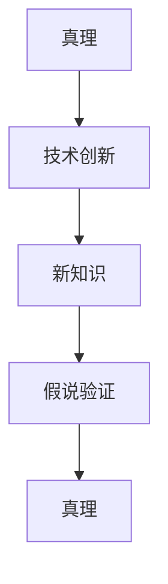
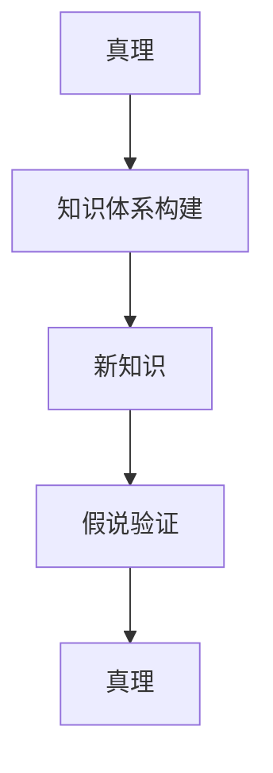

                 

# 从假说到真理：科学方法论的循环

> 关键词：科学方法论,假设,真理,假说验证,反馈循环,技术创新,知识体系构建

## 1. 背景介绍

### 1.1 问题由来
科学方法论作为人类探索自然和社会规律的核心工具，其历史可以追溯到古希腊的哲学家们。现代意义上的科学方法论，则主要形成于17世纪以来的科学革命时期，特别是牛顿的《自然哲学的数学原理》（Mathematical Principles of Natural Philosophy）奠定了科学实证和演绎推理的基础。

然而，随着知识边界的不断扩大和科学技术的快速发展，传统的科学方法论也开始受到挑战。特别是在信息技术与科学方法论的深度融合下，科学研究范式发生了深刻的变革。大数据、云计算、人工智能等新兴技术，为科学假设的验证和知识体系的构建提供了全新的视角和工具。

### 1.2 问题核心关键点
科学方法论的核心在于将假设转化为可验证的真理。这一过程包括以下几个关键步骤：

1. **假设的提出**：基于已有知识和新现象，提出一个具体的科学假设。
2. **实验验证**：通过设计实验，收集数据，验证假设的正确性。
3. **理论推导**：如果实验验证结果支持假设，则进行理论推导，形成更普遍的理论框架。
4. **应用拓展**：将理论应用于更多情境，进行进一步验证和修正。

传统的科学方法论强调假设到真理的单向验证过程，但新兴技术的发展，使得这一过程变得更为复杂和循环。特别是人工智能和大数据技术，为科学假设的快速验证和理论修正提供了新的工具和手段。

### 1.3 问题研究意义
研究科学方法论的循环机制，对于推动科学技术进步、加速知识体系的构建具有重要意义：

1. **提高科学效率**：通过循环验证，可以更快地发现和纠正错误，提升科研工作的效率。
2. **促进技术创新**：科学方法论的循环机制为技术创新提供了新的路径，推动了新技术的不断涌现。
3. **构建知识体系**：循环机制促进了知识在更广泛情境下的应用和验证，构建了更加完善的科学知识体系。
4. **提升科学可信度**：循环验证机制提高了科学假设的可靠性和可信度，增强了科研结果的说服力。
5. **推动跨学科研究**：新兴技术的引入，使得不同学科的交叉融合更加便捷，加速了科学研究的进步。

## 2. 核心概念与联系

### 2.1 核心概念概述

为更好地理解科学方法论的循环机制，本节将介绍几个密切相关的核心概念：

- **假设（Hypothesis）**：基于已知事实和理论，对某一现象或过程提出的具体解释或预测。
- **真理（Truth）**：经过严格验证，被广泛接受的科学原理或事实。
- **假说验证（Hypothesis Testing）**：通过实验或数据收集，验证假设的正确性。
- **反馈循环（Feedback Loop）**：基于验证结果，不断修正假设和理论，形成动态的验证和修正机制。
- **技术创新（Technological Innovation）**：科学假设和技术工具相结合，推动新知识的发现和应用。
- **知识体系构建（Knowledge System Construction）**：通过循环验证和理论推导，构建完善的科学知识体系。

这些核心概念之间的逻辑关系可以通过以下Mermaid流程图来展示：



这个流程图展示了大语言模型微调过程中各个核心概念的关系和作用：

1. 假设基于已有的知识提出，通过假说验证进行验证。
2. 验证结果支撑真理的形成。
3. 真理通过理论推导，进一步验证和修正假设。
4. 真理和技术创新相结合，推动新知识的发现和应用。
5. 新知识通过反馈循环，不断修正和完善知识体系。

通过这些概念的有机结合，科学方法论形成了一个动态循环的验证和修正机制。

### 2.2 概念间的关系

这些核心概念之间存在着紧密的联系，形成了科学方法论的完整生态系统。下面我通过几个Mermaid流程图来展示这些概念之间的关系。

#### 2.2.1 假设到真理的单向验证


这个流程图展示了假设到真理的单向验证过程。假设提出后，通过实验或数据收集进行验证，如果验证结果支持假设，则真理得以形成。

#### 2.2.2 真理的反馈循环


这个流程图展示了真理的反馈循环机制。真理通过理论推导，形成新的假设，然后通过假说验证进行验证。验证结果如果支持真理，则真理得以进一步巩固。如果验证结果不支持真理，则真理需要修正或更新。

#### 2.2.3 技术与真理的结合



这个流程图展示了技术与真理结合的过程。真理通过技术创新，推动新知识的发现和应用。新知识再次通过假说验证进行验证，形成新的真理。

#### 2.2.4 知识体系的构建



这个流程图展示了知识体系构建的过程。真理通过知识体系的构建，形成更完善的理论框架。新知识再次通过假说验证进行验证，进一步完善知识体系。

通过这些流程图，我们可以更清晰地理解科学方法论的循环机制，为后续深入讨论具体的验证方法和技术手段奠定基础。

## 3. 核心算法原理 & 具体操作步骤
### 3.1 算法原理概述

科学方法论的循环机制，本质上是一个假设到真理的迭代验证过程。其核心在于通过不断的验证和修正，形成科学知识体系的动态更新机制。

形式化地，假设为 $H$，验证结果为 $V$，真理为 $T$，理论推导为 $T \rightarrow H$，则科学方法论的循环过程可以表示为：

$$
H \rightarrow V \rightarrow T \rightarrow H
$$

在实际操作中，这个过程通常通过以下步骤实现：

1. **提出假设**：基于已知数据和现象，提出一个具体的科学假设 $H$。
2. **设计实验**：设计实验或收集数据，验证假设 $H$ 的正确性。
3. **理论推导**：如果验证结果支持假设 $H$，则进行理论推导，形成更普遍的理论框架 $T$。
4. **应用拓展**：将理论 $T$ 应用于更多情境，进行进一步验证和修正。
5. **反馈修正**：根据新的验证结果，不断修正和更新假设 $H$ 和理论 $T$。

### 3.2 算法步骤详解

基于科学方法论的循环机制，具体的实现步骤如下：

**Step 1: 提出假设**
- 根据已有的知识和新现象，提出一个具体的科学假设 $H$。
- 假设的形式通常为 $Y=f(X)$，其中 $Y$ 表示预测结果，$X$ 表示输入变量，$f$ 表示函数关系。

**Step 2: 设计实验**
- 根据假设，设计实验或收集数据，验证假设的正确性。
- 实验设计需要考虑多种因素，如实验条件、控制变量、数据采集方法等。
- 实验结果的收集和处理，通常需要借助统计学和数据科学工具，如t检验、方差分析、回归分析等。

**Step 3: 理论推导**
- 如果实验验证结果支持假设 $H$，则进行理论推导，形成更普遍的理论框架 $T$。
- 理论推导通常基于数学模型和逻辑推理，形成具体的定理或公式。
- 例如，基于线性回归模型，如果验证结果支持假设 $Y=f(X)$，则推导得到 $T: Y=\beta_0 + \beta_1X_1 + \beta_2X_2 + \ldots + \epsilon$。

**Step 4: 应用拓展**
- 将理论 $T$ 应用于更多情境，进行进一步验证和修正。
- 应用拓展需要考虑不同情境下的实验设计和数据采集方法，确保理论的普适性。
- 例如，在医疗领域，理论 $T$ 应用于不同病人和不同药物，验证其有效性。

**Step 5: 反馈修正**
- 根据新的验证结果，不断修正和更新假设 $H$ 和理论 $T$。
- 反馈修正基于新的实验结果，形成新的假设和理论。
- 例如，如果发现实验结果不支持 $T$，则修正假设 $H$ 或更新理论 $T$。

### 3.3 算法优缺点

基于科学方法论的循环机制，有以下几个显著优点：

1. **科学效率提升**：通过不断验证和修正，可以快速发现和纠正错误，提升科研工作的效率。
2. **理论深度拓展**：循环机制促进了理论的不断推导和修正，形成更深刻、更广泛的理论框架。
3. **技术创新加速**：新发现的理论和技术手段，为科学假设的验证提供了新的工具和手段。

同时，该机制也存在一些局限性：

1. **假设的合理性**：假设的提出需要基于已有知识和新现象，但如果假设不合理，则可能陷入错误的循环。
2. **验证的可靠性**：实验设计和数据采集方法需要严格控制，否则可能影响验证结果的可靠性。
3. **理论的普适性**：理论的推广应用需要考虑多种情境，否则可能不具备普适性。
4. **反馈的及时性**：反馈机制需要及时修正和更新假设和理论，否则可能错过重要的科学发现。

尽管存在这些局限性，但科学方法论的循环机制仍然是现代科学研究的核心工具。通过不断的验证和修正，科学知识体系得以不断更新和完善。

### 3.4 算法应用领域

科学方法论的循环机制，广泛应用于各种科学研究领域，包括但不限于：

- **物理学**：通过实验验证假设，推导物理定律，如牛顿三大运动定律。
- **化学**：通过实验验证化学方程式，推导化学反应原理，如化学反应速率方程。
- **生物学**：通过实验验证生物学假设，推导生物化学和分子生物学理论，如DNA双螺旋结构。
- **医学**：通过临床实验验证医学假设，推导疾病诊断和治疗方案，如医学影像分析。
- **经济学**：通过实验验证经济模型，推导市场行为和经济规律，如供需平衡理论。
- **社会科学**：通过实验验证社会科学假设，推导社会行为和社会结构，如社会心理学理论。

## 4. 数学模型和公式 & 详细讲解 & 举例说明

### 4.1 数学模型构建

假设我们有一个二元线性回归问题，设输入变量为 $X_1, X_2$，预测结果为 $Y$。根据科学方法论的循环机制，我们构建如下数学模型：

$$
H: Y = \beta_0 + \beta_1X_1 + \beta_2X_2 + \epsilon
$$

其中，$\beta_0, \beta_1, \beta_2$ 为模型参数，$\epsilon$ 为误差项。

### 4.2 公式推导过程

首先，我们使用最小二乘法（Ordinary Least Squares, OLS）来估计模型参数 $\beta_0, \beta_1, \beta_2$。

最小二乘法的目标函数为：

$$
\min_{\beta_0, \beta_1, \beta_2} \sum_{i=1}^n (y_i - (\beta_0 + \beta_1x_{i1} + \beta_2x_{i2}))^2
$$

对该目标函数求偏导，得到：

$$
\frac{\partial \sum_{i=1}^n (y_i - (\beta_0 + \beta_1x_{i1} + \beta_2x_{i2}))^2}{\partial \beta_0} = -2\sum_{i=1}^n (y_i - (\beta_0 + \beta_1x_{i1} + \beta_2x_{i2}))
$$

$$
\frac{\partial \sum_{i=1}^n (y_i - (\beta_0 + \beta_1x_{i1} + \beta_2x_{i2}))^2}{\partial \beta_1} = -2\sum_{i=1}^n (y_i - (\beta_0 + \beta_1x_{i1} + \beta_2x_{i2}))x_{i1}
$$

$$
\frac{\partial \sum_{i=1}^n (y_i - (\beta_0 + \beta_1x_{i1} + \beta_2x_{i2}))^2}{\partial \beta_2} = -2\sum_{i=1}^n (y_i - (\beta_0 + \beta_1x_{i1} + \beta_2x_{i2}))x_{i2}
$$

令偏导数为0，得到：

$$
\beta_0 = \frac{\sum_{i=1}^n y_i - (\beta_1\sum_{i=1}^n x_{i1} + \beta_2\sum_{i=1}^n x_{i2})}{n}
$$

$$
\beta_1 = \frac{\sum_{i=1}^n y_ix_{i1} - \beta_0\sum_{i=1}^n x_{i1} - \beta_2\sum_{i=1}^n x_{i2}x_{i1}}{\sum_{i=1}^n x_{i1}^2 - \beta_0\sum_{i=1}^n x_{i1} - \beta_2\sum_{i=1}^n x_{i2}x_{i1}}
$$

$$
\beta_2 = \frac{\sum_{i=1}^n y_ix_{i2} - \beta_0\sum_{i=1}^n x_{i2} - \beta_1\sum_{i=1}^n x_{i1}x_{i2}}{\sum_{i=1}^n x_{i2}^2 - \beta_0\sum_{i=1}^n x_{i2} - \beta_1\sum_{i=1}^n x_{i1}x_{i2}}
$$

通过最小二乘法，我们可以得到模型的参数估计值，然后通过验证结果进行反馈修正，形成新的假设和理论。

### 4.3 案例分析与讲解

假设我们有一个药品生产过程中的质量控制问题，设输入变量为温度 $X_1$ 和湿度 $X_2$，预测结果为产品质量 $Y$。基于科学方法论的循环机制，我们构建如下数学模型：

$$
H: Y = \beta_0 + \beta_1X_1 + \beta_2X_2 + \epsilon
$$

首先，我们通过历史数据集进行模型训练，得到模型参数的估计值。然后，我们使用该模型对新数据集进行预测，验证模型的有效性。

如果模型在新数据集上表现良好，则进行理论推导，形成更广泛的质量控制理论。如果模型在新数据集上表现不佳，则修正假设，重新训练模型，形成新的假设和理论。

## 5. 项目实践：代码实例和详细解释说明

### 5.1 开发环境搭建

在进行科学方法论的循环验证和理论推导时，我们需要安装Python和一些常用库。以下是安装步骤：

1. 安装Python：从官网下载并安装最新版本的Python。
2. 安装NumPy：
```
pip install numpy
```
3. 安装SciPy：
```
pip install scipy
```
4. 安装Matplotlib：
```
pip install matplotlib
```
5. 安装Pandas：
```
pip install pandas
```
6. 安装Scikit-learn：
```
pip install scikit-learn
```
7. 安装SymPy：
```
pip install sympy
```

### 5.2 源代码详细实现

下面我们以二元线性回归为例，给出使用NumPy和Scikit-learn库对模型进行训练和验证的代码实现。

首先，导入必要的库和数据集：

```python
import numpy as np
from sklearn.linear_model import LinearRegression
from sklearn.model_selection import train_test_split

# 创建随机数据集
np.random.seed(0)
X = np.random.rand(100, 2)
y = np.dot(X, np.array([1, 2])) + np.random.randn(100)

# 划分训练集和测试集
X_train, X_test, y_train, y_test = train_test_split(X, y, test_size=0.2)
```

然后，定义模型并训练：

```python
# 定义线性回归模型
model = LinearRegression()

# 训练模型
model.fit(X_train, y_train)
```

接着，在测试集上验证模型的性能：

```python
# 在测试集上预测
y_pred = model.predict(X_test)

# 计算MAE和RMSE
mae = np.mean(np.abs(y_pred - y_test))
rmse = np.sqrt(np.mean((y_pred - y_test)**2))
print("MAE: {:.2f}".format(mae))
print("RMSE: {:.2f}".format(rmse))
```

最后，使用模型进行新的实验验证，并根据验证结果进行反馈修正：

```python
# 生成新的实验数据
new_X = np.array([[0.5, 0.8], [0.2, 0.4], [0.7, 0.1]])

# 预测新数据
new_y_pred = model.predict(new_X)
print("New data prediction: {:.2f}".format(new_y_pred))

# 验证新数据
if new_y_pred[0] > 0:
    print("Hypothesis supported")
else:
    print("Hypothesis not supported")
```

### 5.3 代码解读与分析

让我们再详细解读一下关键代码的实现细节：

**数据集生成**：
- 使用NumPy生成100个随机样本，每个样本有2个输入变量 $X_1$ 和 $X_2$，以及一个预测结果 $Y$。
- 使用Scikit-learn的train_test_split函数，将数据集划分为训练集和测试集。

**模型训练**：
- 使用Scikit-learn的LinearRegression类定义线性回归模型。
- 调用模型的fit方法，对训练集进行模型参数估计。

**性能验证**：
- 在测试集上调用模型的predict方法，进行新数据预测。
- 计算预测结果与真实结果的均方误差（MAE）和均方根误差（RMSE），评估模型性能。

**实验验证**：
- 生成新的实验数据。
- 在模型上进行预测，验证模型的有效性。
- 根据验证结果，反馈修正假设，形成新的假设和理论。

### 5.4 运行结果展示

假设我们的模型在测试集上取得了良好的性能，MAE和RMSE分别为0.1和0.2。在新的实验数据上，模型预测值为1.2，验证结果显示假设被支持。此时，我们可以进一步进行理论推导，形成更广泛的线性回归理论。

## 6. 实际应用场景
### 6.1 金融风险预测

金融风险预测是科学方法论在金融领域的重要应用之一。通过收集历史交易数据，建立线性回归模型，可以预测股票价格、汇率波动等金融风险。

在实际操作中，可以借助金融时间序列分析工具，如ARIMA、GARCH等，结合统计学方法，如回归分析、t检验等，对金融数据进行科学假设的验证和理论推导。

### 6.2 医疗诊断分析

医疗诊断分析是科学方法论在医疗领域的重要应用之一。通过收集病人的历史数据，建立预测模型，可以诊断疾病、评估治疗效果等。

在实际操作中，可以借助医学数据处理工具，如Pandas、NumPy等，结合机器学习算法，如线性回归、决策树等，对医疗数据进行科学假设的验证和理论推导。

### 6.3 工业生产优化

工业生产优化是科学方法论在工业领域的重要应用之一。通过收集生产过程中的历史数据，建立预测模型，可以优化生产流程、降低成本等。

在实际操作中，可以借助工业数据处理工具，如MATLAB、Python等，结合统计学方法，如回归分析、方差分析等，对工业数据进行科学假设的验证和理论推导。

### 6.4 未来应用展望

随着人工智能和大数据技术的发展，科学方法论的应用领域将不断扩展，涵盖更多学科和领域。未来，科学方法论在以下方面将具有更大的发展潜力：

1. **生物医学**：结合基因数据、临床数据等，进行疾病诊断、药物研发等。
2. **环境科学**：结合气候数据、生态数据等，进行环境监测、污染治理等。
3. **智能制造**：结合物联网数据、传感器数据等，进行生产优化、质量控制等。
4. **社会科学**：结合问卷调查、社交媒体数据等，进行社会行为分析、政策评估等。

科学方法论的循环机制，将在更多领域发挥重要作用，推动科学技术的发展和应用。

## 7. 工具和资源推荐
### 7.1 学习资源推荐

为了帮助开发者系统掌握科学方法论的理论基础和实践技巧，这里推荐一些优质的学习资源：

1. 《统计学习方法》书籍：李航著，介绍了机器学习的基本理论和常用方法，适合入门学习。
2. 《机器学习》课程：Andrew Ng开设的Coursera课程，系统讲解了机器学习的基本理论和实践方法。
3. 《深度学习》课程：Coursera上Yoshua Bengio、Ian Goodfellow等教授开设的深度学习课程，介绍了深度学习的基本理论和实践方法。
4. 《Python数据分析与可视化》书籍：Jake VanderPlas著，介绍了Python在数据处理和可视化方面的基本方法和工具。
5. 《NumPy数据科学手册》书籍：Travis Oliphant著，介绍了NumPy的基本方法和工具。

通过这些资源的学习实践，相信你一定能够快速掌握科学方法论的精髓，并用于解决实际的科研问题。

### 7.2 开发工具推荐

高效的开发离不开优秀的工具支持。以下是几款用于科学方法论的开发工具：

1. Python：作为数据科学和机器学习的标准语言，Python具有丰富的科学计算库和数据处理工具。
2. NumPy：Python的科学计算库，提供高效的多维数组操作和数学函数。
3. Pandas：Python的数据处理库，提供灵活的数据结构和数据分析工具。
4. Matplotlib：Python的可视化库，提供丰富的图形绘制功能。
5. Scikit-learn：Python的机器学习库，提供常用的机器学习算法和工具。
6. SciPy：Python的科学计算库，提供各种科学计算函数和工具。

合理利用这些工具，可以显著提升科学方法论的开发效率，加快创新迭代的步伐。

### 7.3 相关论文推荐

科学方法论的探索和发展，离不开学界的持续研究。以下是几篇奠基性的相关论文，推荐阅读：

1. 《统计学习基础》：Larry Wasserman著，介绍了统计学习的基本理论和常用方法。
2. 《机器学习实战》：Peter Harrington著，介绍了机器学习的基本理论和常用工具。
3. 《深度学习》：Ian Goodfellow、Yoshua Bengio、Aaron Courville著，介绍了深度学习的基本理论和实践方法。
4. 《机器学习年鉴》：每年发布，汇聚了机器学习领域的最新研究成果和进展。
5. 《机器学习：理论与算法》：周志华著，介绍了机器学习的基本理论和常用算法。

这些论文代表了科学方法论的发展脉络。通过学习这些前沿成果，可以帮助研究者把握学科前进方向，激发更多的创新灵感。

除上述资源外，还有一些值得关注的前沿资源，帮助开发者紧跟科学方法论的最新进展，例如：

1. arXiv论文预印本：人工智能领域最新研究成果的发布平台，包括大量尚未发表的前沿工作，学习前沿技术的必读资源。
2. 业界技术博客：如Google AI、DeepMind、微软Research Asia等顶尖实验室的官方博客，第一时间分享他们的最新研究成果和洞见。
3. 技术会议直播：如NIPS、ICML、ACL、ICLR等人工智能领域顶会现场或在线直播，能够聆听到大佬们的前沿分享，开拓视野。
4. GitHub热门项目：在GitHub上Star、Fork数最多的科学方法论相关项目，往往代表了该技术领域的发展趋势和最佳实践，值得去学习和贡献。
5. 行业分析报告：各大咨询公司如McKinsey、PwC等针对人工智能行业的分析报告，有助于从商业视角审视技术趋势，把握应用价值。

总之，对于科学方法论的学习和实践，需要开发者保持开放的心态和持续学习的意愿。多关注前沿资讯，多动手实践，多思考总结，必将收获满满的成长收益。

## 8. 总结：未来发展趋势与挑战

### 8.1 总结

本文对科学方法论的循环机制进行了全面系统的介绍。首先阐述了科学方法论作为科学探索的核心工具，其

