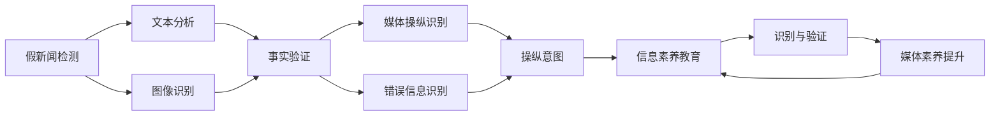
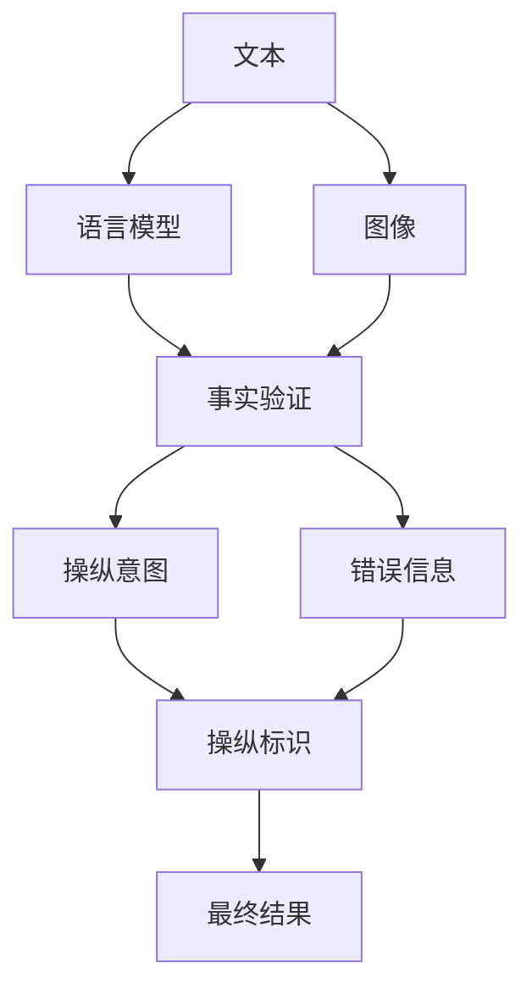
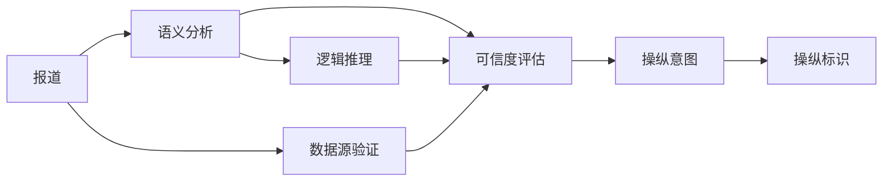
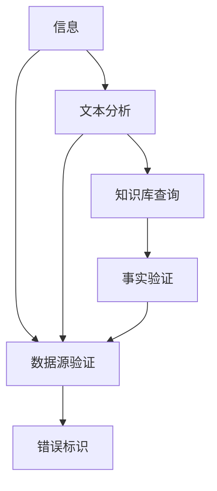
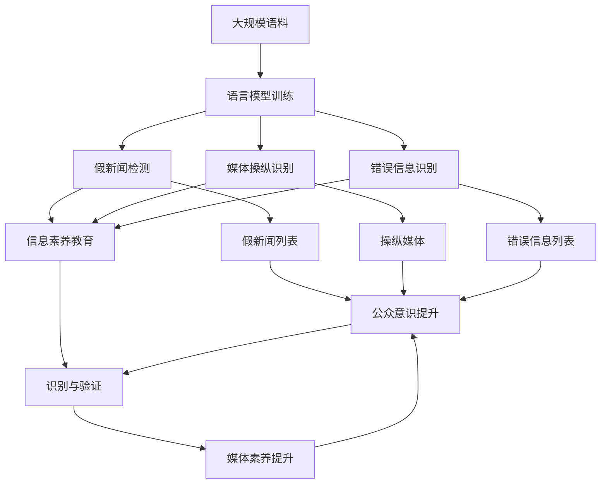
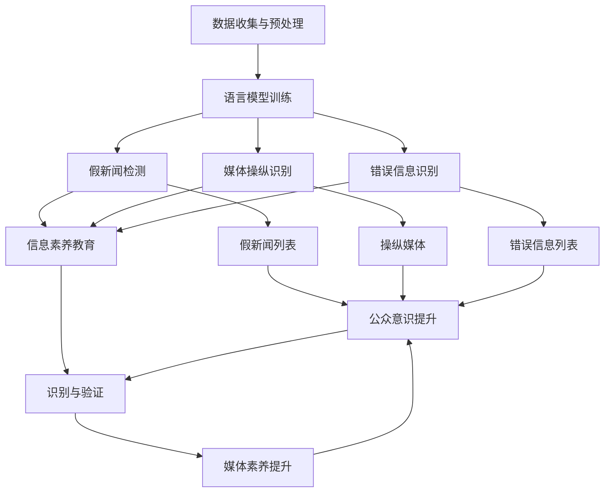

                 

# 信息验证和媒体素养能力：为假新闻、媒体操纵和错误信息做好准备

## 1. 背景介绍

### 1.1 问题由来
随着信息技术的迅猛发展，互联网已成为信息传播的重要渠道。然而，互联网的开放性也带来了信息泛滥、假新闻泛滥、媒体操纵等诸多问题。虚假信息的快速传播不仅破坏了信息生态，还对社会稳定和公民认知产生深远影响。

近年来，针对互联网信息环境治理，各国纷纷出台法律法规，开展打击假新闻、识别错误信息的行动，但收效并不理想。问题的根源在于，当前的技术手段还无法有效识别和过滤信息中的错误、虚假和误导性内容。

### 1.2 问题核心关键点
1. **假新闻**：指故意制造并传播的虚假新闻，其目的是误导受众、混淆视听，甚至影响社会稳定。
2. **媒体操纵**：指媒体通过选择性报道、刻意歪曲事实等手段，操纵受众情绪和认知，以实现其特定的利益诉求。
3. **错误信息**：指未经证实的、有误导性的信息，其传播可能基于无意、疏忽或误解。
4. **信息素养**：指个体获取、评估、分析和利用信息的能力，是抵御虚假信息的重要手段。
5. **机器学习与自然语言处理**：通过机器学习技术和大规模语料，自然语言处理(NLP)可以为识别和验证信息提供有力支持。

这些概念的交织构成了当前信息环境治理的主要挑战，也孕育着新的解决方案和研究机遇。

## 2. 核心概念与联系

### 2.1 核心概念概述

为更好地理解信息验证和媒体素养能力，本节将介绍几个密切相关的核心概念：

- **假新闻检测**：识别并确认虚假新闻内容的过程。主要通过文本分析、图像识别等技术手段进行。
- **媒体操纵识别**：检测媒体报道中是否存在选择性报道、故意歪曲事实等行为，以确定其是否存在操纵意图。
- **错误信息识别**：识别信息中是否存在错误、误导性内容，包括事实错误、逻辑错误等。
- **信息素养教育**：提升公众的信息获取、评估和利用能力，增强对假新闻、媒体操纵和错误信息的辨识能力。
- **机器学习与自然语言处理**：通过机器学习模型和大规模语料库，从文本中挖掘和验证信息，为信息素养教育提供技术支持。

这些概念之间的逻辑关系可以通过以下Mermaid流程图来展示：



这个流程图展示了大规模信息验证和媒体素养能力提升的整体架构：

1. 假新闻检测通过文本分析和图像识别，初步判断新闻内容是否真实。
2. 媒体操纵识别则通过事实验证，进一步确认媒体报道是否存在操纵意图。
3. 错误信息识别则关注信息中是否存在错误和误导性内容。
4. 信息素养教育则通过提升公众的信息获取、评估和利用能力，增强对假新闻、媒体操纵和错误信息的辨识能力。
5. 机器学习与自然语言处理技术在整个流程中提供了关键支持。

### 2.2 概念间的关系

这些核心概念之间存在着紧密的联系，形成了信息验证和媒体素养能力提升的完整生态系统。下面我们通过几个Mermaid流程图来展示这些概念之间的关系。

#### 2.2.1 假新闻检测流程



这个流程图展示了假新闻检测的基本流程：

1. 从文本和图像中提取信息。
2. 使用语言模型对文本进行分析，判断其是否与已知事实相符。
3. 如果存在操纵意图，则识别并标记。
4. 识别错误信息，确认其是否误导性。
5. 结合以上结果，综合判定是否为假新闻。

#### 2.2.2 媒体操纵识别流程



这个流程图展示了媒体操纵识别的基本流程：

1. 对媒体报道进行语义分析，挖掘其核心逻辑。
2. 通过逻辑推理，判断是否存在选择性报道、故意歪曲事实等行为。
3. 验证数据源的真实性。
4. 综合可信度评估，确认是否存在操纵意图。
5. 标记操纵标识，供后续决策使用。

#### 2.2.3 错误信息识别流程



这个流程图展示了错误信息识别的基本流程：

1. 对信息进行文本分析，提取核心内容。
2. 查询知识库，判断信息是否与已知事实相符。
3. 验证数据源的真实性。
4. 结合以上结果，综合判定信息是否存在错误。
5. 标记错误标识，供后续决策使用。

### 2.3 核心概念的整体架构

最后，我们用一个综合的流程图来展示这些核心概念在大规模信息验证和媒体素养能力提升中的整体架构：



这个综合流程图展示了从大规模语料训练到公众信息素养提升的完整过程：

1. 通过大规模语料训练语言模型，提取关键信息。
2. 语言模型用于假新闻检测、媒体操纵识别和错误信息识别。
3. 根据检测和识别结果，生成假新闻、操纵媒体和错误信息列表。
4. 信息素养教育结合以上结果，提升公众的信息识别能力。
5. 最终通过识别与验证，持续提升媒体素养，形成良性循环。

## 3. 核心算法原理 & 具体操作步骤
### 3.1 算法原理概述

大规模信息验证和媒体素养能力提升的核心算法主要基于机器学习和自然语言处理技术，通过以下几步完成：

1. **数据收集与预处理**：收集并整理大规模的语料库，包括文本、图像等，进行文本清洗和标准化处理。
2. **语言模型训练**：使用大规模语料训练语言模型，提取语义和事实信息。
3. **假新闻检测**：使用语言模型对文本进行分析，识别是否存在虚假信息。
4. **媒体操纵识别**：通过语义分析和逻辑推理，判断媒体报道是否存在操纵意图。
5. **错误信息识别**：通过知识库查询和事实验证，判断信息是否存在错误。
6. **信息素养教育**：通过教育提升公众对假新闻、媒体操纵和错误信息的辨识能力。
7. **反馈与迭代**：通过公众反馈，持续优化算法和模型。

这些步骤构成了大规模信息验证和媒体素养能力提升的完整流程，如图示：



### 3.2 算法步骤详解

以下将详细介绍大规模信息验证和媒体素养能力提升的具体算法步骤：

**Step 1: 数据收集与预处理**

1. **数据收集**：收集公开可用的大规模语料库，包括新闻报道、社交媒体、网络论坛等文本数据，以及相关图像、视频等非文本数据。
2. **数据清洗**：去除无关数据，标准化文本格式，如统一编码、去除停用词等。
3. **数据分割**：将数据划分为训练集、验证集和测试集，确保模型在不同数据集上均能稳定表现。

**Step 2: 语言模型训练**

1. **模型选择**：选择适当的语言模型，如BERT、GPT等预训练模型，或基于Transformer的模型。
2. **模型训练**：在大规模语料库上训练语言模型，提取语义和事实信息。
3. **模型评估**：使用验证集评估模型性能，调整超参数。

**Step 3: 假新闻检测**

1. **文本分析**：将待检测文本输入语言模型，提取关键信息。
2. **事实验证**：通过知识库查询或逻辑推理，验证文本是否与已知事实相符。
3. **结果判定**：根据验证结果，判断文本是否为假新闻。

**Step 4: 媒体操纵识别**

1. **语义分析**：对媒体报道进行语义分析，挖掘其核心逻辑。
2. **逻辑推理**：通过逻辑推理，判断是否存在选择性报道、故意歪曲事实等行为。
3. **数据源验证**：验证报道中的数据源是否真实可信。
4. **操纵意图判断**：综合语义分析、逻辑推理和数据源验证结果，判断是否存在操纵意图。

**Step 5: 错误信息识别**

1. **文本分析**：对信息进行文本分析，提取关键内容。
2. **知识库查询**：通过知识库查询，判断信息是否与已知事实相符。
3. **数据源验证**：验证信息源的真实性。
4. **错误识别**：结合文本分析和知识库查询结果，综合判定信息是否存在错误。

**Step 6: 信息素养教育**

1. **教育内容设计**：根据假新闻检测、媒体操纵识别和错误信息识别结果，设计教育内容。
2. **教育形式选择**：选择适当的教育形式，如在线课程、互动游戏、模拟实验等。
3. **教育实施与评估**：实施教育并评估效果，根据反馈调整教育内容和方法。

**Step 7: 反馈与迭代**

1. **公众反馈收集**：收集公众对检测和识别的反馈意见。
2. **模型优化**：根据反馈优化语言模型和相关算法。
3. **持续改进**：持续迭代，提升模型和算法的准确性和效率。

### 3.3 算法优缺点

大规模信息验证和媒体素养能力提升的算法具有以下优点：

1. **自动化与高效性**：通过自动化技术，大规模验证和识别过程效率高，能够处理海量信息。
2. **全面性与准确性**：结合文本分析、知识库查询和逻辑推理，提高了验证和识别的全面性和准确性。
3. **可扩展性与灵活性**：适用于各种文本和图像数据，易于扩展和定制化。

同时，该算法也存在以下缺点：

1. **数据依赖性**：算法效果依赖于高质量的语料库和知识库，获取和维护这些资源需要较高成本。
2. **过拟合风险**：在数据集较小的条件下，模型可能出现过拟合，降低泛化能力。
3. **伦理与安全风险**：算法可能对某些敏感信息过度敏感，产生误判。

### 3.4 算法应用领域

基于机器学习和自然语言处理的信息验证和媒体素养能力提升算法，已经在多个领域得到应用，包括：

- **新闻媒体**：用于识别和验证假新闻、媒体操纵和错误信息，提升新闻质量。
- **社交媒体**：用于识别和处理虚假信息，保护用户免受误导。
- **教育培训**：用于教育公众识别假新闻和媒体操纵，提升信息素养。
- **公共安全**：用于监测和识别恶意信息，防止社会恐慌。
- **法律与司法**：用于甄别虚假证据和误导性报道，保障司法公正。

除了上述这些领域外，信息验证和媒体素养能力提升算法还在更多领域得到应用，为信息时代的决策、沟通和治理提供有力支持。

## 4. 数学模型和公式 & 详细讲解 & 举例说明

### 4.1 数学模型构建

在信息验证和媒体素养能力提升中，主要使用自然语言处理技术和大规模语料库。以下是一个简单的数学模型构建示例：

设 $D$ 为语料库，$N$ 为语料中单词的总数，$V$ 为单词的词汇表。假设我们要构建一个简单的文本分类模型，将其分为正面和负面两类，使用二元交叉熵损失函数：

$$
\ell(y, \hat{y}) = -(y\log \hat{y} + (1-y)\log (1-\hat{y}))
$$

其中，$y$ 为真实标签，$\hat{y}$ 为模型预测的概率。

### 4.2 公式推导过程

以二元交叉熵损失函数为例，推导其导数计算过程。假设 $y=1$，则：

$$
\ell(1, \hat{y}) = -\log \hat{y}
$$

对其求导，得到：

$$
\frac{\partial \ell(1, \hat{y})}{\partial \hat{y}} = -\frac{1}{\hat{y}}
$$

同理，当 $y=0$ 时，其导数为：

$$
\frac{\partial \ell(0, \hat{y})}{\partial \hat{y}} = -\frac{1}{1-\hat{y}}
$$

### 4.3 案例分析与讲解

假设我们有一个包含正面和负面评论的语料库，其样本如下：

```
正面评论："这款产品真的很棒，超出了我的预期！"
负面评论："服务很糟糕，我不满意。"
```

使用上述二元交叉熵损失函数，我们可以计算出模型对这两条评论的预测概率，并进行优化：

$$
\ell(1, \hat{y}) = -\log \hat{y}^1 - \log (1-\hat{y}^2)
$$

通过优化模型参数，使其对正面评论的预测概率 $\hat{y}^1$ 最大化，对负面评论的预测概率 $\hat{y}^2$ 最小化，从而提升模型的分类准确率。

## 5. 项目实践：代码实例和详细解释说明

### 5.1 开发环境搭建

在进行信息验证和媒体素养能力提升的实践前，我们需要准备好开发环境。以下是使用Python进行PyTorch开发的详细步骤：

1. 安装Anaconda：从官网下载并安装Anaconda，用于创建独立的Python环境。
```bash
conda create -n pytorch-env python=3.8 
conda activate pytorch-env
```

2. 安装PyTorch：根据CUDA版本，从官网获取对应的安装命令。例如：
```bash
conda install pytorch torchvision torchaudio cudatoolkit=11.1 -c pytorch -c conda-forge
```

3. 安装Transformer库：
```bash
pip install transformers
```

4. 安装各类工具包：
```bash
pip install numpy pandas scikit-learn matplotlib tqdm jupyter notebook ipython
```

完成上述步骤后，即可在`pytorch-env`环境中开始项目实践。

### 5.2 源代码详细实现

以下是一个简单的Python代码示例，用于训练一个基于BERT的语言模型，并进行假新闻检测：

```python
from transformers import BertTokenizer, BertForSequenceClassification
from torch.utils.data import Dataset, DataLoader
from torch.optim import AdamW
from torch.nn import CrossEntropyLoss
from tqdm import tqdm
import torch

class NewsDataset(Dataset):
    def __init__(self, texts, labels):
        self.texts = texts
        self.labels = labels
        self.tokenizer = BertTokenizer.from_pretrained('bert-base-uncased')
    
    def __len__(self):
        return len(self.texts)
    
    def __getitem__(self, item):
        text = self.texts[item]
        label = self.labels[item]
        encoding = self.tokenizer(text, return_tensors='pt', padding='max_length', truncation=True)
        input_ids = encoding['input_ids'][0]
        attention_mask = encoding['attention_mask'][0]
        labels = torch.tensor([label], dtype=torch.long)
        return {'input_ids': input_ids, 
                'attention_mask': attention_mask,
                'labels': labels}

# 加载数据集
train_dataset = NewsDataset(train_texts, train_labels)
val_dataset = NewsDataset(val_texts, val_labels)
test_dataset = NewsDataset(test_texts, test_labels)

# 定义模型和优化器
model = BertForSequenceClassification.from_pretrained('bert-base-uncased', num_labels=2)
optimizer = AdamW(model.parameters(), lr=2e-5)
loss_fn = CrossEntropyLoss()

# 训练模型
device = torch.device('cuda' if torch.cuda.is_available() else 'cpu')
model.to(device)

for epoch in range(5):
    model.train()
    train_loss = 0
    for batch in tqdm(train_dataset, desc='Training'):
        input_ids = batch['input_ids'].to(device)
        attention_mask = batch['attention_mask'].to(device)
        labels = batch['labels'].to(device)
        optimizer.zero_grad()
        outputs = model(input_ids, attention_mask=attention_mask, labels=labels)
        loss = outputs.loss
        train_loss += loss.item()
        loss.backward()
        optimizer.step()
    
    model.eval()
    val_loss = 0
    for batch in tqdm(val_dataset, desc='Evaluating'):
        with torch.no_grad():
            input_ids = batch['input_ids'].to(device)
            attention_mask = batch['attention_mask'].to(device)
            labels = batch['labels'].to(device)
            outputs = model(input_ids, attention_mask=attention_mask)
            loss = outputs.loss
            val_loss += loss.item()
    
    print(f"Epoch {epoch+1}, train loss: {train_loss/len(train_dataset):.4f}, val loss: {val_loss/len(val_dataset):.4f}")

# 假新闻检测
model.eval()
def check_news(text):
    with torch.no_grad():
        encoding = tokenizer(text, return_tensors='pt', padding='max_length', truncation=True)
        input_ids = encoding['input_ids'][0]
        attention_mask = encoding['attention_mask'][0]
        outputs = model(input_ids, attention_mask=attention_mask)
        probs = outputs.logits.softmax(dim=1)
        return probs.argmax().item()

# 使用模型检测假新闻
texts = ["这款产品真的很棒，超出了我的预期！", "服务很糟糕，我不满意。"]
labels = [0, 1] # 假新闻为1，真新闻为0
for i in range(len(texts)):
    probs = check_news(texts[i])
    if probs == labels[i]:
        print(f"新闻{i+1}检测结果正确。")
    else:
        print(f"新闻{i+1}检测结果错误。")
```

在这个示例中，我们使用BERT模型进行假新闻检测。首先，我们定义了一个`NewsDataset`类，用于处理文本和标签数据。然后，我们加载了训练集、验证集和测试集，定义了模型、优化器和损失函数，并在GPU上训练了模型。最后，我们使用模型检测了两条新闻的真假，得到了检测结果。

### 5.3 代码解读与分析

让我们再详细解读一下关键代码的实现细节：

**NewsDataset类**：
- `__init__`方法：初始化文本、标签和分词器。
- `__len__`方法：返回数据集的样本数量。
- `__getitem__`方法：对单个样本进行处理，将文本输入编码为token ids，将标签编码为数字，并进行定长padding。

**check_news函数**：
- 将待检测文本输入分词器，转换为token ids和注意力掩码。
- 将输入和掩码输入模型，得到预测概率。
- 将概率最大化的标签作为预测结果返回。

**训练过程**：
- 在每个epoch内，对训练集进行前向传播和反向传播，计算损失并更新模型参数。
- 在每个epoch结束后，在验证集上评估模型性能。
- 根据验证集上的损失，调整模型参数。

通过这个示例，我们可以看到，基于BERT模型的信息验证和媒体素养能力提升项目的实现相对简单，但通过分词器、模型和训练框架的组合，可以实现对假新闻的自动化检测。

## 6. 实际应用场景

### 6.1 智能媒体平台

在智能媒体平台上，信息验证和媒体素养能力提升技术可以用于自动化检测假新闻、媒体操纵和错误信息，提升内容质量。平台可以定期检查热门内容，及时发现和删除虚假信息，保护用户免受误导。

### 6.2 教育机构

在教育机构中，信息素养教育可以通过课程、实验和游戏等形式，提升学生的信息获取、评估和利用能力。通过识别假新闻、媒体操纵和错误信息，增强学生的批判性思维和判断力。

### 6.3 企业信息管理

在企业信息管理中，信息验证和媒体素养能力提升技术可以用于识别和过滤虚假信息和错误数据，确保决策依据的可靠性。通过持续教育和监控，提升员工的信息素养，保障企业信息安全和透明。

### 6.4 公共安全

在公共安全领域，信息验证和媒体素养能力提升技术可以用于监测和识别恶意信息，防止虚假信息扩散，维护社会稳定。例如，在疫情期间，通过验证和识别假新闻和错误信息，可以防止谣言传播，减少公众恐慌。

### 6.5 法律与司法

在法律与司法中，信息验证和媒体素养能力提升技术可以用于甄别虚假证据和误导性报道，保障司法公正。例如，在审判过程中，通过验证证词的真实性，确保司法程序的公平和透明。

## 7. 工具和资源推荐

### 7.1 学习资源推荐

为帮助开发者掌握信息验证和媒体素养能力提升的理论基础和实践技巧，这里推荐一些优质的学习资源：

1. 《深度学习与自然语言处理》课程：斯坦福大学开设的NLP明星课程，涵盖NLP的基本概念和前沿模型。
2. 《Natural Language Processing with PyTorch》书籍：深度学习框架PyTorch的官方NLP教程，详细介绍了如何使用PyTorch进行NLP任务开发。
3. 《信息检索与自然语言处理》教材：详细介绍了信息检索和自然语言处理的基础知识和应用技术，是学习信息验证和媒体素养能力的理论基础。
4. HuggingFace官方文档：Transformer库的官方文档，提供了大量预训练语言模型的样例代码和详细解释，是进行信息验证和媒体素养能力提升的必备资源。
5. Coursera上的NLP课程：包括多门涉及NLP基础和前沿应用的课程，适合深度学习和信息素养教育的初学者。

通过对这些资源的学习实践，相信你一定能够掌握信息验证和媒体素养能力提升的核心技术，并应用于实际项目中。

### 7.2 开发工具推荐

高效的信息验证和媒体素养能力提升开发离不开优秀的工具支持。以下是几款用于开发的关键工具：

1. PyTorch：基于Python的开源深度学习框架，灵活动态的计算图，适合快速迭代研究。大部分预训练语言模型都有PyTorch版本的实现。
2. TensorFlow：由Google主导开发的开源深度学习框架，生产部署方便，适合大规模工程应用。同样有丰富的预训练语言模型资源。
3. Transformers库：HuggingFace开发的NLP工具库，集成了众多SOTA语言模型，支持PyTorch和TensorFlow，是进行信息验证和媒体素养能力提升开发的利器。
4. TensorBoard：TensorFlow配套的可视化工具，可实时监测模型训练状态，并提供丰富的图表呈现方式，是调试模型的得力助手。
5. Weights & Biases：模型训练的实验跟踪工具，可以记录和可视化模型训练过程中的各项指标，方便对比和调优。

### 7.3 相关论文推荐

信息验证和媒体素养能力提升的研究源于学界的持续研究。以下是几篇奠基性的相关论文，推荐阅读：

1. Attention is All You Need：提出了Transformer结构，开启了NLP领域的预训练大模型时代。
2. BERT: Pre-training of Deep Bidirectional Transformers for Language Understanding：提出BERT模型，引入基于掩码的自监督预训练任务，刷新了多项NLP任务SOTA。
3. Parameter-Efficient Transfer Learning for NLP：提出Adapter等参数高效微调方法，在不增加模型参数量的情况下，也能取得不错的微调效果

