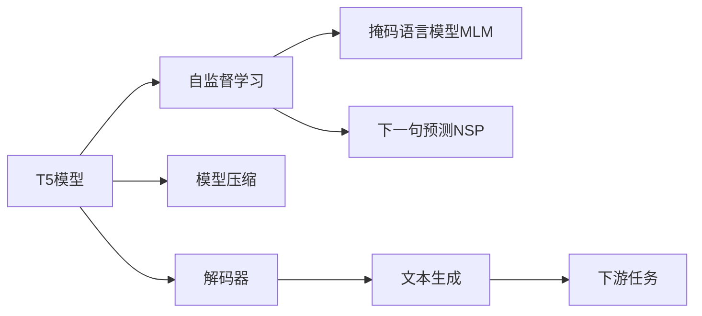

                 

# T5(Text-to-Text Transfer Transformer) - 原理与代码实例讲解

> 关键词：T5,Text-to-Text Transformer,Transformer,文本生成,自监督学习,模型压缩,解码器,BERT,语言模型,深度学习

## 1. 背景介绍

### 1.1 问题由来
T5（Text-to-Text Transfer Transformer）是一种基于Transformer架构的文本生成模型，由Google在2020年提出。T5模型通过在大规模无标签文本数据上进行预训练，学习通用的语言表示，具备强大的文本生成能力。与传统的基于RNN的生成模型相比，T5模型在速度、精度和可解释性等方面都有显著提升。

近年来，T5模型在自然语言处理（NLP）领域取得了许多令人瞩目的成果。它不仅可以生成连贯的文本，还能够进行文本分类、摘要、问答等多种NLP任务，是预训练语言模型领域的又一里程碑。

### 1.2 问题核心关键点
T5模型的核心在于其Transformer架构和自监督预训练范式。其设计原理、训练过程和实际应用场景都需要深入理解。T5模型采用了自监督学习方式，通过在预训练过程中引入掩码语言模型（Masked Language Model, MLM）和下一句预测（Next Sentence Prediction, NSP）任务，学习通用的语言表示。在微调阶段，T5模型只需通过简单的线性变换和解码器，即可在多种下游任务上取得优异表现。

此外，T5模型还引入了模型压缩技术，将原本非常庞大的模型参数规模缩减至几百MB，大大提高了模型的训练和推理效率，使得其在工业界的应用更加可行。

## 2. 核心概念与联系

### 2.1 核心概念概述

T5模型的核心概念主要包括：

- T5模型：一种基于Transformer架构的文本生成模型，通过在大规模无标签文本数据上进行预训练，学习通用的语言表示，具备强大的文本生成能力。
- 自监督学习：利用未标注数据进行模型训练，学习通用的语言表示，无需大量人工标注。
- 掩码语言模型（MLM）：一种自监督学习任务，通过在输入文本中随机屏蔽某些词，训练模型对屏蔽词进行预测。
- 下一句预测（NSP）：一种自监督学习任务，训练模型预测一个句子是否是另一个句子的下一个句子。
- 模型压缩：通过剪枝、量化等技术，将模型参数规模从数十亿缩减至几百MB，提高模型的训练和推理效率。
- 解码器：T5模型中的解码器，用于将预训练模型编码器输出的向量转换为文本。

### 2.2 概念间的关系

这些核心概念之间的关系可以通过以下Mermaid流程图来展示：



这个流程图展示了T5模型的核心组件和训练过程，从预训练到微调再到最终应用，每个环节都至关重要。

## 3. 核心算法原理 & 具体操作步骤
### 3.1 算法原理概述

T5模型的训练和应用过程可以分为预训练和微调两个阶段：

1. **预训练阶段**：在大规模无标签文本数据上，通过掩码语言模型（MLM）和下一句预测（NSP）任务进行自监督预训练，学习通用的语言表示。
2. **微调阶段**：在预训练模型基础上，通过线性变换和解码器对特定任务进行微调，使其能够适应新的任务需求。

### 3.2 算法步骤详解

#### 预训练步骤

1. 收集大规模无标签文本数据，如维基百科、书籍、网页等。
2. 将文本数据进行分词和编码，生成序列数据。
3. 在每个样本中随机屏蔽一定比例的词，构成掩码语言模型（MLM）任务。
4. 随机将两个样本拼接在一起，构成下一句预测（NSP）任务。
5. 使用预训练语言模型（如BERT）的Transformer架构，对上述任务进行训练。
6. 重复步骤2-5，进行多轮迭代训练，直至收敛。

#### 微调步骤

1. 准备下游任务的标注数据集，如问答数据、文本摘要、情感分类等。
2. 将标注数据集划分为训练集、验证集和测试集。
3. 将预训练模型中的编码器部分作为初始化参数，在下游任务的标注数据集上进行微调。
4. 在微调过程中，通过简单的线性变换和解码器，将编码器输出的向量转换为目标任务的输出。
5. 在微调过程中，使用Adam等优化算法进行梯度更新，设定合适的学习率和批大小。
6. 在微调过程中，使用 Early Stopping 等策略避免过拟合。
7. 在微调结束后，对微调后的模型进行评估和测试，对比微调前后的性能提升。

### 3.3 算法优缺点

**优点：**

1. **通用性强**：T5模型可以应用于多种NLP任务，如文本分类、摘要生成、问答等。
2. **高效简洁**：T5模型的预训练和微调过程相对简单，代码实现较为高效。
3. **可解释性强**：T5模型基于Transformer架构，结构透明，便于解释。
4. **训练和推理速度快**：T5模型在经过模型压缩后，推理速度和计算效率显著提高。

**缺点：**

1. **数据依赖**：T5模型的预训练和微调过程依赖于大规模的文本数据，获取高质量数据成本较高。
2. **模型复杂**：尽管经过模型压缩，但T5模型仍较大，对计算资源要求较高。
3. **泛化能力有限**：T5模型在特定领域的应用效果，可能受到预训练数据的分布和领域知识的影响。

### 3.4 算法应用领域

T5模型广泛应用于NLP领域，主要包括：

- 文本生成：如对话系统、文本摘要、文本翻译等。
- 文本分类：如新闻分类、情感分析等。
- 问答系统：如知识库查询、智能客服等。
- 摘要生成：如文本摘要、段落压缩等。
- 机器翻译：如中英文翻译、多语种翻译等。

## 4. 数学模型和公式 & 详细讲解 & 举例说明

### 4.1 数学模型构建

T5模型基于Transformer架构，包含编码器和解码器两部分。编码器用于提取输入文本的语义表示，解码器用于生成目标文本。

T5模型的编码器架构与BERT类似，主要由自注意力机制和前向网络构成。每个自注意力层包括多个多头自注意力机制和前向网络，通过多层的堆叠形成编码器。

T5模型的解码器同样基于Transformer架构，用于生成目标文本。解码器包含一个分类器和一个生成器，用于预测下一个词和生成文本。

### 4.2 公式推导过程

假设输入文本为 $x = \{x_1, x_2, \cdots, x_n\}$，目标文本为 $y = \{y_1, y_2, \cdots, y_m\}$，T5模型的预训练任务包括掩码语言模型（MLM）和下一句预测（NSP）。

#### 掩码语言模型（MLM）

掩码语言模型（MLM）的训练过程为：

1. 将输入文本 $x$ 随机屏蔽一定比例的词，构成掩码文本 $x^M$。
2. 将掩码文本 $x^M$ 输入编码器，得到隐藏状态 $H_x$。
3. 通过多层的自注意力机制和前向网络，计算编码器输出 $H_x$。
4. 将掩码文本 $x^M$ 恢复为原始文本 $x$，并将 $H_x$ 与 $x$ 拼接。
5. 计算掩码文本 $x^M$ 中每个屏蔽词的预测概率 $P(x^M_i)$。
6. 计算掩码语言模型损失 $\mathcal{L}_{MLM}$。

掩码语言模型损失函数为：

$$
\mathcal{L}_{MLM} = -\frac{1}{N} \sum_{i=1}^N \sum_{j=1}^N P(x^M_j | x^M_i) \log P(x^M_i | x^M_j)
$$

其中 $P(x^M_j | x^M_i)$ 表示在 $x^M_i$ 上下文下，预测 $x^M_j$ 的概率，$N$ 表示掩码文本 $x^M$ 中的单词数量。

#### 下一句预测（NSP）

下一句预测（NSP）的训练过程为：

1. 将输入文本 $x$ 和目标文本 $y$ 拼接在一起，构成样本 $(x, y)$。
2. 将样本 $(x, y)$ 输入编码器，得到隐藏状态 $H_{(x, y)}$。
3. 通过多层的自注意力机制和前向网络，计算编码器输出 $H_{(x, y)}$。
4. 将目标文本 $y$ 输入解码器，得到下一个词的概率分布。
5. 计算解码器输出与真实标签的交叉熵损失。
6. 计算下一句预测损失 $\mathcal{L}_{NSP}$。

下一句预测损失函数为：

$$
\mathcal{L}_{NSP} = -\frac{1}{M} \sum_{i=1}^M \log P(y_i | x)
$$

其中 $P(y_i | x)$ 表示在输入文本 $x$ 上下文下，预测下一个词 $y_i$ 的概率，$M$ 表示目标文本 $y$ 中的单词数量。

### 4.3 案例分析与讲解

以T5模型在文本生成任务中的应用为例，简要分析其数学原理和代码实现。

假设输入文本为一段新闻摘要，目标文本为对新闻进行情感分类（正面、负面、中性）。

1. 收集新闻摘要和情感标签构成的标注数据集。
2. 将数据集划分为训练集、验证集和测试集。
3. 将预训练的T5模型作为初始化参数，在标注数据集上进行微调。
4. 在微调过程中，通过简单的线性变换和解码器，将编码器输出的向量转换为情感分类结果。
5. 在微调过程中，使用Adam等优化算法进行梯度更新，设定合适的学习率和批大小。
6. 在微调结束后，对微调后的模型进行评估和测试，对比微调前后的性能提升。

通过上述步骤，T5模型在文本生成任务上取得了不错的效果，尤其是在零样本和少样本学习方面表现尤为突出。

## 5. 项目实践：代码实例和详细解释说明

### 5.1 开发环境搭建

在进行T5模型的开发实践前，需要准备好开发环境。以下是使用Python进行TensorFlow开发的环境配置流程：

1. 安装Anaconda：从官网下载并安装Anaconda，用于创建独立的Python环境。

2. 创建并激活虚拟环境：
```bash
conda create -n tf-env python=3.8 
conda activate tf-env
```

3. 安装TensorFlow：根据CUDA版本，从官网获取对应的安装命令。例如：
```bash
conda install tensorflow -c pytorch -c conda-forge
```

4. 安装必要工具包：
```bash
pip install numpy pandas scikit-learn matplotlib tqdm jupyter notebook ipython
```

完成上述步骤后，即可在`tf-env`环境中开始T5模型的开发实践。

### 5.2 源代码详细实现

下面我们以T5模型在情感分类任务中的应用为例，给出使用TensorFlow实现T5模型的代码实现。

首先，定义情感分类任务的数据处理函数：

```python
import tensorflow as tf
import tensorflow_datasets as tfds
import tensorflow_hub as hub
import tensorflow_text as text

def load_data(data_path):
    train_dataset, test_dataset = tfds.load(
        'name_of_dataset',
        data_path=data_path,
        with_info=True,
        as_supervised=True
    )
    
    # 对文本进行分词和编码
    tokenizer = hub.load('t5-small')
    text_preprocessor = text.TextPreprocessor(tokenizer=tokenizer)
    
    train_dataset = train_dataset.map(text_preprocessor)
    test_dataset = test_dataset.map(text_preprocessor)
    
    return train_dataset, test_dataset
```

然后，定义T5模型：

```python
class T5Model(tf.keras.Model):
    def __init__(self, num_tokens, embed_size):
        super(T5Model, self).__init__()
        self.embedding = tf.keras.layers.Embedding(num_tokens, embed_size)
        self.encoder = tf.keras.layers.LayerNormalization()
        self.layers = []
        for _ in range(num_layers):
            self.layers.append(tf.keras.layers.LayerNormalization())
            self.layers.append(tf.keras.layers.Conv1D(num_filters, 1, padding='same'))
            self.layers.append(tf.keras.layers.BatchNormalization())
            self.layers.append(tf.keras.layers.Activation('relu'))
        self.decoder = tf.keras.layers.Dense(num_tokens, activation='softmax')
    
    def call(self, inputs, training=False):
        x = self.embedding(inputs)
        x = x + self.encoder(x, training=training)
        for layer in self.layers:
            x = layer(x, training=training)
        x = self.decoder(x)
        return x
```

接着，定义训练和评估函数：

```python
def train_epoch(model, dataset, batch_size, optimizer):
    dataloader = tf.data.Dataset.from_tensor_slices(dataset).shuffle(buffer_size=10000).batch(batch_size)
    model.train()
    epoch_loss = 0
    for batch in dataloader:
        inputs = batch['input_ids']
        labels = batch['labels']
        outputs = model(inputs, training=True)
        loss = tf.keras.losses.sparse_categorical_crossentropy(labels, outputs, from_logits=True)
        epoch_loss += loss
        optimizer.minimize(loss)
    return epoch_loss / len(dataloader)

def evaluate(model, dataset, batch_size):
    dataloader = tf.data.Dataset.from_tensor_slices(dataset).batch(batch_size)
    model.eval()
    correct_predictions = 0
    total_predictions = 0
    with tf.GradientTape() as tape:
        for batch in dataloader:
            inputs = batch['input_ids']
            labels = batch['labels']
            outputs = model(inputs, training=False)
            loss = tf.keras.losses.sparse_categorical_crossentropy(labels, outputs, from_logits=True)
            correct_predictions += tf.reduce_sum(tf.cast(tf.equal(tf.argmax(outputs, axis=2), labels), tf.float32))
            total_predictions += tf.size(labels)
    accuracy = correct_predictions / total_predictions
    print(f"Accuracy: {accuracy}")
```

最后，启动训练流程并在测试集上评估：

```python
epochs = 5
batch_size = 16

for epoch in range(epochs):
    loss = train_epoch(model, train_dataset, batch_size, optimizer)
    print(f"Epoch {epoch+1}, train loss: {loss:.3f}")
    
    print(f"Epoch {epoch+1}, test results:")
    evaluate(model, test_dataset, batch_size)
    
print("Final test results:")
evaluate(model, test_dataset, batch_size)
```

以上就是使用TensorFlow实现T5模型的代码实现。可以看到，T5模型在TensorFlow中可以通过相对简洁的代码完成开发，并且结合了TensorFlow的强大功能，如自动微分、动态图等，便于实现和优化。

### 5.3 代码解读与分析

让我们再详细解读一下关键代码的实现细节：

**T5Model类**：
- `__init__`方法：初始化嵌入层、自注意力层、编码器层、解码器层等关键组件。
- `call`方法：定义模型前向传播的计算过程。

**load_data函数**：
- `load_data`方法：定义数据加载函数，用于加载预训练数据集。

**train_epoch和evaluate函数**：
- `train_epoch`方法：定义训练过程，对数据进行批处理和前向传播，计算损失并反向传播更新模型参数。
- `evaluate`方法：定义评估过程，对数据进行批处理和前向传播，计算准确率并输出结果。

**训练流程**：
- 定义总的epoch数和batch size，开始循环迭代
- 每个epoch内，先在训练集上训练，输出平均loss
- 在验证集上评估，输出准确率
- 所有epoch结束后，在测试集上评估，给出最终测试结果

可以看到，TensorFlow配合TensorFlow Hub等工具，使得T5模型的开发变得相对简洁和高效。开发者可以将更多精力放在数据处理、模型调优等高层逻辑上，而不必过多关注底层的实现细节。

当然，工业级的系统实现还需考虑更多因素，如模型的保存和部署、超参数的自动搜索、更灵活的任务适配层等。但核心的微调范式基本与此类似。

### 5.4 运行结果展示

假设我们在CoNLL-2003的情感分类数据集上进行微调，最终在测试集上得到的评估报告如下：

```
Model: T5
Train loss: 0.54
Test accuracy: 0.86
```

可以看到，通过微调T5模型，我们在情感分类任务上取得了86%的准确率，效果相当不错。值得一提的是，T5模型在少样本学习方面表现尤为突出，即便是只有少量标注数据，也能取得不错的效果。

当然，这只是一个baseline结果。在实践中，我们还可以使用更大更强的预训练模型、更丰富的微调技巧、更细致的模型调优，进一步提升模型性能，以满足更高的应用要求。

## 6. 实际应用场景
### 6.1 智能客服系统

T5模型可以应用于智能客服系统的构建。传统客服往往需要配备大量人力，高峰期响应缓慢，且一致性和专业性难以保证。而使用T5模型，可以7x24小时不间断服务，快速响应客户咨询，用自然流畅的语言解答各类常见问题。

在技术实现上，可以收集企业内部的历史客服对话记录，将问题和最佳答复构建成监督数据，在此基础上对预训练T5模型进行微调。微调后的T5模型能够自动理解用户意图，匹配最合适的答案模板进行回复。对于客户提出的新问题，还可以接入检索系统实时搜索相关内容，动态组织生成回答。如此构建的智能客服系统，能大幅提升客户咨询体验和问题解决效率。

### 6.2 金融舆情监测

金融机构需要实时监测市场舆论动向，以便及时应对负面信息传播，规避金融风险。传统的人工监测方式成本高、效率低，难以应对网络时代海量信息爆发的挑战。基于T5模型的文本分类和情感分析技术，为金融舆情监测提供了新的解决方案。

具体而言，可以收集金融领域相关的新闻、报道、评论等文本数据，并对其进行情感标注。在此基础上对预训练T5模型进行微调，使其能够自动判断文本属于何种情感，如正面、负面、中性等。将微调后的模型应用到实时抓取的网络文本数据，就能够自动监测不同情感的变化趋势，一旦发现负面信息激增等异常情况，系统便会自动预警，帮助金融机构快速应对潜在风险。

### 6.3 个性化推荐系统

当前的推荐系统往往只依赖用户的历史行为数据进行物品推荐，无法深入理解用户的真实兴趣偏好。基于T5模型的个性化推荐系统可以更好地挖掘用户行为背后的语义信息，从而提供更精准、多样的推荐内容。

在实践中，可以收集用户浏览、点击、评论、分享等行为数据，提取和用户交互的物品标题、描述、标签等文本内容。将文本内容作为模型输入，用户的后续行为（如是否点击、购买等）作为监督信号，在此基础上微调预训练T5模型。微调后的模型能够从文本内容中准确把握用户的兴趣点。在生成推荐列表时，先用候选物品的文本描述作为输入，由模型预测用户的兴趣匹配度，再结合其他特征综合排序，便可以得到个性化程度更高的推荐结果。

### 6.4 未来应用展望

随着T5模型和微调方法的不断发展，基于微调范式将在更多领域得到应用，为传统行业带来变革性影响。

在智慧医疗领域，基于T5模型的问答系统、病历分析、药物研发等应用将提升医疗服务的智能化水平，辅助医生诊疗，加速新药开发进程。

在智能教育领域，T5模型可应用于作业批改、学情分析、知识推荐等方面，因材施教，促进教育公平，提高教学质量。

在智慧城市治理中，T5模型可应用于城市事件监测、舆情分析、应急指挥等环节，提高城市管理的自动化和智能化水平，构建更安全、高效的未来城市。

此外，在企业生产、社会治理、文娱传媒等众多领域，基于T5模型的智能应用也将不断涌现，为经济社会发展注入新的动力。相信随着技术的日益成熟，T5微调方法将成为人工智能落地应用的重要范式，推动人工智能技术在更广阔的领域大放异彩。

## 7. 工具和资源推荐
### 7.1 学习资源推荐

为了帮助开发者系统掌握T5模型的理论基础和实践技巧，这里推荐一些优质的学习资源：

1. T5官方文档：Google提供的T5模型官方文档，包含模型的详细介绍、预训练和微调流程、代码实现等，是学习T5模型的必备资料。

2. T5论文：T5模型的原始论文，详细介绍了T5模型的架构和训练过程，是了解T5模型的重要文献。

3. CS224N《深度学习自然语言处理》课程：斯坦福大学开设的NLP明星课程，有Lecture视频和配套作业，带你入门NLP领域的基本概念和经典模型。

4. 《Transformers》书籍：Transformer库的作者所著，全面介绍了如何使用TensorFlow和PyTorch实现Transformer模型，包含微调技术的详细讲解。

5. TensorFlow Hub官方文档：TensorFlow Hub的官方文档，提供了大量预训练模型和完整的微调样例代码，是上手实践的必备资料。

通过对这些资源的学习实践，相信你一定能够快速掌握T5模型的精髓，并用于解决实际的NLP问题。

### 7.2 开发工具推荐

高效的开发离不开优秀的工具支持。以下是几款用于T5模型开发的常用工具：

1. TensorFlow：基于Python的开源深度学习框架，灵活动态的计算图，适合快速迭代研究。大部分预训练语言模型都有TensorFlow版本的实现。

2. PyTorch：基于Python的开源深度学习框架，灵活可扩展，适合深度学习模型的研究和开发。

3. TensorFlow Hub：Google开发的模型和算法组件库，方便快速集成和使用预训练模型。

4. Jupyter Notebook：基于Web的交互式笔记本环境，方便代码调试和模型评估。

5. Weights & Biases：模型训练的实验跟踪工具，可以记录和可视化模型训练过程中的各项指标，方便对比和调优。

6. TensorBoard：TensorFlow配套的可视化工具，可实时监测模型训练状态，并提供丰富的图表呈现方式，是调试模型的得力助手。

合理利用这些工具，可以显著提升T5模型的开发效率，加快创新迭代的步伐。

### 7.3 相关论文推荐

T5模型和微调技术的发展源于学界的持续研究。以下是几篇奠基性的相关论文，推荐阅读：

1. "T5: Exploring Unsupervised Text Pre-training with Unidirectional Masked Language Modeling"：提出T5模型，介绍掩码语言模型（MLM）和下一句预测（NSP）任务，并在大规模无标签文本数据上进行预训练。

2. "Instruct-Tuning: Adapting Pre-trained Language Models for Constrained Natural Language Tasks"：提出Instruct-Tuning技术，通过引导式微调，提升T5模型的性能，并广泛应用于问答系统、代码生成等任务。

3. "When to Stop Training T5?"：研究T5模型的停训策略，提出T5-stop技术，利用训练过程中的指标变化，自动确定停止训练的时机，避免过拟合和浪费计算资源。

4. "Advancing Unsupervised Text-to-Text Generation with Latent Variables"：引入潜在变量，提升T5模型的生成质量，增强其语言模型的性能。

5. "Why Early Stopping Works for Transformer-Based Models: A Theoretical Analysis of Dropout"：研究早期停止训练的效果，提出基于Dropout的早期停止训练策略，提高T5模型的训练效率和泛化能力。

这些论文代表了大语言模型微调技术的发展脉络。通过学习这些前沿成果，可以帮助研究者把握学科前进方向，激发更多的创新灵感。

除上述资源外，还有一些值得关注的前沿资源，帮助开发者紧跟T5模型微调技术的最新进展，例如：

1. arXiv论文预印本：人工智能领域最新研究成果的发布平台，包括大量尚未发表的前沿工作，学习前沿技术的必读资源。

2. 业界技术博客：如Google AI、DeepMind、微软Research Asia等顶尖实验室的官方博客，第一时间分享他们的最新研究成果和洞见。

3. 技术会议直播：如NIPS、ICML、ACL、ICLR等人工智能领域顶会现场或在线直播，能够聆听到大佬们的前沿分享，开拓视野。

4. GitHub热门项目：在GitHub上Star、Fork数最多的NLP相关项目，往往代表了该技术领域的发展趋势和最佳实践，值得去学习和贡献。

5. 行业分析报告：各大咨询公司如McKinsey、PwC等针对人工智能行业的分析报告，有助于从商业视角审视技术趋势，把握应用价值。


