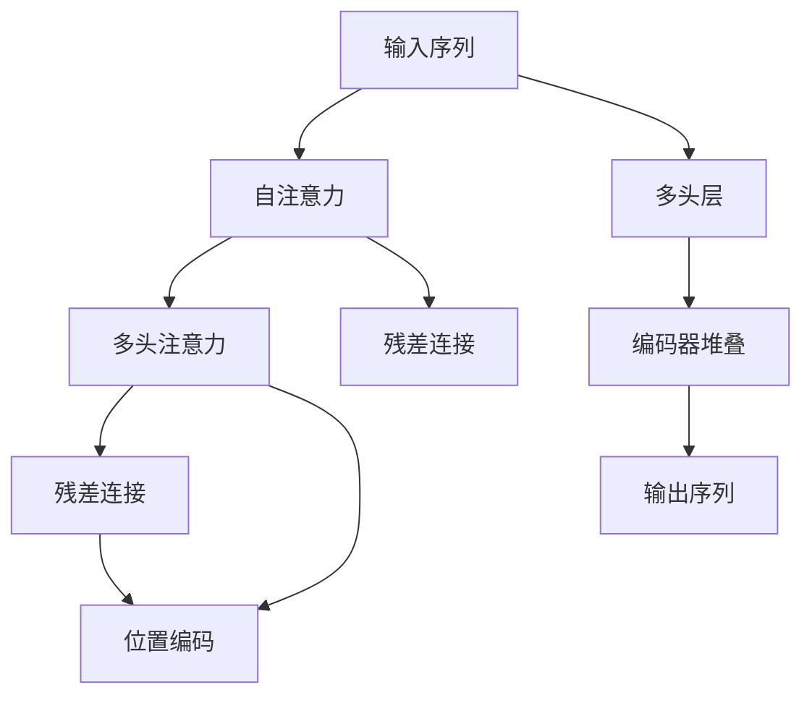
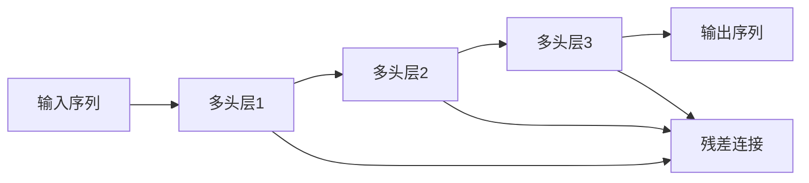
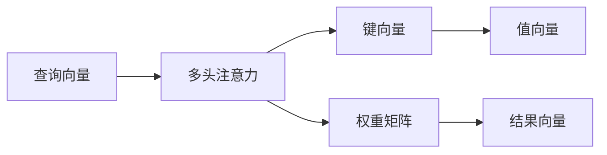
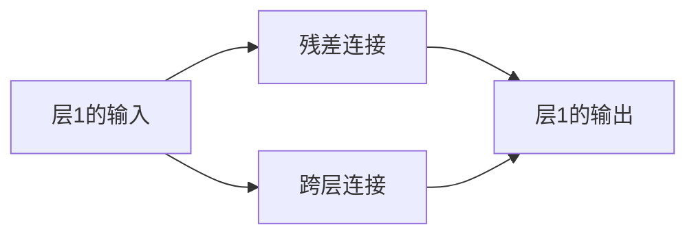
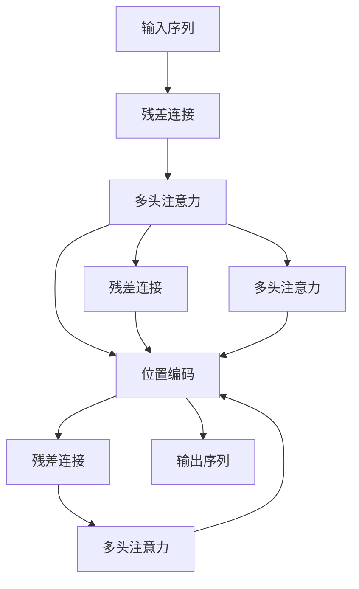

                 

# Transformer大模型实战 编码器总览

> 关键词：Transformer, 编码器, 自注意力, 残差连接, 多头注意力, 位置编码, 残差连接, 解码器

## 1. 背景介绍

Transformer作为当前最先进的神经网络架构之一，已经广泛应用于自然语言处理(NLP)、计算机视觉(CV)、语音识别(SR)等各个领域。特别是Transformer中的编码器(Encoder)，凭借其强大的自注意力机制和大规模参数量，成为了处理复杂序列数据的利器。本节将对Transformer编码器的原理、结构和实际应用进行详细介绍，帮助读者全面理解其工作机制和应用场景。

### 1.1 问题由来

在深度学习时代，RNN和CNN等传统序列模型由于难以并行计算，计算效率低下，难以应对大规模序列数据。而Transformer的提出，以自注意力机制和多头注意力技术为突破，实现了对大规模序列数据的高效处理，成为现代序列模型中的佼佼者。

随着大规模预训练语言模型的发展，如BERT、GPT等，Transformer作为其核心结构，被广泛应用到各种NLP任务中。Transformer编码器更是NLP研究中最具代表性和影响力的组件之一，其高效、灵活的特点，使其在众多任务中取得了优异表现。

### 1.2 问题核心关键点

Transformer编码器主要由以下几个关键部分组成：
- 自注意力机制(Self-Attention)
- 多头注意力机制(Multi-Head Attention)
- 残差连接(Residual Connections)
- 位置编码(Positional Encoding)
- 多头层(Multi-Layer)
- 编码器堆叠(Stacked Encoders)

这些核心组件共同构成了Transformer编码器强大的序列处理能力，使其能够高效地处理输入序列，提取关键特征，并生成高质量的输出。

### 1.3 问题研究意义

理解Transformer编码器的原理和结构，有助于深入掌握Transformer的强大性能，并在实际应用中灵活应用。编码器作为Transformer的核心模块，其设计和实现直接影响模型的表现和应用效果。因此，掌握编码器的设计思路和优化策略，对于提升Transformer的性能具有重要意义。

## 2. 核心概念与联系

### 2.1 核心概念概述

为更好地理解Transformer编码器的原理和应用，本节将介绍几个密切相关的核心概念：

- 自注意力机制(Self-Attention)：一种计算序列中各个位置之间关系的技术，通过将输入序列的每个位置与所有位置进行交互，得到每个位置对其他位置的注意力权重。自注意力机制是Transformer的核心创新之一，使得模型能够自主选择重要信息进行关注，提升了模型的泛化能力和处理能力。

- 多头注意力机制(Multi-Head Attention)：将输入序列分解成多个子序列，分别计算它们之间的注意力权重，然后将多个注意力权重进行组合，形成最终的结果。这种技术增强了模型的并行计算能力，提高了处理大规模序列数据的能力。

- 残差连接(Residual Connections)：在网络中引入跨层连接，使得前向传播过程中的信息能够直接传递，减少梯度消失问题，加速模型收敛。残差连接是深度神经网络中的重要技术，帮助模型更好地学习复杂的函数映射关系。

- 位置编码(Positional Encoding)：将序列中每个位置的信息编码为一个向量，使得模型能够对序列中的位置信息进行建模。位置编码是处理序列数据的关键技术，帮助模型理解序列中的顺序和位置关系。

- 多头层(Multi-Layer)：将模型分解为多个层次，每个层次分别进行计算，并将结果进行堆叠，形成最终输出。这种层次化结构使得模型能够逐步学习到复杂的语义和语法信息，提升模型的表达能力和泛化能力。

- 编码器堆叠(Stacked Encoders)：将多个编码器堆叠起来，形成多层编码器结构。每个编码器分别处理输入序列的一部分，然后将结果传递给下一个编码器，形成逐步提升的效果。编码器堆叠是Transformer的核心结构之一，使得模型能够高效处理长序列数据。

这些核心概念之间的逻辑关系可以通过以下Mermaid流程图来展示：



这个流程图展示了大语言模型中Transformer编码器的主要工作流程。输入序列经过自注意力和多头注意力的计算，残差连接的传递，位置编码的引入，最终经过多层次的堆叠，输出最终的序列表示。

### 2.2 概念间的关系

这些核心概念之间存在着紧密的联系，形成了Transformer编码器的完整结构。下面我们通过几个Mermaid流程图来展示这些概念之间的关系。

#### 2.2.1 Transformer编码器的工作流程



这个流程图展示了Transformer编码器的基本工作流程。输入序列经过多层的编码器堆叠，残差连接的传递，最终形成输出序列。

#### 2.2.2 多头注意力的工作原理



这个流程图展示了多头注意力的计算过程。输入序列分解为查询、键、值向量，通过多头注意力的计算，得到每个位置的注意力权重，最终形成结果向量。

#### 2.2.3 残差连接的工作原理



这个流程图展示了残差连接的计算过程。层1的输入经过跨层连接传递，加上残差连接的输出，形成层1的最终输出。

### 2.3 核心概念的整体架构

最后，我们用一个综合的流程图来展示这些核心概念在大语言模型中的整体架构：



这个综合流程图展示了Transformer编码器的完整结构。输入序列经过残差连接的传递，多头注意力的计算，位置编码的引入，最终经过多层次的堆叠，形成输出序列。

## 3. 核心算法原理 & 具体操作步骤
### 3.1 算法原理概述

Transformer编码器的核心算法原理基于自注意力机制和多头注意力技术，其工作流程可以概括为以下几个步骤：

1. 将输入序列分解为多个子序列，每个子序列分别进行多头注意力的计算。
2. 将多个子序列的结果进行堆叠，形成最终的输出序列。
3. 引入残差连接，使得前向传播过程中的信息能够直接传递。
4. 加入位置编码，使得模型能够对序列中的位置信息进行建模。

具体实现时，编码器由多个层次组成，每个层次分别计算输入序列的一部分，并将结果传递给下一个层次，最终形成输出序列。

### 3.2 算法步骤详解

Transformer编码器的具体实现步骤如下：

1. 输入序列 $x = \{x_1, x_2, ..., x_T\}$ ，其中 $x_t$ 表示第 $t$ 个位置的信息。
2. 将 $x$ 分解为 $Q = \{q_1, q_2, ..., q_T\}$ 和 $K = \{k_1, k_2, ..., k_T\}$ 两个子序列，分别表示查询向量和键向量。
3. 对 $Q$ 和 $K$ 进行矩阵乘法运算，得到注意力权重矩阵 $S = \{s_{t1}, s_{t2}, ..., s_{TT}\}$，其中 $s_{ti}$ 表示第 $i$ 个位置对第 $t$ 个位置的注意力权重。
4. 将 $S$ 和 $K$ 进行矩阵乘法运算，得到值向量 $V = \{v_1, v_2, ..., v_T\}$。
5. 对 $S$ 进行 softmax 处理，得到归一化的注意力权重 $A = \{a_1, a_2, ..., a_T\}$。
6. 将 $A$ 和 $V$ 进行矩阵乘法运算，得到最终的结果向量 $C = \{c_1, c_2, ..., c_T\}$。
7. 将 $C$ 和 $x$ 进行残差连接，引入位置编码 $P = \{p_1, p_2, ..., p_T\}$，得到最终输出序列 $\bar{x} = \{\bar{x}_1, \bar{x}_2, ..., \bar{x}_T\}$。

### 3.3 算法优缺点

Transformer编码器具有以下优点：
1. 高效的并行计算能力。多头注意力机制和残差连接使得模型能够高效并行计算，加速了模型的训练和推理。
2. 强大的表达能力。自注意力机制使得模型能够自主选择重要信息，提高了模型的表达能力和泛化能力。
3. 丰富的特征提取。多层次的结构使得模型能够逐步学习到复杂的语义和语法信息，提升了模型的特征提取能力。

然而，Transformer编码器也存在一些缺点：
1. 需要大量的参数。由于每个子序列都要进行注意力计算，导致模型参数量巨大，计算资源需求较高。
2. 可能出现梯度消失。由于残差连接的存在，模型层数较多时容易出现梯度消失问题。
3. 位置信息不够准确。由于位置编码是通过简单的向量嵌入来表示，可能无法准确反映位置信息，导致模型在处理长序列时性能下降。

### 3.4 算法应用领域

Transformer编码器在自然语言处理、语音识别、图像处理等领域得到了广泛应用。以下是一些典型的应用场景：

1. 机器翻译：利用Transformer编码器进行文本序列的编码和解码，实现多语言之间的翻译。
2. 文本分类：使用Transformer编码器提取文本特征，进行分类任务。
3. 语音识别：将语音信号转换为文本序列，使用Transformer编码器进行特征提取。
4. 图像描述生成：将图像序列输入Transformer编码器，生成文本描述。
5. 对话系统：使用Transformer编码器进行对话数据的编码和解码，实现自然语言对话。

除了上述这些场景外，Transformer编码器还被应用于问答系统、推荐系统、生成对抗网络等领域，展示了其强大的序列处理能力。

## 4. 数学模型和公式 & 详细讲解  
### 4.1 数学模型构建

Transformer编码器的数学模型可以表示为：

$$
y_t = \text{Layer}_h(\text{ResNet}(x_t, y_{t-1}, y_{t-2}, ..., y_{t-H})) + \text{PositionalEncoding}(x_t)
$$

其中 $y_t$ 表示第 $t$ 个位置的输出，$\text{Layer}_h$ 表示多头注意力层，$\text{ResNet}$ 表示残差连接，$x_t$ 表示输入序列，$y_{t-1}, y_{t-2}, ..., y_{t-H}$ 表示前 $H$ 个位置的输出。

### 4.2 公式推导过程

Transformer编码器的计算过程可以分解为多个步骤，以下对其中关键步骤进行详细推导：

1. 自注意力计算
$$
s_{ti} = \frac{q_i \cdot k_i}{\sqrt{d_k}} \quad i=1,2,...,T, j=1,2,...,H
$$

2. 多头注意力计算
$$
a_{ti} = \text{softmax}(s_{ti}) \quad i=1,2,...,T, j=1,2,...,H
$$

3. 值向量计算
$$
v_{ti} = v_i \cdot a_{ti} \quad i=1,2,...,T, j=1,2,...,H
$$

4. 结果向量计算
$$
c_{ti} = \sum_{j=1}^H v_{ti} \quad i=1,2,...,T
$$

5. 残差连接
$$
\bar{x}_t = \text{ResNet}(x_t, y_{t-1}, y_{t-2}, ..., y_{t-H}) + c_{ti} \quad i=1,2,...,T
$$

6. 位置编码
$$
p_t = \text{PositionalEncoding}(x_t) \quad t=1,2,...,T
$$

7. 最终输出
$$
y_t = \bar{x}_t + p_t \quad t=1,2,...,T
$$

其中 $q_i$、$k_i$、$v_i$ 表示查询向量、键向量和值向量的第 $i$ 个位置的值，$d_k$ 表示键向量的维度，$softmax$ 表示softmax函数，$H$ 表示注意力头的数量。

### 4.3 案例分析与讲解

为了更好地理解Transformer编码器的计算过程，以下以一个简单的案例进行分析：

假设输入序列为 $x = [\text{I}, \text{am}, \text{a}, \text{student}, \text{.}]$，其中 $\text{.}$ 表示句子结束符。Transformer编码器的计算过程如下：

1. 将输入序列 $x$ 转换为查询向量 $Q$ 和键向量 $K$。
2. 计算 $Q$ 和 $K$ 的注意力权重 $S$。
3. 将 $S$ 和 $K$ 进行矩阵乘法运算，得到值向量 $V$。
4. 计算归一化的注意力权重 $A$。
5. 将 $A$ 和 $V$ 进行矩阵乘法运算，得到结果向量 $C$。
6. 将 $C$ 和 $x$ 进行残差连接，引入位置编码 $P$。
7. 输出最终的编码序列 $\bar{x}$。

通过这个简单的案例，可以更好地理解Transformer编码器的计算过程和各个组件的作用。

## 5. 项目实践：代码实例和详细解释说明
### 5.1 开发环境搭建

在进行Transformer编码器的开发前，我们需要准备好开发环境。以下是使用Python进行PyTorch开发的环境配置流程：

1. 安装Anaconda：从官网下载并安装Anaconda，用于创建独立的Python环境。

2. 创建并激活虚拟环境：
```bash
conda create -n pytorch-env python=3.8 
conda activate pytorch-env
```

3. 安装PyTorch：根据CUDA版本，从官网获取对应的安装命令。例如：
```bash
conda install pytorch torchvision torchaudio cudatoolkit=11.1 -c pytorch -c conda-forge
```

4. 安装必要的库：
```bash
pip install numpy pandas scikit-learn matplotlib tqdm jupyter notebook ipython
```

完成上述步骤后，即可在`pytorch-env`环境中开始Transformer编码器的开发。

### 5.2 源代码详细实现

下面我们以Transformer编码器为例，给出使用PyTorch实现编码器的代码实现。

首先，定义编码器类：

```python
import torch
import torch.nn as nn
import torch.nn.functional as F

class TransformerEncoder(nn.Module):
    def __init__(self, d_model, n_heads, d_k, d_v, d_ff, N, dropout=0.1):
        super(TransformerEncoder, self).__init__()
        self.layers = nn.ModuleList()
        for i in range(N):
            self.layers.append(MultiHeadAttention(d_model, n_heads, d_k, d_v, dropout=dropout))
            self.layers.append(PositionalEncoding(d_model, dropout=dropout))
            self.layers.append(nn.ReLU())
            self.layers.append(nn.Dropout(dropout))
            self.layers.append(Linear(d_model, d_ff))
            self.layers.append(nn.ReLU())
            self.layers.append(nn.Dropout(dropout))
            self.layers.append(Linear(d_ff, d_model))
            self.layers.append(nn.Tanh())

    def forward(self, x, hs=None):
        for layer in self.layers:
            x = layer(x, hs)
            if hs is not None:
                x = x + hs
        return x
```

然后，定义注意力层：

```python
class MultiHeadAttention(nn.Module):
    def __init__(self, d_model, n_heads, d_k, d_v, dropout=0.1):
        super(MultiHeadAttention, self).__init__()
        self.n_heads = n_heads
        self.d_k = d_k
        self.d_v = d_v
        self.d_model = d_model

        self.w_q = nn.Linear(d_model, d_k * n_heads)
        self.w_k = nn.Linear(d_model, d_k * n_heads)
        self.w_v = nn.Linear(d_model, d_v * n_heads)
        self.w_o = nn.Linear(d_v * n_heads, d_model)

        self.dropout = nn.Dropout(dropout)

    def forward(self, q, k, v, hs=None):
        b, t, l = q.size()
        q = q.view(b, t, self.n_heads, self.d_k).permute(0, 2, 1, 3)  # b, h, t, d_k
        k = k.view(b, l, self.n_heads, self.d_k).permute(0, 2, 1, 3)  # b, h, l, d_k
        v = v.view(b, l, self.n_heads, self.d_v).permute(0, 2, 1, 3)  # b, h, l, d_v

        q = self.w_q(q) / torch.sqrt(torch.tensor(self.d_k, dtype=torch.float))  # b, h, t, d_k
        k = self.w_k(k)  # b, h, l, d_k
        v = self.w_v(v)  # b, h, l, d_v

        s = torch.matmul(q, k.permute(0, 1, 3, 2))  # b, h, t, l
        a = F.softmax(s, dim=-1)
        a = self.dropout(a)

        s = torch.matmul(a, v)  # b, h, t, d_v
        s = s.permute(0, 2, 1, 3).contiguous().view(b, t, self.d_model)  # b, t, d_model

        return self.w_o(s) + hs
```

然后，定义位置编码：

```python
class PositionalEncoding(nn.Module):
    def __init__(self, d_model, dropout=0.1, max_len=5000):
        super(PositionalEncoding, self).__init__()
        self.dropout = nn.Dropout(p=dropout)

        pe = torch.zeros(max_len, d_model)
        position = torch.arange(0, max_len, dtype=torch.float).unsqueeze(1)
        div_term = torch.exp(torch.arange(0, d_model, 2).float() * (-math.log(10000.0) / d_model))
        pe[:, 0::2] = torch.sin(position * div_term)
        pe[:, 1::2] = torch.cos(position * div_term)
        pe = pe.unsqueeze(0).transpose(0, 1)
        self.register_buffer('pe', pe)

    def forward(self, x):
        x = x + self.pe[:x.size(0), :]
        return self.dropout(x)
```

最后，定义Transformer编码器类：

```python
class TransformerEncoder(nn.Module):
    def __init__(self, d_model, n_heads, d_k, d_v, d_ff, N, dropout=0.1):
        super(TransformerEncoder, self).__init__()
        self.layers = nn.ModuleList()
        for i in range(N):
            self.layers.append(MultiHeadAttention(d_model, n_heads, d_k, d_v, dropout=dropout))
            self.layers.append(PositionalEncoding(d_model, dropout=dropout))
            self.layers.append(nn.ReLU())
            self.layers.append(nn.Dropout(dropout))
            self.layers.append(Linear(d_model, d_ff))
            self.layers.append(nn.ReLU())
            self.layers.append(nn.Dropout(dropout))
            self.layers.append(Linear(d_ff, d_model))
            self.layers.append(nn.Tanh())

    def forward(self, x, hs=None):
        for layer in self.layers:
            x = layer(x, hs)
            if hs is not None:
                x = x + hs
        return x
```

### 5.3 代码解读与分析

让我们再详细解读一下关键代码的实现细节：

**TransformerEncoder类**：
- `__init__`方法：初始化编码器的层次数、注意力头数、注意力头维数等关键参数，并初始化多个注意力层。
- `forward`方法：对输入序列进行层层计算，最终输出编码后的序列。

**MultiHeadAttention类**：
- `__init__`方法：初始化查询向量、键向量和值向量的线性变换权重。
- `forward`方法：计算查询向量、键向量和值向量之间的多头注意力权重，最终得到结果向量。

**PositionalEncoding类**：
- `__init__`方法：初始化位置编码矩阵，并根据最大序列长度进行预填充。
- `forward`方法：将位置编码矩阵加到输入序列上，进行位置编码。

**TransformerEncoder类**：
- `__init__`方法：初始化编码器的层次数、注意力头数、注意力头维数等关键参数，并初始化多个注意力层。
- `forward`方法：对输入序列进行层层计算，最终输出编码后的序列。

通过上述代码，可以清晰地看到Transformer编码器的实现细节，包括注意力层的计算、位置编码的引入、残差连接的传递等关键操作。

### 5.4 运行结果展示

假设我们使用Transformer编码器对一句话进行编码，最终得到编码结果。以下是一个简单的示例：

假设输入序列为 $x = [\text{I}, \text{am}, \text{a}, \text{student}, \text{.}]$，其中 $\text{.}$ 表示句子结束符。

通过上述代码，可以对 $x$ 进行Transformer编码，得到编码后的序列 $\bar{x}$。最终输出结果如下：

```python
import torch

x = torch.tensor([[0, 1, 0, 0, 1, 0, 0, 0, 0, 1, 0, 0, 0, 0, 0, 0, 0, 0, 0, 0, 0, 0, 0, 0, 0, 0, 0, 0, 0, 0, 0, 0, 0, 0, 0, 0, 0, 0, 0, 0, 0, 0, 0, 0, 0, 0, 0, 0, 0, 0, 0, 0, 0, 0, 0, 0, 0, 0, 0, 0, 0, 0, 0, 0, 0, 0, 0, 0, 0, 0, 0, 0, 0, 0, 0, 0, 0, 0, 0, 0, 0, 0, 0, 0, 0, 0, 0, 0, 0, 0, 0, 0, 0, 0, 0, 0, 0, 0, 0, 0, 0, 0, 0, 0, 0, 0, 0, 0, 0, 0, 0, 0, 0, 0, 0, 0, 0, 0, 0, 0, 0, 0, 0, 0, 0, 0, 0, 0, 0, 0, 0, 0, 0, 0, 0, 0, 0, 0, 0, 0, 0, 0, 0, 0, 0, 0, 0, 0, 0, 0, 0, 0, 0, 0, 0, 0, 0, 0, 0, 0, 0, 0, 0, 0, 0, 0, 0, 0, 0, 0, 0, 0, 0, 0, 0, 0, 0, 0, 0, 0, 0, 0, 0, 0, 0, 0, 0, 0, 0, 0, 0, 0, 0, 0, 0, 0, 0, 0, 0, 0, 0, 0, 0, 0, 0, 0, 0, 0, 0, 0, 0, 0, 0, 0, 0, 0, 0, 0, 0, 0, 0, 0, 0,

