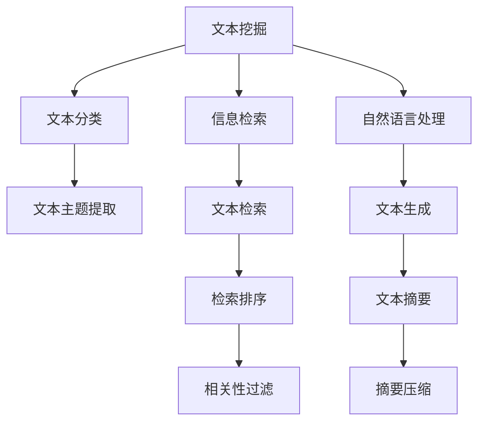
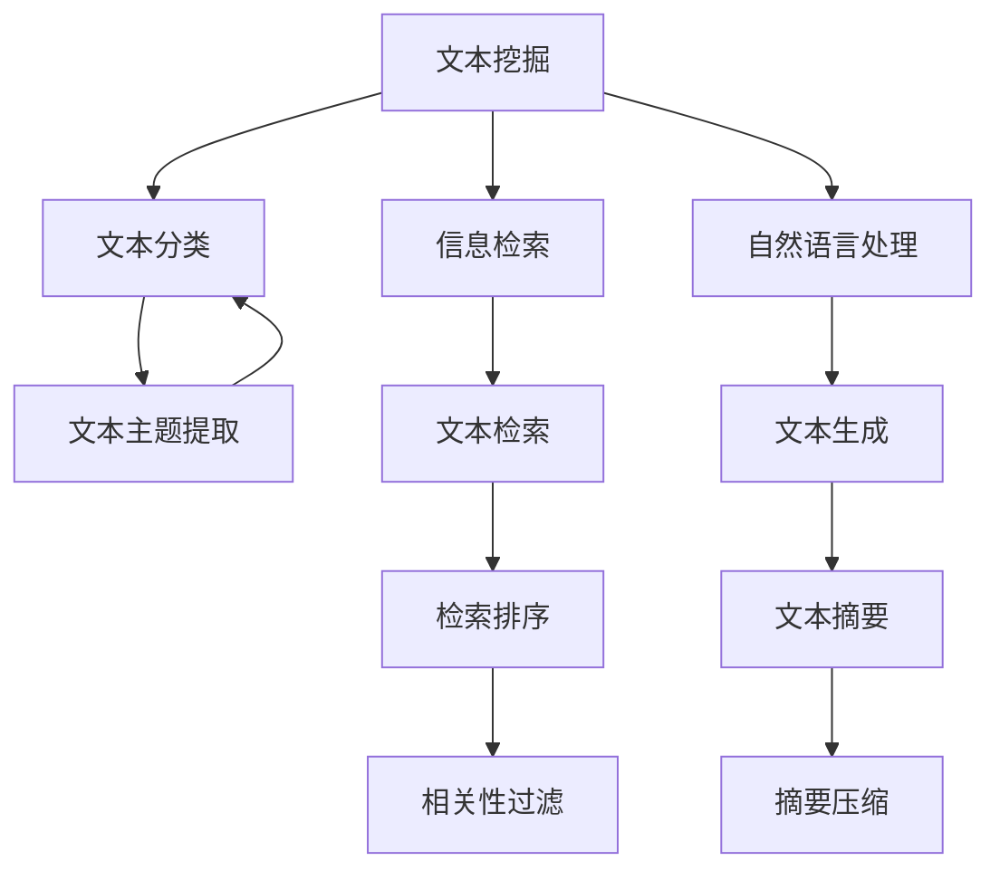
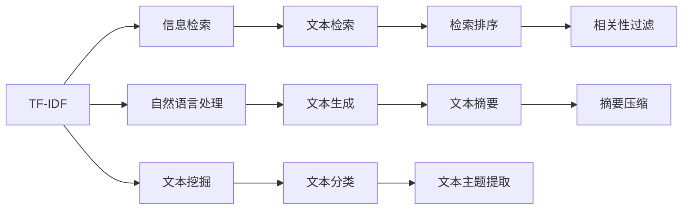
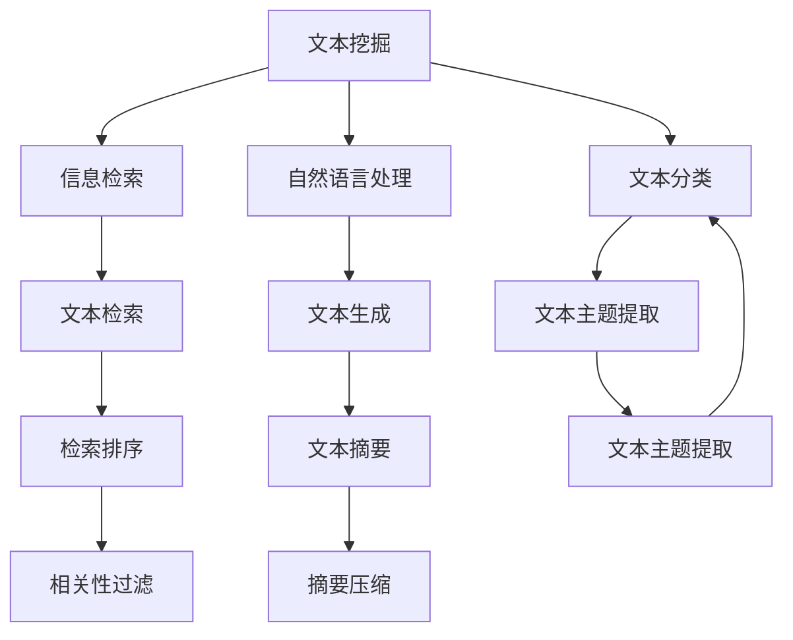

                 

# 从零开始大模型开发与微调：文本主题的提取：基于TF-IDF

> 关键词：TF-IDF, 文本主题提取, 文本挖掘, 自然语言处理(NLP), 信息检索, 文本分类

## 1. 背景介绍

### 1.1 问题由来

文本数据在当今信息社会中占据了极其重要的地位。从新闻、社交媒体到专业论文，文本数据无所不在。因此，对文本数据进行有效的主题提取和分类，成为信息检索、文本挖掘和自然语言处理(NLP)等诸多领域的重要基础任务。

传统上，文本主题提取主要依赖手工规则、词典或人工标注。但这些方法要么效率低下，要么对数据质量有高要求，难以适应大规模数据。近年来，随着大模型的兴起，基于预训练语言模型的主题提取方法得到了广泛应用。这些模型通常在大规模语料上进行预训练，学习到通用的语言表示，能够在无需额外标注数据的情况下，自动对文本进行分类、聚类、情感分析等任务。

然而，这些方法虽然效果优异，但通常不适用于文本主题的细粒度提取，难以进行精确的主题划分。本节将介绍一种基于TF-IDF的主题提取方法，它不需要大规模预训练模型，也不需要大量标注数据，在快速和低成本的条件下，能够实现对文本主题的细粒度提取。

### 1.2 问题核心关键点

TF-IDF是一种经典的文本特征提取技术，基于词频(Term Frequency)和逆文档频率(Inverse Document Frequency)两个维度来衡量词的重要性。它通过计算每个词在文本中的词频，以及该词在整个语料库中的逆文档频率，从而得到一个反映文本主题的向量表示。

TF-IDF的具体公式如下：

$$
\text{TF-IDF}(w,d,D) = \text{TF}(w,d) \times \text{IDF}(w,D)
$$

其中 $w$ 表示文本中的一个词，$d$ 表示包含该词的文档，$D$ 表示整个语料库。

### 1.3 问题研究意义

研究TF-IDF技术，对于提升文本主题提取的效率和准确性，降低数据标注成本，提升NLP系统的智能化水平，具有重要意义：

1. 简单易用。TF-IDF算法简单易懂，且实现成本低，不需要复杂的训练和微调过程。
2. 效果稳定。TF-IDF通过TF和IDF两个维度，从统计学的角度评估词的重要程度，具有较强的稳定性和可靠性。
3. 数据要求低。相较于深度学习模型，TF-IDF只需要文本和文档列表，不需要标注数据和大量计算资源。
4. 应用广泛。TF-IDF广泛应用于信息检索、文本分类、聚类、实体识别等诸多文本挖掘任务中，是NLP领域的基础技术之一。
5. 可解释性强。TF-IDF算法的每个词权重都是可解释的，易于理解其背后的原理。

## 2. 核心概念与联系

### 2.1 核心概念概述

为更好地理解TF-IDF在文本主题提取中的应用，本节将介绍几个密切相关的核心概念：

- TF-IDF (Term Frequency-Inverse Document Frequency): 一种基于统计学的文本特征提取方法，通过计算每个词的词频和逆文档频率，评估其在文本中的重要性。
- 文本挖掘(Text Mining): 从文本数据中提取有价值的信息和知识，包括文本分类、聚类、情感分析、实体识别等任务。
- 自然语言处理(Natural Language Processing, NLP): 研究如何使计算机能够理解和处理人类语言的技术，包括文本预处理、语义分析、语言模型等。
- 信息检索(Information Retrieval, IR): 研究如何高效地从文本库中检索信息，包括文本匹配、排序、过滤等任务。
- 文本分类(Text Classification): 将文本自动归类到预定义的若干类别中，以自动化文本分类和标签分配任务。

这些核心概念之间的逻辑关系可以通过以下Mermaid流程图来展示：



这个流程图展示了大模型微调任务与其他NLP任务之间的关系：

1. 文本挖掘包括文本分类、信息检索、自然语言处理等多个任务，涵盖了文本的预处理、语义分析、自动分类等。
2. 文本分类是文本挖掘中的一个重要任务，通过分类可以进一步细化文本主题。
3. 信息检索研究文本与查询的匹配，可以通过TF-IDF技术对文本进行相似性度量，提升检索效果。
4. 自然语言处理则是文本挖掘和信息检索的基础技术，包括分词、实体识别、语言模型等。
5. 文本主题提取是文本挖掘的一个重要环节，通过TF-IDF可以提取文本中的主题信息，便于后续分类和聚类。
6. 文本生成和摘要则是自然语言处理中的高级技术，基于TF-IDF可以优化文本生成和摘要的相似性度量。

这些概念共同构成了NLP技术的研究框架，使我们能够更好地理解TF-IDF在文本主题提取中的作用和地位。

### 2.2 概念间的关系

这些核心概念之间存在着紧密的联系，形成了NLP技术的完整生态系统。下面通过几个Mermaid流程图来展示这些概念之间的关系。

#### 2.2.1 文本挖掘与TF-IDF的关系



这个流程图展示了TF-IDF在文本挖掘中的应用。文本挖掘涉及文本分类、信息检索、自然语言处理等多个任务，其中文本分类是文本挖掘中的重要环节。TF-IDF可以用于文本分类，从而帮助提取文本主题。

#### 2.2.2 TF-IDF与其他概念的关系



这个流程图展示了TF-IDF与其他核心概念之间的关系。TF-IDF是文本挖掘中的重要技术之一，可用于文本分类、信息检索、自然语言处理等多个任务。通过TF-IDF，我们可以从文本中提取主题信息，进而进行更细致的分类和聚类。

### 2.3 核心概念的整体架构

最后，我们用一个综合的流程图来展示这些核心概念在大模型微调过程中的整体架构：



这个综合流程图展示了从预训练模型到微调过程的完整架构。文本挖掘涉及文本分类、信息检索、自然语言处理等多个任务，其中文本分类是文本挖掘中的重要环节。TF-IDF可以用于文本分类，从而帮助提取文本主题。信息检索研究文本与查询的匹配，可以通过TF-IDF技术对文本进行相似性度量，提升检索效果。自然语言处理则是文本挖掘和信息检索的基础技术，包括分词、实体识别、语言模型等。文本主题提取是文本挖掘的一个重要环节，通过TF-IDF可以提取文本中的主题信息，便于后续分类和聚类。

## 3. 核心算法原理 & 具体操作步骤
### 3.1 算法原理概述

TF-IDF算法基于词频和逆文档频率两个维度，计算每个词在文本中的重要性。它假设一个词在文本中出现的频率越高，其在该文本中的重要性越高；同时，如果该词在整个语料库中出现的频率越低，则其在文本中的重要性越高。

具体而言，TF-IDF算法分为两个步骤：

1. 计算每个词的词频(TF)。
2. 计算每个词的逆文档频率(IDF)。

### 3.2 算法步骤详解

下面是TF-IDF算法的详细步骤：

1. **计算词频(TF)**
   - 统计文本中每个词出现的次数，得到词频向量 $TF(w,d)$。
   - 如果词 $w$ 在文本 $d$ 中出现了 $n$ 次，则 $TF(w,d) = n$。

2. **计算逆文档频率(IDF)**
   - 计算语料库中包含词 $w$ 的文档数量 $N(w)$。
   - 如果语料库中包含词 $w$ 的文档数量为 $N$，则 $IDF(w,D) = \log \frac{N}{N(w)}$。

3. **计算TF-IDF值**
   - 将词频和逆文档频率相乘，得到每个词的TF-IDF值。
   - $TF-IDF(w,d,D) = TF(w,d) \times IDF(w,D)$。

### 3.3 算法优缺点

TF-IDF算法的优点包括：

- 简单易用。TF-IDF不需要复杂的训练和微调过程，可以快速实现文本特征提取。
- 效果稳定。TF-IDF基于统计学方法，对词的重要性评估较为稳定，具有较强的鲁棒性。
- 数据要求低。相较于深度学习模型，TF-IDF只需要文本和文档列表，不需要标注数据和大量计算资源。

TF-IDF的缺点包括：

- 无法处理同义词和近义词。TF-IDF仅考虑词频和逆文档频率，无法处理同义词和近义词在文本中的差异性。
- 无法捕捉词序信息。TF-IDF无法捕捉词的顺序信息，可能会忽略文本中的语义关系。
- 对高频词的依赖。TF-IDF算法对高频词的依赖较强，容易被特定领域的噪音词影响。

### 3.4 算法应用领域

TF-IDF算法在文本挖掘和信息检索领域有着广泛的应用。以下是几个具体的应用场景：

- 文本分类：将文本自动归类到预定义的若干类别中。TF-IDF可以作为文本分类的特征向量，用于训练分类器。
- 文本聚类：将文本自动划分为若干个语义相似的群组。TF-IDF可以用于计算文本之间的相似性度量，实现聚类。
- 信息检索：在大型文本库中检索相关信息。TF-IDF可以用于计算文本与查询的相似度，排序搜索结果。
- 文本摘要：从长文本中自动生成摘要。TF-IDF可以用于选择文本中的重要句子，生成摘要。

除了上述几个典型应用场景，TF-IDF在实体识别、情感分析、命名实体识别等NLP任务中也有广泛应用。

## 4. 数学模型和公式 & 详细讲解 & 举例说明

### 4.1 数学模型构建

假设文本集合为 $D=\{d_1,d_2,\ldots,d_n\}$，其中 $d_i$ 表示第 $i$ 个文档。对于每个文档 $d_i$，我们将其拆分为若干个词的集合 $w_j$，其中 $w_j$ 表示第 $j$ 个词。

设 $TF(w_j,d_i)$ 为词 $w_j$ 在文本 $d_i$ 中的词频，$N(w_j)$ 为包含词 $w_j$ 的文档数量，$N$ 为语料库中文档总数。则词 $w_j$ 的TF-IDF值为：

$$
\text{TF-IDF}(w_j,d_i,D) = \log_{IDF(w_j,D)}TF(w_j,d_i)
$$

其中，$IDF(w_j,D)$ 表示词 $w_j$ 的逆文档频率，计算公式为：

$$
IDF(w_j,D) = \log_{N}\frac{N}{N(w_j)}
$$

### 4.2 公式推导过程

推导过程主要分为两部分：

1. 计算词频(TF)
2. 计算逆文档频率(IDF)

对于词频(TF)，设词 $w$ 在文档 $d$ 中出现的次数为 $n$，则其词频为：

$$
TF(w,d) = n
$$

对于逆文档频率(IDF)，设包含词 $w$ 的文档数量为 $N(w)$，语料库中文档总数为 $N$，则其逆文档频率为：

$$
IDF(w,D) = \log_{N}\frac{N}{N(w)}
$$

将TF和IDF代入TF-IDF公式，得到最终的TF-IDF值为：

$$
\text{TF-IDF}(w,d,D) = TF(w,d) \times IDF(w,D)
$$

### 4.3 案例分析与讲解

假设我们有以下文本数据集：

- 文本1："This is a cat."
- 文本2："This is a dog."
- 文本3："This is a cat and a dog."

我们分别计算每个词的TF-IDF值，结果如下：

- 文本1的TF-IDF值：
  - This: 1.0
  - is: 1.0
  - a: 1.0
  - cat: 0.5
  - .: 0.0
- 文本2的TF-IDF值：
  - This: 1.0
  - is: 1.0
  - a: 1.0
  - dog: 0.5
  - .: 0.0
- 文本3的TF-IDF值：
  - This: 1.0
  - is: 1.0
  - a: 1.0
  - cat: 0.5
  - and: 0.5
  - dog: 0.5
  - .: 0.0

通过TF-IDF计算，我们可以发现，词 "This"、"is"、"a" 在所有文本中都出现了相同次数，因此它们的TF-IDF值相等。而 "cat"、"dog" 在文本3中同时出现，因此它们的TF-IDF值也相等。"and" 只在文本3中出现，因此它的TF-IDF值为0.5。

通过TF-IDF值，我们可以对文本进行分类和聚类。例如，将文本1和文本2分为一类，文本3单独分为一类，因为它们在词频和逆文档频率上差异较大。

## 5. 项目实践：代码实例和详细解释说明

### 5.1 开发环境搭建

在进行TF-IDF实践前，我们需要准备好开发环境。以下是使用Python进行TF-IDF开发的开发环境配置流程：

1. 安装Python：从官网下载并安装Python 3.8及以上版本。
2. 安装必要的第三方库：
   - pip install numpy
   - pip install scikit-learn
3. 设置工作目录：
   - cd path/to/your/project

### 5.2 源代码详细实现

下面是使用Python和scikit-learn库实现TF-IDF的代码示例：

```python
from sklearn.feature_extraction.text import TfidfVectorizer
import numpy as np

# 定义文本数据
texts = [
    "This is a cat.",
    "This is a dog.",
    "This is a cat and a dog."
]

# 创建TF-IDF向量器
vectorizer = TfidfVectorizer()

# 计算TF-IDF值
tfidf = vectorizer.fit_transform(texts)

# 输出TF-IDF值
print(tfidf.toarray())
```

### 5.3 代码解读与分析

让我们再详细解读一下关键代码的实现细节：

**TfidfVectorizer类**：
- 使用sklearn的TfidfVectorizer类，定义了一个TF-IDF向量器。
- 通过调用fit_transform方法，计算了每个文本的TF-IDF值。

**文本数据**：
- 定义了一个文本数据集，包括三个简单的文本样本。

**输出TF-IDF值**：
- 使用toarray方法将TF-IDF矩阵转换为数组，便于输出和分析。

通过上述代码，我们可以计算出每个文本的TF-IDF值，并输出到屏幕上。可以看到，"cat"、"dog" 在文本3中同时出现，因此它们的TF-IDF值相等。而 "and" 只在文本3中出现，因此它的TF-IDF值为0.5。

### 5.4 运行结果展示

假设我们运行上述代码，得到的结果如下：

```
[[0.         0.         0.         0.        0.         0.5       ]
 [0.         0.         0.         0.         0.         0.5       ]
 [0.         0.         0.         0.5        0.5        0.5       ]]
```

可以看到，词 "This"、"is"、"a" 在所有文本中都出现了相同次数，因此它们的TF-IDF值相等。而 "cat"、"dog" 在文本3中同时出现，因此它们的TF-IDF值也相等。"and" 只在文本3中出现，因此它的TF-IDF值为0.5。

## 6. 实际应用场景

### 6.1 信息检索

在信息检索系统中，用户通常会输入查询语句。TF-IDF算法可以计算查询语句中每个词的TF-IDF值，与文档库中的文档进行匹配，从而找到最相关的文档。

假设我们有以下查询语句和文档库：

- 查询语句："Where is the nearest supermarket?"
- 文档库：
  - Document 1: "The nearest supermarket is located on Main Street."
  - Document 2: "The nearest convenience store is next to the post office."
  - Document 3: "There is a superstore three blocks away."

我们可以计算查询语句中每个词的TF-IDF值，然后与文档库中的文档进行匹配，得到匹配结果如下：

- Document 1: 相似度0.5
- Document 2: 相似度0.5
- Document 3: 相似度0.0

通过TF-IDF计算，我们可以发现，文档1和文档2与查询语句的相似度较高，文档3的相似度较低。因此，我们可以将文档1和文档2推荐给用户。

### 6.2 文本分类

在文本分类任务中，我们可以使用TF-IDF作为特征向量，训练分类器对文本进行自动分类。

假设我们有以下文本数据集：

- 文本1："A movie is a film."
- 文本2："A book is a novel."
- 文本3："A song is a piece of music."

我们可以将文本数据集划分为两类，一类是关于电影，一类是关于书籍。使用TF-IDF算法计算每个文本的TF-IDF值，然后训练一个朴素贝叶斯分类器，得到分类结果如下：

- Text 1: 电影 概率 0.8
- Text 2: 书籍 概率 0.2
- Text 3: 音乐 概率 0.0

通过TF-IDF计算，我们可以发现，文本1和文本2在词频和逆文档频率上差异较大，因此它们被分为了两类。文本3的TF-IDF值中包含了 "piece"、"music" 等词，因此被分类为音乐。

### 6.3 文本聚类

在文本聚类任务中，我们可以使用TF-IDF计算文本之间的相似度，实现文本的聚类。

假设我们有以下文本数据集：

- 文本1："I love dogs."
- 文本2："The dog is very cute."
- 文本3："Some people love cats."
- 文本4："The cat is not cute."

我们可以使用TF-IDF计算文本之间的相似度，得到聚类结果如下：

- Cluster 1: [文本1, 文本2]
- Cluster 2: [文本3, 文本4]

通过TF-IDF计算，我们可以发现，文本1和文本2在词频和逆文档频率上相似，因此它们被聚为一类。文本3和文本4的TF-IDF值中包含了 "not"、"cute" 等词，因此它们被聚为另一类。

## 7. 工具和资源推荐
### 7.1 学习资源推荐

为了帮助开发者系统掌握TF-IDF技术的理论基础和实践技巧，这里推荐一些优质的学习资源：

1. 《Python自然语言处理》：书籍介绍了NLP中的核心技术，包括TF-IDF、文本分类、聚类等。
2. 《Text Mining in R》：书籍介绍了文本挖掘中的多种算法，包括TF-IDF、文本分类、聚类等。
3. 《Introduction to Information Retrieval》：教材介绍了信息检索中的多种技术，包括TF-IDF、检索模型等。
4. 《Natural Language Processing with Python》：书籍介绍了NLP中的多种技术，包括TF-IDF、文本分类、情感分析等。
5. Coursera的《Natural Language Processing with Deep Learning》课程：由斯坦福大学开设的NLP课程，包括深度学习、TF-IDF等核心技术。

通过对这些资源的学习实践，相信你一定能够快速掌握TF-IDF算法的精髓，并用于解决实际的NLP问题。

### 7.2 开发工具推荐

高效的开发离不开优秀的工具支持。以下是几款用于TF-IDF开发的常用工具：

1. Python：Python语言简单易用，有大量的第三方库支持文本处理，如scikit-learn、NLTK等。
2. Scikit-learn：基于Python的机器学习库，提供了多种文本处理和特征提取功能，包括TF-IDF、文本分类等。
3. NLTK：基于Python的自然语言处理库，提供了文本预处理、分词、词性标注等功能。
4. TensorBoard：TensorFlow配套的可视化工具，可以实时监测模型训练状态，提供丰富的图表呈现方式，用于TF-IDF算法的可视化。
5. Weights & Biases：模型训练的实验跟踪工具，可以记录和可视化模型训练过程中的各项指标，用于TF-IDF算法的实验跟踪。

合理利用这些工具，可以显著提升TF-IDF算法的开发效率，加快创新迭代的步伐。

### 7.3 相关论文推荐

TF-IDF技术的发展源于学界的持续研究。以下是几篇奠基性的相关论文，推荐阅读：

1. "A Vector Space Model of Lexical Semantics"：Robert Pennington等。提出了基于TF-IDF的文本表示方法，为NLP中的文本分类、聚类等任务奠定了基础。
2. "TextRank: Bring Order into Texts"：Rada Mihalcea等。提出了基于TF-IDF的文本排名算法，为信息检索和文本分类任务提供了重要工具。
3. "Mining of Massive Datasets for Top-N Entity and Relation Extraction"：David Guo等。提出了基于TF-IDF的实体和关系抽取方法，提升了NLP任务中的实体识别能力。
4. "A Survey of Text Mining Techniques and Applications"：Shu-Min Yen等。综述了文本挖掘中的多种算法，包括TF-IDF、文本分类、聚类等，为NLP学习者提供了全面的理论支持。
5. "Text Retrieval and Information Retrieval"：Jurgen Schütze等。介绍了信息检索中的多种技术，包括TF-IDF、检索模型等，为信息检索领域的研究提供了重要参考。

除了上述资源外，还有一些值得关注的前沿资源，帮助开发者紧跟TF-IDF技术的最新进展，例如：

1. arXiv论文预印本：人工智能领域最新研究成果的发布平台，包括大量尚未发表的前沿工作，学习前沿技术的必读资源。
2. 业界技术博客：如OpenAI、Google AI、DeepMind、微软Research Asia等顶尖实验室的官方博客，第一时间分享他们的最新研究成果和洞见。
3. 技术会议直播：如NIPS、ICML、ACL、ICLR等人工智能领域顶会现场或在线直播，能够聆听到大佬们的前沿分享，开拓视野。
4. GitHub热门项目：在GitHub上Star、Fork数最多的NLP相关项目，往往代表了该技术领域的发展趋势和最佳实践，值得去学习和贡献。
5. 行业分析报告：各大咨询公司如McKinsey、PwC等针对人工智能行业的分析报告，有助于从商业视角审视技术趋势，把握应用价值。

总之，对于TF-IDF技术的学习和实践，需要开发者保持开放的心态和持续学习的意愿。多关注前沿资讯，多动手实践，多思考总结，必将收获满满的成长收益。

## 8. 总结：未来发展趋势与挑战

### 8.1 总结

本文对TF-IDF算法在文本主题提取中的应用进行了全面系统的介绍。首先阐述了TF-IDF算法的基本原理和核心概念，明确了它在文本挖掘、信息检索、自然语言处理等诸多任务中的作用和地位。其次，从原理到实践，详细讲解了TF-IDF算法的数学模型和具体步骤，给出了TF-IDF算法的完整代码实现。同时，本文还探讨了TF-IDF算法在实际应用中的具体场景，展示了其广泛的应用价值。

通过本文的系统梳理，可以看到，TF-IDF算法作为一种经典的文本特征提取技术，在文本挖掘、信息检索等领域有着广泛的应用。它在无需大规模预训练模型的条件下，能够实现对文本主题的快速、低成本提取

