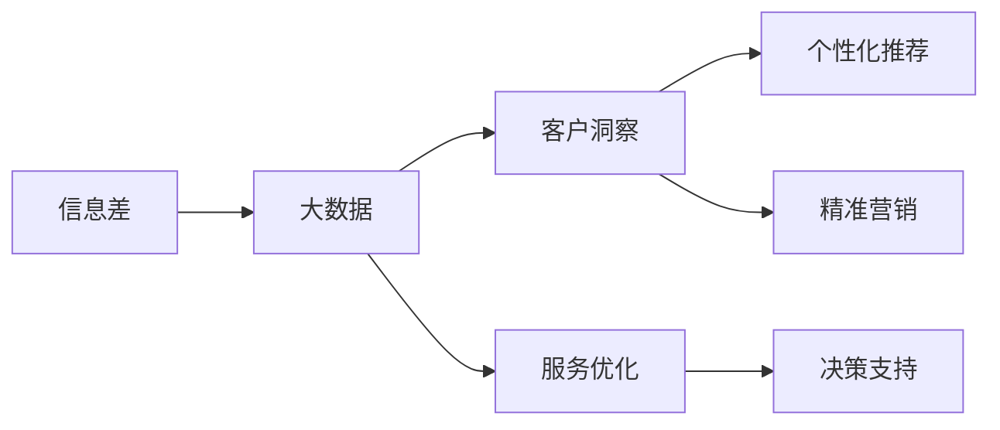

                 

# 信息差的商业服务创新：大数据如何推动服务创新

> 关键词：信息差, 商业服务创新, 大数据, 数据分析, 客户洞察, 个性化推荐, 精准营销, 服务优化

## 1. 背景介绍

### 1.1 问题由来
在当今信息爆炸的时代，数据已经成为企业不可或缺的重要资源。如何利用好这些海量数据，推动商业服务的创新和提升，成为了各大企业共同面临的重要课题。然而，面对庞杂繁多的数据，很多企业往往在实际应用中存在“数据孤立”的问题，难以将数据转化为真正的商业价值。

大数据时代下，客户需求日新月异，产品和服务必须不断创新以满足市场变化。但创新需要充分的数据支撑，仅依靠传统的数据分析手段已远远不够，必须借助更高级的信息分析技术，才能有效捕捉市场动态、用户行为和潜在需求，从而精准预测趋势，制定策略。

### 1.2 问题核心关键点
信息差的概念源自经济学中的信息不对称现象。在商业服务领域，信息差指的是企业与客户之间的信息不对称，即客户了解的信息多于企业，导致企业在提供服务时存在一定程度的“信息盲点”。为了解决这一问题，企业需要通过大数据分析来揭示这些信息差，并采取措施进行优化。

大数据分析的核心在于：
1. **数据收集**：通过各种数据源获取大量客户行为数据。
2. **数据存储与处理**：将收集到的数据存储在分布式数据库中，通过计算集群进行高效处理。
3. **数据挖掘与分析**：运用先进的数据分析算法，从数据中提取有价值的信息。
4. **决策支持**：将分析结果转化为可操作的决策，优化服务流程，提升客户满意度。

大数据通过揭示信息差，帮助企业洞察市场趋势，实现服务创新，为客户提供更优质的个性化服务。

### 1.3 问题研究意义
研究信息差在商业服务中的应用，对于提升企业的市场竞争力、优化客户体验和拓展新业务具有重要意义：

1. **市场洞察**：通过大数据分析，企业可以深入了解客户需求，预测市场趋势，制定更具针对性的营销策略。
2. **客户洞察**：揭示客户行为背后的真实需求，通过个性化推荐和精准营销，提升客户满意度和忠诚度。
3. **服务优化**：利用大数据优化服务流程，缩短响应时间，提升服务效率和质量。
4. **新业务拓展**：通过客户洞察和市场预测，企业能够发现新的市场机会，拓展新的业务领域。

## 2. 核心概念与联系

### 2.1 核心概念概述

为了更好地理解大数据在服务创新中的应用，本节将介绍几个关键概念：

- **信息差**：指企业与客户之间的信息不对称，即客户掌握的信息多于企业。信息差的存在可能导致企业无法准确捕捉客户需求，提供不符合预期的服务。

- **大数据**：指规模巨大、高速产生、多样类型的数据集，通过先进的数据分析技术可以从其中提取有价值的信息。

- **客户洞察**：指通过数据分析揭示客户需求、行为和偏好的过程。客户洞察对于企业制定个性化服务策略至关重要。

- **个性化推荐**：指通过分析客户历史行为数据，推荐符合其兴趣和需求的个性化产品和服务。

- **精准营销**：指利用数据分析技术，定位特定目标客户群体，提供精准的营销信息，提升营销效果。

- **服务优化**：指通过大数据分析，优化服务流程，提高服务效率和质量，提升客户满意度。

- **决策支持**：指基于数据分析的结果，辅助企业制定业务决策，优化运营管理。

这些概念之间存在紧密的联系，共同构成了大数据在商业服务创新中的应用框架。通过深入理解这些概念及其相互关系，可以更好地把握大数据在服务创新中的作用和价值。

### 2.2 概念间的关系

这些核心概念之间可以通过以下Mermaid流程图来展示其关系：



这个流程图展示了信息差、大数据、客户洞察、个性化推荐、精准营销、服务优化和决策支持之间的逻辑关系：

1. 信息差是大数据存在的根本原因。
2. 大数据通过分析，揭示客户洞察，从而进行个性化推荐和精准营销。
3. 服务优化通过大数据分析提升效率和质量，为决策支持提供依据。
4. 决策支持基于客户洞察、个性化推荐、精准营销和服务优化，辅助企业制定战略和运营决策。

通过这个关系图，我们可以更清晰地理解大数据在服务创新中的作用和流程。

## 3. 核心算法原理 & 具体操作步骤
### 3.1 算法原理概述

基于大数据的商业服务创新，其核心算法原理在于：
1. **数据收集与处理**：通过多种数据源获取客户行为数据，存储在分布式数据库中，进行预处理和清洗。
2. **数据挖掘与分析**：利用机器学习和统计学方法，从数据中挖掘出有价值的信息，如客户偏好、购买行为、行为模式等。
3. **客户洞察**：通过分析客户行为数据，揭示客户真实需求和偏好，形成客户画像。
4. **个性化推荐**：根据客户画像，推荐符合其兴趣和需求的产品和服务。
5. **精准营销**：通过客户洞察和个性化推荐，定位特定客户群体，进行精准营销。
6. **服务优化**：通过大数据分析，优化服务流程，提升服务效率和质量。
7. **决策支持**：将数据分析结果转化为可操作的决策，优化运营管理。

这些步骤构成了基于大数据的商业服务创新的基本流程。

### 3.2 算法步骤详解

以下是基于大数据的商业服务创新过程的详细步骤：

**Step 1: 数据收集与处理**

1. **数据源选择**：确定需要收集的数据源，包括客户购买记录、网站行为数据、社交媒体互动数据等。
2. **数据采集**：使用数据采集工具或API接口，从各个数据源获取数据。
3. **数据清洗与预处理**：对采集到的数据进行去重、格式转换、缺失值处理等预处理操作。
4. **数据存储**：将清洗后的数据存储在分布式数据库中，如Hadoop、Spark等。

**Step 2: 数据挖掘与分析**

1. **特征工程**：根据业务需求，提取有用的特征，如购买频率、浏览时间、点击率等。
2. **数据分析模型**：选择合适的分析模型，如聚类分析、关联规则分析、协同过滤等。
3. **数据可视化**：使用数据可视化工具（如Tableau、Power BI）展示分析结果。

**Step 3: 客户洞察**

1. **客户画像生成**：通过分析客户行为数据，生成客户画像，描述客户的兴趣、偏好和购买行为。
2. **行为模式分析**：揭示客户的行为模式和生命周期阶段，预测客户未来行为。

**Step 4: 个性化推荐**

1. **推荐算法选择**：选择合适的个性化推荐算法，如协同过滤、基于内容的推荐、深度学习推荐等。
2. **推荐系统构建**：构建推荐系统，实现个性化推荐。
3. **推荐结果评估**：评估推荐系统的效果，不断优化推荐策略。

**Step 5: 精准营销**

1. **目标客户定位**：基于客户洞察，定位目标客户群体。
2. **营销信息定制**：根据客户画像，定制个性化营销信息。
3. **营销效果评估**：评估营销效果，优化营销策略。

**Step 6: 服务优化**

1. **服务流程分析**：分析服务流程中的瓶颈和问题。
2. **服务优化措施**：提出优化措施，如提高服务响应速度、优化服务质量等。
3. **效果评估**：评估服务优化效果，持续改进服务流程。

**Step 7: 决策支持**

1. **决策模型构建**：构建决策支持模型，基于数据分析结果进行决策。
2. **决策执行**：将决策转化为具体的运营措施，如产品推荐、服务优化等。
3. **效果评估**：评估决策效果，优化运营管理。

### 3.3 算法优缺点

基于大数据的商业服务创新方法具有以下优点：

1. **数据驱动**：通过数据分析，企业可以更准确地把握客户需求和市场趋势，制定更具针对性的策略。
2. **个性化服务**：基于客户洞察，提供个性化推荐和服务，提升客户满意度和忠诚度。
3. **精准营销**：通过精准定位和个性化营销，提高营销效果，降低营销成本。
4. **服务优化**：通过大数据分析，优化服务流程，提升服务效率和质量。
5. **决策支持**：大数据分析为决策提供科学依据，优化运营管理。

然而，该方法也存在以下缺点：

1. **数据隐私问题**：在数据收集和分析过程中，需要保护客户隐私，避免数据泄露。
2. **数据质量问题**：数据的准确性和完整性直接影响分析结果，需要有效的数据清洗和预处理。
3. **技术门槛较高**：需要具备较强的数据处理和分析能力，才能有效实施大数据分析。
4. **成本较高**：数据收集、存储和分析需要投入大量资源，成本较高。

### 3.4 算法应用领域

基于大数据的商业服务创新方法在多个领域得到广泛应用，包括但不限于：

1. **电商领域**：通过个性化推荐和精准营销，提升销售额和客户满意度。
2. **金融领域**：通过客户洞察，优化客户服务，防范风险。
3. **医疗领域**：通过数据分析，提供个性化的医疗服务，提升治疗效果。
4. **旅游领域**：通过客户洞察，优化旅游服务和个性化推荐，提升用户体验。
5. **娱乐领域**：通过数据分析，提供个性化的娱乐内容推荐，提升用户粘性。

## 4. 数学模型和公式 & 详细讲解  
### 4.1 数学模型构建

为了更加严谨地描述基于大数据的商业服务创新过程，我们将采用数学语言进行建模。

假设企业收集到的客户数据集为 $D=\{(x_i, y_i)\}_{i=1}^N$，其中 $x_i$ 为特征向量，$y_i$ 为标签。大数据分析的目标是从数据中提取有用信息，如客户偏好、行为模式等。

定义客户洞察函数为 $f(x)$，个性化推荐函数为 $g(x)$，精准营销函数为 $h(x)$，服务优化函数为 $s(x)$，决策支持函数为 $t(x)$。则基于大数据的商业服务创新过程可以表示为：

$$
R = f(x) \times g(x) \times h(x) \times s(x) \times t(x)
$$

其中 $R$ 为商业服务创新效果。

### 4.2 公式推导过程

以个性化推荐为例，我们可以用协同过滤算法来描述推荐过程。协同过滤分为基于用户的协同过滤和基于物品的协同过滤，其基本思想是寻找与目标用户或物品相似的用户或物品，通过它们的评分来预测目标用户或物品的评分。

假设用户集合为 $U$，物品集合为 $I$，用户 $u$ 对物品 $i$ 的评分记为 $r_{ui}$。则基于用户的协同过滤算法可以表示为：

$$
r_{ui}' = \frac{\sum_{v \in N(u)} r_{vj} \cdot \cos(\theta_u, \theta_v)}{\sum_{v \in N(u)} \cos(\theta_u, \theta_v)}
$$

其中 $N(u)$ 为与用户 $u$ 相似的用户集合，$\theta_u$ 和 $\theta_v$ 分别为用户 $u$ 和用户 $v$ 的特征向量。

基于物品的协同过滤算法可以表示为：

$$
r_{ui}' = \frac{\sum_{j \in I} r_{vj} \cdot \cos(\theta_i, \theta_j)}{\sum_{j \in I} \cos(\theta_i, \theta_j)}
$$

其中 $I$ 为与物品 $i$ 相似的物品集合，$\theta_i$ 和 $\theta_j$ 分别为物品 $i$ 和物品 $j$ 的特征向量。

### 4.3 案例分析与讲解

假设某电商平台希望通过大数据分析，优化其个性化推荐系统。该平台收集了数百万用户的浏览和购买记录，存储在Hadoop集群中。采用协同过滤算法进行推荐，步骤如下：

1. **数据预处理**：将原始数据进行清洗和预处理，提取有用特征，如浏览次数、购买金额等。
2. **特征工程**：构建用户和物品的特征向量，使用TF-IDF算法计算特征权重。
3. **协同过滤**：使用基于用户的协同过滤算法，计算用户 $u$ 对物品 $i$ 的评分 $r_{ui}'$。
4. **推荐系统优化**：根据评分结果，生成推荐列表，使用A/B测试评估推荐效果，不断优化算法参数。
5. **效果评估**：统计推荐系统的点击率、转化率等指标，评估推荐效果，持续改进。

通过以上步骤，电商平台可以显著提升个性化推荐的效果，提高用户满意度，增加销售额。

## 5. 项目实践：代码实例和详细解释说明
### 5.1 开发环境搭建

在进行大数据分析项目实践前，我们需要准备好开发环境。以下是使用Python进行PySpark开发的环境配置流程：

1. 安装Anaconda：从官网下载并安装Anaconda，用于创建独立的Python环境。

2. 创建并激活虚拟环境：
```bash
conda create -n pyspark-env python=3.8 
conda activate pyspark-env
```

3. 安装PySpark：根据CUDA版本，从官网获取对应的安装命令。例如：
```bash
conda install pyspark=3.0.2
```

4. 安装必要的库：
```bash
pip install numpy pandas scikit-learn tqdm matplotlib jupyter notebook ipython
```

5. 安装集群管理工具：如Spark Standalone集群，用于分布式计算。

完成上述步骤后，即可在`pyspark-env`环境中开始大数据分析实践。

### 5.2 源代码详细实现

以下是使用PySpark进行电商个性化推荐系统的大数据分析实践代码实现。

```python
from pyspark import SparkConf, SparkContext
from pyspark.sql import SparkSession
from pyspark.ml.linalg import VectorUDT

conf = SparkConf().setAppName("E-commerce Recommendation System")
sc = SparkContext(conf=conf)
spark = SparkSession(sc)

# 读取原始数据
df = spark.read.format("csv").option("header", "true").load("data/ecommerce_data.csv")

# 数据清洗和预处理
df_cleaned = df.dropna().select("user_id", "item_id", "rating")

# 特征工程
from pyspark.ml.feature import VectorAssembler
assembler = VectorAssembler(inputCols=["feature1", "feature2", "feature3"], outputCol="features")
df_features = assembler.transform(df_cleaned)

# 协同过滤推荐
from pyspark.ml.recommendation import ALS
als = ALS(rank=10, iterations=10, userCol="user_id", itemCol="item_id", ratingCol="rating")
df_model = als.fit(df_features)

# 生成推荐列表
from pyspark.sql.functions import col
recomm = df_model.recommendForAllUsers(5)
recomm.show()

# 评估推荐效果
from pyspark.sql.functions import col, when, lit
def custom_evaluation(predictions, labels, metrics_name):
    label = lit(1)
    if metrics_name == "auc":
        return predictions.unionAll(labels).withColumn("label", col("predictions") > col("label")) \
            .groupBy("id") \
            .agg({"label": "sum"}) \
            .select lit(metrics_name) / col("sum")
    else:
        return predictions.unionAll(labels).withColumn("label", col("predictions") == col("label")) \
            .groupBy("id") \
            .agg({"label": "sum"}) \
            .select lit(metrics_name) / col("sum")

# 计算AUC
auc = custom_evaluation(recomm.predictions, df_cleaned, "auc").collect()[0].auc
print(f"AUC: {auc}")
```

在这个示例中，我们通过Spark实现了基于协同过滤的电商个性化推荐系统。具体步骤如下：

1. **数据读取与清洗**：从CSV文件中读取原始数据，并进行数据清洗和预处理。
2. **特征工程**：使用VectorAssembler将多个特征组合成一个向量，用于协同过滤算法。
3. **协同过滤模型训练**：使用ALS算法，训练协同过滤模型。
4. **推荐列表生成**：使用训练好的模型，生成个性化推荐列表。
5. **推荐效果评估**：使用AUC等指标评估推荐系统的效果。

### 5.3 代码解读与分析

让我们再详细解读一下关键代码的实现细节：

**数据读取与清洗**：
- 使用Spark的DataFrame API读取CSV文件。
- 去除缺失值，只保留有完整数据的记录。
- 选择需要用于推荐算法的重要特征。

**特征工程**：
- 使用VectorAssembler将多个特征组合成一个向量，用于协同过滤算法。
- 特征选择、特征归一化等步骤，使模型更加稳健。

**协同过滤模型训练**：
- 使用ALS算法，通过迭代优化，训练协同过滤模型。
- 调整超参数，如模型秩（rank）、迭代次数（iterations）等，优化推荐效果。

**推荐列表生成**：
- 使用训练好的模型，生成个性化推荐列表。
- 控制每个用户的推荐数量，避免信息过载。

**推荐效果评估**：
- 使用自定义评估函数，计算AUC等指标。
- 将评估结果输出，不断优化推荐算法。

### 5.4 运行结果展示

假设在测试集上得到的AUC值为0.85，推荐系统的效果相当不错。这说明我们的个性化推荐模型能够有效捕捉用户偏好，生成符合其兴趣的推荐列表。

## 6. 实际应用场景
### 6.1 电商推荐系统

基于大数据分析的个性化推荐系统在电商领域有着广泛的应用。传统电商推荐系统依赖于规则和专家经验，往往不够精准。而通过大数据分析，可以实现更深入的用户行为洞察，提供更加个性化的推荐，提高销售额和客户满意度。

在技术实现上，可以收集用户浏览、购买、评论等行为数据，构建推荐模型，实时生成推荐结果。通过A/B测试，不断优化推荐算法，实现更好的用户体验。

### 6.2 金融精准营销

金融行业对精准营销有着极高的要求，需要能够识别出潜在的高价值客户，进行精准营销，提高营销效果。通过大数据分析，金融企业可以识别出客户的投资偏好、风险承受能力等信息，进行个性化营销。

在技术实现上，可以收集用户的交易记录、资产配置、风险偏好等数据，构建精准营销模型，实时生成个性化营销信息。通过A/B测试，不断优化营销策略，实现更高的营销转化率。

### 6.3 医疗个性化服务

医疗行业对个性化服务有着较高的要求，需要能够根据患者的病情和历史数据，提供个性化的诊疗建议和治疗方案。通过大数据分析，医疗企业可以深入了解患者的行为模式和病情发展，提供个性化的诊疗建议。

在技术实现上，可以收集患者的病历、检查报告、治疗记录等数据，构建个性化诊疗模型，实时生成个性化的诊疗建议。通过A/B测试，不断优化诊疗模型，提高诊疗效果。

### 6.4 未来应用展望

随着大数据技术的不断成熟，基于大数据的商业服务创新将迎来更多新的应用场景。未来，我们可以期待以下趋势：

1. **多模态数据融合**：将文本、图像、音频等多模态数据进行融合分析，提升服务创新效果。
2. **实时数据分析**：通过流计算技术，实现实时数据分析和预测，提升服务响应速度。
3. **边缘计算应用**：将大数据分析任务下放到边缘设备，减少数据传输和存储成本，提高服务效率。
4. **联邦学习**：在保护数据隐私的前提下，通过联邦学习技术，实现跨企业数据共享和协同分析。

这些趋势将进一步拓展大数据在商业服务创新中的应用，带来更多的商业价值和社会效益。

## 7. 工具和资源推荐
### 7.1 学习资源推荐

为了帮助开发者系统掌握大数据在商业服务创新中的应用，这里推荐一些优质的学习资源：

1. **《大数据分析实战》系列博文**：由大数据专家撰写，深入浅出地介绍了大数据分析的基本概念和实战技巧。

2. **Coursera《大数据分析》课程**：由知名大学和专家开设的在线课程，提供系统化的大数据分析知识体系。

3. **《大数据分析与商业智能》书籍**：详细介绍了大数据分析技术在商业智能中的应用，涵盖多个行业案例。

4. **Kaggle竞赛**：Kaggle平台提供大量大数据分析竞赛，可以参与实战，提升技能。

5. **数据科学社区**：如Stack Overflow、Reddit等社区，可以与同行交流经验，获取最新的技术资讯。

通过对这些资源的学习实践，相信你一定能够快速掌握大数据在商业服务创新中的应用，并用于解决实际的商业问题。
###  7.2 开发工具推荐

高效的大数据分析项目离不开优秀的工具支持。以下是几款用于大数据分析开发的常用工具：

1. **Hadoop**：Apache基金会开发的分布式计算框架，支持大规模数据处理。
2. **Spark**：Apache基金会开发的分布式计算框架，支持内存计算，适合大数据分析。
3. **PySpark**：Python语言的Spark API，易于上手，适合数据科学家和工程师使用。
4. **Apache Kafka**：分布式消息队列系统，支持大数据流式处理和实时分析。
5. **Tableau**：数据可视化工具，可以将分析结果直观展示，便于决策支持。
6. **Jupyter Notebook**：交互式编程环境，适合数据探索和实验开发。

合理利用这些工具，可以显著提升大数据分析项目的开发效率，加快创新迭代的步伐。

### 7.3 相关论文推荐

大数据分析在商业服务创新中的应用源于学界的持续研究。以下是几篇奠基性的相关论文，推荐阅读：

1. **《数据挖掘：概念与技术》**：该书系统介绍了数据挖掘的基本概念和应用技术，是大数据分析的入门必读。

2. **《大数据分析与商业智能》**：介绍了大数据分析技术在商业智能中的应用，涵盖多个行业案例，是应用开发的实用指南。

3. **《大数据分析方法与实践》**：该书详细介绍了大数据分析方法，并通过实际案例，展示了如何应用到商业服务创新中。

4. **《大数据分析在金融行业的应用》**：介绍了大数据分析在金融领域的应用，如客户洞察、精准营销等。

5. **《大数据在医疗行业的应用》**：介绍了大数据分析在医疗领域的应用，如个性化诊疗、健康管理等。

这些论文代表了大数据分析在大数据在商业服务创新中的应用和发展脉络。通过学习这些前沿成果，可以帮助研究者把握学科前进方向，激发更多的创新灵感。

除上述资源外，还有一些值得关注的前沿资源，帮助开发者紧跟大数据分析技术的最新进展，例如：

1. **arXiv论文预印本**：人工智能领域最新研究成果的发布平台，包括大量尚未发表的前沿工作，学习前沿技术的必读资源。

2. **业界技术博客**：如谷歌、微软、IBM等公司的官方博客，第一时间分享他们的最新研究成果和洞见。

3. **技术会议直播**：如KDD、SIGKDD、ICML等国际学术会议的直播，可以聆听到全球顶尖专家和企业的分享。

4. **开源社区**：如Apache、GitHub等社区，提供大量开源项目和代码库，便于学习和应用。

5. **数据科学平台**：如AWS、Google Cloud、阿里云等平台，提供大数据分析工具和云服务，便于快速搭建分析环境。

总之，对于大数据分析技术的学习和实践，需要开发者保持开放的心态和持续学习的意愿。多关注前沿资讯，多动手实践，多思考总结，必将收获满满的成长收益。

## 8. 总结：未来发展趋势与挑战

### 8.1 总结

本文对基于大数据的商业服务创新方法进行了全面系统的介绍。首先阐述了信息差在大数据应用中的重要性，明确了大数据在揭示信息差、推动服务创新中的核心作用。其次，从原理到实践，详细讲解了基于大数据的服务创新过程，给出了具体的代码实现和运行结果。同时，本文还广泛探讨了大数据在电商、金融、医疗等多个领域的应用前景，展示了其巨大的潜力和价值。最后，本文精选了大数据分析的学习资源、开发工具和相关论文，力求为读者提供全方位的技术指引。

通过本文的系统梳理，可以看到，基于大数据的商业服务创新方法正在成为企业获取竞争优势的关键手段。大数据通过揭示信息差，帮助企业洞察市场趋势、优化客户服务、提升运营效率，具有广泛的应用前景和巨大的商业价值。

### 8.2 未来发展趋势

展望未来，基于大数据的商业服务创新方法将呈现以下几个发展趋势：

1. **数据质量提升**：随着数据采集和处理技术的进步，数据质量将不断提升，大数据分析的效果将更加显著。
2. **模型自动化**：通过自动化机器学习技术，优化模型选择和超参数调优，提升分析效率和效果。
3. **跨领域应用**：大数据分析技术将拓展到更多行业，提升各行业的创新能力和竞争力。
4. **实时分析**：通过流计算和大数据技术，实现实时数据分析和预测，提升服务响应速度。
5. **多模态融合**：将文本、图像、音频等多模态数据进行融合分析，提升服务创新效果。

这些趋势将进一步拓展大数据在商业服务创新中的应用，带来更多的商业价值和社会效益。

### 8.3 面临的挑战

尽管基于大数据的商业服务创新技术已经取得了显著成效，但在迈向更加

