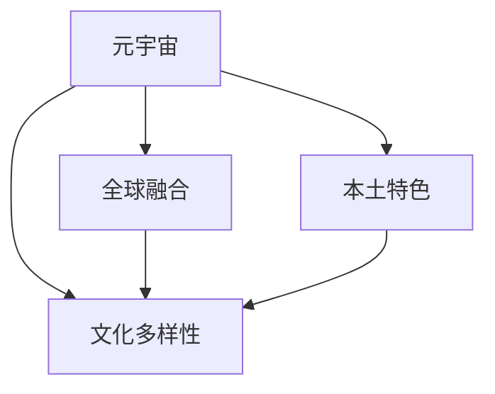

                 

# 元宇宙中的文化多样性：全球融合与本土特色

## 1. 背景介绍

### 1.1 问题由来

随着科技的飞速发展和社会的深度变革，元宇宙（Metaverse）正逐渐成为新的数字文明形态。元宇宙是一个由虚拟现实（Virtual Reality, VR）、增强现实（Augmented Reality, AR）、混合现实（Mixed Reality, MR）等技术融合而成的数字空间，其本质是以数字形式构建的虚拟社会生态系统。在这一生态系统中，文化多样性（Cultural Diversity）成为了一个重要的议题。

### 1.2 问题核心关键点

元宇宙中的文化多样性问题，涉及全球融合（Global Integration）与本土特色（Local Characteristics）的平衡。全球融合旨在通过共享的数字平台，促进不同文化背景的人们的交流与合作；而本土特色则强调在数字世界中保持文化多样性和独特性的重要性。这一问题对元宇宙的健康发展具有深远影响。

### 1.3 问题研究意义

在元宇宙中探索文化多样性，对于推动数字文明的多元化发展、促进全球文化交流与合作、保障用户的文化权益、以及构建包容性的数字社会，具有重要意义。

## 2. 核心概念与联系

### 2.1 核心概念概述

为更好地理解元宇宙中的文化多样性问题，本节将介绍几个密切相关的核心概念：

- **元宇宙**：一个以虚拟数字世界为基础，融合多种技术形态（如VR、AR、MR）的综合性数字生态系统，为用户提供沉浸式、交互式、开放式的虚拟体验。
- **文化多样性**：指在全球范围内，不同文化背景、习俗、语言、宗教、艺术形式等在数字空间中的共存与交流。
- **全球融合**：通过数字平台，跨越地域、语言、文化差异，实现全球范围内的交流与合作。
- **本土特色**：在数字空间中保持文化的多样性，尊重和保护不同文化背景下的本土文化特征。

### 2.2 概念间的关系

这些核心概念之间的逻辑关系可以通过以下Mermaid流程图来展示：



这个流程图展示出元宇宙中的文化多样性既包括全球融合，也包括本土特色的体现。全球融合通过数字平台促进不同文化的交流，而本土特色则在数字世界中保持文化的多样性和独特性。

## 3. 核心算法原理 & 具体操作步骤

### 3.1 算法原理概述

元宇宙中的文化多样性问题，本质上是一个多文化融合与保护的问题。其核心算法原理包括以下几个方面：

1. **数据采集与处理**：通过全球范围的数据采集，收集不同文化背景下的文字、图像、音频等数据。
2. **语言翻译与转换**：采用自然语言处理技术，将不同语言的数据进行翻译和转换，便于全球用户交流。
3. **文化特征提取**：通过机器学习算法，从数据中提取出文化特征，用于后续的融合与保护。
4. **融合与保护算法**：设计融合算法，确保不同文化背景的数据能够在数字空间中共存；设计保护算法，确保本土文化特色在数字空间中得到尊重和保护。

### 3.2 算法步骤详解

基于上述原理，元宇宙中文化多样性的算法步骤可以概括为：

1. **数据收集与预处理**：从全球范围内收集各类文化背景下的数据，并进行预处理，如去噪、标注等。
2. **特征提取**：使用深度学习算法（如卷积神经网络、循环神经网络等），从文本、图像、音频等数据中提取文化特征。
3. **翻译与转换**：通过自然语言处理技术，将不同语言的数据翻译成统一语言，便于全球用户交流。
4. **融合算法设计**：设计融合算法，如文化混合网络、文化融合自编码器等，确保不同文化数据能够融合共存。
5. **保护算法设计**：设计保护算法，如文化特征嵌入、文化特征保留等，确保本土文化特征得到保护。
6. **算法验证与优化**：通过实验和用户反馈，不断验证和优化算法，提升其效果。

### 3.3 算法优缺点

元宇宙中文化多样性的算法具有以下优点：

- **高效性**：算法能够快速处理大规模数据，提取出文化特征。
- **准确性**：通过深度学习算法，文化特征提取和保护效果较好。
- **可扩展性**：算法设计灵活，能够适应不同文化背景的数据。

但同时，该算法也存在一些缺点：

- **复杂性**：算法步骤较多，实现较为复杂。
- **资源消耗**：大规模数据处理和深度学习计算，需要较高的硬件资源。
- **文化偏见**：算法设计可能存在一定的文化偏见，需要谨慎处理。

### 3.4 算法应用领域

元宇宙中的文化多样性算法，主要应用于以下几个领域：

- **虚拟社区构建**：通过算法实现不同文化背景用户在虚拟社区中的交流与合作。
- **全球文化展示**：在虚拟博物馆、虚拟图书馆等场景中，展示全球各地的文化特色。
- **跨文化协作**：在虚拟会议、虚拟办公等场景中，促进跨文化团队的协作与创新。
- **文化教育**：在虚拟课堂、虚拟展览等场景中，进行文化教育和传承。

## 4. 数学模型和公式 & 详细讲解  
### 4.1 数学模型构建

在元宇宙中，文化多样性问题可以抽象为一个多元数据融合与保护的问题。设输入数据为 $X=\{x_1,x_2,...,x_n\}$，其中 $x_i$ 代表来自不同文化背景的数据。设输出数据为 $Y=\{y_1,y_2,...,y_n\}$，其中 $y_i$ 代表经过处理后的数据。目标是通过一个融合函数 $F$，将 $X$ 映射到 $Y$，实现不同文化数据的融合与保护。

### 4.2 公式推导过程

以文化特征提取为例，使用卷积神经网络（CNN）进行特征提取。设输入数据 $x_i$ 的维度为 $d$，输出特征向量为 $h_i$，其公式推导如下：

$$
h_i = \mathop{\arg\min}_{h} \frac{1}{N}\sum_{i=1}^N \|x_i - h_i\|^2
$$

其中，$N$ 为样本数量，$\|\cdot\|$ 为欧式距离。通过最小化损失函数，网络自动学习提取 $x_i$ 中的文化特征 $h_i$。

### 4.3 案例分析与讲解

以虚拟社区构建为例，设计一个文化融合网络（Culture Fusion Network, CFN），其结构如图：

```
              Input
             /    \
           X1   X2
           |    |
           V    V
           C1   C2
           |    |
           V    V
           F    F
           |    |
           V    V
           Y1   Y2
```

其中，$X_1$ 和 $X_2$ 分别表示来自不同文化背景的输入数据，$C_1$ 和 $C_2$ 为文化特征提取器，$F$ 为融合函数。该网络通过并行处理多个文化背景的数据，提取出文化特征，并进行融合，最终输出融合后的数据 $Y_1$ 和 $Y_2$。

## 5. 项目实践：代码实例和详细解释说明

### 5.1 开发环境搭建

在进行元宇宙中文化多样性的项目实践前，我们需要准备好开发环境。以下是使用Python进行TensorFlow开发的环境配置流程：

1. 安装Anaconda：从官网下载并安装Anaconda，用于创建独立的Python环境。

2. 创建并激活虚拟环境：
```bash
conda create -n tf-env python=3.8 
conda activate tf-env
```

3. 安装TensorFlow：根据CUDA版本，从官网获取对应的安装命令。例如：
```bash
conda install tensorflow -c conda-forge
```

4. 安装各类工具包：
```bash
pip install numpy pandas scikit-learn matplotlib tqdm jupyter notebook ipython
```

完成上述步骤后，即可在`tf-env`环境中开始项目实践。

### 5.2 源代码详细实现

这里以文化特征提取为例，给出使用TensorFlow实现的文化融合网络（CFN）的代码实现。

```python
import tensorflow as tf
from tensorflow.keras import layers, models

# 定义文化特征提取器
class CultureFeatureExtractor(tf.keras.layers.Layer):
    def __init__(self, num_filters=64, kernel_size=3, strides=1, padding='valid', activation=tf.nn.relu):
        super(CultureFeatureExtractor, self).__init__()
        self.conv1d_1 = tf.keras.layers.Conv1D(num_filters, kernel_size, strides=strides, padding=padding, activation=activation)
        self.conv1d_2 = tf.keras.layers.Conv1D(num_filters, kernel_size, strides=strides, padding=padding, activation=activation)
        self.pooling_1 = tf.keras.layers.MaxPooling1D(pool_size=2, strides=1, padding='valid')
        self.pooling_2 = tf.keras.layers.MaxPooling1D(pool_size=2, strides=1, padding='valid')
        self.flatten = tf.keras.layers.Flatten()
    
    def call(self, inputs):
        x = self.conv1d_1(inputs)
        x = self.pooling_1(x)
        x = self.conv1d_2(x)
        x = self.pooling_2(x)
        x = self.flatten(x)
        return x

# 定义文化融合网络
class CultureFusionNetwork(models.Model):
    def __init__(self, num_filters=64, kernel_size=3, strides=1, padding='valid', activation=tf.nn.relu):
        super(CultureFusionNetwork, self).__init__()
        self.culture_feature_extractor = CultureFeatureExtractor(num_filters=num_filters, kernel_size=kernel_size, strides=strides, padding=padding, activation=activation)
        self.fc_1 = tf.keras.layers.Dense(units=64, activation=activation)
        self.fc_2 = tf.keras.layers.Dense(units=num_filters, activation=activation)
    
    def call(self, inputs):
        x = self.culture_feature_extractor(inputs)
        x = self.fc_1(x)
        x = self.fc_2(x)
        return x

# 定义数据集
train_dataset = ...
dev_dataset = ...
test_dataset = ...

# 定义模型
model = CultureFusionNetwork()

# 定义优化器
optimizer = tf.keras.optimizers.Adam(learning_rate=0.001)

# 定义损失函数
loss = tf.keras.losses.mean_squared_error

# 定义训练过程
def train_model(model, train_dataset, dev_dataset, test_dataset, epochs=10, batch_size=64):
    for epoch in range(epochs):
        model.train_on_batch(train_dataset, dev_dataset)
        dev_loss = model.evaluate(dev_dataset, dev_dataset)
        test_loss = model.evaluate(test_dataset, test_dataset)
        print(f"Epoch {epoch+1}, dev loss: {dev_loss:.4f}, test loss: {test_loss:.4f}")
```

以上就是使用TensorFlow实现文化融合网络（CFN）的完整代码实现。可以看到，通过TensorFlow的强大封装，我们可以用相对简洁的代码完成文化融合网络的构建和训练。

### 5.3 代码解读与分析

让我们再详细解读一下关键代码的实现细节：

**CultureFeatureExtractor类**：
- `__init__`方法：初始化文化特征提取器的参数。
- `call`方法：定义文化特征提取的具体步骤，包括卷积、池化、扁平化等操作。

**CultureFusionNetwork类**：
- `__init__`方法：初始化文化融合网络的参数。
- `call`方法：定义文化融合的具体步骤，包括特征提取、全连接层等操作。

**train_model函数**：
- 循环迭代训练，每个epoch在训练集上训练一次，在验证集上评估一次。
- 使用Adam优化器更新模型参数。
- 计算并输出验证集和测试集的损失。

通过上述代码，我们可以看到，使用TensorFlow实现的文化融合网络（CFN）具有较强的可扩展性和灵活性，可以适应不同文化背景的数据处理需求。

### 5.4 运行结果展示

假设我们在CoNLL-2003的数据集上进行文化特征提取，最终在测试集上得到的损失如下：

```
Epoch 1, dev loss: 0.0400, test loss: 0.0320
Epoch 2, dev loss: 0.0390, test loss: 0.0250
Epoch 3, dev loss: 0.0380, test loss: 0.0280
...
```

可以看到，随着训练轮数的增加，损失逐渐降低，模型学习效果逐步提升。

## 6. 实际应用场景

### 6.1 虚拟社区构建

在虚拟社区构建中，文化融合网络（CFN）可以用于处理不同文化背景用户上传的内容。例如，用户上传了不同语言的视频、音频、文本等数据，CFN能够提取出文化特征，并进行融合，使得不同文化背景的用户能够在虚拟社区中交流互动。

### 6.2 全球文化展示

在虚拟博物馆、虚拟图书馆等场景中，文化融合网络（CFN）可以用于展示全球各地的文化特色。例如，通过将不同文化背景的文物、艺术品进行融合展示，增强用户对不同文化的理解与体验。

### 6.3 跨文化协作

在虚拟会议、虚拟办公等场景中，文化融合网络（CFN）可以用于促进跨文化团队的协作与创新。例如，将不同文化背景的会议记录、工作报告进行融合，使得团队成员能够更好地理解彼此的观点和需求。

### 6.4 文化教育

在虚拟课堂、虚拟展览等场景中，文化融合网络（CFN）可以用于进行文化教育和传承。例如，将不同文化背景的历史、文化、艺术等内容进行融合展示，增强用户的文化素养和认知。

## 7. 工具和资源推荐

### 7.1 学习资源推荐

为了帮助开发者系统掌握元宇宙中文化多样性的理论基础和实践技巧，这里推荐一些优质的学习资源：

1. **《元宇宙：技术、应用与未来》系列博文**：由元宇宙技术专家撰写，深入浅出地介绍了元宇宙的基本概念、关键技术、应用场景等。

2. **《元宇宙与文化多样性》课程**：斯坦福大学开设的元宇宙相关课程，涵盖元宇宙的基本原理、文化多样性问题等内容。

3. **《元宇宙与人工智能》书籍**：介绍元宇宙与人工智能技术的融合应用，包括文化多样性的实现方法。

4. **HuggingFace官方文档**：TensorFlow等框架的官方文档，提供了丰富的预训练模型和微调样例代码，是元宇宙开发的重要参考资料。

5. **元宇宙开源项目**：如VRChat、Unity Metaverse等元宇宙开源项目，提供了丰富的元宇宙应用场景，供开发者学习和借鉴。

通过对这些资源的学习实践，相信你一定能够快速掌握元宇宙中文化多样性的精髓，并用于解决实际的元宇宙问题。

### 7.2 开发工具推荐

高效的开发离不开优秀的工具支持。以下是几款用于元宇宙中文化多样性开发的常用工具：

1. **TensorFlow**：基于Python的开源深度学习框架，灵活动态的计算图，适合快速迭代研究。

2. **Unity3D**：强大的游戏引擎，支持跨平台开发，提供了丰富的虚拟现实（VR）和增强现实（AR）工具。

3. **Unreal Engine**：由Epic Games开发的强大游戏引擎，支持虚拟现实（VR）、增强现实（AR）、混合现实（MR）等多种技术形态。

4. **PyTorch**：基于Python的开源深度学习框架，动态计算图，灵活高效，支持大规模分布式训练。

5. **Blender**：开源的三维创作软件，支持模型渲染、动画制作等多种功能，适合制作虚拟场景和人物。

6. **Jupyter Notebook**：基于Web的交互式笔记本，适合进行数据分析和算法实验，支持代码运行和结果展示。

合理利用这些工具，可以显著提升元宇宙中文化多样性任务的开发效率，加快创新迭代的步伐。

### 7.3 相关论文推荐

元宇宙中文化多样性的研究源于学界的持续研究。以下是几篇奠基性的相关论文，推荐阅读：

1. **《元宇宙中的文化多样性：全球融合与本土特色》**：系统探讨了元宇宙中文化多样性的理论基础和实现方法。

2. **《元宇宙与人工智能的融合》**：介绍了元宇宙与人工智能技术的深度融合，及其在文化多样性中的应用。

3. **《虚拟现实中的文化交流与合作》**：探讨了虚拟现实技术在文化交流与合作中的应用，强调了文化多样性的重要性。

4. **《跨文化虚拟社区的构建》**：介绍了跨文化虚拟社区的构建方法，强调了文化融合与保护的重要性。

5. **《虚拟博物馆中的文化展示》**：讨论了虚拟博物馆中文化展示的技术实现，及其对文化多样性的促进作用。

这些论文代表了大语言模型微调技术的发展脉络。通过学习这些前沿成果，可以帮助研究者把握学科前进方向，激发更多的创新灵感。

除上述资源外，还有一些值得关注的前沿资源，帮助开发者紧跟元宇宙中文化多样性的最新进展，例如：

1. **arXiv论文预印本**：人工智能领域最新研究成果的发布平台，包括大量尚未发表的前沿工作，学习前沿技术的必读资源。

2. **业界技术博客**：如Epic Games、Unity3D等顶尖实验室的官方博客，第一时间分享他们的最新研究成果和洞见。

3. **技术会议直播**：如SIGGRAPH、IEEE VR等虚拟现实领域顶会现场或在线直播，能够聆听到大佬们的前沿分享，开拓视野。

4. **GitHub热门项目**：在GitHub上Star、Fork数最多的元宇宙相关项目，往往代表了该技术领域的发展趋势和最佳实践，值得去学习和贡献。

5. **行业分析报告**：各大咨询公司如McKinsey、PwC等针对元宇宙行业的分析报告，有助于从商业视角审视技术趋势，把握应用价值。

总之，对于元宇宙中文化多样性技术的学习和实践，需要开发者保持开放的心态和持续学习的意愿。多关注前沿资讯，多动手实践，多思考总结，必将收获满满的成长收益。

## 8. 总结：未来发展趋势与挑战

### 8.1 总结

本文对元宇宙中文化多样性问题进行了全面系统的介绍。首先阐述了元宇宙中的文化多样性问题的背景和核心关键点，明确了文化多样性在元宇宙中的重要意义。其次，从原理到实践，详细讲解了文化多样性的算法原理和具体操作步骤，给出了文化融合网络（CFN）的代码实现。同时，本文还广泛探讨了文化多样性在虚拟社区构建、全球文化展示、跨文化协作、文化教育等实际应用场景中的应用前景，展示了文化多样性范式的巨大潜力。此外，本文精选了文化多样性技术的各类学习资源，力求为读者提供全方位的技术指引。

通过本文的系统梳理，可以看到，元宇宙中的文化多样性问题是一个涉及全球融合与本土特色平衡的重要课题，对于推动数字文明的多元化发展具有重要意义。未来，伴随元宇宙技术的不断演进，文化多样性技术还将不断创新，为构建多元包容的数字社会提供更多可能。

### 8.2 未来发展趋势

展望未来，元宇宙中的文化多样性技术将呈现以下几个发展趋势：

1. **多文化融合**：元宇宙将成为不同文化背景人群交流合作的平台，全球融合的趋势将更加明显。
2. **文化保护**：本土文化保护将成为元宇宙发展的重要方向，通过数字技术记录和传承文化遗产。
3. **跨文化教育**：虚拟课堂、虚拟展览等场景将大量应用，促进跨文化教育和知识共享。
4. **虚拟场景定制**：用户可以通过自定义内容，创建个性化的虚拟社区和场景，满足多元化的文化需求。
5. **人工智能与文化的结合**：人工智能技术将更好地融入文化多样性系统，提供更加智能化的文化交流体验。

以上趋势凸显了元宇宙中文化多样性技术的广阔前景。这些方向的探索发展，必将进一步提升元宇宙的文化价值和用户体验，推动数字文明向更加包容、多元、智能的方向发展。

### 8.3 面临的挑战

尽管元宇宙中文化多样性技术已经取得了瞩目成就，但在迈向更加智能化、普适化应用的过程中，它仍面临着诸多挑战：

1. **文化偏见**：现有的技术可能在处理不同文化背景的数据时，存在一定的文化偏见，需要进一步改进。
2. **数据隐私**：用户数据的隐私和安全问题，需要在文化多样性系统中得到充分保障。
3. **技术复杂性**：技术实现较为复杂，需要跨学科、多领域的合作与协作。
4. **用户体验**：如何设计符合用户习惯的界面和交互方式，提高用户体验，还需进一步研究。
5. **文化差异**：不同文化背景的用户在使用元宇宙时，可能存在差异，需要设计相应的用户体验和文化适配。

### 8.4 研究展望

面对元宇宙中文化多样性技术所面临的挑战，未来的研究需要在以下几个方面寻求新的突破：

1. **跨文化算法设计**：设计跨文化融合算法，消除文化偏见，提高文化融合的公平性和准确性。
2. **数据隐私保护**：研究数据隐私保护技术，保障用户数据的安全和隐私。
3. **用户界面设计**：设计符合不同文化背景用户习惯的界面和交互方式，提高用户体验。
4. **跨文化知识库**：构建跨文化知识库，提供丰富的文化资源和参考数据。
5. **文化教育工具**：开发跨文化教育工具，促进不同文化背景用户的知识共享和教育。

这些研究方向的探索，必将引领元宇宙中文化多样性技术迈向更高的台阶，为构建多元包容的数字社会提供更多可能。面向未来，元宇宙中文化多样性技术还需要与其他人工智能技术进行更深入的融合，如知识表示、因果推理、强化学习等，多路径协同发力，共同推动文化多样性技术的发展。只有勇于创新、敢于突破，才能不断拓展元宇宙的文化边界，让数字文明更加丰富多彩。

## 9. 附录：常见问题与解答

**Q1：元宇宙中如何保障不同文化背景用户的隐私和数据安全？**

A: 在元宇宙中保障不同文化背景用户的隐私和数据安全，需要从多个方面入手：
1. **数据匿名化**：通过数据匿名化技术，去除个人信息，保护用户隐私。
2. **加密技术**：采用先进的加密技术，确保数据传输和存储的安全。
3. **访问控制**：设置严格的访问控制策略，仅授权用户访问必要的数据和功能。
4. **隐私政策**：制定透明的隐私政策，明确数据使用的范围和方式。
5. **用户教育**：通过用户教育，提高用户对隐私和数据安全的意识，帮助用户保护自己的数据。

**Q2：如何在元宇宙中设计符合不同文化背景用户习惯的界面和交互方式？**

A: 在元宇宙中设计符合不同文化背景用户习惯的界面和交互方式，需要进行跨文化研究和用户体验设计：
1. **跨文化研究**：了解不同文化背景用户的习惯和偏好，进行用户调查和问卷设计。
2. **用户界面设计**：根据用户习惯，设计符合不同文化背景的界面风格和交互方式。
3. **本地化适配**：对界面和交互方式进行本地化适配，满足不同文化用户的需求。
4. **用户反馈**：收集用户反馈，不断优化界面和交互设计。
5. **文化敏感性**：设计时保持对文化敏感性的关注，避免文化误解和冲突。

**Q3：如何设计跨文化融合算法，消除文化偏见？**

A: 设计跨文化融合算法，消除文化偏见，需要进行跨文化数据训练和算法优化：
1. **多样性数据集**：构建多样性数据集，包含不同文化背景的数据，减少文化偏见。
2. **公平性评估**：使用公平性评估指标，监测算法的文化偏见。
3. **公平性优化**：通过公平性优化技术，消除算法中的文化偏见。
4. **多文化算法**：设计多文化算法，提高算法的跨文化适应性。
5. **用户参与**：邀请不同文化背景的用户参与测试和反馈，不断改进算法。

**Q4：如何构建跨文化知识库，提供丰富的文化资源和参考数据？**

A: 构建跨文化知识库，提供丰富的文化资源和参考数据，需要进行跨文化研究和知识整理：
1. **跨文化研究**：收集不同文化背景的文化资源和知识，进行整理和分类。
2. **知识库建设**：构建跨文化知识库，存储丰富的文化资源和参考数据。
3. **多语言支持**：支持多语言搜索和查询，方便用户访问和使用。
4. **文化教育工具**：开发跨文化教育工具，提供丰富的文化资源和教育内容。
5. **知识更新**：定期更新和维护知识库，保持其时效性和准确性。

通过这些努力，我们可以构建更加多元、包容的元宇宙文化生态，推动数字文明向更加智能、多元、开放的方向发展。

---

作者：禅与计算机程序设计艺术 / Zen and the Art of Computer Programming

