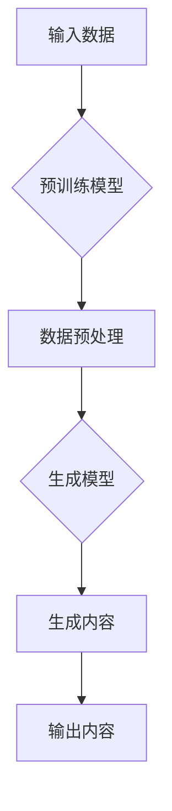

# AIGC与企业任务的细化

> 关键词：AIGC, 自动生成内容，企业任务，任务细化，工作流程优化，业务智能化，人工智能

## 1. 背景介绍

随着人工智能技术的迅猛发展，自动生成内容（AIGC，AI-generated content）已成为一种新兴的智能化创作方式。AIGC技术能够自动生成文本、图像、音频、视频等多种形式的内容，为创意设计、内容创作、数据分析等领域带来了革命性的变化。在企业领域，AIGC的应用正逐渐从娱乐和媒体扩展到各个业务环节，帮助企业实现自动化、智能化的工作流程优化。

### 1.1 问题的由来

传统的企业任务流程往往依赖于人工操作，效率低下且容易出错。随着市场竞争的加剧，企业需要不断提高生产效率和响应速度，以满足客户需求。AIGC技术的出现，为企业提供了一个自动化、智能化的解决方案，帮助企业实现以下目标：

- **提高工作效率**：通过自动化处理重复性任务，释放人力资源，专注于更高价值的业务活动。
- **降低运营成本**：减少对人工的依赖，降低人力成本，同时提高资源利用效率。
- **提升服务质量**：通过智能化分析客户需求，提供更精准、个性化的服务，提升客户满意度。
- **增强创新能力**：利用AIGC技术进行创新性内容创作，为企业带来新的商业机会。

### 1.2 研究现状

目前，AIGC在企业中的应用主要集中在以下几个方面：

- **内容创作**：自动生成新闻、报告、文章、广告等文本内容。
- **客户服务**：自动回复客户咨询，提供智能客服服务。
- **数据分析**：自动生成数据分析报告，辅助企业决策。
- **产品开发**：利用AIGC技术进行产品原型设计、用户界面设计等。

### 1.3 研究意义

研究AIGC与企业任务的细化，对于推动企业数字化转型、提升企业竞争力具有重要意义：

- **推动企业智能化转型**：AIGC技术可以帮助企业实现业务流程的自动化和智能化，推动企业向智能化方向转型。
- **提升企业竞争力**：通过提高工作效率、降低成本、提升服务质量，增强企业的市场竞争力。
- **促进产业升级**：AIGC技术可以促进相关产业的发展，如人工智能、大数据、云计算等。

### 1.4 本文结构

本文将围绕AIGC与企业任务的细化展开讨论，主要内容如下：

- 介绍AIGC的核心概念与联系。
- 阐述AIGC在企业任务中的应用原理和操作步骤。
- 分析AIGC的数学模型和公式，并结合案例进行讲解。
- 展示AIGC在实际应用场景中的代码实例和详细解释。
- 探讨AIGC在各个行业领域的应用前景。
- 推荐相关学习资源、开发工具和参考文献。
- 总结AIGC的发展趋势与挑战。

## 2. 核心概念与联系

### 2.1 AIGC的核心概念

AIGC（AI-generated content）是指由人工智能系统自动生成的内容，包括但不限于文本、图像、音频、视频等。AIGC技术主要包括以下几个关键概念：

- **预训练模型**：在大规模无标签数据上进行预训练的模型，如GPT-3、BERT等。
- **生成模型**：能够生成具有某种特定分布的新样本的模型，如VAE、GAN等。
- **微调**：在预训练模型的基础上，使用特定领域的数据进行微调，以适应特定任务。
- **任务细化**：将大型任务分解为更小的子任务，以便于模型学习和优化。

### 2.2 AIGC的架构流程图

以下是用Mermaid语言描述的AIGC的架构流程图：



### 2.3 核心概念之间的联系

- 预训练模型为AIGC提供强大的基础能力，生成模型在此基础上进行特定任务的学习和优化。
- 数据预处理是AIGC流程的关键步骤，用于处理和准备用于训练和生成的内容。
- 任务细化将大型任务分解为更小的子任务，有助于模型学习和优化。
- 生成内容是AIGC的直接输出，可用于企业任务的各种应用场景。

## 3. 核心算法原理 & 具体操作步骤

### 3.1 算法原理概述

AIGC的算法原理主要包括以下步骤：

1. **数据收集与预处理**：收集用于训练和生成的内容数据，并进行预处理，如分词、去噪、标准化等。
2. **预训练模型选择**：选择合适的预训练模型，如GPT-3、BERT等。
3. **模型微调**：在特定领域的数据集上对预训练模型进行微调，以适应特定任务。
4. **内容生成**：利用微调后的模型生成新的内容。

### 3.2 算法步骤详解

**步骤1：数据收集与预处理**

- 数据收集：收集用于训练和生成的内容数据，如文本、图像、音频、视频等。
- 数据预处理：对收集到的数据进行预处理，如分词、去噪、标准化等，以便于模型学习和生成。

**步骤2：预训练模型选择**

- 根据任务需求和数据特点，选择合适的预训练模型，如GPT-3、BERT等。
- 预训练模型通常在大规模无标签数据上进行训练，具有强大的语言理解和生成能力。

**步骤3：模型微调**

- 在特定领域的数据集上对预训练模型进行微调，以适应特定任务。
- 微调过程包括以下步骤：
  - 定义损失函数：根据任务类型选择合适的损失函数，如交叉熵损失、均方误差等。
  - 梯度下降：使用梯度下降等优化算法，根据损失函数更新模型参数。
  - 模型评估：在验证集上评估模型性能，调整超参数和模型结构。

**步骤4：内容生成**

- 利用微调后的模型生成新的内容。
- 生成过程包括以下步骤：
  - 输入文本/图像/音频等数据。
  - 模型根据输入数据生成新的文本/图像/音频等数据。
  - 对生成内容进行后处理，如文本润色、图像修正等。

### 3.3 算法优缺点

**优点**：

- **高效**：AIGC技术可以快速生成内容，提高工作效率。
- **创新**：AIGC技术可以生成新颖、独特的内容，促进创新。
- **个性化**：AIGC技术可以根据用户需求生成个性化内容。

**缺点**：

- **质量参差不齐**：AIGC生成的内容质量可能参差不齐，需要人工审核。
- **伦理风险**：AIGC技术可能被用于生成虚假信息、恶意内容等，需要加强监管。

### 3.4 算法应用领域

AIGC技术在以下领域具有广泛的应用：

- **内容创作**：自动生成新闻、报告、文章、广告等文本内容。
- **客户服务**：自动回复客户咨询，提供智能客服服务。
- **数据分析**：自动生成数据分析报告，辅助企业决策。
- **产品开发**：利用AIGC技术进行产品原型设计、用户界面设计等。

## 4. 数学模型和公式 & 详细讲解 & 举例说明

### 4.1 数学模型构建

AIGC的数学模型主要包括以下部分：

- **预训练模型**：如GPT-3、BERT等，使用神经网络对大量文本数据进行预训练。
- **生成模型**：如VAE、GAN等，用于生成新的文本/图像/音频等数据。
- **损失函数**：用于衡量模型生成的数据与真实数据之间的差异。

### 4.2 公式推导过程

以下以GPT-3为例，简要介绍其数学模型和公式推导过程：

**GPT-3模型**：

- GPT-3是一种基于Transformer的预训练语言模型，由多个自注意力层组成。
- 模型输入为文本序列，输出为下一个单词的概率分布。

**公式推导**：

1. **输入文本序列**：将输入文本序列 $x_1, x_2, \ldots, x_T$ 转换为模型可处理的向量表示。

2. **自注意力机制**：计算每个单词对其他单词的注意力权重。

3. **前馈神经网络**：将注意力权重与单词向量进行加权求和，并经过前馈神经网络进行非线性变换。

4. **输出概率分布**：将输出向量转换为下一个单词的概率分布。

### 4.3 案例分析与讲解

以下以一个文本生成任务为例，讲解AIGC的模型构建和应用。

**案例**：

- 任务：根据用户输入的标题，生成一篇相关的文章。
- 数据集：包含标题和文章文本的数据集。

**模型构建**：

1. **数据预处理**：对标题和文章文本进行分词、去噪、标准化等预处理操作。

2. **预训练模型选择**：选择GPT-3作为预训练模型。

3. **模型微调**：在标题-文章文本数据集上对GPT-3进行微调。

4. **内容生成**：根据用户输入的标题，使用微调后的GPT-3生成文章。

**结果**：

- GPT-3根据用户输入的标题，生成了与标题相关的文章内容。

## 5. 项目实践：代码实例和详细解释说明

### 5.1 开发环境搭建

以下是在Python环境下使用Hugging Face的Transformers库进行AIGC项目实践的步骤：

1. 安装Anaconda：从官网下载并安装Anaconda，用于创建独立的Python环境。

2. 创建并激活虚拟环境：

```bash
conda create -n aigc-env python=3.8
conda activate aigc-env
```

3. 安装Transformers库：

```bash
pip install transformers
```

4. 安装其他依赖库：

```bash
pip install torch numpy pandas scikit-learn matplotlib tqdm jupyter notebook ipython
```

### 5.2 源代码详细实现

以下是一个使用Transformers库进行文本生成任务的示例代码：

```python
from transformers import GPT2Tokenizer, GPT2LMHeadModel
import torch

# 加载预训练模型和分词器
tokenizer = GPT2Tokenizer.from_pretrained('gpt2')
model = GPT2LMHeadModel.from_pretrained('gpt2')

# 生成文本
def generate_text(prompt, max_length=50):
    input_ids = tokenizer.encode(prompt, return_tensors='pt')
    outputs = model.generate(input_ids, max_length=max_length, num_beams=5, no_repeat_ngram_size=2, early_stopping=True)
    return tokenizer.decode(outputs[0], skip_special_tokens=True)

# 测试生成文本
prompt = "今天天气真好，我想去"
print(generate_text(prompt))
```

### 5.3 代码解读与分析

以上代码展示了如何使用Transformers库生成文本。

- 加载预训练模型和分词器。
- 定义生成文本的函数，包括输入提示、最大长度、搜索策略等参数。
- 使用预训练模型生成文本。
- 将生成的文本解码为人类可读的格式。

### 5.4 运行结果展示

假设用户输入的提示为“今天天气真好，我想去”，则生成的文本可能如下：

```
今天天气真好，我想去公园散步。
```

可以看出，GPT-2能够根据输入提示生成符合逻辑的文本内容。

## 6. 实际应用场景

### 6.1 内容创作

AIGC技术在内容创作领域的应用非常广泛，如：

- **新闻生成**：自动生成新闻稿件，提高新闻生产效率。
- **报告生成**：自动生成各类报告，如市场调研报告、财务报表等。
- **广告生成**：自动生成广告文案，提高广告投放效率。

### 6.2 客户服务

AIGC技术在客户服务领域的应用包括：

- **智能客服**：自动回复客户咨询，提高客户服务效率。
- **聊天机器人**：与客户进行自然语言交互，提供个性化服务。

### 6.3 数据分析

AIGC技术在数据分析领域的应用包括：

- **数据可视化**：自动生成图表、报表等可视化内容，帮助用户更好地理解数据。
- **数据摘要**：自动生成数据摘要，提高数据分析效率。

### 6.4 产品开发

AIGC技术在产品开发领域的应用包括：

- **原型设计**：自动生成产品原型，提高产品开发效率。
- **用户界面设计**：自动生成用户界面设计，提高设计效率。

## 7. 工具和资源推荐

### 7.1 学习资源推荐

- **书籍**：
  - 《深度学习自然语言处理》
  - 《自动生成内容：人工智能时代的创作与传播》
  - 《人工智能：一种现代的方法》
- **在线课程**：
  - Coursera上的《深度学习自然语言处理》课程
  - Udacity上的《深度学习工程师纳米学位》
  - fast.ai上的《深度学习课程》
- **开源库**：
  - Transformers库：https://huggingface.co/transformers/
  - TensorFlow：https://www.tensorflow.org/
  - PyTorch：https://pytorch.org/

### 7.2 开发工具推荐

- **编程语言**：
  - Python
  - Java
  - JavaScript
- **深度学习框架**：
  - TensorFlow
  - PyTorch
  - Keras
- **文本生成工具**：
  - GPT-3
  - BERT
  - GPT-2

### 7.3 相关论文推荐

- **《Generative Adversarial Nets》**：https://arxiv.org/abs/1406.2661
- **《Attention is All You Need》**：https://arxiv.org/abs/1706.03762
- **《BERT: Pre-training of Deep Bidirectional Transformers for Language Understanding》**：https://arxiv.org/abs/1810.04805

## 8. 总结：未来发展趋势与挑战

### 8.1 研究成果总结

本文对AIGC与企业任务的细化进行了全面系统的介绍，涵盖了AIGC的核心概念、算法原理、应用场景等方面。通过分析AIGC的技术特点和优势，以及在实际应用中的案例，展示了AIGC在企业任务中的巨大潜力。

### 8.2 未来发展趋势

未来，AIGC技术将呈现以下发展趋势：

- **模型规模和多样性**：预训练模型的规模将进一步扩大，模型种类更加丰富。
- **跨模态生成**：AIGC技术将融合多模态信息，实现文本、图像、音频等多种内容的生成。
- **个性化和定制化**：AIGC技术将更加注重个性化服务，满足不同用户的需求。
- **可解释性和可控性**：AIGC技术将更加注重可解释性和可控性，提高用户对模型的信任度。

### 8.3 面临的挑战

AIGC技术在发展过程中也面临着以下挑战：

- **数据质量**：AIGC模型的性能依赖于高质量的数据，如何获取和处理高质量数据是一个挑战。
- **算法效率**：AIGC模型的计算资源消耗较大，如何提高算法效率是一个挑战。
- **伦理和社会影响**：AIGC技术可能带来虚假信息、歧视等问题，需要加强伦理和社会影响评估。

### 8.4 研究展望

未来，AIGC技术的研究将主要集中在以下几个方面：

- **数据增强和迁移学习**：研究如何利用数据增强和迁移学习技术提高AIGC模型的性能。
- **模型效率和可控性**：研究如何提高AIGC模型的计算效率和可控性。
- **伦理和社会影响**：研究如何评估和应对AIGC技术带来的伦理和社会影响。

## 9. 附录：常见问题与解答

**Q1：AIGC技术的应用前景如何？**

A1：AIGC技术在各个领域具有广泛的应用前景，如内容创作、客户服务、数据分析、产品开发等。

**Q2：AIGC技术是否可以完全替代人工？**

A2：AIGC技术可以自动化处理一些重复性任务，但不能完全替代人工。在需要人类创造力、判断和情感交流的场景下，仍然需要人类的参与。

**Q3：如何确保AIGC技术的伦理和社会影响？**

A3：确保AIGC技术的伦理和社会影响需要从以下几个方面入手：

- **数据质量**：确保数据来源合法、合规，避免数据偏见和歧视。
- **模型设计**：在设计AIGC模型时，考虑模型的公平性、透明度和可解释性。
- **监管政策**：制定相关监管政策，规范AIGC技术的应用。

**Q4：AIGC技术是否安全？**

A4：AIGC技术本身是安全的，但可能被恶意利用。需要加强对AIGC技术的监管，防止其被用于生成虚假信息、恶意内容等。

作者：禅与计算机程序设计艺术 / Zen and the Art of Computer Programming