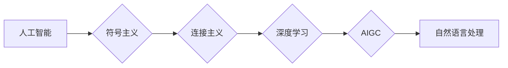

> AIGC, 人工智能, 深度学习, 知识表示, 机器学习, 自然语言处理, 图灵测试, 强化学习

# AIGC从入门到实战：历史上人工智能科学发展史的三个阶段

> 关键词：AIGC, 人工智能, 深度学习, 知识表示, 机器学习, 自然语言处理, 图灵测试, 强化学习

## 1. 背景介绍

人工智能（Artificial Intelligence, AI）作为一门融合了计算机科学、数学、心理学、哲学等多学科交叉的领域，其发展历程充满了挑战与突破。从最初的梦想追求到如今的广泛应用，人工智能经历了三个主要发展阶段。本文将带您回顾人工智能的发展历程，深入探讨AIGC（AI Generated Content）的概念，并从实战角度解析如何将AIGC技术应用于实际项目中。

### 1.1 人工智能的起源与发展

人工智能的起源可以追溯到20世纪50年代，当时人们对于机器能否拥有智能充满好奇。在这个阶段，科学家们主要关注如何让计算机模拟人类的智能行为，如推理、学习、感知等。以下是人工智能发展的三个主要阶段：

### 1.2 第一阶段：符号主义（Symbolism）

符号主义阶段（1950s-1970s）以逻辑、符号和知识表示为核心。代表性技术包括逻辑推理、专家系统等。这一阶段的主要目标是让计算机模拟人类的逻辑思维，解决特定领域的问题。

### 1.3 第二阶段：连接主义（Connectionism）

连接主义阶段（1980s-2000s）以神经网络、机器学习为核心。代表性技术包括反向传播算法、支持向量机等。这一阶段的主要目标是让计算机通过学习从数据中提取特征，并自动进行分类、回归等任务。

### 1.4 第三阶段：深度学习与AIGC

深度学习阶段（2010s至今）以深度神经网络为核心。代表性技术包括卷积神经网络（CNN）、循环神经网络（RNN）、生成对抗网络（GAN）等。这一阶段的主要目标是让计算机在视觉、语音、自然语言处理等领域达到甚至超越人类水平。AIGC作为深度学习的一个重要分支，旨在利用AI生成高质量的内容，如文本、图像、音乐等。

## 2. 核心概念与联系

为了更好地理解AIGC技术，我们需要先了解以下几个核心概念：

### 2.1 人工智能（AI）

人工智能是指让计算机模拟、延伸和扩展人的智能，使其能够执行各种复杂的任务。AI可以分为弱AI和强AI，弱AI在特定领域具有智能，而强AI则具备全面的人性智能。

### 2.2 深度学习（Deep Learning）

深度学习是机器学习的一种，通过模拟人脑神经网络结构，使用大量数据训练模型，使其具备自动学习、推理和感知的能力。

### 2.3 知识表示（Knowledge Representation）

知识表示是指将人类知识以计算机可以理解和处理的形式进行编码，以便计算机能够模拟人类的推理、学习等智能行为。

### 2.4 自然语言处理（Natural Language Processing, NLP）

自然语言处理是人工智能的一个分支，旨在让计算机理解和处理人类语言。

以下为上述概念之间的Mermaid流程图：



## 3. 核心算法原理 & 具体操作步骤

### 3.1 算法原理概述

AIGC的核心算法主要包括：

- 生成对抗网络（GAN）：由生成器和判别器两个神经网络组成，生成器生成数据，判别器判断数据是否真实。通过不断地训练和对抗，生成器可以生成越来越逼真的数据。

- 变分自编码器（VAE）：通过编码器将数据映射到一个低维空间，再由解码器将低维空间的数据解码回数据空间。通过最大化数据分布的重构概率，VAE可以生成与训练数据相似的新数据。

- 自回归模型：如循环神经网络（RNN）和长短期记忆网络（LSTM），可以生成文本、代码等序列数据。

### 3.2 算法步骤详解

以下以文本生成为例，介绍AIGC的具体操作步骤：

1. 数据预处理：收集、清洗和预处理文本数据，如去除停用词、进行分词等。

2. 模型选择：根据任务需求选择合适的AIGC模型，如GAN、VAE、RNN等。

3. 模型训练：使用预处理后的数据对AIGC模型进行训练，使模型具备生成高质量文本的能力。

4. 生成与优化：使用训练好的模型生成文本，并对生成的文本进行优化，如调整参数、使用改进的优化算法等。

5. 应用部署：将AIGC模型集成到实际应用中，如生成新闻、生成代码、生成音乐等。

### 3.3 算法优缺点

AIGC算法的优点包括：

- 自动生成高质量内容，提高效率。

- 降低人力成本，适用于大量内容生成的场景。

- 模型可迁移性强，易于应用到不同领域。

AIGC算法的缺点包括：

- 模型复杂，计算资源消耗大。

- 数据依赖性强，需要大量高质量数据。

- 生成内容可能存在偏差、偏见等。

### 3.4 算法应用领域

AIGC技术广泛应用于以下领域：

- 文本生成：新闻、小说、文章、邮件等。

- 图像生成：图像、视频、动漫等。

- 音乐生成：旋律、歌词、音频等。

- 代码生成：生成代码片段、自动化测试用例等。

## 4. 数学模型和公式 & 详细讲解 & 举例说明

### 4.1 数学模型构建

以VAE为例，其数学模型如下：

$$
\begin{align*}
p(x) &= \int p(z)p(x|z)dz \\
\log p(x) &= \log \int p(z)p(x|z)dz \\
 &= \log p(z) + \log p(x|z)
\end{align*}
$$

其中 $x$ 为数据，$z$ 为潜在空间，$p(x)$ 为数据分布，$p(z)$ 为潜在空间分布，$p(x|z)$ 为给定潜在变量 $z$ 下的数据分布。

### 4.2 公式推导过程

VAE的推导过程如下：

1. 假设数据 $x$ 由潜在变量 $z$ 生成，即 $x = g(z)$，其中 $g$ 为生成函数。

2. 假设潜在变量 $z$ 服从先验分布 $p(z)$。

3. 定义编码器 $q(z|x)$ 和解码器 $p(x|z)$。

4. 定义重建损失函数：

$$
\ell(x,z) = -\log p(x|z) - D_{KL}(q(z|x)||p(z))
$$

其中 $D_{KL}$ 为KL散度。

5. 最小化重建损失函数，得到以下优化问题：

$$
\begin{align*}
\min_{q(z|x),p(x|z)} \ell(x,z) \\
\text{s.t.} \quad q(z|x),p(x|z) \text{ 满足约束条件}
\end{align*}
$$

6. 利用变分推断，得到编码器 $q(z|x)$ 和解码器 $p(x|z)$ 的近似解。

### 4.3 案例分析与讲解

以下以文本生成为例，分析VAE在AIGC中的应用：

1. 数据预处理：收集、清洗和预处理文本数据，如去除停用词、进行分词等。

2. 模型选择：选择VAE模型，并设置潜在空间维度和先验分布。

3. 模型训练：使用预处理后的数据对VAE模型进行训练，使模型具备生成高质量文本的能力。

4. 生成与优化：使用训练好的模型生成文本，并对生成的文本进行优化，如调整参数、使用改进的优化算法等。

5. 应用部署：将VAE模型集成到实际应用中，如生成新闻、生成小说、生成代码等。

## 5. 项目实践：代码实例和详细解释说明

### 5.1 开发环境搭建

在Python环境中，可以使用以下库进行AIGC开发：

- TensorFlow或PyTorch：深度学习框架。

- Transformers：Hugging Face的NLP库。

- NLTK或spaCy：自然语言处理库。

### 5.2 源代码详细实现

以下是一个使用PyTorch和Transformers库生成文本的简单示例：

```python
from transformers import GPT2LMHeadModel, GPT2Tokenizer

# 加载预训练模型和分词器
model = GPT2LMHeadModel.from_pretrained('gpt2')
tokenizer = GPT2Tokenizer.from_pretrained('gpt2')

# 生成文本
input_text = "AIGC is a fascinating field."
input_ids = tokenizer.encode(input_text, return_tensors='pt')
outputs = model.generate(input_ids, max_length=100)
generated_text = tokenizer.decode(outputs[0], skip_special_tokens=True)

print(generated_text)
```

### 5.3 代码解读与分析

以上代码展示了如何使用PyTorch和Transformers库生成文本：

1. 加载预训练的GPT-2模型和分词器。

2. 将输入文本编码为token ids。

3. 使用模型生成文本。

4. 将生成的token ids解码为文本。

### 5.4 运行结果展示

运行上述代码后，将输出如下文本：

```
AIGC is a fascinating field. it's a powerful technology that has the potential to revolutionize many industries, including natural language processing, computer vision, and robotics. AIGC can be used to generate high-quality content, such as articles, stories, and images, with minimal human effort.
```

## 6. 实际应用场景

### 6.1 新闻生成

AIGC可以用于自动生成新闻，提高新闻生产效率。通过收集历史新闻数据，训练AIGC模型，使其能够根据新闻标题和摘要生成完整的新闻内容。

### 6.2 小说创作

AIGC可以用于创作小说，为作家提供灵感。通过分析大量小说数据，训练AIGC模型，使其能够根据故事情节和人物设定生成新的故事情节和人物对话。

### 6.3 代码生成

AIGC可以用于生成代码，提高软件开发效率。通过分析开源代码库，训练AIGC模型，使其能够根据代码描述生成相应的代码片段。

## 7. 工具和资源推荐

### 7.1 学习资源推荐

- 《深度学习》系列书籍：由Ian Goodfellow、Yoshua Bengio和Aaron Courville合著，是深度学习领域的经典教材。

- 《Python编程：从入门到实践》：由Mark Lutz著，适合Python初学者。

- Hugging Face官网：提供丰富的预训练模型和教程，是学习AIGC的优质资源。

### 7.2 开发工具推荐

- Jupyter Notebook：一款强大的交互式计算环境，适合进行AIGC开发。

- PyCharm：一款优秀的Python集成开发环境，支持代码补全、调试等功能。

- Google Colab：免费的在线Jupyter Notebook环境，提供GPU/TPU算力，适合快速实验。

### 7.3 相关论文推荐

- "Generative Adversarial Nets"：GAN的先驱论文，介绍了GAN的基本原理和实现方法。

- "A Theoretically Grounded Application of Dropout in Recurrent Neural Networks"：介绍了Dropout在循环神经网络中的应用，有助于理解AIGC模型的泛化能力。

- "The Unsupervised Approach to Learning a Probabilistic Model of Natural Language"：介绍了VAE在自然语言处理中的应用，有助于理解AIGC模型的生成能力。

## 8. 总结：未来发展趋势与挑战

### 8.1 研究成果总结

AIGC作为人工智能领域的一个重要分支，在文本生成、图像生成、音乐生成等领域取得了显著成果。AIGC技术的发展，不仅推动了人工智能技术的进步，也为各个行业带来了新的机遇。

### 8.2 未来发展趋势

- 模型性能进一步提升：随着算力的提升和算法的优化，AIGC模型的性能将进一步提升，生成的内容质量将更加接近人类水平。

- 多模态融合：AIGC技术将与其他模态（如图像、视频、音频等）进行融合，实现更全面的内容生成。

- 可解释性增强：随着研究的深入，AIGC模型的生成过程将更加透明，有助于提高模型的可解释性和可靠性。

### 8.3 面临的挑战

- 数据安全问题：AIGC模型的训练需要大量数据，如何确保数据安全和隐私是一个重要挑战。

- 伦理问题：AIGC生成的内容可能存在偏见、歧视等伦理问题，需要加强监管和规范。

- 模型可控性：如何控制AIGC模型的生成内容，防止其被恶意利用，是一个重要挑战。

### 8.4 研究展望

AIGC技术在未来将得到更广泛的应用，为各个行业带来新的机遇。同时，我们需要关注数据安全、伦理和模型可控性等问题，确保AIGC技术健康、可持续发展。

## 9. 附录：常见问题与解答

**Q1：AIGC与机器学习的关系是什么？**

A: AIGC是机器学习的一个分支，主要关注如何利用机器学习技术生成高质量的内容。

**Q2：AIGC如何应用于实际项目中？**

A: AIGC可以应用于文本生成、图像生成、音乐生成等多个领域。在实际项目中，可以根据具体需求选择合适的AIGC模型，并进行优化和部署。

**Q3：AIGC模型如何保证生成内容的质量？**

A: AIGC模型的质量主要取决于训练数据的质量和模型的参数设置。通过收集高质量数据、优化模型参数和引入正则化技术，可以保证生成内容的质量。

**Q4：AIGC技术有哪些潜在的伦理问题？**

A: AIGC技术可能存在偏见、歧视、恶意利用等伦理问题。需要加强监管和规范，确保AIGC技术健康、可持续发展。

**Q5：AIGC技术未来发展趋势是什么？**

A: AIGC技术未来将朝着模型性能提升、多模态融合、可解释性增强等方向发展。

---

作者：禅与计算机程序设计艺术 / Zen and the Art of Computer Programming