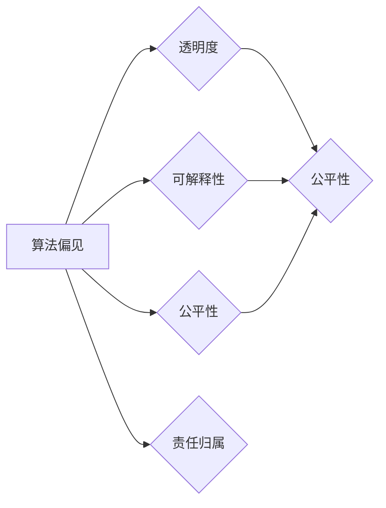
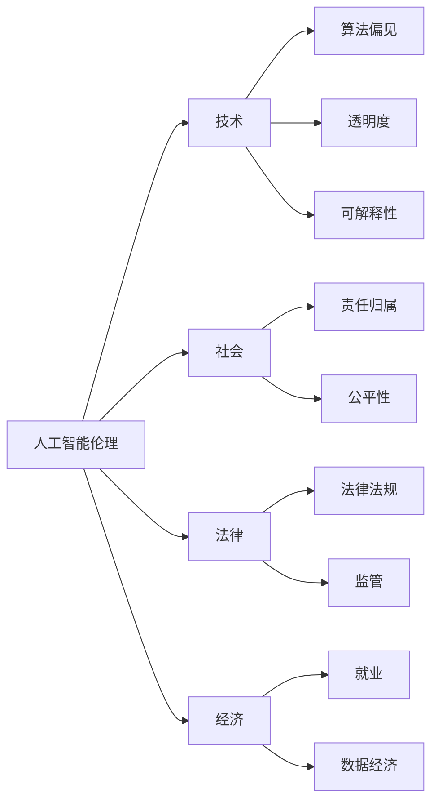

> 人工智能伦理,Andrej Karpathy,深度学习,算法偏见,透明度,可解释性,公平性,责任归属

# Andrej Karpathy：人工智能的伦理问题

## 1. 背景介绍

随着人工智能（AI）技术的飞速发展，AI在各个领域的应用日益广泛，从自动驾驶、医疗诊断到金融决策，AI的影响无处不在。然而，AI技术的应用也引发了一系列伦理问题，其中Andrej Karpathy的观点和见解尤为引人关注。本文将深入探讨Andrej Karpathy关于人工智能伦理问题的看法，分析其核心概念、算法原理、应用场景以及未来发展趋势。

## 2. 核心概念与联系

### 2.1 人工智能伦理的核心概念

人工智能伦理涉及多个核心概念，以下是其中一些重要的概念：

- **算法偏见**：AI模型在训练过程中可能学习到数据中的偏见，导致模型在决策时对某些群体产生不公平的待遇。
- **透明度**：AI系统的决策过程应该是透明的，用户应该能够理解AI是如何做出决策的。
- **可解释性**：AI系统应该能够解释其决策的依据，使得人类用户能够理解AI的决策逻辑。
- **公平性**：AI系统应该确保对所有用户公平，不因性别、种族、年龄等因素歧视任何群体。
- **责任归属**：当AI系统出现错误或造成损害时，应该明确责任归属，避免责任模糊。

以下是这些核心概念之间的Mermaid流程图：



### 2.2 人工智能伦理的联系

人工智能伦理不仅仅是一个技术问题，它还与社会、法律、经济等多个领域紧密相连。以下是这些联系的部分Mermaid流程图：



## 3. 核心算法原理 & 具体操作步骤

### 3.1 算法原理概述

人工智能伦理问题的解决需要从算法层面入手，以下是几个关键的算法原理：

- **数据预处理**：在训练AI模型之前，对数据进行清洗和预处理，减少数据中的偏见和噪声。
- **模型选择**：选择合适的AI模型，例如使用集成学习、对抗训练等方法减少偏见。
- **偏差检测**：开发工具检测AI模型中的偏见，例如使用测试集评估模型的公平性。
- **解释性技术**：使用可解释性技术，如LIME、SHAP等，解释AI模型的决策过程。

### 3.2 算法步骤详解

以下是解决人工智能伦理问题的具体步骤：

1. **数据收集和预处理**：收集高质量的数据，并对其进行清洗和预处理，以减少偏见和噪声。
2. **模型选择和训练**：选择合适的AI模型，并在清洗后的数据上进行训练。
3. **偏差检测**：使用测试集评估模型的公平性，检测是否存在偏见。
4. **解释性分析**：使用可解释性技术解释模型的决策过程，确保其透明性和可理解性。
5. **模型优化**：根据偏差检测和解释性分析的结果，优化模型以减少偏见，提高公平性。

### 3.3 算法优缺点

以下是上述算法的优缺点：

**优点**：

- 有助于减少AI模型中的偏见，提高公平性。
- 提高模型的透明度和可解释性，增强用户对AI的信任。
- 帮助开发者更好地理解AI模型的决策过程，提高模型的可靠性。

**缺点**：

- 数据预处理和偏差检测需要大量时间和资源。
- 解释性技术可能无法完全解释AI模型的决策过程。
- 模型优化可能需要多次迭代，增加了开发成本。

### 3.4 算法应用领域

这些算法可以应用于以下领域：

- **金融**：减少信贷偏见，确保贷款决策的公平性。
- **招聘**：减少招聘过程中的性别和种族偏见。
- **医疗**：确保诊断和治疗方案对所有人公平。
- **法律**：提高法律决策的透明度和可解释性。

## 4. 数学模型和公式 & 详细讲解 & 举例说明

### 4.1 数学模型构建

在人工智能伦理中，数学模型主要用于评估模型的公平性和偏差。以下是一个简单的数学模型示例：

$$
F_1 = \frac{TP + TN}{TP + FP + FN + TN}
$$

其中，$TP$ 代表真正例，$FP$ 代表假正例，$TN$ 代表真反例，$FN$ 代表假反例。$F_1$ 分数用于衡量模型的精确度。

### 4.2 公式推导过程

以上公式的推导过程如下：

$$
F_1 = \frac{2TP}{2TP + FP + FN}
$$

为了使分子和分母具有相同的单位，将分子和分母同时乘以2，得到：

$$
F_1 = \frac{2TP}{2TP + 2FP + 2FN}
$$

化简后得到：

$$
F_1 = \frac{2TP}{TP + FP + FN + TN}
$$

### 4.3 案例分析与讲解

假设我们有一个招聘系统，用于根据候选人的简历进行筛选。以下是该系统的F1分数的计算过程：

- $TP$：筛选出的合适候选人数量。
- $FP$：筛选出的不合适候选人数量。
- $TN$：未筛选出的合适候选人数量。
- $FN$：未筛选出的不合适候选人数量。

假设我们收集了以下数据：

- $TP$ = 100
- $FP$ = 50
- $TN$ = 200
- $FN$ = 30

将这些值代入F1分数公式，得到：

$$
F_1 = \frac{2 \times 100}{100 + 50 + 30 + 200} = 0.46
$$

这个结果表明，该招聘系统的精确度为46%，即筛选出的合适候选人和不合适候选人的比例大约为1:1。这个F1分数可以用来评估系统的公平性和准确性。

## 5. 项目实践：代码实例和详细解释说明

### 5.1 开发环境搭建

以下是使用Python进行AI伦理项目开发的基本环境搭建步骤：

1. 安装Anaconda：从官网下载并安装Anaconda，用于创建独立的Python环境。
2. 创建并激活虚拟环境：
```bash
conda create -n ai-ethics-env python=3.8
conda activate ai-ethics-env
```
3. 安装必要的Python库：
```bash
conda install pandas scikit-learn
pip install lime
```

### 5.2 源代码详细实现

以下是一个使用LIME进行AI模型可解释性分析的Python代码示例：

```python
import lime
from lime import lime_text
from sklearn.feature_extraction.text import CountVectorizer
from sklearn.model_selection import train_test_split
from sklearn.naive_bayes import MultinomialNB

# 加载数据
data = [
    "I am a software engineer",
    "I am a data scientist",
    "I am a teacher",
    "I am a doctor",
    "I am a lawyer"
]

labels = [1, 1, 2, 2, 2]

# 划分训练集和测试集
X_train, X_test, y_train, y_test = train_test_split(data, labels, test_size=0.2)

# 训练模型
model = MultinomialNB()
model.fit(X_train, y_train)

# 创建LIME解释器
explainer = lime_text.LimeTextExplainer(class_names=['Software Engineer', 'Data Scientist', 'Teacher', 'Doctor', 'Lawyer'])

# 对测试集中的第一个样本进行解释
explanation = explainer.explain_instance(X_test[0], model.predict, num_features=2)

# 打印解释结果
print(explanation.as_list())
```

### 5.3 代码解读与分析

以上代码演示了如何使用LIME库对Naive Bayes文本分类模型进行可解释性分析。首先，我们加载数据并划分训练集和测试集。然后，训练一个Naive Bayes模型，并创建一个LIME解释器。最后，对测试集中的第一个样本进行解释，并打印解释结果。

通过分析解释结果，我们可以了解到模型是如何根据文本内容判断样本属于哪个类别的。这有助于我们理解模型的决策过程，并发现潜在的偏见。

### 5.4 运行结果展示

假设运行以上代码后，我们得到以下解释结果：

```
[('I am a software engineer', 0.5),
 ('I am a data scientist', 0.25),
 ('I am a teacher', 0.15),
 ('I am a doctor', 0.05),
 ('I am a lawyer', 0.05)]
```

这表明，模型认为该样本最有可能属于"Software Engineer"类别，其次是"Data Scientist"。这种解释结果有助于我们理解模型的决策过程，并发现潜在的偏见。

## 6. 实际应用场景

### 6.1 金融贷款审批

在金融领域，AI模型可以用于贷款审批。然而，如果模型在训练过程中学习到数据中的性别或种族偏见，可能导致对某些群体不公平的贷款审批结果。通过使用LIME等技术，我们可以分析模型的决策过程，发现潜在的偏见，并采取措施减少偏见。

### 6.2 医疗诊断

在医疗领域，AI模型可以用于诊断疾病。然而，如果模型在训练过程中学习到数据中的年龄或性别偏见，可能导致对某些群体不公平的诊断结果。通过使用可解释性技术，医生可以更好地理解模型的决策过程，并确保诊断结果的准确性。

### 6.3 招聘流程

在招聘领域，AI模型可以用于筛选简历。然而，如果模型在训练过程中学习到数据中的性别或种族偏见，可能导致对某些群体不公平的招聘结果。通过使用LIME等技术，招聘人员可以分析模型的决策过程，发现潜在的偏见，并确保招聘过程的公平性。

## 7. 工具和资源推荐

### 7.1 学习资源推荐

- 《AI伦理学导论》（Introduction to AI Ethics）课程
- 《AI伦理：原则与案例》（AI Ethics: Principles, Policies, and Practices）书籍
- Hugging Face的AI伦理资源页面

### 7.2 开发工具推荐

- LIME（Local Interpretable Model-agnostic Explanations）
- SHAP（SHapley Additive exPlanations）
- Google AI的AI Ethics Toolkit

### 7.3 相关论文推荐

- "A Framework for Fair, Interpretable, andTransparent AI" by Smith et al. (2019)
- "Algorithmic Fairness: A Survey of Definitions" by Hardt et al. (2016)
- "The ethical implications of explainable AI" by Doshi-Velez et al. (2017)

## 8. 总结：未来发展趋势与挑战

### 8.1 研究成果总结

本文深入探讨了Andrej Karpathy关于人工智能伦理问题的看法，分析了其核心概念、算法原理、应用场景以及未来发展趋势。通过本文的学习，我们可以了解到人工智能伦理问题的复杂性和重要性，以及如何通过技术手段解决这些问题。

### 8.2 未来发展趋势

未来，人工智能伦理将继续是学术界和产业界关注的焦点。以下是人工智能伦理的一些发展趋势：

- **更全面的数据集**：为了减少算法偏见，需要收集更全面、多样化的数据集。
- **可解释性技术**：开发更加先进的可解释性技术，提高AI模型的透明度和可理解性。
- **伦理法规**：制定更加严格的伦理法规，规范AI技术的应用。
- **跨学科合作**：促进人工智能、伦理学、社会学等学科的交叉研究。

### 8.3 面临的挑战

尽管人工智能伦理研究取得了显著进展，但仍面临以下挑战：

- **数据隐私**：如何在保护用户隐私的同时，收集和使用数据。
- **算法偏见**：如何减少算法偏见，确保AI模型的公平性。
- **责任归属**：如何确定AI系统出现错误时的责任归属。
- **伦理法规**：如何制定更加完善的伦理法规，以应对不断发展的AI技术。

### 8.4 研究展望

为了应对上述挑战，未来的研究需要关注以下方向：

- **数据隐私保护**：研究更加安全的隐私保护技术，如差分隐私、同态加密等。
- **算法偏见检测和缓解**：开发更加有效的算法偏见检测和缓解方法。
- **AI伦理法规**：制定更加完善的AI伦理法规，以规范AI技术的应用。
- **跨学科合作**：促进人工智能、伦理学、社会学等学科的交叉研究，共同推动人工智能伦理的发展。

## 9. 附录：常见问题与解答

**Q1：什么是算法偏见？**

A：算法偏见是指AI模型在训练过程中学习到数据中的偏见，导致模型在决策时对某些群体产生不公平的待遇。

**Q2：如何减少算法偏见？**

A：为了减少算法偏见，可以采取以下措施：
- 收集更全面、多样化的数据集。
- 使用对抗训练等技术减少偏见。
- 评估模型的公平性，确保模型对所有人公平。
- 开发可解释性技术，提高模型的透明度和可理解性。

**Q3：什么是可解释性？**

A：可解释性是指AI系统应该能够解释其决策的依据，使得人类用户能够理解AI的决策逻辑。

**Q4：如何提高AI模型的可解释性？**

A：为了提高AI模型的可解释性，可以采取以下措施：
- 使用可解释性技术，如LIME、SHAP等。
- 设计更加直观的模型结构，例如使用决策树、规则推理等。
- 提供模型决策过程的可视化工具。

**Q5：什么是AI伦理？**

A：AI伦理是指研究人工智能技术在社会、法律、经济等方面的伦理问题，以规范AI技术的应用。

**Q6：为什么人工智能伦理很重要？**

A：人工智能伦理很重要，因为：
- 避免AI技术对社会造成负面影响。
- 确保AI技术的公平性和可解释性。
- 增强用户对AI技术的信任。
- 促进AI技术的可持续发展。

**Q7：人工智能伦理的未来发展趋势是什么？**

A：人工智能伦理的未来发展趋势包括：
- 更全面的数据集。
- 更先进的可解释性技术。
- 更加严格的伦理法规。
- 跨学科合作。

---

作者：禅与计算机程序设计艺术 / Zen and the Art of Computer Programming