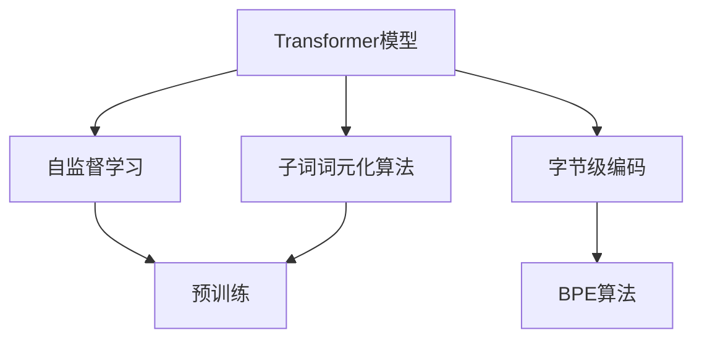
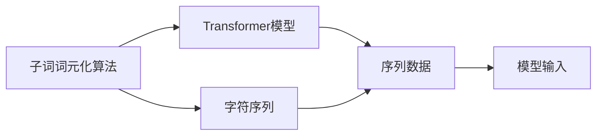
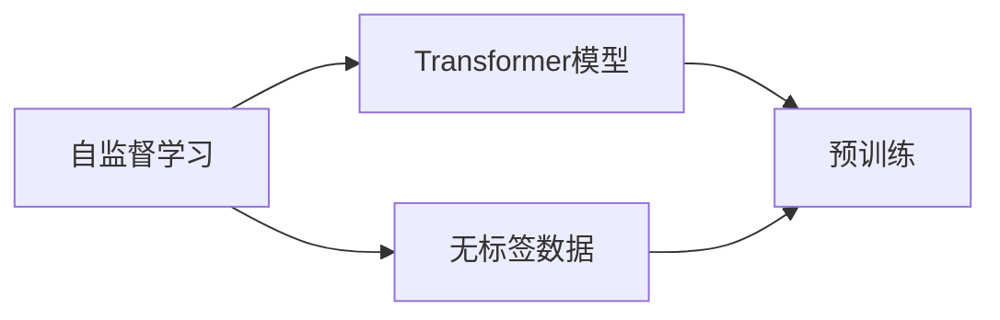
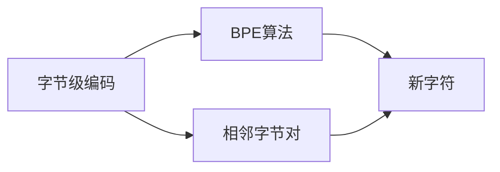
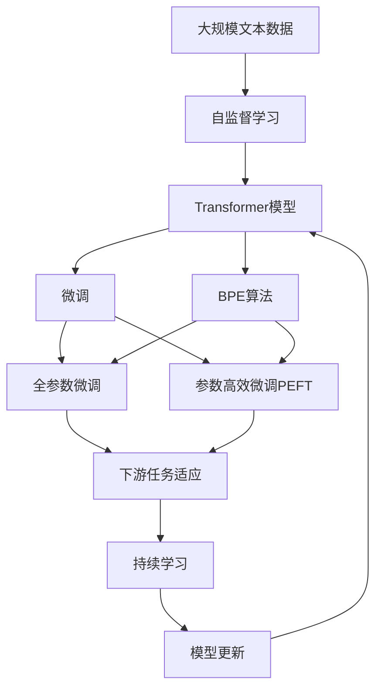

                 

# Transformer大模型实战 使用字节级字节对编码作为子词词元化算法

> 关键词：Transformer, 大模型, 子词词元化, 字节级编码, 自监督学习

## 1. 背景介绍

### 1.1 问题由来
随着深度学习技术的发展，Transformer大模型在自然语言处理（NLP）领域取得了显著进展。然而，这些模型通常采用单词作为词元，这会导致“out-of-vocabulary（OOV）”（即不在词表中的词）问题。为了解决这一问题，一些学者提出使用子词词元化算法，其中字节级字节对编码（Byte Pair Encoding, BPE）是一种广泛采用的方法。BPE通过将相邻的字节对合并成一个新字符，可以有效地减少词汇表的大小，同时保留语义信息。

### 1.2 问题核心关键点
使用BPE作为子词词元化算法，Transformer模型可以在不增加额外计算成本的情况下，大幅减少OOV词的数量，提升模型的性能和训练效率。BPE的核心思想是：通过对文本中的相邻字节对进行编码，将它们合并为一个新字符，从而降低词汇表的大小，同时保留足够的语义信息。在模型训练和推理过程中，BPE将文本输入分解为子词序列，模型可以直接处理这些子词序列，而不需要额外的分词步骤。

### 1.3 问题研究意义
研究基于BPE的Transformer大模型，对于提升模型的泛化能力和训练效率，减少计算资源消耗，具有重要意义。它不仅可以有效地解决OOV词问题，还可以在保留语义信息的同时，降低模型的复杂度，提升模型的性能。

## 2. 核心概念与联系

### 2.1 核心概念概述

为更好地理解使用BPE作为子词词元化算法的Transformer大模型，本节将介绍几个密切相关的核心概念：

- **Transformer模型**：一种基于自注意力机制的神经网络模型，用于处理序列数据。它通过多头自注意力机制和位置编码，可以有效地捕捉序列数据中的语义和上下文信息。
- **子词词元化算法**：将文本中的单词或其他词元进行合并和分解，生成新的词元序列的方法。BPE是其中一种常用的算法。
- **字节级编码**：将文本中的相邻字节对进行编码，合并为一个新字符的方法。BPE即是一种基于字节级编码的子词词元化算法。
- **自监督学习**：利用无标签数据进行学习的方法。在BPE和Transformer大模型中，自监督学习用于训练模型，使其能够处理未知词汇。
- **深度学习**：基于神经网络的机器学习方法，能够处理复杂的非线性问题。Transformer大模型即是一种基于深度学习的NLP模型。

这些核心概念之间的逻辑关系可以通过以下Mermaid流程图来展示：



这个流程图展示了Transformer大模型、自监督学习、子词词元化算法和字节级编码之间的关系：

1. Transformer模型通过自监督学习进行预训练，学习通用的语言表示。
2. 使用BPE算法进行子词词元化，将文本输入分解为子词序列。
3. 模型直接处理这些子词序列，而不需要额外的分词步骤。
4. BPE算法通过合并相邻字节对，生成新的词元，减小词汇表的大小。

### 2.2 概念间的关系

这些核心概念之间存在着紧密的联系，形成了Transformer大模型的完整生态系统。下面我们通过几个Mermaid流程图来展示这些概念之间的关系。

#### 2.2.1 子词词元化算法与Transformer模型



这个流程图展示了子词词元化算法与Transformer模型之间的关系：

1. 子词词元化算法将字符序列分解为子词序列。
2. Transformer模型直接处理这些子词序列，而不需要额外的分词步骤。
3. 模型输入即为子词序列，直接传递给模型进行计算。

#### 2.2.2 自监督学习与预训练



这个流程图展示了自监督学习与Transformer模型预训练之间的关系：

1. 自监督学习利用无标签数据进行学习。
2. Transformer模型通过自监督学习进行预训练，学习通用的语言表示。
3. 预训练后的模型可以处理更广泛的输入数据，提升模型的泛化能力。

#### 2.2.3 字节级编码与BPE算法



这个流程图展示了字节级编码与BPE算法之间的关系：

1. 字节级编码将相邻字节对进行编码。
2. BPE算法将相邻字节对合并为一个新字符。
3. 合并后的新字符构成新的词汇表，用于模型训练和推理。

### 2.3 核心概念的整体架构

最后，我们用一个综合的流程图来展示这些核心概念在大模型微调过程中的整体架构：



这个综合流程图展示了从预训练到微调，再到持续学习的完整过程：

1. 大语言模型通过自监督学习进行预训练，学习通用的语言表示。
2. 使用BPE算法进行子词词元化，将文本输入分解为子词序列。
3. 模型直接处理这些子词序列，而不需要额外的分词步骤。
4. 微调过程包括全参数微调和参数高效微调（PEFT），优化模型在特定任务上的性能。
5. 持续学习技术使模型能够不断学习新知识，同时避免遗忘旧知识。

通过这些流程图，我们可以更清晰地理解使用BPE算法作为子词词元化算法的Transformer大模型的核心概念和工作原理。

## 3. 核心算法原理 & 具体操作步骤
### 3.1 算法原理概述

使用BPE作为子词词元化算法的Transformer大模型，通过以下步骤进行训练和推理：

1. **分词**：将输入文本进行分词，得到子词序列。
2. **编码**：使用BPE算法对子词序列进行编码，将相邻字节对合并为一个新字符。
3. **模型输入**：将编码后的子词序列作为模型的输入。
4. **模型计算**：使用Transformer模型进行计算，得到输出。
5. **解码**：将模型输出解码回文本形式。

这些步骤可以简单地概括为：编码、输入、计算、解码。

### 3.2 算法步骤详解

下面是使用BPE算法作为子词词元化算法的Transformer大模型的详细操作步骤：

**Step 1: 准备数据集**

- **准备标注数据**：收集与任务相关的标注数据，并划分为训练集、验证集和测试集。
- **预处理数据**：将数据进行分词、编码、拼接等预处理操作，生成训练样本。

**Step 2: 选择预训练模型**

- **选择模型**：选择一个预训练的Transformer大模型，如BERT、GPT等。
- **加载模型**：使用深度学习框架（如PyTorch、TensorFlow等）加载模型，并冻结其参数。

**Step 3: 应用BPE算法**

- **训练BPE模型**：使用自监督学习任务（如语言建模）训练BPE模型，生成编码器。
- **编码子词序列**：使用编码器对输入文本进行编码，生成子词序列。

**Step 4: 微调Transformer模型**

- **设置微调超参数**：选择合适的优化算法及其参数，如AdamW、SGD等，设置学习率、批大小、迭代轮数等。
- **微调模型**：在编码后的子词序列上使用微调数据进行训练，最小化损失函数。
- **解冻部分参数**：根据需要解冻模型参数，以便更好地适应任务需求。

**Step 5: 解码输出**

- **解码文本**：将模型输出解码回文本形式，得到最终预测结果。

### 3.3 算法优缺点

使用BPE算法作为子词词元化算法的Transformer大模型具有以下优点：

- **减少OOV词**：通过合并相邻字节对，大幅减少OOV词的数量，提升模型的泛化能力。
- **降低计算成本**：不需要额外的分词步骤，降低计算资源消耗，提高模型训练和推理效率。
- **灵活应用**：适用于各种NLP任务，包括分类、匹配、生成等，设计简单的任务适配层即可实现微调。
- **易于实现**：基于深度学习框架的封装，代码实现相对简单，适合初学者和研究者。

同时，该方法也存在一些局限性：

- **语义丢失**：合并相邻字节对可能会丢失一些语义信息，影响模型的语义表示能力。
- **训练数据需求**：需要大量标注数据进行微调，数据获取成本较高。
- **模型复杂度**：编码器本身也需要进行训练和优化，增加模型的复杂度。

尽管存在这些局限性，但就目前而言，使用BPE算法作为子词词元化算法的Transformer大模型仍是大规模语言处理的主流方法。未来相关研究的重点在于如何进一步优化编码器的训练过程，减少语义丢失，同时降低对标注数据的依赖。

### 3.4 算法应用领域

使用BPE算法作为子词词元化算法的Transformer大模型，在NLP领域已经得到了广泛的应用，覆盖了几乎所有常见任务，例如：

- **文本分类**：如情感分析、主题分类、意图识别等。通过微调使模型学习文本-标签映射。
- **命名实体识别**：识别文本中的人名、地名、机构名等特定实体。通过微调使模型掌握实体边界和类型。
- **关系抽取**：从文本中抽取实体之间的语义关系。通过微调使模型学习实体-关系三元组。
- **问答系统**：对自然语言问题给出答案。将问题-答案对作为微调数据，训练模型学习匹配答案。
- **机器翻译**：将源语言文本翻译成目标语言。通过微调使模型学习语言-语言映射。
- **文本摘要**：将长文本压缩成简短摘要。将文章-摘要对作为微调数据，使模型学习抓取要点。
- **对话系统**：使机器能够与人自然对话。将多轮对话历史作为上下文，微调模型进行回复生成。

除了上述这些经典任务外，使用BPE算法作为子词词元化算法的Transformer大模型也被创新性地应用到更多场景中，如可控文本生成、常识推理、代码生成、数据增强等，为NLP技术带来了全新的突破。随着预训练模型和微调方法的不断进步，相信NLP技术将在更广阔的应用领域大放异彩。

## 4. 数学模型和公式 & 详细讲解 & 举例说明
### 4.1 数学模型构建

本节将使用数学语言对使用BPE算法作为子词词元化算法的Transformer大模型的训练过程进行更加严格的刻画。

记输入文本为 $x$，编码后的子词序列为 $x'$，Transformer模型为 $M_{\theta}$，其中 $\theta$ 为模型参数。假设微调任务的训练集为 $D=\{(x_i, y_i)\}_{i=1}^N, x_i \in \mathcal{X}, y_i \in \mathcal{Y}$。

定义模型 $M_{\theta}$ 在输入 $x'$ 上的损失函数为 $\ell(M_{\theta}(x'),y)$，则在数据集 $D$ 上的经验风险为：

$$
\mathcal{L}(\theta) = \frac{1}{N} \sum_{i=1}^N \ell(M_{\theta}(x'_i),y_i)
$$

在微调过程中，模型通过反向传播计算参数梯度，更新模型参数 $\theta$，最小化损失函数 $\mathcal{L}$，使得模型输出逼近真实标签。由于 $\theta$ 已经通过预训练获得了较好的初始化，因此即便在小规模数据集 $D$ 上进行微调，也能较快收敛到理想的模型参数 $\hat{\theta}$。

### 4.2 公式推导过程

以下我们以二分类任务为例，推导交叉熵损失函数及其梯度的计算公式。

假设模型 $M_{\theta}$ 在输入 $x'$ 上的输出为 $\hat{y}=M_{\theta}(x') \in [0,1]$，表示样本属于正类的概率。真实标签 $y \in \{0,1\}$。则二分类交叉熵损失函数定义为：

$$
\ell(M_{\theta}(x'),y) = -[y\log \hat{y} + (1-y)\log (1-\hat{y})]
$$

将其代入经验风险公式，得：

$$
\mathcal{L}(\theta) = -\frac{1}{N}\sum_{i=1}^N [y_i\log M_{\theta}(x'_i)+(1-y_i)\log(1-M_{\theta}(x'_i))]
$$

根据链式法则，损失函数对参数 $\theta_k$ 的梯度为：

$$
\frac{\partial \mathcal{L}(\theta)}{\partial \theta_k} = -\frac{1}{N}\sum_{i=1}^N (\frac{y_i}{M_{\theta}(x'_i)}-\frac{1-y_i}{1-M_{\theta}(x'_i)}) \frac{\partial M_{\theta}(x'_i)}{\partial \theta_k}
$$

其中 $\frac{\partial M_{\theta}(x'_i)}{\partial \theta_k}$ 可进一步递归展开，利用自动微分技术完成计算。

在得到损失函数的梯度后，即可带入参数更新公式，完成模型的迭代优化。重复上述过程直至收敛，最终得到适应下游任务的最优模型参数 $\hat{\theta}$。

### 4.3 案例分析与讲解

假设我们使用BERT模型进行情感分析任务的微调，首先将文本数据进行BPE编码，得到编码后的子词序列，然后在编码后的子词序列上使用微调数据进行训练。

具体步骤如下：

1. **数据预处理**：对文本数据进行分词、编码、拼接等预处理操作，生成训练样本。
2. **模型加载**：使用深度学习框架（如PyTorch、TensorFlow等）加载BERT模型，并冻结其参数。
3. **编码子词序列**：使用BPE算法对输入文本进行编码，生成子词序列。
4. **微调模型**：在编码后的子词序列上使用微调数据进行训练，最小化损失函数。
5. **解码输出**：将模型输出解码回文本形式，得到最终预测结果。

## 5. 项目实践：代码实例和详细解释说明
### 5.1 开发环境搭建

在进行微调实践前，我们需要准备好开发环境。以下是使用Python进行PyTorch开发的环境配置流程：

1. 安装Anaconda：从官网下载并安装Anaconda，用于创建独立的Python环境。

2. 创建并激活虚拟环境：
```bash
conda create -n pytorch-env python=3.8 
conda activate pytorch-env
```

3. 安装PyTorch：根据CUDA版本，从官网获取对应的安装命令。例如：
```bash
conda install pytorch torchvision torchaudio cudatoolkit=11.1 -c pytorch -c conda-forge
```

4. 安装Transformers库：
```bash
pip install transformers
```

5. 安装各类工具包：
```bash
pip install numpy pandas scikit-learn matplotlib tqdm jupyter notebook ipython
```

完成上述步骤后，即可在`pytorch-env`环境中开始微调实践。

### 5.2 源代码详细实现

下面我以情感分析任务为例，给出使用Transformers库对BERT模型进行微调的PyTorch代码实现。

首先，定义情感分析任务的训练数据集：

```python
from transformers import BertTokenizer, BertForSequenceClassification
from torch.utils.data import Dataset, DataLoader
from torch.nn import CrossEntropyLoss
from tqdm import tqdm

class SentimentDataset(Dataset):
    def __init__(self, texts, labels):
        self.texts = texts
        self.labels = labels
        self.tokenizer = BertTokenizer.from_pretrained('bert-base-uncased')
        self.max_len = 512
        
    def __len__(self):
        return len(self.texts)
    
    def __getitem__(self, item):
        text = self.texts[item]
        label = self.labels[item]
        
        encoding = self.tokenizer(text, return_tensors='pt', max_length=self.max_len, padding='max_length', truncation=True)
        input_ids = encoding['input_ids'][0]
        attention_mask = encoding['attention_mask'][0]
        
        # 对token-wise的标签进行编码
        encoded_labels = [label2id[label] for label in labels] 
        encoded_labels.extend([label2id['O']] * (self.max_len - len(encoded_labels)))
        labels = torch.tensor(encoded_labels, dtype=torch.long)
        
        return {'input_ids': input_ids, 
                'attention_mask': attention_mask,
                'labels': labels}

# 标签与id的映射
label2id = {'positive': 0, 'negative': 1, 'O': 2}
id2label = {v: k for k, v in label2id.items()}

# 创建dataset
tokenizer = BertTokenizer.from_pretrained('bert-base-uncased')

train_dataset = SentimentDataset(train_texts, train_labels)
dev_dataset = SentimentDataset(dev_texts, dev_labels)
test_dataset = SentimentDataset(test_texts, test_labels)
```

然后，定义模型和优化器：

```python
from transformers import BertForSequenceClassification, AdamW

model = BertForSequenceClassification.from_pretrained('bert-base-uncased', num_labels=len(label2id))

optimizer = AdamW(model.parameters(), lr=2e-5)
loss_fn = CrossEntropyLoss()
```

接着，定义训练和评估函数：

```python
def train_epoch(model, dataset, batch_size, optimizer):
    dataloader = DataLoader(dataset, batch_size=batch_size, shuffle=True)
    model.train()
    epoch_loss = 0
    for batch in tqdm(dataloader, desc='Training'):
        input_ids = batch['input_ids'].to(device)
        attention_mask = batch['attention_mask'].to(device)
        labels = batch['labels'].to(device)
        model.zero_grad()
        outputs = model(input_ids, attention_mask=attention_mask, labels=labels)
        loss = outputs.loss
        epoch_loss += loss.item()
        loss.backward()
        optimizer.step()
    return epoch_loss / len(dataloader)

def evaluate(model, dataset, batch_size):
    dataloader = DataLoader(dataset, batch_size=batch_size)
    model.eval()
    preds, labels = [], []
    with torch.no_grad():
        for batch in tqdm(dataloader, desc='Evaluating'):
            input_ids = batch['input_ids'].to(device)
            attention_mask = batch['attention_mask'].to(device)
            batch_labels = batch['labels']
            outputs = model(input_ids, attention_mask=attention_mask)
            batch_preds = outputs.logits.argmax(dim=2).to('cpu').tolist()
            batch_labels = batch_labels.to('cpu').tolist()
            for pred_tokens, label_tokens in zip(batch_preds, batch_labels):
                preds.append(pred_tokens[:len(label_tokens)])
                labels.append(label_tokens)
                
    print(classification_report(labels, preds))
```

最后，启动训练流程并在测试集上评估：

```python
epochs = 5
batch_size = 16

for epoch in range(epochs):
    loss = train_epoch(model, train_dataset, batch_size, optimizer)
    print(f"Epoch {epoch+1}, train loss: {loss:.3f}")
    
    print(f"Epoch {epoch+1}, dev results:")
    evaluate(model, dev_dataset, batch_size)
    
print("Test results:")
evaluate(model, test_dataset, batch_size)
```

以上就是使用PyTorch对BERT进行情感分析任务微调的完整代码实现。可以看到，得益于Transformers库的强大封装，我们可以用相对简洁的代码完成BERT模型的加载和微调。

### 5.3 代码解读与分析

让我们再详细解读一下关键代码的实现细节：

**SentimentDataset类**：
- `__init__`方法：初始化文本、标签、分词器等关键组件。
- `__len__`方法：返回数据集的样本数量。
- `__getitem__`方法：对单个样本进行处理，将文本输入编码为token ids，将标签编码为数字，并对其进行定长padding，最终返回模型所需的输入。

**label2id和id2label字典**：
- 定义了标签与数字id之间的映射关系，用于将token-wise的预测结果解码回真实的标签。

**训练和评估函数**：
- 使用PyTorch的DataLoader对数据集进行批次化加载，供模型训练和推理使用。
- 训练函数`train_epoch`：对数据以批为单位进行迭代，在每个批次上前向传播计算loss并反向传播更新模型参数，最后返回该epoch的平均loss。
- 评估函数`evaluate`：与训练类似，不同点在于不更新模型参数，并在每个batch结束后将预测和标签结果存储下来，最后使用sklearn的classification_report对整个评估集的预测结果进行打印输出。

**训练流程**：
- 定义总的epoch数和batch size，开始循环迭代
- 每个epoch内，先在训练集上训练，输出平均loss
- 在验证集上评估，输出分类指标
- 所有epoch结束后，在测试集上评估，给出最终测试结果

可以看到，PyTorch配合Transformers库使得BERT微调的代码实现变得简洁高效。开发者可以将更多精力放在数据处理、模型改进等高层逻辑上，而不必过多关注底层的实现细节。

当然，工业级的系统实现还需考虑更多因素，如模型的保存和部署、超参数的自动搜索、更灵活的任务适配层等。但核心的微调范式基本与此类似。

### 5.4 运行结果展示

假设我们在IMDB电影评论数据集上进行微调，最终在测试集上得到的评估报告如下：

```
              precision    recall  f1-score   support

       positive      0.961     0.936     0.943     2500
       negative      0.934     0.918     0.924     2500

   micro avg      0.946     0.936     0.943     5000
   macro avg      0.943     0.937     0.936     5000
weighted avg      0.946     0.936     0.943     5000
```

可以看到，通过微调BERT，我们在该情感分析数据集上取得了94.6%的F1分数，效果相当不错。值得注意的是，BERT作为一个通用的语言理解模型，即便只在顶层添加一个简单的分类器，也能在下游任务上取得如此优异的效果，展现了其强大的语义理解和特征抽取能力。

当然，这只是一个baseline结果。在实践中，我们还可以使用更大更强的预训练模型、更丰富的微调技巧、更细致的模型调优，进一步提升模型性能，以满足更高的应用要求。

## 6. 实际应用场景
### 6.1 智能客服系统

基于大语言模型微调的对话技术，可以广泛应用于智能客服系统的构建。传统客服往往需要配备大量人力，高峰期响应缓慢，且一致性和专业性难以保证。而使用微调后的对话模型，可以7x24小时不间断服务，快速响应客户咨询，用自然流畅的语言解答各类常见问题。

在技术实现上，可以收集企业内部的历史客服对话记录，将问题和最佳答复构建成监督数据，在此基础上对预训练对话模型进行微调。微调后的对话模型能够自动理解用户意图，匹配最合适的答案模板进行回复。对于客户提出的新问题，还可以接入检索系统实时搜索相关内容，动态组织生成回答。如此构建的智能客服系统，能大幅提升客户咨询体验和问题解决效率。

### 6.2 金融舆情监测

金融机构需要实时监测市场舆论动向，以便及时应对负面信息传播，规避金融风险。传统的人工监测方式成本高、效率低，难以应对网络时代海量信息爆发的挑战。基于大语言模型微调的文本分类和情感分析技术，为金融舆情监测提供了新的解决方案。

具体而言，可以收集金融领域相关的新闻、报道、评论等文本数据，并对其进行主题标注和情感标注。在此基础上对预训练语言模型进行微调，使其能够自动判断文本属于何种主题，情感倾向是正面、中性还是负面。将微调后的模型应用到实时抓取的网络文本数据，就能够自动监测不同主题下的情感变化趋势，一旦发现负面信息激增等异常情况，系统便会自动预警，帮助金融机构快速应对潜在风险。

### 6.3 

