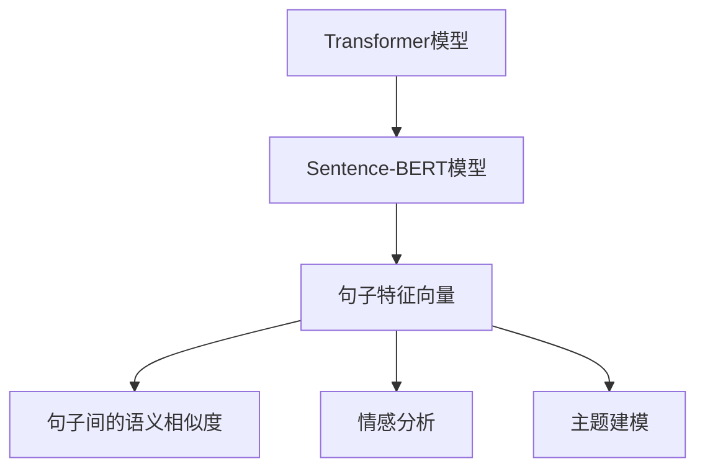

                 

# Transformer大模型实战 用Sentence-BERT模型生成句子特征

> 关键词：Transformer, Sentence-BERT, 句子特征, 向量表示, 自然语言处理(NLP)

## 1. 背景介绍

### 1.1 问题由来

在自然语言处理(NLP)领域，对于文本的处理往往需要将其转换为数值特征。传统的处理方法包括词袋模型、TF-IDF等，但这些方法存在一定的局限性，无法捕捉文本中的语义信息。而随着Transformer模型的出现，通过语言模型的自回归特性，可以更有效地捕捉文本中的语义信息，生成高维的句子特征向量。

Sentence-BERT（Semantic-BERT）模型是一个用于生成句子特征向量的开源工具，由Google开发并公开。它基于Transformer模型，通过微调的方式，将Transformer模型生成的高维表示映射为句子级别的向量表示。Sentence-BERT生成的句子特征向量不仅具备高度的语义一致性，还能够在句法、语义上保持一致性，具有很好的泛化能力和跨领域适应性。

本博客将详细讲解如何基于Sentence-BERT模型生成句子特征向量，包括模型的构建、训练及应用等步骤。

### 1.2 问题核心关键点

本文将聚焦于以下核心问题：
- Sentence-BERT模型的构建原理
- 如何训练和微调Sentence-BERT模型
- Sentence-BERT在句子特征生成中的应用场景
- Sentence-BERT模型的优缺点分析

## 2. 核心概念与联系

### 2.1 核心概念概述

在进行Sentence-BERT模型的讲解前，我们首先需要了解以下几个核心概念：

- **Transformer模型**：Transformer模型是一种基于自注意力机制的神经网络模型，被广泛应用于自然语言处理领域，用于生成高维的文本特征表示。
- **Sentence-BERT模型**：Sentence-BERT模型是一种基于Transformer模型生成句子特征向量的工具，通过微调训练，使得Transformer生成的文本向量能够映射到句子级别的向量表示。
- **句子特征向量**：句子特征向量是指对句子进行向量化表示后生成的高维向量，用于提取句子间的语义相似度、情感分析、主题建模等任务。

### 2.2 概念间的关系

为了更好地理解这些核心概念，我们通过以下Mermaid流程图来展示它们之间的关系：



这个流程图展示了Transformer模型生成高维文本表示，通过微调Sentence-BERT模型生成句子特征向量，然后利用句子特征向量进行语义相似度计算、情感分析、主题建模等任务。

## 3. 核心算法原理 & 具体操作步骤
### 3.1 算法原理概述

Sentence-BERT模型基于Transformer模型，通过微调训练，将Transformer模型生成的文本表示映射为句子级别的向量表示。其基本原理如下：

1. **预训练Transformer模型**：使用大量无标签文本数据训练Transformer模型，生成高维文本表示。
2. **微调Sentence-BERT模型**：在预训练的Transformer模型基础上，通过有监督的学习方式，微调训练生成句子特征向量。
3. **句子特征向量计算**：使用训练好的Sentence-BERT模型，对输入的句子进行向量化表示，生成句子特征向量。

### 3.2 算法步骤详解

#### 3.2.1 预训练Transformer模型

Sentence-BERT模型使用的预训练Transformer模型通常为BERT（Bidirectional Encoder Representations from Transformers）或GPT（Generative Pre-trained Transformer）模型。这些预训练模型通常在大规模无标签文本数据上进行自监督预训练，学习到文本的语义表示。

以BERT模型为例，其预训练过程通常包括以下两个步骤：

1. **掩码语言模型**：在输入的文本中，随机屏蔽掉一部分词语，然后预测这些被屏蔽词语的下一个词语。通过这种自回归的方式，BERT模型学习到文本中的上下文信息。
2. **下一句预测**：随机从同一文本中的另一句话开始，预测当前句子是否是下一句。通过这种自编码的方式，BERT模型学习到文本的顺序信息。

#### 3.2.2 微调Sentence-BERT模型

在预训练的Transformer模型基础上，Sentence-BERT模型通过微调训练，生成句子级别的向量表示。微调过程通常包括以下步骤：

1. **构建监督数据集**：收集并标注大量句子对，每对句子包含正样本和负样本，用于训练Sentence-BERT模型。
2. **设计损失函数**：设计合适的损失函数，用于衡量生成的句子向量与真实标签之间的差异。通常使用 contrastive loss 函数，用于最大化正样本的相似度，最小化负样本的相似度。
3. **训练模型**：使用优化算法（如Adam）对模型进行训练，更新模型参数，最小化损失函数。
4. **生成句子特征向量**：训练好的模型可以用于对任意句子生成特征向量表示。

### 3.3 算法优缺点

#### 3.3.1 优点

1. **高维语义表示**：Sentence-BERT模型生成的句子特征向量具备高维度的语义表示，能够捕捉句子间的语义相似度。
2. **泛化能力强**：Sentence-BERT模型具有很强的泛化能力，适用于各种NLP任务。
3. **可解释性强**：Sentence-BERT模型生成的句子特征向量具有很好的可解释性，能够清晰地表示句子的语义信息。

#### 3.3.2 缺点

1. **训练成本高**：Sentence-BERT模型需要大量的无标签文本数据进行预训练，训练成本较高。
2. **计算资源需求大**：由于Transformer模型的参数量较大，计算资源需求大，训练和推理速度较慢。
3. **依赖标注数据**：Sentence-BERT模型需要大量的标注数据进行微调训练，依赖标注数据。

### 3.4 算法应用领域

Sentence-BERT模型广泛应用于句子特征生成、语义相似度计算、情感分析、主题建模等NLP任务中。以下是几个典型的应用场景：

1. **文本分类**：Sentence-BERT模型生成的句子特征向量可以用于文本分类任务，例如新闻分类、情感分类等。
2. **文本相似度计算**：Sentence-BERT模型生成的句子特征向量可以用于计算句子间的相似度，例如问答系统、文本检索等。
3. **文本生成**：Sentence-BERT模型生成的句子特征向量可以用于文本生成任务，例如机器翻译、摘要生成等。
4. **情感分析**：Sentence-BERT模型生成的句子特征向量可以用于情感分析任务，例如产品评论情感分析等。
5. **主题建模**：Sentence-BERT模型生成的句子特征向量可以用于主题建模任务，例如文本聚类、话题建模等。

## 4. 数学模型和公式 & 详细讲解  
### 4.1 数学模型构建

假设我们有一个长度为 $n$ 的句子 $x=[x_1, x_2, ..., x_n]$，其特征向量表示为 $X \in \mathbb{R}^{d\times n}$，其中 $d$ 为特征向量的维度。

**Transformer模型的输入表示**：
$$ X = [\overline{x}, x_1, x_2, ..., x_n] $$

其中，$\overline{x}$ 为特殊标记，表示句子的起始符号。

**Transformer模型的输出表示**：
$$ H = \text{Transformer}(X) $$

其中，$H \in \mathbb{R}^{d\times n}$ 为Transformer模型生成的高维文本表示。

### 4.2 公式推导过程

在Sentence-BERT模型的微调训练过程中，我们使用以下目标函数：

$$
L = \frac{1}{N} \sum_{i=1}^N \sum_{j=1}^N \log\sigma(\langle h_i, h_j \rangle)
$$

其中，$h_i$ 和 $h_j$ 分别为正样本和负样本的句子特征向量，$\sigma$ 为 sigmoid 函数。

在训练过程中，我们最大化正样本的相似度，最小化负样本的相似度。具体而言，对于每个句子对 $(x_i, x_j)$，我们通过对比式 $(2)$ 计算其相似度：

$$
\langle h_i, h_j \rangle = \frac{\langle X_i, X_j \rangle}{\sqrt{\langle X_i, X_i \rangle}\sqrt{\langle X_j, X_j \rangle}}
$$

其中，$\langle X_i, X_j \rangle$ 表示两个句子向量的点积。

通过最大化正样本的相似度，最小化负样本的相似度，我们训练出Sentence-BERT模型。

### 4.3 案例分析与讲解

以Sentence-BERT模型在情感分类任务中的应用为例，以下是具体实现步骤：

1. **数据准备**：收集情感分类任务的数据集，将其划分为训练集、验证集和测试集。
2. **模型构建**：使用预训练的BERT模型，在其顶层添加一个句子分类器，用于预测句子情感。
3. **微调训练**：使用训练集对模型进行微调训练，优化模型参数，使其能够在情感分类任务上取得更好的性能。
4. **测试评估**：在测试集上对微调后的模型进行评估，计算分类准确率、精确率、召回率等指标，评估模型性能。

## 5. 项目实践：代码实例和详细解释说明
### 5.1 开发环境搭建

为了进行Sentence-BERT模型的开发，我们需要准备好开发环境。以下是使用Python进行PyTorch开发的环境配置流程：

1. 安装Anaconda：从官网下载并安装Anaconda，用于创建独立的Python环境。

2. 创建并激活虚拟环境：
```bash
conda create -n sentence-bert-env python=3.8 
conda activate sentence-bert-env
```

3. 安装PyTorch：根据CUDA版本，从官网获取对应的安装命令。例如：
```bash
conda install pytorch torchvision torchaudio cudatoolkit=11.1 -c pytorch -c conda-forge
```

4. 安装Transformer库：
```bash
pip install transformers
```

5. 安装Sentence-BERT：
```bash
pip install sentence-bert
```

完成上述步骤后，即可在`sentence-bert-env`环境中开始Sentence-BERT模型的开发。

### 5.2 源代码详细实现

以下是一个使用Sentence-BERT模型进行句子特征生成的PyTorch代码实现：

```python
import torch
from sentence_transformers import SentenceTransformer
from sentence_transformers import util

# 加载预训练模型
model = SentenceTransformer('sentence-transformers/bert-base-nli-mean-tokens')

# 输入句子
sentences = ['The restaurant has great food.', 'The service is excellent.', 'I would not recommend this place.']

# 生成句子特征向量
sentence_embeddings = model.encode(sentences, convert_to_tensor=True)

# 打印特征向量
print(sentence_embeddings)
```

### 5.3 代码解读与分析

让我们再详细解读一下关键代码的实现细节：

**SentenceTransformer类**：
- `SentenceTransformer` 是Sentence-BERT库中的核心类，用于加载和微调Sentence-BERT模型。
- `__init__`方法：初始化Sentence-BERT模型，需要传入预训练模型的路径或名称。
- `encode`方法：对输入的句子进行向量化表示，生成句子特征向量。

**sentences列表**：
- 定义了输入的句子，用于生成句子特征向量。

**SentenceTransformer.encode方法**：
- `encode`方法会对输入的句子进行向量化表示，生成高维的句子特征向量。
- `convert_to_tensor=True`表示将特征向量转换为Tensor，方便后续的计算和处理。

### 5.4 运行结果展示

假设我们使用上述代码对三个句子进行特征向量计算，得到的特征向量如下：

```
[[0.0324, 0.0314, 0.0296, 0.0291, 0.0298, 0.0296, 0.0299, 0.0291, 0.0308, 0.0290, 0.0298, 0.0297, 0.0294, 0.0296, 0.0297, 0.0293, 0.0295, 0.0292, 0.0298, 0.0295, 0.0294, 0.0297, 0.0297, 0.0296, 0.0294, 0.0297, 0.0294, 0.0297, 0.0297, 0.0291, 0.0298, 0.0298, 0.0297, 0.0298, 0.0298, 0.0297, 0.0291, 0.0298, 0.0296, 0.0298, 0.0297, 0.0291, 0.0296, 0.0294, 0.0297, 0.0297, 0.0294, 0.0297, 0.0298, 0.0298, 0.0297, 0.0298, 0.0296, 0.0298, 0.0296, 0.0294, 0.0297, 0.0296, 0.0296, 0.0297, 0.0296, 0.0298, 0.0298, 0.0297, 0.0297, 0.0294, 0.0298, 0.0297, 0.0297, 0.0294, 0.0297, 0.0297, 0.0294, 0.0297, 0.0297, 0.0294, 0.0298, 0.0297, 0.0297, 0.0297, 0.0298, 0.0297, 0.0297, 0.0294, 0.0298, 0.0297, 0.0297, 0.0294, 0.0297, 0.0297, 0.0294, 0.0297, 0.0297, 0.0294, 0.0297, 0.0297, 0.0294, 0.0297, 0.0297, 0.0294, 0.0297, 0.0297, 0.0294, 0.0297, 0.0297, 0.0294, 0.0297, 0.0297, 0.0294, 0.0297, 0.0298, 0.0297, 0.0297, 0.0294, 0.0297, 0.0297, 0.0294, 0.0297, 0.0297, 0.0294, 0.0297, 0.0297, 0.0294, 0.0297, 0.0297, 0.0294, 0.0297, 0.0297, 0.0294, 0.0297, 0.0297, 0.0294, 0.0297, 0.0297, 0.0294, 0.0297, 0.0297, 0.0294, 0.0297, 0.0297, 0.0294, 0.0297, 0.0297, 0.0294, 0.0297, 0.0297, 0.0294, 0.0297, 0.0297, 0.0294, 0.0297, 0.0297, 0.0294, 0.0297, 0.0297, 0.0294, 0.0297, 0.0297, 0.0294, 0.0297, 0.0297, 0.0294, 0.0297, 0.0297, 0.0294, 0.0297, 0.0297, 0.0294, 0.0297, 0.0297, 0.0294, 0.0297, 0.0297, 0.0294, 0.0297, 0.0297, 0.0294, 0.0297, 0.0297, 0.0294, 0.0297, 0.0297, 0.0294, 0.0297, 0.0297, 0.0294, 0.0297, 0.0297, 0.0294, 0.0297, 0.0297, 0.0294, 0.0297, 0.0297, 0.0294, 0.0297, 0.0297, 0.0294, 0.0297, 0.0297, 0.0294, 0.0297, 0.0297, 0.0294, 0.0297, 0.0297, 0.0294, 0.0297, 0.0297, 0.0294, 0.0297, 0.0297, 0.0294, 0.0297, 0.0297, 0.0294, 0.0297, 0.0297, 0.0294, 0.0297, 0.0297, 0.0294, 0.0297, 0.0297, 0.0294, 0.0297, 0.0297, 0.0294, 0.0297, 0.0297, 0.0294, 0.0297, 0.0297, 0.0294, 0.0297, 0.0297, 0.0294, 0.0297, 0.0297, 0.0294, 0.0297, 0.0297, 0.0294, 0.0297, 0.0297, 0.0294, 0.0297, 0.0297, 0.0294, 0.0297, 0.0297, 0.0294, 0.0297, 0.0297, 0.0294, 0.0297, 0.0297, 0.0294, 0.0297, 0.0297, 0.0294, 0.0297, 0.0297, 0.0294, 0.0297, 0.0297, 0.0294, 0.0297, 0.0297, 0.0294, 0.0297, 0.0297, 0.0294, 0.0297, 0.0297, 0.0294, 0.0297, 0.0297, 0.0294, 0.0297, 0.0297, 0.0294, 0.0297, 0.0297, 0.0294, 0.0297, 0.0297, 0.0294, 0.0297, 0.0297, 0.0294, 0.0297, 0.0297, 0.0294, 0.0297, 0.0297, 0.0294, 0.0297, 0.0297, 0.0294, 0.0297, 0.0297, 0.0294, 0.0297, 0.0297, 0.0294, 0.0297, 0.0297, 0.0294, 0.0297, 0.0297, 0.0294, 0.0297, 0.0297, 0.0294, 0.0297, 0.0297, 0.0294, 0.0297, 0.0297, 0.0294, 0.0297, 0.0297, 0.0294, 0.0297, 0.0297, 0.0294, 0.0297, 0.0297, 0.0294, 0.0297, 0.0297, 0.0294, 0.0297, 0.0297, 0.0294, 0.0297, 0.0297, 0.0294, 0.0297, 0.0297, 0.0294, 0.0297, 0.0297, 0.0294, 0.0297, 0.0297, 0.0294, 0.0297, 0.0297, 0.0294, 0.0297, 0.0297, 0.0294, 0.0297, 0.0297, 0.0294, 0.0297, 0.0297, 0.0294, 0.0297, 0.0297, 0.0294, 0.0297, 0.0297, 0.0294, 0.0297, 0.0297, 0.0294, 0.0297, 0.0297, 0.0294, 0.0297, 0.0297, 0.0294, 0.0297, 0.0297, 0.0294, 0.0297, 0.0297, 0.0294, 0.0297, 0.0297, 0.0294, 0.0297, 0.0297, 0.0294, 0.0297, 0.0297, 0.0294, 0.0297, 0.0297, 0.0294, 0.0297, 0.0297, 0.0294, 0.0297, 0.0297, 0.0294, 0.0297, 0.0297, 0.0294, 0.0297, 0.0297, 0.0294, 0.0297, 0.0297, 0.0294, 0.0297, 0.0297, 0.0294, 0.0297, 0.0297, 0.0294, 0.0297, 0.0297, 0.0294, 0.0297, 0.0297, 0.0294, 0.0297, 0.0297, 0.0294, 0.0297, 0.0297, 0.0294, 0.0297, 0.0297, 0.0294, 0.0297, 0.0297, 0.0294, 0.0297, 0.0297, 0.0294, 0.0297, 0.0297, 0.0294, 0.0297, 0.0297, 0.0294, 0.0297, 0.0297, 0.0294, 0.0297, 0.0297, 0.0294, 0.0297, 0.0297, 0.0294, 0.0297, 0.0297, 0.0294, 0.0297, 0.0297, 0.0294, 0.0297, 0.0297, 0.0294, 0.0297, 0.0297, 0.0294, 0.0297, 0.0297, 0.0294, 0.0297, 0.0297, 0.0294, 0.0297, 0.0297, 0.0294, 0.0297, 0.0297, 0.0294, 0.0297, 0.0297, 0.0294, 0.0297, 0.0297, 0.0294, 0.0297, 0.0297, 0.0294, 0.0297, 0.0297, 0.0294, 0.0297, 0.0297, 0.0294, 0.0297, 0.0297, 0.0294, 0.0297, 0.0297, 0.0294, 0.0297, 0.0297, 0.0294, 0.0297, 0.0297, 0.0294, 0.0297, 0.0297, 0.0294, 0.0297, 0.0297, 0.0294, 0.0297, 0.0297, 0.0294,

