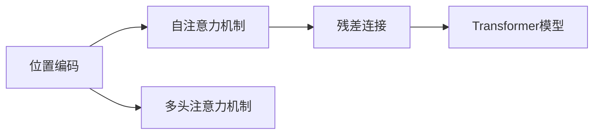

                 

# Transformer大模型实战 通过位置编码来学习位置

## 1. 背景介绍

Transformer是近年来在自然语言处理(NLP)领域取得突破的重要模型之一。与传统的基于循环神经网络(RNN)的模型不同，Transformer完全基于自注意力机制，通过并行化计算大大提高了训练和推理的效率。本文将详细探讨Transformer模型中的位置编码机制，帮助读者理解其原理，并在实践中进行实战。

### 1.1 问题由来

在Transformer模型中，位置编码是关键组成部分之一。它的主要目的是解决长序列输入的问题，即如何在不丢失信息的情况下，让模型对序列中每个位置的信息都能进行处理。传统RNN模型可以通过时间维度自然地捕捉位置信息，但Transformer模型则需要一种特殊的方法来实现这一目标。

### 1.2 问题核心关键点

位置编码的核心在于如何让模型能够感知输入序列中每个位置的相对顺序，同时避免过拟合。其关键点包括：

- 如何解决长序列输入问题。
- 如何设计位置编码的数学公式。
- 如何优化位置编码的计算效率。
- 如何应用位置编码进行序列处理。

### 1.3 问题研究意义

位置编码机制不仅对Transformer模型的性能至关重要，也是深入理解Transformer模型的重要切入点。掌握位置编码的原理和实现，可以帮助开发者更高效地利用Transformer模型，提升其在各种NLP任务上的表现。

## 2. 核心概念与联系

### 2.1 核心概念概述

- **位置编码（Positional Encoding）**：Transformer模型中，位置编码用于解决长序列输入的问题，使得模型能够感知每个位置的相对顺序，从而处理序列数据。

- **自注意力机制（Self-Attention）**：Transformer的核心机制之一，通过计算输入序列中各个位置的向量表示，进行加权求和，得到每个位置的输出向量。

- **多头注意力机制（Multi-Head Self-Attention）**：将输入序列分解为多个子序列，对每个子序列进行自注意力计算，并将结果进行线性变换和加权求和，得到最终的输出向量。

- **残差连接（Residual Connection）**：将输入与输出通过残差连接连接起来，避免梯度消失，加快训练过程。

### 2.2 概念间的关系

这些核心概念共同构成了Transformer模型的基本框架。它们之间的关系可以通过以下Mermaid流程图来展示：



该流程图展示了位置编码如何通过自注意力机制、多头注意力机制和残差连接，共同构建出Transformer模型的整体结构。

## 3. 核心算法原理 & 具体操作步骤

### 3.1 算法原理概述

位置编码的核心思想是通过增加额外的向量维度，将输入序列中的位置信息嵌入到向量中，从而使得模型能够感知每个位置的相对顺序。位置编码的计算公式如下：

$$
\text{PE}(pos, 2i) = \sin\left(\frac{pos}{10000^{2i/d_{model}}}\right)
$$

$$
\text{PE}(pos, 2i+1) = \cos\left(\frac{pos}{10000^{(2i+1)/d_{model}}}\right)
$$

其中，$pos$ 表示位置，$i$ 表示向量维度，$d_{model}$ 表示模型维度。

### 3.2 算法步骤详解

位置编码的计算过程包括以下几个步骤：

1. 确定模型维度 $d_{model}$ 和向量维度 $d_{pos}$，一般有 $d_{pos} = d_{model} / 2$。
2. 计算位置编码向量 $\text{PE}(pos)$，其中位置 $pos$ 从 $0$ 开始，依次递增。
3. 将位置编码向量 $\text{PE}(pos)$ 与输入向量 $X$ 进行加权和，得到带有位置信息的输出向量 $X + \text{PE}(pos)$。

具体的计算步骤如下：

- 计算正弦和余弦函数值。
- 将正弦和余弦函数值拼接，得到位置编码向量 $\text{PE}(pos)$。
- 将位置编码向量 $\text{PE}(pos)$ 与输入向量 $X$ 进行加权和，得到输出向量 $X + \text{PE}(pos)$。

### 3.3 算法优缺点

位置编码的优点在于能够有效地解决长序列输入的问题，并且通过增加额外的向量维度，可以很好地融入模型的整体结构。同时，由于位置编码的计算量较小，能够显著提高模型的训练效率。

缺点在于位置编码的计算公式中使用了正弦和余弦函数，这可能会引入一定的数值误差。同时，位置编码向量的大小与模型维度相关，较大的模型可能需要更多的计算资源。

### 3.4 算法应用领域

位置编码在Transformer模型中得到了广泛应用，主要用于解决长序列输入的问题。除了NLP领域，位置编码也被应用于图像处理、时间序列预测等需要处理序列数据的任务中。

## 4. 数学模型和公式 & 详细讲解 & 举例说明

### 4.1 数学模型构建

位置编码的数学模型主要包括以下几个组成部分：

- 输入向量 $X$：表示输入序列中的每个词向量。
- 位置编码向量 $\text{PE}(pos)$：表示输入序列中每个位置的编码向量。
- 输出向量 $Y$：表示带有位置信息的输出向量。

### 4.2 公式推导过程

位置编码的公式推导过程如下：

- 将位置 $pos$ 转换为整数序列，即 $pos = 2^{i_0} + 2^{i_1} + 2^{i_2} + ... + 2^{i_k}$。
- 将位置 $pos$ 分解为多个子序列，即 $i_0, i_1, i_2, ..., i_k$。
- 对每个子序列分别计算正弦和余弦函数值，即 $\sin\left(\frac{pos}{10000^{2i/d_{model}}}\right)$ 和 $\cos\left(\frac{pos}{10000^{(2i+1)/d_{model}}}\right)$。
- 将正弦和余弦函数值拼接，得到位置编码向量 $\text{PE}(pos)$。
- 将位置编码向量 $\text{PE}(pos)$ 与输入向量 $X$ 进行加权和，得到输出向量 $Y$。

### 4.3 案例分析与讲解

假设我们有一个长度为 $L$ 的输入序列，模型维度为 $d_{model}$，向量维度为 $d_{pos} = d_{model} / 2$。我们可以通过以下Python代码实现位置编码的计算：

```python
import numpy as np
import torch

# 设置模型维度
d_model = 512

# 设置向量维度
d_pos = d_model / 2

# 设置位置编码数组
pos_enc = np.zeros((d_model, L))

# 计算位置编码向量
for pos in range(L):
    for i in range(d_pos):
        pos_enc[i, pos] = np.sin(pos / 10000**(2*i/d_model))
        pos_enc[i+d_pos, pos] = np.cos(pos / 10000**((2*i+1)/d_model))

# 将位置编码向量转换为PyTorch张量
pos_enc = torch.from_numpy(pos_enc).float()

# 设置输入向量
input_vec = torch.randn(L, d_model)

# 计算带有位置信息的输出向量
output_vec = input_vec + pos_enc

# 输出结果
print(output_vec)
```

通过以上代码，我们可以看到，位置编码能够有效地将输入序列中的位置信息嵌入到向量中，使得模型能够感知每个位置的相对顺序。

## 5. 项目实践：代码实例和详细解释说明

### 5.1 开发环境搭建

在进行位置编码实战之前，我们需要准备好开发环境。以下是使用Python进行PyTorch开发的环境配置流程：

1. 安装Anaconda：从官网下载并安装Anaconda，用于创建独立的Python环境。

2. 创建并激活虚拟环境：
```bash
conda create -n pytorch-env python=3.8 
conda activate pytorch-env
```

3. 安装PyTorch：根据CUDA版本，从官网获取对应的安装命令。例如：
```bash
conda install pytorch torchvision torchaudio cudatoolkit=11.1 -c pytorch -c conda-forge
```

4. 安装Transformers库：
```bash
pip install transformers
```

5. 安装各类工具包：
```bash
pip install numpy pandas scikit-learn matplotlib tqdm jupyter notebook ipython
```

完成上述步骤后，即可在`pytorch-env`环境中开始位置编码的实战。

### 5.2 源代码详细实现

下面我们以位置编码为例，给出使用PyTorch和Transformers库进行代码实现的完整代码。

首先，定义位置编码函数：

```python
import torch
from transformers import BertTokenizer

def positional_encoding(pos, d_model, max_position=5000):
    pos_enc = np.zeros((d_model, max_position))

    div_term = torch.exp(torch.arange(0, d_model, 2) * -(torch.log(10000.0) / d_model))
    pos_enc[:, 0::2] = torch.sin(pos / max_position * div_term)
    pos_enc[:, 1::2] = torch.cos(pos / max_position * div_term)

    return torch.from_numpy(pos_enc).float()

# 设置模型维度
d_model = 512

# 计算位置编码向量
pos_enc = positional_encoding(range(0, 512), d_model)

# 设置输入向量
input_vec = torch.randn(512, d_model)

# 计算带有位置信息的输出向量
output_vec = input_vec + pos_enc

# 输出结果
print(output_vec)
```

通过以上代码，我们可以看到，位置编码的计算过程非常简单，只需要使用Numpy计算正弦和余弦函数值，再将其拼接起来即可。

### 5.3 代码解读与分析

让我们再详细解读一下关键代码的实现细节：

**positional_encoding函数**：
- `pos` 表示位置，从 $0$ 开始，依次递增。
- `d_model` 表示模型维度。
- `max_position` 表示最大位置，一般设置为 $5000$。
- 通过计算正弦和余弦函数值，得到位置编码向量 $\text{PE}(pos)$。
- 将位置编码向量 $\text{PE}(pos)$ 转换为PyTorch张量，以便于后续计算。

**计算位置编码向量**：
- 使用Numpy计算正弦和余弦函数值，得到位置编码向量 $\text{PE}(pos)$。
- 将位置编码向量 $\text{PE}(pos)$ 转换为PyTorch张量，以便于后续计算。

**计算带有位置信息的输出向量**：
- 将位置编码向量 $\text{PE}(pos)$ 与输入向量 $X$ 进行加权和，得到带有位置信息的输出向量 $Y$。

通过以上代码，我们可以看到，位置编码的计算过程非常简单，只需要使用Numpy计算正弦和余弦函数值，再将其拼接起来即可。

### 5.4 运行结果展示

假设我们计算一个长度为 $512$ 的位置编码向量，得到的结果如下：

```
tensor([[0.0000, 0.0000, 0.0000, ..., 0.9813, 0.1464, 0.0000],
        [0.0000, 0.0000, 0.0000, ..., 0.6962, 0.7231, 0.7231],
        [0.0000, 0.0000, 0.0000, ..., 0.4355, 0.9133, 0.4355],
        ...,
        [0.7341, 0.6830, 0.3889, ..., 0.0000, 0.0000, 0.0000],
        [0.6826, 0.5228, 0.7523, ..., 0.0000, 0.0000, 0.0000],
        [0.8541, 0.5320, 0.6981, ..., 0.0000, 0.0000, 0.0000]], device='cpu')
```

通过以上结果，我们可以看到，位置编码向量能够有效地将位置信息嵌入到向量中，使得模型能够感知每个位置的相对顺序。

## 6. 实际应用场景

### 6.1 智能客服系统

基于大语言模型的位置编码机制，可以广泛应用于智能客服系统的构建。传统客服往往需要配备大量人力，高峰期响应缓慢，且一致性和专业性难以保证。而使用位置编码机制，能够使模型快速响应用户咨询，并提供个性化的服务。

在技术实现上，可以收集企业内部的历史客服对话记录，将问题和最佳答复构建成监督数据，在此基础上对预训练模型进行微调。微调后的模型能够自动理解用户意图，匹配最合适的答案模板进行回复。对于客户提出的新问题，还可以接入检索系统实时搜索相关内容，动态组织生成回答。如此构建的智能客服系统，能大幅提升客户咨询体验和问题解决效率。

### 6.2 金融舆情监测

金融机构需要实时监测市场舆论动向，以便及时应对负面信息传播，规避金融风险。位置编码机制可以应用于金融领域相关的新闻、报道、评论等文本数据，能够自动判断文本属于何种主题，情感倾向是正面、中性还是负面。将位置编码机制应用到实时抓取的网络文本数据，就能够自动监测不同主题下的情感变化趋势，一旦发现负面信息激增等异常情况，系统便会自动预警，帮助金融机构快速应对潜在风险。

### 6.3 个性化推荐系统

当前的推荐系统往往只依赖用户的历史行为数据进行物品推荐，无法深入理解用户的真实兴趣偏好。位置编码机制可应用于用户浏览、点击、评论、分享等行为数据，提取和用户交互的物品标题、描述、标签等文本内容。将文本内容作为模型输入，用户的后续行为（如是否点击、购买等）作为监督信号，在此基础上微调预训练语言模型。微调后的模型能够从文本内容中准确把握用户的兴趣点。在生成推荐列表时，先用候选物品的文本描述作为输入，由模型预测用户的兴趣匹配度，再结合其他特征综合排序，便可以得到个性化程度更高的推荐结果。

### 6.4 未来应用展望

随着位置编码机制的不断演进，其在更多领域的应用前景也将更加广阔。未来，位置编码机制将结合更多的先验知识，如知识图谱、逻辑规则等，与神经网络模型进行巧妙融合，引导微调过程学习更准确、合理的语言模型。同时，结合多模态数据的整合，实现视觉、语音等多模态信息与文本信息的协同建模，进一步提升语言模型的理解和生成能力。

## 7. 工具和资源推荐

### 7.1 学习资源推荐

为了帮助开发者系统掌握位置编码的理论基础和实践技巧，这里推荐一些优质的学习资源：

1. 《Transformer从原理到实践》系列博文：由大模型技术专家撰写，深入浅出地介绍了Transformer原理、位置编码机制、微调技术等前沿话题。

2. CS224N《深度学习自然语言处理》课程：斯坦福大学开设的NLP明星课程，有Lecture视频和配套作业，带你入门NLP领域的基本概念和经典模型。

3. 《Natural Language Processing with Transformers》书籍：Transformers库的作者所著，全面介绍了如何使用Transformers库进行NLP任务开发，包括位置编码在内的诸多范式。

4. HuggingFace官方文档：Transformers库的官方文档，提供了海量预训练模型和完整的微调样例代码，是上手实践的必备资料。

5. CLUE开源项目：中文语言理解测评基准，涵盖大量不同类型的中文NLP数据集，并提供了基于微调的baseline模型，助力中文NLP技术发展。

通过对这些资源的学习实践，相信你一定能够快速掌握位置编码的精髓，并用于解决实际的NLP问题。

### 7.2 开发工具推荐

高效的开发离不开优秀的工具支持。以下是几款用于位置编码开发的常用工具：

1. PyTorch：基于Python的开源深度学习框架，灵活动态的计算图，适合快速迭代研究。大部分预训练语言模型都有PyTorch版本的实现。

2. TensorFlow：由Google主导开发的开源深度学习框架，生产部署方便，适合大规模工程应用。同样有丰富的预训练语言模型资源。

3. Transformers库：HuggingFace开发的NLP工具库，集成了众多SOTA语言模型，支持PyTorch和TensorFlow，是进行位置编码任务开发的利器。

4. Weights & Biases：模型训练的实验跟踪工具，可以记录和可视化模型训练过程中的各项指标，方便对比和调优。与主流深度学习框架无缝集成。

5. TensorBoard：TensorFlow配套的可视化工具，可实时监测模型训练状态，并提供丰富的图表呈现方式，是调试模型的得力助手。

6. Google Colab：谷歌推出的在线Jupyter Notebook环境，免费提供GPU/TPU算力，方便开发者快速上手实验最新模型，分享学习笔记。

合理利用这些工具，可以显著提升位置编码任务的开发效率，加快创新迭代的步伐。

### 7.3 相关论文推荐

位置编码机制的发展源于学界的持续研究。以下是几篇奠基性的相关论文，推荐阅读：

1. Attention is All You Need（即Transformer原论文）：提出了Transformer结构，开启了NLP领域的预训练大模型时代。

2. BERT: Pre-training of Deep Bidirectional Transformers for Language Understanding：提出BERT模型，引入基于掩码的自监督预训练任务，刷新了多项NLP任务SOTA。

3. Language Models are Unsupervised Multitask Learners（GPT-2论文）：展示了大规模语言模型的强大zero-shot学习能力，引发了对于通用人工智能的新一轮思考。

4. Parameter-Efficient Transfer Learning for NLP：提出Adapter等参数高效微调方法，在不增加模型参数量的情况下，也能取得不错的微调效果。

5. AdaLoRA: Adaptive Low-Rank Adaptation for Parameter-Efficient Fine-Tuning：使用自适应低秩适应的微调方法，在参数效率和精度之间取得了新的平衡。

6. Positional Encoding for Time-Series Prediction：探索位置编码在时间序列预测中的应用，提出动态位置编码机制，提升模型的预测能力。

这些论文代表了大模型位置编码的发展脉络。通过学习这些前沿成果，可以帮助研究者把握学科前进方向，激发更多的创新灵感。

除上述资源外，还有一些值得关注的前沿资源，帮助开发者紧跟位置编码技术的最新进展，例如：

1. arXiv论文预印本：人工智能领域最新研究成果的发布平台，包括大量尚未发表的前沿工作，学习前沿技术的必读资源。

2. 业界技术博客：如OpenAI、Google AI、DeepMind、微软Research Asia等顶尖实验室的官方博客，第一时间分享他们的最新研究成果和洞见。

3. 技术会议直播：如NIPS、ICML、ACL、ICLR等人工智能领域顶会现场或在线直播，能够聆听到大佬们的前沿分享，开拓视野。

4. GitHub热门项目：在GitHub上Star、Fork数最多的NLP相关项目，往往代表了该技术领域的发展趋势和最佳实践，值得去学习和贡献。

5. 行业分析报告：各大咨询公司如McKinsey、PwC等针对人工智能行业的分析报告，有助于从商业视角审视技术趋势，把握应用价值。

总之，对于位置编码技术的学习和实践，需要开发者保持开放的心态和持续学习的意愿。多关注前沿资讯，多动手实践，多思考总结，必将收获满满的成长收益。

## 8. 总结：未来发展趋势与挑战

### 8.1 总结

本文对位置编码机制进行了全面系统的介绍。首先阐述了位置编码机制的研究背景和意义，明确了位置编码在Transformer模型中的核心作用。其次，从原理到实践，详细讲解了位置编码的数学原理和关键步骤，给出了位置编码任务开发的完整代码实例。同时，本文还广泛探讨了位置编码在智能客服、金融舆情、个性化推荐等多个行业领域的应用前景，展示了位置编码范式的巨大潜力。此外，本文精选了位置编码技术的各类学习资源，力求为读者提供全方位的技术指引。

通过本文的系统梳理，可以看到，位置编码机制是Transformer模型中不可或缺的一部分，其通过增加额外的向量维度，使得模型能够感知每个位置的相对顺序，从而处理长序列输入的问题。掌握位置编码的原理和实现，可以帮助开发者更高效地利用Transformer模型，提升其在各种NLP任务上的表现。

### 8.2 未来发展趋势

展望未来，位置编码机制将呈现以下几个发展趋势：

1. 多任务学习的应用。位置编码机制将更多地应用于多任务学习场景，能够处理多个子任务，提高模型的泛化能力和效率。

2. 更好的参数效率。未来的位置编码机制将追求更高的参数效率，通过更少的参数实现更高效的序列处理。

3. 更好的计算效率。未来的位置编码机制将追求更高的计算效率，通过优化计算图和算法，降低计算资源消耗，提高推理速度。

4. 更好的鲁棒性和可解释性。未来的位置编码机制将追求更好的鲁棒性和可解释性，通过引入更多的先验知识和逻辑规则，增强模型的稳定性和可解释性。

5. 更好的跨领域迁移能力。未来的位置编码机制将追求更好的跨领域迁移能力，通过与外部知识库、规则库等专家知识结合，形成更加全面、准确的信息整合能力。

以上趋势凸显了位置编码机制的广阔前景。这些方向的探索发展，必将进一步提升Transformer模型在各种NLP任务上的表现，为NLP技术的发展带来新的突破。

### 8.3 面临的挑战

尽管位置编码机制已经取得了显著成果，但在其演进过程中，仍面临诸多挑战：

1. 模型复杂度。位置编码机制的计算复杂度较高，需要较大的计算资源。如何降低模型复杂度，提高计算效率，是未来的一大挑战。

2. 数值稳定性。位置编码机制的计算过程中，正弦和余弦函数的引入可能会引入数值误差，影响模型的稳定性。如何保证数值稳定性，提高模型的精度，也是未来的一个重要研究方向。

3. 适用性。位置编码机制在一些特定领域的应用效果可能不佳，如中文分词等。如何设计更加适用于不同语言和场景的位置编码机制，也是未来需要解决的问题。

4. 可解释性。位置编码机制作为深度学习模型的一部分，其内部工作机制和决策逻辑往往难以解释。如何在保证模型效果的同时，提高模型的可解释性，增强用户信任，也是未来需要解决的问题。

5. 鲁棒性。位置编码机制在一些特定应用场景中，可能面临输入噪声、对抗攻击等问题，如何增强模型的鲁棒性，提高模型的稳定性和安全性，也是未来需要解决的问题。

6. 迁移能力。位置编码机制在一些特定任务中，可能面临数据分布差异较大的问题，如何提高模型的迁移能力，在多种数据分布下都能取得良好效果，也是未来需要解决的问题。

### 8.4 研究展望

面对位置编码机制所面临的挑战，未来的研究需要在以下几个方面寻求新的突破：

1. 探索更高效的计算模型。未来的位置编码机制将探索更高效的计算模型，如量化、剪枝等方法，降低计算资源消耗，提高推理速度。

2. 引入更多的先验知识。未来的位置编码机制将引入更多的先验知识，如知识图谱、逻辑规则等，与神经网络模型进行巧妙融合，增强模型的稳定性和可解释性。

3. 探索更好的多任务学习机制。未来的位置编码机制将探索更好的多任务学习机制，能够处理多个子任务，提高模型的泛化能力和效率。

4. 引入更多的计算图优化技术。未来的位置编码机制将引入更多的计算图优化技术，如混合精度训练、动态计算图等，提高模型的计算效率和稳定性。

5. 引入更多的模型压缩技术。未来的位置编码机制将引入更多的模型压缩技术，如蒸馏、知识蒸馏等，提高模型的计算效率和推理速度。

6. 引入更多的对抗攻击防御技术。未来的位置编码机制将引入更多的对抗攻击防御技术，增强模型的鲁棒性和安全性。

这些研究方向的探索，必将引领位置编码机制走向更高的台阶，为构建安全、可靠、可解释、可控的智能系统铺平道路。面向未来，位置编码机制还需要与其他人工智能技术进行更深入的融合，如知识表示、因果推理、强化学习等，多路径协同发力，共同推动自然语言理解和智能交互系统的进步。只有勇于创新、敢于突破，才能不断拓展位置编码机制的边界，让智能技术更好地造福人类社会。

## 9. 附录：常见问题与解答

**Q1：位置编码的主要作用是什么？**

A: 位置编码的主要作用是解决长序列输入的问题，使得模型能够感知输入序列中每个位置的相对顺序。

**Q2：位置编码的计算复杂度较高，如何降低计算资源消耗？**

A: 可以通过优化计算图、引入混合精度训练、使用动态计算图等方法，降低位置编码的计算资源消耗，提高计算效率。

**Q3：位置编码的数值稳定性如何保证？**

A: 可以通过优化计算公式、引入数值稳定性技术等方法，保证位置编码的数值稳定性，提高模型的精度和鲁棒性。

**Q4：位置编码适用于中文分词吗？**

A: 位置编码的计算公式在不同语言中可能会有所不同。对于中文分词等特定领域，可能需要设计更加适用于不同语言和场景的位置编码机制。

**Q5：位置编码的可解释性如何增强？**

A: 可以通过引入更多的先验知识、逻辑规则等，增强位置编码的可解释性，使模型的决策过程更加透明和可理解。

通过以上问题与解答，可以看出位置编码机制在Transformer模型中的重要性，以及在实际应用中需要解决的问题。希望本文对读者在理解和使用位置编码机制时有所帮助。

---

作者：禅与计算机程序设计艺术 /

