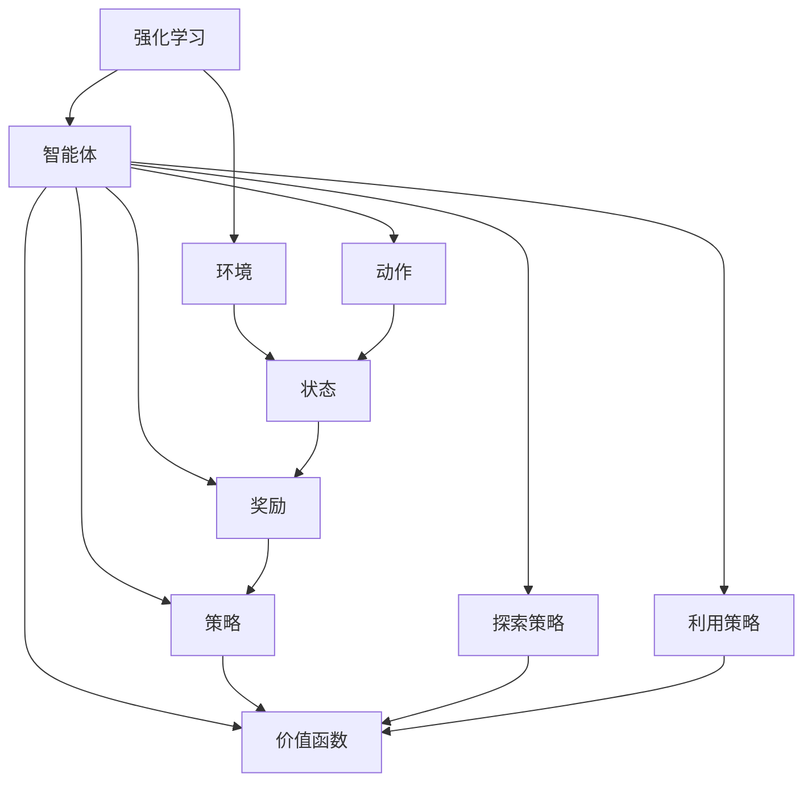
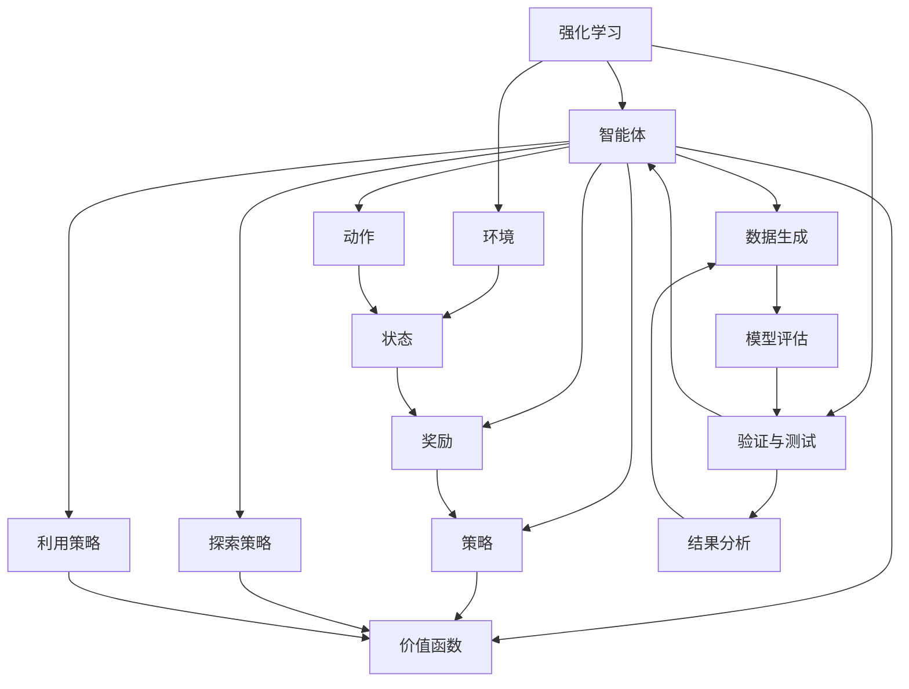

                 

# 强化学习Reinforcement Learning算法的验证与测试

## 1. 背景介绍

### 1.1 问题由来
在人工智能的演进过程中，强化学习(Reinforcement Learning, RL)逐渐成为解决复杂决策问题的重要技术之一。与传统的监督学习和无监督学习不同，强化学习通过智能体与环境互动，学习如何在特定环境中采取最优策略以最大化累积奖励。

### 1.2 问题核心关键点
强化学习的应用范围广泛，涵盖了机器人控制、游戏AI、自动驾驶、推荐系统等多个领域。其核心思想在于通过试错迭代，从环境中学习最优策略。但如何验证和测试这些策略的有效性，以确保其在真实场景中的性能和鲁棒性，成为强化学习研究的关键问题。

### 1.3 问题研究意义
在强化学习的验证与测试中，准确评估策略性能、提高模型泛化能力、确保模型鲁棒性，是推动强化学习技术在实际应用中落地见效的重要步骤。本文将重点讨论强化学习的验证与测试方法，介绍常见评估指标、测试场景和工具，为读者提供全面、系统的指导。

## 2. 核心概念与联系

### 2.1 核心概念概述

- 强化学习(Reinforcement Learning, RL)：通过智能体与环境的交互，学习如何在特定环境中采取最优策略以最大化累积奖励的学习方法。强化学习的核心在于策略学习，即学习在特定状态下采取何种行动以获得最大奖励。

- 策略优化(Solicy Optimization)：强化学习的核心任务之一，即优化策略以最大化长期累积奖励。常用的方法包括基于值函数的方法（如Q-learning）和基于策略梯度的方法（如Policy Gradient）。

- 动作空间(Action Space)：智能体可执行的所有可能动作的集合。动作空间可以是离散的、连续的或混合的，取决于具体任务。

- 状态空间(State Space)：智能体所处环境的完整描述，包括所有可能的状态。状态空间通常非常高维，需要考虑如何有效地表示和处理。

- 奖励函数(Reward Function)：评估智能体在每个状态下行为的好坏，通常用于指导智能体采取何种动作。奖励函数的设计对策略学习效果有重要影响。

- 探索与利用(Exploration vs Exploitation)：在智能体采取行动时，探索未知领域和利用已知策略之间的平衡问题。良好的探索与利用策略是提升学习效率的关键。

- 验证与测试(Verification & Validation)：评估强化学习策略的有效性，验证其在各种环境中的泛化能力，确保模型鲁棒性。验证与测试过程包括数据生成、模型评估、结果分析等环节。

这些核心概念通过强化学习的框架紧密联系在一起，形成一个完整的决策和反馈系统。以下是一个简化的Mermaid流程图，展示了强化学习的核心概念和交互关系：



### 2.2 概念间的关系

这些核心概念之间存在着紧密的联系，共同构成了强化学习的整体框架。具体如下：

- 智能体(智能体与环境的交互)依赖于动作空间、状态空间、奖励函数、策略和价值函数。
- 动作空间和状态空间共同决定了智能体的决策空间。
- 奖励函数和策略驱动智能体的决策过程。
- 策略优化是强化学习的核心任务。
- 价值函数提供了一种度量策略优劣的方法。
- 探索与利用是策略优化中的关键策略。
- 验证与测试是确保策略有效性和鲁棒性的重要手段。

### 2.3 核心概念的整体架构

以下是一个综合的Mermaid流程图，展示了强化学习的整体架构，包括核心概念、学习过程、验证与测试环节：



## 3. 核心算法原理 & 具体操作步骤

### 3.1 算法原理概述

强化学习的基本原理可以概括为智能体在环境中采取行动，根据环境反馈的奖励信号调整策略，以最大化长期累积奖励。强化学习的核心在于策略优化，即学习一个最优策略 $ \pi $ 以最大化累积奖励 $ \sum_{t=0}^{\infty} \gamma^t r_t $，其中 $ r_t $ 是时间步 $ t $ 的奖励，$ \gamma $ 是折扣因子。

强化学习算法分为基于值函数的方法和基于策略梯度的方法。基于值函数的方法如Q-learning，通过学习价值函数 $ Q(s,a) $ 来选择最优策略。基于策略梯度的方法如Policy Gradient，直接优化策略 $ \pi(a|s) $。

### 3.2 算法步骤详解

强化学习的验证与测试过程通常包括以下几个关键步骤：

**Step 1: 数据生成**
- 设计模拟环境或从真实环境中收集数据。
- 确定智能体动作空间和状态空间。
- 定义奖励函数和状态表示方法。

**Step 2: 模型训练**
- 选择强化学习算法（如Q-learning、SARSA、Policy Gradient等）。
- 训练模型，优化策略或价值函数。
- 记录训练过程中的各项指标（如累计奖励、训练时间、收敛速度等）。

**Step 3: 模型评估**
- 在验证集或测试集上评估模型性能。
- 计算各项评估指标（如累积奖励、执行效率、模型泛化能力等）。
- 分析模型输出和行为，发现潜在问题。

**Step 4: 结果分析**
- 对评估结果进行详细分析，识别模型强项和弱项。
- 根据评估结果，调整模型参数或优化策略。
- 总结模型性能和泛化能力，为实际应用提供依据。

### 3.3 算法优缺点

强化学习的验证与测试方法具有以下优点：
1. 适用于多环境、多目标任务。强化学习在处理多目标问题时具有天然优势，可以同时优化多个性能指标。
2. 动态适应环境变化。强化学习模型在实际应用中，可以不断从新数据中学习，保持模型的新鲜度。
3. 不需要大量标注数据。强化学习可以利用未标注的数据进行学习，减轻数据标注的成本压力。

但强化学习也存在以下局限：
1. 高维空间探索困难。强化学习在状态空间和动作空间高维的情况下，容易陷入局部最优，难以探索到全局最优解。
2. 学习速度慢。强化学习的学习速度相对较慢，尤其是在高维空间或复杂环境中。
3. 缺乏可解释性。强化学习的模型通常被视为"黑盒"系统，难以解释其内部工作机制和决策逻辑。

### 3.4 算法应用领域

强化学习在多个领域中得到了广泛应用，例如：

- 机器人控制：训练智能体在复杂环境中执行特定任务，如路径规划、物体抓取等。
- 游戏AI：训练游戏AI在特定游戏环境中最大化得分，如AlphaGo在围棋游戏中的胜利。
- 自动驾驶：训练智能体在复杂交通环境中做出安全、高效的驾驶决策。
- 推荐系统：训练推荐系统模型，最大化用户满意度和点击率。
- 金融交易：训练智能体在金融市场中执行投资决策，最大化收益。
- 智能制造：训练智能体在生产环境中进行质量控制、资源优化等任务。

## 4. 数学模型和公式 & 详细讲解 & 举例说明

### 4.1 数学模型构建

强化学习的数学模型可以表述为如下状态转移方程和奖励方程：

- 状态转移方程 $ s_{t+1} = f(s_t, a_t, \epsilon)$，表示智能体在当前状态 $ s_t $ 下执行动作 $ a_t $ 并产生噪声 $ \epsilon $ 后，转移到下一个状态 $ s_{t+1} $。
- 奖励方程 $ r_t = R(s_t, a_t)$，表示智能体在当前状态 $ s_t $ 下执行动作 $ a_t $ 后获得的即时奖励 $ r_t $。

强化学习的目标是最大化长期累积奖励 $ \sum_{t=0}^{\infty} \gamma^t r_t $，其中 $ \gamma $ 是折扣因子，用于折现未来奖励。

### 4.2 公式推导过程

以下是一个基于Q-learning的强化学习验证与测试的数学公式推导过程。

设智能体在状态 $ s $ 下执行动作 $ a $ 的Q值函数为 $ Q(s, a) $，则Q-learning算法更新规则如下：

$$
Q(s, a) \leftarrow Q(s, a) + \alpha \left( r + \gamma \max_{a'} Q(s', a') - Q(s, a) \right)
$$

其中 $ \alpha $ 为学习率。在每个时间步，智能体根据当前状态和动作的Q值，选择最优动作 $ a' $，更新Q值函数。

通过迭代更新Q值函数，Q-learning算法逐步优化策略，最大化长期累积奖励。

### 4.3 案例分析与讲解

假设我们有一个简单的游戏环境，智能体的目标是尽可能多地收集金币。环境的状态空间包括当前金币数量和玩家位置，动作空间包括向左、向右、向上、向下移动。奖励函数定义为每收集一个金币获得1个奖励，游戏结束时奖励为0。

在训练过程中，我们通过Q-learning算法学习最优策略。在验证与测试阶段，我们评估智能体在不同环境下的收集金币能力，分析策略泛化能力和鲁棒性。

## 5. 项目实践：代码实例和详细解释说明

### 5.1 开发环境搭建

在进行强化学习项目实践前，我们需要准备好开发环境。以下是使用Python进行Reinforcement Learning开发的典型环境配置流程：

1. 安装Python：从官网下载并安装Python，推荐使用3.8及以上版本。
2. 安装Pip：使用pip安装Python包管理工具。
3. 安装OpenAI Gym：使用pip安装OpenAI Gym，用于模拟环境。
4. 安装TensorFlow或PyTorch：根据需要选择安装TensorFlow或PyTorch，推荐使用TensorFlow 2.x版本。
5. 安装其他依赖包：如numpy、matplotlib、tqdm等。

完成上述步骤后，即可在Python环境中进行强化学习实践。

### 5.2 源代码详细实现

下面以基于Q-learning的强化学习实践为例，展示代码实现细节。

```python
import gym
import numpy as np
import tensorflow as tf

# 定义环境
env = gym.make('CartPole-v1')

# 定义模型结构
model = tf.keras.Sequential([
    tf.keras.layers.Dense(24, activation='relu', input_shape=(4,)),
    tf.keras.layers.Dense(2, activation='linear')
])

# 定义优化器
optimizer = tf.keras.optimizers.Adam(learning_rate=0.001)

# 定义Q值函数
def q_value(s, a):
    with tf.GradientTape() as tape:
        q_value = model(tf.constant(s, dtype=tf.float32))[0] + tf.constant(a, dtype=tf.float32)
    return q_value

# 定义训练函数
def train(env, model, optimizer, episodes=1000):
    for episode in range(episodes):
        state = env.reset()
        done = False
        total_reward = 0
        while not done:
            action = np.argmax(q_value(state, np.ones(2) - np.eye(2)))
            next_state, reward, done, _ = env.step(action)
            state = next_state
            total_reward += reward
        print('Episode {}: Total reward = {}'.format(episode+1, total_reward))

# 训练模型
train(env, model, optimizer)

# 评估模型
env = gym.make('CartPole-v1')
model.load_weights('cartpole_weights.h5')
for episode in range(5):
    state = env.reset()
    done = False
    total_reward = 0
    while not done:
        action = np.argmax(model.predict(state.reshape(1, -1)))
        state, reward, done, _ = env.step(action)
        total_reward += reward
    print('Episode {}: Total reward = {}'.format(episode+1, total_reward))
```

### 5.3 代码解读与分析

让我们详细解读代码实现中的关键步骤：

- 使用OpenAI Gym创建了一个简单的环境CartPole-v1，用于训练智能体。
- 定义了一个简单的神经网络模型，用于估计Q值函数。
- 定义了Adam优化器，用于更新模型参数。
- 定义了一个Q值函数，用于评估智能体在给定状态和动作下的Q值。
- 定义了一个训练函数，用于在CartPole-v1环境中训练智能体，记录每轮训练的累计奖励。
- 使用训练后的模型在CartPole-v1环境中进行评估，输出每轮评估的累计奖励。

## 6. 实际应用场景

### 6.1 智能交通管理

强化学习在智能交通管理中的应用，可以显著提高交通流量控制效率，减少交通拥堵。通过构建交通模拟环境，智能体可以在不同路况下学习最优交通信号控制策略，从而实时调整信号灯的配时，优化交通流量。

在实际应用中，可以收集交通流量数据，构建基于强化学习的交通信号控制系统。智能体根据当前交通状况和历史数据，学习最优的信号配时方案，确保交通流的平稳顺畅。

### 6.2 机器人路径规划

在机器人路径规划问题中，强化学习可以训练机器人学习最优的路径规划策略，以避开障碍物、高效完成任务。通过构建模拟环境，智能体可以在各种复杂场景下学习路径规划策略，提高机器人执行任务的效率和安全性。

在实际应用中，可以使用模拟仿真环境，如Gym，训练机器人路径规划策略。智能体通过不断的试错迭代，学习最优的路径规划方案，从而在实际环境中高效完成任务。

### 6.3 自动化交易系统

在自动化交易系统中，强化学习可以训练交易系统学习最优的交易策略，以最大化收益。通过构建交易模拟环境，智能体可以在历史数据上学习最优的交易策略，从而在实时交易中做出更明智的投资决策。

在实际应用中，可以收集历史交易数据，构建基于强化学习的自动化交易系统。智能体通过学习最优的交易策略，优化交易决策，提高投资收益。

### 6.4 未来应用展望

未来，随着强化学习技术的发展，其在更多领域的应用前景将更加广阔。以下是几个具有潜力的应用方向：

- 医疗诊断：训练强化学习模型，优化医疗影像诊断和病患治疗方案。通过医疗模拟环境，智能体可以学习最优的医疗诊断策略，提高诊断的准确性和效率。
- 自动驾驶：训练智能体在复杂交通环境中学习最优的驾驶策略，提高自动驾驶系统的安全性和可靠性。
- 社交媒体推荐：训练智能体在社交媒体环境中学习最优的内容推荐策略，提高用户的满意度。
- 智能制造：训练智能体在智能制造环境中学习最优的生产计划和资源优化策略，提高生产效率和质量。

## 7. 工具和资源推荐

### 7.1 学习资源推荐

为了帮助开发者系统掌握强化学习的验证与测试理论基础和实践技巧，以下是一些优质的学习资源：

1. 《强化学习》系列书籍：包括《Reinforcement Learning: An Introduction》、《Deep Reinforcement Learning with TensorFlow 2.0》等，系统介绍了强化学习的基本概念和实践技巧。

2. 《Deep Learning Specialization》课程：由深度学习专家Andrew Ng开设的强化学习专项课程，深入浅出地讲解了强化学习的基础知识和前沿技术。

3. 《Reinforcement Learning: Foundations》在线课程：由斯坦福大学教授David Silver讲授的强化学习在线课程，涵盖了强化学习的基本理论和方法。

4. 《Programming Reinforcement Learning with Python》书籍：通过Python实现强化学习的经典案例，适合动手实践和项目开发。

5. OpenAI Gym：一个开源的模拟环境库，提供了丰富的环境供开发者训练强化学习模型。

6. TensorFlow和PyTorch：两大深度学习框架，都提供了丰富的强化学习库和工具，支持快速的模型训练和验证。

### 7.2 开发工具推荐

1. TensorFlow和PyTorch：两大深度学习框架，都提供了丰富的强化学习库和工具，支持快速的模型训练和验证。

2. OpenAI Gym：一个开源的模拟环境库，提供了丰富的环境供开发者训练强化学习模型。

3. Jupyter Notebook：一个交互式的Python代码编辑器，方便开发者进行实验和分享。

4. TensorBoard：一个可视化工具，用于记录和展示强化学习模型的训练过程和评估结果。

5. Weights & Biases：一个实验跟踪工具，用于记录和分析强化学习模型的训练过程和性能指标。

### 7.3 相关论文推荐

1. Deep Q-Network（DQN）论文：提出了基于Q-learning的强化学习算法，通过深度神经网络优化Q值函数。

2. Actor-Critic算法论文：提出了基于策略梯度的强化学习算法，通过Actor和Critic两个网络共同优化策略。

3. Trust Region Policy Optimization（TRPO）论文：提出了基于策略梯度的TRPO算法，通过信托区域优化策略。

4. Proximal Policy Optimization（PPO）论文：提出了基于策略梯度的PPO算法，通过增强稳定性优化策略。

5. REINFORCE论文：提出了基于策略梯度的REINFORCE算法，是强化学习领域的经典算法之一。

6. AlphaGo论文：提出了基于强化学习的AlphaGo算法，通过神经网络和蒙特卡洛树搜索，在围棋游戏中取得了巨大成功。

## 8. 总结：未来发展趋势与挑战

### 8.1 研究成果总结

本文详细介绍了强化学习的验证与测试方法，涵盖理论基础、实践技巧和应用场景。通过系统梳理，帮助读者全面掌握强化学习的验证与测试过程，为实际应用提供可靠指导。

### 8.2 未来发展趋势

未来，强化学习的验证与测试将呈现以下几个发展趋势：

1. 多目标优化：强化学习将更好地支持多目标优化，优化多个性能指标，提高系统综合表现。
2. 迁移学习：强化学习将更好地支持迁移学习，通过预训练模型加速学习过程。
3. 自适应学习：强化学习将更好地支持自适应学习，在不断变化的环境下持续优化策略。
4. 元学习：强化学习将更好地支持元学习，通过学习如何学习，提高模型的泛化能力和适应性。
5. 混合学习：强化学习将更好地支持混合学习，结合强化学习和传统机器学习，优化模型性能。
6. 实时学习：强化学习将更好地支持实时学习，通过在线学习保持模型新鲜度，提高系统适应性。

### 8.3 面临的挑战

尽管强化学习取得了显著进展，但仍面临诸多挑战：

1. 高维空间探索：在状态空间和动作空间高维的情况下，强化学习容易陷入局部最优，难以探索到全局最优解。
2. 学习速度慢：强化学习在复杂环境中学习速度较慢，难以在短时间内获得理想结果。
3. 模型泛化能力：强化学习模型在泛化能力上仍有提升空间，难以应对复杂多变的环境。
4. 可解释性不足：强化学习模型通常被视为"黑盒"系统，难以解释其内部工作机制和决策逻辑。
5. 资源消耗大：强化学习模型在训练和推理过程中，资源消耗较大，需要高效的算法和硬件支持。

### 8.4 研究展望

未来的研究需要在以下几个方向上寻求新的突破：

1. 探索更加高效的强化学习算法：通过优化算法设计，提高模型的学习效率和性能。
2. 改进强化学习的验证与测试方法：通过引入更多评估指标和测试场景，提高模型验证与测试的可靠性。
3. 融合多模态数据：将强化学习与其他模态数据（如图像、文本、语音等）结合，拓展强化学习的应用范围。
4. 提高模型的可解释性：通过引入符号化的先验知识，增强模型的可解释性和可理解性。
5. 优化资源消耗：通过模型压缩和优化，减少训练和推理过程中的资源消耗，提高模型效率。

通过上述方向的探索和突破，相信强化学习将能够更好地应用于实际问题，推动人工智能技术的进一步发展。

## 9. 附录：常见问题与解答

**Q1：强化学习是否适用于所有决策问题？**

A: 强化学习适用于动态环境中的决策问题，通过智能体与环境互动，学习最优策略。但对于静态环境或结构化数据决策问题，传统机器学习或规则系统可能更为适用。

**Q2：如何选择合适的强化学习算法？**

A: 选择合适的强化学习算法取决于任务特点和环境复杂度。通常，基于值函数的算法（如Q-learning、SARSA）适用于状态空间较小时，而基于策略梯度的算法（如Policy Gradient、TRPO、PPO等）适用于状态空间较大或连续动作空间时。

**Q3：强化学习训练过程中的超参数有哪些？**

A: 强化学习的超参数包括学习率、折扣因子、探索策略等。选择合适的超参数对模型性能有重要影响。

**Q4：强化学习的验证与测试方法有哪些？**

A: 强化学习的验证与测试方法包括模拟环境测试、实际环境测试、A/B测试等。验证与测试方法应根据具体任务和环境特点进行选择。

**Q5：如何提高强化学习模型的泛化能力？**

A: 提高强化学习模型的泛化能力，可以采取数据增强、迁移学习、元学习等方法，增强模型对新环境和数据的适应能力。

**Q6：如何评估强化学习模型的性能？**

A: 评估强化学习模型的性能通常使用累积奖励、执行效率、稳定性等指标。应根据具体任务和环境特点选择合适的评估指标。

通过以上问题的解答，相信读者对强化学习的验证与测试有了更全面的认识。掌握这些关键知识，将有助于开发者更高效地进行强化学习实践，推动人工智能技术在更多领域的应用落地。

---

作者：禅与计算机程序设计艺术 / Zen and the Art of Computer Programming

