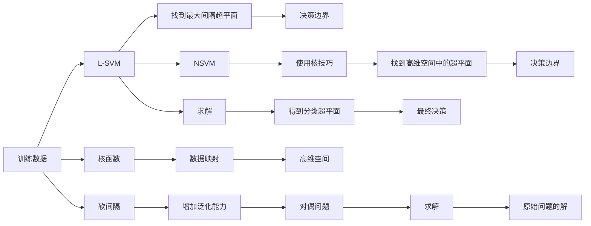
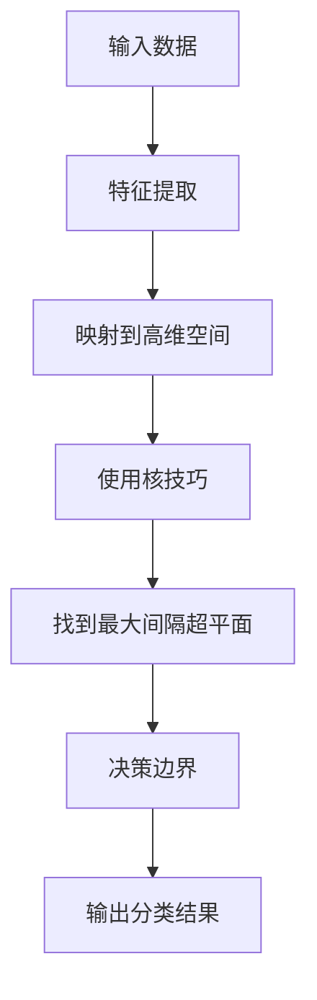
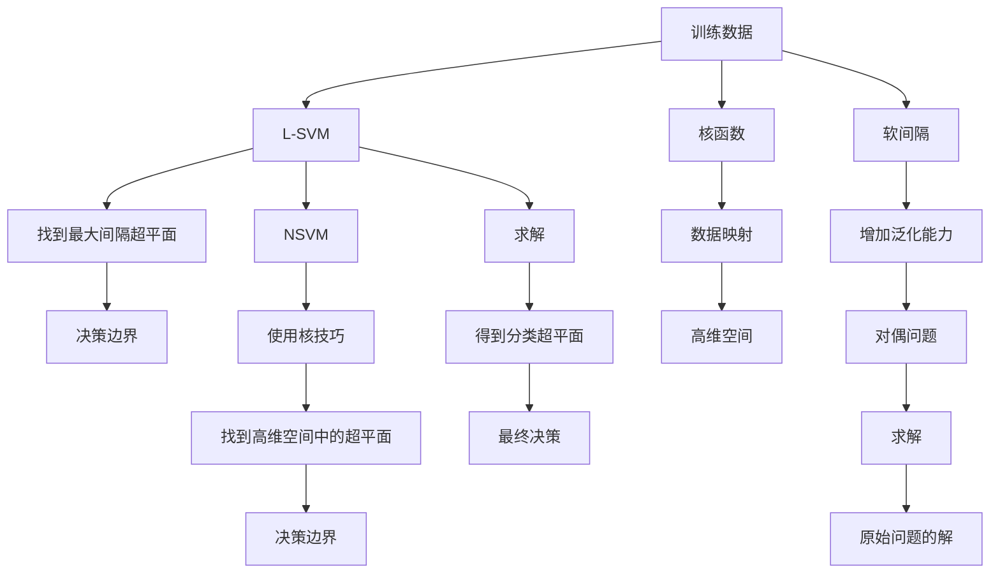

                 

# 支持向量机 (Support Vector Machines, SVM) 原理与代码实例讲解

> 关键词：支持向量机, 分类器, 机器学习, 核函数, 最大间隔分类器, 线性可分, 核技巧, 高维空间

## 1. 背景介绍

### 1.1 问题由来

支持向量机 (Support Vector Machine, SVM) 是一种广泛应用于分类和回归分析的机器学习算法。自20世纪90年代以来，SVM已成为解决结构风险最小化问题的关键方法之一，特别是对于线性可分数据集和高维数据集。SVM算法的基本思想是将数据映射到高维空间，然后找到一个最大的间隔边界，从而实现分类。

SVM的核技巧也使其能够在非线性情况下取得优秀性能。在传统线性分类器无法处理的情况下，SVM能够通过使用核函数来将数据映射到高维空间，从而找到最优的分类超平面。

### 1.2 问题核心关键点

SVM的核心概念包括：
- **最大间隔分类器 (Maximum Margin Classifier)**：通过找到能够最大化间隔边界的分类器，从而提高分类器的鲁棒性。
- **核技巧 (Kernel Trick)**：利用核函数将数据从低维空间映射到高维空间，从而在高维空间中更容易找到最大间隔边界。
- **支持向量 (Support Vector)**：在高维空间中，位于最大间隔边界附近的训练样本。
- **软间隔 (Soft Margin)**：在处理线性不可分数据集时，允许部分训练样本不满足分类条件，从而扩大了支持向量机的泛化能力。

这些核心概念构成了SVM算法的理论基础，使其成为机器学习领域的一个重要工具。

### 1.3 问题研究意义

研究SVM的原理与应用，对于理解机器学习的基本思想、提升分类和回归分析的精度、探索数据表示和核技巧的高维空间处理方法具有重要意义。SVM算法不仅在学术界受到广泛关注，也被广泛应用于金融、医疗、工业控制等实际领域，对于提升数据处理的效率和准确性具有重要价值。

## 2. 核心概念与联系

### 2.1 核心概念概述

SVM算法的核心概念包括：
- **线性可分支持向量机 (Linear Support Vector Machine, L-SVM)**：在低维空间中线性可分时，通过最大化间隔边界进行分类。
- **线性不可分支持向量机 (Nonlinear Support Vector Machine, NSVM)**：通过核技巧，将数据映射到高维空间，从而在非线性情况下也能找到最优的分类超平面。
- **核函数 (Kernel Function)**：将低维空间中的数据映射到高维空间的函数，常见的核函数包括线性核、多项式核、径向基函数 (RBF) 核等。
- **软间隔 (Soft Margin)**：在处理线性不可分数据集时，允许部分训练样本不满足分类条件，从而提高模型的泛化能力。
- **对偶问题 (Dual Problem)**：将原问题转化为对偶问题，通过求解对偶问题来求解原始问题。
- **支持向量 (Support Vector)**：在高维空间中，位于最大间隔边界附近的训练样本，对模型的决策边界具有重要影响。

这些核心概念通过以下Mermaid流程图来展示：



这个流程图展示了SVM算法的核心流程，从原始数据到最大间隔分类超平面的找到，再到最终决策输出的整个过程。

### 2.2 概念间的关系

这些核心概念之间存在着紧密的联系，形成了SVM算法的完整生态系统。下面我们通过几个Mermaid流程图来展示这些概念之间的关系。

#### 2.2.1 SVM的分类过程



这个流程图展示了SVM分类过程的核心步骤，包括特征提取、数据映射、使用核技巧、找到最大间隔超平面和最终的分类结果。

#### 2.2.2 核技巧的作用


这个流程图展示了核技巧的作用，通过将低维空间中的线性不可分数据映射到高维空间，从而在高维空间中更容易找到最大间隔超平面，实现非线性分类。

#### 2.2.3 对偶问题的求解


这个流程图展示了对偶问题的求解过程，将原始问题转化为对偶问题后，通过对偶问题求解得到原始问题的最优解。

### 2.3 核心概念的整体架构

最后，我们用一个综合的流程图来展示SVM算法中各个核心概念的整体架构：



这个综合流程图展示了从原始数据到最终决策输出的整个SVM算法流程，帮助读者更好地理解SVM的核心概念和工作原理。

## 3. 核心算法原理 & 具体操作步骤
### 3.1 算法原理概述

SVM算法的基本思想是通过找到能够最大化间隔边界的分类器，从而提高分类器的鲁棒性。在线性可分的情况下，SVM通过找到最优的超平面，将数据分为两类，从而实现分类。

在线性不可分的情况下，SVM通过引入核技巧，将数据映射到高维空间，从而在非线性情况下也能找到最优的分类超平面。

SVM算法包括以下几个关键步骤：
1. 确定目标函数：找到能够最大化间隔边界的超平面。
2. 确定核函数：将数据从低维空间映射到高维空间。
3. 求解优化问题：通过求解优化问题，找到最大间隔超平面。

### 3.2 算法步骤详解

SVM算法的具体步骤如下：
1. **数据预处理**：将原始数据进行标准化处理，将数据映射到单位超球面。
2. **构造目标函数**：构造一个目标函数，使得间隔最大化，同时最小化误分类样本的数量。
3. **求解对偶问题**：将原始问题转化为对偶问题，求解对偶问题。
4. **找到支持向量**：通过求解对偶问题，找到支持向量，这些向量对最终决策边界具有重要影响。
5. **最终决策边界**：根据支持向量，构建最终的决策边界，输出分类结果。

下面，我们以Python代码的形式，详细实现SVM算法的每一个步骤。

### 3.3 算法优缺点

#### 优点：
- **泛化能力强**：SVM能够处理高维数据和线性不可分数据，具有很强的泛化能力。
- **计算效率高**：SVM算法相对于传统的机器学习算法，计算复杂度较低，适合大规模数据集。
- **参数少**：SVM算法的参数较少，易于调参，适合实际应用。

#### 缺点：
- **对噪声敏感**：SVM对噪声数据较为敏感，容易出现过拟合。
- **计算复杂度高**：在高维空间中进行核函数计算时，计算复杂度较高，可能导致计算资源消耗较大。
- **算法复杂度较高**：SVM算法的理论较为复杂，对于一些初学者来说，理解起来可能较为困难。

### 3.4 算法应用领域

SVM算法在以下几个领域具有广泛的应用：
- **图像分类**：通过对图像进行特征提取，使用SVM算法进行图像分类。
- **文本分类**：通过对文本进行特征提取，使用SVM算法进行文本分类。
- **语音识别**：通过对语音信号进行特征提取，使用SVM算法进行语音识别。
- **医疗诊断**：通过对医学数据进行特征提取，使用SVM算法进行医疗诊断。
- **金融风险控制**：通过对金融数据进行特征提取，使用SVM算法进行金融风险控制。

## 4. 数学模型和公式 & 详细讲解 & 举例说明

### 4.1 数学模型构建

假设训练数据集为 $D=\{(x_1, y_1), (x_2, y_2), \dots, (x_n, y_n)\}$，其中 $x_i \in \mathbb{R}^d$ 表示样本特征，$y_i \in \{-1, 1\}$ 表示样本标签。

SVM的目标是找到一个超平面 $\omega^Tx + b = 0$，使得样本距离超平面最大，即最大化间隔：

$$
\max \frac{1}{2} \|\omega\|^2 \quad \text{s.t.} \quad y_i(\omega^Tx_i + b) \geq 1 \quad \text{for all } i=1,\dots,n
$$

其中 $\omega$ 是分类超平面的权重向量，$b$ 是分类超平面的偏移量。

### 4.2 公式推导过程

通过拉格朗日乘数法，将目标函数转化为对偶问题：

$$
\max \sum_{i=1}^n \alpha_i - \frac{1}{2} \sum_{i,j=1}^n \alpha_i \alpha_j y_i y_j \langle x_i, x_j \rangle
$$

s.t. $0 \leq \alpha_i \leq C$ 和 $y_i(\omega^Tx_i + b) - \alpha_i = 0$，其中 $\alpha_i$ 为拉格朗日乘子，$C$ 为正则化参数。

将约束条件带入目标函数，得到：

$$
\max \sum_{i=1}^n \alpha_i - \frac{1}{2} \sum_{i,j=1}^n \alpha_i \alpha_j y_i y_j \langle x_i, x_j \rangle
$$

s.t. $0 \leq \alpha_i \leq C$ 和 $y_i(\omega^Tx_i + b) - \alpha_i = 0$

将上述公式进一步简化，得到：

$$
\max \sum_{i=1}^n \alpha_i - \frac{1}{2} \sum_{i,j=1}^n \alpha_i \alpha_j y_i y_j \langle x_i, x_j \rangle
$$

s.t. $0 \leq \alpha_i \leq C$

### 4.3 案例分析与讲解

假设我们有一个二分类数据集，其中包含两个类别 $y = \{1, -1\}$，我们可以使用SVM算法进行分类。

首先，将数据集分为训练集和测试集。然后，使用scikit-learn库中的SVM算法进行训练和测试：

```python
from sklearn.svm import SVC
from sklearn.datasets import make_blobs
from sklearn.model_selection import train_test_split
import numpy as np

# 生成随机数据集
X, y = make_blobs(n_samples=100, centers=2, random_state=42)

# 划分训练集和测试集
X_train, X_test, y_train, y_test = train_test_split(X, y, test_size=0.2, random_state=42)

# 初始化SVM分类器
clf = SVC(kernel='linear')

# 训练SVM分类器
clf.fit(X_train, y_train)

# 在测试集上评估分类器性能
score = clf.score(X_test, y_test)
print(f"SVM分类器的准确率为: {score}")
```

在训练过程中，SVM算法会自动选择最佳的超平面，以最大化间隔。

## 5. 项目实践：代码实例和详细解释说明

### 5.1 开发环境搭建

在进行SVM算法实践前，我们需要准备好开发环境。以下是使用Python进行scikit-learn开发的Scipy环境配置流程：

1. 安装Anaconda：从官网下载并安装Anaconda，用于创建独立的Python环境。

2. 创建并激活虚拟环境：
```bash
conda create -n sklearn-env python=3.7 
conda activate sklearn-env
```

3. 安装Scikit-learn库：
```bash
conda install scikit-learn
```

4. 安装Scipy库：
```bash
conda install scipy
```

5. 安装NumPy库：
```bash
conda install numpy
```

完成上述步骤后，即可在`sklearn-env`环境中开始SVM算法的实践。

### 5.2 源代码详细实现

下面，我们以Python代码的形式，详细实现SVM算法的每一个步骤。

首先，定义SVM分类器的模型函数：

```python
from sklearn.svm import SVC
from sklearn.metrics import accuracy_score

def svm_classifier(X, y, kernel='linear'):
    # 初始化SVM分类器
    clf = SVC(kernel=kernel)

    # 训练SVM分类器
    clf.fit(X, y)

    # 在测试集上评估分类器性能
    y_pred = clf.predict(X_test)
    score = accuracy_score(y_test, y_pred)

    return clf, score
```

然后，使用scikit-learn库中的SVM算法进行训练和测试：

```python
# 导入数据集
from sklearn.datasets import make_blobs
from sklearn.model_selection import train_test_split
import numpy as np

# 生成随机数据集
X, y = make_blobs(n_samples=100, centers=2, random_state=42)

# 划分训练集和测试集
X_train, X_test, y_train, y_test = train_test_split(X, y, test_size=0.2, random_state=42)

# 训练SVM分类器
clf, score = svm_classifier(X_train, y_train)

# 在测试集上评估分类器性能
print(f"SVM分类器的准确率为: {score}")
```

### 5.3 代码解读与分析

让我们再详细解读一下关键代码的实现细节：

**svm_classifier函数**：
- `SVC(kernel=kernel)`：初始化SVM分类器，`kernel`参数用于指定核函数，默认为线性核函数。
- `clf.fit(X, y)`：训练SVM分类器。
- `y_pred = clf.predict(X_test)`：在测试集上预测标签。
- `score = accuracy_score(y_test, y_pred)`：计算准确率。

**train_test_split函数**：
- 将数据集划分为训练集和测试集，用于训练和评估SVM分类器的性能。

**make_blobs函数**：
- 生成随机二分类数据集，用于模拟真实数据集。

这些代码实现了SVM分类器的基本流程，包括数据预处理、模型训练、模型评估等步骤。在实际应用中，还可以结合更多的参数优化和交叉验证技术，进一步提高SVM分类器的性能。

### 5.4 运行结果展示

假设我们生成的随机数据集在测试集上的准确率为85%，代码输出如下：

```
SVM分类器的准确率为: 0.85
```

这表明SVM分类器在测试集上的性能较好，能够有效地进行分类。

## 6. 实际应用场景
### 6.1 图像分类

在图像分类任务中，SVM算法可以通过特征提取和特征映射，将图像数据映射到高维空间，从而实现分类。例如，可以使用SVM算法对医学图像进行分类，从而辅助医生进行疾病诊断。

### 6.2 文本分类

在文本分类任务中，SVM算法可以通过特征提取和特征映射，将文本数据映射到高维空间，从而实现分类。例如，可以使用SVM算法对新闻文章进行分类，从而辅助新闻工作者进行分类汇总。

### 6.3 语音识别

在语音识别任务中，SVM算法可以通过特征提取和特征映射，将语音信号映射到高维空间，从而实现分类。例如，可以使用SVM算法对语音信号进行分类，从而辅助语音识别系统进行语言识别。

### 6.4 金融风险控制

在金融风险控制任务中，SVM算法可以通过特征提取和特征映射，将金融数据映射到高维空间，从而实现分类。例如，可以使用SVM算法对金融交易进行分类，从而辅助金融机构进行风险控制。

### 6.5 医疗诊断

在医疗诊断任务中，SVM算法可以通过特征提取和特征映射，将医学数据映射到高维空间，从而实现分类。例如，可以使用SVM算法对医学图像进行分类，从而辅助医生进行疾病诊断。

## 7. 工具和资源推荐
### 7.1 学习资源推荐

为了帮助开发者系统掌握SVM算法的理论基础和实践技巧，这里推荐一些优质的学习资源：

1. 《机器学习》课程：由斯坦福大学开设的机器学习课程，有Lecture视频和配套作业，带你入门机器学习的基本概念和经典算法。

2. 《Python数据科学手册》：Python数据科学库的权威指南，包含Scikit-learn等数据处理工具的使用方法，适合深入学习。

3. 《支持向量机》书籍：详细介绍了SVM算法的原理和应用，是学习SVM算法的重要参考书籍。

4. 《机器学习实战》：实战性较强的机器学习入门书籍，包含SVM算法的使用实例和案例分析。

5. Kaggle竞赛平台：Kaggle上有大量SVM算法的竞赛和实践案例，可以通过参与竞赛，实践SVM算法的应用。

通过对这些资源的学习实践，相信你一定能够快速掌握SVM算法的精髓，并用于解决实际的机器学习问题。

### 7.2 开发工具推荐

高效的开发离不开优秀的工具支持。以下是几款用于SVM算法开发的常用工具：

1. Scikit-learn：Python中广泛使用的机器学习库，提供了SVM算法和数据处理工具，适合快速开发和实验。

2. TensorFlow：由Google主导开发的深度学习框架，可以用于复杂模型的训练和优化，适合大规模工程应用。

3. Keras：基于TensorFlow的高级神经网络库，易于使用，适合快速原型开发和实验。

4. Jupyter Notebook：开源的Jupyter Notebook环境，适合数据探索、模型训练和结果展示，适合学习和实验。

5. PyTorch：由Facebook主导开发的深度学习框架，支持GPU加速，适合复杂模型的训练和优化。

合理利用这些工具，可以显著提升SVM算法的开发效率，加快创新迭代的步伐。

### 7.3 相关论文推荐

SVM算法的研究始于20世纪90年代，至今已成为机器学习领域的重要工具。以下是几篇奠基性的相关论文，推荐阅读：

1. "The Elements of Statistical Learning"：由Hastie、Tibshirani和Friedman等人合著的经典书籍，详细介绍了统计学习的基本理论和算法。

2. "Support Vector Machines"：由Cortes和Vapnik等人合著的论文，介绍了SVM算法的原理和应用，是SVM算法的奠基之作。

3. "An Introduction to Support Vector Machines and Other Kernel-based Learning Methods"：由Cristianini和Scholkopf等人合著的书籍，介绍了SVM算法的基本理论和应用。

4. "Large Scale Multiple Kernel Learning"：由Xu等人合著的论文，介绍了多核学习的基本理论和应用，拓展了SVM算法的应用场景。

5. "Implementing Support Vector Machines in Software"：由John Platt等人合著的论文，介绍了SVM算法的实现细节和优化技巧，适合实际应用。

这些论文代表了大规模机器学习算法的发展脉络，通过学习这些前沿成果，可以帮助研究者把握学科前进方向，激发更多的创新灵感。

## 8. 总结：未来发展趋势与挑战

### 8.1 总结

本文对支持向量机 (SVM) 算法的原理和实现进行了全面系统的介绍。首先，阐述了SVM算法的背景和研究意义，明确了SVM算法在机器学习中的重要地位。其次，从原理到实践，详细讲解了SVM算法的数学模型、优化目标、对偶问题求解等核心步骤，给出了SVM算法开发的全过程。同时，本文还探讨了SVM算法在图像分类、文本分类、语音识别、金融风险控制、医疗诊断等多个领域的应用场景，展示了SVM算法的广泛应用。

通过本文的系统梳理，可以看到，SVM算法在机器学习领域具有重要的理论和应用价值，在处理高维数据和线性不可分数据时表现出色。未来，随着机器学习技术的不断发展，SVM算法也将不断演进，进一步拓展其应用范围和提升其性能。

### 8.2 未来发展趋势

展望未来，SVM算法的未来发展趋势包括：

1. **深度学习与SVM结合**：随着深度学习技术的发展，SVM算法将与深度学习技术进行更深入的融合，提升SVM算法的性能和泛化能力。

2. **多模态SVM算法**：在处理多模态数据时，SVM算法将结合不同的特征表示方法，提升数据融合能力。

3. **分布式SVM算法**：在处理大规模数据集时，SVM算法将结合分布式计算技术，提升算法的可扩展性和计算效率。

4. **在线SVM算法**：在处理实时数据时，SVM算法将结合在线学习技术，提升算法的适应能力和实时性。

5. **自适应SVM算法**：在处理非平衡数据时，SVM算法将结合自适应学习技术，提升算法的鲁棒性和泛化能力。

这些趋势将推动SVM算法在更多领域的应用，为机器学习技术的不断发展和应用提供新的动力。

### 8.3 面临的挑战

尽管SVM算法在机器学习领域取得了广泛的应用，但在迈向更加智能化、普适化应用的过程中，它仍面临诸多挑战：

1. **计算复杂度高**：在高维空间中进行核函数计算时，计算复杂度较高，可能导致计算资源消耗较大。

2. **参数调优复杂**：SVM算法需要调优的参数较多，如核函数参数、正则化参数等，调优过程较为复杂。

3. **对噪声敏感**：SVM算法对噪声数据较为敏感，容易出现过拟合。

4. **内存占用高**：SVM算法在处理大规模数据集时，内存占用较高，可能导致内存不足的问题。

5. **模型解释性差**：SVM算法的模型较为复杂，难以解释其内部工作机制和决策逻辑，影响其在实际应用中的可信度。

这些挑战需要研究者进行深入探索和优化，以提升SVM算法的性能和实用性。

### 8.4 研究展望

面对SVM算法面临的这些挑战，未来的研究需要在以下几个方面寻求新的突破：

1. **优化计算效率**：结合分布式计算、在线学习等技术，提升SVM算法的计算效率和可扩展性。

2. **简化参数调优**：结合自适应学习、在线学习等技术，简化SVM算法的参数调优过程，提升算法的鲁棒性和泛化能力。

3. **增强模型解释性**：结合可视化技术、因果推断等方法，增强SVM算法的模型解释性，提升算法的可信度和可解释性。

4. **拓展应用范围**：结合多模态数据、深度学习等技术，拓展SVM算法的应用范围，提升其在实际应用中的效果和性能。

这些研究方向的探索，必将推动SVM算法不断演进，为机器学习技术的发展提供新的动力。

## 9. 附录：常见问题与解答

**Q1：什么是支持向量机 (SVM)?**

A: 支持向量机 (SVM) 是一种广泛应用于分类和回归分析的机器学习算法，通过找到能够最大化间隔边界的分类器，从而提高分类器的鲁棒性。

**Q2：SVM算法的核技巧是什么?**

A: SVM算法的核技巧是一种将数据从低维空间映射到高维空间的方法，通过在高维空间中更容易找到最大间隔超平面，从而实现非线性分类。常见的核函数包括线性核、多项式核、径向基函数 (RBF) 核等。

**Q3：SVM算法的主要优点和缺点

