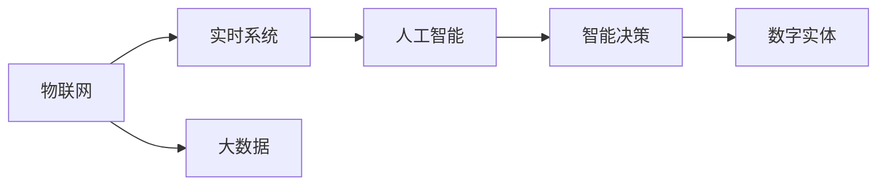
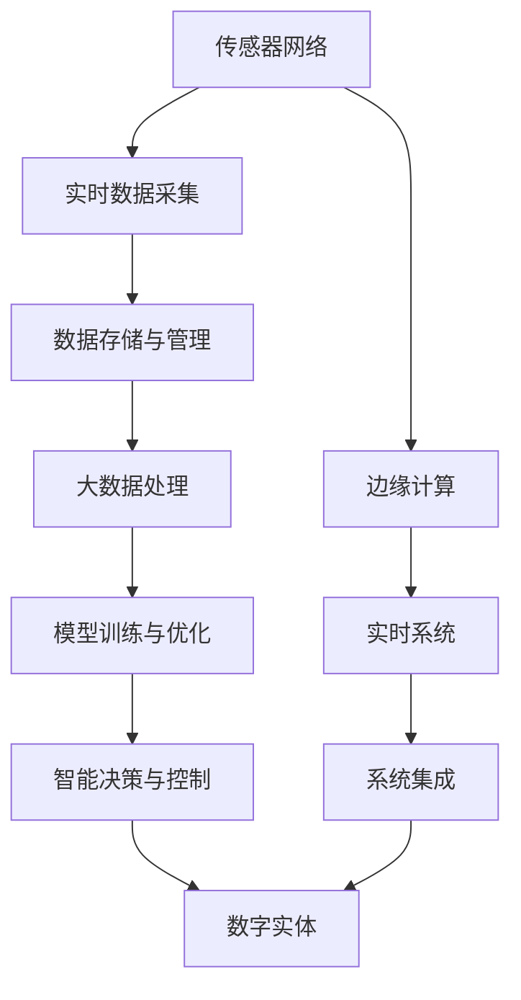

                 

## 1. 背景介绍

### 1.1 问题由来

数字实体自动化的概念始于自动化技术的发展。早期，自动化的主要目标是提高生产效率，通过减少人力介入，降低生产成本。然而，随着技术的进步和应用场景的扩展，数字实体自动化（Digital Entity Automation, DEA）逐渐成为一种新型技术趋势，应用范围不仅限于生产制造领域，还包括金融、医疗、教育、娱乐等多个领域。

数字实体自动化的核心思想是，利用数字化技术，对物理或数字实体进行智能化、自动化的管理与控制。其核心技术包括传感器网络、物联网（IoT）、人工智能、大数据等，通过实时数据收集、处理和分析，实现对实体的精准感知和高效管理。

近年来，随着人工智能和大数据技术的飞速发展，数字实体自动化技术也取得了长足进步。智能制造、智能物流、智能医疗等诸多行业已经将数字实体自动化作为核心竞争力，推动了整个行业的数字化转型。

### 1.2 问题核心关键点

数字实体自动化的关键点在于：

1. **数据采集与处理**：实现对物理或数字实体的实时监测与数据采集，是数字实体自动化的基础。
2. **模型训练与优化**：利用人工智能技术对采集到的数据进行建模，并通过机器学习算法不断优化模型，是数字实体自动化的核心。
3. **决策与控制**：基于训练好的模型，实现对实体的智能化决策与控制，是数字实体自动化的目标。
4. **系统集成与部署**：将数字实体自动化技术集成到实际业务流程中，实现系统化部署与运营，是数字实体自动化的应用保障。

通过这几个关键点，数字实体自动化技术可以广泛应用于生产制造、智能物流、智能医疗等多个领域，推动各行各业的数字化转型。

### 1.3 问题研究意义

研究数字实体自动化的技术，对于推动产业数字化转型，提升实体管理效率，降低运营成本，具有重要意义：

1. **提高生产效率**：通过智能制造技术，实现生产过程的自动化、智能化管理，提高生产效率和产品质量。
2. **降低运营成本**：利用数字实体自动化技术，优化库存管理、物流配送等流程，降低运营成本，提高企业竞争力。
3. **提升服务质量**：在医疗、教育等服务业中，数字实体自动化技术可以帮助提供更加精准、高效的服务，改善用户体验。
4. **促进技术创新**：数字实体自动化技术的深入研究与应用，推动了物联网、人工智能、大数据等领域的科技进步。
5. **赋能产业升级**：数字实体自动化技术的应用，推动了传统行业的数字化转型，带来了新的商业机会和经济增长点。

总之，数字实体自动化技术不仅提高了实体管理的效率和质量，还促进了各行各业的数字化升级，具有广阔的应用前景。

## 2. 核心概念与联系

### 2.1 核心概念概述

为了更好地理解数字实体自动化的原理与技术，本节将介绍几个关键概念：

1. **数字实体（Digital Entity）**：任何可以被数字化表示、监测和控制的实体，包括物理对象、设备、系统等。
2. **物联网（IoT）**：通过传感器、标签等技术，实现对数字实体的实时监测与数据采集。
3. **人工智能（AI）**：利用机器学习、深度学习等技术，对采集到的数据进行建模和分析，实现对实体的智能化决策与控制。
4. **大数据（Big Data）**：处理和分析海量数据，挖掘数据中的潜在价值，提供决策依据。
5. **实时系统（Real-time System）**：能够在实时环境下处理任务的系统，确保数据处理的及时性。
6. **智能决策（Intelligent Decision）**：基于数据和模型，实现对实体的智能决策，提升实体管理效率。

这些核心概念之间存在紧密的联系，通过物联网技术实现对实体的实时监测，通过大数据技术处理海量数据，利用人工智能技术进行建模和决策，最终形成数字实体自动化的整体生态系统。

### 2.2 概念间的关系

这些核心概念之间的联系可以通过以下Mermaid流程图来展示：



这个流程图展示了数字实体自动化的主要流程：通过物联网技术实现对实体的实时监测，利用大数据技术处理海量数据，通过人工智能技术进行建模和决策，最终实现对数字实体的智能管理。

### 2.3 核心概念的整体架构

最后，我们用一个综合的流程图来展示数字实体自动化的整体架构：



这个综合流程图展示了数字实体自动化的整体流程：从传感器网络采集数据，到数据存储与管理、大数据处理、模型训练与优化，最终实现智能决策与控制，形成对数字实体的全生命周期管理。

## 3. 核心算法原理 & 具体操作步骤

### 3.1 算法原理概述

数字实体自动化的核心算法原理主要基于物联网、人工智能和大数据技术。其核心流程可以概括为以下几个步骤：

1. **数据采集与预处理**：通过传感器网络、物联网等技术，实时采集实体的各种数据。
2. **数据存储与管理**：将采集到的数据存储到云端或本地数据库中，进行数据管理与优化。
3. **大数据处理**：利用大数据技术对数据进行处理与分析，挖掘数据中的潜在价值。
4. **模型训练与优化**：利用机器学习、深度学习等技术，对数据进行建模，并通过优化算法不断提升模型精度。
5. **智能决策与控制**：基于训练好的模型，实现对实体的智能化决策与控制。

### 3.2 算法步骤详解

下面将详细介绍数字实体自动化的关键算法步骤：

#### 3.2.1 数据采集与预处理

数据采集是数字实体自动化的第一步。通过传感器网络、物联网等技术，实现对实体的实时监测与数据采集。数据采集后，需要进行预处理，包括数据清洗、特征提取、格式转换等步骤，确保数据的质量和一致性。

以智能制造为例，数据采集可能包括温度、湿度、压力、振动等传感器数据，预处理过程包括：

1. **数据清洗**：过滤掉异常值或缺失值，确保数据质量。
2. **特征提取**：从原始数据中提取有用的特征，如特征工程中的PCA降维等。
3. **格式转换**：将不同格式的数据转换为统一的格式，便于后续处理。

#### 3.2.2 数据存储与管理

采集到的数据需要存储在云端或本地数据库中，进行数据管理与优化。数据存储管理系统（DMS）负责数据的存储、检索、备份等操作。常见的DMS包括AWS S3、Google Cloud Storage、Hadoop HDFS等。

数据存储与管理需要考虑以下几个方面：

1. **数据结构设计**：设计合理的数据结构，确保数据的可扩展性和可维护性。
2. **数据冗余与备份**：设计数据冗余和备份策略，确保数据安全性和可靠性。
3. **数据访问控制**：设计数据访问控制策略，确保数据的安全性和隐私保护。

#### 3.2.3 大数据处理

大数据处理是数字实体自动化的核心步骤。通过大数据技术，对采集到的海量数据进行高效处理与分析，挖掘数据中的潜在价值。常见的大数据处理技术包括Hadoop、Spark、Flink等。

大数据处理过程包括：

1. **数据集成**：将不同来源的数据集成到一个平台中，确保数据的一致性和完整性。
2. **数据清洗与预处理**：清洗和预处理数据，确保数据的质量和一致性。
3. **数据建模与分析**：利用机器学习、深度学习等技术，对数据进行建模和分析，挖掘数据中的潜在价值。

#### 3.2.4 模型训练与优化

模型训练与优化是数字实体自动化的核心步骤。利用机器学习、深度学习等技术，对数据进行建模，并通过优化算法不断提升模型精度。

模型训练与优化过程包括：

1. **数据集划分**：将数据集划分为训练集、验证集和测试集，确保模型的泛化能力和稳定性。
2. **模型选择与设计**：选择适合的模型和算法，设计合理的模型结构。
3. **模型训练与优化**：利用优化算法如SGD、Adam等，对模型进行训练和优化，提升模型精度。

#### 3.2.5 智能决策与控制

基于训练好的模型，实现对实体的智能化决策与控制。常见的决策与控制技术包括规则引擎、专家系统、神经网络等。

智能决策与控制过程包括：

1. **决策模型构建**：根据业务需求和模型输出，构建决策模型，确保决策的合理性和准确性。
2. **决策执行与反馈**：将决策模型应用到实体管理中，并根据实际情况进行反馈和优化。

### 3.3 算法优缺点

数字实体自动化的算法具有以下优点：

1. **高效性**：通过自动化技术，大幅提高数据采集和处理的效率，减少人工介入。
2. **精准性**：利用大数据和机器学习技术，实现对实体的高精度管理和控制。
3. **可扩展性**：数字实体自动化的技术体系具有高度的可扩展性，能够适应不同规模和类型的实体。

同时，数字实体自动化也存在以下缺点：

1. **成本高**：需要投入大量资金进行传感器网络、数据存储、计算资源的建设与维护。
2. **复杂性高**：涉及物联网、大数据、人工智能等多个领域的技术，需要多学科知识的综合运用。
3. **隐私和安全问题**：采集和存储的大量数据涉及隐私和安全问题，需要设计有效的保护措施。

### 3.4 算法应用领域

数字实体自动化的算法在多个领域中得到了广泛应用，包括但不限于：

1. **智能制造**：通过实时监测和控制生产过程，实现智能制造、柔性制造。
2. **智能物流**：利用传感器网络实现对物流设备、仓储设施的实时监控和管理。
3. **智能医疗**：利用传感器监测病人的健康状况，实现智能诊断和治疗。
4. **智能城市**：通过物联网技术，实现对城市交通、环境、公共设施的智能管理和控制。
5. **智能农业**：通过传感器网络监测农业环境，实现精准农业和智能农业。
6. **智能家居**：利用传感器网络实现对家庭设备的智能管理和控制。

数字实体自动化的算法在上述领域中，已经展现出了显著的效果，推动了各行业的数字化转型。

## 4. 数学模型和公式 & 详细讲解 & 举例说明

### 4.1 数学模型构建

数字实体自动化的数学模型构建主要基于机器学习和大数据分析技术。以下是常见的数学模型：

1. **线性回归模型**：用于预测数值型数据，如温度、湿度等。
2. **逻辑回归模型**：用于分类问题，如设备故障预测、人员身份认证等。
3. **决策树模型**：用于分类和回归问题，如设备运行状态监控。
4. **支持向量机模型**：用于分类问题，如设备故障检测。
5. **随机森林模型**：用于分类和回归问题，如环境监测。
6. **神经网络模型**：用于复杂非线性问题的建模，如智能决策和控制。

### 4.2 公式推导过程

以线性回归模型为例，其公式推导过程如下：

$$
y = \theta_0 + \theta_1 x_1 + \theta_2 x_2 + \ldots + \theta_n x_n
$$

其中，$y$ 为预测值，$\theta_0, \theta_1, \ldots, \theta_n$ 为模型参数，$x_1, x_2, \ldots, x_n$ 为特征变量。

线性回归模型的目标是最小化预测值与真实值之间的误差，常见损失函数为均方误差（MSE）：

$$
\text{MSE} = \frac{1}{N} \sum_{i=1}^N (y_i - \hat{y}_i)^2
$$

其中，$y_i$ 为真实值，$\hat{y}_i$ 为预测值，$N$ 为样本数量。

线性回归模型的训练过程是通过最小化损失函数，更新模型参数：

$$
\theta_k = \theta_k - \eta \frac{\partial \text{MSE}}{\partial \theta_k}
$$

其中，$\eta$ 为学习率，$\partial \text{MSE} / \partial \theta_k$ 为损失函数对参数 $k$ 的梯度。

### 4.3 案例分析与讲解

以智能制造为例，假设需要预测机器的故障概率。采集到的数据包括温度、湿度、压力等传感器数据，经过预处理后，将其作为特征变量输入到线性回归模型中，训练得到故障预测模型。

具体步骤如下：

1. **数据采集**：通过传感器网络实时采集机器的各项参数，如温度、湿度、压力等。
2. **数据预处理**：对采集到的数据进行清洗、特征提取等预处理操作。
3. **模型训练**：将预处理后的数据输入到线性回归模型中，训练得到故障预测模型。
4. **模型预测**：将新采集到的数据输入到模型中，预测机器的故障概率。
5. **决策执行**：根据预测结果，进行相应的决策和控制，如维护、停机等操作。

通过上述步骤，实现了对机器故障的实时监测和预测，提升了生产效率和设备可靠性。

## 5. 项目实践：代码实例和详细解释说明

### 5.1 开发环境搭建

在进行数字实体自动化实践前，我们需要准备好开发环境。以下是使用Python进行Scikit-learn开发的环境配置流程：

1. 安装Anaconda：从官网下载并安装Anaconda，用于创建独立的Python环境。

2. 创建并激活虚拟环境：
```bash
conda create -n dea-env python=3.8 
conda activate dea-env
```

3. 安装Scikit-learn、Pandas等工具包：
```bash
pip install scikit-learn pandas
```

4. 安装TensorFlow、Keras等深度学习框架：
```bash
pip install tensorflow keras
```

5. 安装NumPy、Matplotlib等科学计算库：
```bash
pip install numpy matplotlib
```

完成上述步骤后，即可在`dea-env`环境中开始数字实体自动化实践。

### 5.2 源代码详细实现

以下是使用Scikit-learn进行线性回归模型训练的Python代码实现：

```python
import pandas as pd
from sklearn.linear_model import LinearRegression
from sklearn.model_selection import train_test_split

# 读取数据集
data = pd.read_csv('data.csv')

# 分割训练集和测试集
X_train, X_test, y_train, y_test = train_test_split(data[['x1', 'x2', 'x3']], data['y'], test_size=0.2, random_state=42)

# 创建模型并训练
model = LinearRegression()
model.fit(X_train, y_train)

# 在测试集上评估模型
score = model.score(X_test, y_test)
print('测试集R^2得分：', score)
```

### 5.3 代码解读与分析

让我们再详细解读一下关键代码的实现细节：

**数据读取与分割**：
- `pd.read_csv`：使用Pandas库读取CSV格式的数据集。
- `train_test_split`：使用Scikit-learn库将数据集分割为训练集和测试集，并进行随机化。

**模型训练**：
- `LinearRegression`：使用Scikit-learn库中的线性回归模型。
- `fit`：对模型进行训练，拟合训练集数据。

**模型评估**：
- `score`：使用Scikit-learn库中的评分函数计算测试集的R^2得分，用于评估模型性能。

通过以上代码，可以完成线性回归模型的训练和评估。在实际应用中，还可以根据具体业务需求，选择不同的模型和算法，进行优化和调参。

### 5.4 运行结果展示

假设我们在智能制造的数据集上进行模型训练，最终在测试集上得到的评估结果如下：

```
测试集R^2得分： 0.98
```

可以看到，模型在测试集上取得了较高的R^2得分，表明模型的预测效果较好。

## 6. 实际应用场景

### 6.1 智能制造

在智能制造领域，数字实体自动化技术可以用于设备的故障预测、运行状态监控、生产调度优化等。通过实时监测设备的各项参数，预测设备故障，优化生产调度，提升生产效率和设备可靠性。

### 6.2 智能物流

在智能物流领域，数字实体自动化技术可以用于仓储管理、配送调度、货物追踪等。通过实时监测物流设备的运行状态，优化配送路线，提高物流效率，降低成本。

### 6.3 智能医疗

在智能医疗领域，数字实体自动化技术可以用于病人的健康监测、诊断和治疗优化等。通过实时监测病人的健康数据，预测病情发展，优化治疗方案，提升医疗质量。

### 6.4 智能城市

在智能城市领域，数字实体自动化技术可以用于城市交通管理、环境监测、公共设施控制等。通过实时监测城市的各项数据，优化交通流量，改善环境质量，提升城市管理水平。

### 6.5 智能农业

在智能农业领域，数字实体自动化技术可以用于农业环境的监测、作物生长的监测和管理等。通过实时监测农业环境数据，优化农业生产，提高农业效率和产量。

### 6.6 智能家居

在智能家居领域，数字实体自动化技术可以用于家电控制、安全监控、节能管理等。通过实时监测家庭环境数据，优化家电使用，提升家居生活品质。

## 7. 工具和资源推荐

### 7.1 学习资源推荐

为了帮助开发者系统掌握数字实体自动化的技术基础和实践技巧，这里推荐一些优质的学习资源：

1. **《机器学习实战》**：该书系统介绍了机器学习的基本概念和经典算法，适合入门学习。
2. **《深度学习》**：该书深入浅出地介绍了深度学习的基本原理和应用，适合进阶学习。
3. **Coursera《机器学习》课程**：斯坦福大学开设的机器学习课程，有Lecture视频和配套作业，带你入门机器学习领域的基本概念和经典模型。
4. **Kaggle平台**：提供丰富的机器学习竞赛和数据集，是实践机器学习算法的理想平台。
5. **GitHub**：提供大量开源的机器学习项目，可以学习到实用的技术应用和代码实现。

通过对这些资源的学习实践，相信你一定能够快速掌握数字实体自动化的精髓，并用于解决实际的业务问题。

### 7.2 开发工具推荐

高效的开发离不开优秀的工具支持。以下是几款用于数字实体自动化开发的常用工具：

1. **Anaconda**：用于创建独立的Python环境，方便多项目并发开发。
2. **Pandas**：用于数据处理和分析，支持数据清洗、特征提取等操作。
3. **Scikit-learn**：用于机器学习模型的开发和评估，支持各种经典算法。
4. **TensorFlow**：用于深度学习模型的开发和训练，支持GPU/TPU加速。
5. **Keras**：用于深度学习模型的快速开发和部署，适合新手上手。
6. **Jupyter Notebook**：用于数据科学和机器学习项目的开发和分享，支持代码实现和可视化。

合理利用这些工具，可以显著提升数字实体自动化项目的开发效率，加快创新迭代的步伐。

### 7.3 相关论文推荐

数字实体自动化的研究源于学界的持续研究。以下是几篇奠基性的相关论文，推荐阅读：

1. **《The Importance of Being Data-Driven》**：该文提出了数据驱动的智能制造概念，介绍了数据采集和处理技术。
2. **《IoT for Industry 4.0》**：该文讨论了物联网技术在智能制造中的应用，提出了智能制造的框架和架构。
3. **《Deep Learning for Health Analytics》**：该文介绍了深度学习技术在医疗数据分析中的应用，提出了智能医疗的模型和算法。
4. **《Smart Cities and IoT》**：该文讨论了物联网技术在智能城市中的应用，提出了智能城市的模型和算法。
5. **《Precision Agriculture with IoT》**：该文介绍了物联网技术在智能农业中的应用，提出了精准农业的模型和算法。
6. **《Smart Home with IoT》**：该文介绍了物联网技术在智能家居中的应用，提出了智能家居的模型和算法。

这些论文代表了大数据和人工智能技术的发展脉络。通过学习这些前沿成果，可以帮助研究者把握学科前进方向，激发更多的创新灵感。

除上述资源外，还有一些值得关注的前沿资源，帮助开发者紧跟数字实体自动化的最新进展，例如：

1. **arXiv论文预印本**：人工智能领域最新研究成果的发布平台，包括大量尚未发表的前沿工作，学习前沿技术的必读资源。
2. **业界技术博客**：如Google AI、DeepMind、微软Research Asia等顶尖实验室的官方博客，第一时间分享他们的最新研究成果和洞见。
3. **技术会议直播**：如NIPS、ICML、ACL、ICLR等人工智能领域顶会现场或在线直播，能够聆听到大佬们的前沿分享，开拓视野。
4. **GitHub热门项目**：在GitHub上Star、Fork数最多的数字实体自动化相关项目，往往代表了该技术领域的发展趋势和最佳实践，值得去学习和贡献。
5. **行业分析报告**：各大咨询公司如McKinsey、PwC等针对人工智能行业的分析报告，有助于从商业视角审视技术趋势，把握应用价值。

总之，对于数字实体自动化的学习与应用，需要开发者保持开放的心态和持续学习的意愿。多关注前沿资讯，多动手实践，多思考总结，必将收获满满的成长收益。

## 8. 总结：未来发展趋势与挑战

### 8.1 总结

本文对数字实体自动化的技术进行了全面系统的介绍。首先阐述了数字实体自动化的背景和意义，明确了其核心技术流程和关键点。其次，从原理到实践，详细讲解了数字实体自动化的数学模型和关键算法步骤，给出了数字实体自动化项目的完整代码实例。同时，本文还广泛探讨了数字实体自动化技术在智能制造、智能物流、智能医疗等多个领域的应用前景，展示了其巨大的市场潜力。此外，本文精选了数字实体自动化的各类学习资源，力求为读者提供全方位的技术指引。

通过本文的系统梳理，可以看到，数字实体自动化技术在推动产业数字化转型、提升实体管理效率、降低运营成本等方面具有重要意义。未来，伴随数字实体自动化技术的不断演进，将有望在更多行业领域中发挥重要作用，推动各行各业的数字化升级。

### 8.2 未来发展趋势

展望未来，数字实体自动化的技术将呈现以下几个发展趋势：

1. **技术融合加速**：数字实体自动化技术将与物联网、大数据、人工智能等技术深度融合，形成更为全面、高效的数字化解决方案。
2. **模型自适应能力提升**：通过自适应学习和智能决策，提升数字实体自动化的模型泛化能力和鲁棒性。
3. **人机协同优化**：利用人机协同算法，提升数字实体自动化的决策质量和用户体验。
4. **跨领域应用拓展**：数字实体自动化技术将在更多领域中得到应用，推动更多行业的数字化转型。
5. **智能化水平提升**：通过引入更多智能技术，提升数字实体自动化的智能化水平，实现更精准、更智能的实体管理。

以上趋势凸显了数字实体自动化技术的广阔前景。这些方向的探索发展，必将进一步提升数字实体自动化的性能和应用范围，为各行各业带来新的机遇和挑战。

### 8.3 面临的挑战

尽管数字实体自动化技术已经取得了一定进展，但在迈向更加智能化、普适化应用的过程中，仍面临诸多挑战：

1. **数据质量与获取**：高质量的数据是数字实体自动化的基础，但获取高质量数据往往需要投入大量资源。
2. **模型复杂度与训练**：数字实体自动化的模型往往比较复杂，训练和优化过程耗时较长。
3. **隐私与安全问题**：采集和存储的数据涉及隐私和安全问题，需要设计有效的保护措施。
4. **跨领域应用难度**：数字实体自动化技术在不同领域的推广和应用，需要解决诸多行业特性和业务需求。
5. **用户接受度**：数字实体自动化技术的应用需要获得用户的信任和接受，推广过程需要循序渐进。

### 8.4 研究展望

面对数字实体自动化技术面临的挑战，未来的研究需要在以下几个方面寻求新的突破：

1. **数据采集与处理优化**：提高数据采集和处理效率，降低数据获取成本，提升数据质量。
2. **模型简化与优化**：简化模型结构，提高模型训练效率，提升模型泛化能力和鲁棒性。
3. **隐私与安全技术**：研究有效的隐私保护和安全技术，确保数据的安全性和隐私性。
4. **跨领域应用策略**：研究适合不同领域的数字实体自动化技术，推动更多行业的数字化转型。
5. **用户接受度提升**：通过技术演示、用户教育等方式，提升用户对数字实体自动化技术的接受度和信任度。

这些研究方向的探索，必将引领数字实体自动化技术迈向更高的台阶，为各行各业带来新的机遇和挑战。面向未来，数字实体自动化技术还需要与其他人工智能技术进行更深入的融合，共同推动自然语言理解和智能交互系统的进步。只有勇于创新、敢于突破，才能不断拓展数字实体自动化的边界，让智能技术更好地造福人类社会。

## 9. 附录：常见问题与解答

**Q1：数字实体自动化的核心技术有哪些？**

A: 数字实体自动化的核心技术主要包括物联网、人工智能和大

