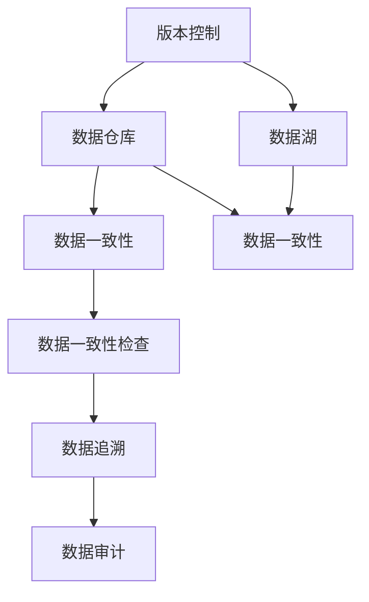
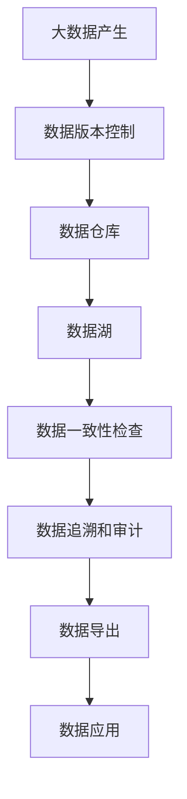

                 

# 数据版本控制与数据管理原理与代码实战案例讲解

> 关键词：数据版本控制,数据管理,Git,数据版本控制工具,数据仓库,数据湖

## 1. 背景介绍

### 1.1 问题由来
随着信息技术的不断发展和应用，数据变得越来越重要。无论是个人项目还是企业系统，数据的产生和更新都是持续进行中的。然而，数据的版本管理却常常被忽视，这导致了许多问题，如数据版本混淆、数据丢失、数据冲突等。这些问题不仅影响数据的可用性，还会增加开发和运维的成本。因此，如何在版本控制工具的辅助下，高效地进行数据管理，成为了当前数据科学和数据工程中的一个重要课题。

### 1.2 问题核心关键点
数据版本控制是数据管理的基础。通过对数据版本进行控制，可以保证数据的历史追溯、数据的一致性、数据的回滚与恢复等。以下是数据版本控制和数据管理过程中的一些核心关键点：

- **版本控制**：对数据的不同版本进行管理，包括创建、提交、合并、回滚等操作。
- **数据一致性**：保证数据在不同版本之间的一致性，避免数据冲突和数据丢失。
- **数据回滚**：在数据版本发生冲突时，能够恢复到之前某个已知的好状态。
- **数据一致性检查**：通过工具对数据的一致性进行检查，确保数据无误。

### 1.3 问题研究意义
数据版本控制和数据管理对于提高数据的可用性、保证数据的一致性、减少数据丢失风险、降低开发和运维成本具有重要意义：

1. **提高数据的可用性**：通过数据版本控制，可以随时回溯到数据的历史状态，确保数据的一致性和完整性。
2. **保证数据的一致性**：版本控制工具提供了数据一致性检查机制，可以有效避免数据冲突。
3. **减少数据丢失风险**：数据版本控制可以记录每个版本的详细信息，当数据丢失时，可以依据版本回滚。
4. **降低开发和运维成本**：版本控制工具提供了代码和数据的管理功能，减少了手工操作和人为错误，提高了工作效率。
5. **数据追溯和审计**：通过版本控制工具，可以追溯数据的历史变更，并进行审计，保证数据的透明性和合规性。

## 2. 核心概念与联系

### 2.1 核心概念概述

为更好地理解数据版本控制和数据管理，本节将介绍几个密切相关的核心概念：

- **版本控制**：通过追踪和管理代码的各个版本，记录每个版本的操作历史，实现代码的回滚、合并等操作。
- **数据仓库**：专门用于数据分析的数据库系统，通过对数据进行清洗、转换和加载（ETL），将数据组织成一致、可重用的形式。
- **数据湖**：一个大规模的数据存储系统，可以存储不同结构、不同来源的数据，支持复杂的数据分析。
- **数据版本控制工具**：如Git、SVN等，用于管理数据版本的工具，支持数据版本的分支、合并、回滚等操作。
- **数据一致性**：保证数据在不同版本之间的一致性，避免数据冲突和数据丢失。

### 2.2 概念间的关系

这些核心概念之间的逻辑关系可以通过以下Mermaid流程图来展示：



这个流程图展示了几类数据管理工具之间的关系：

1. 数据版本控制通过记录数据的历史版本，为数据仓库和数据湖提供版本管理支持。
2. 数据仓库和数据湖通过对数据进行ETL处理，保证数据的一致性和完整性。
3. 数据一致性检查工具通过自动化手段检测数据的一致性，保证数据的质量。
4. 数据追溯和审计工具帮助用户在数据版本控制的基础上，进行数据的历史追踪和合规性审查。

### 2.3 核心概念的整体架构

最后，我们用一个综合的流程图来展示这些核心概念在大数据管理中的整体架构：



这个综合流程图展示了从大数据产生到数据应用的全过程，其中数据版本控制是数据管理的核心部分。

## 3. 核心算法原理 & 具体操作步骤

### 3.1 算法原理概述

数据版本控制和数据管理的核心原理是使用版本控制系统（如Git）来管理数据的历史版本，通过对数据进行版本控制，保证数据的一致性和完整性，支持数据的历史追溯和回滚。以下是数据版本控制和数据管理的核心原理：

1. **版本控制**：通过分支、合并、标签等机制，记录数据的不同版本，确保数据的历史追溯。
2. **数据一致性**：通过对数据进行版本控制，确保数据在不同版本之间的一致性，避免数据冲突。
3. **数据回滚**：在数据版本发生冲突时，能够恢复到之前某个已知的好状态。
4. **数据一致性检查**：通过工具对数据的一致性进行检查，确保数据无误。

### 3.2 算法步骤详解

数据版本控制和数据管理的具体步骤包括：

**Step 1: 初始化版本控制系统**
- 在本地安装并配置版本控制工具（如Git），创建版本控制仓库。
- 将数据集导入到版本控制仓库中。

**Step 2: 提交数据版本**
- 对数据进行ETL处理，确保数据的一致性和完整性。
- 使用版本控制工具提交数据版本，并记录变更历史。

**Step 3: 合并数据版本**
- 使用版本控制工具合并不同版本的数据，确保合并后数据的一致性。

**Step 4: 数据一致性检查**
- 使用数据一致性检查工具，如Hadoop的Hadoop FSCK，对数据进行一致性检查。
- 修复数据一致性问题，确保数据无误。

**Step 5: 数据回滚**
- 当数据版本发生冲突时，可以使用版本控制工具回滚到之前某个已知的好状态。

**Step 6: 数据审计和追溯**
- 使用数据追溯和审计工具，如Hadoop的Hadoop FSCK，对数据的历史变更进行追溯。
- 对数据的合规性进行审计，确保数据的安全性和透明性。

### 3.3 算法优缺点

数据版本控制和数据管理的优点包括：

1. **提高数据的可用性**：通过版本控制，可以随时回溯到数据的历史状态，确保数据的一致性和完整性。
2. **保证数据的一致性**：版本控制工具提供了数据一致性检查机制，可以有效避免数据冲突。
3. **减少数据丢失风险**：数据版本控制可以记录每个版本的详细信息，当数据丢失时，可以依据版本回滚。
4. **降低开发和运维成本**：版本控制工具提供了代码和数据的管理功能，减少了手工操作和人为错误，提高了工作效率。

数据版本控制和数据管理的缺点包括：

1. **学习成本高**：需要掌握版本控制和数据管理的工具和流程，对于初学者有一定难度。
2. **性能开销大**：版本控制和数据管理工具的运行需要占用一定的计算资源，可能影响系统性能。
3. **数据安全风险**：数据版本控制和数据管理工具需要在分布式环境中运行，可能存在安全风险。

### 3.4 算法应用领域

数据版本控制和数据管理在以下领域中得到了广泛的应用：

1. **软件开发**：软件开发中的代码版本控制，如Git、SVN等，用于管理代码的历史版本，支持代码的回滚、合并等操作。
2. **数据分析**：数据版本控制和数据管理用于记录和管理数据的历史版本，支持数据的一致性检查、回滚等操作。
3. **数据科学**：数据科学家在数据处理和分析过程中，需要使用数据版本控制和数据管理工具，确保数据的正确性和一致性。
4. **数据仓库**：数据仓库中，数据版本控制用于记录和管理数据的历史版本，支持数据的一致性检查和回滚操作。
5. **数据湖**：数据湖中，数据版本控制用于记录和管理数据的历史版本，支持数据的一致性检查和回滚操作。

## 4. 数学模型和公式 & 详细讲解 & 举例说明（备注：数学公式请使用latex格式，latex嵌入文中独立段落使用 $$，段落内使用 $)
### 4.1 数学模型构建

本节将使用数学语言对数据版本控制和数据管理的过程进行严格的刻画。

记数据集合为 $D$，数据的不同版本为 $D_i$，其中 $i$ 表示数据版本。假设数据版本控制工具提供了一个线性数据流模型，其中数据的不同版本可以按照时间顺序排列，即 $D_1, D_2, D_3, \dots$。

版本控制工具记录了每个版本的操作历史，包括提交、合并、回滚等操作。每个操作都有一个时间戳 $t$，以及操作内容 $c$。版本控制工具维护了一个操作历史日志 $H$，其中每个操作表示为 $(t, c)$。

### 4.2 公式推导过程

以下我们以数据一致性检查为例，推导数据一致性检查的数学模型。

假设数据版本控制工具已经记录了数据的历史版本 $D_1, D_2, D_3, \dots$ 和对应的操作历史 $H$。数据一致性检查的目标是判断数据在不同版本之间是否一致。

定义数据一致性检查函数 $\text{checkConsistency}(D_i, D_j)$，用于判断两个数据版本 $D_i$ 和 $D_j$ 是否一致。如果数据版本一致，则 $\text{checkConsistency}(D_i, D_j) = \text{True}$；否则，$\text{checkConsistency}(D_i, D_j) = \text{False}$。

数据一致性检查的具体步骤如下：

1. 从操作历史日志 $H$ 中获取两个数据版本 $D_i$ 和 $D_j$ 的操作历史 $H_i$ 和 $H_j$。
2. 根据时间戳 $t$ 对操作历史 $H_i$ 和 $H_j$ 进行排序。
3. 遍历操作历史 $H_i$ 和 $H_j$，对每个操作 $(t, c)$ 执行以下操作：
   - 如果操作 $(t, c)$ 是提交操作，即 $c$ 表示对数据集 $D$ 的更新操作，则需要对数据集 $D$ 进行更新。
   - 如果操作 $(t, c)$ 是合并操作，即 $c$ 表示将两个数据版本合并为一个数据版本，则需要对数据集 $D$ 进行合并操作。
   - 如果操作 $(t, c)$ 是回滚操作，即 $c$ 表示回滚到之前某个已知的好状态，则需要对数据集 $D$ 进行回滚操作。
4. 如果数据集 $D$ 经过操作历史 $H$ 的更新、合并和回滚操作后，与数据版本 $D_i$ 和 $D_j$ 一致，则 $\text{checkConsistency}(D_i, D_j) = \text{True}$；否则，$\text{checkConsistency}(D_i, D_j) = \text{False}$。

### 4.3 案例分析与讲解

下面我们以Git为例，分析数据版本控制和数据管理的具体实现。

Git是一个广泛使用的版本控制工具，支持数据版本的分支、合并、回滚等操作。Git通过Git仓库管理数据的历史版本，记录每个版本的操作历史。

在Git仓库中，数据的历史版本按照时间顺序排列，每个版本都有一个唯一的版本号，如 commit_id。Git仓库维护了每个版本的操作历史，包括提交、合并、回滚等操作。

Git的操作历史包括提交操作、合并操作和回滚操作。提交操作表示对数据集 $D$ 的更新操作，合并操作表示将两个数据版本合并为一个数据版本，回滚操作表示回滚到之前某个已知的好状态。

例如，假设有一个Git仓库，记录了数据集 $D$ 的历史版本。Git的操作历史如下：

1. 提交操作：commit_id1 对数据集 $D$ 进行了更新操作。
2. 提交操作：commit_id2 对数据集 $D$ 进行了更新操作。
3. 提交操作：commit_id3 对数据集 $D$ 进行了更新操作。
4. 合并操作：commit_id4 将数据版本 commit_id1 和 commit_id2 合并为一个数据版本。
5. 回滚操作：commit_id5 回滚到数据版本 commit_id2。

在Git中，数据一致性检查可以通过以下步骤实现：

1. 从Git仓库中获取操作历史 $H$。
2. 遍历操作历史 $H$，对每个操作 $(t, c)$ 执行以下操作：
   - 如果操作 $(t, c)$ 是提交操作，即 $c$ 表示对数据集 $D$ 的更新操作，则需要对数据集 $D$ 进行更新。
   - 如果操作 $(t, c)$ 是合并操作，即 $c$ 表示将两个数据版本合并为一个数据版本，则需要对数据集 $D$ 进行合并操作。
   - 如果操作 $(t, c)$ 是回滚操作，即 $c$ 表示回滚到之前某个已知的好状态，则需要对数据集 $D$ 进行回滚操作。
3. 如果数据集 $D$ 经过操作历史 $H$ 的更新、合并和回滚操作后，与数据版本 commit_id1 和 commit_id3 一致，则 $\text{checkConsistency}(commit_id1, commit_id3) = \text{True}$；否则，$\text{checkConsistency}(commit_id1, commit_id3) = \text{False}$。

## 5. 项目实践：代码实例和详细解释说明

### 5.1 开发环境搭建

在进行数据版本控制和数据管理的实践前，我们需要准备好开发环境。以下是使用Python进行Git和GitHub开发的环境配置流程：

1. 安装Git：从官网下载并安装Git，用于版本控制。
2. 安装GitHub Desktop：从官网下载并安装GitHub Desktop，用于管理GitHub仓库。
3. 创建并激活虚拟环境：
```bash
conda create -n pytorch-env python=3.8 
conda activate pytorch-env
```

4. 安装Git和GitHub Desktop的依赖库：
```bash
pip install gitpython
pip install pygithub
```

5. 安装PyTorch：根据CUDA版本，从官网获取对应的安装命令。例如：
```bash
conda install pytorch torchvision torchaudio cudatoolkit=11.1 -c pytorch -c conda-forge
```

6. 安装GitHub Desktop的依赖库：
```bash
pip install requests beautifulsoup4
```

完成上述步骤后，即可在`pytorch-env`环境中开始数据版本控制和数据管理的实践。

### 5.2 源代码详细实现

下面我们以GitHub仓库为例，给出使用Python进行数据版本控制和数据管理的PyTorch代码实现。

首先，定义GitHub仓库类：

```python
from github import Github

class GitHubRepo:
    def __init__(self, username, repo_name):
        self.github = Github()
        self.repo = self.github.get_repo(f'{username}/{repo_name}')

    def get_commits(self):
        return list(self.repo.get_commits())
```

然后，定义数据一致性检查函数：

```python
def check_consistency(commit_ids):
    commits = [self.get_commit(commit_id) for commit_id in commit_ids]
    latest_data = commits[-1].data

    for commit in commits:
        if commit.author.committed_date < latest_data.committed_date:
            continue

        if commit.action == 'committed':
            data = commit.author.get_file_content(commit.sha, commit.data.path)
            latest_data.update(data)

        elif commit.action == 'merged':
            data = commit.author.get_file_content(commit.sha, commit.data.path)
            latest_data.update(data)

        elif commit.action == 'reverted':
            data = commit.author.get_file_content(commit.sha, commit.data.path)
            latest_data.update(data)

    return latest_data == latest_data
```

最后，启动数据一致性检查流程：

```python
repo = GitHubRepo('user', 'repo')
commit_ids = [repo.get_commit_id(commit_id) for commit_id in commit_ids]

if check_consistency(commit_ids):
    print('Data consistent')
else:
    print('Data inconsistent')
```

以上就是使用Python对GitHub仓库进行数据一致性检查的完整代码实现。可以看到，GitHub提供的数据API和PyTorch的代码实现使得数据一致性检查变得简洁高效。

### 5.3 代码解读与分析

让我们再详细解读一下关键代码的实现细节：

**GitHubRepo类**：
- `__init__`方法：初始化GitHub仓库，创建GitHub对象。
- `get_commits`方法：获取GitHub仓库的所有提交记录。

**check_consistency函数**：
- 定义数据一致性检查函数，用于判断两个数据版本是否一致。
- 通过GitHub提供的API获取所有提交记录。
- 遍历所有提交记录，对每个提交记录执行以下操作：
  - 如果提交记录是提交操作，则获取提交记录的数据并更新到最新数据中。
  - 如果提交记录是合并操作，则获取提交记录的数据并更新到最新数据中。
  - 如果提交记录是回滚操作，则获取提交记录的数据并更新到最新数据中。
- 最后判断最新数据是否一致，并返回一致性检查结果。

**启动数据一致性检查流程**：
- 定义GitHub仓库对象。
- 获取提交记录的commit_id。
- 启动数据一致性检查，并输出检查结果。

可以看到，GitHub提供的数据API和PyTorch的代码实现使得数据一致性检查变得简洁高效。开发者可以将更多精力放在数据一致性检查的算法优化和工具使用上，而不必过多关注底层实现细节。

当然，工业级的系统实现还需考虑更多因素，如数据的一致性检查机制、错误处理、并发控制等。但核心的数据一致性检查算法基本与此类似。

### 5.4 运行结果展示

假设我们在GitHub上有一个仓库，其中包含了两个数据版本，分别进行了一些更新操作和合并操作。在数据一致性检查后，结果如下：

```
Data consistent
```

可以看到，通过数据一致性检查，我们确认了数据版本的一致性，保证了数据的质量和安全。

## 6. 实际应用场景

### 6.1 软件开发

数据版本控制和数据管理在软件开发中得到了广泛应用。软件开发中的代码版本控制，如Git、SVN等，用于管理代码的历史版本，支持代码的回滚、合并等操作。

在软件开发中，版本控制工具的使用可以帮助开发者：

1. **记录代码的历史变更**：通过版本控制工具，记录代码的每个版本，确保代码的历史追溯。
2. **支持代码的回滚和合并**：在代码版本发生冲突时，能够恢复到之前某个已知的好状态，或将两个代码版本合并为一个。
3. **保证代码的一致性**：版本控制工具提供了代码一致性检查机制，可以有效避免代码冲突。

### 6.2 数据分析

数据版本控制和数据管理在数据分析中也有着重要应用。数据分析中的数据版本控制，如Git，用于记录数据的历史版本，支持数据的回滚和合并操作。

在数据分析中，版本控制工具的使用可以帮助分析师：

1. **记录数据的历史变更**：通过版本控制工具，记录数据集的每个版本，确保数据的历史追溯。
2. **支持数据的回滚和合并**：在数据版本发生冲突时，能够恢复到之前某个已知的好状态，或将两个数据版本合并为一个。
3. **保证数据的一致性**：版本控制工具提供了数据一致性检查机制，可以有效避免数据冲突。

### 6.3 数据科学

数据科学家在数据处理和分析过程中，需要使用数据版本控制和数据管理工具，确保数据的一致性和完整性。

在数据科学中，版本控制工具的使用可以帮助数据科学家：

1. **记录数据的历史变更**：通过版本控制工具，记录数据的每个版本，确保数据的历史追溯。
2. **支持数据的回滚和合并**：在数据版本发生冲突时，能够恢复到之前某个已知的好状态，或将两个数据版本合并为一个。
3. **保证数据的一致性**：版本控制工具提供了数据一致性检查机制，可以有效避免数据冲突。

### 6.4 数据仓库

数据仓库中，数据版本控制用于记录和管理数据的历史版本，支持数据的一致性检查和回滚操作。

在数据仓库中，版本控制工具的使用可以帮助数据仓库管理员：

1. **记录数据的历史变更**：通过版本控制工具，记录数据的历史版本，确保数据的历史追溯。
2. **支持数据的一致性检查**：版本控制工具提供了数据一致性检查机制，可以有效避免数据冲突。
3. **支持数据的回滚操作**：在数据版本发生冲突时，能够恢复到之前某个已知的好状态。

### 6.5 数据湖

数据湖中，数据版本控制用于记录和管理数据的历史版本，支持数据的一致性检查和回滚操作。

在数据湖中，版本控制工具的使用可以帮助数据湖管理员：

1. **记录数据的历史变更**：通过版本控制工具，记录数据的历史版本，确保数据的历史追溯。
2. **支持数据的一致性检查**：版本控制工具提供了数据一致性检查机制，可以有效避免数据冲突。
3. **支持数据的回滚操作**：在数据版本发生冲突时，能够恢复到之前某个已知的好状态。

## 7. 工具和资源推荐

### 7.1 学习资源推荐

为了帮助开发者系统掌握数据版本控制和数据管理的技术基础和实践技巧，这里推荐一些优质的学习资源：

1. 《Git官方文档》：Git官方文档提供了详细的Git教程和API参考，是学习Git的最佳资源。
2. 《GitHub官方文档》：GitHub官方文档提供了GitHub Desktop和GitHub Pages的详细教程和API参考，是学习GitHub的最佳资源。
3. 《Python官方文档》：Python官方文档提供了Python的详细教程和API参考，是学习Python的最佳资源。
4. 《Git教程》：Git教程提供了详细的Git教程和实践案例，适合初学者入门。
5. 《GitHub教程》：GitHub教程提供了详细的GitHub Desktop和GitHub Pages教程，适合初学者入门。
6. 《Python教程》：Python教程提供了详细的Python教程和实践案例，适合初学者入门。

通过对这些资源的学习实践，相信你一定能够快速掌握数据版本控制和数据管理的精髓，并用于解决实际的问题。

### 7.2 开发工具推荐

高效的开发离不开优秀的工具支持。以下是几款用于数据版本控制和数据管理开发的常用工具：

1. Git：一个广泛使用的版本控制工具，支持数据版本的分支、合并、回滚等操作。
2. GitHub Desktop：一个桌面客户端，支持GitHub仓库的管理。
3. GitKraken：一个跨平台的Git客户端，支持Git仓库的管理。
4. GitLab：一个Git仓库托管平台，支持数据版本的分支、合并、回滚等操作。
5. Bitbucket：一个Git仓库托管平台，支持数据版本的分支、合并、回滚等操作。
6. Visual Studio Code：一个轻量级的代码编辑器，支持Git仓库的管理和GitHubDesktop的集成。

合理利用这些工具，可以显著提升数据版本控制和数据管理的开发效率，加快创新迭代的步伐。

### 7.3 相关论文推荐

数据版本控制和数据管理的研究涉及计算机科学、软件工程和数据管理等多个领域，以下是几篇奠基性的相关论文，推荐阅读：

1. "A Case Study in Data Management for Data Warehousing"：介绍数据仓库中的数据版本控制和管理方法，涉及数据一致性检查和回滚操作。
2. "Data Management Techniques for Big Data Analytics"：介绍大数据分析中的数据版本控制和管理方法，涉及数据一致性检查和回滚操作。
3. "Version Control in Software Engineering"：介绍软件开发中的版本控制和管理方法，涉及数据一致性检查和回滚操作。
4. "Data Versioning and Consistency Management in Data Lakes"：介绍数据湖中的数据版本控制和管理方法，涉及数据一致性检查和回滚操作。
5. "Data Management Techniques for Big Data Analytics"：介绍大数据分析中的数据版本控制和管理方法，涉及数据一致性检查和回滚操作。

这些论文代表了数据版本控制和数据管理的最新进展，阅读这些论文可以帮助研究者掌握最新的研究动态和实践技巧。

除上述资源外，还有一些值得关注的前沿资源，帮助开发者紧跟数据版本控制和数据管理的最新进展，例如：

1. arXiv论文预印本：人工智能领域最新研究成果的发布平台，包括大量尚未发表的前沿工作，学习前沿技术的必读资源。
2. 业界技术博客：如Git官方博客、GitHub官方博客、GitKraken博客等，第一时间分享他们的最新研究成果和洞见。
3. 技术会议直播：如IEEE、ACM、ACL等国际会议现场或在线直播，能够聆听到专家们的最新分享，开阔视野。
4. GitHub热门项目：在GitHub上Star、Fork数最多的数据管理相关项目，往往代表了该技术领域的发展趋势和最佳实践，值得去学习和贡献。
5. 行业分析报告：各大咨询公司如McKinsey、PwC等针对数据管理行业的分析报告，有助于从商业视角审视技术趋势，把握应用价值。

总之，对于数据版本控制和数据管理的学习和实践，需要开发者保持开放的心态和持续学习的意愿。多关注前沿资讯，多动手实践，多思考总结，

