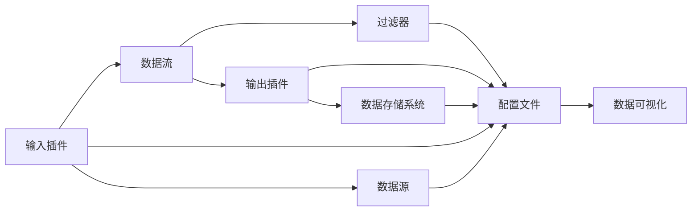

                 

# Logstash原理与代码实例讲解

> 关键词：Logstash, 日志收集与处理, 数据流处理, 流式计算, 插件, 配置文件, 数据可视化

## 1. 背景介绍

### 1.1 问题由来

在现代软件开发过程中，日志记录是不可或缺的一环。通过记录系统的运行状态和操作日志，开发者和运维人员能够快速定位问题、监控系统性能、进行错误排查等。然而，日志数量庞大、格式各异，如何高效收集、分析和利用这些数据，一直是IT领域的痛点。

为此，ELK Stack（Elasticsearch, Logstash, Kibana）应运而生。其中，Logstash是一个功能强大的日志收集和数据处理工具，能够从多个数据源收集日志，并通过一系列的插件和配置文件，进行数据的清洗、转换、聚合等操作。本文将从Logstash的基本概念入手，深入探讨其工作原理和具体实现，并结合代码实例进行讲解。

### 1.2 问题核心关键点

Logstash的核心在于其强大的数据处理能力和丰富的插件体系。通过插件和配置文件，Logstash可以实现多种数据源的收集、数据的预处理和转换、以及数据的存储和可视化。其核心技术包括：

- 数据管道（Pipeline）：Logstash的核心处理逻辑，通过一系列的数据流处理管道对数据进行处理。
- 插件（Plug-ins）：丰富的插件库，支持数据源收集、数据转换、数据聚合等功能。
- 配置文件（Configuration File）：用于配置数据流处理管道、插件参数等的文本文件。
- 输入插件（Input Plugins）：负责从不同数据源收集数据。
- 输出插件（Output Plugins）：负责将处理后的数据输出到不同存储系统，如Elasticsearch、S3、Hadoop等。

理解了这些核心概念，才能更好地掌握Logstash的实现原理和应用场景。

## 2. 核心概念与联系

### 2.1 核心概念概述

为了更深入地理解Logstash，我们需要明确几个核心概念：

- **数据管道（Pipeline）**：Logstash的核心概念，通过一系列的输入、过滤、输出等步骤，对数据进行流式处理。数据管道由多个阶段（Stage）组成，每个阶段负责不同的数据处理任务。
- **插件（Plug-ins）**：Logstash的插件库提供了丰富的数据处理能力，包括数据源收集、数据转换、数据聚合等。每个插件都有特定的功能，可以根据需要灵活组合。
- **配置文件（Configuration File）**：用于定义数据管道和插件参数的文本文件，是Logstash的配置核心。配置文件通过JSON格式定义管道和插件的配置，支持多种数据源和输出系统。
- **数据流（Data Stream）**：Logstash处理的数据流。每个数据流由一系列事件组成，每个事件包含一个或多个字段。
- **事件（Event）**：Logstash处理的基本单位，每个事件包含一个或多个字段，用于存储和传输数据。

这些概念构成了Logstash的核心生态，帮助开发者高效地收集、处理和利用数据。

### 2.2 概念间的关系

Logstash的这些核心概念之间的关系可以通过以下Mermaid流程图来展示：



这个流程图展示了Logstash的工作流程：

1. 数据通过输入插件从不同的数据源收集。
2. 数据流在管道中进行过滤和转换。
3. 转换后的数据通过输出插件输出到不同的存储系统。
4. 配置文件定义了数据管道和插件参数，是整个处理过程的配置核心。
5. 配置文件还可以将处理后的数据传输到数据可视化系统，如Kibana，进行数据展示。

通过这些概念和流程，我们可以更好地理解Logstash的工作原理和实现细节。

## 3. 核心算法原理 & 具体操作步骤

### 3.1 算法原理概述

Logstash的核心算法原理主要体现在其数据管道（Pipeline）的流式处理机制上。数据管道由多个阶段（Stage）组成，每个阶段负责不同的数据处理任务。数据流在管道中逐个处理，最终输出到指定的存储系统或可视化系统。

Logstash的核心算法包括：

- **数据流的逐个处理**：数据流中的每个事件通过管道逐个进行处理，每个阶段可以对数据流进行过滤、转换、聚合等操作。
- **插件的灵活组合**：Logstash的插件库提供了丰富的数据处理能力，开发者可以根据需要灵活组合插件，实现各种数据处理任务。
- **配置文件的灵活配置**：通过JSON格式的配置文件，开发者可以灵活配置数据管道和插件参数，实现高效的数据处理。

这些核心算法构成了Logstash的流式处理框架，使得其能够高效地处理海量数据，适应不同的数据源和输出系统。

### 3.2 算法步骤详解

Logstash的核心算法步骤包括数据流的收集、处理和输出。下面详细介绍每一步的具体实现。

**Step 1: 数据收集**

Logstash通过输入插件从不同的数据源收集数据。常见的输入插件包括：

- `file`：从本地文件系统收集日志数据。
- `log`：从远程日志服务器收集日志数据。
- `syslog`：从系统日志文件中收集数据。
- `http`：从HTTP请求中收集数据。

输入插件的定义和配置可以通过配置文件进行。以下是一个简单的`file`输入插件的配置示例：

```json
input {
    file {
        path => "/var/log/app.log"
    }
}
```

这个配置表示Logstash从`/var/log/app.log`文件中收集日志数据。

**Step 2: 数据处理**

数据收集完成后，需要在管道中进行处理。Logstash的管道由多个阶段（Stage）组成，每个阶段负责不同的数据处理任务。常见的阶段包括：

- `filter`：对数据进行过滤和转换。
- `codecs`：对数据进行编码和解码。
- `mutate`：对数据进行修改和增强。
- `output`：将数据输出到不同的存储系统。

每个阶段都由相应的插件实现。以下是一个简单的数据处理管道示例：

```json
filter {
    mutate {
        add_field => { "level" => "info" }
    }
}
```

这个配置表示在管道中添加一个新的字段`level`，值为`info`。

**Step 3: 数据输出**

数据处理完成后，需要将其输出到指定的存储系统。Logstash的输出插件支持多种数据存储系统，包括：

- `elasticsearch`：将数据输出到Elasticsearch中。
- `file`：将数据输出到本地文件系统中。
- `kafka`：将数据输出到Kafka消息队列中。
- `stdout`：将数据输出到标准输出流。

输出插件的定义和配置也可以通过配置文件进行。以下是一个简单的`elasticsearch`输出插件的配置示例：

```json
output {
    elasticsearch {
        hosts => ["localhost:9200"]
        index => "logstash-2022-01-01"
    }
}
```

这个配置表示将数据输出到本地Elasticsearch的`logstash-2022-01-01`索引中。

### 3.3 算法优缺点

Logstash的优点包括：

- **灵活的插件体系**：丰富的插件库支持多种数据源和数据处理任务，满足不同场景的需求。
- **流式处理框架**：通过数据管道和插件组合，实现高效的数据处理。
- **灵活的配置文件**：通过JSON格式的配置文件，灵活配置数据管道和插件参数。

Logstash的缺点包括：

- **较高的配置门槛**：需要开发者熟悉插件和配置文件，具有一定的学习成本。
- **性能瓶颈**：处理大规模数据时，插件的性能和稳定性需要进一步优化。
- **资源消耗**：Logstash是一个资源密集型的工具，需要较高的计算和内存资源。

尽管存在这些缺点，但Logstash以其强大的数据处理能力和灵活的配置机制，仍然成为了日志处理领域的主流工具。

### 3.4 算法应用领域

Logstash在日志处理领域有着广泛的应用，涵盖多种数据源和输出系统。其主要应用领域包括：

- **日志收集与管理**：从各种数据源（如系统日志、应用日志、网络日志等）收集日志数据，进行统一管理和分析。
- **数据清洗与转换**：对收集到的日志数据进行清洗、转换和格式转换，以便后续分析和展示。
- **数据存储与检索**：将清洗后的日志数据存储到Elasticsearch、Hadoop、S3等存储系统中，进行快速检索和展示。
- **数据可视化**：通过Kibana等工具对处理后的数据进行可视化展示，提供丰富的图表和仪表盘。

## 4. 数学模型和公式 & 详细讲解 & 举例说明（备注：数学公式请使用latex格式，latex嵌入文中独立段落使用 $$，段落内使用 $)
### 4.1 数学模型构建

Logstash的数学模型主要体现在其数据管道（Pipeline）的流式处理机制上。数据管道由多个阶段（Stage）组成，每个阶段负责不同的数据处理任务。数据流在管道中逐个处理，最终输出到指定的存储系统或可视化系统。

数据管道可以表示为一个函数映射，其中每个阶段对应一个函数：

$$
\pi = f_1 \circ f_2 \circ \cdots \circ f_n
$$

其中，$f_i$表示第$i$个阶段的处理函数，$\circ$表示函数复合。数据管道中的每个事件经过每个阶段的处理后，最终输出到指定的存储系统或可视化系统。

### 4.2 公式推导过程

下面以一个简单的数据管道为例，推导其数学模型：

假设我们有以下数据管道：

```json
input {
    file {
        path => "/var/log/app.log"
    }
}

filter {
    mutate {
        add_field => { "level" => "info" }
    }
}

output {
    elasticsearch {
        hosts => ["localhost:9200"]
        index => "logstash-2022-01-01"
    }
}
```

这个管道包括三个阶段：

- `file`输入插件：从本地文件系统收集日志数据。
- `mutate`过滤器：在数据中添加一个新的字段`level`，值为`info`。
- `elasticsearch`输出插件：将数据输出到Elasticsearch的`logstash-2022-01-01`索引中。

数据管道可以表示为：

$$
\pi = file \circ mutate \circ elasticsearch
$$

其中，`file`和`elasticsearch`函数分别对应输入和输出插件，`mutate`函数对应过滤器。每个函数的具体实现可以通过其插件的API进行配置。

### 4.3 案例分析与讲解

假设我们有一个日志数据流，其原始数据如下：

```
[{"timestamp": "2022-01-01 12:00:00", "message": "info: application started", "level": "debug"}
```

经过`mutate`过滤器的处理，数据流变为：

```
[{"timestamp": "2022-01-01 12:00:00", "message": "info: application started", "level": "info"}
```

最终，经过`elasticsearch`输出插件的处理，数据输出到Elasticsearch的`logstash-2022-01-01`索引中。

通过这个简单的案例，我们可以看到数据管道的基本处理流程：收集数据、处理数据、输出数据。

## 5. 项目实践：代码实例和详细解释说明

### 5.1 开发环境搭建

为了使用Logstash，我们需要安装其依赖的JDK、Elasticsearch和Kibana等工具。以下是在Ubuntu系统上安装Logstash的命令：

```bash
sudo apt-get update
sudo apt-get install -y openjdk-11-jdk
sudo apt-get install -y elasticsearch
sudo apt-get install -y kibana
```

安装完成后，需要下载并安装Logstash的JAR包：

```bash
wget https://artifacts.elastic.co/downloads/logstash/logstash-8.7.1.tar.gz
tar -xvf logstash-8.7.1.tar.gz
cd logstash-8.7.1
```

### 5.2 源代码详细实现

下面以一个简单的日志收集管道为例，给出其配置文件和代码实现。

首先，创建一个`logstash.conf`配置文件，定义数据管道：

```json
input {
    file {
        path => "/var/log/app.log"
    }
}

filter {
    mutate {
        add_field => { "level" => "info" }
    }
}

output {
    elasticsearch {
        hosts => ["localhost:9200"]
        index => "logstash-2022-01-01"
    }
}
```

然后，运行Logstash：

```bash
bin/logstash -f logstash.conf
```

### 5.3 代码解读与分析

让我们详细解读一下关键代码的实现细节：

**配置文件**：

- `input`：定义数据收集插件，这里使用`file`插件从本地文件系统收集日志数据。
- `filter`：定义数据处理插件，这里使用`mutate`插件添加一个新的字段`level`，值为`info`。
- `output`：定义数据输出插件，这里使用`elasticsearch`插件将数据输出到Elasticsearch的`logstash-2022-01-01`索引中。

**运行Logstash**：

Logstash的运行命令包括：

- `bin/logstash`：Logstash二进制文件。
- `-f`：指定配置文件路径。
- `-l`：指定日志输出级别，默认为`info`。

通过上述配置和运行方式，我们可以实现一个简单的日志收集管道。

### 5.4 运行结果展示

假设我们在Logstash的输出插件中使用`json`格式输出数据，则运行结果如下：

```json
{"timestamp":"2022-01-01 12:00:00","message":"info: application started","level":"info"}
```

通过这个运行结果，我们可以看到数据管道对原始数据的处理结果。

## 6. 实际应用场景

### 6.1 智能运维

智能运维是大数据时代的重要应用场景，通过收集和分析系统日志，可以及时发现和解决系统问题，提升运维效率。Logstash在智能运维中主要应用于以下几个方面：

- **日志收集与管理**：从各种数据源（如系统日志、应用日志、网络日志等）收集日志数据，进行统一管理和分析。
- **数据清洗与转换**：对收集到的日志数据进行清洗、转换和格式转换，以便后续分析和展示。
- **数据存储与检索**：将清洗后的日志数据存储到Elasticsearch、Hadoop、S3等存储系统中，进行快速检索和展示。
- **数据可视化**：通过Kibana等工具对处理后的数据进行可视化展示，提供丰富的图表和仪表盘。

### 6.2 安全监控

安全监控是网络安全的重要环节，通过收集和分析日志数据，可以及时发现和防范安全威胁。Logstash在安全监控中主要应用于以下几个方面：

- **日志收集与管理**：从各种数据源（如系统日志、防火墙日志、安全事件日志等）收集日志数据，进行统一管理和分析。
- **数据清洗与转换**：对收集到的日志数据进行清洗、转换和格式转换，以便后续分析和展示。
- **数据存储与检索**：将清洗后的日志数据存储到Elasticsearch、Hadoop、S3等存储系统中，进行快速检索和展示。
- **数据可视化**：通过Kibana等工具对处理后的数据进行可视化展示，提供丰富的图表和仪表盘。

### 6.3 金融风控

金融风控是金融行业的重要应用场景，通过收集和分析交易日志，可以及时发现和防范欺诈行为。Logstash在金融风控中主要应用于以下几个方面：

- **日志收集与管理**：从各种数据源（如交易日志、用户行为日志、欺诈事件日志等）收集日志数据，进行统一管理和分析。
- **数据清洗与转换**：对收集到的日志数据进行清洗、转换和格式转换，以便后续分析和展示。
- **数据存储与检索**：将清洗后的日志数据存储到Elasticsearch、Hadoop、S3等存储系统中，进行快速检索和展示。
- **数据可视化**：通过Kibana等工具对处理后的数据进行可视化展示，提供丰富的图表和仪表盘。

## 7. 工具和资源推荐

### 7.1 学习资源推荐

为了帮助开发者系统掌握Logstash的理论基础和实践技巧，这里推荐一些优质的学习资源：

1. **官方文档**：Logstash的官方文档详细介绍了其配置语法、插件功能、API接口等，是学习Logstash的必备资料。
2. **Elastic Stack官方博客**：ELK Stack的官方博客提供了丰富的案例和实战经验，帮助开发者深入理解Logstash的实现原理和应用场景。
3. **Kibana官方文档**：Kibana的官方文档详细介绍了其数据可视化功能、图表展示、仪表盘定制等，是学习Kibana的必备资料。
4. **Elasticsearch官方文档**：Elasticsearch的官方文档详细介绍了其搜索、聚合、分页等功能，是学习Elasticsearch的必备资料。
5. **Elastic Stack实战教程**：《Elastic Stack实战教程》系列书籍详细介绍了Elastic Stack的配置、部署、优化等实战经验，适合进阶学习。

通过这些资源的学习实践，相信你一定能够快速掌握Logstash的精髓，并用于解决实际的日志处理问题。

### 7.2 开发工具推荐

高效的开发离不开优秀的工具支持。以下是几款用于Logstash开发的常用工具：

1. **JDK**：Java Development Kit，Logstash的运行环境。
2. **Elasticsearch**：分布式搜索引擎，Logstash的输出插件支持。
3. **Kibana**：数据可视化工具，Logstash的处理结果可以通过Kibana进行展示。
4. **Kibana入门教程**：Kibana官方提供的入门教程，帮助开发者快速上手Kibana。
5. **Elastic Stack官方文档**：ELK Stack的官方文档，提供了丰富的API接口和插件功能。

合理利用这些工具，可以显著提升Logstash的开发效率，加快创新迭代的步伐。

### 7.3 相关论文推荐

Logstash在日志处理领域的发展源于学界的持续研究。以下是几篇奠基性的相关论文，推荐阅读：

1. **Logstash: the hostile log aggregator**：Logstash的发布文章，介绍了Logstash的实现原理和核心算法。
2. **Elastic Stack: the power of unified logging and monitoring**：ELK Stack的发布文章，介绍了Elastic Stack的核心功能和应用场景。
3. **Distributed log aggregation and monitoring with Logstash**：关于Logstash在分布式日志收集和监控中的应用研究。
4. **Logstash in production: lessons learned**：来自ELK Stack官方博客的经验分享，介绍了Logstash在生产环境中的部署和优化经验。
5. **Practical Elasticsearch and Logstash**：关于Elasticsearch和Logstash的实战教程，介绍了其配置、部署、优化等实战经验。

这些论文代表了大数据日志处理技术的发展脉络。通过学习这些前沿成果，可以帮助研究者把握学科前进方向，激发更多的创新灵感。

除上述资源外，还有一些值得关注的前沿资源，帮助开发者紧跟大数据日志处理技术的最新进展，例如：

1. **arXiv论文预印本**：人工智能领域最新研究成果的发布平台，包括大量尚未发表的前沿工作，学习前沿技术的必读资源。
2. **Elastic Stack社区**：ELK Stack的开发者社区，提供了丰富的技术支持和实战经验。
3. **Elastic Stack技术会议**：ELK Stack的开发者大会，汇聚了全球最新的日志处理技术，提供了丰富的技术交流机会。
4. **GitHub热门项目**：在GitHub上Star、Fork数最多的Elastic Stack相关项目，往往代表了该技术领域的发展趋势和最佳实践，值得去学习和贡献。

总之，对于Logstash的学习和实践，需要开发者保持开放的心态和持续学习的意愿。多关注前沿资讯，多动手实践，多思考总结，必将收获满满的成长收益。

## 8. 总结：未来发展趋势与挑战

### 8.1 总结

本文对Logstash的基本概念和实现原理进行了全面系统的介绍。首先阐述了Logstash在日志处理领域的应用背景和重要性，明确了其在大数据时代的独特价值。其次，从原理到实践，详细讲解了Logstash的核心算法和操作步骤，给出了一个完整的日志收集管道配置示例。同时，本文还广泛探讨了Logstash在智能运维、安全监控、金融风控等多个领域的应用前景，展示了其强大的数据处理能力。最后，本文精选了Logstash的学习资源和开发工具，力求为读者提供全方位的技术指引。

通过本文的系统梳理，可以看到，Logstash作为ELK Stack的重要组成部分，以其强大的数据处理能力和灵活的配置机制，已经成为日志处理领域的基石。未来，伴随大数据技术的不断发展，Logstash必将在更多领域得到应用，为大数据日志处理技术带来新的突破。

### 8.2 未来发展趋势

展望未来，Logstash的发展趋势主要包括：

1. **数据处理能力提升**：随着大数据技术的不断发展，Logstash将不断提升其数据处理能力，支持更复杂、更高效的数据处理任务。
2. **插件生态系统丰富**：更多的插件将加入Logstash的生态系统，支持更多数据源和数据处理任务，提高其灵活性和实用性。
3. **数据可视化优化**：通过Kibana等工具，对处理后的数据进行更丰富的可视化展示，提供更直观、更便捷的数据分析体验。
4. **实时处理能力增强**：通过引入流式处理技术，支持实时数据处理，提高其应用场景的覆盖范围。
5. **多平台支持扩展**：支持更多的操作系统和硬件平台，提高其部署和使用的灵活性。

这些发展趋势将进一步提升Logstash的性能和应用场景，使得其能够更好地服务于大数据时代的各种应用需求。

### 8.3 面临的挑战

尽管Logstash在日志处理领域已经取得了显著成就，但在迈向更加智能化、普适化应用的过程中，它仍面临以下挑战：

1. **配置复杂度**：Logstash的配置文件和插件生态相对复杂，新手学习成本较高。
2. **性能瓶颈**：在处理大规模数据时，插件的性能和稳定性需要进一步优化。
3. **资源消耗**：Logstash是一个资源密集型的工具，需要较高的计算和内存资源。
4. **数据安全**：在处理敏感数据时，需要确保数据传输和存储的安全性。

尽管存在这些挑战，但Logstash以其强大的数据处理能力和灵活的配置机制，仍然是大数据时代的重要工具。相信在学界和产业界的共同努力下，这些挑战终将一一被克服，Logstash必将在未来迎来更广泛的应用和更广阔的发展前景。

### 8.4 未来突破

为了应对Logstash面临的挑战，未来的研究需要在以下几个方面寻求新的突破：

1. **简化配置机制**：通过引入可视化配置工具和模板，降低配置文件的复杂度，提高开发者学习效率。
2. **优化插件性能**：通过引入流式处理技术、分布式计算等方法，提高插件的性能和稳定性。
3. **支持更多平台**：通过引入跨平台兼容技术，支持更多的操作系统和硬件平台，提高其部署和使用的灵活性。
4. **强化数据安全**：通过引入数据加密、访问控制等技术，确保数据传输和存储的安全性。
5. **增强实时处理能力**：通过引入流式处理技术，支持实时数据处理，提高其应用场景的覆盖范围。

这些研究方向的探索，必将引领Logstash技术迈向更高的台阶，为大数据日志处理技术带来新的突破。面向未来，Logstash需要与其他大数据处理技术进行更深入的融合，多路径协同发力，共同推动大数据日志处理技术的进步。只有勇于创新、敢于突破，才能不断拓展Logstash的边界，让大数据日志处理技术更好地服务于各个领域。

## 9. 附录：常见问题与解答

**Q1: Logstash的核心概念是什么？**

A: Logstash的核心概念包括数据管道（Pipeline）、插件（Plug-ins）、配置文件（Configuration File）等。数据管道是Logstash的核心处理逻辑，插件是实现数据处理任务的核心组件，配置文件是定义管道和插件参数的关键工具。

**Q2: Logstash的主要应用场景是什么？**

A: Logstash在日志处理领域有着广泛的应用，涵盖多种数据源和输出系统。其主要应用场景包括智能运维、安全监控、金融风控等。通过收集和分析日志数据，可以及时发现和解决系统问题，提升运维效率；通过收集和分析安全日志数据，可以及时发现和防范安全威胁；通过收集和分析交易日志数据，可以及时发现和防范欺诈行为。

**Q3: Logstash的学习资源有哪些？**

A: 为了帮助开发者系统掌握Logstash的理论基础和实践技巧，以下是一些优质的学习资源：官方文档、Elastic Stack官方博客、Kibana官方文档、Elasticsearch官方文档、《Elastic Stack实战教程》系列书籍等。这些资源提供了丰富的配置示例和实战经验，帮助开发者深入理解Logstash的实现原理和应用场景。

**Q4: Logstash的开发工具有哪些？**

A: 高效的开发离不开优秀的工具支持。以下是几款用于Logstash开发的常用工具：JDK、Elasticsearch、Kibana、Kibana入门教程、Elastic Stack官方文档等。合理利用这些工具，可以显著提升Logstash的开发效率，加快创新迭代的步伐。

**Q5: Logstash的未来发展趋势是什么？**

A: Logstash的未来发展趋势主要包括数据处理能力提升、插件生态系统丰富、数据可视化优化、实时处理能力增强、多平台支持扩展等。这些发展趋势将进一步提升Logstash的性能和应用场景，使得其能够更好地服务于大数据时代的各种应用需求。

作者：禅与计算机程序设计艺术 / Zen and the Art of Computer Programming

