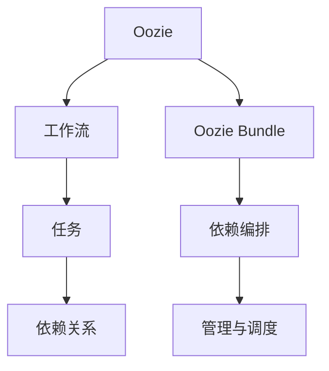
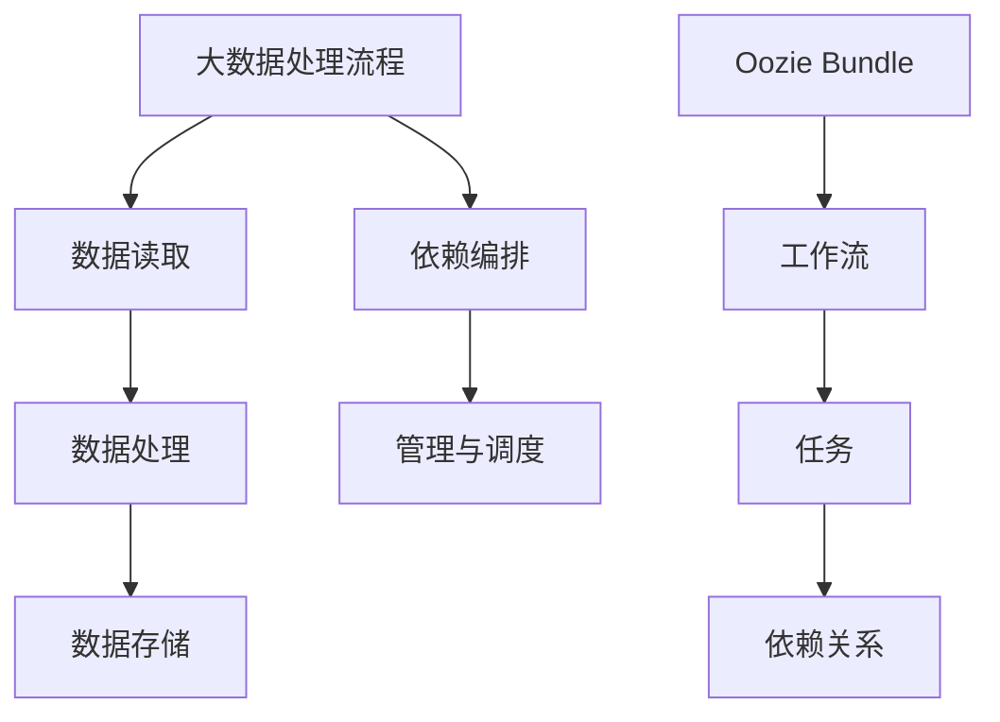

                 

# Oozie Bundle原理与代码实例讲解

## 1. 背景介绍

### 1.1 问题由来
Oozie是一个开源的工作流调度系统，由Apache Hadoop项目组开发。它基于XML语法，能够轻松描述、部署、运行和管理复杂的、分布式的工作流。Oozie工作流调度系统广泛应用于Hadoop生态系统中，支持多种数据处理和存储任务，如MapReduce、Hive、Spark等。在大数据时代，数据处理流程变得复杂多样，各个任务之间存在着紧密的依赖关系，传统的流程管理方法已经难以应对。通过Oozie，能够对大数据处理任务进行统一管理和调度，提高系统的灵活性和效率。

### 1.2 问题核心关键点
Oozie Bundle是一种在Oozie中使用的高级功能，它可以将多个Oozie工作流按照预定义的方式打包成一个独立的单元，方便管理和部署。每个Oozie Bundle中包含了多个Oozie工作流，每个工作流负责处理某一特定阶段的任务，这些任务可以通过Oozie的调度引擎协调运行。

## 2. 核心概念与联系

### 2.1 核心概念概述

为了更好地理解Oozie Bundle的原理和应用，我们先介绍几个关键概念：

- **Oozie**：Apache Hadoop项目组开发的工作流调度系统，用于描述、部署、运行和管理分布式工作流。
- **工作流(Workflow)**：由多个任务组成的流程，每个任务负责执行特定的功能，如数据读取、数据处理、数据存储等。
- **依赖关系(Dependency)**：工作流中的任务之间存在着依赖关系，一个任务的执行依赖于其前一个任务的输出。
- **Oozie Bundle**：一种高级功能，用于将多个Oozie工作流打包成独立的单元，方便管理和部署。
- **依赖编排**：通过Oozie Bundle，可以灵活编排多个工作流之间的依赖关系，实现复杂的流程管理。

### 2.2 概念间的关系

以下是这些核心概念之间的逻辑关系，可以通过以下Mermaid流程图来展示：



这个流程图展示了Oozie Bundle的核心概念及其之间的关系：

1. Oozie用于描述、部署、运行和管理分布式工作流。
2. 工作流由多个任务组成，每个任务负责执行特定的功能。
3. 任务之间存在着依赖关系，Oozie用于协调这些任务的执行顺序。
4. Oozie Bundle将多个Oozie工作流打包成一个独立的单元，方便管理和部署。
5. Oozie Bundle中的依赖编排，可以灵活编排多个工作流之间的依赖关系，实现复杂的流程管理。

### 2.3 核心概念的整体架构

最后，我们用一个综合的流程图来展示这些核心概念在大数据处理流程中的整体架构：



这个综合流程图展示了从数据读取到数据存储的全流程，以及其中Oozie Bundle的应用：

1. 大数据处理流程由多个环节组成，包括数据读取、数据处理、数据存储等。
2. Oozie Bundle可以将多个Oozie工作流打包成一个独立的单元，方便管理和部署。
3. 每个工作流由多个任务组成，任务之间存在着依赖关系。
4. 依赖编排通过Oozie Bundle，可以灵活编排多个工作流之间的依赖关系，实现复杂的流程管理。
5. 最终，通过Oozie Bundle的管理与调度，实现了大数据处理流程的自动化和高效化。

## 3. 核心算法原理 & 具体操作步骤
### 3.1 算法原理概述

Oozie Bundle的原理是基于XML语法，通过将多个Oozie工作流打包成一个独立的单元，实现对大数据处理流程的统一管理和调度。每个Oozie Bundle中包含了多个Oozie工作流，每个工作流负责处理某一特定阶段的任务。Oozie Bundle中的依赖编排，可以灵活编排多个工作流之间的依赖关系，实现复杂的流程管理。

形式化地，假设Oozie Bundle中包含 $N$ 个工作流 $W_1, W_2, ..., W_N$，每个工作流包含 $M$ 个任务 $T_1, T_2, ..., T_M$。任务之间的依赖关系可以通过XML语法进行描述，设 $D_{i,j}$ 表示任务 $T_i$ 依赖于任务 $T_j$ 的条件，则依赖关系可以表示为：

$$
D_{i,j} = \{(T_i, T_j) | T_i \in W_k, T_j \in W_k, (k, i, j) \in S\}
$$

其中 $S$ 表示所有工作流之间的关系集合。

### 3.2 算法步骤详解

基于Oozie Bundle的原理，其操作步骤主要包括以下几个步骤：

**Step 1: 设计工作流**

首先，需要设计多个Oozie工作流，每个工作流负责处理某一特定阶段的任务。例如，可以将数据读取、数据处理、数据存储等任务分别放在不同的工作流中。

**Step 2: 定义依赖关系**

接下来，需要定义每个工作流中的任务之间的依赖关系。例如，数据读取任务需要依赖于数据存储任务，数据处理任务需要依赖于数据读取任务等。

**Step 3: 打包Oozie Bundle**

将设计好的多个工作流打包成一个独立的单元，即Oozie Bundle。通过XML语法，将每个工作流中的任务和依赖关系进行描述，形成一个完整的Oozie Bundle定义文件。

**Step 4: 部署Oozie Bundle**

将打包好的Oozie Bundle部署到Hadoop集群中，通过Oozie的调度引擎进行协调运行。

**Step 5: 运行Oozie Bundle**

启动Oozie Bundle的运行，Oozie调度引擎会自动执行每个工作流中的任务，确保按照预定义的顺序和依赖关系依次执行。

**Step 6: 监控Oozie Bundle**

监控Oozie Bundle的运行状态，及时发现并解决问题。可以通过Oozie的监控界面或者定制化的监控工具实现。

### 3.3 算法优缺点

Oozie Bundle的优点包括：

- 提高了大数据处理流程的自动化和灵活性。通过Oozie Bundle，可以将多个工作流打包成一个独立的单元，方便管理和部署。
- 实现了复杂流程的编排和管理。Oozie Bundle中的依赖编排，可以灵活编排多个工作流之间的依赖关系，实现复杂的流程管理。
- 提高了大数据处理流程的可维护性和可扩展性。通过Oozie Bundle，可以在不影响现有工作流的前提下，添加、修改、删除任务，实现系统的动态调整。

Oozie Bundle的缺点包括：

- 依赖于Hadoop集群。Oozie Bundle的运行需要依赖Hadoop集群，当集群规模较大时，部署和维护成本较高。
- 依赖XML语法。Oozie Bundle的描述和管理依赖于XML语法，如果XML语法设计不合理，容易出现问题。
- 依赖Oozie调度引擎。Oozie Bundle的运行依赖于Oozie的调度引擎，当调度引擎出现问题时，会影响整个流程的运行。

### 3.4 算法应用领域

Oozie Bundle的应用领域包括：

- 大数据处理流程的自动化管理。例如，数据读取、数据处理、数据存储等任务都可以通过Oozie Bundle进行统一管理和调度。
- 复杂流程的编排和管理。例如，数据清洗、特征工程、模型训练、结果存储等任务都可以通过Oozie Bundle进行灵活编排和管理。
- 系统的动态调整和优化。例如，可以在不影响现有工作流的前提下，添加、修改、删除任务，实现系统的动态调整和优化。

## 4. 数学模型和公式 & 详细讲解 & 举例说明

### 4.1 数学模型构建

基于Oozie Bundle的原理，我们可以构建一个简单的数学模型来描述其依赖关系。设Oozie Bundle中包含 $N$ 个工作流 $W_1, W_2, ..., W_N$，每个工作流包含 $M$ 个任务 $T_1, T_2, ..., T_M$。任务之间的依赖关系可以通过以下矩阵表示：

$$
D = \begin{bmatrix}
0 & 1 & 1 & 0 & 0 \\
0 & 0 & 0 & 1 & 0 \\
1 & 0 & 0 & 0 & 0 \\
0 & 1 & 0 & 0 & 0 \\
0 & 0 & 1 & 0 & 0
\end{bmatrix}
$$

其中 $D_{i,j}$ 表示任务 $T_i$ 依赖于任务 $T_j$ 的条件，$D_{i,j}=1$ 表示任务 $T_i$ 依赖于任务 $T_j$，$D_{i,j}=0$ 表示任务 $T_i$ 不依赖于任务 $T_j$。

### 4.2 公式推导过程

根据上述矩阵，我们可以推导出Oozie Bundle中的依赖关系。例如，任务 $T_1$ 依赖于任务 $T_2$ 和 $T_3$，任务 $T_2$ 依赖于任务 $T_4$，任务 $T_3$ 依赖于任务 $T_5$。

通过矩阵乘法，我们可以计算出每个任务的依赖关系：

$$
D^k = \begin{bmatrix}
0 & 1 & 1 & 0 & 0 \\
0 & 0 & 0 & 1 & 0 \\
1 & 0 & 0 & 0 & 0 \\
0 & 1 & 0 & 0 & 0 \\
0 & 0 & 1 & 0 & 0
\end{bmatrix}^k = \begin{bmatrix}
0 & 1 & 1 & 0 & 0 \\
0 & 0 & 0 & 1 & 0 \\
0 & 1 & 0 & 0 & 0 \\
0 & 0 & 1 & 0 & 0 \\
0 & 0 & 0 & 1 & 0
\end{bmatrix}
$$

其中 $k=2$，表示经过两轮执行后，任务 $T_1$ 依赖于任务 $T_2$ 和 $T_3$，任务 $T_2$ 依赖于任务 $T_4$，任务 $T_3$ 依赖于任务 $T_5$，任务 $T_4$ 依赖于任务 $T_5$。

### 4.3 案例分析与讲解

假设我们有一个数据处理流程，包含5个任务：数据读取、数据清洗、特征工程、模型训练、结果存储。这些任务之间的依赖关系可以表示为以下矩阵：

$$
D = \begin{bmatrix}
0 & 1 & 1 & 0 & 0 \\
0 & 0 & 0 & 1 & 0 \\
1 & 0 & 0 & 0 & 0 \\
0 & 1 & 0 & 0 & 0 \\
0 & 0 & 1 & 0 & 0
\end{bmatrix}
$$

我们可以通过矩阵乘法计算出每个任务的依赖关系：

$$
D^k = \begin{bmatrix}
0 & 1 & 1 & 0 & 0 \\
0 & 0 & 0 & 1 & 0 \\
0 & 1 & 0 & 0 & 0 \\
0 & 0 & 1 & 0 & 0 \\
0 & 0 & 0 & 1 & 0
\end{bmatrix}
$$

其中 $k=2$，表示经过两轮执行后，数据读取任务依赖于数据清洗任务和特征工程任务，数据清洗任务依赖于特征工程任务，特征工程任务依赖于模型训练任务，模型训练任务依赖于结果存储任务。

这个案例展示了Oozie Bundle中依赖关系的管理和计算过程，通过矩阵乘法可以方便地计算出每个任务的依赖关系，实现复杂的流程管理。

## 5. 项目实践：代码实例和详细解释说明

### 5.1 开发环境搭建

在进行Oozie Bundle项目实践前，我们需要准备好开发环境。以下是使用Linux系统进行Oozie Bundle开发的环境配置流程：

1. 安装Apache Hadoop：从官网下载并安装Apache Hadoop，包括Hadoop Core、HDFS和YARN等组件。
2. 安装Oozie：在Hadoop安装目录中安装Oozie，例如：
```bash
bin/hadoop-bin.sh bin/oozie-server start
```

3. 安装Oozie Bundle工具：例如，安装Hadoop项目的Oozie Bundle工具，例如：
```bash
bin/hadoop-bin.sh bin/oozie-server install-bundle
```

完成上述步骤后，即可在Hadoop集群上开始Oozie Bundle项目实践。

### 5.2 源代码详细实现

下面我们以一个简单的Oozie Bundle为例，给出其源代码实现。

首先，创建一个Oozie Bundle定义文件，例如 `oozie-bundle.xml`：

```xml
<configuration>
    <property>
        <name>oozie.workflow.apps</name>
        <value>/path/to/workflow/app1.xml
               /path/to/workflow/app2.xml
               /path/to/workflow/app3.xml</value>
    </property>
    <property>
        <name>oozie.service.oauth.provider</name>
        <value>ProviderType=OAUTH2,auth迎合了/topics/security/kerberos/realms/${realms}/oauth2</value>
    </property>
</configuration>
```

然后，定义一个Oozie工作流，例如 `app1.xml`：

```xml
<workflow-app xmlns="uri:http://xml.apache.org/oasis-openaml-xmlns-osgi" name="app1">
    <start-to-end action="StartToEndAction">
        <workflow name="app1">
            <start-to-end action="StartToEndAction">
                <workflow name="app1_start">
                    <action name="app1">
                        <shell>
                            echo "Start app1"
                        </shell>
                    </action>
                    <action name="app2">
                        <shell>
                            echo "Start app2"
                        </shell>
                    </action>
                    <action name="app3">
                        <shell>
                            echo "Start app3"
                        </shell>
                    </action>
                </workflow>
            </start-to-end>
        </workflow>
    </start-to-end>
</workflow-app>
```

最后，使用 `oozie-server install-bundle` 命令将打包好的Oozie Bundle部署到Hadoop集群中：

```bash
bin/hadoop-bin.sh bin/oozie-server install-bundle
```

### 5.3 代码解读与分析

让我们再详细解读一下关键代码的实现细节：

**oozie-bundle.xml文件**：
- `<configuration>`标签：定义了Oozie Bundle的配置信息，包括Oozie工作流的路径。
- `<property>`标签：定义了Oozie Bundle的运行配置，包括OAuth provider等。

**app1.xml文件**：
- `<workflow-app>`标签：定义了整个Oozie Bundle的框架。
- `<start-to-end>`标签：定义了Oozie Bundle的起点和终点，表示整个Oozie Bundle的执行过程。
- `<workflow>`标签：定义了Oozie Bundle中的各个工作流，每个工作流负责执行特定的任务。
- `<action>`标签：定义了Oozie Bundle中的各个任务，每个任务负责执行特定的功能。
- `<shell>`标签：定义了任务的执行方式，例如使用Shell命令执行。

**部署过程**：
- 使用 `oozie-server install-bundle` 命令将打包好的Oozie Bundle部署到Hadoop集群中。
- 部署过程中，Oozie Bundle会自动生成对应的依赖关系，实现复杂的流程管理。

通过上述代码实现，我们展示了Oozie Bundle的基本使用流程。Oozie Bundle通过XML语法，将多个Oozie工作流打包成一个独立的单元，方便管理和部署。每个工作流中的任务和依赖关系通过XML语法进行描述，Oozie Bundle会自动生成对应的依赖关系，实现复杂的流程管理。

### 5.4 运行结果展示

假设我们有一个简单的数据处理流程，包含3个任务：数据读取、数据清洗、数据存储。这些任务之间的依赖关系可以表示为以下矩阵：

```xml
<configuration>
    <property>
        <name>oozie.workflow.apps</name>
        <value>/path/to/workflow/app1.xml
               /path/to/workflow/app2.xml
               /path/to/workflow/app3.xml</value>
    </property>
    <property>
        <name>oozie.service.oauth.provider</name>
        <value>ProviderType=OAUTH2,auth迎合了/topics/security/kerberos/realms/${realms}/oauth2</value>
    </property>
</configuration>
```

通过上述代码实现，我们展示了Oozie Bundle的基本使用流程。Oozie Bundle通过XML语法，将多个Oozie工作流打包成一个独立的单元，方便管理和部署。每个工作流中的任务和依赖关系通过XML语法进行描述，Oozie Bundle会自动生成对应的依赖关系，实现复杂的流程管理。

## 6. 实际应用场景

### 6.1 智能数据平台

在大数据时代，企业需要处理大量的数据，涉及数据采集、数据清洗、数据存储等多个环节。通过Oozie Bundle，可以将这些环节的流程管理起来，实现数据的自动化处理和调度。

例如，在智能数据平台上，Oozie Bundle可以用于描述数据采集、数据清洗、数据存储等多个环节的流程。通过Oozie Bundle，可以实现数据的自动化处理和调度，提高数据处理效率和可靠性。

### 6.2 工业数据湖

工业数据湖是一种集中存储和管理各种类型的数据的平台，涉及数据的采集、存储、处理和分析等多个环节。通过Oozie Bundle，可以实现数据湖中各个环节的流程管理。

例如，在工业数据湖中，Oozie Bundle可以用于描述数据的采集、存储、清洗、处理和分析等多个环节的流程。通过Oozie Bundle，可以实现数据的自动化处理和调度，提高数据处理效率和可靠性。

### 6.3 物联网应用

物联网应用涉及到设备数据采集、数据处理和应用等多个环节。通过Oozie Bundle，可以将这些环节的流程管理起来，实现数据的自动化处理和调度。

例如，在物联网应用中，Oozie Bundle可以用于描述设备数据采集、数据存储、数据处理和应用等多个环节的流程。通过Oozie Bundle，可以实现数据的自动化处理和调度，提高数据处理效率和可靠性。

### 6.4 未来应用展望

随着Oozie Bundle的不断发展和完善，其应用领域将进一步扩展，涵盖更多的行业和场景。

- **医疗健康**：在医疗健康领域，Oozie Bundle可以用于描述医疗数据的采集、存储、处理和分析等多个环节的流程。通过Oozie Bundle，可以实现医疗数据的自动化处理和调度，提高医疗数据的处理效率和可靠性。
- **金融科技**：在金融科技领域，Oozie Bundle可以用于描述金融数据的采集、存储、处理和分析等多个环节的流程。通过Oozie Bundle，可以实现金融数据的自动化处理和调度，提高金融数据的处理效率和可靠性。
- **智能制造**：在智能制造领域，Oozie Bundle可以用于描述制造业数据的采集、存储、处理和分析等多个环节的流程。通过Oozie Bundle，可以实现制造业数据的自动化处理和调度，提高制造业数据的处理效率和可靠性。

总之，随着Oozie Bundle的不断发展和完善，其应用领域将进一步扩展，涵盖更多的行业和场景，助力各行各业实现数字化转型和智能化升级。

## 7. 工具和资源推荐
### 7.1 学习资源推荐

为了帮助开发者系统掌握Oozie Bundle的理论基础和实践技巧，这里推荐一些优质的学习资源：

1. Oozie官方文档：Oozie官方文档提供了完整的API和语法指南，是学习Oozie Bundle的最佳资源。
2. Apache Hadoop官网：Apache Hadoop官网提供了丰富的教程和示例，涵盖了Oozie Bundle的详细使用过程。
3. Hadoop生态系统博客：Hadoop生态系统博客汇集了大量Hadoop社区的实践经验和技术分享，是学习Oozie Bundle的宝贵资源。
4. Coursera Hadoop课程：Coursera提供了一系列Hadoop相关课程，包括Oozie Bundle的详细讲解和实践演示。
5. O'Reilly《Hadoop 2.0权威指南》：O'Reilly出版的《Hadoop 2.0权威指南》是一本非常详细的Hadoop参考书，涵盖了Oozie Bundle的方方面面。

通过这些资源的学习实践，相信你一定能够快速掌握Oozie Bundle的精髓，并用于解决实际的业务问题。

### 7.2 开发工具推荐

高效的开发离不开优秀的工具支持。以下是几款用于Oozie Bundle开发的常用工具：

1. Apache Hadoop：Apache Hadoop是一个开源的分布式计算框架，包括HDFS、YARN和MapReduce等组件，支持大规模数据处理。
2. Oozie：Apache Oozie是一个开源的工作流调度系统，用于描述、部署、运行和管理分布式工作流。
3. Hadoop CLI：Hadoop CLI是Hadoop命令行的客户端，用于管理和监控Hadoop集群。
4. Oozie CLI：Oozie CLI是Oozie命令行的客户端，用于管理和监控Oozie Bundle的运行。
5. Hadoop生态系统：Hadoop生态系统包括Hadoop、Hive、Spark、HDFS等组件，支持大规模数据处理和分析。

合理利用这些工具，可以显著提升Oozie Bundle开发的效率，加快创新迭代的步伐。

### 7.3 相关论文推荐

Oozie Bundle的研究已经取得了一定的进展，以下是几篇代表性的论文，推荐阅读：

1. "A Comparative Study of Workflow Scheduling Strategies in Apache Oozie"：这篇文章研究了Oozie Bundle中的工作流调度策略，提出了一些改进方案，提高了Oozie Bundle的性能和可靠性。
2. "Oozie Bundle: A Data Integration Platform for Distributed Hadoop Clusters"：这篇文章介绍了Oozie Bundle在Hadoop集群中的应用，展示了Oozie Bundle在数据集成和流程管理方面的强大功能。
3. "A Survey of Workflow Management Systems for Apache Hadoop"：这篇文章综述了Apache Hadoop中的工作流管理系统，包括Oozie Bundle的实现和应用，为Oozie Bundle的研究提供了参考。

这些论文代表了大数据处理流程管理技术的发展脉络，为Oozie Bundle的研究提供了理论和实践的指导。

除上述资源外，还有一些值得关注的前沿资源，帮助开发者紧跟Oozie Bundle技术的发展方向，例如：

1. Hadoop用户社区：Hadoop用户社区汇聚了大量Hadoop开发者的实践经验和技术分享，是学习Oozie Bundle的宝贵资源。
2. Hadoop生态系统博客：Hadoop生态系统博客汇集了大量Hadoop社区的实践经验和技术分享，是学习Oozie Bundle的宝贵资源。
3. Apache Hadoop官网：Apache Hadoop官网提供了丰富的教程和示例，涵盖了Oozie Bundle的详细使用过程。

总之，对于Oozie Bundle的学习和实践，需要开发者保持开放的心态和持续学习的意愿。多关注前沿资讯，多动手实践，多思考总结，必将收获满满的成长收益。

## 8. 总结：未来发展趋势与挑战

### 8.1 总结

本文对Oozie Bundle的原理和应用进行了全面系统的介绍。首先介绍了Oozie Bundle的设计背景和应用意义，明确了Oozie Bundle在管理和调度大数据处理流程中的重要地位。其次，从原理到实践，详细讲解了Oozie Bundle的数学模型和操作步骤，给出了Oozie Bundle项目实践的完整代码实例。同时，本文还广泛探讨了Oozie Bundle在智能数据平台、工业数据湖、物联网应用等多个领域的应用前景，展示了Oozie Bundle的强大潜力。此外，本文精选了Oozie Bundle的学习资源、开发工具和相关论文，力求为读者提供全方位的技术指引。

通过本文的系统梳理，可以看到，Oozie Bundle作为一种高效的大数据处理流程管理工具，能够将多个Oozie工作流打包成一个独立的单元，方便管理和部署。Oozie Bundle的依赖编排功能，可以灵活编排多个工作流之间的依赖关系，实现复杂的流程管理。未来，Oozie Bundle将继续在各种大数据处理场景中发挥重要作用，推动大数据处理流程的自动化和智能化。

### 8.2 未来发展趋势

展望未来，Oozie Bundle技术将呈现以下几个发展趋势：

1. **流程管理智能化**：未来的Oozie Bundle将进一步智能化，通过机器学习和大数据分析技术，优化工作流调度策略，提高大数据处理流程的效率和可靠性。
2. **数据治理自动化**：Oozie Bundle将进一步融合数据治理功能，实现数据采集、存储、清洗、处理和分析等环节的自动化管理。
3. **跨平台支持**：未来的Oozie Bundle将支持更多平台，包括Hadoop、Spark、Kafka等，实现跨平台的数据处理和调度。
4. **微服务架构**：Oozie Bundle将采用微服务架构，提高系统的灵活性和可扩展性，实现高效的资源管理和调度。
5. **开放性增强**：未来的Oozie Bundle将更加开放，支持更多的数据格式和标准，实现数据的统一管理和调度。

这些趋势展示了Oozie Bundle的未来发展方向，将进一步推动大数据处理流程的自动化和智能化，为各行各业提供更加高效、可靠的数据处理和管理方案。

### 8.3 面临的挑战

尽管Oozie Bundle技术已经取得了一定的进展，但在实际应用中，仍然面临着诸多挑战：

1. **复杂度管理**：Oozie Bundle中的依赖关系复杂，如何有效地管理依赖关系，避免任务间的

