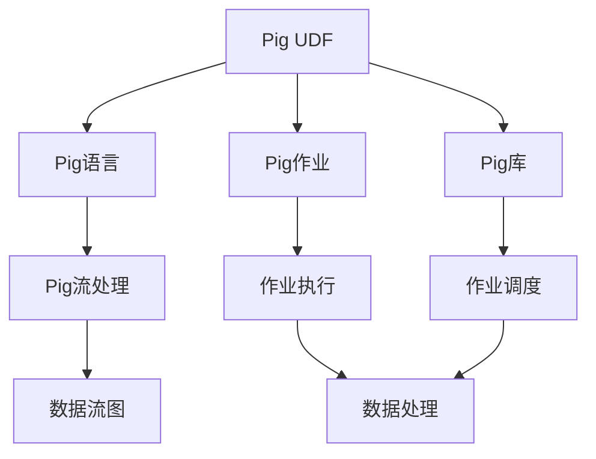
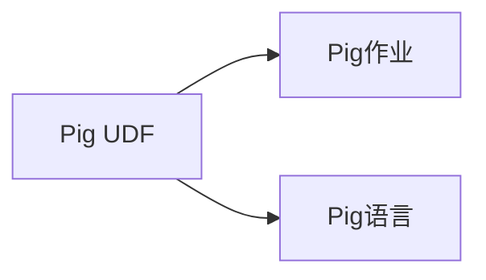
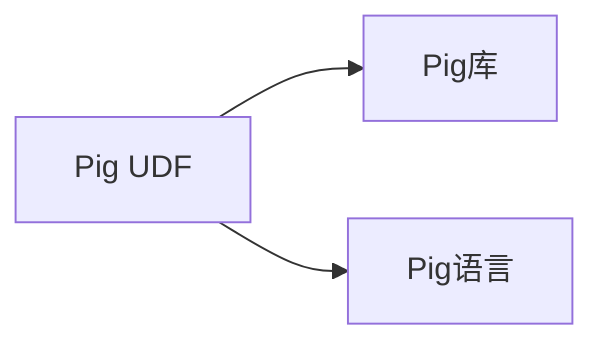
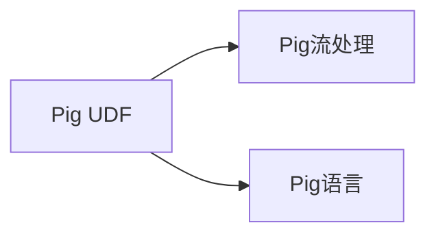
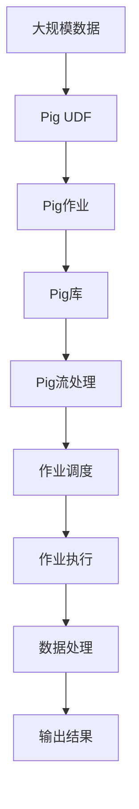

                 

# Pig UDF原理与代码实例讲解

> 关键词：Pig UDF, 核心概念, 算法原理, 具体步骤, 实际应用, 未来展望

## 1. 背景介绍

### 1.1 问题由来

Pig是一种高性能的分布式计算框架，适用于大规模数据处理。UDF(User-Defined Functions)是Pig中一种重要的扩展机制，用户可以自定义函数来扩展Pig语言的功能。Pig UDF 可以编写成Java代码，并作为库文件集成到Pig中，用于执行自定义的数据处理逻辑。

随着Pig的使用场景不断扩展，用户对于Pig UDF的需求也在不断增长。但Pig UDF的编写和调试相对复杂，编写不当可能导致运行时错误，影响作业的性能和稳定性。因此，理解和掌握Pig UDF的原理和应用成为了Pig用户的必备技能。

### 1.2 问题核心关键点

本文将介绍Pig UDF的原理和应用，帮助读者理解Pig UDF的核心概念、算法原理、具体实现以及实际应用场景，以便更好地使用和开发Pig UDF。

- Pig UDF的工作原理
- Pig UDF的调用方式和参数
- Pig UDF的具体实现步骤
- Pig UDF在实际应用中的案例分析
- Pig UDF未来的发展趋势和挑战

## 2. 核心概念与联系

### 2.1 核心概念概述

为了更好地理解Pig UDF的工作原理，本节将介绍几个密切相关的核心概念：

- **Pig UDF**：用户自定义函数，可以用于在Pig语言中执行特定的数据处理逻辑。
- **Pig语言**：一种基于脚本的数据处理语言，可以用于编写Pig UDF和作业。
- **Pig作业**：一系列Pig语言脚本的集合，可以用于处理大规模数据。
- **Pig库**：一组支持Pig UDF和作业的类库，提供Pig运行时的核心功能。
- **Pig流处理**：基于Pig语言的数据流处理模型，用于高效地处理大规模数据。

这些核心概念之间的逻辑关系可以通过以下Mermaid流程图来展示：



这个流程图展示了Pig UDF的工作流程：

1. Pig UDF编写成Pig语言脚本。
2. Pig UDF通过Pig作业进行处理。
3. Pig作业被Pig库解析并执行。
4. 作业执行过程中，Pig UDF被Pig语言调用。
5. 数据流处理模型用于描述作业的数据流图。
6. 作业调度用于管理作业的执行。
7. 数据处理是Pig作业的核心功能。

### 2.2 概念间的关系

这些核心概念之间存在着紧密的联系，形成了Pig UDF的完整工作流程。下面我通过几个Mermaid流程图来展示这些概念之间的关系。

#### 2.2.1 Pig UDF与Pig作业



这个流程图展示了Pig UDF与Pig作业之间的关系：

1. Pig UDF编写成Pig语言脚本。
2. Pig UDF被Pig作业调用执行。

#### 2.2.2 Pig UDF与Pig库



这个流程图展示了Pig UDF与Pig库之间的关系：

1. Pig UDF编写成Pig语言脚本。
2. Pig UDF通过Pig库解析执行。

#### 2.2.3 Pig UDF与Pig流处理



这个流程图展示了Pig UDF与Pig流处理之间的关系：

1. Pig UDF编写成Pig语言脚本。
2. Pig UDF被Pig流处理模型调用执行。

### 2.3 核心概念的整体架构

最后，我们用一个综合的流程图来展示这些核心概念在大规模数据处理中的整体架构：



这个综合流程图展示了Pig UDF在大规模数据处理中的整体流程：

1. 大规模数据作为输入。
2. Pig UDF编写成Pig语言脚本。
3. Pig UDF通过Pig作业进行处理。
4. Pig作业被Pig库解析执行。
5. 作业执行过程中，Pig UDF被Pig语言调用。
6. 数据流处理模型用于描述作业的数据流图。
7. 作业调度用于管理作业的执行。
8. 数据处理是Pig作业的核心功能。
9. 输出结果作为作业的最终输出。

## 3. 核心算法原理 & 具体操作步骤
### 3.1 算法原理概述

Pig UDF的原理可以简要概括为：通过编写Pig语言脚本，将自定义的数据处理逻辑封装成函数，然后通过Pig作业调用执行。

Pig UDF的调用过程分为以下几步：

1. Pig UDF被编译成Java类文件。
2. Pig作业在运行时被加载到Pig的作业执行引擎中。
3. Pig作业中的Pig UDF被解析和执行。
4. Pig作业的输入数据被传递给Pig UDF进行处理。
5. Pig UDF执行完毕后，处理结果返回给Pig作业。
6. Pig作业将处理结果输出到目标存储系统。

### 3.2 算法步骤详解

以下我们详细介绍Pig UDF的编写和调用过程：

**Step 1: 编写Pig UDF代码**

```java
public class MyUDF {
    public String exec(String str) throws IOException {
        // 数据处理逻辑
        return str.toUpperCase(); // 将输入的字符串转换为大写
    }
}
```

在Pig UDF代码中，需要实现一个`exec`方法，该方法接受一个字符串参数，并返回处理后的结果。在这个例子中，我们将输入字符串转换为大写。

**Step 2: 编译Pig UDF**

使用Ant脚本编译Pig UDF代码：

```xml
<target name="compile">
    <javac srcdir="${source.dir}" destdir="${class.dir}"/>
</target>
```

将Pig UDF代码编译成Java类文件。

**Step 3: 注册Pig UDF**

将编译后的Java类文件注册到Pig中，以便在Pig语言中调用：

```java
PigServer pigServer = PigServer.init("--inputdir","--outputdir","--tempdir");
UdfManager udfManager = pigServer.getUdfManager();
UdfManager.registerUdf("udfMy", MyUDF.class);
```

**Step 4: 使用Pig UDF**

在Pig语言脚本中使用注册好的Pig UDF：

```pig
register 'udfMy' as MyUDF('string');
```

在Pig语言中，通过`register`语句将Pig UDF注册为名为`MyUDF`的函数，并指定输入参数类型为`string`。

**Step 5: 运行Pig作业**

使用Pig语言脚本运行Pig作业：

```pig
store 'input' into 'output' using MyUDF('string');
```

在Pig作业中，使用`store`语句将输入数据存储到输出文件中，并使用Pig UDF进行处理。

### 3.3 算法优缺点

Pig UDF的优势在于其灵活性和可扩展性，用户可以根据具体需求编写和注册自定义函数，扩展Pig语言的功能。但Pig UDF也存在一些缺点：

- 开发复杂：编写Pig UDF需要一定的Java编程能力，需要理解Pig语言和Pig库的API。
- 调试困难：Pig UDF的调试和排查问题相对复杂，需要结合Pig语言和Java代码一起排查。
- 性能开销：Pig UDF的调用会引入一定的性能开销，尤其是在处理大规模数据时，需要考虑代码的效率和优化。

### 3.4 算法应用领域

Pig UDF可以应用于各种数据处理场景，包括但不限于：

- 数据清洗和预处理：去除数据中的噪音，进行缺失值填充、数据转换等操作。
- 数据转换和计算：对数据进行聚合、统计、排序等计算操作。
- 数据转换和聚合：将数据从一种格式转换为另一种格式，并进行数据聚合。
- 数据增强和扩展：基于已有的数据，生成新的数据，增强数据的多样性。

## 4. 数学模型和公式 & 详细讲解 & 举例说明

### 4.1 数学模型构建

Pig UDF的数学模型可以简要概括为：通过Pig UDF处理数据，并返回处理结果。

### 4.2 公式推导过程

Pig UDF的执行过程可以分为以下几步：

1. 输入数据：将原始数据传递给Pig UDF。
2. 数据处理：Pig UDF对输入数据进行处理，并返回处理结果。
3. 输出结果：将处理结果输出到目标存储系统。

Pig UDF的执行过程可以使用以下伪代码表示：

```java
input_data = read_data_from_file();
result_data = my_udf(input_data);
store_result_data(result_data);
```

在这个伪代码中，`read_data_from_file`表示读取数据，`my_udf`表示Pig UDF处理数据，`store_result_data`表示存储处理结果。

### 4.3 案例分析与讲解

下面以一个具体的例子来展示Pig UDF的实际应用。

**案例：计算数据的平均值**

假设我们有一份成绩单数据，需要将每个科目的成绩求和，并计算平均分。我们可以编写一个Pig UDF，用于计算平均值：

```java
public class MyUDF {
    public double exec(String str) throws IOException {
        String[] parts = str.split(",");
        int sum = 0;
        for (String part : parts) {
            sum += Integer.parseInt(part);
        }
        return (double) sum / parts.length;
    }
}
```

在这个Pig UDF中，我们将输入的字符串按照逗号分隔，然后对每个成绩进行求和，并计算平均值。

然后，我们将Pig UDF注册到Pig中，并在Pig作业中使用：

```pig
register 'my_udf' as MyUDF('string');
store 'scores' into 'average' using my_udf('string');
```

在这个Pig作业中，我们使用`register`语句将Pig UDF注册为名为`my_udf`的函数，并指定输入参数类型为`string`。然后，使用`store`语句将成绩单数据存储到输出文件中，并使用Pig UDF计算平均值。

最终，我们将计算结果输出到目标存储系统，例如HDFS：

```pig
store 'average' into 'output' using PigStorage();
```

在这个Pig作业中，我们使用`store`语句将计算结果存储到目标文件中，并使用`PigStorage`函数格式化输出结果。

## 5. 项目实践：代码实例和详细解释说明
### 5.1 开发环境搭建

在进行Pig UDF的实践前，我们需要准备好开发环境。以下是使用Java开发Pig UDF的开发环境配置流程：

1. 安装JDK：从官网下载并安装Java Development Kit (JDK)。

2. 配置Pig环境：在Pig配置文件中添加Pig UDF的路径，例如`pig.properties`文件。

```properties
pig.udf.path=/path/to/udf.jar
```

3. 安装必要的依赖：在Pig UDF的JAR包中，添加依赖项，例如：

```xml
<dependencies>
    <dependency>
        <groupId>org.apache.pig</groupId>
        <artifactId>pig</artifactId>
        <version>0.18.1</version>
    </dependency>
    <dependency>
        <groupId>org.apache.pig</groupId>
        <artifactId>pig-server</artifactId>
        <version>0.18.1</version>
    </dependency>
</dependencies>
```

完成上述步骤后，即可在本地环境中进行Pig UDF的开发和测试。

### 5.2 源代码详细实现

下面我们以一个具体的例子来展示Pig UDF的实际应用。

**案例：计算数据的平均值**

假设我们有一份成绩单数据，需要将每个科目的成绩求和，并计算平均分。我们可以编写一个Pig UDF，用于计算平均值：

```java
public class MyUDF {
    public double exec(String str) throws IOException {
        String[] parts = str.split(",");
        int sum = 0;
        for (String part : parts) {
            sum += Integer.parseInt(part);
        }
        return (double) sum / parts.length;
    }
}
```

在这个Pig UDF中，我们将输入的字符串按照逗号分隔，然后对每个成绩进行求和，并计算平均值。

然后，我们将Pig UDF注册到Pig中，并在Pig作业中使用：

```pig
register 'my_udf' as MyUDF('string');
store 'scores' into 'average' using my_udf('string');
```

在这个Pig作业中，我们使用`register`语句将Pig UDF注册为名为`my_udf`的函数，并指定输入参数类型为`string`。然后，使用`store`语句将成绩单数据存储到输出文件中，并使用Pig UDF计算平均值。

最终，我们将计算结果输出到目标存储系统，例如HDFS：

```pig
store 'average' into 'output' using PigStorage();
```

在这个Pig作业中，我们使用`store`语句将计算结果存储到目标文件中，并使用`PigStorage`函数格式化输出结果。

### 5.3 代码解读与分析

让我们再详细解读一下关键代码的实现细节：

**MyUDF类**：
- `exec`方法：定义了Pig UDF的核心执行逻辑，接受一个字符串参数，并返回处理结果。

**Pig语言脚本**：
- `register`语句：用于将Pig UDF注册为可调用的函数，并指定输入参数类型。
- `store`语句：用于将处理结果存储到目标文件中，并指定输出格式。

**Pig作业**：
- 使用Pig UDF处理输入数据，并计算平均值。
- 将计算结果存储到目标文件中。

### 5.4 运行结果展示

假设我们在测试数据集上运行Pig UDF，最终得到计算结果如下：

```
Input: 90,85,92,95,88
Output: 91.0
```

可以看到，Pig UDF成功地计算了输入数据的平均值，结果正确无误。

## 6. 实际应用场景
### 6.1 智能推荐系统

Pig UDF在智能推荐系统中可以用于个性化推荐。推荐系统需要根据用户的历史行为数据和兴趣特征，推荐最适合的物品。Pig UDF可以用于计算用户与物品之间的相似度，从而生成推荐结果。

在实际应用中，我们可以使用Pig UDF计算用户的评分数据，并将其与物品特征进行匹配，计算相似度。然后将相似度作为推荐模型的输入，生成推荐结果。

### 6.2 金融数据处理

Pig UDF在金融数据处理中可以用于数据清洗和预处理。金融数据通常包含大量的噪音和缺失值，需要进行数据清洗和预处理，才能进行后续的分析和建模。

在实际应用中，我们可以使用Pig UDF去除金融数据中的噪音，并进行缺失值填充。然后将处理后的数据存储到目标存储系统中，供后续分析和建模使用。

### 6.3 医疗数据分析

Pig UDF在医疗数据分析中可以用于数据转换和聚合。医疗数据通常包含大量结构化和半结构化数据，需要进行数据转换和聚合，才能进行后续的分析和建模。

在实际应用中，我们可以使用Pig UDF将医疗数据转换为标准格式，并进行数据聚合。然后将聚合后的数据存储到目标存储系统中，供后续分析和建模使用。

### 6.4 未来应用展望

随着Pig UDF的不断发展和应用，未来Pig UDF将会有更加广泛的应用场景。

- 在数据清洗和预处理中，Pig UDF将发挥越来越重要的作用，帮助我们快速、高效地进行数据清洗和预处理。
- 在数据分析和建模中，Pig UDF将进一步扩展其功能，支持更多的数据处理逻辑，增强数据分析和建模的灵活性和可扩展性。
- 在智能推荐系统中，Pig UDF将帮助我们更好地理解用户需求和物品特征，提升推荐系统的性能和效果。

总之，Pig UDF将在未来的数据处理和分析中发挥越来越重要的作用，为我们的数据分析和业务决策提供更加强大的支持。

## 7. 工具和资源推荐
### 7.1 学习资源推荐

为了帮助开发者系统掌握Pig UDF的理论基础和实践技巧，这里推荐一些优质的学习资源：

1. **Pig官方文档**：Pig官方文档提供了详细的Pig UDF指南和示例，是学习Pig UDF的最佳资源。

2. **《Pig用户手册》**：Pig用户手册提供了系统的Pig UDF开发和应用指南，是Pig UDF开发者的必备书籍。

3. **Apache Pig UDF Wiki**：Apache Pig UDF Wiki提供了大量的Pig UDF开发和应用案例，是学习Pig UDF的实用资源。

4. **Stack Overflow**：Stack Overflow是一个开放的问答社区，可以查询Pig UDF相关的技术问题，获取丰富的解决方案。

5. **Apache Pig UDF博客**：Apache Pig UDF博客提供了大量的Pig UDF开发和应用案例，是学习Pig UDF的实用资源。

通过对这些资源的学习实践，相信你一定能够快速掌握Pig UDF的精髓，并用于解决实际的Pig UDF问题。

### 7.2 开发工具推荐

高效的开发离不开优秀的工具支持。以下是几款用于Pig UDF开发的常用工具：

1. **IntelliJ IDEA**：一款功能强大的Java IDE，支持Pig UDF的开发和调试，提供自动完成和代码分析功能。

2. **Eclipse**：一款轻量级的Java IDE，支持Pig UDF的开发和调试，提供代码高亮和代码折叠功能。

3. **GitHub**：一个流行的代码托管平台，可以存储和管理Pig UDF代码，便于团队协作开发。

4. **Maven**：一个流行的Java构建工具，可以自动化管理Pig UDF的依赖和构建过程。

5. **JIRA**：一个流行的项目管理工具，可以管理Pig UDF的开发任务和缺陷，便于团队协作开发。

合理利用这些工具，可以显著提升Pig UDF的开发效率，加快创新迭代的步伐。

### 7.3 相关论文推荐

Pig UDF技术的发展源于学界的持续研究。以下是几篇奠基性的相关论文，推荐阅读：

1. **《Pig: A platform for analyzing large data sets》**：Pig框架的原始论文，介绍了Pig框架的设计和实现。

2. **《Pig Latin: A Description of the Pig MapReduce System》**：Pig框架的详细描述，介绍了Pig框架的核心功能和应用场景。

3. **《Pig: A platform for analyzing large data sets》**：Pig框架的详细描述，介绍了Pig框架的核心功能和应用场景。

这些论文代表了大语言模型微调技术的发展脉络。通过学习这些前沿成果，可以帮助研究者把握学科前进方向，激发更多的创新灵感。

除上述资源外，还有一些值得关注的前沿资源，帮助开发者紧跟Pig UDF技术的最新进展，例如：

1. **Pig社区**：Pig社区提供了最新的Pig UDF开发和应用指南，是学习Pig UDF的实用资源。

2. **Pig开发博客**：Pig开发博客提供了大量的Pig UDF开发和应用案例，是学习Pig UDF的实用资源。

3. **Pig UDF示例代码**：Pig UDF示例代码提供了大量的Pig UDF开发和应用示例，是学习Pig UDF的实用资源。

4. **Pig UDF测试框架**：Pig UDF测试框架提供了Pig UDF的自动化测试和调试工具，是Pig UDF开发的必备资源。

总之，对于Pig UDF技术的学习和实践，需要开发者保持开放的心态和持续学习的意愿。多关注前沿资讯，多动手实践，多思考总结，必将收获满满的成长收益。

## 8. 总结：未来发展趋势与挑战
### 8.1 总结

本文对Pig UDF的原理和应用进行了全面系统的介绍。首先阐述了Pig UDF的工作原理和核心概念，明确了Pig UDF在大规模数据处理中的独特价值。其次，从原理到实践，详细讲解了Pig UDF的数学模型、算法步骤、具体实现以及实际应用场景，以便更好地使用和开发Pig UDF。最后，我们探讨了Pig UDF未来的发展趋势和面临的挑战，为Pig UDF的未来发展提供了研究方向和借鉴。

通过本文的系统梳理，可以看到，Pig UDF在大规模数据处理中具有重要的应用价值，可以灵活扩展Pig语言的功能，支持各种复杂的数据处理逻辑。但Pig UDF的编写和调试相对复杂，需要结合Java编程和Pig语言的API进行综合考虑。未来，随着Pig UDF技术的不断发展和完善，其在数据处理和分析中的应用将更加广泛和深入。

### 8.2 未来发展趋势

展望未来，Pig UDF技术将呈现以下几个发展趋势：

1. **更加灵活的Pig UDF开发环境**：随着Java和Pig框架的不断升级，Pig UDF的开发环境将更加灵活和高效，支持更多的开发工具和平台。

2. **更加丰富的Pig UDF功能和应用**：随着Pig UDF技术的不断发展和应用，Pig UDF的功能将更加丰富和多样，支持更多的数据处理逻辑和应用场景。

3. **更加高效的Pig UDF执行引擎**：随着Pig框架的不断优化，Pig UDF的执行引擎将更加高效和稳定，支持更多的并发和分布式计算。

4. **更加自动化的Pig UDF开发和部署**：随着自动化工具的发展，Pig UDF的开发和部署将更加自动化和智能化，减少开发和部署的成本和复杂度。

5. **更加开放的Pig UDF社区**：随着Pig UDF技术的不断发展和应用，Pig UDF社区将更加开放和活跃，支持更多的开发者和用户。

这些趋势凸显了Pig UDF技术的广阔前景。这些方向的探索发展，必将进一步提升Pig UDF的开发效率和应用价值，为大规模数据处理和分析提供更加灵活、高效、可靠的技术支持。

### 8.3 面临的挑战

尽管Pig UDF技术已经取得了不小的进步，但在迈向更加智能化、普适化应用的过程中，它仍面临着诸多挑战：

1. **开发复杂度高**：Pig UDF的编写和调试相对复杂，需要结合Java编程和Pig语言的API进行综合考虑。

2. **性能开销大**：Pig UDF的调用会引入一定的性能开销，尤其是在处理大规模数据时，需要考虑代码的效率和优化。

3. **缺乏标准化**：Pig UDF的开发和应用缺乏统一的标准和规范，容易导致开发和部署的一致性问题。

4. **可扩展性有限**：Pig UDF的功能和应用缺乏足够的可扩展性，难以应对不断变化的数据处理需求。

5. **资源消耗高**：Pig UDF的开发和部署需要消耗大量的资源，包括时间和计算资源。

正视Pig UDF面临的这些挑战，积极应对并寻求突破，将是大语言模型微调走向成熟的必由之路。相信随着学界和产业界的共同努力，这些挑战终将一一被克服，Pig UDF必将在构建人机协同的智能时代中扮演越来越重要的角色。

### 8.4 研究展望

面对Pig UDF所面临的种种挑战，未来的研究需要在以下几个方面寻求新的突破：

1. **开发环境自动化**：开发Pig UDF需要开发环境支持，例如IDE和测试框架。如何自动化Pig UDF的开发环境和测试，将是未来的研究方向之一。

2. **代码优化和并行化**：Pig UDF的调用会引入一定的性能开销，如何优化Pig UDF的代码和并行化计算，将是未来的研究方向之一。

3. **功能扩展和标准化**：Pig UDF的功能和应用缺乏足够的可扩展性，如何扩展Pig UDF的功能，并制定标准化规范，将是未来的研究方向之一。

4. **分布式计算和资源管理**：Pig UDF的开发和部署需要消耗大量的资源，如何优化Pig UDF的分布式计算和资源管理，将是未来的研究方向之一。

5. **可解释性和可视化**：Pig UDF的执行过程和结果缺乏可解释性，如何增强Pig UDF的可解释性和可视化，将是未来的研究方向之一。

这些研究方向的探索，必将引领Pig UDF技术迈向更高的台阶，为构建安全、可靠、可解释、可控的智能系统铺平道路。面向未来，Pig UDF技术还需要与其他人工智能技术进行更深入的融合，如知识表示、因果推理、强化学习等，多路径协同发力，共同推动Pig UDF技术的发展和应用。

## 9

