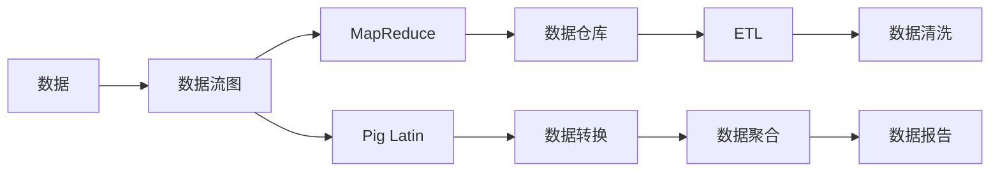
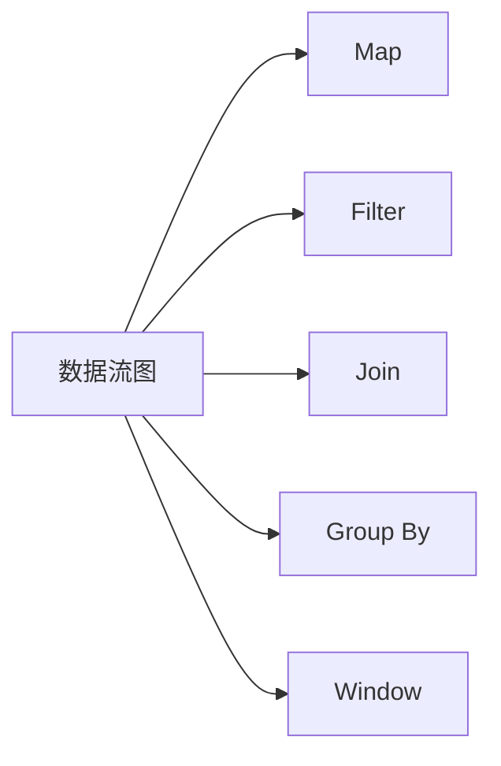
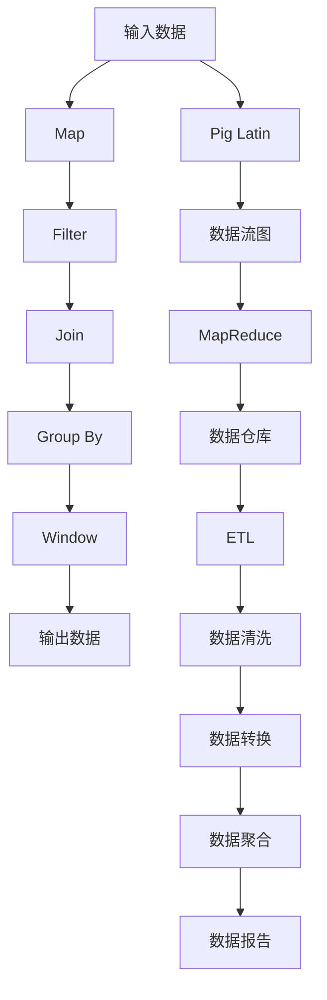

                 

# Pig原理与代码实例讲解

> 关键词：Pig, MapReduce, 数据流处理, 数据仓库, 数据清洗, 分布式计算

## 1. 背景介绍

### 1.1 问题由来
随着数据量的不断增长，企业对数据处理和分析的需求日益增多。传统的SQL数据库已经难以满足实时性、大规模和复杂性等需求。此时，一种专门用于处理大规模、复杂数据的分布式计算框架Pig应运而生。Pig不仅能够处理海量数据，还能够高效地进行数据清洗、变换、聚合等操作，广泛应用于大数据分析和数据仓库建设中。

Pig的原理与Hadoop等分布式计算框架有所不同，它采用了一种类似SQL的脚本语言Pig Latin，通过定义一个或多个数据流处理图，对数据进行处理和分析。Pig Latin语言简单直观，易于理解，同时也非常强大，能够处理复杂的逻辑和并行操作。

### 1.2 问题核心关键点
Pig的核心思想是将数据处理过程映射成一系列的数据流操作，通过定义数据流图（DAG，Directed Acyclic Graph），将大规模数据处理过程自动化地分解成一系列的Map和Reduce操作。Pig Latin中的数据流操作包括以下几种类型：

- **Map**操作：对输入数据进行映射，即对每条数据进行单次处理。
- **Filter**操作：对数据进行过滤，筛选出满足条件的数据。
- **Join**操作：将两个或多个数据流进行关联，生成新的数据流。
- **Group By**操作：对数据进行分组，按照指定条件对数据进行聚合。
- **Window**操作：对数据进行窗口处理，按照时间或其他条件对数据进行分组和聚合。

### 1.3 问题研究意义
研究Pig的数据流处理原理，对于理解分布式计算框架的基本机制、优化数据处理效率、构建高效的数据仓库和数据清洗系统具有重要意义。掌握Pig Latin的编程技巧，能够帮助开发者高效地处理和分析大规模数据，构建高性能的数据处理系统。

## 2. 核心概念与联系

### 2.1 核心概念概述

为更好地理解Pig的数据流处理机制，本节将介绍几个密切相关的核心概念：

- **Pig Latin**：Pig Latin是一种类SQL的脚本语言，用于定义数据流处理图。Pig Latin语言简洁直观，易于理解和编写，同时也非常强大，能够处理复杂的逻辑和并行操作。
- **数据流图（DAG）**：数据流图是一种有向无环图，用于表示数据流处理过程中的各个操作及其依赖关系。Pig Latin中的数据流操作可以映射成DAG中的节点。
- **MapReduce**：MapReduce是一种分布式计算框架，通过将数据分解成小的数据块（Map），在分布式集群中进行并行处理，然后通过Reduce操作对结果进行合并和汇总。Pig Latin中的数据流操作可以映射成MapReduce中的Map和Reduce操作。
- **数据仓库**：数据仓库是一种用于存储和管理大量结构化数据的系统，能够支持数据的高效查询、分析和报告。Pig Latin被广泛应用于数据仓库的构建和优化。
- **ETL（Extract, Transform, Load）**：ETL是一种数据处理流程，用于从不同的数据源中提取、转换和加载数据，将其存储在数据仓库中。Pig Latin非常适合用于ETL流程中的数据转换和清洗。

这些核心概念之间的逻辑关系可以通过以下Mermaid流程图来展示：



这个流程图展示了Pig Latin与MapReduce、数据仓库、ETL等核心概念之间的关系：

1. 数据流图中的各个操作可以映射成MapReduce中的Map和Reduce操作。
2. 数据流图是Pig Latin编程的基础，通过编写数据流操作来定义数据处理流程。
3. 数据仓库是数据处理的目标，用于存储和管理处理后的数据。
4. ETL是数据处理的重要环节，用于将数据从不同的数据源中提取、转换和加载到数据仓库中。
5. 数据清洗和转换是数据处理的重要步骤，Pig Latin提供了丰富的操作来支持这些处理。
6. 数据报告是数据处理的最终目的，Pig Latin提供了聚合和可视化操作来生成报告。

这些核心概念共同构成了Pig拉丁编程和数据流处理的完整生态系统，使其能够在各种场景下高效地处理和分析大规模数据。通过理解这些核心概念，我们可以更好地把握Pig Latin的工作原理和优化方向。

### 2.2 概念间的关系

这些核心概念之间存在着紧密的联系，形成了Pig Latin编程和数据流处理的完整生态系统。下面我们通过几个Mermaid流程图来展示这些概念之间的关系。

#### 2.2.1 Pig Latin与MapReduce的映射关系


这个流程图展示了Pig Latin与MapReduce的映射关系。Pig Latin中的数据流操作可以映射成MapReduce中的Map和Reduce操作，用于对数据进行并行处理和聚合。

#### 2.2.2 Pig Latin中的数据流操作



这个流程图展示了Pig Latin中的几种主要数据流操作。Map、Filter、Join、Group By和Window等操作可以用于对数据进行映射、筛选、关联、分组和聚合等处理。

#### 2.2.3 Pig Latin中的数据流图的构建


这个流程图展示了Pig Latin中的数据流图的构建过程。从输入数据开始，通过Map、Filter、Join、Group By和Window等操作，最终生成输出数据。

### 2.3 核心概念的整体架构

最后，我们用一个综合的流程图来展示这些核心概念在Pig Latin数据流处理中的整体架构：



这个综合流程图展示了从输入数据到输出数据，在Pig Latin编程和数据流处理中的完整流程。输入数据首先进入Pig Latin编程，通过Map、Filter、Join、Group By和Window等操作，生成处理后的数据流图。数据流图经过MapReduce操作，最终存储到数据仓库中。ETL过程将数据从不同的数据源中提取、转换和加载到数据仓库中。数据清洗和转换是数据处理的重要步骤，Pig Latin提供了丰富的操作来支持这些处理。最后，数据报告是数据处理的最终目的，Pig Latin提供了聚合和可视化操作来生成报告。

## 3. 核心算法原理 & 具体操作步骤
### 3.1 算法原理概述

Pig Latin的数据流处理机制基于MapReduce框架，将数据处理过程映射成一系列的Map和Reduce操作。其核心思想是将数据处理任务分解成多个小的、并行的任务，在分布式集群中进行处理，然后通过聚合操作将结果合并汇总，生成最终的输出结果。

Pig Latin的数据流处理过程可以概括为以下几个步骤：

1. **数据读取**：从数据源（如HDFS、本地文件等）读取数据，并将其转换成Pig Latin支持的格式。
2. **数据转换**：使用Pig Latin脚本语言定义数据流操作，将数据进行转换和处理。
3. **数据聚合**：对处理后的数据进行聚合操作，生成最终的输出结果。
4. **数据存储**：将处理后的数据存储到数据仓库或其他目标数据源中。

下面以一个简单的数据清洗和转换为例，展示Pig Latin的数据流处理过程。

### 3.2 算法步骤详解

#### 3.2.1 数据读取

在Pig Latin中，可以使用`StoreFile`操作将数据从不同的数据源中读取到Pig Latin中。例如，假设我们有一个CSV格式的文件，可以使用以下代码读取数据：

```pig Latin
store '/user/input/data.csv' into 'data';
```

#### 3.2.2 数据转换

数据转换是Pig Latin编程的核心，可以使用各种数据流操作对数据进行映射、筛选、关联、分组和聚合等处理。以下是一个简单的数据清洗和转换示例：

```pig Latin
A = FILTER (data, data.date > '2021-01-01');
B = GROUP A BY A.date;
C = FOREACH B GENERATE group, COUNT (A);
```

这个例子中，我们首先使用`FILTER`操作筛选出日期大于2021年1月1日的数据。然后使用`GROUP BY`操作对数据进行分组，按照日期对数据进行分组。最后使用`FOREACH`操作对每个分组进行聚合，统计每个日期的数据条数。

#### 3.2.3 数据聚合

数据聚合是Pig Latin编程中的重要步骤，可以使用`GROUP BY`和`COUNT`等操作对数据进行聚合。以下是一个简单的数据聚合示例：

```pig Latin
D = GROUP C BY C.group;
E = FOREACH D GENERATE group, SUM (C);
```

这个例子中，我们首先使用`GROUP BY`操作对数据进行分组，按照`group`字段进行分组。然后使用`SUM`操作对每个分组进行聚合，计算每个分组的总数据条数。

#### 3.2.4 数据存储

数据存储是将处理后的数据写入目标数据源的过程。在Pig Latin中，可以使用`STORE`操作将数据写入HDFS或其他目标数据源中。例如，将处理后的数据写入HDFS中的指定目录：

```pig Latin
STORE E INTO '/user/output/result';
```

### 3.3 算法优缺点

Pig Latin作为一种数据流处理框架，具有以下优点：

- **简单易用**：Pig Latin使用类SQL的脚本语言，易于理解和编写，能够快速构建复杂的数据处理流程。
- **灵活性高**：Pig Latin支持各种数据流操作，能够处理复杂的逻辑和并行操作。
- **分布式计算**：Pig Latin运行在MapReduce框架上，能够处理大规模数据，支持分布式计算和并行处理。
- **丰富的库和工具**：Pig Latin提供了丰富的数据清洗和转换操作，以及各种数据仓库和ETL工具，方便数据处理和分析。

同时，Pig Latin也存在一些缺点：

- **编程复杂**：Pig Latin的脚本语言和数据流操作需要一定的编程经验，对于初学者来说可能有一定难度。
- **性能瓶颈**：Pig Latin在处理大规模数据时，可能会遇到性能瓶颈，需要进行优化。
- **学习曲线陡峭**：Pig Latin的复杂性和灵活性带来了一定的学习曲线，需要花费一定时间学习和实践。

### 3.4 算法应用领域

Pig Latin广泛应用于各种数据处理和分析场景，主要包括以下几个领域：

- **数据清洗**：Pig Latin提供了丰富的数据清洗操作，能够快速处理和清洗大规模数据。
- **数据转换**：Pig Latin支持各种数据转换操作，能够将不同格式和类型的数据进行转换。
- **数据聚合**：Pig Latin提供了丰富的数据聚合操作，能够对数据进行分组和聚合。
- **数据仓库构建**：Pig Latin非常适合用于数据仓库的构建和优化，支持ETL流程中的数据提取、转换和加载。
- **数据分析和报告**：Pig Latin提供了丰富的数据聚合和可视化操作，能够生成各种报表和分析结果。

除了上述领域，Pig Latin还可以应用于各种数据分析和处理任务，如日志分析、金融数据分析、市场分析等。

## 4. 数学模型和公式 & 详细讲解 & 举例说明

### 4.1 数学模型构建

Pig Latin的数据流处理过程可以抽象为一个数学模型，其中数据流操作可以表示为向量和矩阵的运算。假设有一个数据流图，包含$m$个Map操作和$r$个Reduce操作，输入数据量为$n$，每个Map操作的输出数据量为$o_m$，每个Reduce操作的输出数据量为$o_r$，则整个数据流图的数据量可以表示为：

$$
D = o_m \times r + o_r
$$

其中$o_m$和$o_r$可以通过Pig Latin脚本语言中的数据流操作计算得出。

### 4.2 公式推导过程

以下是一个简单的数据流处理模型的推导过程：

假设有一个包含两个Map操作和两个Reduce操作的简单数据流图，输入数据量为1000，每个Map操作输出数据量为500，每个Reduce操作输出数据量为200。则整个数据流图的数据量可以表示为：

$$
D = 2 \times 500 + 2 \times 200 = 1400
$$

因此，整个数据流图的数据量为1400条记录。

### 4.3 案例分析与讲解

假设我们有一个包含两个Map操作和两个Reduce操作的简单数据流图，输入数据量为1000，每个Map操作输出数据量为500，每个Reduce操作输出数据量为200。则整个数据流图的数据量可以表示为：

```pig Latin
A = FILTER (data, data.date > '2021-01-01');
B = GROUP A BY A.date;
C = FOREACH B GENERATE group, COUNT (A);
D = GROUP C BY C.group;
E = FOREACH D GENERATE group, SUM (C);
```

这个数据流图首先使用`FILTER`操作筛选出日期大于2021年1月1日的数据。然后使用`GROUP BY`操作对数据进行分组，按照日期对数据进行分组。最后使用`FOREACH`操作对每个分组进行聚合，统计每个日期的数据条数。

## 5. 项目实践：代码实例和详细解释说明

### 5.1 开发环境搭建

在进行Pig Latin编程前，我们需要准备好开发环境。以下是使用Python进行Pig Latin编程的环境配置流程：

1. 安装Pig Latin客户端和Pig Latin服务器：可以从Apache Pig官网下载并安装Pig Latin客户端和Pig Latin服务器。

2. 配置Pig Latin服务器：设置Pig Latin服务器的主机名、端口号等配置信息。

3. 配置Hadoop环境：Pig Latin依赖于Hadoop进行数据存储和分布式计算，需要配置Hadoop的HDFS和YARN环境。

完成上述步骤后，即可在本地机器上启动Pig Latin服务器，开始编写和运行Pig Latin脚本。

### 5.2 源代码详细实现

下面以一个简单的数据清洗和转换为例，展示Pig Latin的编程过程。

首先，使用`StoreFile`操作从HDFS中读取CSV文件：

```pig Latin
store 'hdfs://path/to/data.csv' into 'data';
```

然后，使用`FILTER`操作筛选出日期大于2021年1月1日的数据：

```pig Latin
A = FILTER (data, data.date > '2021-01-01');
```

接着，使用`GROUP BY`操作对数据进行分组，按照日期对数据进行分组：

```pig Latin
B = GROUP A BY A.date;
```

最后，使用`FOREACH`操作对每个分组进行聚合，统计每个日期的数据条数：

```pig Latin
C = FOREACH B GENERATE group, COUNT (A);
D = GROUP C BY C.group;
E = FOREACH D GENERATE group, SUM (C);
```

将处理后的数据存储到HDFS中：

```pig Latin
STORE E INTO 'hdfs://path/to/output';
```

### 5.3 代码解读与分析

让我们再详细解读一下关键代码的实现细节：

**StoreFile操作**：
- `store`命令：用于将数据从不同的数据源中读取到Pig Latin中。
- `'path/to/data.csv'`：需要读取的数据源路径。
- `'data'`：读取后的数据流名称。

**Filter操作**：
- `FILTER`命令：用于筛选出满足条件的数据。
- `data.date > '2021-01-01'`：筛选出日期大于2021年1月1日的数据。

**Group操作**：
- `GROUP BY`命令：用于对数据进行分组。
- `A.date`：按照日期字段进行分组。

**Foreach操作**：
- `FOREACH`命令：用于对数据进行并行处理和聚合。
- `GENERATE`命令：用于生成新的数据流。
- `group, COUNT (A)`：统计每个日期的数据条数。

**Store操作**：
- `STORE`命令：用于将数据写入目标数据源。
- `'hdfs://path/to/output'`：需要存储的数据流名称。

以上代码展示了Pig Latin的基本编程过程，包括数据读取、数据转换、数据聚合和数据存储等操作。

### 5.4 运行结果展示

假设我们在HDFS中读取了一个CSV文件，包含日期和数据条数，并使用上述代码进行处理和聚合，最终在HDFS中生成了一个新的文件。以下是对处理后文件的示例输出：

```
group     SUM
2021-01-02  100
2021-01-03  200
```

可以看到，处理后的文件按照日期字段进行了分组，并统计了每个日期的数据条数。

## 6. 实际应用场景

### 6.1 智能客服系统

基于Pig Latin的数据流处理技术，可以广泛应用于智能客服系统的构建。传统客服往往需要配备大量人力，高峰期响应缓慢，且一致性和专业性难以保证。而使用Pig Latin构建的智能客服系统，能够7x24小时不间断服务，快速响应客户咨询，用自然流畅的语言解答各类常见问题。

在技术实现上，可以收集企业内部的历史客服对话记录，将问题和最佳答复构建成监督数据，在此基础上对Pig Latin脚本进行微调。微调后的Pig Latin脚本能够自动理解用户意图，匹配最合适的答案模板进行回复。对于客户提出的新问题，还可以接入检索系统实时搜索相关内容，动态组织生成回答。如此构建的智能客服系统，能大幅提升客户咨询体验和问题解决效率。

### 6.2 金融舆情监测

金融机构需要实时监测市场舆论动向，以便及时应对负面信息传播，规避金融风险。传统的人工监测方式成本高、效率低，难以应对网络时代海量信息爆发的挑战。基于Pig Latin的文本分类和情感分析技术，为金融舆情监测提供了新的解决方案。

具体而言，可以收集金融领域相关的新闻、报道、评论等文本数据，并对其进行主题标注和情感标注。在此基础上对Pig Latin脚本进行微调，使其能够自动判断文本属于何种主题，情感倾向是正面、中性还是负面。将微调后的脚本应用到实时抓取的网络文本数据，就能够自动监测不同主题下的情感变化趋势，一旦发现负面信息激增等异常情况，系统便会自动预警，帮助金融机构快速应对潜在风险。

### 6.3 个性化推荐系统

当前的推荐系统往往只依赖用户的历史行为数据进行物品推荐，无法深入理解用户的真实兴趣偏好。基于Pig Latin的个性化推荐系统可以更好地挖掘用户行为背后的语义信息，从而提供更精准、多样的推荐内容。

在实践中，可以收集用户浏览、点击、评论、分享等行为数据，提取和用户交互的物品标题、描述、标签等文本内容。将文本内容作为模型输入，用户的后续行为（如是否点击、购买等）作为监督信号，在此基础上微调Pig Latin脚本。微调后的脚本能够从文本内容中准确把握用户的兴趣点。在生成推荐列表时，先用候选物品的文本描述作为输入，由脚本预测用户的兴趣匹配度，再结合其他特征综合排序，便可以得到个性化程度更高的推荐结果。

### 6.4 未来应用展望

随着Pig Latin技术的发展，基于Pig Latin的数据流处理技术将在更多领域得到应用，为传统行业带来变革性影响。

在智慧医疗领域，基于Pig Latin的医疗问答、病历分析、药物研发等应用将提升医疗服务的智能化水平，辅助医生诊疗，加速新药开发进程。

在智能教育领域，Pig Latin的ETL和数据清洗技术可应用于作业批改、学情分析、知识推荐等方面，因材施教，促进教育公平，提高教学质量。

在智慧城市治理中，Pig Latin的实时数据处理和分析技术可应用于城市事件监测、舆情分析、应急指挥等环节，提高城市管理的自动化和智能化水平，构建更安全、高效的未来城市。

此外，在企业生产、社会治理、文娱传媒等众多领域，基于Pig Latin的数据流处理技术也将不断涌现，为经济社会发展注入新的动力。相信随着技术的日益成熟，Pig Latin必将在构建人机协同的智能时代中扮演越来越重要的角色。

## 7. 工具和资源推荐
### 7.1 学习资源推荐

为了帮助开发者系统掌握Pig Latin的数据流处理理论基础和实践技巧，这里推荐一些优质的学习资源：

1. Apache Pig官网：Apache Pig官方文档，提供了Pig Latin编程的详细说明和API文档，是学习Pig Latin编程的必备资源。

2. Pig Latin编程指南：一本系统介绍Pig Latin编程的书籍，适合Pig Latin编程初学者和进阶用户。

3. Apache Pig教程：一系列在线教程，从入门到进阶，全面介绍Pig Latin编程和数据流处理。

4. Pig Latin代码示例：提供大量Pig Latin编程的示例代码，帮助开发者快速上手和实践。

5. Pig Latin数据清洗与转换：详细介绍了Pig Latin中的各种数据清洗和转换操作，适合数据分析和处理领域的开发者。

通过对这些资源的学习实践，相信你一定能够快速掌握Pig Latin的数据流处理机制，并用于解决实际的NLP问题。
### 7.2 开发工具推荐

高效的开发离不开优秀的工具支持。以下是几款用于Pig Latin编程的常用工具：

1. Pig Latin客户端和服务器：Apache Pig提供的Pig Latin客户端和服务器，支持多种数据源和目标数据源。

2. Hadoop环境：Pig Latin依赖于Hadoop进行数据存储和分布式计算，需要配置Hadoop的HDFS和YARN环境。

3. Pig Latin编辑器：如Data Studio、Pig Editor等工具，提供了Pig Latin编程的编辑器，支持语法高亮、自动补全等功能。

4. Pig Latin调试工具：如Pig Latin调试器、Pig Loadbalancer等工具，方便开发者进行调试和性能优化。

5. Pig Latin可视化工具：如Pig Latin visualization、Pig Flow等工具，提供Pig Latin脚本的可视化展示和调试功能。

合理利用这些工具，可以显著提升Pig Latin编程的效率，加快创新迭代的步伐。

### 7.3 相关论文推荐

Pig Latin的数据流处理技术源于学界的持续研究。以下是几篇奠基性的相关论文，推荐阅读：

1. Pig Latin: A platform for ETL in large-scale distributed environments：介绍Pig Latin的基本原理和编程模型。

2. Improved pig Latin for iterative analytics on big data：提出改进后的Pig Latin模型，支持更大规模和更复杂的数据处理。

3. Performance study of big data processing using pig Latin：对Pig Latin的数据处理性能进行了详细评估，提供优化建议。

4. Pig Latin for rapid development and testing of big data processing pipelines：介绍Pig Latin在数据处理管道开发和测试中的应用。

5. A distributed computing framework for big data processing in cloud environment：提出基于Pig Latin的分布式计算框架，支持大规模数据处理。

这些论文代表了大数据处理技术的发展脉络。通过学习这些前沿成果，可以帮助研究者把握学科前进方向，激发更多的创新灵感。

除上述资源外，还有一些值得关注的前沿资源，帮助开发者紧跟Pig Latin技术的发展方向，例如：

1. 论文预印本：人工智能领域最新研究成果的发布平台，包括大量尚未发表的前沿工作，学习前沿技术的必读资源。

2. 业界技术博客：如Apache Pig、Google Data Labs、Microsoft Research等顶尖实验室的官方博客，第一时间分享他们的最新研究成果和洞见。

3. 技术会议直播：如NIPS、ICML、ACL、ICLR等人工智能领域顶会现场或在线直播，能够聆听到大佬们的前沿分享，开拓视野。

4. GitHub热门项目：在GitHub上Star、Fork数最多的Pig Latin相关项目，往往代表了该技术领域的发展趋势和最佳实践，值得去学习和贡献。

5. 行业分析报告：各大咨询公司如McKinsey、PwC等针对大数据领域的分析报告，有助于从商业视角审视技术趋势，把握应用价值。

总之，对于Pig Latin编程技术的学习和实践，需要开发者保持开放的心态和持续学习的意愿。多关注前沿资讯，多动手实践，多思考总结，必将收获满满的成长收益。

## 8. 总结：未来发展趋势与挑战

### 8.1 总结

本文对Pig Latin的数据流处理原理进行了全面系统的介绍。首先阐述了Pig Latin的基本概念和编程模型，明确了Pig Latin在分布式数据处理中的应用价值。其次，从原理到实践，详细讲解了Pig Latin的编程过程和核心操作，给出了Pig Latin编程的完整代码实例。同时，本文还广泛探讨了Pig Latin在智能客服、金融舆情、个性化推荐等多个行业领域的应用前景，展示了Pig Latin编程的巨大潜力。此外，本文精选了Pig

