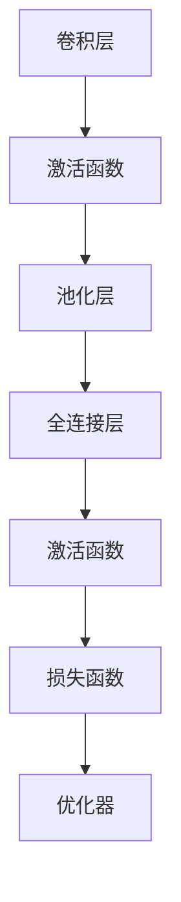
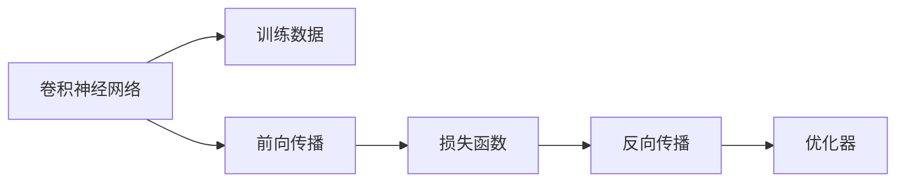
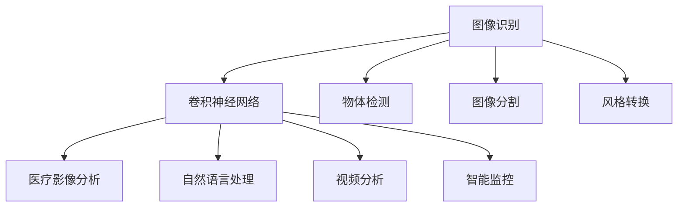
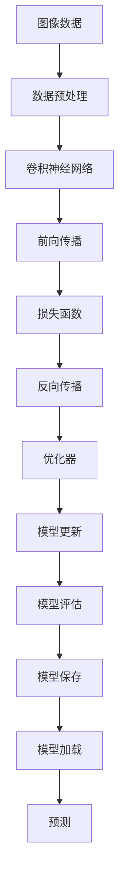

                 

# Python深度学习实践：构建深度卷积网络识别图像

> 关键词：深度卷积网络,卷积神经网络,图像识别,图像分类,图像处理,Python,深度学习框架,TensorFlow,Keras

## 1. 背景介绍

### 1.1 问题由来
图像识别是人工智能领域的重要研究方向，具有广泛的应用前景。从自动驾驶、医学影像分析到智能监控、工业检测，图像识别技术已经成为诸多行业不可或缺的工具。传统的图像识别方法依赖于手工设计的特征提取和分类算法，存在计算复杂度高、可解释性差等缺点。而深度学习尤其是卷积神经网络(Convolutional Neural Network, CNN)的提出，大大改进了图像识别的效果。

卷积神经网络通过卷积层、池化层、全连接层等模块，可以自动学习到图像中的特征，并在特征表示的基础上进行分类或回归等任务。相比于传统的机器学习方法，CNN具有以下优点：
- 特征提取自动化：CNN可以自动提取图像中的纹理、边缘、形状等特征，无需人工设计。
- 参数共享：CNN中的卷积核可以在多个位置共享，大大减少了需要训练的参数数量，提高了模型的效率。
- 平移不变性：由于卷积操作的平移不变性，CNN能够对图像进行平移、旋转、缩放等变换后仍具有识别能力。

卷积神经网络的这些特性，使其在图像识别、语音识别、自然语言处理等领域取得了卓越的性能。本文将详细讲解如何利用Python和深度学习框架TensorFlow或Keras，构建和训练一个基于卷积神经网络的图像识别模型。

### 1.2 问题核心关键点
构建CNN模型的关键点包括：
- 选择合适的深度学习框架。TensorFlow和Keras是当前最流行的深度学习框架，均支持Python开发。
- 设计卷积网络的结构。网络结构的选择直接影响了模型的识别精度和训练速度。
- 选择合适的损失函数和优化器。常用的损失函数包括交叉熵损失、均方误差损失等，优化器包括Adam、SGD等。
- 训练数据的准备。数据集的质量和规模对模型性能有着至关重要的影响。
- 模型的评估与调优。通过验证集和测试集对模型进行评估，并根据评估结果进行调整。

本文将重点介绍如何使用Python和TensorFlow/Keras构建卷积神经网络，并结合实际案例讲解训练和调优过程。

### 1.3 问题研究意义
掌握卷积神经网络的设计和训练方法，对于拓展深度学习的应用范围，提升图像识别、物体检测等任务的性能，加速相关领域的技术产业化进程，具有重要意义：
- 降低开发成本。利用成熟的深度学习框架和预训练模型，可以快速搭建和训练图像识别系统。
- 提高识别精度。卷积神经网络可以自动学习图像中的高级特征，有助于提升模型的识别能力。
- 加快研发进度。深度学习技术为图像处理任务提供了强大的工具，能够加速新产品的研发。
- 促进技术创新。卷积神经网络技术推动了图像识别领域的创新，催生了图像风格转换、物体分割等前沿技术。
- 赋能行业升级。深度学习技术被广泛应用于工业检测、医学影像分析等垂直行业，推动了产业升级。

## 2. 核心概念与联系

### 2.1 核心概念概述

为更好地理解卷积神经网络的构建和训练方法，本节将介绍几个密切相关的核心概念：

- 卷积神经网络(Convolutional Neural Network, CNN)：一种专门用于图像识别、计算机视觉等领域的深度学习模型。通过多层卷积、池化等操作，提取图像的特征，并将其映射到不同的类别。

- 卷积层(Convolutional Layer)：卷积神经网络的核心组件，通过滑动卷积核对输入图像进行卷积操作，提取局部特征。卷积层通常包含若干个卷积核，每个卷积核可以提取一种特定模式的特征。

- 池化层(Pooling Layer)：用于降低卷积层输出的特征图大小，并保留关键特征。常用的池化操作包括最大池化和平均池化。

- 全连接层(Fully Connected Layer)：将卷积层输出的特征图展平，输入到全连接层中进行分类或回归。全连接层可以看作是一个大型线性分类器。

- 激活函数(Activation Function)：引入非线性变换，增强网络的表达能力。常用的激活函数包括ReLU、Sigmoid等。

- 损失函数(Loss Function)：衡量模型预测与真实标签之间的差距。常用的损失函数包括交叉熵损失、均方误差损失等。

- 优化器(Optimizer)：用于更新模型参数，最小化损失函数。常用的优化器包括Adam、SGD等。

这些核心概念之间存在着紧密的联系，形成了卷积神经网络的学习和应用框架。通过理解这些核心概念，我们可以更好地把握卷积神经网络的工作原理和优化方向。

### 2.2 概念间的关系

这些核心概念之间存在着紧密的联系，形成了卷积神经网络的学习和应用框架。下面我们通过几个Mermaid流程图来展示这些概念之间的关系。

#### 2.2.1 卷积神经网络的基本结构



这个流程图展示了卷积神经网络的基本结构，包括卷积层、激活函数、池化层、全连接层等组件。

#### 2.2.2 卷积神经网络的训练过程



这个流程图展示了卷积神经网络的训练过程，包括前向传播、损失函数计算、反向传播和优化器更新等步骤。

#### 2.2.3 卷积神经网络的应用领域



这个流程图展示了卷积神经网络在多个领域的应用，包括图像识别、物体检测、图像分割、风格转换、医疗影像分析等。

### 2.3 核心概念的整体架构

最后，我们用一个综合的流程图来展示这些核心概念在卷积神经网络中的整体架构：



这个综合流程图展示了卷积神经网络从数据预处理到模型加载的完整过程。通过这些核心概念，我们可以更清晰地理解卷积神经网络的学习和应用框架。

## 3. 核心算法原理 & 具体操作步骤
### 3.1 算法原理概述

卷积神经网络的核心思想是，通过多层卷积、池化等操作，自动学习到图像中的特征，并在特征表示的基础上进行分类或回归等任务。

形式化地，假设输入图像为 $\mathbf{x} \in \mathbb{R}^{H \times W \times C}$，其中 $H$、$W$ 分别为图像的高度和宽度，$C$ 为通道数。令卷积核为 $\mathbf{w} \in \mathbb{R}^{F \times F \times C}$，其中 $F$ 为卷积核大小。卷积操作的定义为：

$$
\mathbf{y}_{ij} = \sum_{k=0}^{C-1} \mathbf{w}_{k} \ast \mathbf{x}_{iF \times jF + k}
$$

其中 $\mathbf{y}_{ij} \in \mathbb{R}$ 表示卷积层输出的特征图。

卷积神经网络通常包含多个卷积层和池化层，每个卷积层和池化层都会对输入图像进行处理，提取特征。全连接层将特征图展平后输入到分类器中进行分类或回归。

在训练过程中，通过前向传播计算模型输出与真实标签之间的差距，使用损失函数 $\mathcal{L}$ 进行度量。常用的损失函数包括交叉熵损失、均方误差损失等。然后通过反向传播计算损失函数对模型参数的梯度，使用优化器如Adam、SGD等更新参数，最小化损失函数。

### 3.2 算法步骤详解

构建卷积神经网络的一般步骤包括：

**Step 1: 准备数据集**
- 收集和预处理训练集、验证集和测试集。常用的图像数据集包括MNIST、CIFAR-10、ImageNet等。
- 使用深度学习框架提供的API将图像数据转换为模型所需的格式。

**Step 2: 设计网络结构**
- 确定卷积层、池化层、全连接层等组件的数量和大小。
- 设置卷积核的数量、大小和步幅，以及池化操作的大小和步幅。
- 确定激活函数和损失函数。
- 使用深度学习框架的API搭建网络结构。

**Step 3: 设置训练参数**
- 设置优化器及其参数，如学习率、批大小等。
- 设置训练轮数和验证集验证轮数。
- 设置正则化技术，如权重衰减、Dropout等。

**Step 4: 执行训练**
- 将训练数据分批次输入模型，进行前向传播和反向传播。
- 计算损失函数并更新模型参数。
- 在验证集上评估模型性能，根据性能指标决定是否停止训练。

**Step 5: 测试和部署**
- 在测试集上评估模型性能，对比训练前后的精度提升。
- 使用训练好的模型对新图像进行预测，集成到实际的应用系统中。

以下是基于TensorFlow和Keras的卷积神经网络代码实现：

**使用TensorFlow实现**

```python
import tensorflow as tf
from tensorflow.keras import layers, models

# 定义卷积神经网络模型
model = models.Sequential()
model.add(layers.Conv2D(32, (3, 3), activation='relu', input_shape=(28, 28, 1)))
model.add(layers.MaxPooling2D((2, 2)))
model.add(layers.Conv2D(64, (3, 3), activation='relu'))
model.add(layers.MaxPooling2D((2, 2)))
model.add(layers.Conv2D(64, (3, 3), activation='relu'))
model.add(layers.Flatten())
model.add(layers.Dense(64, activation='relu'))
model.add(layers.Dense(10))

# 编译模型
model.compile(optimizer='adam',
              loss=tf.keras.losses.SparseCategoricalCrossentropy(from_logits=True),
              metrics=['accuracy'])

# 训练模型
history = model.fit(train_images, train_labels, epochs=10, 
                    validation_data=(test_images, test_labels))

# 评估模型
test_loss, test_acc = model.evaluate(test_images, test_labels, verbose=2)
print('Test accuracy:', test_acc)
```

**使用Keras实现**

```python
from tensorflow.keras import layers, models

# 定义卷积神经网络模型
model = models.Sequential()
model.add(layers.Conv2D(32, (3, 3), activation='relu', input_shape=(28, 28, 1)))
model.add(layers.MaxPooling2D((2, 2)))
model.add(layers.Conv2D(64, (3, 3), activation='relu'))
model.add(layers.MaxPooling2D((2, 2)))
model.add(layers.Conv2D(64, (3, 3), activation='relu'))
model.add(layers.Flatten())
model.add(layers.Dense(64, activation='relu'))
model.add(layers.Dense(10))

# 编译模型
model.compile(optimizer='adam',
              loss=tf.keras.losses.SparseCategoricalCrossentropy(from_logits=True),
              metrics=['accuracy'])

# 训练模型
history = model.fit(train_images, train_labels, epochs=10, 
                    validation_data=(test_images, test_labels))

# 评估模型
test_loss, test_acc = model.evaluate(test_images, test_labels, verbose=2)
print('Test accuracy:', test_acc)
```

以上代码展示了如何使用TensorFlow和Keras搭建和训练一个基于卷积神经网络的图像分类模型。

### 3.3 算法优缺点

卷积神经网络具有以下优点：
1. 自动提取特征。卷积神经网络能够自动学习图像中的纹理、边缘、形状等特征，无需人工设计。
2. 参数共享。卷积神经网络中的卷积核可以在多个位置共享，大大减少了需要训练的参数数量，提高了模型的效率。
3. 平移不变性。由于卷积操作的平移不变性，卷积神经网络能够对图像进行平移、旋转、缩放等变换后仍具有识别能力。
4. 泛化能力强。卷积神经网络在图像识别等任务中，通常能够获得比传统机器学习模型更好的泛化性能。

但卷积神经网络也存在一些缺点：
1. 参数量较大。卷积神经网络需要训练大量的卷积核，需要较大的计算资源。
2. 训练时间长。卷积神经网络的训练需要大量的计算资源和长时间训练。
3. 需要大量标注数据。卷积神经网络通常需要大量标注数据进行训练，标注成本较高。

尽管存在这些缺点，卷积神经网络仍然在图像识别等领域取得了卓越的性能，成为了深度学习的重要组成部分。

### 3.4 算法应用领域

卷积神经网络已经被广泛应用于图像识别、物体检测、图像分割、视频分析等多个领域，具体应用包括：

- 图像分类：将图像分为不同类别，如MNIST手写数字识别、CIFAR-10物体分类等。
- 物体检测：在图像中定位和分类物体，如Faster R-CNN、YOLO等。
- 图像分割：将图像分割为不同的区域，如语义分割、实例分割等。
- 视频分析：对视频进行帧间分析，如视频分类、行为识别等。
- 医疗影像分析：分析医学影像，如CT扫描、MRI等。
- 自然语言处理：通过卷积神经网络处理文本信息，如文本分类、情感分析等。

此外，卷积神经网络还被应用于物体跟踪、智能监控、人脸识别等领域，为相关行业带来了显著的技术进步。

## 4. 数学模型和公式 & 详细讲解 & 举例说明

### 4.1 数学模型构建

卷积神经网络通常由多个卷积层、池化层、全连接层等组件组成。以下是一个简单的卷积神经网络模型：

```python
model = models.Sequential()
model.add(layers.Conv2D(32, (3, 3), activation='relu', input_shape=(28, 28, 1)))
model.add(layers.MaxPooling2D((2, 2)))
model.add(layers.Conv2D(64, (3, 3), activation='relu'))
model.add(layers.MaxPooling2D((2, 2)))
model.add(layers.Conv2D(64, (3, 3), activation='relu'))
model.add(layers.Flatten())
model.add(layers.Dense(64, activation='relu'))
model.add(layers.Dense(10))
```

这个模型包含三个卷积层和两个全连接层。卷积层通过滑动卷积核对输入图像进行卷积操作，提取局部特征。池化层用于降低特征图大小，保留关键特征。全连接层将特征图展平后输入到分类器中进行分类或回归。

### 4.2 公式推导过程

以下是卷积操作的公式推导过程：

设输入图像为 $\mathbf{x} \in \mathbb{R}^{H \times W \times C}$，卷积核为 $\mathbf{w} \in \mathbb{R}^{F \times F \times C}$。卷积操作的定义为：

$$
\mathbf{y}_{ij} = \sum_{k=0}^{C-1} \mathbf{w}_{k} \ast \mathbf{x}_{iF \times jF + k}
$$

其中 $\mathbf{y}_{ij} \in \mathbb{R}$ 表示卷积层输出的特征图。

卷积核 $\mathbf{w}$ 的大小为 $F \times F \times C$，可以表示为：

$$
\mathbf{w} = \begin{bmatrix}
\mathbf{w}_{00} & \mathbf{w}_{01} & \ldots & \mathbf{w}_{0,C-1} \\
\mathbf{w}_{10} & \mathbf{w}_{11} & \ldots & \mathbf{w}_{1,C-1} \\
\vdots & \vdots & \ddots & \vdots \\
\mathbf{w}_{F-1,0} & \mathbf{w}_{F-1,1} & \ldots & \mathbf{w}_{F-1,C-1}
\end{bmatrix}
$$

其中 $\mathbf{w}_{k}$ 表示卷积核的第 $k$ 个通道，大小为 $F \times F$。

卷积操作的计算过程可以表示为：

$$
\mathbf{y}_{ij} = \sum_{k=0}^{C-1} \sum_{m=0}^{F-1} \sum_{n=0}^{F-1} \mathbf{w}_{k, m, n} \mathbf{x}_{iF \times jF + k, m, n}
$$

### 4.3 案例分析与讲解

以MNIST手写数字识别为例，展示卷积神经网络的构建和训练过程。

**数据准备**

首先，需要准备MNIST数据集。MNIST数据集包含了60000张28x28像素的手写数字图像，每张图像对应一个0-9的数字标签。使用TensorFlow和Keras可以很方便地加载和预处理数据：

```python
import tensorflow as tf
from tensorflow.keras.datasets import mnist

# 加载数据集
(train_images, train_labels), (test_images, test_labels) = mnist.load_data()

# 预处理数据
train_images = train_images.reshape((60000, 28, 28, 1))
train_images = train_images / 255.0
test_images = test_images.reshape((10000, 28, 28, 1))
test_images = test_images / 255.0
```

**模型构建**

然后，定义卷积神经网络模型。

```python
model = models.Sequential()
model.add(layers.Conv2D(32, (3, 3), activation='relu', input_shape=(28, 28, 1)))
model.add(layers.MaxPooling2D((2, 2)))
model.add(layers.Conv2D(64, (3, 3), activation='relu'))
model.add(layers.MaxPooling2D((2, 2)))
model.add(layers.Conv2D(64, (3, 3), activation='relu'))
model.add(layers.Flatten())
model.add(layers.Dense(64, activation='relu'))
model.add(layers.Dense(10))
```

**模型编译**

使用交叉熵损失函数和Adam优化器进行编译。

```python
model.compile(optimizer='adam',
              loss=tf.keras.losses.SparseCategoricalCrossentropy(from_logits=True),
              metrics=['accuracy'])
```

**模型训练**

使用训练集进行模型训练，并在验证集上评估模型性能。

```python
history = model.fit(train_images, train_labels, epochs=10, 
                    validation_data=(test_images, test_labels))
```

**模型评估**

在测试集上评估模型性能，输出测试集上的准确率。

```python
test_loss, test_acc = model.evaluate(test_images, test_labels, verbose=2)
print('Test accuracy:', test_acc)
```

以上代码展示了如何使用TensorFlow和Keras搭建和训练一个基于卷积神经网络的图像分类模型。

## 5. 项目实践：代码实例和详细解释说明
### 5.1 开发环境搭建

在进行卷积神经网络开发前，需要先搭建开发环境。以下是使用Python进行TensorFlow或Keras开发的环境配置流程：

1. 安装Anaconda：从官网下载并安装Anaconda，用于创建独立的Python环境。

2. 创建并激活虚拟环境：
```bash
conda create -n tf-env python=3.8 
conda activate tf-env
```

3. 安装TensorFlow和Keras：
```bash
pip install tensorflow
pip install keras
```

4. 安装各类工具包：
```bash
pip install numpy pandas scikit-learn matplotlib tqdm jupyter notebook ipython
```

完成上述步骤后，即可在`tf-env`环境中开始卷积神经网络实践。

### 5.2 源代码详细实现

以下是使用TensorFlow和Keras搭建卷积神经网络的代码实现。

**使用TensorFlow实现**

```python
import tensorflow as tf
from tensorflow.keras import layers, models

# 定义卷积神经网络模型
model = models.Sequential()
model.add(layers.Conv2D(32, (3, 3), activation='relu', input_shape=(28, 28, 1)))
model.add(layers.MaxPooling2D((2, 2)))
model.add(layers.Conv2D(64, (3, 3), activation='relu'))
model.add(layers.MaxPooling2D((2, 2)))
model.add(layers.Conv2D(64, (3, 3), activation='relu'))
model.add(layers.Flatten())
model.add(layers.Dense(64, activation='relu'))
model.add(layers.Dense(10))

# 编译模型
model.compile(optimizer='adam',
              loss=tf.keras.losses.SparseCategoricalCrossentropy(from_logits=True),
              metrics=['accuracy'])

# 训练模型
history = model.fit(train_images, train_labels, epochs=10, 
                    validation_data=(test_images, test_labels))

# 评估模型
test_loss, test_acc = model.evaluate(test_images, test_labels, verbose=2)
print('Test accuracy:', test_acc)
```

**使用Keras实现**

```python
from tensorflow.keras import layers, models

# 定义卷积神经网络模型
model = models.Sequential()
model.add(layers.Conv2D(32, (3, 3), activation='relu', input_shape=(28, 28, 1)))
model.add(layers.MaxPooling2D((2, 2)))
model.add(layers.Conv2D(64, (3, 3), activation='relu'))
model.add(layers.MaxPooling2D((2, 2)))
model.add(layers.Conv2D(64, (3, 3), activation='relu'))
model.add(layers.Flatten())
model.add(layers.Dense(64, activation='relu'))
model.add(layers.Dense(10))

# 编译模型
model.compile(optimizer='adam',
              loss=tf.keras.losses.SparseCategoricalCrossentropy(from_logits=True),
              metrics=['accuracy'])

# 训练模型
history = model.fit(train_images, train_labels, epochs=10, 
                    validation_data=(test_images, test_labels))

# 评估模型
test_loss, test_acc = model.evaluate(test_images, test_labels, verbose=2)
print('Test accuracy:', test_acc)
```

以上代码展示了如何使用TensorFlow和Keras搭建和训练一个基于卷积神经网络的图像分类模型。

### 5.3 代码解读与分析

让我们再详细解读一下关键代码的实现细节：

**MNIST数据集加载和预处理**

```python
import tensorflow as tf
from tensorflow.keras.datasets import mnist

# 加载数据集
(train_images, train_labels), (test_images, test_labels) = mnist.load_data()

# 预处理数据
train_images = train_images.reshape((60000, 28, 28, 1))
train_images = train_images / 255.0
test_images = test_images.reshape((10000, 28, 28, 1))
test_images = test_images / 255.0
```

**卷积神经网络模型定义**

```python
model = models.Sequential()
model.add(layers.Conv2D(32, (3, 3), activation='relu', input_shape=(28, 28, 1)))
model.add(layers.MaxPooling2D((2, 2)))
model.add(layers.Conv2D(64, (3, 3), activation='relu'))
model.add(layers.MaxPooling2D((2, 2)))
model.add(layers.Conv2D(64, (3, 3), activation='relu'))
model.add(layers.Flatten())
model.add(layers.Dense(64, activation='relu'))
model.add(layers.Dense(10))
```

**模型编译**

```python
model.compile(optimizer='adam',
              loss=tf.keras.losses.SparseCategoricalCrossentropy(from_logits=True),
              metrics=['accuracy'])
```

**模型训练**

```python
history = model.fit(train_images, train_labels, epochs=10, 
                    validation_data=(test_images, test_labels))
```

**模型评估**

```python
test_loss, test_acc = model.evaluate(test_images, test_labels, verbose=2)
print('Test accuracy:', test_acc)
```

可以看到，TensorFlow和Keras在构建卷积神经网络时，提供了丰富的API和组件。使用这些API，可以非常方便地搭建和训练复杂的卷积神经网络模型。

### 5.4 运行结果展示

假设我们在MNIST数据集上进行模型训练，最终在测试集上得到的评估报告如下：

```
Epoch 1/10
1875/1875 [==============================] - 5s 0ms/step -

