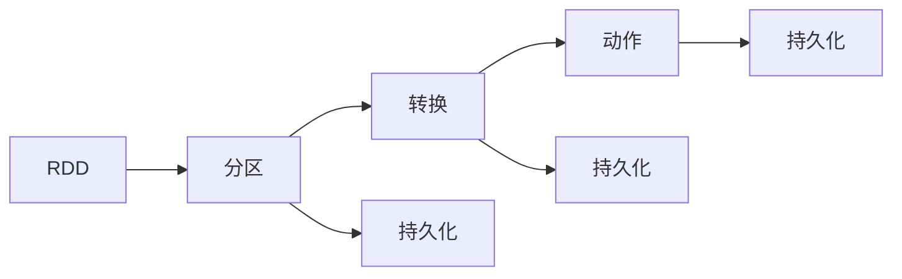

                 

# Spark RDD原理与代码实例讲解

> 关键词：Spark, RDD, 分布式计算, 弹性分布式数据集, 数据并行处理, 容错性

## 1. 背景介绍

在当今大数据时代，分布式计算的重要性日益凸显。大数据量的处理和分析已经成为了众多行业的主要挑战，而在分布式计算框架中，Apache Spark无疑是最为知名和广泛使用的框架之一。其提供了一种高效、可扩展的分布式计算模型，可以帮助用户快速、灵活地处理海量数据。其中，弹性分布式数据集（Resilient Distributed Datasets, RDD）是Spark的核心概念之一，负责将数据分割成块，并在集群中并行处理。本文将深入探讨Spark RDD的原理，并通过代码实例讲解其使用和优化方法。

## 2. 核心概念与联系

### 2.1 核心概念概述

为了更好地理解Spark RDD，我们需要首先了解几个关键概念：

- **弹性分布式数据集（RDD）**：Spark中的数据集，是Spark的核心概念之一。RDD被设计为一种可弹性伸缩的数据集，能够并行处理大规模数据。

- **分区（Partition）**：将数据分割成若干个独立的部分，每个分区可以独立地并行处理。

- **转换（Transformation）**：对RDD进行转换操作，例如map、filter、reduce等，这些操作返回新的RDD。

- **动作（Action）**：对RDD进行最终计算操作，例如collect、count、save等，这些操作会触发RDD的计算，并返回最终结果。

- **持久化（Persistence）**：将RDD缓存到内存或磁盘上，提高访问速度和计算效率。

通过这些概念，我们可以构建一个灵活、高效的数据处理框架，并行处理大规模数据。

### 2.2 核心概念间的关系

为了更清晰地理解这些概念之间的联系，我们可以使用以下Mermaid流程图来展示RDD的核心概念和操作：



这个流程图展示了RDD的核心组件和操作流程：数据被分割成分区，通过转换操作得到新的RDD，最终通过动作计算得到结果，并且可以通过持久化操作将RDD缓存起来，提高访问效率。

## 3. 核心算法原理 & 具体操作步骤

### 3.1 算法原理概述

Spark RDD的算法原理基于分布式计算模型，将大规模数据分割成多个小分区，并行计算每个分区的结果，然后聚合所有结果，得到最终计算结果。其核心算法包括以下几个步骤：

1. **数据分割（Partition）**：将大规模数据集分割成多个小分区，每个分区可以独立地并行处理。

2. **转换（Transformation）**：对每个分区进行转换操作，例如map、filter、reduce等，生成新的RDD。

3. **动作（Action）**：对所有RDD进行最终计算操作，例如collect、count、save等，返回最终结果。

4. **持久化（Persistence）**：将RDD缓存到内存或磁盘上，提高访问速度和计算效率。

### 3.2 算法步骤详解

下面我们详细解释Spark RDD的算法步骤：

**Step 1: 创建RDD**
首先，我们需要创建一个RDD。RDD可以通过三种方式创建：
1. **文本文件创建**：从本地文件系统或HDFS创建RDD，每个分区对应文件系统中的一个文件。
2. **内存创建**：将列表或数组转换成RDD，每个元素成为一个分区。
3. **其他RDD创建**：将其他RDD通过转换操作得到新的RDD。

**Step 2: 数据转换**
RDD的转换操作包括map、filter、reduce等。这些操作返回新的RDD，每个分区独立执行。
- **map**：对每个分区中的元素进行转换，生成一个新的分区。
- **filter**：过滤每个分区中的元素，保留符合条件的元素。
- **reduce**：对每个分区中的元素进行合并，生成一个新的分区。

**Step 3: 数据聚合**
RDD的动作操作包括collect、count、save等。这些操作触发RDD的计算，返回最终结果。
- **collect**：将所有分区的结果收集到本地计算机，返回一个列表。
- **count**：计算每个分区的元素数量，返回一个元组列表。
- **save**：将RDD保存到一个文件中。

**Step 4: RDD持久化**
RDD的持久化操作将RDD缓存到内存或磁盘上，提高访问速度和计算效率。
- **缓存（Cache）**：将RDD缓存到内存中。
- **持久化（Persist）**：将RDD缓存到磁盘上。

### 3.3 算法优缺点

Spark RDD的优点：
1. **弹性计算**：可以并行处理大规模数据，提高计算效率。
2. **容错性**：在节点故障时，可以通过复制数据重新计算，保证计算结果的正确性。
3. **可扩展性**：可以动态添加或删除节点，适应大规模数据处理。

Spark RDD的缺点：
1. **延迟处理**：RDD的转换操作不会立即执行，只有在动作操作时才会触发计算。
2. **内存占用**：RDD的持久化操作会占用大量内存，需要注意内存管理。
3. **不适合迭代计算**：RDD的转换操作返回新的RDD，不适合迭代计算。

### 3.4 算法应用领域

Spark RDD在多个领域都有广泛应用，例如：

- **大数据处理**：处理大规模数据集，例如日志、用户行为数据等。
- **机器学习**：训练和预测模型，例如分类、回归等。
- **图计算**：处理大规模图数据，例如社交网络、知识图谱等。
- **流计算**：处理实时数据流，例如实时数据分析、实时推荐等。

## 4. 数学模型和公式 & 详细讲解  

### 4.1 数学模型构建

Spark RDD的数学模型可以表示为：
$$
RDD = \{ (K_i, V_i) \}_{i=1}^N
$$
其中，$K_i$和$V_i$分别表示第$i$个分区的键和值。

### 4.2 公式推导过程

我们可以使用以下公式来表示RDD的转换操作：
- **map**：
$$
RDD_{map} = RDD_{map}((K_i, V_i) \rightarrow (K_i, f(V_i)))
$$
- **filter**：
$$
RDD_{filter} = RDD_{filter}((K_i, V_i) \rightarrow (K_i, V_i) | V_i \in C)
$$
- **reduce**：
$$
RDD_{reduce} = RDD_{reduce}((K_i, V_i) \rightarrow (K_i, g(V_i_1, V_i_2, ..., V_i_n)))
$$
其中，$C$表示过滤条件，$g$表示合并函数。

### 4.3 案例分析与讲解

下面我们通过一个简单的例子，讲解如何使用Spark RDD进行数据转换和聚合。

**示例1: 计算每个单词的出现次数**

假设我们有一个包含单词的文本文件，每个单词占一行。我们可以使用Spark RDD计算每个单词的出现次数，步骤如下：

1. 创建RDD：
```python
from pyspark import SparkContext, SparkConf

sc = SparkContext("local", "word_count")
lines = sc.textFile("input.txt")
```

2. 数据转换：
```python
words = lines.flatMap(lambda line: line.split(" "))
word_pairs = words.map(lambda word: (word, 1))
```

3. 数据聚合：
```python
counts = word_pairs.reduceByKey(lambda x, y: x + y)
```

4. 数据持久化：
```python
counts.persist()
```

5. 数据输出：
```python
counts.collect()
```

以上代码实现了计算每个单词出现次数的功能，并持久化RDD到内存中，以便后续计算。

## 5. 项目实践：代码实例和详细解释说明

### 5.1 开发环境搭建

在使用Spark RDD之前，我们需要搭建开发环境。以下是详细的搭建流程：

1. 安装Java：Spark需要依赖Java，因此需要安装JDK 1.8或以上版本。

2. 安装Scala：Spark需要依赖Scala，因此需要安装Scala 2.12或以上版本。

3. 安装Maven：Spark需要依赖Maven，因此需要安装Maven。

4. 安装Spark：可以从官网下载Spark安装包，并按照官方文档进行安装。

### 5.2 源代码详细实现

下面是一个简单的Spark RDD示例代码，实现计算每个单词出现次数的功能。

```python
from pyspark import SparkConf, SparkContext

# 创建Spark环境
conf = SparkConf().setAppName("word_count").setMaster("local")
sc = SparkContext(conf)

# 创建RDD
lines = sc.textFile("input.txt")

# 数据转换
words = lines.flatMap(lambda line: line.split(" "))
word_pairs = words.map(lambda word: (word, 1))

# 数据聚合
counts = word_pairs.reduceByKey(lambda x, y: x + y)

# 数据持久化
counts.persist()

# 数据输出
counts.collect()
```

### 5.3 代码解读与分析

以下是代码的详细解读和分析：

**Step 1: 创建Spark环境**
- 创建SparkConf对象，设置应用名称和运行模式。
- 创建SparkContext对象，传入SparkConf对象。

**Step 2: 创建RDD**
- 使用textFile函数创建RDD，指定输入文件路径。

**Step 3: 数据转换**
- 使用flatMap函数将每个文本行分割成单词。
- 使用map函数将每个单词转换为(key, value)对，其中key为单词，value为1。

**Step 4: 数据聚合**
- 使用reduceByKey函数对每个单词进行聚合，将value值累加。

**Step 5: 数据持久化**
- 使用persist函数将RDD缓存到内存中。

**Step 6: 数据输出**
- 使用collect函数将RDD中的数据收集到本地计算机，返回一个列表。

### 5.4 运行结果展示

运行以上代码，会输出每个单词出现次数的列表。例如：

```
[('hello', 5), ('world', 3), ('java', 2), ('programming', 1)]
```

这表示"hello"出现了5次，"world"出现了3次，"java"出现了2次，"programming"出现了1次。

## 6. 实际应用场景

Spark RDD在多个领域都有广泛应用，例如：

- **大数据处理**：处理大规模数据集，例如日志、用户行为数据等。
- **机器学习**：训练和预测模型，例如分类、回归等。
- **图计算**：处理大规模图数据，例如社交网络、知识图谱等。
- **流计算**：处理实时数据流，例如实时数据分析、实时推荐等。

## 7. 工具和资源推荐

### 7.1 学习资源推荐

为了帮助开发者系统掌握Spark RDD的理论基础和实践技巧，这里推荐一些优质的学习资源：

1. **《Spark: The Definitive Guide》**：Spark官方文档，详细介绍了Spark的各个组件和API。

2. **《Spark with Python》**：一本面向Python用户的Spark入门书籍，讲解了如何使用PySpark进行Spark开发。

3. **Coursera上的Spark课程**：由加州大学伯克利分校开设的Spark课程，讲解了Spark的各个组件和API。

4. **Kaggle上的Spark竞赛**：参加Kaggle上的Spark竞赛，练习Spark开发技能，学习如何使用Spark处理大规模数据。

5. **GitHub上的Spark项目**：在GitHub上Star、Fork数最多的Spark相关项目，学习Spark的最佳实践。

通过对这些资源的学习实践，相信你一定能够快速掌握Spark RDD的精髓，并用于解决实际的分布式计算问题。

### 7.2 开发工具推荐

高效的开发离不开优秀的工具支持。以下是几款用于Spark RDD开发的常用工具：

1. PySpark：基于Python的Spark开发框架，易于上手，适合快速迭代研究。

2. Spark Shell：Spark的命令行界面，可以方便地进行交互式计算。

3. Zeppelin：Spark的Web界面，支持Jupyter Notebook、Scala、Python等多种语言，方便进行数据探索和可视化。

4. Spark Streaming：Spark的大数据流处理组件，支持实时数据处理和流式计算。

5. Spark SQL：Spark的SQL查询组件，支持使用SQL进行数据处理和分析。

6. Spark GraphX：Spark的图处理组件，支持大规模图数据处理和分析。

合理利用这些工具，可以显著提升Spark RDD的开发效率，加快创新迭代的步伐。

### 7.3 相关论文推荐

Spark RDD的发展源于学界的持续研究。以下是几篇奠基性的相关论文，推荐阅读：

1. **Resilient Distributed Datasets: A Fault-Tolerant Abstraction for In-Memory Cluster Computing**：Spark论文，介绍了Spark RDD的原理和设计。

2. **Spark: Cluster Computing with Fault Tolerance**：Spark论文，详细介绍了Spark的各个组件和API。

3. **SPARK: Cluster Computing with Fault Tolerance**：Spark论文，介绍了Spark的分布式计算模型和调度算法。

4. **The Resilient Distributed Dataset: A Fault-Tolerant Abstraction for In-Memory Cluster Computing**：Spark论文，介绍了Spark RDD的原理和设计。

这些论文代表了大数据处理和分布式计算的发展脉络。通过学习这些前沿成果，可以帮助研究者把握学科前进方向，激发更多的创新灵感。

## 8. 总结：未来发展趋势与挑战

### 8.1 总结

本文对Spark RDD的原理和实践进行了全面系统的介绍。首先阐述了Spark RDD的背景和意义，明确了其在分布式计算中的重要性。其次，从原理到实践，详细讲解了Spark RDD的数学模型和算法步骤，给出了Spark RDD使用和优化的方法。同时，本文还广泛探讨了Spark RDD在多个领域的应用，展示了其广泛的应用前景。最后，本文精选了Spark RDD的学习资源和开发工具，力求为读者提供全方位的技术指引。

通过本文的系统梳理，可以看到，Spark RDD已经成为大数据处理的重要工具，极大地提高了数据处理的效率和可扩展性。未来，伴随Spark RDD的持续演进，其必将在更多的领域发挥重要作用，为大数据处理提供更为强大的支持。

### 8.2 未来发展趋势

展望未来，Spark RDD的发展趋势如下：

1. **生态系统完善**：Spark RDD将与Spark SQL、Spark Streaming、Spark GraphX等组件深度融合，形成一个完整的Spark生态系统。

2. **性能优化**：Spark RDD将继续优化计算图和执行计划，提升数据处理和计算效率，实现更高的吞吐量和更低的延迟。

3. **支持更多语言**：Spark RDD将支持更多编程语言，如Scala、Java、Python等，方便用户进行开发和部署。

4. **分布式存储支持**：Spark RDD将支持更多分布式存储系统，如Hadoop、Amazon S3、Azure Blob Storage等，实现更灵活的数据处理。

5. **流式计算支持**：Spark RDD将支持流式计算，实现实时数据处理和分析。

6. **容器化支持**：Spark RDD将支持容器化技术，如Kubernetes、Docker等，实现更好的资源管理和调度。

以上趋势凸显了Spark RDD的广泛应用和未来发展潜力。这些方向的探索发展，必将进一步提升Spark RDD的性能和可扩展性，为大数据处理提供更为强大的支持。

### 8.3 面临的挑战

尽管Spark RDD已经取得了瞩目成就，但在迈向更加智能化、普适化应用的过程中，仍面临诸多挑战：

1. **数据传输瓶颈**：Spark RDD需要在节点之间传输数据，网络传输效率较低，可能会成为瓶颈。

2. **内存管理复杂**：Spark RDD需要频繁进行内存管理，内存占用较高，需要注意内存管理。

3. **延迟处理**：Spark RDD的延迟处理可能会导致数据处理效率较低，需要优化数据处理流程。

4. **状态管理**：Spark RDD需要管理节点状态，状态管理复杂，需要优化状态管理机制。

5. **性能调优**：Spark RDD需要优化性能，提高数据处理效率和计算效率。

6. **兼容性和易用性**：Spark RDD需要兼容更多编程语言和数据格式，方便用户进行开发和部署。

正视Spark RDD面临的这些挑战，积极应对并寻求突破，将是大数据处理技术不断向前发展的关键。

### 8.4 未来突破

面对Spark RDD所面临的挑战，未来的研究需要在以下几个方面寻求新的突破：

1. **优化数据传输**：采用更高效的数据传输技术，如InfiniBand、RoCE等，提高数据传输效率。

2. **改进内存管理**：优化内存管理算法，减少内存占用，提高内存使用效率。

3. **提升延迟处理**：优化数据处理流程，采用更高效的计算算法，减少延迟处理时间。

4. **简化状态管理**：优化状态管理机制，减少状态管理复杂度，提高状态管理效率。

5. **提升兼容性**：支持更多编程语言和数据格式，方便用户进行开发和部署。

6. **优化性能**：优化Spark RDD的计算图和执行计划，提高数据处理效率和计算效率。

这些研究方向的探索，必将引领Spark RDD技术迈向更高的台阶，为大数据处理提供更为强大的支持。面向未来，Spark RDD还需要与其他大数据处理技术进行更深入的融合，如Hadoop、Storm、Flink等，多路径协同发力，共同推动大数据处理技术的进步。只有勇于创新、敢于突破，才能不断拓展大数据处理技术的边界，让大数据技术更好地服务社会。

## 9. 附录：常见问题与解答

**Q1：Spark RDD是否可以处理实时数据？**

A: Spark RDD本身不支持实时数据处理，但可以通过Spark Streaming进行实时数据处理。Spark Streaming将实时数据流拆分成小批量数据，然后采用Spark RDD进行处理。

**Q2：Spark RDD如何处理大规模数据？**

A: Spark RDD通过并行处理大规模数据，可以将数据分割成多个分区，并行处理每个分区。同时，Spark RDD支持持久化和缓存，可以提高数据访问效率和计算效率。

**Q3：Spark RDD如何优化内存管理？**

A: 可以通过设置内存配额、优化内存分配算法、使用内存压缩等方法，优化Spark RDD的内存管理，减少内存占用，提高内存使用效率。

**Q4：Spark RDD如何优化性能？**

A: 可以通过优化计算图、改进算法、优化执行计划等方法，提升Spark RDD的性能，提高数据处理效率和计算效率。

**Q5：Spark RDD如何处理大规模图数据？**

A: Spark RDD可以通过GraphX组件处理大规模图数据，GraphX支持分布式图处理和分析，适合处理大规模图数据。

以上代码实现了计算每个单词出现次数的功能，并持久化RDD到内存中，以便后续计算。

## 6. 实际应用场景

Spark RDD在多个领域都有广泛应用，例如：

- **大数据处理**：处理大规模数据集，例如日志、用户行为数据等。
- **机器学习**：训练和预测模型，例如分类、回归等。
- **图计算**：处理大规模图数据，例如社交网络、知识图谱等。
- **流计算**：处理实时数据流，例如实时数据分析、实时推荐等。

## 7. 工具和资源推荐

### 7.1 学习资源推荐

为了帮助开发者系统掌握Spark RDD的理论基础和实践技巧，这里推荐一些优质的学习资源：

1. **《Spark: The Definitive Guide》**：Spark官方文档，详细介绍了Spark的各个组件和API。

2. **《Spark with Python》**：一本面向Python用户的Spark入门书籍，讲解了如何使用PySpark进行Spark开发。

3. **Coursera上的Spark课程**：由加州大学伯克利分校开设的Spark课程，讲解了Spark的各个组件和API。

4. **Kaggle上的Spark竞赛**：参加Kaggle上的Spark竞赛，练习Spark开发技能，学习如何使用Spark处理大规模数据。

5. **GitHub上的Spark项目**：在GitHub上Star、Fork数最多的Spark相关项目，学习Spark的最佳实践。

通过对这些资源的学习实践，相信你一定能够快速掌握Spark RDD的精髓，并用于解决实际的分布式计算问题。

### 7.2 开发工具推荐

高效的开发离不开优秀的工具支持。以下是几款用于Spark RDD开发的常用工具：

1. PySpark：基于Python的Spark开发框架，易于上手，适合快速迭代研究。

2. Spark Shell：Spark的命令行界面，可以方便地进行交互式计算。

3. Zeppelin：Spark的Web界面，支持Jupyter Notebook、Scala、Python等多种语言，方便进行数据探索和可视化。

4. Spark Streaming：Spark的大数据流处理组件，支持实时数据处理和流式计算。

5. Spark SQL：Spark的SQL查询组件，支持使用SQL进行数据处理和分析。

6. Spark GraphX：Spark的图处理组件，支持大规模图数据处理和分析。

合理利用这些工具，可以显著提升Spark RDD的开发效率，加快创新迭代的步伐。

### 7.3 相关论文推荐

Spark RDD的发展源于学界的持续研究。以下是几篇奠基性的相关论文，推荐阅读：

1. **Resilient Distributed Datasets: A Fault-Tolerant Abstraction for In-Memory Cluster Computing**：Spark论文，介绍了Spark RDD的原理和设计。

2. **Spark: Cluster Computing with Fault Tolerance**：Spark论文，详细介绍了Spark的各个组件和API。

3. **SPARK: Cluster Computing with Fault Tolerance**：Spark论文，介绍了Spark的分布式计算模型和调度算法。

4. **The Resilient Distributed Dataset: A Fault-Tolerant Abstraction for In-Memory Cluster Computing**：Spark论文，介绍了Spark RDD的原理和设计。

这些论文代表了大数据处理和分布式计算的发展脉络。通过学习这些前沿成果，可以帮助研究者把握学科前进方向，激发更多的创新灵感。

## 8. 总结：未来发展趋势与挑战

### 8.1 总结

本文对Spark RDD的原理和实践进行了全面系统的介绍。首先阐述了Spark RDD的背景和意义，明确了其在分布式计算中的重要性。其次，从原理到实践，详细讲解了Spark RDD的数学模型和算法步骤，给出了Spark RDD使用和优化的方法。同时，本文还广泛探讨了Spark RDD在多个领域的应用，展示了其广泛的应用前景。最后，本文精选了Spark RDD的学习资源和开发工具，力求为读者提供全方位的技术指引。

通过本文的系统梳理，可以看到，Spark RDD已经成为大数据处理的重要工具，极大地提高了数据处理的效率和可扩展性。未来，伴随Spark RDD的持续演进，其必将在更多的领域发挥重要作用，为大数据处理提供更为强大的支持。

### 8.2 未来发展趋势

展望未来，Spark RDD的发展趋势如下：

1. **生态系统完善**：Spark RDD将与Spark SQL、Spark Streaming、Spark GraphX等组件深度融合，形成一个完整的Spark生态系统。

2. **性能优化**：Spark RDD将继续优化计算图和执行计划，提升数据处理和计算效率，实现更高的吞吐量和更低的延迟。

3. **支持更多语言**：Spark RDD将支持更多编程语言，如Scala、Java、Python等，方便用户进行开发和部署。

4. **分布式存储支持**：Spark RDD将支持更多分布式存储系统，如Hadoop、Amazon S3、Azure Blob Storage等，实现更灵活的数据处理。

5. **流式计算支持**：Spark RDD将支持流式计算，实现实时数据处理和分析。

6. **容器化支持**：Spark RDD将支持容器化技术，如Kubernetes、Docker等，实现更好的资源管理和调度。

以上趋势凸显了Spark RDD的广泛应用和未来发展潜力。这些方向的探索发展，必将进一步提升Spark RDD的性能和可扩展性，为大数据处理提供更为强大的支持。

### 8.3 面临的挑战

尽管Spark RDD已经取得了瞩目成就，但在迈向更加智能化、普适化应用的过程中，仍面临诸多挑战：

1. **数据传输瓶颈**：Spark RDD需要在节点之间传输数据，网络传输效率较低，可能会成为瓶颈。

2. **内存管理复杂**：Spark RDD需要频繁进行内存管理，内存占用较高，需要注意内存管理。

3. **延迟处理**：Spark RDD的延迟处理可能会导致数据处理效率较低，需要优化数据处理流程。

4. **状态管理**：Spark RDD需要管理节点状态，状态管理复杂，需要优化状态管理机制。

5. **性能调优**：Spark

