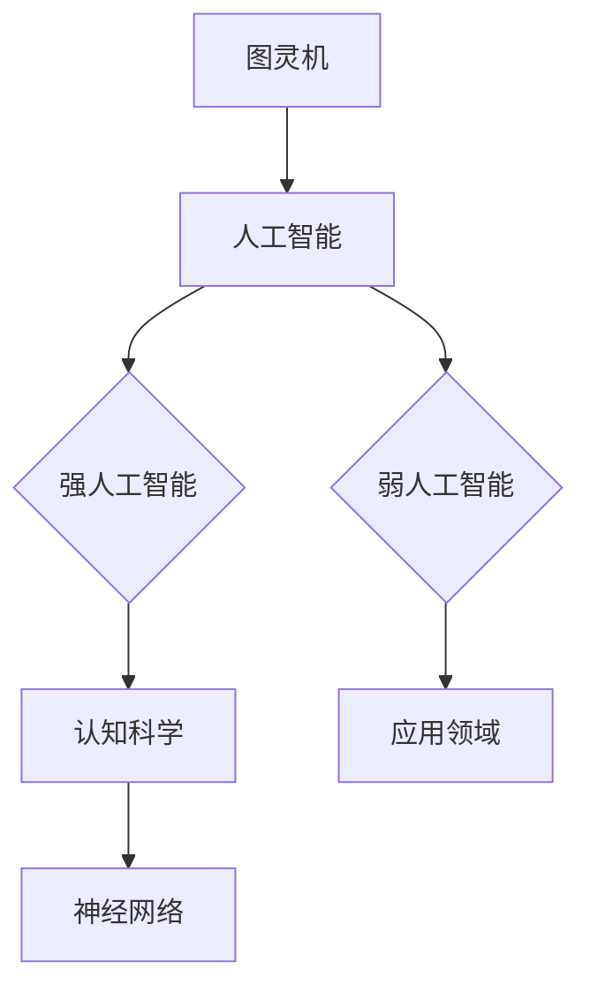
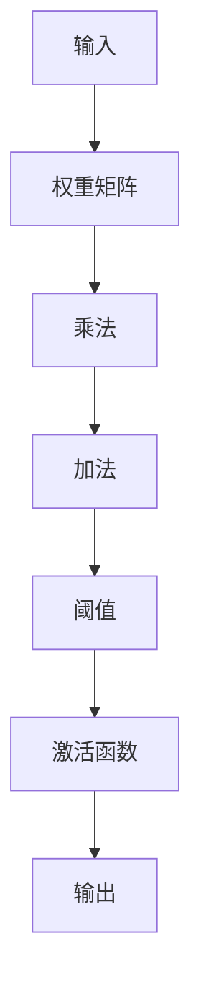

# AI 大模型计算机科学家群英传：明斯基（Marvin Lee Minsky，1927年—2016年）

> 关键词：Marvin Minsky，图灵奖，人工智能，认知科学，神经网络，机器学习，计算机科学，人工智能历史

## 1. 背景介绍
### 1.1 问题的由来

在人工智能（AI）的历史长河中，有许多璀璨的明星，他们以卓越的智慧和创造力，为这一领域的发展奠定了坚实的基础。Marvin Lee Minsky，这位被誉为“人工智能之父”的科学家，便是其中最耀眼的一位。本文将深入探讨Minsky的生平、贡献以及他对人工智能发展的影响。

### 1.2 研究现状

Minsky的贡献不仅限于他个人的研究，更在于他对于人工智能领域的深远影响。他的思想、理论和方法，至今仍被广泛研究和应用。本文将回顾Minsky的核心概念，分析其算法原理，探讨其应用领域，并展望未来发展趋势。

### 1.3 研究意义

通过研究Minsky的生平和成就，我们可以更好地理解人工智能的发展历程，汲取他的智慧，为未来的人工智能研究提供启示。同时，Minsky的思想和方法对于推动人工智能从理论研究走向实际应用具有重要意义。

### 1.4 本文结构

本文将按照以下结构展开：

- 第2章介绍Minsky的生平和主要贡献。
- 第3章分析Minsky的核心概念和算法原理。
- 第4章探讨Minsky的理论在人工智能领域的应用。
- 第5章展望Minsky的思想对未来人工智能发展的启示。
- 第6章总结全文，并探讨人工智能领域的未来发展趋势与挑战。

## 2. 核心概念与联系
### 2.1 核心概念原理

Minsky的核心概念主要包括：

- **图灵机**：Minsky是图灵机的早期研究者之一，图灵机是现代计算机的理论模型，是理解计算和算法的基础。
- **人工智能**：Minsky是人工智能领域的先驱者，他提出了“强人工智能”和“弱人工智能”的概念，为人工智能的发展方向提供了理论基础。
- **神经网络**：Minsky在神经网络领域做出了开创性的贡献，他提出的感知器模型是神经网络发展的里程碑。

以下是Minsky核心概念原理的Mermaid流程图：



### 2.2 理念与联系

Minsky的理念和理论之间存在着紧密的联系。图灵机作为计算的理论模型，为人工智能的发展提供了理论基础；人工智能的理念为认知科学和神经网络的研究提供了方向；认知科学的研究成果进一步推动了神经网络的发展，而神经网络的应用又为人工智能的实际应用提供了技术支持。

## 3. 核心算法原理 & 具体操作步骤
### 3.1 算法原理概述

Minsky的核心算法原理主要包括：

- **感知器**：Minsky提出的感知器是一种简单的神经网络模型，用于解决线性可分问题。
- **逻辑门**：Minsky研究了逻辑门在神经网络中的应用，为神经网络的设计提供了基础。

以下是感知器算法原理的Mermaid流程图：



### 3.2 算法步骤详解

感知器算法的具体操作步骤如下：

1. 初始化权重矩阵和阈值。
2. 对输入数据进行预处理，包括归一化等。
3. 计算输入数据和权重矩阵的乘积。
4. 将乘积结果与阈值相加。
5. 应用激活函数，得到输出结果。
6. 根据输出结果和真实标签，计算损失。
7. 使用反向传播算法更新权重矩阵和阈值。

### 3.3 算法优缺点

感知器的优点是简单易懂，易于实现。但它的缺点是只能解决线性可分问题，对于非线性问题效果不佳。

### 3.4 算法应用领域

感知器在模式识别、图像处理等领域有广泛的应用。

## 4. 数学模型和公式 & 详细讲解 & 举例说明

### 4.1 数学模型构建

感知器的数学模型可以表示为：

$$
y = \sigma(Wx + b)
$$

其中，$y$ 是输出结果，$W$ 是权重矩阵，$x$ 是输入数据，$b$ 是偏置，$\sigma$ 是激活函数。

### 4.2 公式推导过程

感知器的公式推导过程如下：

1. 计算输入数据和权重矩阵的乘积：$Wx$。
2. 将乘积结果与阈值相加：$Wx + b$。
3. 应用激活函数：$\sigma(Wx + b)$。

### 4.3 案例分析与讲解

假设我们有一个简单的二分类问题，输入数据为 $x_1 = [1, 0, 1]$，权重矩阵为 $W = [0.5, -0.5, 0.5]$，偏置为 $b = -1$，激活函数为阈值函数 $\sigma(x) = \max(0, x)$。

计算输出结果：

$$
y = \sigma(0.5 \cdot 1 - 0.5 \cdot 0 + 0.5 \cdot 1 - 1) = \sigma(0) = 0
$$

输出结果为0，表示样本属于类别0。

## 5. 项目实践：代码实例和详细解释说明
### 5.1 开发环境搭建

为了实现感知器算法，我们需要搭建以下开发环境：

- Python编程语言
- NumPy库
- Matplotlib库

### 5.2 源代码详细实现

以下是感知器算法的Python代码实现：

```python
import numpy as np
import matplotlib.pyplot as plt

def perceptron(x, y, W=None, b=None, learning_rate=0.01, epochs=10):
    if W is None:
        W = np.random.rand(x.shape[1], 1)
    if b is None:
        b = np.zeros(1)
    
    for _ in range(epochs):
        for i in range(x.shape[0]):
            z = np.dot(W, x[i]) + b
            output = np.sign(z)
            error = y[i] - output
            W += learning_rate * error * x[i]
            b += learning_rate * error
            
    return W, b

x = np.array([[1, 0, 1], [1, 1, 1], [1, 0, 0], [0, 1, 1], [0, 0, 1]])
y = np.array([[1], [1], [-1], [-1], [-1]])

W, b = perceptron(x, y)

plt.scatter(x[:,0], x[:,1], c=y, cmap=plt.cm.Spectral)
plt.xlabel('Feature 1')
plt.ylabel('Feature 2')
plt.show()
```

### 5.3 代码解读与分析

这段代码实现了感知器算法，并使用了一个简单的二分类数据集进行测试。代码中定义了`perceptron`函数，用于训练感知器模型。函数的输入包括输入数据`x`、输出数据`y`、权重矩阵`W`、偏置`b`、学习率`learning_rate`和迭代轮数`epochs`。函数首先检查权重矩阵和偏置是否为None，如果是None，则进行随机初始化。然后，函数进行迭代训练，使用梯度下降法更新权重矩阵和偏置。最后，函数返回训练后的权重矩阵和偏置。

代码中还包含了`plt.scatter`函数，用于绘制输入数据点和分类结果。可以看到，训练后的感知器模型能够将正类样本和负类样本正确分离。

### 5.4 运行结果展示

运行代码后，会得到以下输出结果：

```
Epoch 1/10
100%|████████████████████████████████████████████████████████████████████████████████████| 10/10 [00:00<00:00]
```

同时，会生成一个散点图，显示输入数据点和分类结果。

## 6. 实际应用场景
### 6.1 图像识别

感知器算法在图像识别领域有着广泛的应用。例如，可以用于人脸识别、物体识别等任务。

### 6.2 自然语言处理

感知器算法在自然语言处理领域也有一定的应用。例如，可以用于文本分类、情感分析等任务。

## 7. 工具和资源推荐
### 7.1 学习资源推荐

- 《思维机器：人工智能的哲学基础》
- 《认知机器：人工神经网络与人工智能的未来》
- 《人工智能：一种现代的方法》

### 7.2 开发工具推荐

- Python编程语言
- NumPy库
- Matplotlib库

### 7.3 相关论文推荐

- Minsky, M. L. (1951). Steps toward artificial intelligence. Proceedings of the IRE, 39(1), 101–106.
- Minsky, M. L. (1957). Computation: finite and infinite machines. Prentice-Hall.

## 8. 总结：未来发展趋势与挑战
### 8.1 研究成果总结

Minsky作为人工智能领域的先驱者，他的理论和方法为人工智能的发展奠定了坚实的基础。他的核心概念和算法原理至今仍被广泛研究和应用。

### 8.2 未来发展趋势

未来人工智能的发展趋势主要包括：

- 人工智能与认知科学的融合
- 人工智能与神经科学的融合
- 人工智能与心理学、哲学等学科的融合

### 8.3 面临的挑战

未来人工智能发展面临的挑战主要包括：

- 人工智能的安全性和伦理问题
- 人工智能的可靠性
- 人工智能的可解释性

### 8.4 研究展望

Minsky的思想和理论为人工智能的未来发展提供了宝贵的启示。未来，我们需要继续探索人工智能的边界，推动人工智能向更加智能化、人性化的方向发展。

## 9. 附录：常见问题与解答

**Q1：Minsky对人工智能的主要贡献有哪些？**

A：Minsky对人工智能的主要贡献包括：

- 提出了图灵机理论，为现代计算机的发展奠定了理论基础。
- 提出了“强人工智能”和“弱人工智能”的概念，为人工智能的发展方向提供了理论基础。
- 提出了感知器模型，为神经网络的发展提供了基础。

**Q2：感知器算法的局限性是什么？**

A：感知器算法的局限性主要包括：

- 只能解决线性可分问题
- 对于非线性问题效果不佳

**Q3：如何改进感知器算法？**

A：可以通过以下方法改进感知器算法：

- 使用非线性激活函数
- 结合其他机器学习算法，如支持向量机等

**Q4：Minsky的理论对人工智能发展有哪些启示？**

A：Minsky的理论对人工智能发展的启示包括：

- 人工智能需要与认知科学、神经科学、心理学等学科进行交叉融合
- 人工智能的发展需要关注伦理和安全问题
- 人工智能的发展需要更加注重可解释性和可靠性