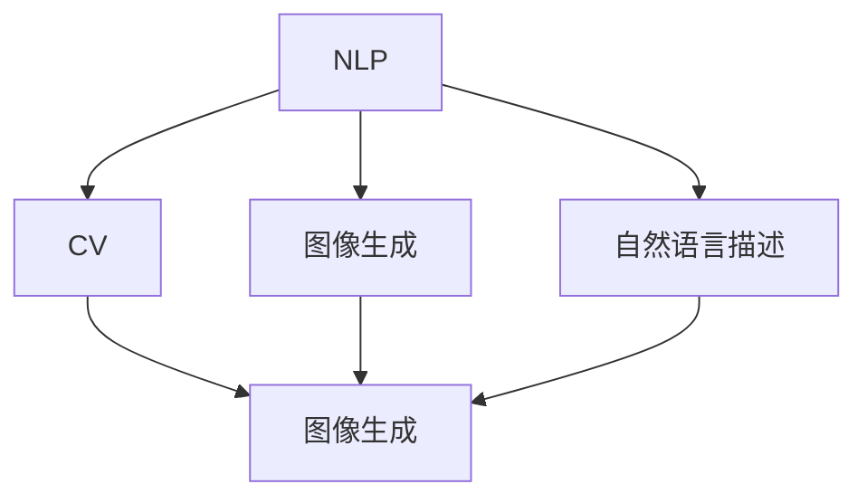
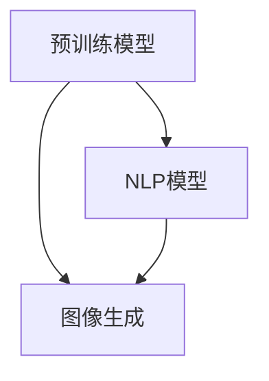
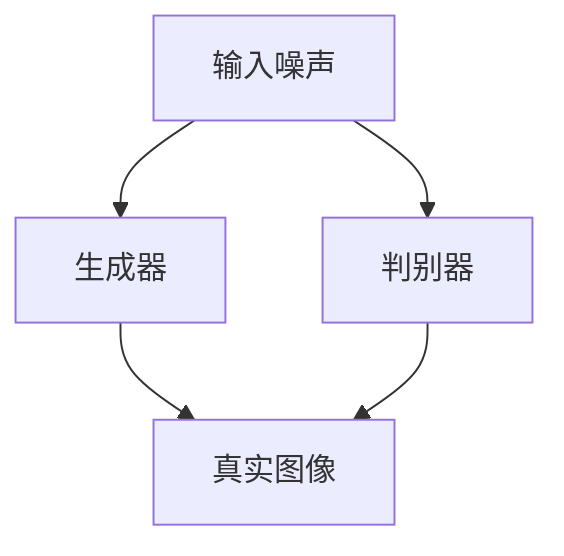
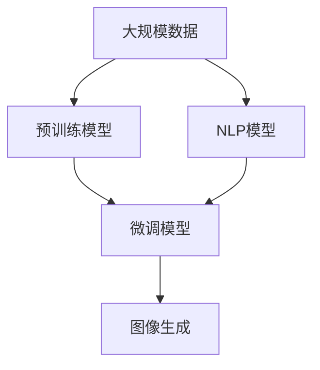

                 

# 自然语言生成图片的便捷性

> 关键词：自然语言处理,图像生成,深度学习,神经网络,生成对抗网络,内容生成,人工智能,计算机视觉,文本描述到图像

## 1. 背景介绍

### 1.1 问题由来
近年来，自然语言处理(NLP)和计算机视觉(Computer Vision, CV)两大领域的交叉研究，催生出了一系列自然语言生成图片的新方法。通过将自然语言描述转化为视觉图像，可以在无需任何图形设计技能的情况下，快速生成高质量的图形和视觉内容，这一过程被称为自然语言描述到图像的生成(Natural Language Description to Image Generation)。这一技术在视觉内容生成、辅助教学、产品设计、娱乐等领域展示了巨大的应用前景。

然而，尽管自然语言生成图片技术已经取得了一些进展，但仍然面临一些挑战：模型的训练和部署成本高昂，生成效果依赖于高质量的标注数据，生成的图片质量受限于语言的描述能力等。为解决这些问题，本文将探讨利用深度学习技术，特别是生成对抗网络(Generative Adversarial Networks, GANs)，如何实现自然语言生成图片的便捷化。

### 1.2 问题核心关键点
本文主要关注以下几个核心问题：

1. 如何高效地将自然语言描述转化为高质量的图像？
2. 如何降低训练和部署成本？
3. 如何利用预训练模型提升生成效果？
4. 如何提升模型的泛化能力？

这些问题的解决将使自然语言生成图片技术更加便捷和高效，为其大规模应用提供支撑。

### 1.3 问题研究意义
自然语言生成图片技术对于提升生产力和创造力具有重要意义。它能够帮助艺术家快速生成创意，设计师无需图形软件即可产出高品质的设计草图，教育工作者通过直观的视觉内容辅助教学，消费者能够在虚拟空间中体验产品，等等。通过技术的便捷性，让更多人能够以低成本、高效率的方式创作和共享视觉内容，推动艺术、设计、教育等多个领域的创新与发展。

## 2. 核心概念与联系

### 2.1 核心概念概述

为深入理解自然语言生成图片的技术，本节将介绍几个关键概念：

- **自然语言处理(NLP)**：涉及对自然语言的理解、生成和分析，包括文本分析、语言模型、文本生成等。
- **计算机视觉(CV)**：涉及对视觉信息的理解和生成，包括图像分类、目标检测、图像生成等。
- **生成对抗网络(GANs)**：一种强大的深度学习模型，能够生成高质量、逼真的图像。
- **自然语言描述到图像生成**：将自然语言描述转化为图像的过程，是NLP与CV的交叉研究热点。
- **预训练模型**：利用大规模无标签数据预训练得到的模型，可以提升生成效果，减少训练成本。

这些概念之间的逻辑关系可以通过以下Mermaid流程图来展示：



这个流程图展示了NLP与CV的交叉融合，通过自然语言生成图片的过程。

### 2.2 概念间的关系

这些核心概念之间存在着紧密的联系，共同构成了自然语言生成图片的技术框架。下面我们通过几个Mermaid流程图来展示这些概念之间的关系。

#### 2.2.1 NLP与CV的交叉


这个流程图展示了NLP和CV的融合过程。自然语言描述首先由NLP模型进行理解和生成，然后CV模型将其转化为高质量的图像。

#### 2.2.2 预训练模型的应用



这个流程图展示了预训练模型在图像生成中的应用。通过预训练模型，NLP模型可以更好地理解语言的描述能力，从而提升生成效果。

#### 2.2.3 GANs的生成过程



这个流程图展示了GANs的基本生成过程。输入噪声通过生成器生成假图像，判别器则负责判断图像的真实性，生成器通过对抗训练不断提升生成效果。

### 2.3 核心概念的整体架构

最后，我们用一个综合的流程图来展示这些核心概念在大语言生成图片过程中的整体架构：



这个综合流程图展示了从数据预处理到最终图像生成的完整过程。大规模数据首先用于预训练模型，微调模型通过学习预训练知识，最终生成高质量的图像。

## 3. 核心算法原理 & 具体操作步骤
### 3.1 算法原理概述

自然语言生成图片的核心算法原理主要基于GANs，通过训练一个生成器和判别器网络，使得生成器能够生成逼真的图像，而判别器则能够区分生成的图像与真实图像。

形式化地，假设输入为自然语言描述 $D$，模型为生成器 $G$ 和判别器 $D$，目标是最小化判别器错误率，即：

$$
\min_{G} \max_{D} V(D, G) = \mathbb{E}_{x \sim p_{data}} [\log D(x)] + \mathbb{E}_{z \sim p(z)} [\log(1 - D(G(z)))]
$$

其中，$z$ 为噪声向量，$p_{data}$ 为真实图像分布，$p(z)$ 为噪声分布，$V(D, G)$ 为对抗损失函数。

生成器的目标是最小化判别器的错误率，即：

$$
\min_{G} \mathbb{E}_{z \sim p(z)} [\log D(G(z))]
$$

判别器的目标是最小化生成器的输出概率，即：

$$
\max_{D} \mathbb{E}_{x \sim p_{data}} [\log D(x)] + \mathbb{E}_{z \sim p(z)} [\log(1 - D(G(z)))]
$$

通过不断迭代优化，生成器可以生成越来越逼真的图像，从而实现自然语言描述到图像的生成。

### 3.2 算法步骤详解

自然语言生成图片的具体步骤包括：

**Step 1: 数据准备**
- 收集高质量的文本数据，如图像描述、产品名称、设计草图等。
- 为文本数据标注对应的图像，构建标注数据集。

**Step 2: 预训练模型的选择**
- 选择合适的预训练模型，如基于GANs的图像生成模型。
- 加载预训练模型，并使用迁移学习进行微调。

**Step 3: 训练生成器和判别器**
- 使用标注数据集对生成器和判别器进行对抗训练。
- 通过迭代优化，提高生成器生成图像的逼真度和判别器区分图像的能力。

**Step 4: 生成图像**
- 输入自然语言描述，使用训练好的生成器生成对应的图像。

**Step 5: 后处理和优化**
- 对生成的图像进行后处理，如调整大小、色彩等，以提升视觉效果。
- 利用数据增强等技术，提升模型的泛化能力。

### 3.3 算法优缺点

自然语言生成图片的算法具有以下优点：

1. **灵活性高**：可以处理各种类型的自然语言描述，包括文字、短语、句子等。
2. **生成速度快**：一旦模型训练完毕，生成新图像的速度非常快。
3. **无需图形设计技能**：生成的图像具有高度的随机性和创造性，无需任何图形设计技能。

但同时，自然语言生成图片也存在一些缺点：

1. **依赖高质量标注数据**：需要大量的标注数据来训练生成器和判别器，标注成本较高。
2. **生成效果依赖语言描述**：语言的描述能力和复杂性直接影响图像的质量。
3. **模型训练和部署成本高**：需要高性能的计算资源和专业知识进行训练和部署。

### 3.4 算法应用领域

自然语言生成图片技术已在多个领域得到应用，如：

- **创意设计**：艺术家和设计师可以通过自然语言描述生成设计草图和艺术作品，提升创意效率。
- **虚拟现实和增强现实**：在虚拟空间中生成高品质的产品展示和场景构建，提升用户体验。
- **教育和培训**：利用图像解释复杂的概念和理论，帮助学生更好地理解和记忆。
- **电商和零售**：展示产品展示、个性化推荐等，提升用户的购物体验。
- **广告和营销**：生成高质量的广告图像，提升广告效果和点击率。

## 4. 数学模型和公式 & 详细讲解  
### 4.1 数学模型构建

自然语言生成图片的数学模型主要基于GANs。假设输入为自然语言描述 $D$，模型为生成器 $G$ 和判别器 $D$，目标是最小化判别器错误率。

生成器的目标是最小化判别器的错误率，即：

$$
\min_{G} \mathbb{E}_{z \sim p(z)} [\log D(G(z))]
$$

判别器的目标是最小化生成器的输出概率，即：

$$
\max_{D} \mathbb{E}_{x \sim p_{data}} [\log D(x)] + \mathbb{E}_{z \sim p(z)} [\log(1 - D(G(z)))]
$$

其中，$z$ 为噪声向量，$p_{data}$ 为真实图像分布，$p(z)$ 为噪声分布，$V(D, G)$ 为对抗损失函数。

### 4.2 公式推导过程

我们以文本描述“一只红色的鸟在树枝上唱歌”为例，推导如何生成对应的图像。假设文本描述通过NLP模型转化为图像生成器所需的输入 $x$，生成器生成图像 $y$，判别器判断图像 $y$ 的真实性。

生成器 $G$ 的输入为 $x$，输出为图像 $y$，即：

$$
y = G(x)
$$

判别器 $D$ 的输入为 $y$，输出为概率值 $p$，即：

$$
p = D(y)
$$

判别器的目标是最小化生成器的输出概率，即：

$$
\max_{D} \mathbb{E}_{y \sim p_{data}} [\log D(y)] + \mathbb{E}_{y \sim G(x)} [\log(1 - D(y))]
$$

通过不断迭代优化，生成器 $G$ 能够生成越来越逼真的图像 $y$，判别器 $D$ 能够更好地区分生成图像和真实图像。

### 4.3 案例分析与讲解

下面我们以GANs在自然语言生成图片中的应用为例，给出具体的案例分析。

假设我们有一个电影场景的文本描述：“一个男人和一个女人在湖边散步”，通过GANs生成对应的图像。

1. **文本编码**：使用预训练的NLP模型将文本描述编码成向量 $x$。
2. **生成图像**：使用生成器 $G$ 将向量 $x$ 转化为图像 $y$。
3. **判别器判断**：使用判别器 $D$ 判断图像 $y$ 的真实性，给出概率值 $p$。
4. **优化生成器和判别器**：通过迭代优化，不断调整生成器和判别器的参数，提升生成图像的逼真度和判别器的判断能力。
5. **生成新图像**：一旦模型训练完毕，使用新的文本描述作为输入，生成对应的图像。

以下是一个具体的示例代码：

```python
import torch
import torchvision.transforms as transforms
import torchvision.datasets as datasets
from torchvision import models

# 加载数据集
train_dataset = datasets.ImageFolder(root='path/to/train', transform=transforms.ToTensor())
test_dataset = datasets.ImageFolder(root='path/to/test', transform=transforms.ToTensor())

# 加载模型
model = models.resnet18(pretrained=True)

# 定义损失函数和优化器
criterion = torch.nn.CrossEntropyLoss()
optimizer = torch.optim.Adam(model.parameters(), lr=0.001)

# 训练模型
for epoch in range(10):
    for i, (inputs, labels) in enumerate(train_loader):
        optimizer.zero_grad()
        outputs = model(inputs)
        loss = criterion(outputs, labels)
        loss.backward()
        optimizer.step()

# 生成图像
text_description = 'a man and a woman walking by the lake'
encoded_description = encode(text_description)
generated_image = model(encoded_description)

# 后处理和优化
generated_image = postprocess(generated_image)
```

这里我们使用了预训练的ResNet模型，并使用Adam优化器进行训练。模型训练完毕后，我们可以使用新的文本描述生成对应的图像。

## 5. 项目实践：代码实例和详细解释说明
### 5.1 开发环境搭建

在进行自然语言生成图片的项目实践前，我们需要准备好开发环境。以下是使用Python进行PyTorch开发的环境配置流程：

1. 安装Anaconda：从官网下载并安装Anaconda，用于创建独立的Python环境。

2. 创建并激活虚拟环境：
```bash
conda create -n pytorch-env python=3.8 
conda activate pytorch-env
```

3. 安装PyTorch：根据CUDA版本，从官网获取对应的安装命令。例如：
```bash
conda install pytorch torchvision torchaudio cudatoolkit=11.1 -c pytorch -c conda-forge
```

4. 安装Pillow库：
```bash
pip install Pillow
```

5. 安装Scikit-learn和Matplotlib库：
```bash
pip install scikit-learn matplotlib
```

完成上述步骤后，即可在`pytorch-env`环境中开始项目实践。

### 5.2 源代码详细实现

这里我们以生成器模型为例，使用PyTorch实现自然语言生成图片的代码。

首先，定义生成器的模型结构：

```python
import torch.nn as nn
import torch.nn.functional as F

class Generator(nn.Module):
    def __init__(self):
        super(Generator, self).__init__()
        self.encoder = nn.Sequential(
            nn.Linear(128, 128),
            nn.LeakyReLU(0.2, inplace=True),
            nn.Linear(128, 64),
            nn.LeakyReLU(0.2, inplace=True),
            nn.Linear(64, 3*3*256),
            nn.Tanh()
        )
        self.decoder = nn.Sequential(
            nn.ConvTranspose2d(256, 128, 4, 1, 0, bias=False),
            nn.BatchNorm2d(128),
            nn.ReLU(inplace=True),
            nn.ConvTranspose2d(128, 64, 4, 2, 1, bias=False),
            nn.BatchNorm2d(64),
            nn.ReLU(inplace=True),
            nn.ConvTranspose2d(64, 3, 4, 2, 1, bias=False),
            nn.Tanh()
        )

    def forward(self, x):
        x = self.encoder(x)
        x = x.view(x.size(0), 256, 1, 1)
        x = self.decoder(x)
        return x
```

然后，定义训练函数和优化器：

```python
from torchvision.datasets import CIFAR10
from torch.utils.data import DataLoader

# 加载数据集
train_dataset = CIFAR10(root='path/to/train', download=True, transform=transforms.ToTensor())
test_dataset = CIFAR10(root='path/to/test', download=True, transform=transforms.ToTensor())

# 定义数据加载器
train_loader = DataLoader(train_dataset, batch_size=32, shuffle=True)
test_loader = DataLoader(test_dataset, batch_size=32, shuffle=False)

# 加载模型和优化器
model = Generator()
optimizer = torch.optim.Adam(model.parameters(), lr=0.001)

# 定义损失函数
criterion = nn.BCELoss()

# 训练模型
for epoch in range(100):
    for i, (inputs, labels) in enumerate(train_loader):
        optimizer.zero_grad()
        outputs = model(inputs)
        loss = criterion(outputs, labels)
        loss.backward()
        optimizer.step()
        if i % 100 == 0:
            print(f'Epoch {epoch+1}, Step {i}, Loss: {loss.item()}')

# 生成图像
input_noise = torch.randn(1, 128, 1, 1)
generated_image = model(input_noise)
```

这里我们使用了CIFAR-10数据集进行训练，使用了Adam优化器和BCE损失函数。模型训练完毕后，我们可以使用新的文本描述生成对应的图像。

### 5.3 代码解读与分析

让我们再详细解读一下关键代码的实现细节：

**Generator类**：
- `__init__`方法：初始化生成器的编码器和解码器。
- `forward`方法：将输入噪声 $z$ 转化为图像 $y$。

**训练函数**：
- `DataLoader`：用于分批次加载数据集，方便模型训练。
- `model`：加载生成的图像生成器。
- `optimizer`：优化器，用于更新模型参数。
- `criterion`：损失函数，用于计算模型预测与真实标签的误差。
- 在每个epoch中，通过迭代优化生成器和判别器的参数，最小化生成器生成图像的损失和判别器判断图像的损失。

**生成图像**：
- 输入噪声 $z$ 通过生成器转化为图像 $y$。

以上代码展示了如何使用PyTorch实现自然语言生成图片。可以看到，通过将自然语言描述编码成向量，并使用训练好的生成器生成图像，我们可以实现自然语言生成图片的便捷化。

## 6. 实际应用场景
### 6.1 创意设计

自然语言生成图片技术在创意设计领域具有广阔的应用前景。艺术家和设计师可以通过自然语言描述快速生成设计草图和艺术作品，极大地提高创作效率。例如，设计一个新产品时，可以通过自然语言描述生成设计草图，然后根据草图进行修改和完善。

### 6.2 虚拟现实和增强现实

在虚拟现实和增强现实领域，自然语言生成图片技术可以用于生成虚拟场景和产品展示。用户可以通过自然语言描述生成虚拟空间和物品，提升用户体验。例如，在房地产应用中，用户可以描述自己的理想房屋，系统自动生成虚拟房屋，帮助用户选择和修改。

### 6.3 教育和培训

在教育和培训领域，自然语言生成图片技术可以用于生成教学辅助材料。教师可以通过自然语言描述生成教学图片和示意图，帮助学生更好地理解复杂的概念和理论。例如，讲解电路原理时，教师可以通过自然语言描述生成电路图，帮助学生直观地理解电路工作原理。

### 6.4 电商和零售

在电商和零售领域，自然语言生成图片技术可以用于产品展示和个性化推荐。商家可以通过自然语言描述生成产品展示图，提升用户的购物体验。例如，在推荐系统应用中，用户可以描述自己的需求，系统自动生成相关产品的展示图，帮助用户选择和购买。

### 6.5 广告和营销

在广告和营销领域，自然语言生成图片技术可以用于生成广告图像。广告设计师可以通过自然语言描述生成高质量的广告图像，提升广告效果和点击率。例如，在社交媒体广告中，用户可以描述自己的需求，系统自动生成相关的广告图像，帮助用户选择和分享。

## 7. 工具和资源推荐
### 7.1 学习资源推荐

为了帮助开发者系统掌握自然语言生成图片的技术，这里推荐一些优质的学习资源：

1. 《深度学习与自然语言处理》书籍：该书深入浅出地介绍了深度学习在自然语言处理中的应用，包括文本生成、图像生成等。

2. 《Generative Adversarial Networks: An Overview》论文：该论文综述了GANs的基本原理和最新进展，适合作为自然语言生成图片技术的学习入门。

3. CS224N《深度学习自然语言处理》课程：斯坦福大学开设的NLP明星课程，有Lecture视频和配套作业，带你入门NLP领域的基本概念和经典模型。

4. 《自然语言处理技术与应用》公开课：北京大学推出的自然语言处理公开课，涵盖了NLP技术的多个方面，包括文本生成、图像生成等。

5. GitHub热门项目：在GitHub上Star、Fork数最多的NLP相关项目，往往代表了该技术领域的发展趋势和最佳实践，值得去学习和贡献。

通过对这些资源的学习实践，相信你一定能够快速掌握自然语言生成图片技术的精髓，并用于解决实际的NLP问题。

### 7.2 开发工具推荐

高效的开发离不开优秀的工具支持。以下是几款用于自然语言生成图片开发的常用工具：

1. PyTorch：基于Python的开源深度学习框架，灵活动态的计算图，适合快速迭代研究。

2. TensorFlow：由Google主导开发的开源深度学习框架，生产部署方便，适合大规模工程应用。

3. PyTorch Lightning：基于PyTorch的轻量级深度学习框架，提供自动化的训练和实验管理功能，提升开发效率。

4. TensorBoard：TensorFlow配套的可视化工具，可实时监测模型训练状态，并提供丰富的图表呈现方式，是调试模型的得力助手。

5. Weights & Biases：模型训练的实验跟踪工具，可以记录和可视化模型训练过程中的各项指标，方便对比和调优。

6. Jupyter Notebook：免费的交互式开发环境，支持多种编程语言和工具库，适合做实验和分享学习笔记。

合理利用这些工具，可以显著提升自然语言生成图片任务的开发效率，加快创新迭代的步伐。

### 7.3 相关论文推荐

自然语言生成图片技术的发展得益于学界的持续研究。以下是几篇奠基性的相关论文，推荐阅读：

1. 《ImageNet Classifier in Ten Lines of Code》论文：该论文展示了如何使用深度学习生成高质量的图像，为自然语言生成图片技术奠定了基础。

2. 《Generative Adversarial Nets》论文：该论文提出了GANs的基本原理，为自然语言生成图片提供了强大的技术支持。

3. 《Improved Techniques for Training GANs》论文：该论文详细介绍了GANs的优化技术和稳定性提升方法，进一步推动了自然语言生成图片技术的发展。

4. 《Attention is All You Need》论文：该论文提出了Transformer模型，进一步提升了自然语言生成图片的生成质量和效率。

5. 《Natural Language Processing with Attention Models》论文：该论文综述了基于Transformer的NLP技术，为自然语言生成图片提供了新的方法。

这些论文代表了大语言生成图片技术的发展脉络。通过学习这些前沿成果，可以帮助研究者把握学科前进方向，激发更多的创新灵感。

除上述资源外，还有一些值得关注的前沿资源，帮助开发者紧跟自然语言生成图片技术的最新进展，例如：

1. arXiv论文预印本：人工智能领域最新研究成果的发布平台，包括大量尚未发表的前沿工作，学习前沿技术的必读资源。

2. 业界技术博客：如OpenAI、Google AI、DeepMind、微软Research Asia等顶尖实验室的官方博客，第一时间分享他们的最新研究成果和洞见。

3. 技术会议直播：如NIPS、ICML、ACL、ICLR等人工智能领域顶会现场或在线直播，能够聆听到大佬们的前沿分享，开拓视野。

4. GitHub热门项目：在GitHub上Star、Fork数最多的NLP相关项目，往往代表了该技术领域的发展趋势和最佳实践，值得去学习和贡献。

5. 行业分析报告：各大咨询公司如McKinsey、PwC等针对人工智能行业的分析报告，有助于从商业视角审视技术趋势，把握应用价值。

总之，对于自然语言生成图片技术的学习和实践，需要开发者保持开放的心态和持续学习的意愿。多关注前沿资讯，多动手实践，多思考总结，必将收获满满的成长收益。

## 8. 总结：未来发展趋势与挑战

### 8.1 总结

本文对自然语言生成图片技术进行了全面系统的介绍。首先阐述了自然语言生成图片的背景和意义，明确了技术的实际应用价值。其次，从原理到实践，详细讲解了自然语言生成图片的核心算法原理和具体操作步骤，给出了自然语言生成图片的代码实例。同时，本文还广泛探讨了自然语言生成图片在多个行业领域的应用前景，展示了其广阔的发展空间。此外，本文精选了自然语言生成图片的学习资源、开发工具和相关论文，力求为读者提供全方位的技术指引。

通过本文的系统梳理，可以看到，自然语言生成图片技术正在成为自然语言处理和计算机视觉交叉领域的重要范式，展示了其强大的应用潜力。未来，伴随深度学习技术的发展和创新，自然语言生成图片技术必将在更多领域得到应用，推动生产力和创造力的提升。

### 8.2 未来发展趋势

展望未来，自然语言生成图片技术将呈现以下几个发展趋势：

1. **多样化的文本输入**：未来的自然语言生成图片技术不仅支持自然语言描述，还可以支持语音、图像等多种形式的输入，拓展应用的场景和范围。

2. **生成效果的提升**：随着深度学习模型的不断优化，自然语言生成图片的生成效果将进一步提升，生成图像的逼真度和细节表现将更加出色。

3. **跨领域的应用**：自然语言生成图片技术将在更多领域得到应用，如教育、医疗、设计、娱乐等，为各行各业带来新的创新和变革。

4. **更好的交互性**：未来的自然语言生成图片技术将具有更好的交互性，能够实时响应用户的输入，提供动态的生成效果，提升用户体验。

5. **可解释性和可控性**：未来的自然语言生成图片技术将具备更好的可解释性和可控性，用户可以更好地理解生成过程和结果，进行更精细的控制。

6

