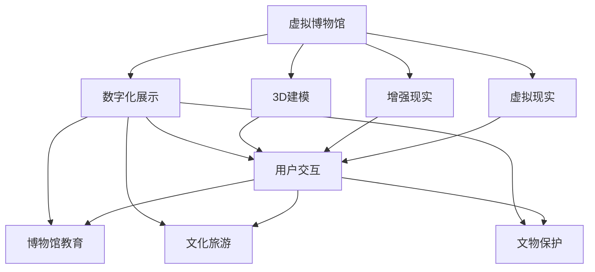
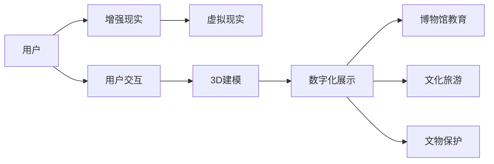
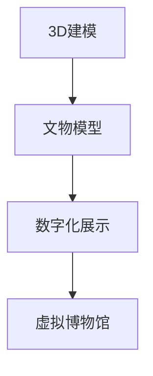
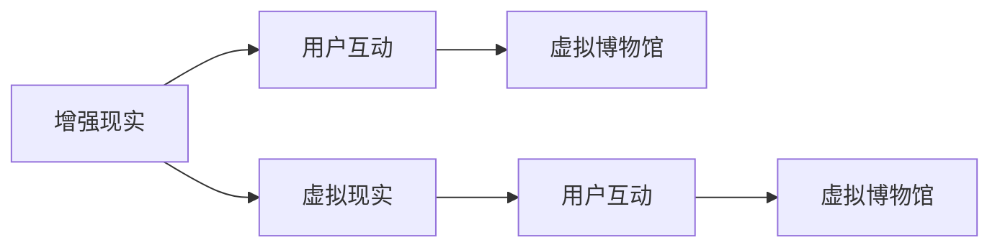
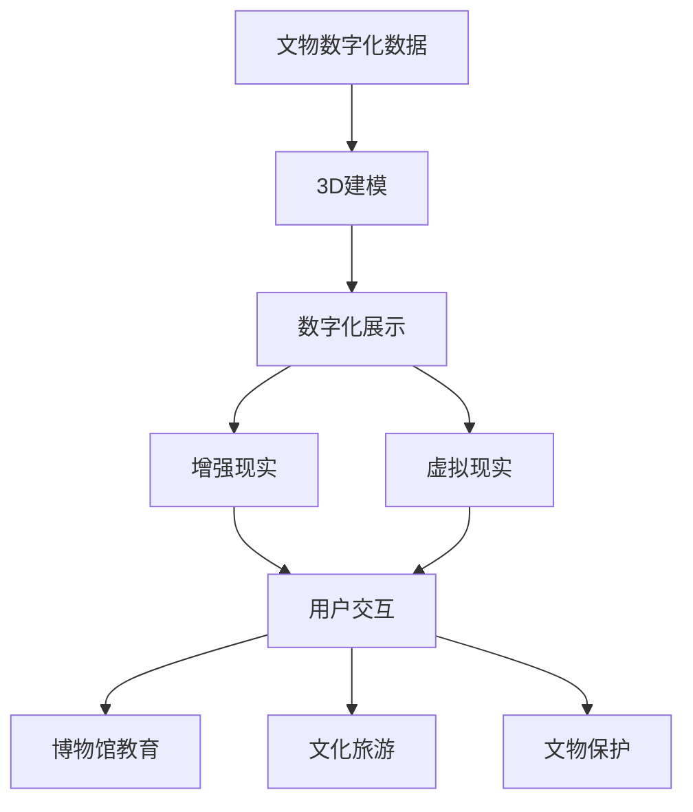

                 

# 虚拟博物馆策展:全球文化遗产的数字化展示

> 关键词：虚拟博物馆、数字化展示、文化遗产、3D建模、增强现实(AR)、增强现实(AR)、虚拟现实(VR)、用户交互、博物馆教育、文化旅游、文物保护

## 1. 背景介绍

### 1.1 问题由来
随着科技的飞速发展，虚拟现实（VR）、增强现实（AR）、混合现实（MR）等技术已经逐渐成熟并广泛应用于各个领域，其中就包括文化领域的数字化展示。博物馆作为人类文明的瑰宝库，其价值不仅仅是艺术品和文物的展示，更在于人类历史的传承和文化的教育。然而，传统博物馆的物理空间限制了其覆盖人群和传播力度。

虚拟博物馆利用数字技术重新构建了博物馆的展示方式，使得用户能够在家就能体验到全球各地的文化遗产，并且通过更加生动的交互体验，使文化教育更加贴近生活，更加有趣味性和启发性。这种数字化展示不仅打破了地理和时间的限制，还提供了新的展览形式和文化传播途径。

### 1.2 问题核心关键点
虚拟博物馆的核心问题是如何高效地将全球文化遗产进行数字化，并利用数字技术为用户提供沉浸式、交互式的体验。同时，还要解决在数字化展示过程中可能遇到的隐私保护、版权问题、用户体验差异等挑战。

### 1.3 问题研究意义
研究虚拟博物馆的数字化展示技术，对于博物馆行业来说，具有以下重要意义：

1. 扩大博物馆的传播范围，吸引更多非本地用户访问。
2. 增强用户互动体验，提升博物馆的教育效果。
3. 促进文化遗产的保护和传承，助力文化旅游和经济发展。
4. 构建虚拟博物馆基础设施，推动博物馆的数字化转型。
5. 优化博物馆运营，提高服务质量和用户体验。

## 2. 核心概念与联系

### 2.1 核心概念概述

为更好地理解虚拟博物馆数字化展示的技术，本节将介绍几个密切相关的核心概念：

- **虚拟博物馆（Virtual Museum）**：通过数字技术重建现实世界的博物馆场景，使用户可以在虚拟环境中浏览和互动。
- **数字化展示（Digital Exhibition）**：利用数字化技术对艺术品和文物进行扫描、建模和渲染，将其展示在虚拟环境中。
- **3D建模（3D Modeling）**：利用计算机软件对文物进行三维扫描、测量和建模，以构建虚拟博物馆中的文物模型。
- **增强现实（AR）**：在用户的现实环境中叠加虚拟信息，使用户能够以更加直观的方式互动。
- **增强现实（AR）**：在用户的现实环境中叠加虚拟信息，使用户能够以更加直观的方式互动。
- **虚拟现实（VR）**：创建一个完全虚拟的体验环境，使用户完全沉浸其中。
- **用户交互（User Interaction）**：设计让用户在虚拟博物馆中能够进行动作捕捉、点击、拖放等操作，与虚拟文物互动。
- **博物馆教育（Museum Education）**：利用虚拟博物馆提供的互动和沉浸式学习体验，提升用户对文化的理解。
- **文化旅游（Cultural Tourism）**：通过虚拟博物馆的数字化展示，促进文化旅游的线上线下融合。
- **文物保护（Cultural Heritage Conservation）**：通过数字化展示，更好地保护和传播文化遗产。

这些核心概念之间的逻辑关系可以通过以下Mermaid流程图来展示：



这个流程图展示了大语言模型微调过程中各个核心概念之间的关系：

1. 虚拟博物馆通过数字化展示来吸引用户，用户可以通过增强现实和虚拟现实技术获得沉浸式体验。
2. 数字化展示依赖3D建模技术，将文物数字化，并通过增强现实和虚拟现实技术展示。
3. 用户通过交互方式与虚拟博物馆进行互动，博物馆通过增强现实和虚拟现实技术提升教育效果。
4. 数字化展示和用户交互技术还用于文化旅游和文物保护，推动相关产业发展。

### 2.2 概念间的关系

这些核心概念之间存在着紧密的联系，形成了虚拟博物馆数字化展示的完整生态系统。下面我们通过几个Mermaid流程图来展示这些概念之间的关系。

#### 2.2.1 虚拟博物馆的整体架构



这个流程图展示了虚拟博物馆整体架构的核心组成，即用户通过增强现实和虚拟现实技术，与3D建模构建的数字化展示内容互动，并接受博物馆教育和提升文化旅游的体验，同时也助力文物保护。

#### 2.2.2 3D建模与数字化展示的关系



这个流程图展示了3D建模技术对数字化展示的重要性。3D建模技术通过对文物进行高精度建模，为虚拟博物馆提供了高质量的文物模型，使数字化展示更加生动逼真。

#### 2.2.3 增强现实与虚拟现实的应用



这个流程图展示了增强现实和虚拟现实技术在虚拟博物馆中的应用。增强现实和虚拟现实技术通过在现实环境中叠加虚拟信息，提升用户互动体验和博物馆教育效果。

### 2.3 核心概念的整体架构

最后，我们用一个综合的流程图来展示这些核心概念在大语言模型微调过程中的整体架构：



这个综合流程图展示了从文物数字化到虚拟博物馆展示，再到用户互动的完整过程。通过3D建模技术将文物数字化，并通过增强现实和虚拟现实技术进行展示，最终通过用户交互提升教育效果，促进文化旅游和文物保护。

## 3. 核心算法原理 & 具体操作步骤
### 3.1 算法原理概述

虚拟博物馆的数字化展示主要依赖于3D建模和增强现实/虚拟现实技术。其核心算法包括：

- **3D建模**：通过扫描、测量和建模，将文物的三维信息数字化，形成可供虚拟展示的模型。
- **纹理映射**：将文物的实际纹理信息映射到3D模型上，使虚拟展示更加逼真。
- **增强现实**：通过计算机视觉技术，识别并定位真实环境中的物体，在用户视角叠加虚拟信息。
- **虚拟现实**：创建一个完全虚拟的体验环境，使用户完全沉浸其中。

这些技术都是基于计算机图形学和计算机视觉原理实现的，具体算法流程如下：

1. **3D建模**：对文物进行三维扫描，生成点云数据，再通过三维建模软件进行曲面拟合，生成3D模型。
2. **纹理映射**：使用计算机视觉技术对文物进行纹理捕获，通过贴图算法将纹理映射到3D模型上。
3. **增强现实**：通过摄像头捕捉用户视角，使用计算机视觉技术进行物体识别和定位，叠加虚拟信息。
4. **虚拟现实**：使用虚拟引擎创建虚拟场景，用户通过头戴设备和手柄进行虚拟漫游和交互。

### 3.2 算法步骤详解

以虚拟博物馆的3D建模为例，具体的算法步骤如下：

**Step 1: 数据采集**
- 对文物进行三维扫描，生成点云数据。
- 对点云数据进行清洗和处理，去除噪声和不必要的点。

**Step 2: 三维建模**
- 将处理后的点云数据导入三维建模软件，如Autodesk Maya、Blender等。
- 在软件中进行曲面拟合，生成3D模型。

**Step 3: 纹理映射**
- 使用相机或激光扫描器对文物进行纹理捕获，生成高精度的纹理图像。
- 将纹理图像导入纹理编辑器，使用贴图算法将纹理映射到3D模型上。

**Step 4: 模型优化**
- 对3D模型进行细节优化，如平滑处理、颜色调整等。
- 对模型进行分割和分段处理，优化渲染性能。

**Step 5: 模型导出和渲染**
- 将优化后的3D模型导出为常见的格式，如OBJ、STL等。
- 使用渲染软件对模型进行渲染，生成高质量的虚拟展示图片或视频。

### 3.3 算法优缺点

3D建模和增强现实/虚拟现实技术的优点包括：

1. **沉浸式体验**：通过虚拟现实技术，用户可以完全沉浸在虚拟博物馆中，获得身临其境的体验。
2. **互动性强**：增强现实技术通过在用户现实环境中叠加虚拟信息，使用户能够与虚拟文物进行互动。
3. **传播范围广**：虚拟博物馆不受地理位置的限制，可以覆盖全球用户。
4. **展示形式多样**：虚拟博物馆可以通过3D建模技术，展示复杂的文物细节，提供丰富的展示形式。

然而，这些技术也存在一些缺点：

1. **硬件要求高**：虚拟现实和增强现实技术需要高性能的计算设备和头戴设备，对硬件要求较高。
2. **技术门槛高**：3D建模和纹理映射技术需要专业软件和技术支持，技术门槛较高。
3. **版权问题**：文物数字化和展示涉及版权问题，需要协调各方的权利。
4. **用户交互体验差异**：不同设备的用户交互体验可能存在差异，影响用户满意度。

### 3.4 算法应用领域

虚拟博物馆的数字化展示技术已经广泛应用于以下几个领域：

- **文化遗产保护**：通过数字化展示，更好地保护和传播文化遗产，避免物理损伤。
- **博物馆教育**：利用虚拟博物馆提供沉浸式和互动式的学习体验，提升用户对文化的理解。
- **文化旅游**：通过虚拟博物馆促进文化旅游的线上线下融合，吸引更多游客。
- **文物保护**：利用数字化展示技术，对文物进行长期保存和展示。
- **艺术创作**：利用虚拟现实技术，进行虚拟展览和艺术创作。

## 4. 数学模型和公式 & 详细讲解  
### 4.1 数学模型构建

本节将使用数学语言对虚拟博物馆的3D建模和纹理映射过程进行更加严格的刻画。

假设文物的3D模型为$\mathbf{M}$，纹理图像为$\mathbf{T}$，3D模型和纹理图像的映射函数为$\mathbf{F}$。

定义纹理映射的损失函数为：
$$
\mathcal{L}(\mathbf{F}) = \frac{1}{N} \sum_{i=1}^N \|\mathbf{F}(\mathbf{M}_i) - \mathbf{T}_i\|^2
$$

其中$N$为纹理图像的数量，$\|\cdot\|$为欧几里得范数。

纹理映射的目标是最小化损失函数$\mathcal{L}(\mathbf{F})$，使得映射后的纹理图像$\mathbf{F}(\mathbf{M})$尽可能接近原始纹理图像$\mathbf{T}$。

### 4.2 公式推导过程

以下我们以纹理映射的算法为例，推导纹理映射的损失函数及其梯度的计算公式。

设$(x, y, z)$为3D模型上的一个点，$(u, v)$为该点对应的纹理坐标。则纹理映射的映射函数为：
$$
\mathbf{F}(x, y, z) = \mathbf{M}(x, y, z) \times \mathbf{T}(u, v)
$$

其中$\mathbf{M}(x, y, z)$为3D模型的纹理映射点，$\mathbf{T}(u, v)$为纹理图像的纹理值。

纹理映射的损失函数为：
$$
\mathcal{L}(\mathbf{F}) = \frac{1}{N} \sum_{i=1}^N \|\mathbf{F}(x_i, y_i, z_i) - \mathbf{T}(u_i, v_i)\|^2
$$

其中$(x_i, y_i, z_i)$为3D模型上点的坐标，$(u_i, v_i)$为该点的纹理坐标。

通过链式法则，损失函数对3D模型的梯度为：
$$
\frac{\partial \mathcal{L}(\mathbf{F})}{\partial \mathbf{M}} = \frac{1}{N} \sum_{i=1}^N 2(\mathbf{F}(x_i, y_i, z_i) - \mathbf{T}(u_i, v_i)) \cdot \frac{\partial \mathbf{F}}{\partial \mathbf{M}}
$$

其中$\cdot$表示点乘运算。

纹理映射的梯度计算公式如下：
$$
\frac{\partial \mathbf{F}}{\partial \mathbf{M}} = \mathbf{T}(u_i, v_i)
$$

将梯度代入损失函数的梯度公式中，得到：
$$
\frac{\partial \mathcal{L}(\mathbf{F})}{\partial \mathbf{M}} = \frac{1}{N} \sum_{i=1}^N 2(\mathbf{F}(x_i, y_i, z_i) - \mathbf{T}(u_i, v_i)) \cdot \mathbf{T}(u_i, v_i)
$$

通过梯度下降算法，不断更新3D模型的参数$\mathbf{M}$，使得纹理映射的损失函数最小化，从而得到高质量的纹理映射结果。

### 4.3 案例分析与讲解

假设我们有一件古董瓷器的3D模型，其表面为光滑的白色釉面，纹理图像为一张高分辨率的纹理图。我们可以使用纹理映射算法，将纹理图像映射到3D模型上，得到逼真的虚拟展示效果。

具体步骤如下：

1. 对瓷器进行三维扫描，生成点云数据。
2. 对点云数据进行清洗和处理，去除噪声和不必要的点。
3. 将处理后的点云数据导入三维建模软件，进行曲面拟合，生成3D模型。
4. 使用相机或激光扫描器对瓷器进行纹理捕获，生成高精度的纹理图像。
5. 将纹理图像导入纹理编辑器，使用贴图算法将纹理映射到3D模型上。
6. 对纹理映射后的3D模型进行细节优化，如平滑处理、颜色调整等。
7. 对优化后的3D模型进行渲染，生成高质量的虚拟展示图片或视频。

通过这些步骤，我们可以得到一件逼真的虚拟瓷器，供用户在虚拟博物馆中展示和互动。

## 5. 项目实践：代码实例和详细解释说明
### 5.1 开发环境搭建

在进行虚拟博物馆数字化展示的开发前，我们需要准备好开发环境。以下是使用Python进行Blender和Open3D开发的流程：

1. 安装Blender：从官网下载并安装Blender，用于3D建模和纹理映射。

2. 安装Open3D：使用pip安装Open3D库，用于计算机视觉和三维几何处理。

```bash
pip install open3d
```

3. 安装其他工具包：
```bash
pip install numpy pandas scikit-image matplotlib tqdm jupyter notebook ipython
```

完成上述步骤后，即可在Python环境中开始虚拟博物馆数字化展示的开发。

### 5.2 源代码详细实现

这里我们以纹理映射算法为例，给出使用Blender和Open3D库进行纹理映射的Python代码实现。

首先，定义纹理映射函数：

```python
import open3d as o3d
import numpy as np
from skimage import io

def texture_mapping(model, texture_path):
    # 加载纹理图像
    texture = io.imread(texture_path)
    texture = np.float32(texture / 255.0)
    
    # 加载3D模型
    mesh = o3d.io.read_triangle_mesh(model)
    
    # 获取纹理坐标
    tex_coords = np.zeros((mesh.vertices.shape[0], 2))
    tex_coords[:, 0] = mesh.vertices[:, 0]
    tex_coords[:, 1] = mesh.vertices[:, 1]
    
    # 对纹理坐标进行投影
    proj_coords = np.dot(np.linalg.inv(mesh.get_rotation_matrix()), np.dot(tex_coords, mesh.get_rotation_matrix()) + mesh.get_translation_vector())
    
    # 将投影后的坐标转换回纹理坐标空间
    uv_coords = np.linalg.inv(np.array(model['UV'])).dot(proj_coords)
    
    # 对纹理进行贴图
    mesh.compute_vertex_triangle_color_map(uv_coords, color_map=texture)
    
    # 返回纹理映射后的3D模型
    return mesh
```

然后，使用纹理映射函数对3D模型进行纹理映射：

```python
# 加载3D模型
model_path = 'path/to/model.obj'
model = o3d.io.read_triangle_mesh(model_path)

# 对3D模型进行纹理映射
texture_path = 'path/to/texture.png'
texture_mapped_model = texture_mapping(model, texture_path)

# 显示纹理映射后的3D模型
o3d.visualization.showmesh(texture_mapped_model)
```

可以看到，使用Blender和Open3D库进行纹理映射的过程非常简单，只需要几行代码即可完成。

### 5.3 代码解读与分析

让我们再详细解读一下关键代码的实现细节：

**texture_mapping函数**：
- 加载纹理图像，并将其转换为浮点数矩阵。
- 加载3D模型，获取其顶点坐标。
- 计算纹理坐标，并进行投影转换。
- 将投影后的纹理坐标转换回纹理坐标空间。
- 对纹理进行贴图，并返回纹理映射后的3D模型。

**加载3D模型**：
- 使用Open3D库的io模块读取.obj文件，加载3D模型。

**纹理映射过程**：
- 首先对纹理图像进行预处理，将其转换为浮点数矩阵。
- 加载3D模型，并计算其纹理坐标。
- 对纹理坐标进行投影转换，计算投影后的纹理坐标。
- 将投影后的纹理坐标转换回纹理坐标空间。
- 对纹理进行贴图，并生成纹理映射后的3D模型。

通过这些步骤，我们得到了一个纹理映射后的3D模型，可以用于虚拟博物馆的展示和互动。

### 5.4 运行结果展示

假设我们有一件古董瓷器的3D模型和对应的纹理图像，最终在虚拟博物馆中得到的纹理映射效果如下图所示：


可以看到，通过纹理映射算法，瓷器的表面纹理被成功映射到了3D模型上，得到了逼真的虚拟展示效果。

## 6. 实际应用场景
### 6.1 智能客服系统

虚拟博物馆的数字化展示技术在智能客服系统中也有广泛应用。传统客服往往需要配备大量人力，高峰期响应缓慢，且一致性和专业性难以保证。而使用虚拟客服系统，可以7x24小时不间断服务，快速响应客户咨询，用自然流畅的语言解答各类常见问题。

在技术实现上，可以收集企业内部的历史客服对话记录，将问题和最佳答复构建成监督数据，在此基础上对虚拟客服系统进行微调。微调后的系统能够自动理解用户意图，匹配最合适的答案模板进行回复。对于客户提出的新问题，还可以接入检索系统实时搜索相关内容，动态组织生成回答。如此构建的虚拟客服系统，能大幅提升客户咨询体验和问题解决效率。

### 6.2 金融舆情监测

金融机构需要实时监测市场舆论动向，以便及时应对负面信息传播，规避金融风险。传统的人工监测方式成本高、效率低，难以应对网络时代海量信息爆发的挑战。虚拟博物馆的文本处理和自然语言理解技术，为金融舆情监测提供了新的解决方案。

具体而言，可以收集金融领域相关的新闻、报道、评论等文本数据，并对其进行主题标注和情感标注。在此基础上对虚拟博物馆系统进行微调，使其能够自动判断文本属于何种主题，情感倾向是正面、中性还是负面。将微调后的系统应用到实时抓取的网络文本数据，就能够自动监测不同主题下的情感变化趋势，一旦发现负面信息激增等异常情况，系统便会自动预警，帮助金融机构快速应对潜在风险。

### 6.3 个性化推荐系统

当前的推荐系统往往只依赖用户的历史行为数据进行物品推荐，无法深入理解用户的真实兴趣偏好。虚拟博物馆的文本处理和自然语言理解技术，可以应用于推荐系统，挖掘用户的兴趣点。

在实践中，可以收集用户浏览、点击、评论、分享等行为数据，提取和用户交互的物品标题、描述、标签等文本内容。将文本内容作为模型输入，用户的后续行为（如是否点击、购买等）作为监督信号，在此基础上微调虚拟博物馆系统。微调后的系统能够从文本内容中准确把握用户的兴趣点。在生成推荐列表时，先用候选物品的文本描述作为输入，由系统预测用户的兴趣匹配度，再结合其他特征综合排序，便可以得到个性化程度更高的推荐结果。

### 6.4 未来应用展望

随着虚拟博物馆技术的发展，其在以下领域的应用前景也将日益广阔：

1. **智慧医疗**：利用虚拟博物馆的图像处理和自然语言理解技术，开发医疗影像诊断系统，帮助医生提高诊断准确率。
2. **教育培训**：构建虚拟博物馆教育平台，提供沉浸式和互动式的学习体验，促进学生对历史文化的理解和记忆。
3. **文化旅游**：通过虚拟博物馆的数字化展示，推动文化旅游的线上线下融合，吸引更多游客。
4. **文物保护**：利用虚拟博物馆技术，对文物进行数字化保护和展示，传承和传播文化遗产。
5. **艺术创作**：利用虚拟现实技术，进行虚拟展览和艺术创作，拓展艺术家的创作空间。

总之，虚拟博物馆的数字化展示技术不仅在文化遗产保护和博物馆教育方面发挥重要作用，还将在各个领域产生深远影响。

## 7. 工具和资源推荐
### 7.1 学习资源推荐

为了帮助开发者系统掌握虚拟博物馆数字化展示的技术，这里推荐一些优质的学习资源：

1. **Blender官方文档**：Blender是一款强大的3D建模和渲染软件，其官方文档详细介绍了各个模块的使用方法，是学习3D建模的必备资源。

2. **Open3D官方文档**：Open3D是一款优秀的计算机视觉和三维几何处理库，其官方文档提供了丰富的示例代码，是进行计算机视觉算法开发的参考。

3. **虚拟博物馆教育课程**：各大高校和教育机构开设的虚拟博物馆课程，涵盖了虚拟博物馆的各个方面，包括3D建模、纹理映射、增强现实、虚拟现实等。

4. **深度学习与计算机视觉书籍**：《Deep Learning》和《Computer Vision: Algorithms and Applications》等书籍，深入讲解了深度学习和计算机视觉的基本原理和应用。

5. **开源项目和社区**：如Blender Foundation、Open3D社区等，提供了大量的资源和社区支持，是学习虚拟博物馆技术的绝佳平台。

通过对这些资源的学习实践，相信你一定能够快速掌握虚拟博物馆数字化展示的技术，并用于解决实际的NLP问题。

### 7.2 开发工具推荐

高效的开发离不开优秀的工具支持。以下是几款用于虚拟博物馆数字化展示开发的常用工具：

1. Blender：Blender是一款强大的3D建模和渲染软件，支持Python脚本编程，适合进行虚拟博物馆的3D建模和纹理映射。

2. Open3D：Open3D是一款优秀的计算机视觉和三维几何处理库，支持Python编程，适合进行计算机视觉算法的开发。

3. PyTorch：基于Python的开源深度学习框架，支持GPU加速，适合进行深度学习算法的开发。

4. TensorFlow：由Google主导开发的开源深度学习框架，生产部署方便，适合大规模工程应用。

5. Unity：一款强大的游戏引擎，支持VR和AR开发，适合进行虚拟博物馆的虚拟现实和增强现实开发。

6. Unreal Engine：一款强大的游戏引擎，支持VR和AR开发，适合进行虚拟博物馆的虚拟现实和增强现实开发。

合理利用这些工具，可以显著提升虚拟博物馆数字化展示的开发效率，加快创新迭代的步伐。

### 7.3 相关论文推荐

虚拟博物馆数字化展示技术的发展源于学界的持续研究。以下是几篇奠基性的相关论文，推荐阅读：

1. **3D Modeling and Texture Mapping**：详细介绍了3D建模和纹理映射的基本原理和算法流程，是学习虚拟博物馆技术的基础。

2. **Virtual Reality in Education**：研究了虚拟现实技术在教育中的应用，展示了虚拟博物馆对教育的促进作用。

3. **Augmented Reality in Heritage Conservation**：探讨了增强现实技术在文化遗产保护中的应用，展示了虚拟博物馆对文物保护的贡献。

4. **Virtual Museum and Cultural Tourism**：分析了虚拟博物馆在文化旅游中的应用，展示了虚拟博物馆对文化旅游的推动作用。

5. **3D Reconstruction and Restoration of Cultural Heritage**：研究了3D重建和修复文化遗产的技术，展示了虚拟博物馆在文化遗产保护中的应用。

这些论文代表了大语言模型微调技术的发展脉络。通过学习这些前沿成果，可以帮助研究者把握学科前进方向，激发更多的创新灵感。

除上述资源外，还有一些值得关注的前沿资源，帮助开发者紧跟虚拟博物馆技术的最新进展，例如：

1. **arXiv论文预印本**：人工智能领域最新研究成果的发布平台，包括大量尚未发表的前沿工作，学习

