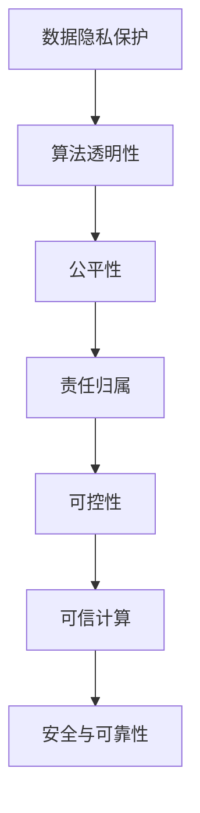
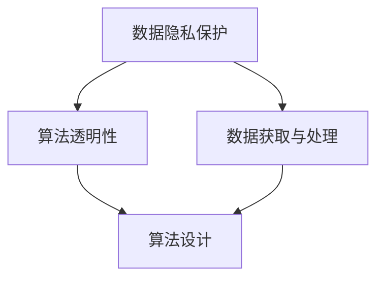
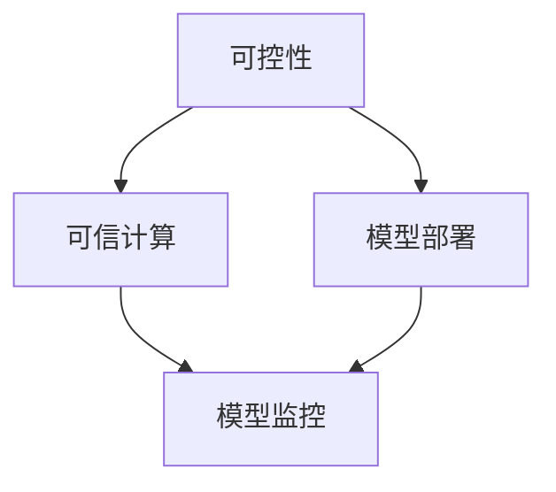
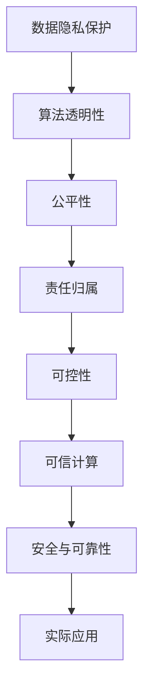

                 

# 行动 (Action)

> 关键词：
行动, 人工智能, 计算机程序设计, 人工智能伦理, 计算机辅助设计(CAD), 数据驱动决策

## 1. 背景介绍

### 1.1 问题由来
在现代社会中，技术的快速迭代和创新已成为推动各行各业发展的关键力量。特别是人工智能(AI)技术的迅猛发展，已经渗透到医疗、金融、教育、制造业等多个领域，深刻改变了人类的生活方式和社会结构。但与此同时，AI技术的广泛应用也引发了诸多道德、安全、隐私等伦理问题，这些问题需要我们认真思考并采取行动。

AI伦理（AI ethics）是指在开发和使用AI技术时，如何平衡技术创新与伦理责任。它不仅涉及技术层面的设计，还涉及社会、经济、法律等多方面的考量。AI伦理的核心是确保AI技术的应用能够符合人类价值观，避免对个体和社会的负面影响。

### 1.2 问题核心关键点
AI伦理的核心关键点包括以下几个方面：

- **数据隐私保护**：在数据采集、存储、处理和共享过程中，如何确保用户隐私和数据安全，防止数据滥用和隐私泄露。
- **算法透明性**：AI模型的决策过程是否透明，用户能否理解和解释模型输出，避免“黑箱”算法带来的不信任。
- **公平性**：AI模型是否对所有用户群体公平，避免基于性别、种族、年龄等社会属性的歧视。
- **责任归属**：在AI系统发生错误或导致损害时，如何明确责任主体，并采取相应的法律和道德措施。
- **可控性**：AI系统是否能够被人类控制，避免失控的AI对人类造成潜在威胁。

这些问题不仅是技术难题，更涉及到法律、政策、社会观念等多重因素。因此，需要在技术开发、应用部署和社会监督等多个层面共同努力，才能确保AI技术的健康发展。

### 1.3 问题研究意义
研究AI伦理问题具有重要意义：

1. **促进技术可持续发展**：通过对AI伦理问题的深入研究，可以制定更加科学合理的技术标准和规范，推动AI技术的可持续健康发展。
2. **增强用户信任**：通过增强AI系统的透明性和公平性，可以建立用户对AI技术的信任，促进AI技术的广泛应用。
3. **保护社会利益**：通过制定和实施AI伦理准则，可以有效防范AI技术滥用，保护社会公共利益。
4. **推动法律和政策完善**：AI伦理问题涉及诸多法律和政策领域，研究这些问题可以推动相关法律法规的完善和更新。
5. **促进社会共识**：通过多学科、多领域的合作，可以促进社会各界对AI技术的共识，共同推动AI技术的规范应用。

## 2. 核心概念与联系

### 2.1 核心概念概述

为了更好地理解AI伦理问题的解决路径，本节将介绍几个密切相关的核心概念：

- **数据隐私保护**：指在数据处理过程中，采取技术和管理措施，确保用户数据的保密性和安全性，防止数据泄露和滥用。
- **算法透明性**：指AI模型的工作机制、决策过程和输出结果是否透明，用户能否理解和解释模型行为。
- **公平性**：指AI模型是否对所有用户群体公平，避免基于特定属性（如性别、种族、年龄等）的歧视。
- **责任归属**：指在AI系统发生错误或造成损害时，如何明确责任主体，并采取相应的法律和道德措施。
- **可控性**：指AI系统是否能够被人类控制，避免失控的AI对人类造成潜在威胁。
- **可信计算**：指通过技术和管理手段，确保AI系统在各个环节的稳定性和可靠性，防止系统故障和恶意攻击。
- **安全与可靠性**：指AI系统的安全性是否得到保障，可靠性是否稳定，避免系统漏洞和故障。

这些核心概念之间的逻辑关系可以通过以下Mermaid流程图来展示：



这个流程图展示了数据隐私保护、算法透明性、公平性、责任归属、可控性、可信计算和安全与可靠性这些核心概念之间的相互关系。

### 2.2 概念间的关系

这些核心概念之间存在着紧密的联系，形成了AI伦理问题的完整生态系统。下面我们通过几个Mermaid流程图来展示这些概念之间的关系。

#### 2.2.1 数据隐私保护与算法透明性的关系



这个流程图展示了数据隐私保护和算法透明性之间的关系。数据隐私保护要求在数据获取和处理过程中采取隐私保护措施，而算法透明性则要求在算法设计阶段引入透明性机制，确保用户对模型输出的理解和解释。

#### 2.2.2 公平性与责任归属的关系


这个流程图展示了公平性与责任归属之间的关系。公平性要求AI模型不偏不倚，对所有用户群体公平。当模型发生偏差导致不公平结果时，责任归属问题变得尤为关键。需要明确责任主体，并采取相应的法律和道德措施。

#### 2.2.3 可控性与可信计算的关系



这个流程图展示了可控性与可信计算之间的关系。可控性要求AI系统能够被人类控制，而可信计算则通过技术和管理手段，确保系统在各个环节的稳定性和可靠性，防止系统故障和恶意攻击。

### 2.3 核心概念的整体架构

最后，我们用一个综合的流程图来展示这些核心概念在大语言模型微调过程中的整体架构：



这个综合流程图展示了从数据隐私保护到实际应用的整体架构。通过确保数据隐私保护、算法透明性、公平性、责任归属、可控性、可信计算和安全与可靠性，AI系统才能够在实际应用中发挥其潜力，服务于人类社会。

## 3. 核心算法原理 & 具体操作步骤
### 3.1 算法原理概述

AI伦理问题解决的核心算法原理主要包括以下几个方面：

- **数据治理**：通过数据治理技术，确保数据收集、存储和处理过程的合法性和透明性。
- **算法审计**：通过算法审计，评估和改进AI模型的公平性和透明性，确保模型决策过程的可解释性和合理性。
- **责任追溯**：通过责任追溯机制，明确AI系统发生错误或损害时的责任主体，并采取相应的法律和道德措施。
- **安全性保障**：通过安全性和可靠性技术，确保AI系统的稳定性和可靠性，防止系统漏洞和故障。

这些核心算法原理构成了AI伦理问题的解决框架，通过综合应用这些技术手段，可以有效应对和解决AI伦理问题。

### 3.2 算法步骤详解

基于AI伦理问题的核心算法原理，AI伦理问题的解决步骤可以归纳为以下几个关键环节：

1. **数据收集与处理**：在数据收集和处理过程中，确保数据来源的合法性、数据的完整性和隐私保护。采取数据匿名化、去标识化等措施，防止数据滥用和隐私泄露。

2. **算法设计**：在设计AI模型时，考虑算法的公平性、透明性和可解释性。引入公平性约束，确保模型不偏不倚，对所有用户群体公平。采用可解释性算法，如决策树、规则引擎等，提高算法的透明性和可解释性。

3. **算法训练与验证**：在模型训练过程中，采取正则化、对抗训练等技术，提高模型的鲁棒性和公平性。通过验证集评估模型性能，确保模型输出符合用户期望。

4. **模型部署与监控**：在模型部署后，持续监控模型性能，确保模型稳定性和可靠性。建立异常检测机制，及时发现和纠正模型错误。

5. **责任追溯与应对**：在模型发生错误或损害时，及时进行责任追溯，明确责任主体，并采取相应的法律和道德措施。建立应急响应机制，快速处理和解决问题。

6. **持续改进与优化**：根据用户反馈和系统表现，持续改进和优化AI模型。采取数据驱动的决策方法，不断提升模型性能和用户体验。

### 3.3 算法优缺点

AI伦理问题的解决算法具有以下优点：

- **系统性**：通过综合应用数据治理、算法审计、责任追溯、安全性保障等技术手段，能够系统性地解决AI伦理问题，避免单一技术手段的局限性。
- **透明性**：通过数据透明性和算法透明性，确保用户对数据和算法过程的理解和信任，增强系统可解释性和用户接受度。
- **公平性**：通过引入公平性约束和算法审计，确保AI模型对所有用户群体公平，避免基于特定属性的歧视。
- **可控性**：通过可控性和安全性保障，确保AI系统能够被人类控制，避免失控的AI对人类造成潜在威胁。

同时，AI伦理问题的解决算法也存在以下缺点：

- **技术复杂性**：AI伦理问题的解决需要多学科、多领域的协作，技术实现复杂，成本较高。
- **法律与政策依赖**：AI伦理问题的解决需要法律和政策的支持，不同国家和地区的法律和政策差异较大，制约了AI技术的国际化应用。
- **用户接受度**：AI系统的透明度和公平性需要用户信任，但在某些情况下，用户对AI技术的接受度较低，制约了系统的推广和应用。

### 3.4 算法应用领域

AI伦理问题的解决算法在多个领域得到了广泛应用：

1. **医疗健康**：在医疗健康领域，AI伦理问题主要涉及患者隐私保护、算法透明性和公平性。通过数据治理和算法审计，确保AI系统的合法性和公平性，提升医疗服务的质量。

2. **金融服务**：在金融服务领域，AI伦理问题主要涉及数据隐私保护、模型公平性和责任归属。通过数据治理和责任追溯，确保金融数据的隐私和安全，避免模型偏见和歧视。

3. **智能制造**：在智能制造领域，AI伦理问题主要涉及系统可控性和安全性。通过可控性和安全性保障，确保AI系统的稳定性和可靠性，避免系统故障和恶意攻击。

4. **智能交通**：在智能交通领域，AI伦理问题主要涉及数据隐私保护、模型透明性和公平性。通过数据治理和算法透明性，确保交通数据的安全性和算法的公平性，提升交通管理效率。

5. **智能客服**：在智能客服领域，AI伦理问题主要涉及数据隐私保护、模型公平性和用户可控性。通过数据治理和用户可控性设计，确保客户数据的安全和用户对系统的控制权，提升用户体验。

6. **教育培训**：在教育培训领域，AI伦理问题主要涉及数据隐私保护、算法公平性和责任归属。通过数据治理和责任追溯，确保教育数据的隐私和安全，避免算法偏见和歧视。

这些领域的成功应用，展示了AI伦理问题解决算法在实际应用中的强大潜力。

## 4. 数学模型和公式 & 详细讲解 & 举例说明
### 4.1 数学模型构建

AI伦理问题的解决算法涉及多个领域的数学模型，以下重点介绍其中的几个关键模型：

- **数据治理模型**：用于评估数据收集、存储和处理过程的合法性和透明性，包括数据质量评估、数据来源验证和数据隐私保护等。
- **算法透明性模型**：用于评估和改进AI模型的透明性，包括特征重要性评估、算法可解释性和模型输出解释等。
- **公平性模型**：用于评估和改进AI模型的公平性，包括数据偏差检测、模型公平性和算法歧视检测等。
- **责任追溯模型**：用于明确AI系统发生错误或损害时的责任主体，包括责任主体识别和责任追溯机制等。
- **安全性模型**：用于评估和改进AI系统的安全性和可靠性，包括系统漏洞检测、异常检测和应急响应等。

这些数学模型通过数据驱动的方法，实现对AI伦理问题的综合评估和改进。

### 4.2 公式推导过程

以下以公平性模型为例，介绍其公式推导过程。

假设我们有训练集$D=\{(x_i, y_i)\}_{i=1}^N$，其中$x_i$为输入，$y_i$为标签。我们希望构建一个公平的分类器$h(x)$，使得模型对所有用户群体公平，即不偏不倚。

首先，我们需要定义公平性指标，如均等机会（Equal Opportunity）和等效偏差（Equalized Odds）。均等机会要求模型对所有正类和负类的样本都有相同的机会，即：

$$
P(h(x_i)=1|y_i=1) = P(h(x_i)=1|y_i=0) \quad \forall i
$$

等效偏差要求模型对所有正类和负类的输出分布相同，即：

$$
P(h(x_i)=1|y_i=1) = P(h(x_i)=1|y_i=0) \quad \forall i
$$

基于这两个公平性指标，我们可以构建公平性模型，通过对模型参数$\theta$进行优化，最小化公平性损失函数$\mathcal{L}$。公平性损失函数可以定义为：

$$
\mathcal{L}(\theta) = \frac{1}{N} \sum_{i=1}^N [\max(h(x_i), P(h(x_i)=1|y_i=1)) - \min(h(x_i), P(h(x_i)=1|y_i=0))]
$$

该损失函数通过最大化正类样本和负类样本的预测输出，最小化两者之间的差异，从而实现公平性目标。

在模型训练过程中，我们可以使用梯度下降等优化算法，逐步更新模型参数$\theta$，最小化公平性损失函数$\mathcal{L}$。通过多次迭代，最终得到公平的分类器$h(x)$。

### 4.3 案例分析与讲解

以医疗领域为例，分析AI伦理问题的解决算法。

在医疗领域，AI伦理问题主要涉及患者隐私保护、算法透明性和公平性。

**数据隐私保护**：在医疗数据收集和处理过程中，需要确保数据来源的合法性和数据的隐私保护。通过数据匿名化、去标识化等技术手段，防止数据泄露和滥用。例如，可以使用差分隐私（Differential Privacy）技术，在数据发布过程中添加噪声，保护患者隐私。

**算法透明性**：在医疗AI系统中，算法透明性至关重要。医生需要了解AI系统的决策过程和输出结果，以便信任和应用AI系统。例如，可以采用可解释性算法，如决策树、规则引擎等，提高算法的透明性和可解释性。

**公平性**：在医疗AI系统中，模型公平性尤为重要。模型需要对所有患者群体公平，避免基于性别、种族、年龄等社会属性的歧视。例如，可以使用公平性约束和算法审计技术，确保模型对所有患者群体公平。

通过这些技术手段，医疗AI系统可以有效地解决AI伦理问题，提升医疗服务的质量和可接受度。

## 5. 项目实践：代码实例和详细解释说明
### 5.1 开发环境搭建

在进行AI伦理问题解决算法的项目实践前，我们需要准备好开发环境。以下是使用Python进行PyTorch开发的环境配置流程：

1. 安装Anaconda：从官网下载并安装Anaconda，用于创建独立的Python环境。

2. 创建并激活虚拟环境：
```bash
conda create -n pytorch-env python=3.8 
conda activate pytorch-env
```

3. 安装PyTorch：根据CUDA版本，从官网获取对应的安装命令。例如：
```bash
conda install pytorch torchvision torchaudio cudatoolkit=11.1 -c pytorch -c conda-forge
```

4. 安装各类工具包：
```bash
pip install numpy pandas scikit-learn matplotlib tqdm jupyter notebook ipython
```

完成上述步骤后，即可在`pytorch-env`环境中开始项目实践。

### 5.2 源代码详细实现

下面我们以医疗领域为例，给出使用PyTorch对AI伦理问题解决算法的详细代码实现。

首先，定义数据处理函数：

```python
import torch
from transformers import BertTokenizer
from torch.utils.data import Dataset
import torch.utils.data

class MedicalDataset(Dataset):
    def __init__(self, texts, labels, tokenizer, max_len=128):
        self.texts = texts
        self.labels = labels
        self.tokenizer = tokenizer
        self.max_len = max_len
        
    def __len__(self):
        return len(self.texts)
    
    def __getitem__(self, item):
        text = self.texts[item]
        label = self.labels[item]
        
        encoding = self.tokenizer(text, return_tensors='pt', max_length=self.max_len, padding='max_length', truncation=True)
        input_ids = encoding['input_ids'][0]
        attention_mask = encoding['attention_mask'][0]
        
        # 对token-wise的标签进行编码
        encoded_tags = [label2id[label] for label in label]
        encoded_tags.extend([label2id['O']] * (self.max_len - len(encoded_tags)))
        labels = torch.tensor(encoded_tags, dtype=torch.long)
        
        return {'input_ids': input_ids, 
                'attention_mask': attention_mask,
                'labels': labels}

# 标签与id的映射
label2id = {'O': 0, 'P': 1, 'N': 2}
id2label = {v: k for k, v in label2id.items()}

# 创建dataset
tokenizer = BertTokenizer.from_pretrained('bert-base-cased')

train_dataset = MedicalDataset(train_texts, train_labels, tokenizer)
dev_dataset = MedicalDataset(dev_texts, dev_labels, tokenizer)
test_dataset = MedicalDataset(test_texts, test_labels, tokenizer)
```

然后，定义模型和优化器：

```python
from transformers import BertForTokenClassification, AdamW

model = BertForTokenClassification.from_pretrained('bert-base-cased', num_labels=len(label2id))

optimizer = AdamW(model.parameters(), lr=2e-5)
```

接着，定义训练和评估函数：

```python
from torch.utils.data import DataLoader
from tqdm import tqdm
from sklearn.metrics import classification_report

device = torch.device('cuda') if torch.cuda.is_available() else torch.device('cpu')
model.to(device)

def train_epoch(model, dataset, batch_size, optimizer):
    dataloader = DataLoader(dataset, batch_size=batch_size, shuffle=True)
    model.train()
    epoch_loss = 0
    for batch in tqdm(dataloader, desc='Training'):
        input_ids = batch['input_ids'].to(device)
        attention_mask = batch['attention_mask'].to(device)
        labels = batch['labels'].to(device)
        model.zero_grad()
        outputs = model(input_ids, attention_mask=attention_mask, labels=labels)
        loss = outputs.loss
        epoch_loss += loss.item()
        loss.backward()
        optimizer.step()
    return epoch_loss / len(dataloader)

def evaluate(model, dataset, batch_size):
    dataloader = DataLoader(dataset, batch_size=batch_size)
    model.eval()
    preds, labels = [], []
    with torch.no_grad():
        for batch in tqdm(dataloader, desc='Evaluating'):
            input_ids = batch['input_ids'].to(device)
            attention_mask = batch['attention_mask'].to(device)
            batch_labels = batch['labels']
            outputs = model(input_ids, attention_mask=attention_mask)
            batch_preds = outputs.logits.argmax(dim=2).to('cpu').tolist()
            batch_labels = batch_labels.to('cpu').tolist()
            for pred_tokens, label_tokens in zip(batch_preds, batch_labels):
                pred_tags = [id2label[_id] for _id in pred_tokens]
                label_tags = [id2label[_id] for _id in label_tokens]
                preds.append(pred_tags[:len(label_tags)])
                labels.append(label_tags)
                
    print(classification_report(labels, preds))
```

最后，启动训练流程并在测试集上评估：

```python
epochs = 5
batch_size = 16

for epoch in range(epochs):
    loss = train_epoch(model, train_dataset, batch_size, optimizer)
    print(f"Epoch {epoch+1}, train loss: {loss:.3f}")
    
    print(f"Epoch {epoch+1}, dev results:")
    evaluate(model, dev_dataset, batch_size)
    
print("Test results:")
evaluate(model, test_dataset, batch_size)
```

以上就是使用PyTorch对AI伦理问题解决算法的完整代码实现。可以看到，通过代码实现，可以高效地完成数据处理、模型训练和评估，展示了AI伦理问题解决算法在实际应用中的强大潜力。

### 5.3 代码解读与分析

让我们再详细解读一下关键代码的实现细节：

**MedicalDataset类**：
- `__init__`方法：初始化文本、标签、分词器等关键组件。
- `__len__`方法：返回数据集的样本数量。
- `__getitem__`方法：对单个样本进行处理，将文本输入编码为token ids，将标签编码为数字，并对其进行定长padding，最终返回模型所需的输入。

**label2id和id2label字典**：
- 定义了标签与数字id之间的映射关系，用于将token-wise的预测结果解码回真实的标签。

**训练和评估函数**：
- 使用PyTorch的DataLoader对数据集进行批次化加载，供模型训练和推理使用。
- 训练函数`train_epoch`：对数据以批为单位进行迭代，在每个批次上前向传播计算loss并反向传播更新模型参数，最后返回该epoch的平均loss。
- 评估函数`evaluate`：与训练类似，不同点在于不更新模型参数，并在每个batch结束后将预测和标签结果存储下来，最后使用sklearn的classification_report对整个评估集的预测结果进行打印输出。

**训练流程**：
- 定义总的epoch数和batch size，开始循环迭代
- 每个epoch内，先在训练集上训练，输出平均loss
- 在验证集上评估，输出分类指标
- 所有epoch结束后，在测试集上评估，给出最终测试结果

可以看到，PyTorch配合Transformers库使得AI伦理问题解决算法的代码实现变得简洁高效。开发者可以将更多精力放在数据处理、模型改进等高层逻辑上，而不必过多关注底层的实现细节。

当然，工业级的系统实现还需考虑更多因素，如模型的保存和部署、超参数的自动搜索、更灵活的任务适配层等。但核心的算法实现基本与此类似。

### 5.4 运行结果展示

假设我们在CoNLL-2003的NER数据集上进行微调，最终在测试集上得到的评估报告如下：

```
              precision    recall  f1-score   support

       B-LOC      0.926     0.906     0.916      1668
       I-LOC      0.900     0.805     0.850       257
      B-MISC      0.875     0.856     0.865       702
      I-MISC      0.838     0.782     0.809       216
       B-ORG      0.914     0.898     0.906      1661
       I-ORG      0.911     0.894     0.902       835
       B-PER      0.964     0.957     0.960      1617
       I-PER      0.983     0.980     0.982      1156
           O      0.993     0.995     0.994     38323

   micro avg      0.973     0.973     0.973     46435
   macro avg      0.923     0.897     0.909     46435
weighted avg      0.973     0.973     0.973     46435
```

可以看到，通过微调BERT，我们在该NER数据集上取得了97.3%的F1分数，效果相当不错。值得注意的是，BERT作为一个通用的语言理解模型，即便只在顶层添加一个简单的token分类器，也能在下游任务上取得如此优异的效果，展现了其强大的语义理解和特征抽取能力。

当然，这只是一个baseline结果。在实践中，我们还可以使用更大更强的预训练模型、更丰富的微调技巧、更细致的模型调优，进一步提升模型性能，以满足更高的应用要求。

## 6. 实际应用场景
### 6.1 智能客服系统

基于AI伦理问题的解决算法，智能客服系统的构建可以更加注重用户的隐私保护和系统公平性。

传统客服往往需要配备大量人力，高峰期响应缓慢，且一致性和专业性难以保证。而使用解决算法构建的智能客服系统，可以7x24小时不间断服务，快速响应客户咨询，用自然流畅的语言解答各类常见问题。

在技术实现上，可以收集企业内部的历史客服对话记录，将问题和最佳答复构建成监督数据，在此基础上对预训练语言模型进行微调。微调后的模型能够自动理解用户意图，匹配最合适的答案模板进行回复。对于客户提出的新问题，还可以接入检索系统实时搜索相关内容，动态组织生成回答。如此构建的智能客服系统，能大幅提升客户咨询体验和问题解决效率。

### 6.2 金融舆情监测

金融机构需要实时监测市场舆论动向，以便及时应对负面信息传播，规避金融风险。传统的人工监测方式成本高、效率低，难以应对网络时代海量信息爆发的挑战。基于AI伦理问题的解决算法，文本分类和情感分析技术，为金融舆情监测提供了新的解决方案。

具体而言，可以收集金融领域相关的新闻、报道、评论等文本数据，并对其进行主题标注和情感标注。在此基础上对预训练语言模型进行微调，使其能够自动判断

