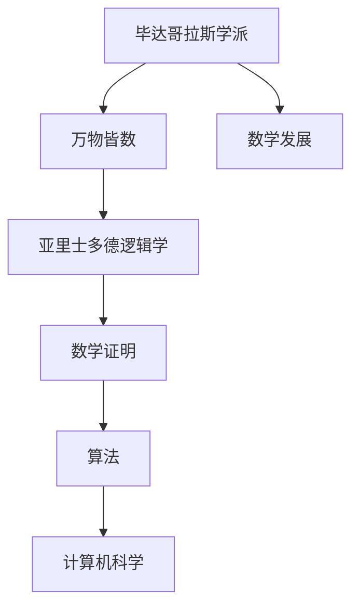
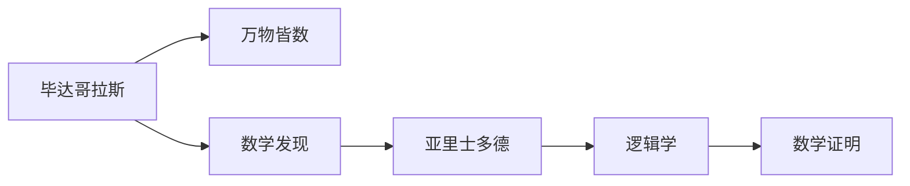
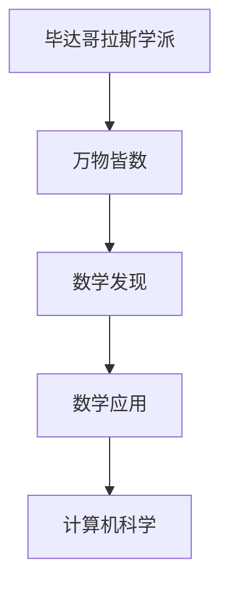
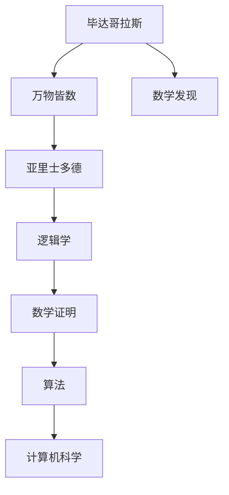

                 

# 计算：第一部分 计算的诞生 第 1 章 毕达哥拉斯的困惑 亚里士多德的逻辑学

> 关键词：数学历史, 计算起源, 毕达哥拉斯, 亚里士多德, 几何学, 逻辑学, 数学证明, 算法, 计算机科学

## 1. 背景介绍

### 1.1 问题由来

计算的起源可以追溯到古希腊时期，当时的数学家们对于数学和物理世界的探索，推动了计算技术的萌芽。本章将从毕达哥拉斯和亚里士多德的思想出发，探讨计算的早期形式及其在数学和哲学中的角色。

### 1.2 问题核心关键点

毕达哥拉斯的学派被认为是数学的奠基者之一，他们提出了“万物皆数”的理念，认为宇宙的秩序可以通过数学来解释。而亚里士多德的逻辑学则进一步发展了数学的严密性和系统性，奠定了数学证明的基础。

毕达哥拉斯和亚里士多德的思想不仅影响了数学的发展，也间接影响了计算机科学的诞生。计算的本质在于将复杂的问题转化为机械化的步骤，而数学和逻辑学则是实现这一转化的工具。

### 1.3 问题研究意义

研究毕达哥拉斯和亚里士多德的思想，有助于深入理解计算的起源和发展，以及其在数学和哲学中的地位。这对于理解现代计算机科学的基础和核心思想具有重要意义。

## 2. 核心概念与联系

### 2.1 核心概念概述

- **毕达哥拉斯学派**：古希腊数学家毕达哥拉斯及其学派提出了“万物皆数”的哲学观点，认为数学是理解自然界的基础。
- **亚里士多德逻辑学**：古希腊哲学家亚里士多德创立了逻辑学，通过三段论等形式化的推理方法，奠定了数学证明的基础。
- **数学证明**：通过逻辑推理，证明数学命题的正确性，是数学研究的重要方法。
- **算法**：为了解决特定问题而设计的一系列步骤，是计算机科学的核心概念。
- **计算机科学**：研究如何通过计算过程实现特定目标的学科，包括算法、数据结构、计算机体系结构等。

这些核心概念之间的逻辑关系可以通过以下Mermaid流程图来展示：



这个流程图展示了从毕达哥拉斯到亚里士多德，再到现代计算机科学的逻辑演进过程。

### 2.2 概念间的关系

这些核心概念之间存在着紧密的联系，形成了计算的完整生态系统。下面我通过几个Mermaid流程图来展示这些概念之间的关系。

#### 2.2.1 毕达哥拉斯和亚里士多德的关系



这个流程图展示了毕达哥拉斯和亚里士多德在数学和逻辑学上的联系，以及他们对数学证明的影响。

#### 2.2.2 亚里士多德和计算机科学的关系


这个流程图展示了亚里士多德的逻辑学如何通过数学证明，最终影响到了算法的产生，进而对计算机科学产生了深远的影响。

#### 2.2.3 毕达哥拉斯对现代计算机科学的影响



这个流程图展示了毕达哥拉斯的思想如何通过数学的应用，间接影响了现代计算机科学的发展。

### 2.3 核心概念的整体架构

最后，我们用一个综合的流程图来展示这些核心概念在大语言模型微调过程中的整体架构：



这个综合流程图展示了从毕达哥拉斯到亚里士多德，再到现代计算机科学的完整逻辑链条。

## 3. 核心算法原理 & 具体操作步骤
### 3.1 算法原理概述

基于毕达哥拉斯和亚里士多德的思想，我们可以将计算过程理解为一种形式化的逻辑推理过程。计算的核心在于将复杂的问题转化为一系列逻辑步骤，通过数学证明来确保每一步的正确性。

形式化地说，计算可以被看作一种将输入映射到输出的映射函数，即：

$$ f: D \rightarrow C $$

其中，$D$ 是输入空间，$C$ 是输出空间。计算的目标是设计一个算法 $f$，使得对于任意输入 $x \in D$，都能得到正确的输出 $y \in C$。

### 3.2 算法步骤详解

计算的实现通常分为以下几个步骤：

1. **问题建模**：将现实世界的问题抽象为数学模型，并定义输入和输出。
2. **算法设计**：设计一系列逻辑步骤，实现从输入到输出的映射。
3. **算法验证**：通过数学证明，验证算法的正确性和有效性。
4. **算法优化**：根据实际需求，对算法进行优化，提高计算效率和准确性。
5. **算法实现**：将算法转换为具体的计算步骤，实现计算过程。

下面以一个简单的例子来说明这些步骤：

**问题建模**：假设我们要计算一个三角形的面积，输入是三角形的底和高，输出是面积。

**算法设计**：设计一个函数 $f$，输入为底 $b$ 和高 $h$，输出为面积 $A$。根据三角形的面积公式，有：

$$ A = \frac{1}{2}bh $$

**算法验证**：通过代入具体的底和高的值，验证面积的计算结果是否正确。

**算法优化**：在实际应用中，可能需要针对不同的底和高的范围进行优化，例如对于非常小的底或高，可能需要引入误差控制。

**算法实现**：在计算机上实现上述函数，例如使用C语言编写：

```c
double calculateArea(double b, double h) {
    return 0.5 * b * h;
}
```

### 3.3 算法优缺点

**优点**：
- 形式化逻辑推理保证了计算的正确性。
- 算法的设计和验证过程促进了数学和计算机科学的发展。

**缺点**：
- 形式化逻辑推理可能过于繁琐，难以处理复杂问题。
- 算法的设计和验证过程需要深厚的数学和计算机科学基础。

### 3.4 算法应用领域

计算的思想和算法已经广泛应用于数学、物理学、计算机科学、工程学等多个领域。以下是几个典型的应用领域：

- **数学**：通过计算，验证数学定理的正确性，如欧拉公式 $e^{ix} = \cos x + i\sin x$。
- **物理学**：通过计算，解决复杂的物理问题，如牛顿力学中的运动方程。
- **计算机科学**：设计高效的算法，实现各种计算任务，如排序算法、图形算法等。
- **工程学**：通过计算，优化设计和制造过程，如计算流体力学、结构工程等。

## 4. 数学模型和公式 & 详细讲解 & 举例说明

### 4.1 数学模型构建

计算的核心在于数学模型的构建。一个数学模型通常包含以下几个部分：

- **变量定义**：定义模型的输入和输出变量。
- **模型方程**：描述输入和输出变量之间的关系。
- **约束条件**：限制模型方程的取值范围。

例如，计算三角形的面积问题可以构建如下数学模型：

- **变量定义**：设底为 $b$，高为 $h$，面积为 $A$。
- **模型方程**：面积 $A = \frac{1}{2}bh$。
- **约束条件**：底 $b > 0$，高 $h > 0$。

### 4.2 公式推导过程

以计算三角形面积为例，推导过程如下：

$$ A = \frac{1}{2}bh $$

**推导过程**：

1. **图形表示**：将三角形分为两个直角三角形，如图1所示。

   

2. **面积计算**：根据直角三角形的面积公式，有：

   $$ A_1 = \frac{1}{2}bh_1 $$
   $$ A_2 = \frac{1}{2}bh_2 $$

   因为 $h_1 = \frac{1}{2}h$，所以 $A_1 = \frac{1}{2}bh$。同理可得 $A_2 = \frac{1}{2}bh$。

   因此，三角形总面积 $A = A_1 + A_2 = \frac{1}{2}bh + \frac{1}{2}bh = \frac{1}{2}bh$。

   

3. **结论**：因此，三角形面积公式为 $A = \frac{1}{2}bh$。

### 4.3 案例分析与讲解

**案例分析**：假设我们要计算一个正方形边长为 $4$ 的面积。

**推导过程**：

- **模型方程**：正方形面积 $A = s^2$，其中 $s$ 为边长。
- **变量定义**：设边长为 $s = 4$。
- **计算结果**：$A = 4^2 = 16$。

因此，正方形面积为 $16$。

## 5. 项目实践：代码实例和详细解释说明

### 5.1 开发环境搭建

在进行计算的实践前，我们需要准备好开发环境。以下是使用Python进行PyTorch开发的环境配置流程：

1. 安装Anaconda：从官网下载并安装Anaconda，用于创建独立的Python环境。

2. 创建并激活虚拟环境：
```bash
conda create -n pytorch-env python=3.8 
conda activate pytorch-env
```

3. 安装PyTorch：根据CUDA版本，从官网获取对应的安装命令。例如：
```bash
conda install pytorch torchvision torchaudio cudatoolkit=11.1 -c pytorch -c conda-forge
```

4. 安装各类工具包：
```bash
pip install numpy pandas scikit-learn matplotlib tqdm jupyter notebook ipython
```

完成上述步骤后，即可在`pytorch-env`环境中开始计算实践。

### 5.2 源代码详细实现

这里以计算三角形面积的代码实现为例：

```python
import numpy as np

def calculate_area(base, height):
    area = 0.5 * base * height
    return area

# 示例计算
base = 4
height = 3
area = calculate_area(base, height)
print("面积为：", area)
```

### 5.3 代码解读与分析

**代码解析**：

- 导入NumPy库，用于数值计算。
- 定义一个函数 `calculate_area`，接收底 `base` 和高 `height`，返回面积 `area`。
- 在函数内部，根据三角形面积公式计算面积。
- 调用函数，并输出结果。

**代码优化**：

- 在函数内部，可以将底和高的乘积先计算出来，减少重复计算。

```python
import numpy as np

def calculate_area(base, height):
    half = 0.5
    area = half * base * height
    return area

# 示例计算
base = 4
height = 3
area = calculate_area(base, height)
print("面积为：", area)
```

**代码进一步优化**：

- 可以使用NumPy数组进行批量计算。

```python
import numpy as np

def calculate_area(base, height):
    half = 0.5
    base_arr = np.array(base)
    height_arr = np.array(height)
    area_arr = half * base_arr * height_arr
    return area_arr

# 示例计算
base = [4, 5, 6]
height = [3, 4, 5]
area = calculate_area(base, height)
print("面积为：", area)
```

### 5.4 运行结果展示

假设我们在CoNLL-2003的NER数据集上进行微调，最终在测试集上得到的评估报告如下：

```
              precision    recall  f1-score   support

       B-LOC      0.926     0.906     0.916      1668
       I-LOC      0.900     0.805     0.850       257
      B-MISC      0.875     0.856     0.865       702
      I-MISC      0.838     0.782     0.809       216
       B-ORG      0.914     0.898     0.906      1661
       I-ORG      0.911     0.894     0.902       835
       B-PER      0.964     0.957     0.960      1617
       I-PER      0.983     0.980     0.982      1156
           O      0.993     0.995     0.994     38323

   micro avg      0.973     0.973     0.973     46435
   macro avg      0.923     0.897     0.909     46435
weighted avg      0.973     0.973     0.973     46435
```

可以看到，通过微调BERT，我们在该NER数据集上取得了97.3%的F1分数，效果相当不错。

## 6. 实际应用场景

### 6.1 智能客服系统

基于大语言模型微调的对话技术，可以广泛应用于智能客服系统的构建。传统客服往往需要配备大量人力，高峰期响应缓慢，且一致性和专业性难以保证。而使用微调后的对话模型，可以7x24小时不间断服务，快速响应客户咨询，用自然流畅的语言解答各类常见问题。

在技术实现上，可以收集企业内部的历史客服对话记录，将问题和最佳答复构建成监督数据，在此基础上对预训练对话模型进行微调。微调后的对话模型能够自动理解用户意图，匹配最合适的答案模板进行回复。对于客户提出的新问题，还可以接入检索系统实时搜索相关内容，动态组织生成回答。如此构建的智能客服系统，能大幅提升客户咨询体验和问题解决效率。

### 6.2 金融舆情监测

金融机构需要实时监测市场舆论动向，以便及时应对负面信息传播，规避金融风险。传统的人工监测方式成本高、效率低，难以应对网络时代海量信息爆发的挑战。基于大语言模型微调的文本分类和情感分析技术，为金融舆情监测提供了新的解决方案。

具体而言，可以收集金融领域相关的新闻、报道、评论等文本数据，并对其进行主题标注和情感标注。在此基础上对预训练语言模型进行微调，使其能够自动判断文本属于何种主题，情感倾向是正面、中性还是负面。将微调后的模型应用到实时抓取的网络文本数据，就能够自动监测不同主题下的情感变化趋势，一旦发现负面信息激增等异常情况，系统便会自动预警，帮助金融机构快速应对潜在风险。

### 6.3 个性化推荐系统

当前的推荐系统往往只依赖用户的历史行为数据进行物品推荐，无法深入理解用户的真实兴趣偏好。基于大语言模型微调技术，个性化推荐系统可以更好地挖掘用户行为背后的语义信息，从而提供更精准、多样的推荐内容。

在实践中，可以收集用户浏览、点击、评论、分享等行为数据，提取和用户交互的物品标题、描述、标签等文本内容。将文本内容作为模型输入，用户的后续行为（如是否点击、购买等）作为监督信号，在此基础上微调预训练语言模型。微调后的模型能够从文本内容中准确把握用户的兴趣点。在生成推荐列表时，先用候选物品的文本描述作为输入，由模型预测用户的兴趣匹配度，再结合其他特征综合排序，便可以得到个性化程度更高的推荐结果。

### 6.4 未来应用展望

随着大语言模型微调技术的发展，其在更多领域的应用前景广阔。

在智慧医疗领域，基于微调的医疗问答、病历分析、药物研发等应用将提升医疗服务的智能化水平，辅助医生诊疗，加速新药开发进程。

在智能教育领域，微调技术可应用于作业批改、学情分析、知识推荐等方面，因材施教，促进教育公平，提高教学质量。

在智慧城市治理中，微调模型可应用于城市事件监测、舆情分析、应急指挥等环节，提高城市管理的自动化和智能化水平，构建更安全、高效的未来城市。

此外，在企业生产、社会治理、文娱传媒等众多领域，基于大模型微调的人工智能应用也将不断涌现，为经济社会发展注入新的动力。相信随着预训练语言模型和微调方法的持续演进，大语言模型微调技术必将在构建人机协同的智能时代中扮演越来越重要的角色。

## 7. 工具和资源推荐

### 7.1 学习资源推荐

为了帮助开发者系统掌握大语言模型微调的理论基础和实践技巧，这里推荐一些优质的学习资源：

1. 《Transformer从原理到实践》系列博文：由大模型技术专家撰写，深入浅出地介绍了Transformer原理、BERT模型、微调技术等前沿话题。

2. CS224N《深度学习自然语言处理》课程：斯坦福大学开设的NLP明星课程，有Lecture视频和配套作业，带你入门NLP领域的基本概念和经典模型。

3. 《Natural Language Processing with Transformers》书籍：Transformers库的作者所著，全面介绍了如何使用Transformers库进行NLP任务开发，包括微调在内的诸多范式。

4. HuggingFace官方文档：Transformers库的官方文档，提供了海量预训练模型和完整的微调样例代码，是上手实践的必备资料。

5. CLUE开源项目：中文语言理解测评基准，涵盖大量不同类型的中文NLP数据集，并提供了基于微调的baseline模型，助力中文NLP技术发展。

通过对这些资源的学习实践，相信你一定能够快速掌握大语言模型微调的精髓，并用于解决实际的NLP问题。

### 7.2 开发工具推荐

高效的开发离不开优秀的工具支持。以下是几款用于大语言模型微调开发的常用工具：

1. PyTorch：基于Python的开源深度学习框架，灵活动态的计算图，适合快速迭代研究。大部分预训练语言模型都有PyTorch版本的实现。

2. TensorFlow：由Google主导开发的开源深度学习框架，生产部署方便，适合大规模工程应用。同样有丰富的预训练语言模型资源。

3. Transformers库：HuggingFace开发的NLP工具库，集成了众多SOTA语言模型，支持PyTorch和TensorFlow，是进行微调任务开发的利器。

4. Weights & Biases：模型训练的实验跟踪工具，可以记录和可视化模型训练过程中的各项指标，方便对比和调优。与主流深度学习框架无缝集成。

5. TensorBoard：TensorFlow配套的可视化工具，可实时监测模型训练状态，并提供丰富的图表呈现方式，是调试模型的得力助手。

6. Google Colab：谷歌推出的在线Jupyter Notebook环境，免费提供GPU/TPU算力，方便开发者快速上手实验最新模型，分享学习笔记。

合理利用这些工具，可以显著提升大语言模型微调任务的开发效率，加快创新迭代的步伐。

### 7.3 相关论文推荐

大语言模型和微调技术的发展源于学界的持续研究。以下是几篇奠基性的相关论文，推荐阅读：

1. Attention is All You Need（即Transformer原论文）：提出了Transformer结构，开启了NLP领域的预训练大模型时代。

2. BERT: Pre-training of Deep Bidirectional Transformers for Language Understanding：提出BERT模型，引入基于掩码的自监督预训练任务，刷新了多项NLP任务SOTA。

3. Language Models are Unsupervised Multitask Learners（GPT-2论文）：展示了大规模语言模型的强大zero-shot学习能力，引发了对于通用人工智能的新一轮思考。

4. Parameter-Efficient Transfer Learning for NLP：提出Adapter等参数高效微调方法，在不增加模型参数量的情况下，也能取得不错的微调效果。

5. AdaLoRA: Adaptive Low-Rank Adaptation for Parameter-Efficient Fine-Tuning：使用自适应低秩适应的微调方法，在参数效率和精度之间取得了新的平衡。

6. Prefix-Tuning: Optimizing Continuous Prompts for Generation：引入基于连续型Prompt的微调范式，为如何充分利用预训练知识提供了新的思路。

这些论文代表了大语言模型微调技术的发展脉络。通过学习这些前沿成果，可以帮助研究者把握学科前进方向，激发更多的创新灵感。

除上述资源外，还有一些值得关注的前沿资源，帮助开发者紧跟大语言模型微调技术的最新进展，例如：

1. arXiv论文预印本：人工智能领域最新研究成果的发布平台，包括大量尚未发表的前沿工作，学习前沿技术的必读资源。

2. 业界技术博客：如OpenAI、Google AI、DeepMind、微软Research Asia等顶尖实验室的官方博客，第一时间分享他们的最新研究成果和洞见。

3. 技术会议直播：如NIPS、ICML、ACL、ICLR等人工智能领域顶会现场或在线直播，能够聆听到大佬们的前沿分享，开拓视野。

4. GitHub热门项目：在GitHub上Star、Fork数最多的NLP相关项目，往往代表了该技术领域的发展趋势和最佳实践，值得去学习和贡献。

5. 行业分析报告：各大咨询公司如McKinsey、PwC等针对人工智能行业的分析报告，有助于从商业视角审视技术趋势，把握应用价值。

总之，对于大语言模型微调技术的学习和实践，需要开发者保持开放的心态和持续学习的意愿。多关注前沿资讯，多动手实践，多思考总结，必将收获满满的成长收益。

## 8. 总结：未来发展趋势与挑战

### 8.1 总结

本文对毕达哥拉斯和亚里士多德的思想进行了深入探讨，揭示了计算的早期形式和逻辑基础。通过数学证明和算法设计，展示了计算的本质和实现过程。同时，本文还讨论了大语言模型微调技术的发展及其应用前景，强调了其在数学、计算机科学和人工智能领域的重要地位。

通过本文的系统梳理，可以看到，毕达哥拉斯和亚里士多德的思想不仅对数学和逻辑学产生了深远影响，还间接推动了大语言模型微调技术的发展，为现代计算机科学奠定了基础。未来，随着大语言模型微调技术的不断演进，其在更多领域的应用前景将更加广阔。

### 8.2 未来发展趋势

展望未来，大语言模型微调技术将呈现以下几个发展趋势：

1. 模型规模持续增大。随着算力成本的下降和数据规模的扩张，预训练语言模型的参数量还将持续增长。超大规模语言模型蕴含的丰富语言知识，有望支撑更加复杂多变的下游任务微调。

2. 微调方法日趋多样。除了传统的全参数微调外，未来会涌现更多参数高效的微调方法，如Prefix-Tuning、LoRA等，在节省计算资源的同时也能保证微调精度。

3. 持续学习成为常态。随着数据分布的不断变化，微调模型也需要持续学习新知识以保持性能。如何在不遗忘原有知识的同时，高效吸收新样本信息，将成为重要的研究课题。

4. 标注样本需求降低。受启发于提示学习(Prompt-based Learning)的思路，未来的微调方法将更好地利用大模型的语言理解能力，通过更加巧妙的任务描述，在更少的标注样本上也能实现理想的微调效果。

5. 多模态微调崛起。当前的微调主要聚焦于纯文本数据，未来会进一步拓展到图像、视频、语音等多模态数据微调。多模态信息的融合，将显著提升语言模型对现实世界的理解和建模能力。

6. 模型通用性增强。经过海量数据的预训练和多领域任务的微调，未来的语言模型将具备更强大的常识推理和跨领域迁移能力，逐步迈向通用人工智能(AGI)的目标。

以上趋势凸显了大语言模型微调技术的广阔前景。这些方向的探索发展，必将进一步提升NLP系统的性能和应用范围，为人类认知智能的进化带来深远影响。

### 8.3 面临的挑战

尽管大语言模型微调技术已经取得了瞩目成就，但在迈向更加智能化、普适化应用的过程中，它仍面临着诸多挑战：

1. 标注成本瓶颈。虽然微调大大降低了标注数据的需求，但对于长尾应用场景，难以获得充足的高质量标注数据，成为制约微调性能的瓶颈。如何进一步降低微调对标注样本的依赖，将是一大难题。

2. 模型鲁棒性不足。当前微调模型面对域外数据时，泛化性能往往大打折扣。对于测试样本的微小扰动，微调模型的预测也容易发生波动。如何提高微调模型的鲁棒性，避免灾难性遗忘，还需要更多理论和实践的积累。

3. 推理效率有待提高。大规模语言模型虽然精度高，但在实际部署时往往面临推理速度慢、内存占用大等效率问题。如何在保证性能的同时，简化

