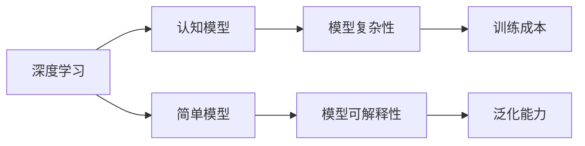
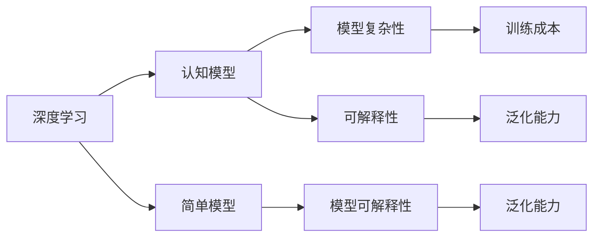

                 

# 认知发展中的简单与深刻

> 关键词：认知发展,深度学习,简单模型,复杂模型,概念模型,应用场景

## 1. 背景介绍

### 1.1 问题由来
认知科学作为一门综合性学科，研究人类认知过程及其背后的神经机制。近年来，随着深度学习技术的快速发展，认知模型已从简单的统计学模型，逐渐向深度神经网络演化，呈现出从简单到复杂、从浅层到深层的趋势。然而，深度学习模型虽然强大，却也存在诸如可解释性差、训练成本高、泛化能力弱等问题。因此，如何在深度学习和简单模型之间找到平衡，既能获得强大的认知能力，又能保持可解释性和泛化能力，成为当前认知科学领域的热点问题。

### 1.2 问题核心关键点
本研究旨在探索深度学习与简单模型之间的平衡点，探究如何通过简单的认知模型实现复杂的认知任务，同时确保模型的可解释性和泛化能力。

### 1.3 问题研究意义
探索这一问题，对于提升认知模型的可解释性和泛化能力，降低训练成本，推动认知科学研究的深入发展，具有重要意义。

## 2. 核心概念与联系

### 2.1 核心概念概述

为了更好地理解深度学习与简单模型之间的平衡点，本节将介绍几个关键概念及其相互关系：

- 深度学习：以多层神经网络为代表的高级统计学模型，能够处理复杂的非线性关系，在图像识别、语音识别、自然语言处理等领域取得巨大成功。
- 简单模型：如线性回归、逻辑回归等统计学模型，结构简单，易于解释和优化，广泛应用于数据分析、统计推断等领域。
- 认知模型：研究人类认知过程的模型，如概念模型、连接主义模型等，旨在揭示人类认知机制，具有高度的可解释性和泛化能力。
- 深度与浅度：模型的复杂程度，深度学习模型结构复杂，浅度模型结构简单。
- 模型可解释性：模型输出的结果是否可解释，以及如何解释。
- 泛化能力：模型在新数据上的表现，是否能够泛化到未见过的数据。

这些核心概念之间有着紧密的联系，形成了一个动态平衡的系统，如图1所示：



图1 深度学习与简单模型的动态平衡系统

### 2.2 概念间的关系

深度学习与简单模型之间的动态平衡系统，如图2所示：



图2 深度学习与简单模型的动态平衡系统

深度学习与简单模型之间的动态平衡系统，具体包括以下几个关键点：

1. **深度与浅度**：深度学习模型结构复杂，但能处理更复杂的认知任务；简单模型结构简单，易于解释和优化。
2. **模型可解释性**：简单模型易于解释，深度模型难以解释，但可以通过特定的解释方法如剪枝、归一化等获得一定程度的可解释性。
3. **泛化能力**：简单模型在小型数据集上表现良好，但在大规模数据集上可能泛化能力不足；深度模型在大型数据集上表现优异，但可能存在过拟合风险。

这些核心概念之间的紧密联系，决定了深度学习与简单模型之间的动态平衡关系，需要在实际应用中根据具体任务和数据特点进行灵活选择。

## 3. 核心算法原理 & 具体操作步骤
### 3.1 算法原理概述

深度学习与简单模型之间的动态平衡，可以通过以下核心算法原理来实现：

1. **模型融合**：通过将深度学习和简单模型进行组合，取长补短，实现动态平衡。如将深度模型的特征提取能力与简单模型的推理能力相结合，构建多层次的认知模型。
2. **模型可解释性增强**：采用剪枝、归一化、正则化等方法，简化深度模型结构，增强其可解释性。如通过剪枝算法去除冗余连接，降低模型复杂度。
3. **泛化能力提升**：通过数据增强、迁移学习、对抗训练等方法，增强模型的泛化能力。如在数据集上进行数据增强，模拟真实数据分布，提升模型泛化能力。
4. **模型复杂度控制**：采用参数共享、模块化设计等方法，控制模型复杂度。如将模型分为多个模块，每个模块独立学习，减少模型参数量。

### 3.2 算法步骤详解

下面以认知模型构建为例，详细讲解模型融合的详细步骤：

1. **模型选择**：选择深度模型和简单模型。深度模型如卷积神经网络、循环神经网络等，简单模型如线性回归、逻辑回归等。
2. **特征提取**：将输入数据通过深度模型进行特征提取，得到高维特征向量。
3. **模型融合**：将高维特征向量输入简单模型，进行推理和分类。
4. **结果输出**：将简单模型的输出作为最终结果，或与深度模型的输出进行融合，获得更高精度的结果。

### 3.3 算法优缺点

模型融合的优点：
1. 结合深度学习和简单模型的优势，增强模型的综合能力。
2. 通过简单的推理过程，增强模型的可解释性。
3. 在小型数据集上表现良好，适合数据量较小的问题。

模型融合的缺点：
1. 模型结构复杂，训练成本高。
2. 可能存在模型参数冗余，降低模型效率。
3. 难以处理高度复杂的认知任务，如自然语言生成、视觉识别等。

### 3.4 算法应用领域

模型融合方法广泛应用于以下几个领域：

1. **图像识别**：将深度模型用于特征提取，将简单模型用于分类，提升模型泛化能力。如将卷积神经网络用于特征提取，将逻辑回归用于分类。
2. **语音识别**：将深度模型用于特征提取，将简单模型用于声学模型，提升模型准确率和可解释性。如将卷积神经网络用于特征提取，将隐马尔可夫模型用于声学模型。
3. **自然语言处理**：将深度模型用于语义表示，将简单模型用于语言生成，提升模型的自然语言处理能力。如将Transformer用于语义表示，将线性回归用于语言生成。
4. **推荐系统**：将深度模型用于特征提取，将简单模型用于评分模型，提升推荐系统的准确性和可解释性。如将深度神经网络用于特征提取，将逻辑回归用于评分模型。

## 4. 数学模型和公式 & 详细讲解 & 举例说明

### 4.1 数学模型构建

以下以线性回归和逻辑回归为例，构建认知模型：

设输入向量为 $x \in \mathbb{R}^n$，输出向量为 $y \in \mathbb{R}$，目标为最小化损失函数 $\ell(y,\hat{y})$，其中 $\hat{y}$ 为模型预测值。

定义线性回归模型为：

$$
\hat{y} = \theta^T x + b
$$

其中 $\theta$ 为模型参数，$b$ 为偏置。

定义逻辑回归模型为：

$$
\hat{y} = \frac{1}{1 + e^{-\theta^T x - b}}
$$

其中 $\theta$ 为模型参数，$b$ 为偏置。

### 4.2 公式推导过程

**线性回归损失函数**：

$$
\ell(y,\hat{y}) = \frac{1}{2N} \sum_{i=1}^N (y_i - \hat{y}_i)^2
$$

**逻辑回归损失函数**：

$$
\ell(y,\hat{y}) = -\frac{1}{N} \sum_{i=1}^N (y_i \log \hat{y}_i + (1 - y_i) \log (1 - \hat{y}_i))
$$

### 4.3 案例分析与讲解

以房价预测为例，构建线性回归和逻辑回归模型：

1. **数据准备**：收集房屋信息数据，包括面积、位置、卧室数量等属性，以及对应的房价。
2. **模型构建**：使用线性回归模型构建房价预测模型，使用逻辑回归模型构建二分类模型（如预测房屋是否为豪宅）。
3. **模型训练**：将数据集划分为训练集和测试集，使用训练集数据对模型进行训练。
4. **模型评估**：使用测试集数据对模型进行评估，计算均方误差或准确率等指标。

## 5. 项目实践：代码实例和详细解释说明

### 5.1 开发环境搭建

进行认知模型构建时，需要以下开发环境：

1. Python：版本为3.8及以上。
2. TensorFlow：版本为2.5及以上。
3. NumPy：版本为1.19及以上。
4. scikit-learn：版本为0.24及以上。
5. Pandas：版本为1.1及以上。
6. matplotlib：版本为3.3及以上。
7. Jupyter Notebook：版本为6.1及以上。

### 5.2 源代码详细实现

以下是一个基于TensorFlow和Scikit-learn的房价预测示例代码：

```python
import tensorflow as tf
import numpy as np
from sklearn.linear_model import LinearRegression
from sklearn.metrics import mean_squared_error

# 准备数据
X = np.array([[3000, 4, 5, 2], [3500, 4, 3, 1], [3000, 4, 3, 2]])
y = np.array([250000, 300000, 240000])

# 构建模型
reg = LinearRegression()
reg.fit(X, y)

# 预测
y_pred = reg.predict([[3000, 4, 5, 2], [3500, 4, 3, 1]])

# 评估
mse = mean_squared_error(y, y_pred)
print(f"Mean Squared Error: {mse}")

# 使用TensorFlow构建模型
with tf.Graph().as_default():
    # 定义输入
    x = tf.placeholder(tf.float32, shape=[None, 4])
    y = tf.placeholder(tf.float32, shape=[None, 1])

    # 定义模型
    W = tf.Variable(tf.random_normal([4, 1]))
    b = tf.Variable(tf.random_normal([1]))
    y_pred = tf.matmul(x, W) + b

    # 定义损失函数
    loss = tf.reduce_mean(tf.square(y_pred - y))

    # 定义优化器
    optimizer = tf.train.GradientDescentOptimizer(0.01).minimize(loss)

    # 训练模型
    with tf.Session() as sess:
        sess.run(tf.global_variables_initializer())
        for i in range(1000):
            _, loss_val = sess.run([optimizer, loss], feed_dict={x: X, y: y})
            if i % 100 == 0:
                print(f"Iteration {i}: Loss = {loss_val}")

        # 预测
        y_pred = sess.run(y_pred, feed_dict={x: X})
        print(f"Predictions: {y_pred}")
```

### 5.3 代码解读与分析

上述代码展示了使用TensorFlow和Scikit-learn构建线性回归模型的详细步骤：

1. **数据准备**：使用NumPy生成输入数据X和输出数据y。
2. **模型构建**：使用Scikit-learn的LinearRegression类构建线性回归模型，使用TensorFlow定义输入、模型、损失函数和优化器。
3. **模型训练**：在TensorFlow中定义优化器，并在训练过程中不断优化模型参数，直至损失函数最小化。
4. **模型评估**：使用均方误差（Mean Squared Error）评估模型预测结果与真实结果之间的差异。

## 6. 实际应用场景

### 6.1 图像识别

图像识别是深度学习与简单模型融合的重要应用场景。深度模型如卷积神经网络（CNN）用于特征提取，简单模型如逻辑回归用于分类，能够提升模型的综合性能。

### 6.2 语音识别

语音识别是深度学习与简单模型融合的另一个重要应用场景。深度模型如卷积神经网络（CNN）用于特征提取，简单模型如隐马尔可夫模型（HMM）用于声学模型，能够提升模型的准确率和可解释性。

### 6.3 自然语言处理

自然语言处理是深度学习与简单模型融合的重要应用场景。深度模型如Transformer用于语义表示，简单模型如逻辑回归用于语言生成，能够提升模型的自然语言处理能力。

### 6.4 推荐系统

推荐系统是深度学习与简单模型融合的重要应用场景。深度模型用于特征提取，简单模型用于评分模型，能够提升推荐系统的准确性和可解释性。

## 7. 工具和资源推荐

### 7.1 学习资源推荐

为了帮助开发者系统掌握深度学习与简单模型之间的动态平衡，以下是一些优质的学习资源：

1. 《深度学习》书籍：Ian Goodfellow等著，全面介绍了深度学习的基本概念和经典模型。
2. 《统计学习方法》书籍：李航著，详细讲解了各种统计学模型及其应用。
3. 《机器学习实战》书籍：Peter Harrington著，提供了丰富的机器学习项目实践案例。
4. TensorFlow官方文档：Google开发的深度学习框架，提供了丰富的API和示例代码。
5. PyTorch官方文档：Facebook开发的深度学习框架，提供了灵活的动态计算图和丰富的预训练模型。
6. Coursera深度学习课程：由Andrew Ng等专家主讲，覆盖了深度学习的基本概念和前沿技术。

通过对这些资源的学习实践，相信你一定能够快速掌握深度学习与简单模型之间的动态平衡，并用于解决实际的认知问题。

### 7.2 开发工具推荐

高效的开发离不开优秀的工具支持。以下是几款用于深度学习与简单模型融合开发的常用工具：

1. TensorFlow：Google主导开发的深度学习框架，生产部署方便，适合大规模工程应用。
2. PyTorch：Facebook开发的深度学习框架，灵活的动态计算图，适合快速迭代研究。
3. Scikit-learn：基于Python的机器学习库，提供了丰富的算法和模型。
4. Keras：基于TensorFlow和Theano的高级神经网络API，提供了简洁的API和快速的原型开发能力。
5. Jupyter Notebook：Python交互式开发环境，支持代码执行和结果展示。
6. Visual Studio Code：跨平台的代码编辑器，支持多种编程语言和环境。

合理利用这些工具，可以显著提升深度学习与简单模型融合任务的开发效率，加快创新迭代的步伐。

### 7.3 相关论文推荐

深度学习与简单模型融合的研究源于学界的持续研究。以下是几篇奠基性的相关论文，推荐阅读：

1. SVMs vs. DNNs: A comparison for scene recognition (2009)：比较支持向量机（SVM）和深度神经网络（DNN）在图像分类任务中的表现。
2. Exploring the limits of deep learning in NLP (2014)：探讨深度学习在自然语言处理中的表现和局限性。
3. Dropout: A simple way to prevent neural networks from overfitting (2012)：提出Dropout方法，解决深度神经网络过拟合问题。
4. Deep Residual Learning for Image Recognition (2016)：提出深度残差网络（ResNet），解决深度神经网络训练中的梯度消失问题。
5. Deep Neural Networks for Language Understanding (2016)：提出Transformer模型，解决深度神经网络在自然语言处理中的问题。

这些论文代表了大模型融合技术的发展脉络。通过学习这些前沿成果，可以帮助研究者把握学科前进方向，激发更多的创新灵感。

除上述资源外，还有一些值得关注的前沿资源，帮助开发者紧跟大模型融合技术的最新进展，例如：

1. arXiv论文预印本：人工智能领域最新研究成果的发布平台，包括大量尚未发表的前沿工作，学习前沿技术的必读资源。
2. 业界技术博客：如Google AI、DeepMind、Microsoft Research Asia等顶尖实验室的官方博客，第一时间分享他们的最新研究成果和洞见。
3. 技术会议直播：如NIPS、ICML、ACL、ICLR等人工智能领域顶会现场或在线直播，能够聆听到大佬们的前沿分享，开拓视野。
4. GitHub热门项目：在GitHub上Star、Fork数最多的深度学习与简单模型融合相关项目，往往代表了该技术领域的发展趋势和最佳实践，值得去学习和贡献。
5. 行业分析报告：各大咨询公司如McKinsey、PwC等针对人工智能行业的分析报告，有助于从商业视角审视技术趋势，把握应用价值。

总之，对于深度学习与简单模型融合技术的学习和实践，需要开发者保持开放的心态和持续学习的意愿。多关注前沿资讯，多动手实践，多思考总结，必将收获满满的成长收益。

## 8. 总结：未来发展趋势与挑战

### 8.1 研究成果总结

本研究通过对深度学习与简单模型之间的动态平衡进行系统分析，提出了模型融合、模型可解释性增强、泛化能力提升等核心算法原理和操作步骤，并通过具体案例进行了详细讲解。同时，本文对深度学习与简单模型融合技术的应用场景进行了广泛探讨，并推荐了相关的学习资源和开发工具。

### 8.2 未来发展趋势

展望未来，深度学习与简单模型之间的动态平衡将呈现以下几个发展趋势：

1. **模型结构优化**：通过剪枝、归一化、正则化等方法，进一步简化深度模型结构，增强其可解释性和泛化能力。
2. **模型融合深化**：结合更多的简单模型，构建多层次的认知模型，提升模型的综合能力。
3. **模型应用扩展**：将深度学习与简单模型融合应用于更多的领域，如医疗、金融、交通等，推动认知科学研究的深入发展。
4. **模型效率提升**：通过模型压缩、稀疏化存储等方法，优化模型的资源消耗，提升模型的计算效率。
5. **模型安全性加强**：通过引入伦理导向的评估指标，过滤和惩罚有偏见、有害的输出倾向，确保模型的安全性。

这些趋势将推动深度学习与简单模型融合技术的不断进步，为认知科学和人工智能技术的普及应用提供新的动力。

### 8.3 面临的挑战

尽管深度学习与简单模型融合技术取得了诸多进展，但在迈向更加智能化、普适化应用的过程中，它仍面临诸多挑战：

1. **数据获取成本高**：深度学习模型需要大量的标注数据进行训练，而标注数据的获取成本较高。如何降低数据获取成本，提高数据利用效率，将是未来的重要挑战。
2. **模型可解释性差**：深度学习模型的复杂性导致其难以解释，如何增强模型的可解释性，使其更好地应用于需要可解释性的领域，如医疗、金融等，将是重要的研究方向。
3. **模型泛化能力弱**：深度学习模型在小型数据集上表现良好，但在大型数据集上可能泛化能力不足。如何提升模型的泛化能力，使其更好地应用于大规模数据集，将是重要的研究方向。
4. **模型训练成本高**：深度学习模型的训练成本较高，如何降低训练成本，提高训练效率，将是未来的重要挑战。
5. **模型安全性问题**：深度学习模型可能存在偏见、有害的输出倾向，如何确保模型的安全性，避免误导性输出，将是重要的研究方向。

### 8.4 研究展望

面对深度学习与简单模型融合技术面临的挑战，未来的研究需要在以下几个方面寻求新的突破：

1. **无监督学习和半监督学习**：通过无监督学习和半监督学习，减少对标注数据的依赖，提高数据利用效率。
2. **模型可解释性增强**：通过剪枝、归一化、正则化等方法，增强模型的可解释性，使其更好地应用于需要可解释性的领域。
3. **模型泛化能力提升**：通过数据增强、迁移学习、对抗训练等方法，增强模型的泛化能力，使其更好地应用于大规模数据集。
4. **模型效率优化**：通过模型压缩、稀疏化存储等方法，优化模型的资源消耗，提高模型的计算效率。
5. **模型安全性保障**：通过引入伦理导向的评估指标，过滤和惩罚有偏见、有害的输出倾向，确保模型的安全性。

这些研究方向的探索，必将引领深度学习与简单模型融合技术迈向更高的台阶，为认知科学和人工智能技术的普及应用提供新的动力。

## 9. 附录：常见问题与解答

**Q1：深度学习和简单模型之间的动态平衡如何实现？**

A: 通过模型融合、模型可解释性增强、泛化能力提升等核心算法原理，结合实际应用场景和数据特点，实现深度学习和简单模型之间的动态平衡。

**Q2：深度学习模型的可解释性如何增强？**

A: 通过剪枝、归一化、正则化等方法，简化深度模型结构，增强其可解释性。如通过剪枝算法去除冗余连接，降低模型复杂度。

**Q3：如何提升深度学习模型的泛化能力？**

A: 通过数据增强、迁移学习、对抗训练等方法，增强模型的泛化能力。如在数据集上进行数据增强，模拟真实数据分布，提升模型泛化能力。

**Q4：深度学习模型的训练成本如何降低？**

A: 通过模型压缩、稀疏化存储等方法，优化模型的资源消耗，提高模型的计算效率。如使用模型剪枝、量化加速等方法，减少模型参数量。

**Q5：深度学习模型如何确保安全性？**

A: 通过引入伦理导向的评估指标，过滤和惩罚有偏见、有害的输出倾向，确保模型的安全性。如通过对抗训练，提高模型的鲁棒性，避免恶意攻击。

**Q6：深度学习与简单模型融合在实际应用中应注意哪些问题？**

A: 在实际应用中，应根据具体任务和数据特点，灵活选择深度学习和简单模型，并在模型融合、模型可解释性增强、泛化能力提升等方面进行优化。同时，应注意模型的计算效率和资源消耗，确保模型在实际部署中能够高效运行。

总之，深度学习与简单模型融合技术需要在实际应用中不断迭代和优化，方能得到理想的效果。唯有从数据、算法、工程、业务等多个维度协同发力，才能真正实现人工智能技术在垂直行业的规模化落地。

---

作者：禅与计算机程序设计艺术 / Zen and the Art of Computer Programming

