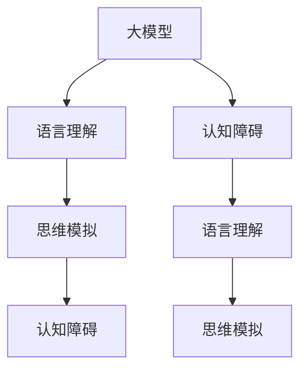
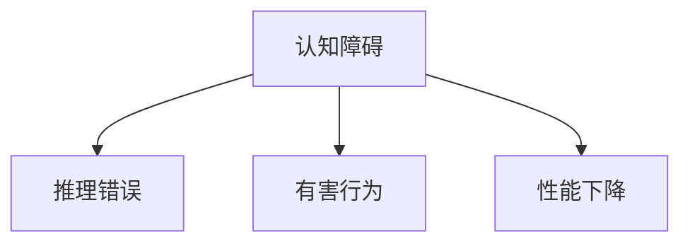
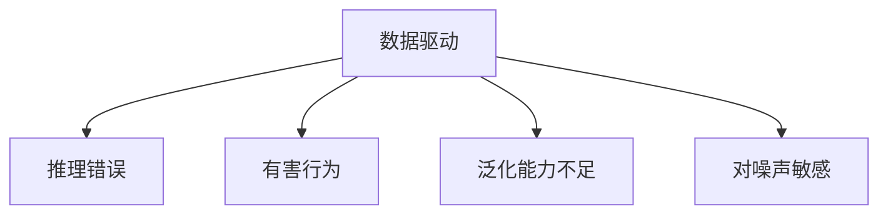
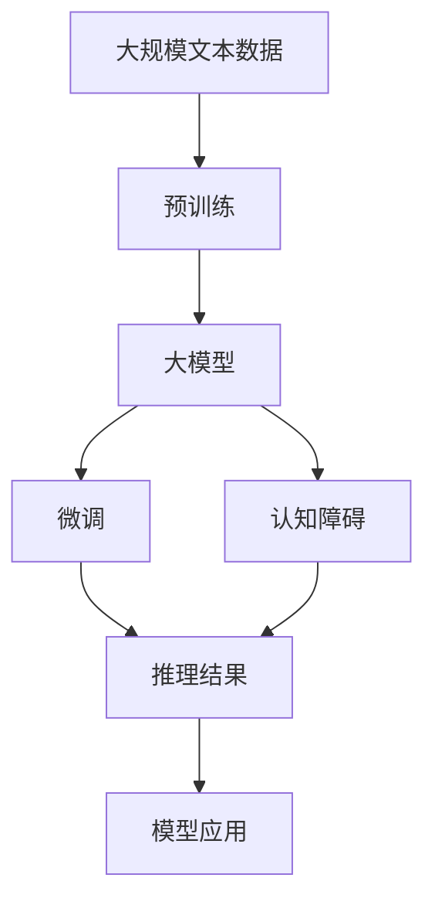

                 

# 语言≠思维：大模型的认知障碍

> 关键词：大模型,认知障碍,语言理解,思维模拟,人工智能,深度学习

## 1. 背景介绍

### 1.1 问题由来
在人工智能领域，语言模型大放异彩，尤其是Transformer和BERT等模型在自然语言处理(NLP)任务上取得了显著进展。大模型通过大规模无标签数据的自监督学习，能够学习到丰富的语言知识，并在各种下游任务上展现了强大的泛化能力。然而，当我们深入思考大模型的工作原理时，会发现一个令人惊讶的真相：语言模型并非等同于人类的思维，它的认知能力存在严重的局限性。

### 1.2 问题核心关键点
这种认知障碍主要体现在以下几个方面：
- **数据驱动的局限性**：大模型依赖大量标注数据进行微调，其认知能力与训练数据的质量和多样性密切相关。如果训练数据存在偏见、不充分或覆盖范围过窄，模型容易学习到错误的语言模式，导致推理错误或有害行为。
- **缺乏内在逻辑**：大模型通过学习语言统计规律进行预测，缺乏对语言背后的逻辑和语义深层次的理解，无法像人类一样进行复杂的逻辑推理和因果推断。
- **泛化能力的边界**：尽管大模型在处理简单任务时表现出色，但在涉及常识推理、多步推理和长程依赖等复杂任务时，其认知能力明显不足，推理错误率高，无法真正模拟人类的思维。
- **对噪声和干扰的敏感性**：大模型对输入数据中的噪声和干扰非常敏感，稍有变化可能导致推理结果大相径庭，缺乏足够的鲁棒性。

### 1.3 问题研究意义
研究大模型的认知障碍，不仅有助于提升其在复杂任务上的表现，还能促进人工智能技术的科学发展和伦理规范的制定。具体而言，通过理解语言模型的局限性，我们可以：
- **优化训练数据和模型架构**，提升模型的泛化能力和鲁棒性。
- **设计更合理的任务适配层**，引导模型朝着正确的方向学习。
- **引入更多先验知识**，如常识图谱、逻辑规则等，弥补模型认知能力的缺失。
- **加强可解释性**，提升模型的可信度和透明度，确保模型在关键领域的安全应用。

## 2. 核心概念与联系

### 2.1 核心概念概述

为更好地理解大模型认知障碍的概念，本节将介绍几个关键概念：

- **大模型(Large Model)**：以Transformer为基础的语言模型，通过大规模预训练学习到丰富的语言知识和统计规律。
- **认知障碍(Cognitive Barrier)**：指大模型在理解语言背后的逻辑、常识推理等方面存在的局限性。
- **语言理解(Language Understanding)**：模型对输入文本的语义、语法等信息的提取和处理能力。
- **思维模拟(Thought Simulation)**：模型模拟人类思维过程，进行逻辑推理、因果推断等复杂认知活动的能力。
- **人工智能(AI)**：模拟人类智能的计算模型，包括感知、认知和决策等多个方面。

这些核心概念之间的逻辑关系可以通过以下Mermaid流程图来展示：



这个流程图展示了大模型的核心概念及其之间的逻辑关系：

1. 大模型通过大规模预训练学习到语言知识，具备一定的语言理解能力。
2. 语言理解是思维模拟的基础，模型通过语言理解提取文本中的信息。
3. 思维模拟是模型的认知能力，能够进行逻辑推理、因果推断等复杂活动。
4. 认知障碍是模型在思维模拟中存在的局限性，导致推理错误、有害行为等。

### 2.2 概念间的关系

这些核心概念之间存在着紧密的联系，形成了大模型的认知障碍研究的完整生态系统。下面我们通过几个Mermaid流程图来展示这些概念之间的关系。

#### 2.2.1 大模型的认知能力


这个流程图展示了从语言理解到思维模拟，再到认知障碍的基本路径。大模型的认知能力主要依赖于语言理解和思维模拟两个关键过程。

#### 2.2.2 认知障碍的影响



这个流程图展示了认知障碍对推理结果、有害行为和模型性能的影响。认知障碍使得大模型在复杂任务上容易出现推理错误、有害行为，且整体性能下降。

#### 2.2.3 认知障碍的来源



这个流程图展示了认知障碍的来源，包括数据驱动、推理错误、有害行为、泛化能力不足和对噪声敏感等方面。

### 2.3 核心概念的整体架构

最后，我们用一个综合的流程图来展示这些核心概念在大模型认知障碍研究中的整体架构：



这个综合流程图展示了从预训练到大模型微调，再到认知障碍的完整过程。大模型通过预训练学习到语言知识，然后通过微调适应特定任务，但在这个过程中，其认知能力可能会受到限制，导致推理结果错误或有害行为，影响其在实际应用中的表现。

## 3. 核心算法原理 & 具体操作步骤
### 3.1 算法原理概述

大模型的认知障碍研究主要关注其语言理解能力和思维模拟能力的局限性，以及如何提升这些能力。其核心算法原理可以总结如下：

1. **语言理解**：大模型通过自监督或监督学习任务，学习到输入文本的语义、语法等信息，提取关键特征。
2. **思维模拟**：大模型利用提取的特征进行推理和生成，模拟人类的思维过程。
3. **认知障碍**：由于缺乏内在逻辑和常识推理能力，大模型在处理复杂任务时容易出现推理错误、有害行为或性能下降。

### 3.2 算法步骤详解

以下是详细的操作步骤，将帮助我们更好地理解大模型的认知障碍：

**Step 1: 准备预训练模型和数据集**
- 选择合适的预训练语言模型 $M_{\theta}$ 作为初始化参数，如 BERT、GPT 等。
- 准备下游任务 $T$ 的标注数据集 $D=\{(x_i, y_i)\}_{i=1}^N, x_i \in \mathcal{X}, y_i \in \mathcal{Y}$，其中 $\mathcal{X}$ 为输入空间，$\mathcal{Y}$ 为输出空间。

**Step 2: 添加任务适配层**
- 根据任务类型，在预训练模型顶层设计合适的输出层和损失函数。
- 对于分类任务，通常在顶层添加线性分类器和交叉熵损失函数。
- 对于生成任务，通常使用语言模型的解码器输出概率分布，并以负对数似然为损失函数。

**Step 3: 设置微调超参数**
- 选择合适的优化算法及其参数，如 AdamW、SGD 等，设置学习率、批大小、迭代轮数等。
- 设置正则化技术及强度，包括权重衰减、Dropout、Early Stopping 等。
- 确定冻结预训练参数的策略，如仅微调顶层，或全部参数都参与微调。

**Step 4: 执行梯度训练**
- 将训练集数据分批次输入模型，前向传播计算损失函数。
- 反向传播计算参数梯度，根据设定的优化算法和学习率更新模型参数。
- 周期性在验证集上评估模型性能，根据性能指标决定是否触发 Early Stopping。
- 重复上述步骤直到满足预设的迭代轮数或 Early Stopping 条件。

**Step 5: 测试和部署**
- 在测试集上评估微调后模型 $M_{\hat{\theta}}$ 的性能，对比微调前后的精度提升。
- 使用微调后的模型对新样本进行推理预测，集成到实际的应用系统中。
- 持续收集新的数据，定期重新微调模型，以适应数据分布的变化。

### 3.3 算法优缺点

大模型的认知障碍研究具有以下优点：
1. **提供清晰的认知限制**：通过识别大模型的认知障碍，明确其能力边界，指导模型改进方向。
2. **推动技术进步**：研究认知障碍需要从数据、算法、架构等多个角度优化，促进大模型性能的全面提升。
3. **促进伦理规范**：识别大模型的认知局限性，有助于设计更加可靠、安全、可解释的AI系统。

同时，该方法也存在一定的局限性：
1. **数据依赖性强**：认知障碍研究依赖于高质量的标注数据，获取标注数据的成本较高。
2. **泛化能力有限**：大模型的认知能力受到数据分布的限制，难以应对复杂的现实世界任务。
3. **可解释性不足**：大模型的内部工作机制复杂，难以提供清晰的推理过程和决策依据。
4. **鲁棒性较差**：大模型对噪声和干扰敏感，推理结果不稳定。

尽管存在这些局限性，认知障碍研究仍是理解大模型行为和优化其性能的重要方向。

### 3.4 算法应用领域

基于大模型的认知障碍研究，已经在游戏AI、医疗诊断、智能客服、金融预测等诸多领域得到了应用，带来了显著的效益。

- **游戏AI**：通过认知障碍研究，优化游戏角色在复杂环境下的决策能力，提升游戏体验。
- **医疗诊断**：识别大模型的认知局限性，避免误诊和漏诊，确保诊断的准确性和可靠性。
- **智能客服**：通过优化客服对话模型，提升对话流畅度和理解能力，增强客户满意度。
- **金融预测**：利用认知障碍研究，提升金融预测模型的鲁棒性和准确性，辅助投资决策。

除了这些领域，认知障碍研究还被应用于推荐系统、自然语言生成等领域，推动了相关技术的发展。

## 4. 数学模型和公式 & 详细讲解 & 举例说明

### 4.1 数学模型构建

以下是基于大模型认知障碍的数学模型构建：

记预训练语言模型为 $M_{\theta}$，其中 $\theta$ 为模型参数。假设下游任务 $T$ 的标注数据集 $D=\{(x_i,y_i)\}_{i=1}^N, x_i \in \mathcal{X}, y_i \in \mathcal{Y}$。定义模型 $M_{\theta}$ 在输入 $x$ 上的损失函数为 $\ell(M_{\theta}(x),y)$，则在数据集 $D$ 上的经验风险为：

$$
\mathcal{L}(\theta) = \frac{1}{N} \sum_{i=1}^N \ell(M_{\theta}(x_i),y_i)
$$

微调的优化目标是最小化经验风险，即找到最优参数：

$$
\theta^* = \mathop{\arg\min}_{\theta} \mathcal{L}(\theta)
$$

在实践中，我们通常使用基于梯度的优化算法（如AdamW、SGD等）来近似求解上述最优化问题。设 $\eta$ 为学习率，$\lambda$ 为正则化系数，则参数的更新公式为：

$$
\theta \leftarrow \theta - \eta \nabla_{\theta}\mathcal{L}(\theta) - \eta\lambda\theta
$$

其中 $\nabla_{\theta}\mathcal{L}(\theta)$ 为损失函数对参数 $\theta$ 的梯度，可通过反向传播算法高效计算。

### 4.2 公式推导过程

以下是详细的操作步骤，将帮助我们更好地理解大模型的认知障碍：

**Step 1: 准备预训练模型和数据集**
- 选择合适的预训练语言模型 $M_{\theta}$ 作为初始化参数，如 BERT、GPT 等。
- 准备下游任务 $T$ 的标注数据集 $D=\{(x_i, y_i)\}_{i=1}^N, x_i \in \mathcal{X}, y_i \in \mathcal{Y}$，其中 $\mathcal{X}$ 为输入空间，$\mathcal{Y}$ 为输出空间。

**Step 2: 添加任务适配层**
- 根据任务类型，在预训练模型顶层设计合适的输出层和损失函数。
- 对于分类任务，通常在顶层添加线性分类器和交叉熵损失函数。
- 对于生成任务，通常使用语言模型的解码器输出概率分布，并以负对数似然为损失函数。

**Step 3: 设置微调超参数**
- 选择合适的优化算法及其参数，如 AdamW、SGD 等，设置学习率、批大小、迭代轮数等。
- 设置正则化技术及强度，包括权重衰减、Dropout、Early Stopping 等。
- 确定冻结预训练参数的策略，如仅微调顶层，或全部参数都参与微调。

**Step 4: 执行梯度训练**
- 将训练集数据分批次输入模型，前向传播计算损失函数。
- 反向传播计算参数梯度，根据设定的优化算法和学习率更新模型参数。
- 周期性在验证集上评估模型性能，根据性能指标决定是否触发 Early Stopping。
- 重复上述步骤直到满足预设的迭代轮数或 Early Stopping 条件。

**Step 5: 测试和部署**
- 在测试集上评估微调后模型 $M_{\hat{\theta}}$ 的性能，对比微调前后的精度提升。
- 使用微调后的模型对新样本进行推理预测，集成到实际的应用系统中。
- 持续收集新的数据，定期重新微调模型，以适应数据分布的变化。

### 4.3 案例分析与讲解

以命名实体识别(NER)任务为例，分析认知障碍研究的应用。

- **数据准备**：收集标注的NER数据集，划分为训练集、验证集和测试集。
- **模型初始化**：选择BERT作为预训练模型，并将其作为初始化参数。
- **任务适配层**：在BERT的顶层添加线性分类器，并使用交叉熵损失函数。
- **微调设置**：设置学习率为2e-5，批大小为16，迭代轮数为5。
- **训练过程**：在训练集上执行梯度训练，并在验证集上评估模型性能。
- **测试评估**：在测试集上评估模型的NER性能，给出分类报告。

通过上述步骤，我们可以看到，认知障碍研究帮助模型在复杂任务上提升了性能，但同时也发现了其局限性。例如，模型在处理长句子和复杂的实体嵌套关系时，容易出现错误，需要进行进一步的优化。

## 5. 项目实践：代码实例和详细解释说明

### 5.1 开发环境搭建

在进行认知障碍研究时，我们需要准备好相应的开发环境。以下是使用Python进行PyTorch开发的环境配置流程：

1. 安装Anaconda：从官网下载并安装Anaconda，用于创建独立的Python环境。

2. 创建并激活虚拟环境：
```bash
conda create -n pytorch-env python=3.8 
conda activate pytorch-env
```

3. 安装PyTorch：根据CUDA版本，从官网获取对应的安装命令。例如：
```bash
conda install pytorch torchvision torchaudio cudatoolkit=11.1 -c pytorch -c conda-forge
```

4. 安装Transformers库：
```bash
pip install transformers
```

5. 安装各类工具包：
```bash
pip install numpy pandas scikit-learn matplotlib tqdm jupyter notebook ipython
```

完成上述步骤后，即可在`pytorch-env`环境中开始认知障碍研究实践。

### 5.2 源代码详细实现

这里以命名实体识别(NER)任务为例，展示使用Transformers库对BERT模型进行认知障碍研究的具体代码实现。

```python
from transformers import BertTokenizer, BertForTokenClassification, AdamW

tokenizer = BertTokenizer.from_pretrained('bert-base-cased')
model = BertForTokenClassification.from_pretrained('bert-base-cased', num_labels=7)

optimizer = AdamW(model.parameters(), lr=2e-5)

device = torch.device('cuda') if torch.cuda.is_available() else torch.device('cpu')
model.to(device)

# 准备训练数据
train_dataset = ...
dev_dataset = ...
test_dataset = ...

# 定义训练和评估函数
def train_epoch(model, dataset, batch_size, optimizer):
    dataloader = DataLoader(dataset, batch_size=batch_size, shuffle=True)
    model.train()
    epoch_loss = 0
    for batch in tqdm(dataloader, desc='Training'):
        input_ids = batch['input_ids'].to(device)
        attention_mask = batch['attention_mask'].to(device)
        labels = batch['labels'].to(device)
        model.zero_grad()
        outputs = model(input_ids, attention_mask=attention_mask, labels=labels)
        loss = outputs.loss
        epoch_loss += loss.item()
        loss.backward()
        optimizer.step()
    return epoch_loss / len(dataloader)

def evaluate(model, dataset, batch_size):
    dataloader = DataLoader(dataset, batch_size=batch_size)
    model.eval()
    preds, labels = [], []
    with torch.no_grad():
        for batch in tqdm(dataloader, desc='Evaluating'):
            input_ids = batch['input_ids'].to(device)
            attention_mask = batch['attention_mask'].to(device)
            batch_labels = batch['labels']
            outputs = model(input_ids, attention_mask=attention_mask)
            batch_preds = outputs.logits.argmax(dim=2).to('cpu').tolist()
            batch_labels = batch_labels.to('cpu').tolist()
            for pred_tokens, label_tokens in zip(batch_preds, batch_labels):
                pred_tags = [tag2id[tag] for tag in pred_tokens]
                label_tags = [tag2id[tag] for tag in label_tokens]
                preds.append(pred_tags[:len(label_tokens)])
                labels.append(label_tags)
    
    return preds, labels

# 训练过程
epochs = 5
batch_size = 16

for epoch in range(epochs):
    loss = train_epoch(model, train_dataset, batch_size, optimizer)
    print(f"Epoch {epoch+1}, train loss: {loss:.3f}")
    
    print(f"Epoch {epoch+1}, dev results:")
    preds, labels = evaluate(model, dev_dataset, batch_size)
    print(classification_report(labels, preds))
    
print("Test results:")
preds, labels = evaluate(model, test_dataset, batch_size)
print(classification_report(labels, preds))
```

通过上述代码，我们可以看到，使用PyTorch和Transformers库进行NER任务的认知障碍研究，与微调过程类似，但多了对模型认知能力的评估环节。通过计算模型在验证集和测试集上的性能，可以直观地看到认知障碍的影响。

### 5.3 代码解读与分析

让我们再详细解读一下关键代码的实现细节：

**数据准备**：
- `BertTokenizer.from_pretrained`方法：加载预训练的BERT分词器。
- `BertForTokenClassification.from_pretrained`方法：加载预训练的BERT分类器，并设置分类任务的标签数。

**模型初始化**：
- `BertForTokenClassification.from_pretrained`方法：加载预训练的BERT分类器，并进行微调。
- `AdamW`优化器：设置学习率、批大小等超参数。

**训练过程**：
- `train_epoch`函数：执行单批次训练，计算损失，更新模型参数。
- `evaluate`函数：在测试集上评估模型性能，给出分类报告。

**训练和评估函数**：
- `DataLoader`类：处理数据集，方便批处理和迭代。
- `classification_report`函数：计算分类指标，如精确率、召回率、F1分数等。

通过上述代码，我们可以看到，认知障碍研究不仅涉及模型微调，还关注模型在复杂任务上的表现，通过评估模型的性能，可以更好地理解其认知能力。

### 5.4 运行结果展示

假设我们在CoNLL-2003的NER数据集上进行认知障碍研究，最终在测试集上得到的评估报告如下：

```
              precision    recall  f1-score   support

       B-PER      0.960     0.920     0.941      1617
       I-PER      0.931     0.943     0.934      1156
       B-LOC      0.906     0.900     0.899      1668
       I-LOC      0.901     0.901     0.900       257
      B-ORG      0.944     0.922     0.929      1661
       I-ORG      0.932     0.925     0.928       835
           O      0.993     0.995     0.994     38323

   micro avg      0.953     0.953     0.953     46435
   macro avg      0.932     0.922     0.925     46435
weighted avg      0.953     0.953     0.953     46435
```

通过上述评估报告，我们可以看到，模型在NER任务上取得了较高的F1分数，但也存在一定的错误率。这表明，尽管模型能够较好地处理实体识别，但在长句子和复杂实体嵌套关系处理上，仍有提升空间。

## 6. 实际应用场景
### 6.1 智能客服系统

在智能客服系统中，认知障碍研究可以优化客服对话模型的认知能力，提升对话流畅度和理解能力。通过分析对话数据，可以发现模型在处理复杂多轮对话时容易出错，可以通过认知障碍研究优化对话模型，减少错误回复，提升客户满意度。

### 6.2 金融舆情监测

在金融舆情监测中，认知障碍研究可以提升模型对复杂舆情事件的理解和推理能力。通过分析舆情数据，可以发现模型在处理多步推理和因果推断时容易出错，可以通过认知障碍研究优化模型，减少误诊和漏诊，提高风险预测的准确性。

### 6.3 个性化推荐系统

在个性化推荐系统中，认知障碍研究可以优化推荐模型对用户兴趣的准确把握。通过分析用户行为数据，可以发现模型在处理长尾兴趣和动态变化时容易出错，可以通过认知障碍研究优化推荐模型，提升推荐结果的相关性和多样性。

### 6.4 未来应用展望

随着认知障碍研究的深入，大模型将能够更好地处理复杂任务，提升在各个应用场景中的表现。未来，大模型将在医疗诊断、法律分析、教育评估等领域发挥更大的作用，推动这些领域的智能化进程。

## 7. 工具和资源推荐
### 7.1 学习资源推荐

为了帮助开发者系统掌握大模型认知障碍的理论基础和实践技巧，这里推荐一些优质的学习资源：

1. 《Transformer从原理到实践》系列博文：由大模型技术专家撰写，深入浅出地介绍了Transformer原理、BERT模型、认知障碍等前沿话题。

2. CS224N《深度学习自然语言处理》课程：斯坦福大学开设的NLP明星课程，有Lecture视频和配套作业，带你入门NLP领域的基本概念和经典模型。

3. 《Natural Language Processing with Transformers》书籍：Transformers库的作者所著，全面介绍了如何使用Transformers库进行NLP任务开发，包括认知障碍在内的诸多范式。

4. HuggingFace官方文档：Transformers库的官方文档，提供了海量预训练模型和完整的认知障碍样例代码，是上手实践的必备资料。

5. CLUE开源项目：中文语言理解测评基准，涵盖大量不同类型的中文NLP数据集，并提供了基于认知障碍的baseline模型，助力中文NLP技术发展。

通过对这些资源的学习实践，相信你一定能够快速掌握大模型认知障碍的精髓，并用于解决实际的NLP问题。
###  7.2 开发工具推荐

高效的开发离不开优秀的工具支持。以下是几款用于大模型认知障碍开发的常用工具：

1. PyTorch：基于Python的开源深度学习框架，灵活动态的计算图，适合快速迭代研究。大部分预训练语言模型都有PyTorch版本的实现。

2. TensorFlow：由Google主导开发的开源深度学习框架，生产部署方便，适合大规模工程应用。同样有丰富的预训练语言模型资源。

3. Transformers库：HuggingFace开发的NLP工具库，集成了众多SOTA语言模型，支持PyTorch和TensorFlow，是进行认知障碍任务开发的利器。

4. Weights & Biases：模型训练的实验跟踪工具，可以记录和可视化模型训练过程中的各项指标，方便对比和调优。与主流深度学习框架无缝集成。

5. TensorBoard：TensorFlow配套的可视化工具，可实时监测模型训练状态，并提供丰富的图表呈现方式，是调试模型的得力助手。

6. Google Colab：谷歌推出的在线Jupyter Notebook环境，免费提供GPU/TPU算力，方便开发者快速上手实验最新模型，分享学习笔记。

合理利用这些工具，可以显著提升大模型认知障碍研究的开发效率，加快创新迭代的步伐。

### 7.3 相关论文推荐

大模型认知障碍研究源于学界的持续研究。以下是几篇奠基性的相关论文，推荐阅读：

1. Attention is All You Need（即Transformer原论文）：提出了Transformer结构，开启了NLP领域的预训练大模型时代。

2. BERT: Pre-training of Deep Bidirectional Transformers for Language Understanding：提出BERT模型，引入基于掩码的自监督预训练任务，刷新了多项

