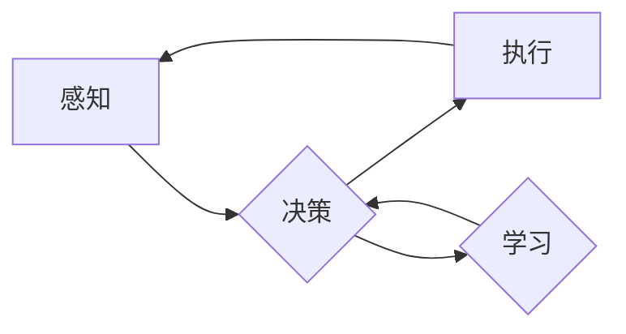

# AI Agent: AI的下一个风口 对研究者和实践者的建议

> 关键词：AI Agent, 智能体, 人工智能, 强化学习, 迁移学习, 机器人, 自动化, 对话系统, 应用场景

## 1. 背景介绍

随着人工智能技术的飞速发展，我们见证了从简单的算法到复杂系统的演变。从基础的机器学习到深度学习，再到如今的Transformer和预训练大模型，AI的能力已经渗透到我们生活的方方面面。然而，在这些技术中，AI Agent（智能体）似乎被忽视了一个重要的角色。AI Agent作为能够独立决策、执行任务的实体，正逐渐成为AI的下一个风口。本文将深入探讨AI Agent的核心概念、原理、应用场景，并为研究者和实践者提供一些建议。

### 1.1 问题的由来

在传统的AI系统中，算法通常被设计为执行特定的任务，如图像识别、语音识别、自然语言处理等。这些系统往往缺乏自主性和适应性，无法在复杂多变的现实世界中独立行动。而AI Agent的出现，正是为了解决这一问题。

### 1.2 研究现状

近年来，AI Agent的研究取得了显著进展。强化学习（Reinforcement Learning, RL）和迁移学习（Transfer Learning, TL）等技术的结合，使得AI Agent能够在复杂环境中学习自主决策和行动。此外，随着物联网（IoT）和边缘计算的发展，AI Agent的应用场景也越来越广泛。

### 1.3 研究意义

AI Agent的研究对于推动人工智能技术的发展具有重要意义：

1. **推动人工智能向通用人工智能（AGI）迈进**：AI Agent能够模拟人类智能，具备自主决策、执行任务的能力，是AGI的重要组成部分。
2. **促进自动化和智能化发展**：AI Agent的应用可以极大地提高生产效率，降低人力成本，推动各行各业的自动化和智能化进程。
3. **改善人类生活质量**：AI Agent可以协助人类完成复杂任务，提高生活便利性，为人类创造更多价值。

### 1.4 本文结构

本文将围绕以下内容展开：

- 介绍AI Agent的核心概念和联系。
- 深入探讨AI Agent的核心算法原理和具体操作步骤。
- 分析AI Agent的数学模型和公式。
- 展示AI Agent的项目实践案例。
- 探讨AI Agent的实际应用场景和未来发展趋势。
- 为研究者和实践者提供一些建议。

## 2. 核心概念与联系

### 2.1 AI Agent的核心概念

AI Agent是指能够感知环境、制定计划、执行任务，并与其他Agent进行交互的智能实体。它具备以下特征：

- **感知能力**：通过传感器获取环境信息。
- **决策能力**：基于感知信息制定行动策略。
- **执行能力**：执行决策计划，改变环境状态。
- **学习能力**：通过与环境交互，不断优化决策策略。

### 2.2 AI Agent的核心概念联系

AI Agent的核心概念可以通过以下Mermaid流程图进行描述：



在这个图中，AI Agent通过感知环境信息，制定决策，执行行动，并根据行动结果进行学习，形成闭环。这种闭环机制使得AI Agent能够不断优化自身的行为，适应不断变化的环境。

## 3. 核心算法原理 & 具体操作步骤

### 3.1 算法原理概述

AI Agent的核心算法主要包括以下几种：

- **强化学习（RL）**：通过与环境交互，学习最优策略，以最大化累积奖励。
- **迁移学习（TL）**：将预训练模型的知识迁移到新任务，提高学习效率。
- **深度学习（DL）**：使用神经网络模型进行特征提取和决策。

### 3.2 算法步骤详解

AI Agent的算法步骤可以分为以下几个阶段：

1. **环境构建**：定义AI Agent所面临的环境，包括状态空间、动作空间、奖励函数等。
2. **模型选择**：选择合适的模型进行感知、决策和执行。
3. **训练过程**：利用强化学习、迁移学习等技术，训练模型参数。
4. **评估与测试**：在测试环境中评估AI Agent的性能。

### 3.3 算法优缺点

**强化学习的优点**：

- 能够处理复杂、非确定性的环境。
- 能够学习到最优策略，实现长期价值最大化。

**强化学习的缺点**：

- 训练过程可能需要大量的时间和计算资源。
- 容易陷入局部最优解。

**迁移学习的优点**：

- 学习效率高，能够快速适应新任务。
- 能够提高模型的泛化能力。

**迁移学习的缺点**：

- 预训练模型的选择和调整对迁移学习效果有很大影响。
- 预训练模型可能包含过时或不准确的信息。

### 3.4 算法应用领域

AI Agent的应用领域非常广泛，包括：

- **机器人控制**：工业机器人、服务机器人、家庭机器人等。
- **自动驾驶**：无人驾驶汽车、无人出租车等。
- **游戏**：智能体在游戏中进行决策和行动。
- **智能客服**：自动回答用户问题，提供个性化服务。
- **智能金融**：风险评估、投资决策等。

## 4. 数学模型和公式 & 详细讲解 & 举例说明

### 4.1 数学模型构建

AI Agent的数学模型主要包括以下部分：

- **状态空间（S）**：AI Agent所面临的环境状态集合。
- **动作空间（A）**：AI Agent可执行的动作集合。
- **奖励函数（R）**：根据AI Agent的行为和环境状态，评估其表现。
- **策略（π）**：AI Agent在给定状态下选择动作的概率分布。

### 4.2 公式推导过程

以下是一个简单的Q-learning算法的公式推导过程：

$$
Q(s,a) \leftarrow Q(s,a) + \alpha [R(s',a') + \gamma \max_{a'} Q(s',a') - Q(s,a)]
$$

其中，$Q(s,a)$ 表示在状态 $s$ 下执行动作 $a$ 的期望回报，$\alpha$ 是学习率，$R(s',a')$ 是在状态 $s'$ 下执行动作 $a'$ 的即时奖励，$\gamma$ 是折扣因子。

### 4.3 案例分析与讲解

以下是一个简单的无人驾驶AI Agent的案例：

- **状态空间（S）**：包括车辆的位置、速度、方向、其他车辆位置、道路状况等。
- **动作空间（A）**：包括加速、减速、转向、保持等。
- **奖励函数（R）**：奖励与行驶距离、安全性、遵守交通规则等因素相关。

通过强化学习算法，无人驾驶AI Agent可以在模拟环境中学习到最佳的行驶策略，并在实际道路上进行测试和优化。

## 5. 项目实践：代码实例和详细解释说明

### 5.1 开发环境搭建

以下是使用Python进行AI Agent开发的环境搭建步骤：

1. 安装Anaconda：从官网下载并安装Anaconda，用于创建独立的Python环境。
2. 创建并激活虚拟环境：
   ```bash
   conda create -n ai-agent-env python=3.8
   conda activate ai-agent-env
   ```
3. 安装相关库：
   ```bash
   conda install gym numpy matplotlib
   ```

### 5.2 源代码详细实现

以下是一个简单的AI Agent实现示例，使用Python和Gym库：

```python
import gym
import numpy as np

# 创建环境
env = gym.make('CartPole-v1')

# 定义策略
def policy(state):
    # 根据状态随机选择动作
    action = 0 if state[0] < 0 else 1
    return action

# 训练过程
def train(env, policy, episodes=1000):
    for episode in range(episodes):
        state = env.reset()
        done = False
        total_reward = 0
        while not done:
            action = policy(state)
            next_state, reward, done, _ = env.step(action)
            state = next_state
            total_reward += reward
        print(f'Episode {episode+1}, Total Reward: {total_reward}')

# 运行训练
train(env, policy)
```

### 5.3 代码解读与分析

上述代码演示了如何使用Gym库和简单的随机策略训练一个CartPole-v1环境的AI Agent。在训练过程中，AI Agent不断与环境交互，通过随机选择动作来学习最优策略。

### 5.4 运行结果展示

运行上述代码，AI Agent会在CartPole-v1环境中进行训练，并在控制台输出每个epoch的奖励。通过不断训练，AI Agent的学习效果会逐渐提高。

## 6. 实际应用场景

### 6.1 机器人控制

AI Agent在机器人控制领域的应用非常广泛，如：

- **工业机器人**：自动执行重复性、危险的工作任务。
- **服务机器人**：在酒店、餐厅、超市等场景中提供便捷的服务。
- **家庭机器人**：陪伴老人、照顾儿童，提供家庭娱乐服务。

### 6.2 自动驾驶

AI Agent在自动驾驶领域的应用，使得汽车能够自主行驶，提高交通安全和效率。例如：

- **无人驾驶汽车**：在特定场景下实现完全自动驾驶。
- **无人出租车**：提供便捷、高效的出行服务。

### 6.3 游戏

AI Agent在游戏领域的应用，使得游戏更加智能化和真实。例如：

- **电子竞技**：开发智能选手，参与竞技比赛。
- **虚拟现实**：实现更加逼真的虚拟角色。

### 6.4 智能客服

AI Agent在智能客服领域的应用，可以自动回答用户问题，提供个性化服务。例如：

- **银行客服**：解答用户关于账户、转账等问题的咨询。
- **电商平台客服**：解答用户关于商品、购物等问题的咨询。

## 7. 工具和资源推荐

### 7.1 学习资源推荐

- **书籍**：
  - 《Reinforcement Learning: An Introduction》
  - 《Artificial Intelligence: A Modern Approach》
  - 《Deep Reinforcement Learning》
- **在线课程**：
  - Coursera上的《Machine Learning Specialization》
  - Udacity上的《Intro to Deep Learning》
  - fast.ai的《Practical Deep Learning for Coders》

### 7.2 开发工具推荐

- **编程语言**：Python
- **深度学习框架**：TensorFlow、PyTorch
- **强化学习库**：Gym、OpenAI Gym、Rllib
- **机器人控制库**：ROS、Cartopy

### 7.3 相关论文推荐

- **Q-learning**：
  - "Q-Learning" by Richard S. Sutton and Andrew G. Barto
- **Deep Q-Networks (DQN)**：
  - "Deep Q-Network" by Volodymyr Mnih et al.
- **Policy Gradient**：
  - "A Few Useful Things to Know about Machine Learning" by Pedro Domingos

## 8. 总结：未来发展趋势与挑战

### 8.1 研究成果总结

AI Agent作为AI的下一个风口，已经取得了显著的进展。强化学习、迁移学习等技术的结合，使得AI Agent能够在复杂环境中学习自主决策和行动。AI Agent的应用场景也越来越广泛，从机器人控制到自动驾驶，再到游戏和智能客服，AI Agent正在改变着我们的世界。

### 8.2 未来发展趋势

- **多智能体系统**：AI Agent之间能够进行协作和竞争，共同完成任务。
- **人机协同**：AI Agent与人类共同完成任务，提高工作效率。
- **跨学科融合**：AI Agent与其他领域（如心理学、社会学）相结合，实现更加智能化、人性化。

### 8.3 面临的挑战

- **数据**：需要大量高质量的数据进行训练。
- **计算**：需要强大的计算资源进行训练和推理。
- **伦理**：需要解决AI Agent的伦理和安全问题。

### 8.4 研究展望

随着技术的不断进步，AI Agent将在未来发挥越来越重要的作用。我们期待看到AI Agent在更多领域取得突破，为人类社会创造更多价值。

## 9. 附录：常见问题与解答

**Q1：什么是AI Agent？**

A：AI Agent是一种能够感知环境、制定计划、执行任务，并与其他Agent进行交互的智能实体。

**Q2：AI Agent有哪些应用场景？**

A：AI Agent的应用场景非常广泛，包括机器人控制、自动驾驶、游戏、智能客服等。

**Q3：如何训练AI Agent？**

A：训练AI Agent通常需要使用强化学习、迁移学习等技术。需要根据具体任务选择合适的算法和模型。

**Q4：AI Agent的伦理问题有哪些？**

A：AI Agent的伦理问题主要包括隐私保护、歧视、偏见等。需要制定相应的规范和标准，确保AI Agent的安全和可靠。

**Q5：AI Agent的未来发展趋势是什么？**

A：AI Agent的未来发展趋势包括多智能体系统、人机协同、跨学科融合等。

---

作者：禅与计算机程序设计艺术 / Zen and the Art of Computer Programming