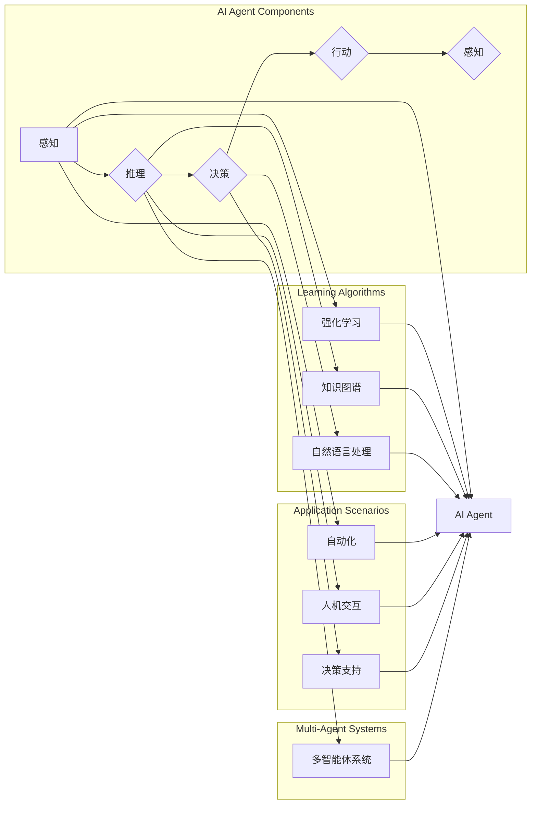

# AI Agent: AI的下一个风口 解决方案与研究方向

> 关键词：AI Agent, 人工智能代理, 机器学习, 强化学习, 智能决策, 机器人, 自动化, 智能系统

## 1. 背景介绍

随着人工智能技术的飞速发展，从最初的符号主义、连接主义到如今的深度学习，人工智能已经渗透到各个领域，改变了我们的生活和工作方式。然而，尽管人工智能在图像识别、自然语言处理等领域取得了显著的成果，但真正能够独立执行复杂任务的智能系统仍然相对罕见。AI Agent，作为人工智能领域的下一个风口，正逐渐成为研究和应用的热点。

### 1.1 问题的由来

传统的基于规则的专家系统和基于模板的聊天机器人虽然能够处理特定任务，但缺乏灵活性和自适应性。而深度学习模型虽然在特定领域表现出色，但往往需要大量的标注数据，且难以解释其决策过程。AI Agent的出现，旨在解决这些问题，通过模仿人类智能行为，实现自主决策和行动。

### 1.2 研究现状

AI Agent的研究已经取得了显著的进展，包括以下方面：

- **强化学习**：通过与环境交互，不断学习和优化策略，实现智能决策。
- **多智能体系统**：多个AI Agent协同工作，共同完成复杂任务。
- **知识图谱**：利用知识图谱技术，为AI Agent提供丰富的背景知识。
- **自然语言处理**：通过自然语言处理技术，使AI Agent能够理解和生成人类语言。

### 1.3 研究意义

AI Agent的研究具有重要的理论意义和应用价值：

- **提高自动化水平**：AI Agent可以应用于自动化领域，提高生产效率和准确性。
- **改善人机交互**：AI Agent可以与人类进行自然交互，提供更便捷的服务。
- **推动智能决策**：AI Agent可以应用于决策支持系统，提供更智能的决策建议。

### 1.4 本文结构

本文将分为以下几个部分：

- 介绍AI Agent的核心概念与联系。
- 阐述AI Agent的核心算法原理和具体操作步骤。
- 分析AI Agent的数学模型和公式。
- 提供AI Agent的代码实例和详细解释。
- 探讨AI Agent的实际应用场景和未来展望。
- 推荐AI Agent相关的学习资源和开发工具。
- 总结AI Agent的未来发展趋势与挑战。

## 2. 核心概念与联系

### 2.1 核心概念

- **AI Agent**：具备感知、推理、决策和行动能力的智能实体。
- **强化学习**：通过与环境交互，不断学习和优化策略的机器学习范式。
- **多智能体系统**：由多个AI Agent组成的系统，能够协同完成复杂任务。
- **知识图谱**：一种结构化的知识表示方法，用于存储、管理和查询知识。
- **自然语言处理**：使计算机能够理解、解释和生成人类语言的技术。

### 2.2 Mermaid 流程图



### 2.3 关系联系

AI Agent是多个组件和算法的综合体，通过感知环境信息、进行推理、做出决策并执行行动，实现智能行为。强化学习、知识图谱和自然语言处理等算法为AI Agent提供了强大的学习能力和知识支持。AI Agent可以应用于自动化、人机交互、决策支持等多个场景，通过多智能体系统协同工作，实现更复杂的任务。

## 3. 核心算法原理 & 具体操作步骤

### 3.1 算法原理概述

AI Agent的核心算法主要包括：

- **感知算法**：用于获取环境信息，如图像、声音、文本等。
- **推理算法**：基于感知信息，进行逻辑推理和知识推理。
- **决策算法**：根据推理结果，选择合适的行动策略。
- **行动算法**：执行选择的行动，并感知行动结果。

### 3.2 算法步骤详解

1. **感知**：AI Agent通过传感器（如摄像头、麦克风、传感器等）获取环境信息。
2. **推理**：基于感知信息和知识库，进行逻辑推理和知识推理，生成中间结果。
3. **决策**：根据推理结果，选择合适的行动策略，如动作选择、参数设置等。
4. **行动**：执行选择的行动，如移动、发送消息等。
5. **感知**：感知行动结果，并返回步骤1。

### 3.3 算法优缺点

- **优点**：
  - 自主性强，能够独立执行任务。
  - 可扩展性强，可以适应不同的任务和环境。
  - 具备学习和适应能力，能够从经验中学习并改进性能。
- **缺点**：
  - 算法复杂，需要大量的计算资源。
  - 需要大量的训练数据，特别是对于复杂的任务。
  - 决策过程难以解释，可能导致不可预测的行为。

### 3.4 算法应用领域

AI Agent可以应用于以下领域：

- **工业自动化**：如机器人、自动化生产线等。
- **智能交通**：如自动驾驶、智能交通信号控制等。
- **智能家居**：如智能助手、智能家居系统等。
- **医疗健康**：如智能医疗诊断、健康管理等。
- **金融服务**：如智能客服、智能投顾等。

## 4. 数学模型和公式 & 详细讲解 & 举例说明

### 4.1 数学模型构建

AI Agent的数学模型主要包括：

- **感知模型**：用于将传感器数据转换为模型可处理的输入。
- **推理模型**：用于处理感知信息，并生成推理结果。
- **决策模型**：用于根据推理结果选择行动策略。
- **行动模型**：用于执行选择的行动。

### 4.2 公式推导过程

以强化学习为例，其核心公式如下：

$$
Q(s,a) = Q(s,a) + \alpha [R + \gamma \max_{a'} Q(s',a') - Q(s,a)]
$$

其中，$Q(s,a)$ 表示在状态 $s$ 下采取行动 $a$ 的预期收益，$R$ 表示采取行动 $a$ 后的立即收益，$\gamma$ 表示未来收益的折扣因子，$\alpha$ 表示学习率。

### 4.3 案例分析与讲解

以自动驾驶为例，AI Agent的感知模型可以使用卷积神经网络（CNN）处理摄像头捕捉的图像数据，推理模型可以使用循环神经网络（RNN）或长短期记忆网络（LSTM）对图像数据进行语义理解，决策模型可以使用强化学习算法根据当前状态和语义理解选择合适的行动策略，行动模型可以控制汽车的加速、转向等动作。

## 5. 项目实践：代码实例和详细解释说明

### 5.1 开发环境搭建

为了实现AI Agent，我们需要搭建以下开发环境：

- 编程语言：Python
- 框架：TensorFlow或PyTorch
- 工具：Jupyter Notebook或PyCharm

### 5.2 源代码详细实现

以下是一个简单的AI Agent示例，使用TensorFlow框架实现：

```python
import tensorflow as tf
from tensorflow.keras.models import Sequential
from tensorflow.keras.layers import Dense, LSTM, Conv2D, Flatten

class AutonomousDrivingAgent:
    def __init__(self):
        self.model = Sequential([
            Conv2D(64, kernel_size=(3, 3), activation='relu', input_shape=(64, 64, 3)),
            Flatten(),
            LSTM(64),
            Dense(64, activation='relu'),
            Dense(4, activation='softmax')  # 4个方向：上、下、左、右
        ])
        self.model.compile(optimizer='adam', loss='categorical_crossentropy')

    def train(self, X, y):
        self.model.fit(X, y, epochs=10, batch_size=32)

    def predict(self, X):
        return self.model.predict(X)
```

### 5.3 代码解读与分析

上述代码定义了一个简单的自动驾驶AI Agent，包含以下部分：

- **感知模型**：使用CNN处理图像数据。
- **推理模型**：使用LSTM对图像数据进行语义理解。
- **决策模型**：使用Dense层进行分类，选择行驶方向。
- **训练**：使用训练数据进行模型训练。
- **预测**：使用测试数据进行模型预测。

### 5.4 运行结果展示

在实际应用中，我们需要收集大量的自动驾驶数据，包括图像和对应的方向标签。通过训练和测试，我们可以评估AI Agent的性能。

## 6. 实际应用场景

### 6.1 自动驾驶

自动驾驶是AI Agent最典型的应用场景之一。通过感知周围环境、进行推理和决策，AI Agent可以控制汽车行驶，实现自动驾驶。

### 6.2 智能客服

AI Agent可以应用于智能客服系统，通过理解用户提问、进行推理和决策，为用户提供个性化的服务。

### 6.3 智能家居

AI Agent可以应用于智能家居系统，通过感知环境变化、进行推理和决策，实现智能控制家居设备。

### 6.4 未来应用展望

随着AI Agent技术的不断发展，其在更多领域的应用前景广阔，如：

- **医疗健康**：如智能诊断、健康管理、药物研发等。
- **金融服务**：如智能投顾、风险评估、欺诈检测等。
- **教育**：如个性化学习、智能教学、学习评价等。
- **娱乐**：如智能游戏、虚拟助手、智能内容推荐等。

## 7. 工具和资源推荐

### 7.1 学习资源推荐

- **书籍**：
  - 《深度学习》（Goodfellow et al.）
  - 《强化学习》（Sutton and Barto）
- **在线课程**：
  - Coursera上的《机器学习》、《深度学习》等课程
  - Udacity上的《深度学习工程师纳米学位》
- **技术博客**：
  - TensorFlow官方博客
  - PyTorch官方博客

### 7.2 开发工具推荐

- **编程语言**：Python
- **框架**：TensorFlow、PyTorch
- **工具**：Jupyter Notebook、PyCharm

### 7.3 相关论文推荐

- **强化学习**：
  - Q-Learning (Watkins and Dayan)
  - Deep Q-Network (Mnih et al.)
- **多智能体系统**：
  - Multi-Agent Reinforcement Learning (Baird)
  - Distributed Reinforcement Learning (Littman)

## 8. 总结：未来发展趋势与挑战

### 8.1 研究成果总结

AI Agent作为人工智能领域的下一个风口，已经取得了显著的进展，并在多个领域展现出巨大的应用潜力。然而，AI Agent的研究仍面临诸多挑战，需要持续投入研究。

### 8.2 未来发展趋势

- **多智能体协同**：多智能体系统将更加成熟，实现更加复杂的任务。
- **知识图谱融合**：AI Agent将融合知识图谱技术，具备更强的知识推理能力。
- **自然语言处理**：AI Agent将更好地理解人类语言，实现更自然的人机交互。
- **强化学习**：强化学习算法将更加高效，实现更加智能的决策。

### 8.3 面临的挑战

- **数据质量**：高质量的数据对于AI Agent的训练至关重要。
- **模型可解释性**：提高AI Agent的决策过程可解释性，增强用户信任。
- **安全性和可靠性**：确保AI Agent的行为符合伦理道德，保证系统的安全性。

### 8.4 研究展望

随着AI Agent技术的不断发展，其在更多领域的应用前景将更加广阔。未来，AI Agent将成为人工智能领域的重要发展方向，为人类社会带来更多创新和变革。

## 9. 附录：常见问题与解答

**Q1：AI Agent与机器人有什么区别？**

A：AI Agent是机器人的一部分，负责机器人的感知、推理、决策和行动。而机器人是一个包含AI Agent的物理实体，负责执行具体的任务。

**Q2：AI Agent需要大量数据吗？**

A：AI Agent的训练需要一定量的数据，但相对于深度学习模型，AI Agent的数据需求相对较低，特别是对于强化学习而言。

**Q3：AI Agent可以应用于哪些领域？**

A：AI Agent可以应用于多个领域，如自动驾驶、智能客服、智能家居、医疗健康、金融服务等。

**Q4：AI Agent的安全性和可靠性如何保证？**

A：确保AI Agent的安全性和可靠性需要从多个方面入手，如数据安全、算法安全、系统安全等。

**Q5：AI Agent的研究前景如何？**

A：AI Agent作为人工智能领域的下一个风口，具有广阔的研究前景和应用价值，将在未来发挥越来越重要的作用。

---

作者：禅与计算机程序设计艺术 / Zen and the Art of Computer Programming