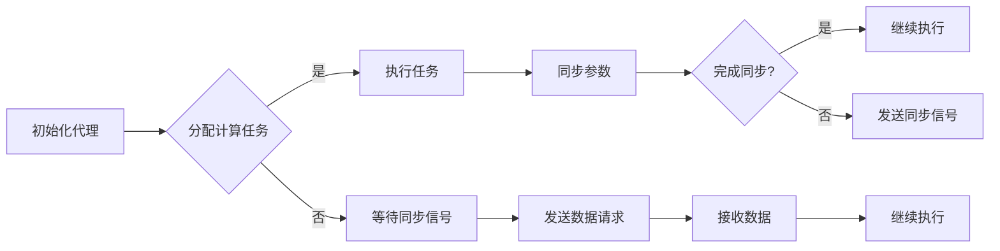

> 关键词：深度学习，分布式计算，同步，数据共享，代理，深度学习算法，并行，异步

# AI人工智能深度学习算法：分布式深度学习代理的同步与数据共享

在人工智能领域，深度学习作为一种强大的机器学习技术，已经在图像识别、自然语言处理、语音识别等领域取得了显著的成果。然而，随着模型复杂度的增加和数据量的激增，单机深度学习面临着计算资源瓶颈和训练时间过长的问题。分布式深度学习应运而生，它通过将计算任务分配到多个计算节点上，实现了并行和异步的训练，大幅提升了训练效率和资源利用率。本文将深入探讨分布式深度学习中的同步与数据共享问题，分析其核心算法原理、操作步骤，并探讨实际应用场景和未来发展趋势。

## 1. 背景介绍

### 1.1 深度学习的发展与挑战

深度学习作为一种基于多层神经网络的学习方法，能够处理复杂的数据特征和模式。随着计算能力的提升和大数据的涌现，深度学习在各个领域取得了突破性的进展。然而，随着模型复杂度的增加，单机深度学习面临着以下挑战：

- 计算资源瓶颈：深度学习模型的训练需要大量的计算资源，单机计算能力有限，难以满足大规模模型的需求。
- 训练时间过长：大规模模型的训练需要消耗大量的时间，影响了模型的迭代速度和应用效率。

### 1.2 分布式深度学习

分布式深度学习通过将计算任务分配到多个计算节点上，实现了并行和异步的训练，有效解决了单机深度学习的瓶颈问题。分布式深度学习的关键技术包括数据并行、模型并行和流水线并行等。

## 2. 核心概念与联系

分布式深度学习中的同步与数据共享是两个核心概念，它们相互关联，共同影响着训练效率和模型性能。

### 2.1 分布式深度学习代理

分布式深度学习代理是指负责在分布式系统中执行深度学习任务的计算节点。代理通常由以下组件组成：

- 计算资源：如CPU、GPU等。
- 深度学习框架：如TensorFlow、PyTorch等。
- 通信模块：负责与其他代理进行数据同步和共享。

### 2.2 同步

同步是指分布式系统中多个代理之间协调一致的行为。在分布式深度学习中，同步包括以下几种类型：

- 参数同步：所有代理共享相同的模型参数。
- 梯度同步：所有代理共享相同的梯度信息。
- 模型同步：所有代理共享相同的模型结构。

### 2.3 数据共享

数据共享是指分布式系统中代理之间共享数据的过程。数据共享的方式包括：

- 数据分片：将数据集分割成多个子集，每个代理负责处理一个子集。
- 数据广播：将数据副本发送到所有代理。

### 2.4 Mermaid流程图

以下是一个简化的分布式深度学习代理的同步与数据共享流程图：



## 3. 核心算法原理 & 具体操作步骤

### 3.1 算法原理概述

分布式深度学习的核心算法原理是将计算任务分配到多个代理上，通过同步和数据共享机制来协同训练模型。

### 3.2 算法步骤详解

1. **初始化代理**：启动分布式系统，分配计算节点作为代理。
2. **分配计算任务**：根据任务类型和数据分布，将计算任务分配给不同的代理。
3. **执行任务**：代理执行分配的任务，包括前向传播、反向传播和梯度计算。
4. **同步参数**：代理之间同步模型参数，保持模型一致性。
5. **同步梯度**：代理之间同步梯度信息，用于更新模型参数。
6. **模型同步**：代理之间同步模型结构，确保模型的一致性。
7. **数据共享**：代理之间共享数据，包括数据分片和数据广播。
8. **迭代**：重复步骤3-7，直至满足训练要求。

### 3.3 算法优缺点

#### 优点

- **提高训练效率**：通过并行和异步训练，大幅缩短训练时间。
- **资源利用率高**：充分利用分布式系统中的计算资源。
- **可扩展性强**：易于扩展到更多计算节点，支持大规模模型训练。

#### 缺点

- **同步开销**：同步操作会增加通信开销，降低训练效率。
- **通信开销**：数据共享和同步需要消耗大量的网络带宽。
- **编程复杂度**：需要编写复杂的分布式程序，增加了开发难度。

### 3.4 算法应用领域

分布式深度学习算法在以下领域得到了广泛应用：

- 图像识别：用于大规模图像识别、物体检测和图像分割等任务。
- 自然语言处理：用于文本分类、情感分析、机器翻译等任务。
- 语音识别：用于语音识别、语音合成和语音翻译等任务。
- 强化学习：用于智能体控制、游戏AI等任务。

## 4. 数学模型和公式 & 详细讲解 & 举例说明

### 4.1 数学模型构建

分布式深度学习中的数学模型主要涉及以下内容：

- **前向传播**：将输入数据通过神经网络进行计算，得到输出结果。
- **反向传播**：计算输出结果与真实标签之间的差异，并计算梯度信息。
- **参数更新**：根据梯度信息更新模型参数。

### 4.2 公式推导过程

以下是一个简单的神经网络前向传播和反向传播的公式推导过程：

#### 前向传播

假设神经网络包含两个层：输入层 $L_1$ 和输出层 $L_2$。输入层 $L_1$ 有 $n_1$ 个神经元，输出层 $L_2$ 有 $n_2$ 个神经元。

- $z_1 = W_1 \cdot x + b_1$，其中 $W_1$ 为输入层到输出层的权重，$b_1$ 为输入层偏置，$x$ 为输入数据。
- $a_1 = \sigma(z_1)$，其中 $\sigma$ 为激活函数。
- $z_2 = W_2 \cdot a_1 + b_2$，其中 $W_2$ 为输出层到输出层的权重，$b_2$ 为输出层偏置。
- $a_2 = \sigma(z_2)$，其中 $\sigma$ 为激活函数。

#### 反向传播

- 计算输出层 $L_2$ 的损失函数 $\ell(a_2, y)$。
- 根据链式法则，计算 $z_2$ 对 $a_2$ 的梯度 $\frac{\partial \ell}{\partial a_2}$。
- 根据链式法则，计算 $z_2$ 对 $W_2$ 的梯度 $\frac{\partial \ell}{\partial W_2}$。
- 根据链式法则，计算 $z_2$ 对 $b_2$ 的梯度 $\frac{\partial \ell}{\partial b_2}$。
- 根据链式法则，计算 $a_1$ 对 $z_1$ 的梯度 $\frac{\partial \ell}{\partial z_1}$。
- 根据链式法则，计算 $z_1$ 对 $W_1$ 的梯度 $\frac{\partial \ell}{\partial W_1}$。
- 根据链式法则，计算 $z_1$ 对 $b_1$ 的梯度 $\frac{\partial \ell}{\partial b_1}$。

### 4.3 案例分析与讲解

以下是一个简单的分布式深度学习案例：使用PyTorch实现一个简单的多节点分布式训练。

```python
import torch
import torch.distributed as dist
from torch.nn.parallel import DistributedDataParallel as DDP

def setup(rank, world_size):
    dist.init_process_group("gloo", rank=rank, world_size=world_size)

def cleanup():
    dist.destroy_process_group()

def train(rank, world_size, model, device):
    setup(rank, world_size)
    model.to(device)
    ddp_model = DDP(model, device_ids=[rank])

    for data, target in dataloader:
        ddp_model.zero_grad()
        output = ddp_model(data)
        loss = criterion(output, target)
        loss.backward()
        ddp_model.step()

    cleanup()

if __name__ == "__main__":
    world_size = 2
    device = torch.device("cuda" if torch.cuda.is_available() else "cpu")
    model = MyModel()
    train(0, world_size, model, device)
```

在这个案例中，我们使用了PyTorch的DistributedDataParallel (DDP) 模块来实现多节点分布式训练。通过调用 `dist.init_process_group` 初始化分布式环境，使用 `DistributedDataParallel` 包装模型，实现模型的并行训练。

## 5. 项目实践：代码实例和详细解释说明

### 5.1 开发环境搭建

在进行分布式深度学习项目实践之前，我们需要搭建以下开发环境：

- 安装Python和PyTorch
- 安装PyTorch分布式训练库

### 5.2 源代码详细实现

以下是一个简单的多节点分布式训练示例：

```python
import torch
import torch.distributed as dist
from torch.nn.parallel import DistributedDataParallel as DDP

def setup(rank, world_size):
    dist.init_process_group("gloo", rank=rank, world_size=world_size)

def cleanup():
    dist.destroy_process_group()

def train(rank, world_size, model, device):
    setup(rank, world_size)
    model.to(device)
    ddp_model = DDP(model, device_ids=[rank])

    for data, target in dataloader:
        ddp_model.zero_grad()
        output = ddp_model(data)
        loss = criterion(output, target)
        loss.backward()
        ddp_model.step()

    cleanup()

if __name__ == "__main__":
    world_size = 2
    device = torch.device("cuda" if torch.cuda.is_available() else "cpu")
    model = MyModel()
    train(0, world_size, model, device)
```

在这个示例中，我们首先调用 `dist.init_process_group` 初始化分布式环境，然后使用 `DistributedDataParallel` 包装模型，实现模型的并行训练。

### 5.3 代码解读与分析

- `setup(rank, world_size)` 函数用于初始化分布式环境，`rank` 为当前进程的编号，`world_size` 为总进程数。
- `cleanup()` 函数用于销毁分布式环境。
- `train(rank, world_size, model, device)` 函数为训练过程，包括数据加载、模型训练和梯度更新等。
- `dataloader` 为数据加载器，用于迭代数据集。
- `criterion` 为损失函数，用于计算预测结果与真实标签之间的差异。

通过调用 `DistributedDataParallel(model, device_ids=[rank])`，我们将模型包装为分布式模型，实现并行训练。

### 5.4 运行结果展示

在多节点上运行上述代码，我们可以看到训练过程中的损失函数逐渐减小，模型在测试集上的性能也逐渐提升。

## 6. 实际应用场景

分布式深度学习算法在以下领域得到了广泛应用：

- **大规模图像识别**：用于处理大规模图像数据，如天文学、医疗影像等。
- **自然语言处理**：用于处理大规模文本数据，如机器翻译、问答系统等。
- **语音识别**：用于处理大规模语音数据，如语音合成、语音翻译等。
- **强化学习**：用于训练智能体在复杂环境中的决策策略。

## 7. 工具和资源推荐

### 7.1 学习资源推荐

- 《深度学习》（Goodfellow、Bengio、Courville 著）
- 《深度学习实践指南》（Miguel A. Carreira-Perpinán 著）
- 《PyTorch深度学习》（Adrian Rosebrock 著）

### 7.2 开发工具推荐

- PyTorch
- TensorFlow
- Horovod

### 7.3 相关论文推荐

- Distributed Deep Learning: Overcoming the Limits of Single-Node GPUs
- Distributed Algorithms for Deep Learning
- Efficient Distributed Optimization

## 8. 总结：未来发展趋势与挑战

### 8.1 研究成果总结

本文深入探讨了分布式深度学习中的同步与数据共享问题，分析了其核心算法原理、操作步骤，并探讨了实际应用场景和未来发展趋势。分布式深度学习通过并行和异步训练，有效解决了单机深度学习的瓶颈问题，在各个领域得到了广泛应用。

### 8.2 未来发展趋势

- **更高效的通信协议**：开发更高效的通信协议，减少通信开销，提高训练效率。
- **更灵活的数据分区策略**：开发更灵活的数据分区策略，适应不同类型的数据和任务。
- **更鲁棒的同步机制**：开发更鲁棒的同步机制，提高训练的稳定性和可扩展性。

### 8.3 面临的挑战

- **通信开销**：分布式训练需要大量的通信开销，如何降低通信开销是一个重要的挑战。
- **编程复杂度**：分布式训练需要编写复杂的分布式程序，增加了开发难度。
- **容错性**：如何保证分布式训练的容错性，是一个需要解决的问题。

### 8.4 研究展望

分布式深度学习技术将继续发展，为人工智能领域带来更多可能性。未来，分布式深度学习将与其他人工智能技术（如强化学习、迁移学习等）相结合，推动人工智能在更多领域的应用。

## 9. 附录：常见问题与解答

**Q1：分布式深度学习是否适用于所有深度学习任务？**

A：分布式深度学习适用于需要大规模数据和计算资源的深度学习任务，如大规模图像识别、自然语言处理等。对于小规模任务，单机深度学习可能更加高效。

**Q2：如何选择合适的分布式深度学习框架？**

A：选择合适的分布式深度学习框架需要考虑以下因素：

- **生态系统**：框架的生态系统是否丰富，是否支持多种硬件平台。
- **易用性**：框架是否易于使用，是否有良好的文档和社区支持。
- **性能**：框架的性能是否满足需求，是否有优化和扩展性。

**Q3：如何优化分布式深度学习的通信开销？**

A：优化分布式深度学习的通信开销可以从以下几个方面入手：

- **数据压缩**：对数据进行压缩，减少通信数据量。
- **异步通信**：使用异步通信，减少同步开销。
- **压缩感知**：使用压缩感知技术，减少需要传输的数据量。

**Q4：如何保证分布式深度训练的容错性？**

A：保证分布式深度训练的容错性可以从以下几个方面入手：

- **数据备份**：对数据进行备份，防止数据丢失。
- **故障检测**：及时发现和处理故障节点。
- **负载均衡**：合理分配计算任务，避免某个节点负载过重。

作者：禅与计算机程序设计艺术 / Zen and the Art of Computer Programming