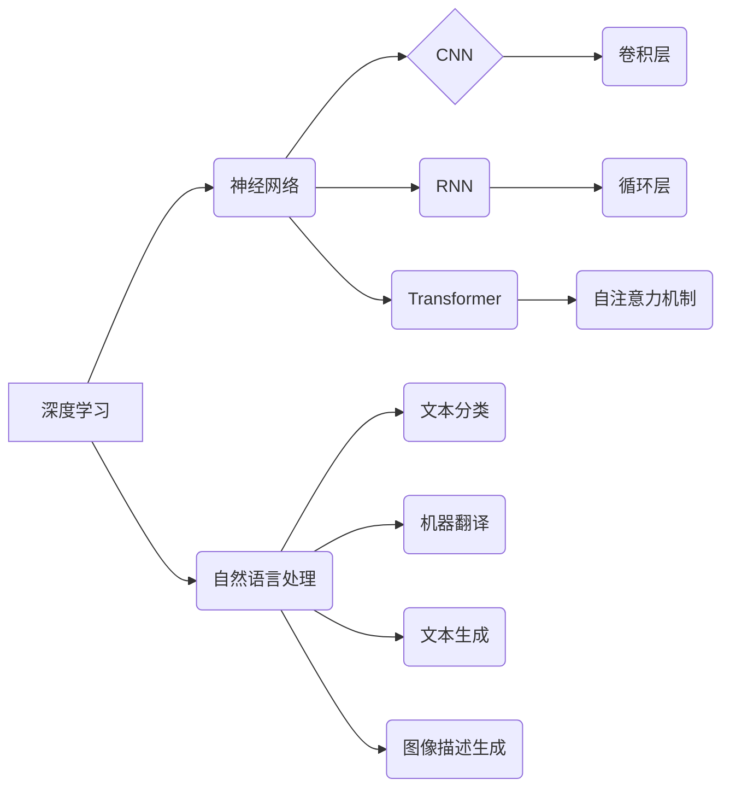

# Andrej Karpathy：人工智能的未来挑战

> 关键词：Andrej Karpathy, 人工智能，深度学习，神经符号主义，未来挑战，认知智能，伦理问题

## 1. 背景介绍

Andrej Karpathy 是一位杰出的计算机科学家，以其在深度学习和自然语言处理领域的贡献而闻名。他的工作不仅推动了人工智能技术的进步，也引发了对于人工智能未来挑战的深刻思考。本文将深入探讨Andrej Karpathy的观点，分析人工智能领域的未来挑战，并探讨如何应对这些挑战。

### 1.1 Andrej Karpathy 的贡献

Andrej Karpathy 的研究涵盖了从神经网络架构到自然语言处理的多个方面。他的工作包括：

- **神经网络架构研究**：在卷积神经网络（CNN）和循环神经网络（RNN）的基础上，Karpathy 推动了神经网络架构的发展，尤其是在自然语言处理领域。

- **自然语言处理**：他在图像描述生成、机器翻译和文本生成等自然语言处理任务中取得了显著成果。

- **开源项目和工具**：Karpathy 是 TensorFlow 的早期贡献者，并开发了多个开源项目，如 `char-rnn`，为深度学习社区做出了贡献。

### 1.2 人工智能的未来挑战

随着人工智能技术的快速发展，Andrej Karpathy 也提出了人工智能未来可能面临的挑战，包括技术挑战和伦理挑战。

## 2. 核心概念与联系

### 2.1 核心概念原理和架构的 Mermaid 流程图



### 2.2 核心概念联系

- **深度学习**是人工智能的核心技术，它通过模拟人脑神经网络的工作原理，使计算机能够学习和执行复杂的任务。
- **神经网络**是深度学习的基础，包括卷积神经网络（CNN）、循环神经网络（RNN）和Transformer等。
- **自然语言处理**是深度学习在人工智能领域的应用之一，涵盖了文本分类、机器翻译、文本生成和图像描述生成等多个任务。

## 3. 核心算法原理 & 具体操作步骤

### 3.1 算法原理概述

人工智能的核心算法包括神经网络架构、优化算法和损失函数等。

### 3.2 算法步骤详解

1. **数据预处理**：清洗、标注和格式化数据，以适应模型训练。
2. **模型构建**：选择合适的神经网络架构，如CNN、RNN或Transformer。
3. **模型训练**：使用优化算法（如SGD、Adam等）和损失函数（如交叉熵、均方误差等）来训练模型。
4. **模型评估**：在测试集上评估模型性能，调整超参数和模型结构以提升性能。

### 3.3 算法优缺点

- **优点**：能够处理复杂的任务，如图像识别、语音识别和自然语言处理。
- **缺点**：需要大量的数据和计算资源，对数据质量敏感。

### 3.4 算法应用领域

人工智能算法广泛应用于图像识别、语音识别、自然语言处理、医疗诊断和自动驾驶等领域。

## 4. 数学模型和公式 & 详细讲解 & 举例说明

### 4.1 数学模型构建

神经网络通常由多个层组成，包括输入层、隐藏层和输出层。每个层由神经元组成，神经元之间通过权重连接。

### 4.2 公式推导过程

神经元的激活函数通常使用Sigmoid、ReLU或Tanh等。

$$
\text{激活函数}(x) = \frac{1}{1 + e^{-x}}
$$

### 4.3 案例分析与讲解

以下是一个简单的神经网络模型，用于文本分类任务：

1. 输入层：文本数据经过分词器转换为词向量。
2. 隐藏层：使用多层神经网络，每层使用ReLU激活函数。
3. 输出层：使用softmax激活函数输出概率分布。

## 5. 项目实践：代码实例和详细解释说明

### 5.1 开发环境搭建

使用Python和TensorFlow等工具进行开发。

### 5.2 源代码详细实现

```python
import tensorflow as tf
from tensorflow.keras.models import Sequential
from tensorflow.keras.layers import Embedding, LSTM, Dense

model = Sequential()
model.add(Embedding(input_dim=vocab_size, output_dim=embedding_dim, input_length=max_length))
model.add(LSTM(units=128))
model.add(Dense(num_classes, activation='softmax'))

model.compile(optimizer='adam', loss='categorical_crossentropy', metrics=['accuracy'])
```

### 5.3 代码解读与分析

- 使用 `Embedding` 层将词向量转换为固定大小的向量。
- 使用 `LSTM` 层处理序列数据。
- 使用 `Dense` 层进行分类。

## 6. 实际应用场景

### 6.4 未来应用展望

人工智能将在未来在更多领域得到应用，如：

- **医疗诊断**：辅助医生进行疾病诊断和治疗。
- **自动驾驶**：实现更加安全、可靠的自动驾驶汽车。
- **教育**：个性化学习，提高教育质量。

## 7. 工具和资源推荐

### 7.1 学习资源推荐

- 《深度学习》
- 《神经网络与深度学习》
- 《Python机器学习》

### 7.2 开发工具推荐

- TensorFlow
- PyTorch
- Keras

### 7.3 相关论文推荐

- **《Attention is All You Need》**：介绍了Transformer模型。
- **《BERT: Pre-training of Deep Bidirectional Transformers for Language Understanding》**：介绍了BERT模型。
- **《Generative Adversarial Nets》**：介绍了GANs。

## 8. 总结：未来发展趋势与挑战

### 8.1 研究成果总结

人工智能领域取得了显著的进展，但仍然面临着许多挑战。

### 8.2 未来发展趋势

- **多模态学习**：结合文本、图像和音频等多模态信息。
- **可解释性**：提高模型的可解释性，使其决策过程更加透明。
- **可解释性**：提高模型的可解释性，使其决策过程更加透明。

### 8.3 面临的挑战

- **数据隐私**：如何保护用户数据隐私。
- **偏见和歧视**：如何避免模型在训练过程中学习到偏见和歧视。
- **伦理问题**：如何确保人工智能技术的伦理使用。

### 8.4 研究展望

未来的研究需要关注以下方面：

- **可解释性**：开发可解释的AI模型。
- **可信赖性**：提高AI的可靠性和可信度。
- **伦理和法规**：制定AI的伦理和法规标准。

## 9. 附录：常见问题与解答

**Q1：人工智能将取代人类吗？**

A: 人工智能技术将会改变许多行业和职业，但不会完全取代人类。AI将会成为人类的助手，提高生产效率，创造新的就业机会。

**Q2：人工智能技术有哪些伦理问题？**

A: 人工智能技术可能引发数据隐私、偏见和歧视、失业等伦理问题。需要制定相应的伦理和法规标准来规范AI技术的使用。

**Q3：人工智能未来的发展趋势是什么？**

A: 人工智能未来的发展趋势包括多模态学习、可解释性、可信赖性和伦理法规等方面。

作者：禅与计算机程序设计艺术 / Zen and the Art of Computer Programming