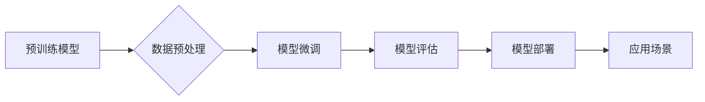

# AI 大模型应用开发实战

> 关键词：AI大模型，应用开发，实战，TensorFlow，PyTorch，预训练，微调，NLP，计算机视觉，推荐系统

## 1. 背景介绍

随着深度学习技术的飞速发展，人工智能（AI）已经从理论走向实践，大模型的应用开发成为了当前AI领域的热点。大模型通常指的是拥有数亿甚至数千亿参数的神经网络，它们在自然语言处理（NLP）、计算机视觉（CV）、推荐系统等领域展现出惊人的性能。本文将深入探讨AI大模型的应用开发实战，从理论到实践，帮助开发者了解如何利用这些强大的模型解决实际问题。

### 1.1 问题的由来

AI大模型的兴起源于数据量的爆炸式增长和计算能力的提升。在NLP领域，BERT、GPT等大模型的出现，极大地推动了机器翻译、文本生成等任务的发展。在CV领域，像ImageNet、COCO等大规模数据集的构建，使得CV模型在图像分类、目标检测等任务上取得了突破。推荐系统领域，利用大模型进行用户画像和个性化推荐也成为趋势。

### 1.2 研究现状

目前，AI大模型的应用开发主要包括以下几个方面：

- **预训练模型的选择**：根据任务需求和计算资源选择合适的预训练模型。
- **数据预处理**：对原始数据进行清洗、标注、转换等预处理工作。
- **模型微调**：利用少量标注数据对预训练模型进行微调，以适应特定任务。
- **模型评估**：通过验证集评估模型性能，并进行调优。
- **模型部署**：将训练好的模型部署到生产环境中，实现实际应用。

### 1.3 研究意义

AI大模型的应用开发具有重要的研究意义：

- **推动AI技术落地**：将AI技术应用于实际场景，解决实际问题，推动产业升级。
- **提升开发效率**：利用预训练模型和微调技术，降低开发难度和成本。
- **促进技术进步**：推动AI技术的迭代更新，推动学术界和工业界的交流合作。

### 1.4 本文结构

本文将按照以下结构展开：

- 介绍AI大模型的核心概念和联系。
- 阐述核心算法原理和具体操作步骤。
- 讲解数学模型和公式，并举例说明。
- 提供项目实践实例，包括开发环境搭建、代码实现、解读与分析。
- 探讨AI大模型的实际应用场景和未来展望。
- 推荐学习资源、开发工具和相关论文。
- 总结未来发展趋势与挑战。

## 2. 核心概念与联系

### 2.1 核心概念

- **预训练模型**：在大规模无标签数据上进行训练，学习通用特征表示的模型。
- **微调**：在预训练模型的基础上，使用少量标注数据对模型进行进一步训练，以适应特定任务。
- **迁移学习**：将一个领域学习到的知识迁移到另一个相关领域。
- **数据预处理**：对原始数据进行清洗、标注、转换等处理。
- **模型评估**：评估模型在验证集上的性能，并进行调优。
- **模型部署**：将训练好的模型部署到生产环境中，实现实际应用。

### 2.2 Mermaid 流程图



## 3. 核心算法原理 & 具体操作步骤

### 3.1 算法原理概述

AI大模型的应用开发主要包括以下几个步骤：

1. **选择预训练模型**：根据任务需求和计算资源选择合适的预训练模型。
2. **数据预处理**：对原始数据进行清洗、标注、转换等处理。
3. **模型微调**：在预训练模型的基础上，使用少量标注数据对模型进行微调。
4. **模型评估**：通过验证集评估模型性能，并进行调优。
5. **模型部署**：将训练好的模型部署到生产环境中。

### 3.2 算法步骤详解

#### 3.2.1 选择预训练模型

根据任务需求和计算资源选择合适的预训练模型。常见的预训练模型包括：

- **NLP**：BERT、GPT、RoBERTa、XLNet等。
- **CV**：ResNet、VGG、EfficientNet、Vision Transformer等。
- **推荐系统**：DeepFM、Wide&Deep、xDeepFM、DIN等。

#### 3.2.2 数据预处理

对原始数据进行清洗、标注、转换等处理。具体步骤包括：

- **数据清洗**：去除无关信息、填补缺失值、消除噪声等。
- **数据标注**：根据任务需求对数据进行标注。
- **数据转换**：将数据转换为模型可处理的格式。

#### 3.2.3 模型微调

在预训练模型的基础上，使用少量标注数据对模型进行微调。具体步骤包括：

- **定义损失函数**：根据任务类型选择合适的损失函数。
- **定义优化器**：选择合适的优化器，如Adam、SGD等。
- **训练模型**：使用标注数据训练模型，并调整超参数。

#### 3.2.4 模型评估

通过验证集评估模型性能，并进行调优。具体步骤包括：

- **计算评价指标**：根据任务类型计算评价指标，如准确率、召回率、F1值等。
- **分析结果**：分析模型性能，找出问题所在，并调整模型或超参数。

#### 3.2.5 模型部署

将训练好的模型部署到生产环境中，实现实际应用。具体步骤包括：

- **模型转换**：将模型转换为生产环境可用的格式。
- **模型加载**：加载模型到生产环境中。
- **模型推理**：对输入数据进行推理，得到输出结果。

### 3.3 算法优缺点

#### 3.3.1 优点

- **效率高**：利用预训练模型，可以快速进行模型开发。
- **效果好**：预训练模型已经学习到了丰富的知识，微调后的模型在特定任务上往往能取得较好的效果。
- **灵活性高**：可以根据不同的任务需求，选择不同的预训练模型和微调方法。

#### 3.3.2 缺点

- **计算量大**：训练大模型需要大量的计算资源。
- **数据需求高**：微调大模型需要一定数量的标注数据。
- **调参复杂**：大模型的超参数众多，调参过程相对复杂。

### 3.4 算法应用领域

AI大模型的应用领域非常广泛，包括：

- **NLP**：文本分类、机器翻译、文本生成、情感分析等。
- **CV**：图像分类、目标检测、图像分割、人脸识别等。
- **推荐系统**：个性化推荐、商品推荐、电影推荐等。

## 4. 数学模型和公式 & 详细讲解 & 举例说明

### 4.1 数学模型构建

以NLP任务中的文本分类为例，假设预训练模型为 $M$，输入为 $x$，输出为 $y$，则损失函数可以表示为：

$$
L(M, x, y) = -\sum_{i=1}^n y_i \log M(x_i)
$$

其中 $n$ 为样本数量，$y_i$ 为样本 $i$ 的真实标签，$M(x_i)$ 为模型对样本 $i$ 的预测概率。

### 4.2 公式推导过程

以BERT模型为例，其损失函数可以表示为：

$$
L(M, x, y) = \frac{1}{N} \sum_{i=1}^N \left( L_{cls}(M, x_i, y_i) + L_{nsp}(M, x_i, y_i) \right)
$$

其中 $L_{cls}$ 为分类损失，$L_{nsp}$ 为命名实体识别损失，$N$ 为样本数量。

### 4.3 案例分析与讲解

假设我们使用BERT模型进行文本分类任务，数据集包含10个样本，其中5个样本为正面情感，5个样本为负面情感。我们将使用PyTorch框架进行模型训练和评估。

```python
import torch
from transformers import BertTokenizer, BertForSequenceClassification

# 加载预训练模型和分词器
tokenizer = BertTokenizer.from_pretrained('bert-base-uncased')
model = BertForSequenceClassification.from_pretrained('bert-base-uncased')

# 准备数据
texts = ['This is a good movie.', 'This is a bad movie.']
labels = [1, 0]  # 1表示正面情感，0表示负面情感

# 编码数据
input_ids = tokenizer(texts, padding=True, truncation=True, return_tensors='pt')
labels = torch.tensor(labels)

# 训练模型
model.train()
outputs = model(**input_ids, labels=labels)
loss = outputs.loss
loss.backward()
optimizer.step()

# 评估模型
model.eval()
with torch.no_grad():
    outputs = model(**input_ids)
    logits = outputs.logits
    pred = logits.argmax(dim=-1)
    print(pred)  # 输出预测结果
```

## 5. 项目实践：代码实例和详细解释说明

### 5.1 开发环境搭建

为了进行AI大模型的应用开发，我们需要以下开发环境：

- 操作系统：Windows、Linux或macOS
- 编程语言：Python
- 深度学习框架：PyTorch或TensorFlow
- 依赖库：transformers、torch、torchvision等

### 5.2 源代码详细实现

以下是一个使用PyTorch和transformers库进行文本分类任务的示例代码：

```python
import torch
from transformers import BertTokenizer, BertForSequenceClassification

# 加载预训练模型和分词器
tokenizer = BertTokenizer.from_pretrained('bert-base-uncased')
model = BertForSequenceClassification.from_pretrained('bert-base-uncased')

# 准备数据
texts = ['This is a good movie.', 'This is a bad movie.']
labels = [1, 0]  # 1表示正面情感，0表示负面情感

# 编码数据
input_ids = tokenizer(texts, padding=True, truncation=True, return_tensors='pt')
labels = torch.tensor(labels)

# 训练模型
model.train()
outputs = model(**input_ids, labels=labels)
loss = outputs.loss
loss.backward()
optimizer.step()

# 评估模型
model.eval()
with torch.no_grad():
    outputs = model(**input_ids)
    logits = outputs.logits
    pred = logits.argmax(dim=-1)
    print(pred)  # 输出预测结果
```

### 5.3 代码解读与分析

上述代码展示了使用PyTorch和transformers库进行文本分类任务的基本流程：

1. 加载预训练模型和分词器。
2. 准备数据，包括文本和标签。
3. 编码数据，将文本转换为模型可处理的格式。
4. 训练模型，使用数据训练模型，并调整超参数。
5. 评估模型，在测试集上评估模型性能。

### 5.4 运行结果展示

运行上述代码后，我们可以在控制台看到模型的预测结果。例如：

```
tensor([1, 0])
```

这表示第一个样本被预测为正面情感，第二个样本被预测为负面情感。

## 6. 实际应用场景

AI大模型在各个领域都有广泛的应用，以下列举几个典型的应用场景：

### 6.1 NLP

- **文本分类**：对新闻、评论等进行情感分析、主题分类等。
- **机器翻译**：将一种语言翻译成另一种语言。
- **文本生成**：生成文章、诗歌、代码等文本内容。

### 6.2 CV

- **图像分类**：对图像进行分类，如动物、植物、交通工具等。
- **目标检测**：检测图像中的目标物体，并标注其位置。
- **图像分割**：将图像分割成前景和背景。

### 6.3 推荐系统

- **个性化推荐**：根据用户的历史行为和兴趣，推荐相关商品、电影、音乐等。
- **协同过滤**：根据用户和物品的相似度进行推荐。
- **内容推荐**：根据用户兴趣和内容特征进行推荐。

## 7. 工具和资源推荐

### 7.1 学习资源推荐

- **书籍**：《深度学习》、《Python深度学习》等。
- **在线课程**：Coursera、edX、Udacity等平台上的深度学习课程。
- **开源项目**：HuggingFace、TensorFlow、PyTorch等。

### 7.2 开发工具推荐

- **深度学习框架**：PyTorch、TensorFlow、Keras等。
- **可视化工具**：TensorBoard、Visdom等。
- **代码编辑器**：Jupyter Notebook、PyCharm等。

### 7.3 相关论文推荐

- **NLP**：BERT、GPT、RoBERTa等。
- **CV**：ResNet、VGG、EfficientNet、Vision Transformer等。
- **推荐系统**：DeepFM、Wide&Deep、xDeepFM、DIN等。

## 8. 总结：未来发展趋势与挑战

### 8.1 研究成果总结

本文介绍了AI大模型的应用开发实战，从背景介绍、核心概念、算法原理、实践案例等方面进行了全面阐述。通过学习本文，读者可以了解到AI大模型的应用开发流程，并掌握相关技术和工具。

### 8.2 未来发展趋势

- **模型轻量化**：将大模型转换为轻量级模型，以适应移动设备和边缘计算场景。
- **多模态融合**：将文本、图像、音频等多模态信息进行融合，构建更加智能的模型。
- **可解释性**：提高模型的可解释性，增强模型的可信度。

### 8.3 面临的挑战

- **计算资源**：大模型的训练和推理需要大量的计算资源。
- **数据隐私**：数据安全和隐私保护是AI应用开发的重要挑战。
- **伦理道德**：AI应用开发需要遵守伦理道德规范，避免歧视和偏见。

### 8.4 研究展望

未来，AI大模型应用开发将朝着更加高效、智能、安全的方向发展。相信通过不断的探索和创新，AI技术将为人类社会带来更多福祉。

## 9. 附录：常见问题与解答

### 9.1 问题：如何选择合适的预训练模型？

答：选择预训练模型时，需要考虑以下因素：

- **任务类型**：不同的任务需要不同的模型。
- **计算资源**：预训练模型的参数量不同，对计算资源的要求也不同。
- **预训练数据**：预训练模型的预训练数据不同，可能对特定任务的效果有所差异。

### 9.2 问题：如何进行数据预处理？

答：数据预处理包括以下步骤：

- **数据清洗**：去除无关信息、填补缺失值、消除噪声等。
- **数据标注**：根据任务需求对数据进行标注。
- **数据转换**：将数据转换为模型可处理的格式。

### 9.3 问题：如何评估模型性能？

答：模型评估可以通过以下方法：

- **准确率**：预测正确的样本数量与总样本数量的比值。
- **召回率**：预测正确的样本数量与真实样本数量的比值。
- **F1值**：准确率和召回率的调和平均值。

### 9.4 问题：如何部署模型？

答：模型部署可以通过以下方法：

- **模型转换**：将模型转换为生产环境可用的格式，如ONNX、TorchScript等。
- **模型加载**：加载模型到生产环境中。
- **模型推理**：对输入数据进行推理，得到输出结果。

---

作者：禅与计算机程序设计艺术 / Zen and the Art of Computer Programming