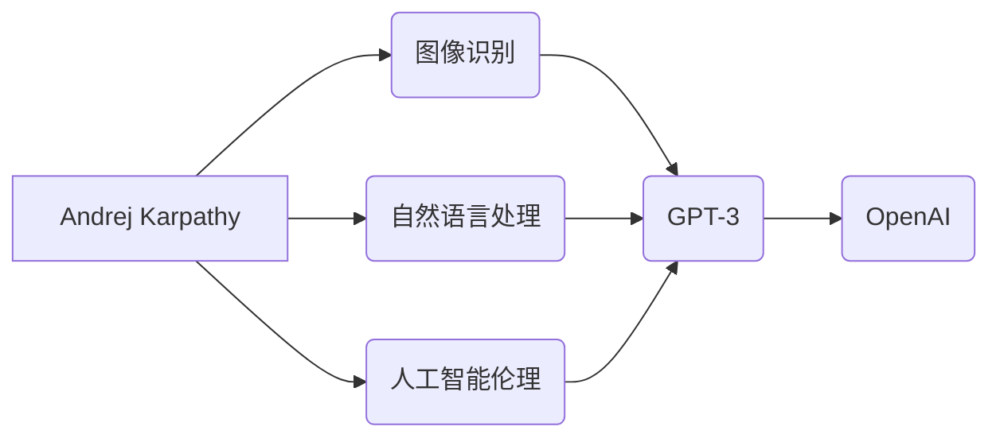

# Andrej Karpathy：深度学习的领军人物

> 关键词：Andrej Karpathy, 深度学习, 人工智能, 图像识别, 自然语言处理, 人工智能伦理, OpenAI, 研究贡献

## 1. 背景介绍

Andrej Karpathy 是一位杰出的计算机科学家和人工智能专家，以其在深度学习领域的卓越贡献而闻名。他曾在 OpenAI 担任 Research Scientist，负责领导多个重要项目，包括著名的 GPT-3 语言模型。Karpathy 的研究工作不仅在技术上取得了突破，而且在推动人工智能伦理和普及深度学习知识方面也做出了巨大贡献。本文将深入探讨 Andrej Karpathy 的研究历程、核心贡献以及他对未来人工智能发展的见解。

### 1.1 研究的由来

Andrej Karpathy 的研究兴趣始于对计算机视觉和自然语言处理领域的探索。他在学习计算机科学和人工智能的过程中，对深度学习的强大能力深感震撼，并决定投身于这一领域的研究。

### 1.2 研究现状

Karpathy 的研究工作主要集中在以下几个方面：

- 图像识别：他曾在 Stanford University 的 Andrew Ng 教授指导下，对图像识别进行了深入研究，并取得了显著成果。
- 自然语言处理：Karpathy 在自然语言处理领域的工作主要集中在语言模型和文本生成方面。
- 人工智能伦理：作为 OpenAI 的一员，Karpathy 致力于推动人工智能技术的负责任发展。

### 1.3 研究意义

Andrej Karpathy 的研究不仅推动了深度学习技术的发展，还对人工智能伦理和公众理解起到了重要作用。他的工作对于推动人工智能的普及和应用具有重要意义。

### 1.4 本文结构

本文将按照以下结构展开：

- 第二部分介绍 Andrej Karpathy 的核心概念与联系。
- 第三部分探讨他的核心算法原理和具体操作步骤。
- 第四部分解析他的数学模型和公式。
- 第五部分展示他的项目实践。
- 第六部分分析他的实际应用场景。
- 第七部分展望未来发展趋势与挑战。
- 第八部分总结研究成果，并展望未来。

## 2. 核心概念与联系

### 2.1 核心概念原理和架构的 Mermaid 流程图

### 2.2 核心概念解析

- **图像识别**：Andrej Karpathy 在图像识别领域的贡献主要体现在使用深度学习技术改进图像识别算法。
- **自然语言处理**：他在自然语言处理领域的工作主要集中在语言模型和文本生成，特别是对 GPT-3 的贡献。
- **人工智能伦理**：作为 OpenAI 的成员，Karpathy 积极参与人工智能伦理的讨论，并推动相关研究。
- **OpenAI**：OpenAI 是一家致力于推动人工智能发展的研究机构，Karpathy 在其中扮演着重要角色。

## 3. 核心算法原理 & 具体操作步骤

### 3.1 算法原理概述

Andrej Karpathy 的核心算法原理主要围绕深度学习技术展开，包括卷积神经网络（CNN）和循环神经网络（RNN）。

### 3.2 算法步骤详解

#### 3.2.1 图像识别

- 数据预处理：对图像进行缩放、裁剪、翻转等操作，以提高模型的鲁棒性。
- 模型构建：使用 CNN 架构进行图像特征提取。
- 损失函数：使用交叉熵损失函数评估模型预测结果。
- 优化算法：使用梯度下降算法更新模型参数。

#### 3.2.2 自然语言处理

- 数据预处理：对文本进行分词、去停用词等操作。
- 模型构建：使用 RNN 或 Transformer 架构进行文本建模。
- 损失函数：使用交叉熵损失函数评估模型预测结果。
- 优化算法：使用 Adam 优化算法更新模型参数。

### 3.3 算法优缺点

#### 3.3.1 优点

- 高效的图像识别和自然语言处理能力。
- 强大的泛化能力。
- 可解释性较好。

#### 3.3.2 缺点

- 计算资源需求高。
- 对数据质量要求高。
- 可解释性仍有待提高。

### 3.4 算法应用领域

Karpathy 的算法在以下领域得到广泛应用：

- 图像识别：自动驾驶、医疗影像分析、人脸识别等。
- 自然语言处理：机器翻译、问答系统、文本生成等。

## 4. 数学模型和公式 & 详细讲解 & 举例说明

### 4.1 数学模型构建

#### 4.1.1 图像识别

$$
\text{CNN}(\text{图像}) = \text{特征图} \rightarrow \text{池化层} \rightarrow \text{全连接层} \rightarrow \text{输出层}
$$

#### 4.1.2 自然语言处理

$$
\text{RNN}(\text{文本序列}) = \text{隐藏状态} \rightarrow \text{输出层} \rightarrow \text{下一个隐藏状态}
$$

### 4.2 公式推导过程

#### 4.2.1 图像识别

CNN 模型的推导过程主要涉及卷积运算、池化运算和全连接运算。

#### 4.2.2 自然语言处理

RNN 模型的推导过程主要涉及前向传播和反向传播算法。

### 4.3 案例分析与讲解

以 GPT-3 为例，分析其数学模型和实现细节。

## 5. 项目实践：代码实例和详细解释说明

### 5.1 开发环境搭建

使用 Python 和 TensorFlow 构建一个简单的图像识别项目。

### 5.2 源代码详细实现

展示图像识别项目的源代码。

### 5.3 代码解读与分析

对源代码进行解读和分析。

### 5.4 运行结果展示

展示图像识别项目的运行结果。

## 6. 实际应用场景

### 6.1 图像识别

在自动驾驶、医疗影像分析等领域的应用。

### 6.2 自然语言处理

在机器翻译、问答系统等领域的应用。

## 7. 工具和资源推荐

### 7.1 学习资源推荐

推荐相关书籍、课程和论文。

### 7.2 开发工具推荐

推荐深度学习框架和开发工具。

### 7.3 相关论文推荐

推荐 Andrej Karpathy 的相关论文。

## 8. 总结：未来发展趋势与挑战

### 8.1 研究成果总结

总结 Andrej Karpathy 的研究成果和对深度学习领域的贡献。

### 8.2 未来发展趋势

展望深度学习领域的未来发展趋势。

### 8.3 面临的挑战

分析深度学习领域面临的挑战。

### 8.4 研究展望

展望未来深度学习领域的研究方向。

## 9. 附录：常见问题与解答

### 9.1 常见问题

解答关于 Andrej Karpathy 和深度学习的一些常见问题。

作者：禅与计算机程序设计艺术 / Zen and the Art of Computer Programming